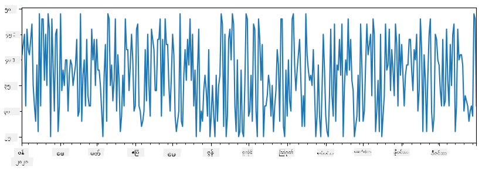
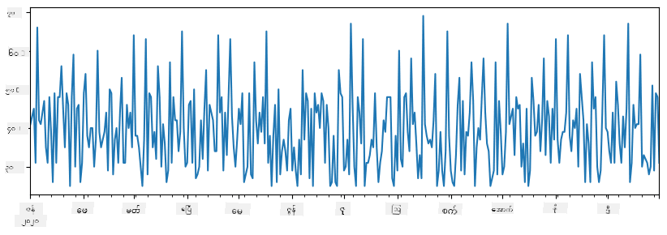
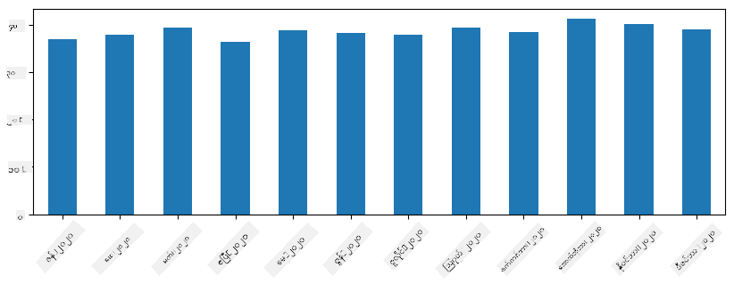
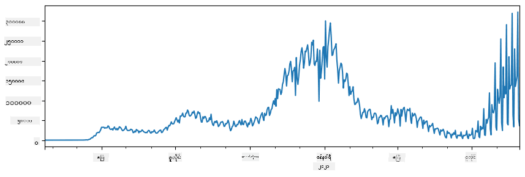
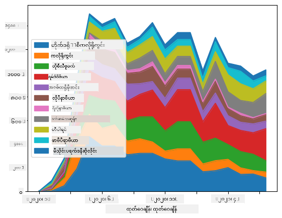

<!--
CO_OP_TRANSLATOR_METADATA:
{
  "original_hash": "116c5d361fbe812e59a73f37ce721d36",
  "translation_date": "2025-08-30T18:09:00+00:00",
  "source_file": "2-Working-With-Data/07-python/README.md",
  "language_code": "my"
}
-->
# ဒေတာနှင့်အလုပ်လုပ်ခြင်း: Python နှင့် Pandas Library

|  ](../../sketchnotes/07-WorkWithPython.png) |
| :-------------------------------------------------------------------------------------------------------: |
|                 Python နှင့်အလုပ်လုပ်ခြင်း - _Sketchnote by [@nitya](https://twitter.com/nitya)_                 |

[](https://youtu.be/dZjWOGbsN4Y)

ဒေတာများကို သိမ်းဆည်းရန်နှင့် query languages အသုံးပြု၍ ရှာဖွေရန်အတွက် databases သည် အလွန်ထိရောက်သောနည်းလမ်းများပေးနိုင်သော်လည်း၊ ဒေတာကို ကိုယ်တိုင်ရေးသားထားသော program ဖြင့် ပြုပြင်ရန်သည် အလွန် flexible ဖြစ်သည်။ အချို့သောအခြေအနေများတွင် database query သည် ပိုထိရောက်နိုင်သော်လည်း၊ SQL ဖြင့် လွယ်ကူစွာလုပ်ဆောင်၍မရသော အလွန်ရှုပ်ထွေးသော ဒေတာပြုပြင်မှုများအတွက် program ရေးသားရန်လိုအပ်နိုင်သည်။

ဒေတာပြုပြင်မှုကို programming language မည်သည့်အမျိုးအစားဖြင့်မဆို ပြုလုပ်နိုင်သော်လည်း၊ ဒေတာနှင့်အလုပ်လုပ်ရန်အထူးသင့်လျော်သော programming languages ရှိသည်။ ဒေတာသိပ္ပံပညာရှင်များသည် အောက်ပါဘာသာစကားများကို အများအားဖြင့်နှစ်သက်ကြသည်-

* **[Python](https://www.python.org/)** - အထွေထွေရည်ရွယ်ချက် programming language ဖြစ်ပြီး၊ ရိုးရှင်းမှုကြောင့် beginner များအတွက် အကောင်းဆုံးရွေးချယ်မှုတစ်ခုအဖြစ်လည်း often သတ်မှတ်ခံရသည်။ Python တွင် practical ပြဿနာများကို ဖြေရှင်းရန်အထောက်အကူပြုသော libraries များစွာပါဝင်သည်။ ဥပမာအားဖြင့် ZIP archive မှ ဒေတာကို extract လုပ်ခြင်း၊ သို့မဟုတ် ပုံကို grayscale သို့ပြောင်းခြင်း။ ဒေတာသိပ္ပံအပြင် Python သည် web development အတွက်လည်း အများအားဖြင့်အသုံးပြုသည်။
* **[R](https://www.r-project.org/)** - statistical data processing အတွက်ထုတ်လုပ်ထားသော traditional toolbox ဖြစ်သည်။ CRAN libraries များစွာပါဝင်သောကြောင့် ဒေတာပြုပြင်မှုအတွက် ရွေးချယ်ရန်ကောင်းသောရွေးချယ်မှုဖြစ်သည်။ သို့သော် R သည် general-purpose programming language မဟုတ်သည့်အပြင် ဒေတာသိပ္ပံနယ်ပယ်အပြင် အခြားနယ်ပယ်များတွင် ရှားရှားပါးပါးအသုံးပြုသည်။
* **[Julia](https://julialang.org/)** - ဒေတာသိပ္ပံအတွက်အထူးထုတ်လုပ်ထားသောဘာသာစကားတစ်ခုဖြစ်သည်။ Python ထက် performance ပိုကောင်းစေရန်ရည်ရွယ်ထားပြီး၊ သိပ္ပံလေ့လာမှုများအတွက် tool ကောင်းတစ်ခုဖြစ်သည်။

ဒီသင်ခန်းစာတွင် Python ကို simple data processing အတွက် အသုံးပြုခြင်းကို အဓိကထားမည်ဖြစ်သည်။ ဘာသာစကားနှင့်အခြေခံကျွမ်းကျင်မှုရှိသည်ဟုယူဆမည်။ Python ကိုပိုမိုနက်နက်ရှိုင်းရှိုင်းလေ့လာလိုပါက အောက်ပါ resources များကို ရည်ညွှန်းနိုင်သည်-

* [Learn Python in a Fun Way with Turtle Graphics and Fractals](https://github.com/shwars/pycourse) - GitHub-based Python Programming အကျဉ်း course
* [Take your First Steps with Python](https://docs.microsoft.com/en-us/learn/paths/python-first-steps/?WT.mc_id=academic-77958-bethanycheum) Microsoft Learn တွင် Learning Path

ဒေတာသည် အမျိုးမျိုးသောပုံစံများဖြင့် ရှိနိုင်သည်။ ဒီသင်ခန်းစာတွင် **tabular data**, **text** နှင့် **images** ဆိုသည့် ဒေတာပုံစံသုံးမျိုးကို စဉ်းစားမည်။

ဒေတာပြုပြင်မှုအတွက် libraries အားလုံးကို အပြည့်အစုံမဖော်ပြဘဲ၊ အချို့သောဥပမာများကိုသာ အဓိကထားမည်။ ဒါက သင်ကို အဓိကအကြောင်းအရာကိုနားလည်စေပြီး၊ လိုအပ်သောအခါတွင် သင့်ပြဿနာများအတွက် ဖြေရှင်းချက်များကို ရှာဖွေရန် နားလည်မှုရရှိစေမည်။

> **အထောက်အကူပြုသောအကြံပေးချက်**: သင်မသိသော ဒေတာအပေါ် operation တစ်ခုကိုလုပ်ဆောင်ရန်လိုအပ်ပါက၊ အင်တာနက်တွင်ရှာဖွေကြည့်ပါ။ [Stackoverflow](https://stackoverflow.com/) တွင် Python ဖြင့်လုပ်ဆောင်နိုင်သော typical tasks များအတွက် code sample များစွာပါဝင်သည်။

## [Pre-lecture quiz](https://purple-hill-04aebfb03.1.azurestaticapps.net/quiz/12)

## Tabular Data နှင့် Dataframes

Relational databases အကြောင်းပြောသောအခါ သင်သည် tabular data ကို ရင်းနှီးပြီးဖြစ်သည်။ ဒေတာများစွာရှိပြီး၊ အမျိုးမျိုးသော tables များတွင်ချိတ်ဆက်ထားသောအခါ SQL ကိုအသုံးပြုရန် make sense ဖြစ်သည်။ သို့သော် အချို့သောအခြေအနေများတွင် table တစ်ခုရှိပြီး၊ ဒေတာအကြောင်း **နားလည်မှု** သို့မဟုတ် **insights** ရရှိရန်လိုအပ်သည်။ ဥပမာအားဖြင့် distribution, correlation between values စသည်တို့။ ဒေတာသိပ္ပံတွင် original data ကို transformation ပြုလုပ်ပြီး visualization လုပ်ရန်လိုအပ်သောအခြေအနေများများစွာရှိသည်။ Python ကိုအသုံးပြု၍ အလွယ်တကူလုပ်ဆောင်နိုင်သည်။

Python တွင် tabular data ကို handle လုပ်ရန် အထောက်အကူပြုသော libraries အရေးကြီးနှစ်ခုရှိသည်-

* **[Pandas](https://pandas.pydata.org/)** - **Dataframes** ကို manipulate လုပ်ရန်အထောက်အကူပြုသည်။ Dataframes သည် relational tables နှင့်ဆင်တူသည်။ Named columns ရှိပြီး၊ rows, columns နှင့် dataframes အပေါ် operation များပြုလုပ်နိုင်သည်။
* **[Numpy](https://numpy.org/)** - **tensors** (multi-dimensional **arrays**) နှင့်အလုပ်လုပ်ရန် library ဖြစ်သည်။ Array သည် တူညီသော underlying type ရှိသော values များပါဝင်ပြီး၊ dataframe ထက် simple ဖြစ်သော်လည်း mathematical operations များပိုမိုပေးနိုင်သည်။

အခြား libraries အချို့ကိုလည်းသိထားသင့်သည်-

* **[Matplotlib](https://matplotlib.org/)** - data visualization နှင့် graph plotting အတွက်အသုံးပြုသည်
* **[SciPy](https://www.scipy.org/)** - probability နှင့် statistics အကြောင်းပြောသောအခါ တွေ့ရှိခဲ့သော additional scientific functions ပါဝင်သော library

Python program ရဲ့အစမှာ libraries များကို import လုပ်ရန် typically အသုံးပြုသော code:
```python
import numpy as np
import pandas as pd
import matplotlib.pyplot as plt
from scipy import ... # you need to specify exact sub-packages that you need
``` 

Pandas သည် အခြေခံ concepts အချို့ကိုအဓိကထားသည်။

### Series 

**Series** သည် list သို့မဟုတ် numpy array နှင့်ဆင်တူသော values များ၏အစဉ်ဖြစ်သည်။ အဓိကကွာခြားချက်မှာ series တွင် **index** ပါဝင်ပြီး၊ series အပေါ် operation (ဥပမာ- add) ပြုလုပ်သောအခါ index ကိုအရေးထားသည်။ Index သည် integer row number (list သို့မဟုတ် array မှ series တစ်ခုဖန်တီးသောအခါ default index) လိုရိုးရှင်းသောအရာဖြစ်နိုင်သလို၊ date interval လိုရှုပ်ထွေးသော structure ဖြစ်နိုင်သည်။

> **Note**: Pandas code အချို့ကို notebook [`notebook.ipynb`](notebook.ipynb) တွင်ပါဝင်သည်။ ဤနေရာတွင် အချို့သောဥပမာများကို outline လုပ်ပြီး၊ notebook အပြည့်အစုံကိုကြည့်ရှုရန်လည်းကြိုဆိုပါသည်။

ဥပမာအားဖြင့်- ကျွန်ုပ်တို့ရဲ့ ice-cream spot ရဲ့ရောင်းအားကို analysis လုပ်လိုသည်။ အချိန်ကာလတစ်ခုအတွင်းရောင်းအားနံပါတ်များ series တစ်ခုကို generate လုပ်မည်:

```python
start_date = "Jan 1, 2020"
end_date = "Mar 31, 2020"
idx = pd.date_range(start_date,end_date)
print(f"Length of index is {len(idx)}")
items_sold = pd.Series(np.random.randint(25,50,size=len(idx)),index=idx)
items_sold.plot()
```


အပတ်စဉ် ကျွန်ုပ်တို့သည် party တစ်ခုကိုကျင်းပပြီး၊ party အတွက် ice-cream packs 10 ခုကိုထပ်ယူသည်။ အပတ်အလိုက် index ပြုလုပ်ထားသော series တစ်ခုကိုဖန်တီးနိုင်သည်:
```python
additional_items = pd.Series(10,index=pd.date_range(start_date,end_date,freq="W"))
```
series နှစ်ခုကိုပေါင်းလိုက်သောအခါ၊ စုစုပေါင်းနံပါတ်ရရှိမည်:
```python
total_items = items_sold.add(additional_items,fill_value=0)
total_items.plot()
```


> **Note**: simple syntax `total_items+additional_items` ကိုမသုံးပါ။ သုံးခဲ့လျှင် `NaN` (*Not a Number*) values များစွာရရှိမည်။ ဒါဟာ `additional_items` series ရဲ့ index point အချို့တွင် missing values ရှိသောကြောင့်ဖြစ်ပြီး၊ `NaN` ကိုတစ်ခုခုနှင့်ပေါင်းလိုက်သောအခါ `NaN` ဖြစ်သွားသည်။ ထို့ကြောင့် addition လုပ်သောအခါ `fill_value` parameter ကိုသတ်မှတ်ရန်လိုအပ်သည်။

Time series တွင် **resample** လုပ်၍ time interval များကိုပြောင်းနိုင်သည်။ ဥပမာအားဖြင့် monthly mean sales volume ကိုတွက်လိုပါက အောက်ပါ code ကိုအသုံးပြုနိုင်သည်:
```python
monthly = total_items.resample("1M").mean()
ax = monthly.plot(kind='bar')
```


### DataFrame

DataFrame သည် index တူညီသော series များ၏စုစည်းမှုဖြစ်သည်။ Series များစွာကို DataFrame တစ်ခုအဖြစ်ပေါင်းစည်းနိုင်သည်:
```python
a = pd.Series(range(1,10))
b = pd.Series(["I","like","to","play","games","and","will","not","change"],index=range(0,9))
df = pd.DataFrame([a,b])
```
ဤသည်မှာ အောက်ပါလို horizontal table တစ်ခုကိုဖန်တီးမည်:
|     | 0   | 1    | 2   | 3   | 4      | 5   | 6      | 7    | 8    |
| --- | --- | ---- | --- | --- | ------ | --- | ------ | ---- | ---- |
| 0   | 1   | 2    | 3   | 4   | 5      | 6   | 7      | 8    | 9    |
| 1   | I   | like | to  | use | Python | and | Pandas | very | much |

Series များကို columns အဖြစ်အသုံးပြုနိုင်ပြီး၊ dictionary အသုံးပြု၍ column names သတ်မှတ်နိုင်သည်:
```python
df = pd.DataFrame({ 'A' : a, 'B' : b })
```
ဤသည်မှာ အောက်ပါလို table ကိုရရှိမည်:

|     | A   | B      |
| --- | --- | ------ |
| 0   | 1   | I      |
| 1   | 2   | like   |
| 2   | 3   | to     |
| 3   | 4   | use    |
| 4   | 5   | Python |
| 5   | 6   | and    |
| 6   | 7   | Pandas |
| 7   | 8   | very   |
| 8   | 9   | much   |

**Note**: အရင် table ကို transpose လုပ်၍ layout ကိုရနိုင်သည်။ ဥပမာအားဖြင့် 
```python
df = pd.DataFrame([a,b]).T..rename(columns={ 0 : 'A', 1 : 'B' })
```
`.T` သည် DataFrame ကို transpose လုပ်ခြင်း (rows နှင့် columns ကိုပြောင်းခြင်း) ကိုဆိုလိုသည်။ `rename` operation သည် column names ကိုအရင်ဥပမာနှင့်ကိုက်ညီရန်ပြောင်းနိုင်သည်။

DataFrames အပေါ်လုပ်ဆောင်နိုင်သော အရေးကြီးသော operations အချို့မှာ-

**Column selection**. Individual columns ကို `df['A']` ဖြင့်ရွေးနိုင်သည်။ ဤ operation သည် Series ကို return ပြန်သည်။ Columns အချို့ကို DataFrame တစ်ခုအဖြစ် `df[['B','A']]` ဖြင့်ရွေးနိုင်သည်။

**Filtering**. Row အချို့ကို criteria အပေါ်အခြေခံ၍ filter လုပ်နိုင်သည်။ ဥပမာအားဖြင့် column `A` > 5 ဖြစ်သော rows များကိုသာထားလိုပါက `df[df['A']>5]` ကိုရေးနိုင်သည်။

> **Note**: Filtering သည် boolean series ကိုအသုံးပြုသည်။ `df['A']<5` သည် boolean series ကို return ပြန်ပြီး၊ expression သည် `True` သို့မဟုတ် `False` ဖြစ်သည်ကိုပြသည်။ Boolean series ကို index အဖြစ်အသုံးပြုသောအခါ DataFrame ရဲ့ subset rows ကို return ပြန်သည်။ Python boolean expression မည်သည့်အမျိုးအစားကိုမဆိုအသုံးပြု၍မရပါ။ ဥပမာအားဖြင့် `df[df['A']>5 and df['A']<7]` သည်မှားသည်။ `&` operation ကို boolean series အပေါ်အသုံးပြု၍ `df[(df['A']>5) & (df['A']<7)]` ကိုရေးသင့်သည် (*brackets အရေးကြီးသည်*).

**Creating new computable columns**. DataFrame အတွက် computable columns အသစ်များကို intuitive expression အသုံးပြု၍ ဖန်တီးနိုင်သည်:
```python
df['DivA'] = df['A']-df['A'].mean() 
``` 
ဤဥပမာသည် A ရဲ့ mean value မှ divergence ကိုတွက်ချက်သည်။ Series တစ်ခုကိုတွက်ချက်ပြီး၊ left-hand-side သို့ assign လုပ်၍ column အသစ်တစ်ခုကိုဖန်တီးသည်။ Series နှင့်မကိုက်ညီသော operations များကိုအသုံးပြု၍မရပါ။ ဥပမာအားဖြင့် အောက်ပါ code မှားသည်:
```python
# Wrong code -> df['ADescr'] = "Low" if df['A'] < 5 else "Hi"
df['LenB'] = len(df['B']) # <- Wrong result
``` 
Syntax မှန်သော်လည်း၊ Series `B` ရဲ့ length ကို column value အားလုံးသို့ assign လုပ်ပြီး၊ intended result မရရှိပါ။

Complex expressions တွက်ရန် `apply` function ကိုအသုံးပြုနိုင်သည်။ အထက်ပါဥပမာကို အောက်ပါအတိုင်းရေးနိုင်သည်:
```python
df['LenB'] = df['B'].apply(lambda x : len(x))
# or 
df['LenB'] = df['B'].apply(len)
```

အထက်ပါ operations များပြီးဆုံးသောအခါ DataFrame သည် အောက်ပါအတိုင်းဖြစ်မည်:

|     | A   | B      | DivA | LenB |
| --- | --- | ------ | ---- | ---- |
| 0   | 1   | I      | -4.0 | 1    |
| 1   | 2   | like   | -3.0 | 4    |
| 2   | 3   | to     | -2.0 | 2    |
| 3   | 4   | use    | -1.0 | 3    |
| 4   | 5   | Python | 0.0  | 6    |
| 5   | 6   | and    | 1.0  | 3    |
| 6   | 7   | Pandas | 2.0  | 6    |
| 7   | 8   | very   | 3.0  | 4    |
| 8   | 9   | much   | 4.0  | 4    |

**Selecting rows based on numbers**. Row အချို့ကို `iloc` construct အသုံးပြု၍ရွေးနိုင်သည်။ ဥပမာအားဖြင့် DataFrame ရဲ့ပထမ 5 rows ကိုရွေးရန်:
```python
df.iloc[:5]
```

**Grouping**. Excel ရဲ့ *pivot tables* နှင့်ဆင်တူသောရလဒ်ရရန် often အသုံးပြုသည်။ ဥပမာအားဖြင့် column `A` ရဲ့ mean value ကို `LenB` တစ်ခုချင်းစီအတွက်တွက်လိုပါက DataFrame ကို `LenB` ဖြင့် group လုပ်ပြီး `mean` ကိုခေါ်နိုင်သည်:
```python
df.groupby(by='LenB').mean()
```
Mean နှင့် group ရဲ့ element အရေအတွက်ကိုတွက်လိုပါက `aggregate` function ကိုအသုံးပြုနိုင်သည်:
```python
df.groupby(by='LenB') \
 .aggregate({ 'DivA' : len, 'A' : lambda x: x.mean() }) \
 .rename(columns={ 'DivA' : 'Count', 'A' : 'Mean'})
```
ဤသည်မှာ အောက်ပါ table ကိုရရှိမည်:

| LenB | Count | Mean     |
| ---- | ----- | -------- |
| 1    | 1     | 1.000000 |
| 2    | 1     | 3.000000 |
| 3    | 2     | 5.000000 |
| 4    | 3     | 6.333333 |
| 6    | 2     | 6.000000 |

### ဒေတာရယူခြင်း
### Series နှင့် DataFrames ကို Python objects မှတည်ဆောက်ရတာ ဘယ်လောက်လွယ်ကူတယ်ဆိုတာကို ကြည့်ပြီးပါပြီ။ သို့သော် အချက်အလက်များသည် များသောအားဖြင့် text file သို့မဟုတ် Excel table အဖြစ်ရှိလေ့ရှိသည်။ ကံကောင်းစွာ Pandas က disk မှ data ကို load လုပ်ဖို့ လွယ်ကူတဲ့နည်းလမ်းတစ်ခုကို ပေးထားပါတယ်။ ဥပမာ CSV file ကိုဖတ်ရန် အလွယ်တကူ ဒီလိုလုပ်နိုင်ပါတယ်။
```python
df = pd.read_csv('file.csv')
```
"Challenge" အပိုင်းမှာ အခြားသော data loading နမူနာများ၊ အပြင်ဘက် website များမှ data ကို ရယူခြင်းတို့ကိုလည်း ကြည့်နိုင်ပါမည်။

### Printing နှင့် Plotting

Data Scientist တစ်ဦးအနေဖြင့် အချက်အလက်များကို ရှာဖွေတတ်ဖို့ လိုအပ်ပါတယ်၊ ဒါကြောင့် visualization လုပ်နိုင်ဖို့ အရေးကြီးပါတယ်။ DataFrame ကြီးများကို handling လုပ်တဲ့အခါမှာ အစပိုင်း rows အနည်းငယ်ကို print လုပ်ပြီး အားလုံးမှန်ကန်နေမနေ စစ်ဆေးချင်တတ်ပါတယ်။ ဒါကို `df.head()` ကိုခေါ်ပြီး လုပ်နိုင်ပါတယ်။ Jupyter Notebook မှ run လုပ်ပါက DataFrame ကို tabular form လှပလှပနဲ့ ပြသပါမည်။

`plot` function ကို အသုံးပြုပြီး column အချို့ကို visualize လုပ်တာကိုလည်း ကြည့်ပြီးပါပြီ။ `plot` သည် အလုပ်များစွာအတွက် အသုံးဝင်ပြီး `kind=` parameter ကို အသုံးပြုကာ graph အမျိုးအစားများစွာကို support လုပ်ပေးနိုင်သလို၊ `matplotlib` library ကို raw အသုံးပြုကာ ပိုမိုရှုပ်ထွေးသော graph များကို plot လုပ်နိုင်ပါသည်။ Data visualization ကို သီးသန့်သင်ခန်းစာများတွင် အသေးစိတ်လေ့လာပါမည်။

ဒီအကျဉ်းချုပ်သည် Pandas ၏ အရေးကြီးသော concept များကို ဖော်ပြထားပြီး library သည် အလွန်ချောမွေ့ပြီး မလုပ်နိုင်တာမရှိပါဘူး! အခုတော့ ဒီအတတ်ပညာကို အသုံးပြုကာ အထူးပြဿနာများကို ဖြေရှင်းကြပါစို့။

## 🚀 Challenge 1: COVID-19 ပျံ့နှံ့မှုကို ခွဲခြမ်းစိတ်ဖြာခြင်း

ပထမပြဿနာမှာ COVID-19 ရောဂါပျံ့နှံ့မှုကို မော်ဒယ်တူဖွဲ့စည်းခြင်းဖြစ်သည်။ ဒါကိုလုပ်ရန် [Center for Systems Science and Engineering](https://systems.jhu.edu/) (CSSE) မှ [Johns Hopkins University](https://jhu.edu/) က ပေးထားသော အမျိုးသားများအနေနှင့် ကူးစက်ခံရသူအရေအတွက် data ကို အသုံးပြုပါမည်။ Dataset ကို [ဒီ GitHub Repository](https://github.com/CSSEGISandData/COVID-19) တွင် ရရှိနိုင်ပါသည်။

Data ကို handling လုပ်ပုံကို ပြသရန် [`notebook-covidspread.ipynb`](notebook-covidspread.ipynb) ကို ဖွင့်ပြီး အပေါ်မှ အောက်သို့ ဖတ်ပါ။ Cells များကို run လုပ်နိုင်ပြီး အဆုံးတွင် ကျွန်ုပ်တို့ထားခဲ့သော challenge များကို လုပ်ဆောင်နိုင်ပါသည်။



> Jupyter Notebook မှ code ကို run လုပ်ပုံမသိပါက [ဒီဆောင်းပါး](https://soshnikov.com/education/how-to-execute-notebooks-from-github/) ကို ကြည့်ပါ။

## Unstructured Data နှင့် အလုပ်လုပ်ခြင်း

Data များသည် များသောအားဖြင့် tabular form ဖြင့် ရှိလေ့ရှိသော်လည်း အချို့က text သို့မဟုတ် images ကဲ့သို့ ပုံစံမရှိသော data ကို handling လုပ်ရတတ်သည်။ ဒီအခါမှာ အပေါ်မှာ ပြထားသော data processing နည်းလမ်းများကို အသုံးပြုရန် structured data ကို **extract** လုပ်ရပါမည်။ ဥပမာများမှာ -

* Text မှ keyword များကို extract လုပ်ပြီး keyword များပေါ်လာသော အကြိမ်ရေကို ကြည့်ခြင်း
* Neural networks ကို အသုံးပြုကာ ပုံထဲရှိ objects အကြောင်းကို extract လုပ်ခြင်း
* Video camera feed မှ လူများ၏ခံစားချက်အကြောင်းကို ရယူခြင်း

## 🚀 Challenge 2: COVID Papers ကို ခွဲခြမ်းစိတ်ဖြာခြင်း

ဒီ challenge မှာ COVID pandemic အကြောင်းကို ဆက်လက်လေ့လာပြီး အကြောင်းအရာနှင့်ပတ်သက်သော သိပ္ပံစာတမ်းများကို process လုပ်ပါမည်။ [CORD-19 Dataset](https://www.kaggle.com/allen-institute-for-ai/CORD-19-research-challenge) တွင် metadata နှင့် abstracts ပါဝင်သော COVID အကြောင်းစာတမ်း 7000 ကျော် (ရေးသားချိန်အတိုင်း) ရရှိနိုင်ပါသည်။

[Text Analytics for Health](https://docs.microsoft.com/azure/cognitive-services/text-analytics/how-tos/text-analytics-for-health/?WT.mc_id=academic-77958-bethanycheum) cognitive service ကို အသုံးပြုကာ dataset ကို ခွဲခြမ်းစိတ်ဖြာပုံကို [ဒီ blog post](https://soshnikov.com/science/analyzing-medical-papers-with-azure-and-text-analytics-for-health/) တွင် အပြည့်အစုံဖော်ပြထားပါသည်။ ကျွန်ုပ်တို့သည် simplified version ကို ဆွေးနွေးပါမည်။

> **NOTE**: Dataset ကို repository မှ မပါဝင်ပေးပါ။ [Kaggle](https://www.kaggle.com/allen-institute-for-ai/CORD-19-research-challenge?select=metadata.csv) မှ [`metadata.csv`](https://www.kaggle.com/allen-institute-for-ai/CORD-19-research-challenge?select=metadata.csv) ကို download လုပ်ရန် Registration လိုအပ်နိုင်ပါသည်။ [ဒီနေရာ](https://ai2-semanticscholar-cord-19.s3-us-west-2.amazonaws.com/historical_releases.html) မှ registration မလိုအပ်ဘဲ download လုပ်နိုင်ပါသည်။

[`notebook-papers.ipynb`](notebook-papers.ipynb) ကို ဖွင့်ပြီး အပေါ်မှ အောက်သို့ ဖတ်ပါ။ Cells များကို run လုပ်နိုင်ပြီး အဆုံးတွင် ကျွန်ုပ်တို့ထားခဲ့သော challenge များကို လုပ်ဆောင်နိုင်ပါသည်။



## Image Data ကို Process လုပ်ခြင်း

လတ်တလောတွင် images ကို နားလည်နိုင်သော အလွန်အစွမ်းထက်သော AI models များ ဖွံ့ဖြိုးလာပါသည်။ Pre-trained neural networks သို့မဟုတ် cloud services ကို အသုံးပြုကာ အလုပ်များစွာကို ဖြေရှင်းနိုင်ပါသည်။ ဥပမာများမှာ -

* **Image Classification** - ပုံကို pre-defined classes တစ်ခုခုအဖြစ် categorize လုပ်နိုင်သည်။ [Custom Vision](https://azure.microsoft.com/services/cognitive-services/custom-vision-service/?WT.mc_id=academic-77958-bethanycheum) ကို အသုံးပြုကာ သင့်ကိုယ်ပိုင် image classifiers ကို training လုပ်နိုင်သည်။
* **Object Detection** - ပုံထဲရှိ objects များကို detect လုပ်နိုင်သည်။ [computer vision](https://azure.microsoft.com/services/cognitive-services/computer-vision/?WT.mc_id=academic-77958-bethanycheum) သည် objects များစွာကို detect လုပ်နိုင်ပြီး [Custom Vision](https://azure.microsoft.com/services/cognitive-services/custom-vision-service/?WT.mc_id=academic-77958-bethanycheum) ကို training လုပ်ကာ သင့်စိတ်ဝင်စားသော objects ကို detect လုပ်နိုင်သည်။
* **Face Detection** - အသက်အရွယ်၊ ကျား/မ၊ ခံစားချက် detection ကို [Face API](https://azure.microsoft.com/services/cognitive-services/face/?WT.mc_id=academic-77958-bethanycheum) မှတဆင့် လုပ်နိုင်သည်။

Python SDKs ကို အသုံးပြုကာ cloud services များကို ခေါ်နိုင်ပြီး သင့် data exploration workflow တွင် ပေါင်းစပ်နိုင်ပါသည်။

ဥပမာများ:
* [How to Learn Data Science without Coding](https://soshnikov.com/azure/how-to-learn-data-science-without-coding/) blog post တွင် Instagram photos ကို explore လုပ်ကာ ပုံတစ်ပုံကို likes ပေးစေသော အကြောင်းရင်းကို နားလည်ရန် ကြိုးစားပါသည်။
* [Facial Studies Workshop](https://github.com/CloudAdvocacy/FaceStudies) တွင် [Face API](https://azure.microsoft.com/services/cognitive-services/face/?WT.mc_id=academic-77958-bethanycheum) ကို အသုံးပြုကာ event photos တွင် လူများ၏ခံစားချက်ကို extract လုပ်ကာ လူများကို ပျော်ရွှင်စေသော အကြောင်းရင်းကို နားလည်ရန် ကြိုးစားပါသည်။

## နိဂုံး

Structured data သို့မဟုတ် unstructured data ရှိပါက Python ကို အသုံးပြုကာ data processing နှင့် နားလည်မှုဆိုင်ရာ အဆင့်များအားလုံးကို လုပ်ဆောင်နိုင်ပါသည်။ Python သည် data processing အတွက် အလွန် flexible ဖြစ်ပြီး data scientists များအများစုသည် Python ကို အဓိက tool အဖြစ် အသုံးပြုကြသည်။ သင့် data science ခရီးစဉ်ကို အလေးထားလိုပါက Python ကို အနက်အနက်လေ့လာခြင်းသည် အကောင်းဆုံးအကြံပေးချက်ဖြစ်ပါသည်။

## [Post-lecture quiz](https://purple-hill-04aebfb03.1.azurestaticapps.net/quiz/13)

## Review & Self Study

**Books**
* [Wes McKinney. Python for Data Analysis: Data Wrangling with Pandas, NumPy, and IPython](https://www.amazon.com/gp/product/1491957662)

**Online Resources**
* Official [10 minutes to Pandas](https://pandas.pydata.org/pandas-docs/stable/user_guide/10min.html) tutorial
* [Documentation on Pandas Visualization](https://pandas.pydata.org/pandas-docs/stable/user_guide/visualization.html)

**Learning Python**
* [Learn Python in a Fun Way with Turtle Graphics and Fractals](https://github.com/shwars/pycourse)
* [Take your First Steps with Python](https://docs.microsoft.com/learn/paths/python-first-steps/?WT.mc_id=academic-77958-bethanycheum) Learning Path on [Microsoft Learn](http://learn.microsoft.com/?WT.mc_id=academic-77958-bethanycheum)

## Assignment

[Perform more detailed data study for the challenges above](assignment.md)

## Credits

ဒီသင်ခန်းစာကို [Dmitry Soshnikov](http://soshnikov.com) မှ ♥️ ဖြင့်ရေးသားထားပါသည်။

---

**ဝက်ဘ်ဆိုက်မှတ်ချက်**:  
ဤစာရွက်စာတမ်းကို AI ဘာသာပြန်ဝန်ဆောင်မှု [Co-op Translator](https://github.com/Azure/co-op-translator) ကို အသုံးပြု၍ ဘာသာပြန်ထားပါသည်။ ကျွန်ုပ်တို့သည် တိကျမှန်ကန်မှုအတွက် ကြိုးစားနေသော်လည်း၊ အလိုအလျောက်ဘာသာပြန်ခြင်းတွင် အမှားများ သို့မဟုတ် မမှန်ကန်မှုများ ပါဝင်နိုင်ကြောင်း သတိပြုပါ။ မူလဘာသာစကားဖြင့် ရေးသားထားသော စာရွက်စာတမ်းကို အာဏာတည်သော ရင်းမြစ်အဖြစ် သတ်မှတ်သင့်ပါသည်။ အရေးကြီးသော အချက်အလက်များအတွက် လူ့ဘာသာပြန်ပညာရှင်များကို အသုံးပြုရန် အကြံပြုပါသည်။ ဤဘာသာပြန်ကို အသုံးပြုခြင်းမှ ဖြစ်ပေါ်လာသော နားလည်မှုမှားများ သို့မဟုတ် အဓိပ္ပာယ်မှားများအတွက် ကျွန်ုပ်တို့သည် တာဝန်မယူပါ။