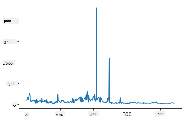
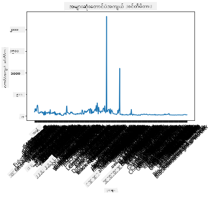
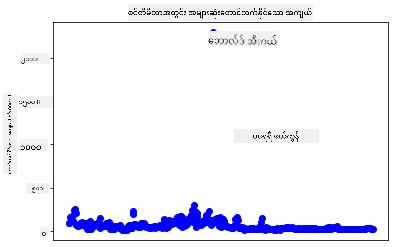
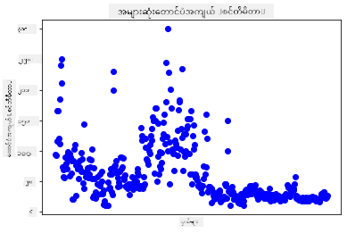
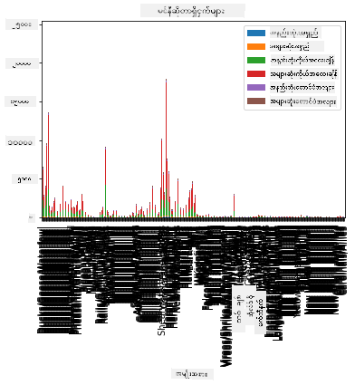
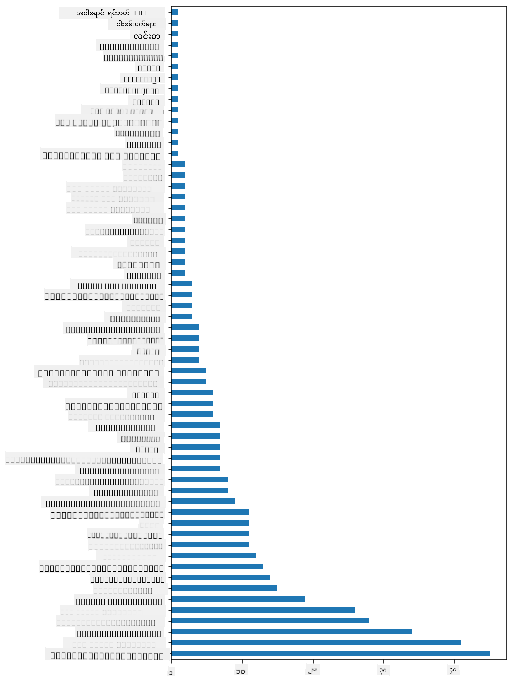
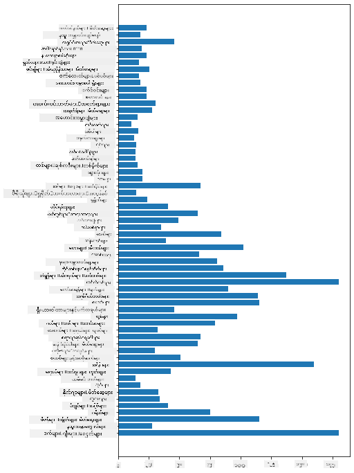
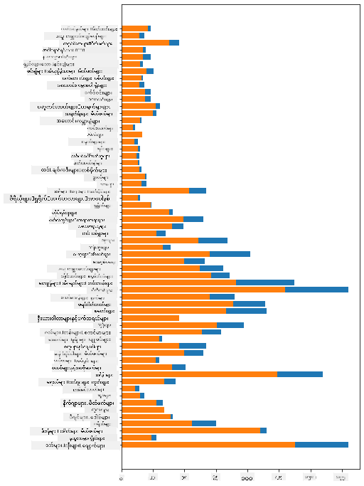

<!--
CO_OP_TRANSLATOR_METADATA:
{
  "original_hash": "43c402d9d90ae6da55d004519ada5033",
  "translation_date": "2025-08-30T19:03:33+00:00",
  "source_file": "3-Data-Visualization/09-visualization-quantities/README.md",
  "language_code": "my"
}
-->
# အရေအတွက်များကို မြင်သာအောင် ဖော်ပြခြင်း

| ](../../sketchnotes/09-Visualizing-Quantities.png)|
|:---:|
| အရေအတွက်များကို မြင်သာအောင် ဖော်ပြခြင်း - _Sketchnote by [@nitya](https://twitter.com/nitya)_ |

ဒီသင်ခန်းစာမှာ Python libraries တွေထဲက တစ်ခုကို အသုံးပြုပြီး အရေအတွက်ဆိုင်ရာ အထူးစိတ်ဝင်စားဖွယ် ဖော်ပြချက်တွေ ဖန်တီးနည်းကို လေ့လာပါမယ်။ Minnesota ရဲ့ ငှက်များအကြောင်း သန့်ရှင်းထားတဲ့ dataset ကို အသုံးပြုပြီး ဒေသတွင်း သဘာဝတိရစ္ဆာန်များအကြောင်း စိတ်ဝင်စားဖွယ် အချက်အလက်များကို သင်လေ့လာနိုင်ပါမယ်။

## [Pre-lecture quiz](https://purple-hill-04aebfb03.1.azurestaticapps.net/quiz/16)

## Matplotlib ဖြင့် အတောင်အလျားကို စောင့်ကြည့်ခြင်း

အမျိုးမျိုးသော ရိုးရှင်းပြီး ခက်ခဲတဲ့ ပုံစံများကို ဖန်တီးနိုင်တဲ့ စွမ်းဆောင်ရည်မြင့် စာကြည့်တိုက်တစ်ခုက [Matplotlib](https://matplotlib.org/stable/index.html) ဖြစ်ပါတယ်။ အထွေထွေအားဖြင့်, ဒီလို libraries တွေကို အသုံးပြုပြီး ဒေတာတွေကို ပုံဖော်ဖို့ လုပ်ငန်းစဉ်မှာ သင့် dataframe ရဲ့ တစ်စိတ်တစ်ပိုင်းကို ရွေးချယ်ခြင်း၊ ဒေတာကို ပြောင်းလဲခြင်း၊ x-axis နဲ့ y-axis တန်ဖိုးတွေ သတ်မှတ်ခြင်း၊ ဘယ်လိုပုံစံကို ဖော်ပြမလဲ ဆုံးဖြတ်ခြင်းနဲ့ ပုံကို ပြသခြင်းတို့ ပါဝင်ပါတယ်။ Matplotlib မှာ visualization အမျိုးအစား အများကြီး ရှိပါတယ်၊ ဒါပေမယ့် ဒီသင်ခန်းစာအတွက် အရေအတွက်ကို ဖော်ပြဖို့ သင့်တော်တဲ့ ပုံစံတွေကိုသာ အာရုံစိုက်ပါမယ် - လိုင်းပုံစံ၊ scatterplot နဲ့ bar plot တွေပါ။

> ✅ သင့်ဒေတာရဲ့ ဖွဲ့စည်းပုံနဲ့ သင့်ပြောချင်တဲ့ အကြောင်းအရာကို အကောင်းဆုံး ဖော်ပြနိုင်တဲ့ ပုံစံကို ရွေးချယ်ပါ။
> - အချိန်အလိုက် အပြောင်းအလဲတွေကို ခွဲခြားဖော်ပြရန်: လိုင်း
> - တန်ဖိုးတွေကို နှိုင်းယှဉ်ရန်: bar, column, pie, scatterplot
> - အစိတ်အပိုင်းတွေ ဘယ်လို တစ်ခုတစ်ခုနဲ့ ဆက်စပ်နေသလဲ ဖော်ပြရန်: pie
> - ဒေတာဖြန့်ဖြူးမှုကို ဖော်ပြရန်: scatterplot, bar
> - အပြောင်းအလဲတွေကို ဖော်ပြရန်: လိုင်း, column
> - တန်ဖိုးတွေကြား ဆက်စပ်မှုကို ဖော်ပြရန်: လိုင်း, scatterplot, bubble

သင့်မှာ dataset တစ်ခုရှိပြီး အရာဝတ္ထုတစ်ခုရဲ့ အရေအတွက်ကို သိလိုပါက, ပထမဆုံးလုပ်ငန်းစဉ်က ဒေတာတန်ဖိုးတွေကို စစ်ဆေးဖို့ ဖြစ်ပါတယ်။

✅ Matplotlib အတွက် အလွန်ကောင်းမွန်တဲ့ 'cheat sheets' တွေကို [ဒီမှာ](https://matplotlib.org/cheatsheets/cheatsheets.pdf) ရနိုင်ပါတယ်။

## ငှက်အတောင်အလျားတန်ဖိုးတွေကို လိုင်းပုံစံဖြင့် ဖော်ပြပါ

ဒီသင်ခန်းစာ folder ရဲ့ root မှာရှိတဲ့ `notebook.ipynb` ဖိုင်ကို ဖွင့်ပြီး cell တစ်ခု ထည့်ပါ။

> Note: ဒေတာကို ဒီ repo ရဲ့ root မှာရှိတဲ့ `/data` folder ထဲမှာ သိမ်းထားပါတယ်။

```python
import pandas as pd
import matplotlib.pyplot as plt
birds = pd.read_csv('../../data/birds.csv')
birds.head()
```
ဒီဒေတာက စာနဲ့ နံပါတ်တွေ ရောထားတဲ့ ပုံစံဖြစ်ပါတယ်:

|      | Name                         | ScientificName         | Category              | Order        | Family   | Genus       | ConservationStatus | MinLength | MaxLength | MinBodyMass | MaxBodyMass | MinWingspan | MaxWingspan |
| ---: | :--------------------------- | :--------------------- | :-------------------- | :----------- | :------- | :---------- | :----------------- | --------: | --------: | ----------: | ----------: | ----------: | ----------: |
|    0 | Black-bellied whistling-duck | Dendrocygna autumnalis | Ducks/Geese/Waterfowl | Anseriformes | Anatidae | Dendrocygna | LC                 |        47 |        56 |         652 |        1020 |          76 |          94 |
|    1 | Fulvous whistling-duck       | Dendrocygna bicolor    | Ducks/Geese/Waterfowl | Anseriformes | Anatidae | Dendrocygna | LC                 |        45 |        53 |         712 |        1050 |          85 |          93 |
|    2 | Snow goose                   | Anser caerulescens     | Ducks/Geese/Waterfowl | Anseriformes | Anatidae | Anser       | LC                 |        64 |        79 |        2050 |        4050 |         135 |         165 |
|    3 | Ross's goose                 | Anser rossii           | Ducks/Geese/Waterfowl | Anseriformes | Anatidae | Anser       | LC                 |      57.3 |        64 |        1066 |        1567 |         113 |         116 |
|    4 | Greater white-fronted goose  | Anser albifrons        | Ducks/Geese/Waterfowl | Anseriformes | Anatidae | Anser       | LC                 |        64 |        81 |        1930 |        3310 |         130 |         165 |

အခုတော့ ဒီစိတ်ဝင်စားဖွယ် ငှက်တွေမှာ အတောင်အလျားအများဆုံးကို လိုင်းပုံစံဖြင့် ဖော်ပြကြည့်ပါ။

```python
wingspan = birds['MaxWingspan'] 
wingspan.plot()
```


ဘာတွေကို ချက်ချင်း သတိထားမိပါသလဲ? အနည်းဆုံး outlier တစ်ခုရှိနေသလို ထင်ရပါတယ် - အတောင်အလျားတစ်ခုက အလွန်ကြီးမားနေပါတယ်! 2300 စင်တီမီတာဆိုတာ 23 မီတာနဲ့ တူပါတယ် - Minnesota မှာ Pterodactyls တွေ လှည့်လည်နေပါသလား? စစ်ဆေးကြည့်ရအောင်။

Excel မှာ အလျင်အမြန် sort လုပ်ပြီး ဒီ outliers တွေကို ရှာဖွေနိုင်ပေမယ့်, plot ထဲကနေ ဆက်လက်လုပ်ဆောင်ပါ။

x-axis မှာ ငှက်အမျိုးအစားတွေကို ဖော်ပြဖို့ label တွေ ထည့်ပါ:

```
plt.title('Max Wingspan in Centimeters')
plt.ylabel('Wingspan (CM)')
plt.xlabel('Birds')
plt.xticks(rotation=45)
x = birds['Name'] 
y = birds['MaxWingspan']

plt.plot(x, y)

plt.show()
```


label တွေကို 45 ဒီဂရီလှည့်ထားပေမယ့်, ဖတ်ရခက်နေဆဲပါ။ အခြားနည်းလမ်းကို စမ်းကြည့်ရအောင် - outliers တွေကိုသာ label ထည့်ပြီး chart ထဲမှာပဲ ဖော်ပြပါ။ scatter chart ကို အသုံးပြုပြီး label ထည့်ဖို့ နေရာပိုရနိုင်ပါတယ်:

```python
plt.title('Max Wingspan in Centimeters')
plt.ylabel('Wingspan (CM)')
plt.tick_params(axis='both',which='both',labelbottom=False,bottom=False)

for i in range(len(birds)):
    x = birds['Name'][i]
    y = birds['MaxWingspan'][i]
    plt.plot(x, y, 'bo')
    if birds['MaxWingspan'][i] > 500:
        plt.text(x, y * (1 - 0.05), birds['Name'][i], fontsize=12)
    
plt.show()
```
ဒီမှာ ဘာဖြစ်နေပါသလဲ? `tick_params` ကို အသုံးပြုပြီး အောက်ဆုံး label တွေကို ဖျောက်လိုက်ပြီး, သင့်ငှက် dataset ကို loop လုပ်ထားပါတယ်။ `bo` ကို အသုံးပြုပြီး အပြာရောင် အစက်လေးတွေကို plot လုပ်ပြီး, အတောင်အလျားအများဆုံး 500 ထက်ကျော်တဲ့ ငှက်တွေကို စစ်ထုတ်ပြီး, dot နားမှာ label ထည့်ထားပါတယ်။ y axis မှာ label တွေကို နည်းနည်း offset လုပ်ထားပြီး (`y * (1 - 0.05)`), ငှက်နာမည်ကို label အဖြစ် အသုံးပြုထားပါတယ်။

ဘာတွေကို ရှာဖွေတွေ့ရှိခဲ့ပါသလဲ?



## သင့်ဒေတာကို စစ်ထုတ်ပါ

Bald Eagle နဲ့ Prairie Falcon တို့ဟာ အတောင်အလျားမှာ အမှားရှိနေသလို ထင်ရပါတယ်။ အတောင်အလျား 25 မီတာရှိတဲ့ Bald Eagle ကိုတွေ့ရင် ကျေးဇူးပြု၍ ကျွန်ုပ်တို့ကို အသိပေးပါ! ဒီ outliers နှစ်ခုမပါတဲ့ dataframe အသစ်တစ်ခု ဖန်တီးကြည့်ရအောင်:

```python
plt.title('Max Wingspan in Centimeters')
plt.ylabel('Wingspan (CM)')
plt.xlabel('Birds')
plt.tick_params(axis='both',which='both',labelbottom=False,bottom=False)
for i in range(len(birds)):
    x = birds['Name'][i]
    y = birds['MaxWingspan'][i]
    if birds['Name'][i] not in ['Bald eagle', 'Prairie falcon']:
        plt.plot(x, y, 'bo')
plt.show()
```

Outliers တွေကို ဖယ်ရှားပြီးနောက်, သင့်ဒေတာဟာ ပိုပြီး သဟဇာတဖြစ်လာပြီး နားလည်ရလွယ်ကူလာပါတယ်။



အတောင်အလျားအရင်းအမြစ်အရ သန့်ရှင်းတဲ့ dataset ရရှိပြီးနောက်, ဒီငှက်တွေကို ပိုမိုလေ့လာကြည့်ရအောင်။

လိုင်းနဲ့ scatter plot တွေက ဒေတာတန်ဖိုးနဲ့ distribution တွေကို ဖော်ပြနိုင်ပေမယ့်, dataset ရဲ့ အရေအတွက်ဆိုင်ရာ တန်ဖိုးတွေကို စဉ်းစားဖို့လိုပါတယ်။ အောက်ပါအရေအတွက်ဆိုင်ရာ မေးခွန်းတွေကို ဖြေရှင်းဖို့ visualization တွေ ဖန်တီးနိုင်ပါတယ်:

> ငှက်အမျိုးအစား ဘယ်နှစ်မျိုးရှိပြီး, အရေအတွက်ဘယ်လောက်ရှိသလဲ?
> ဘယ်ငှက်တွေ မျိုးသုဉ်းနေသလဲ, အန္တရာယ်ရှိနေသလဲ, ရှားပါးနေသလဲ, သာမန်လား?
> Linnaeus ရဲ့ အမျိုးအစားနဲ့ အဆင့်အလိုက် ဘယ်လောက်ရှိသလဲ?

## Bar Chart တွေကို လေ့လာပါ

Bar chart တွေက ဒေတာကို အုပ်စုဖွဲ့ဖို့ အလွန်အသုံးဝင်ပါတယ်။ ဒီ dataset မှာ ရှိတဲ့ ငှက်အမျိုးအစားတွေကို လေ့လာပြီး ဘယ်အမျိုးအစားက အများဆုံးရှိသလဲဆိုတာ ကြည့်ရအောင်။

notebook ဖိုင်ထဲမှာ basic bar chart တစ်ခု ဖန်တီးပါ။

✅ အရင်ပိုင်းမှာ ရှာဖွေတွေ့ရှိထားတဲ့ outlier ငှက်နှစ်ကောင်ကို ဖယ်ရှားမလား, အတောင်အလျားအမှားကို ပြင်မလား, ဒါမှမဟုတ် ဒီ exercises တွေ wingspan တန်ဖိုးနဲ့ မဆိုင်တဲ့အတွက် ထားလိုက်မလား ဆုံးဖြတ်ပါ။

Bar chart တစ်ခု ဖန်တီးချင်ရင်, သင့်အာရုံစိုက်ချင်တဲ့ ဒေတာကို ရွေးချယ်ပါ။ Raw data ကနေ bar chart တွေ ဖန်တီးနိုင်ပါတယ်:

```python
birds.plot(x='Category',
        kind='bar',
        stacked=True,
        title='Birds of Minnesota')

```


ဒါပေမယ့် ဒီ bar chart က ဖတ်ရခက်နေပါတယ်, အုပ်စုဖွဲ့ထားတဲ့ ဒေတာမရှိလို့ပါ။ ငှက်အမျိုးအစားအလိုက် အရှည်ကိုသာ ရွေးချယ်ကြည့်ရအောင်။

သင့်ဒေတာကို ငှက်အမျိုးအစားအလိုက်သာ ဖော်ပြပါ။

✅ သင် Pandas ကို ဒေတာကို စီမံဖို့ အသုံးပြုပြီး, Matplotlib ကို chart ဖန်တီးဖို့ အသုံးပြုထားတာကို သတိပြုပါ။

အမျိုးအစားများစွာရှိတဲ့အတွက်, ဒီ chart ကို မျဉ်းတန်းလိုက်ပြပြီး, အမြင့်ကို data အားလုံးအတွက် ထည့်သွင်းပြင်ဆင်ပါ:

```python
category_count = birds.value_counts(birds['Category'].values, sort=True)
plt.rcParams['figure.figsize'] = [6, 12]
category_count.plot.barh()
```


ဒီ bar chart က အမျိုးအစားအလိုက် ငှက်အရေအတွက်ကို ကောင်းစွာ ဖော်ပြထားပါတယ်။ တစ်ချက်မြင်တာနဲ့, ဒီဒေသမှာ အများဆုံး ငှက်တွေက Ducks/Geese/Waterfowl အမျိုးအစားဖြစ်တာကို မြင်နိုင်ပါတယ်။ Minnesota ဟာ '10,000 ရေကန်များ၏ မြေ' ဖြစ်တာကြောင့်, ဒါက အံ့ဩစရာမဟုတ်ပါဘူး။

✅ ဒီ dataset ကို အသုံးပြုပြီး အခြား count တွေကို စမ်းကြည့်ပါ။ ဘာတွေက သင့်ကို အံ့ဩစေပါသလဲ?

## ဒေတာကို နှိုင်းယှဉ်ခြင်း

Grouped data တွေကို နှိုင်းယှဉ်ဖို့ အသစ်သော axes တွေ ဖန်တီးကြည့်ပါ။ ငှက်အမျိုးအစားအလိုက် MaxLength ကို နှိုင်းယှဉ်ကြည့်ပါ:

```python
maxlength = birds['MaxLength']
plt.barh(y=birds['Category'], width=maxlength)
plt.rcParams['figure.figsize'] = [6, 12]
plt.show()
```


ဒီမှာ အံ့ဩစရာမရှိပါဘူး - hummingbirds တွေက Pelicans ဒါမှမဟုတ် Geese တွေထက် MaxLength အနည်းဆုံးရှိပါတယ်။ ဒေတာက သင်္ချာနဲ့ ကိုက်ညီတာကောင်းပါတယ်ဆိုတာကောင်းပါတယ်!

Bar chart တွေကို ပိုမိုစိတ်ဝင်စားဖွယ် ဖော်ပြဖို့, ဒေတာတွေကို တစ်ခုထက်ပိုပြီး overlay လုပ်နိုင်ပါတယ်။ ငှက်အမျိုးအစားတစ်ခုအလိုက် Minimum နဲ့ Maximum Length ကို overlay လုပ်ကြည့်ရအောင်:

```python
minLength = birds['MinLength']
maxLength = birds['MaxLength']
category = birds['Category']

plt.barh(category, maxLength)
plt.barh(category, minLength)

plt.show()
```
ဒီ plot မှာ, Minimum Length နဲ့ Maximum Length တစ်ခုချင်းစီရဲ့ range ကို မြင်နိုင်ပါတယ်။ ဒီဒေတာအရ, ငှက်က အရွယ်အစားကြီးလေ, length range က ပိုကြီးတယ်လို့ သေချာပြောနိုင်ပါတယ်။ စိတ်ဝင်စားစရာပါ!



## 🚀 စိန်ခေါ်မှု

ဒီငှက် dataset က တစ်ခုထဲသော ecosystem အတွင်းရှိ ငှက်အမျိုးအစားအမျိုးမျိုးအကြောင်း အချက်အလက်များစွာကို ပေးစွမ်းပါတယ်။ အင်တာနက်မှာ ရှာဖွေပြီး ငှက်ဆိုင်ရာ dataset အခြားတွေကို ရှာကြည့်ပါ။ ဒီငှက်တွေကို ပုံစံနဲ့ ပုံစံဖော်ပြပြီး သင်မသိခဲ့တဲ့ အချက်အလက်တွေကို ရှာဖွေကြည့်ပါ။

## [Post-lecture quiz](https://purple-hill-04aebfb03.1.azurestaticapps.net/quiz/17)

## ပြန်လည်သုံးသပ်ခြင်းနှင့် ကိုယ်တိုင်လေ့လာခြင်း

ဒီပထမဆုံးသင်ခန်းစာက Matplotlib ကို အသုံးပြုပြီး အရေအတွက်တွေကို မြင်သာအောင် ဖော်ပြနည်းအကြောင်း အချက်အလက်အချို့ကို ပေးခဲ့ပါတယ်။ Visualization အတွက် dataset တွေကို အခြားနည်းလမ်းတွေနဲ့ အလုပ်လုပ်နိုင်ဖို့ လေ့လာပါ။ [Plotly](https://github.com/plotly/plotly.py) က ဒီသင်ခန်းစာတွေမှာ မဖော်ပြထားတဲ့ တစ်ခုဖြစ်ပါတယ်, ဒါကြောင့် ဒါက ဘာတွေ ပေးစွမ်းနိုင်သလဲဆိုတာ ကြည့်ပါ။

## လုပ်ငန်း

[Lines, Scatters, and Bars](assignment.md)

---

**အကြောင်းကြားချက်**:  
ဤစာရွက်စာတမ်းကို AI ဘာသာပြန်ဝန်ဆောင်မှု [Co-op Translator](https://github.com/Azure/co-op-translator) ကို အသုံးပြု၍ ဘာသာပြန်ထားပါသည်။ ကျွန်ုပ်တို့သည် တိကျမှုအတွက် ကြိုးစားနေသော်လည်း၊ အလိုအလျောက် ဘာသာပြန်မှုများတွင် အမှားများ သို့မဟုတ် မတိကျမှုများ ပါဝင်နိုင်သည်ကို သတိပြုပါ။ မူရင်းဘာသာစကားဖြင့် ရေးသားထားသော စာရွက်စာတမ်းကို အာဏာရှိသော ရင်းမြစ်အဖြစ် သတ်မှတ်သင့်ပါသည်။ အရေးကြီးသော အချက်အလက်များအတွက် လူက ဘာသာပြန်မှု ဝန်ဆောင်မှုကို အကြံပြုပါသည်။ ဤဘာသာပြန်မှုကို အသုံးပြုခြင်းမှ ဖြစ်ပေါ်လာသော အလွဲအလွတ်များ သို့မဟုတ် အနားယူမှုများအတွက် ကျွန်ုပ်တို့သည် တာဝန်မယူပါ။