<!--
CO_OP_TRANSLATOR_METADATA:
{
  "original_hash": "87faccac113d772551486a67a607153e",
  "translation_date": "2025-08-30T19:16:12+00:00",
  "source_file": "3-Data-Visualization/10-visualization-distributions/README.md",
  "language_code": "my"
}
-->
# အချိုးအစားများကို မြင်သာအောင် ဖော်ပြခြင်း

| ](../../sketchnotes/10-Visualizing-Distributions.png)|
|:---:|
| အချိုးအစားများကို မြင်သာအောင် ဖော်ပြခြင်း - _Sketchnote by [@nitya](https://twitter.com/nitya)_ |

ယခင်သင်ခန်းစာတွင် သင်သည် Minnesota ရှိ ငှက်များအကြောင်းပါဝင်သော dataset တစ်ခုအကြောင်း စိတ်ဝင်စားဖွယ် အချက်အလက်များကို လေ့လာခဲ့ပါသည်။ Outliers များကို မြင်သာအောင် ဖော်ပြခြင်းဖြင့် မှားယွင်းသော ဒေတာများကို ရှာဖွေခဲ့ပြီး ငှက်အမျိုးအစားများ၏ အရှည်အများဆုံးအတိုင်းအတာအရ ကွာခြားချက်များကိုလည်း ကြည့်ရှုခဲ့ပါသည်။

## [Pre-lecture quiz](https://purple-hill-04aebfb03.1.azurestaticapps.net/quiz/18)
## ငှက်များ၏ dataset ကို လေ့လာခြင်း

ဒေတာကို နက်နက်ရှိုင်းရှိုင်း လေ့လာရန် နောက်ထပ်နည်းလမ်းတစ်ခုမှာ ဒေတာ၏ အချိုးအစား (distribution) ကို ကြည့်ရှုခြင်းဖြစ်သည်။ ဥပမာအားဖြင့် Minnesota ရှိ ငှက်များအတွက် အတောင်အရှည်အများဆုံး သို့မဟုတ် ကိုယ်အလေးချိန်အများဆုံး၏ အချိုးအစားကို သိလိုသည်ဟု ဆိုပါစို့။

ဒီ dataset တွင် ပါဝင်သော ဒေတာများ၏ အချိုးအစားများအကြောင်း အချက်အလက်များကို ရှာဖွေကြည့်ပါ။ ဒီသင်ခန်းစာ folder ၏ root တွင်ရှိသော _notebook.ipynb_ ဖိုင်တွင် Pandas, Matplotlib, နှင့် သင့်ဒေတာကို import လုပ်ပါ။

```python
import pandas as pd
import matplotlib.pyplot as plt
birds = pd.read_csv('../../data/birds.csv')
birds.head()
```

|      | Name                         | ScientificName         | Category              | Order        | Family   | Genus       | ConservationStatus | MinLength | MaxLength | MinBodyMass | MaxBodyMass | MinWingspan | MaxWingspan |
| ---: | :--------------------------- | :--------------------- | :-------------------- | :----------- | :------- | :---------- | :----------------- | --------: | --------: | ----------: | ----------: | ----------: | ----------: |
|    0 | Black-bellied whistling-duck | Dendrocygna autumnalis | Ducks/Geese/Waterfowl | Anseriformes | Anatidae | Dendrocygna | LC                 |        47 |        56 |         652 |        1020 |          76 |          94 |
|    1 | Fulvous whistling-duck       | Dendrocygna bicolor    | Ducks/Geese/Waterfowl | Anseriformes | Anatidae | Dendrocygna | LC                 |        45 |        53 |         712 |        1050 |          85 |          93 |
|    2 | Snow goose                   | Anser caerulescens     | Ducks/Geese/Waterfowl | Anseriformes | Anatidae | Anser       | LC                 |        64 |        79 |        2050 |        4050 |         135 |         165 |
|    3 | Ross's goose                 | Anser rossii           | Ducks/Geese/Waterfowl | Anseriformes | Anatidae | Anser       | LC                 |      57.3 |        64 |        1066 |        1567 |         113 |         116 |
|    4 | Greater white-fronted goose  | Anser albifrons        | Ducks/Geese/Waterfowl | Anseriformes | Anatidae | Anser       | LC                 |        64 |        81 |        1930 |        3310 |         130 |         165 |

ယေဘူယျအားဖြင့် ဒေတာ၏ အချိုးအစားကို မြန်ဆန်စွာ ကြည့်ရှုရန် scatter plot တစ်ခုကို ယခင်သင်ခန်းစာတွင် ပြုလုပ်ခဲ့သလို ပြုလုပ်နိုင်ပါသည်။

```python
birds.plot(kind='scatter',x='MaxLength',y='Order',figsize=(12,8))

plt.title('Max Length per Order')
plt.ylabel('Order')
plt.xlabel('Max Length')

plt.show()
```
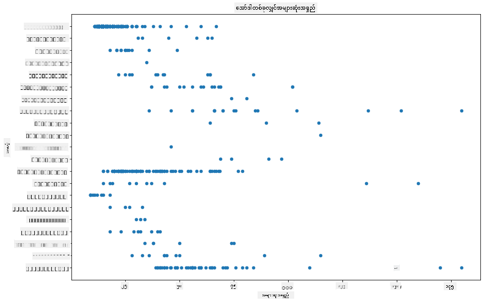

ဤအချက်အလက်သည် ငှက်အမျိုးအစား (Order) တစ်ခုစီအလိုက် ကိုယ်အရှည်၏ ယေဘူယျ အချိုးအစားကို ပြသပေမယ့် အချိုးအစားများကို တကယ်မှန်ကန်စွာ ဖော်ပြရန် အကောင်းဆုံးနည်းလမ်းမဟုတ်ပါ။ ထိုအလုပ်ကို Histogram တစ်ခု ဖန်တီးခြင်းဖြင့် 通常 ပြုလုပ်ပါသည်။

## Histogram များနှင့် အလုပ်လုပ်ခြင်း

Matplotlib သည် Histogram များကို အသုံးပြု၍ ဒေတာ၏ အချိုးအစားကို မြင်သာအောင် ဖော်ပြရန် အလွန်ကောင်းမွန်သော နည်းလမ်းများကို ပေးစွမ်းပါသည်။ ဤအမျိုးအစား၏ chart သည် bar chart တစ်ခုနှင့် ဆင်တူပြီး bar များ၏ မြင့်တက်နိမ့်ကျမှုမှတစ်ဆင့် အချိုးအစားကို မြင်နိုင်ပါသည်။ Histogram တစ်ခု ဖန်တီးရန် သင်သည် ကိန်းဂဏန်းဒေတာလိုအပ်ပါသည်။ Histogram တစ်ခု ဖန်တီးရန် 'hist' ဟူသော chart အမျိုးအစားကို သတ်မှတ်ပြီး chart တစ်ခုကို plot လုပ်နိုင်ပါသည်။ ဤ chart သည် dataset တစ်ခုလုံး၏ MaxBodyMass အချိုးအစားကို ပြသပါသည်။ ဒေတာ array ကို သေးငယ်သော bins များအဖြစ် ခွဲခြားခြင်းဖြင့် ဒေတာတန်ဖိုးများ၏ အချိုးအစားကို ပြသနိုင်ပါသည်။

```python
birds['MaxBodyMass'].plot(kind = 'hist', bins = 10, figsize = (12,12))
plt.show()
```
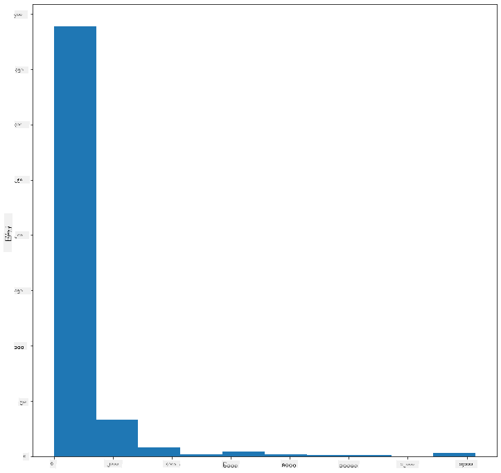

သင်မြင်နိုင်သည့်အတိုင်း ဤ dataset တွင်ပါဝင်သော ငှက် 400+ များ၏ အများစုသည် Max Body Mass 2000 အောက်တွင် ရှိနေသည်။ `bins` parameter ကို 30 ကဲ့သို့ မြင့်မားသော တန်ဖိုးသို့ ပြောင်းလဲခြင်းဖြင့် ဒေတာအကြောင်းပိုမို နက်နက်ရှိုင်းရှိုင်း သိရှိနိုင်ပါသည်။

```python
birds['MaxBodyMass'].plot(kind = 'hist', bins = 30, figsize = (12,12))
plt.show()
```
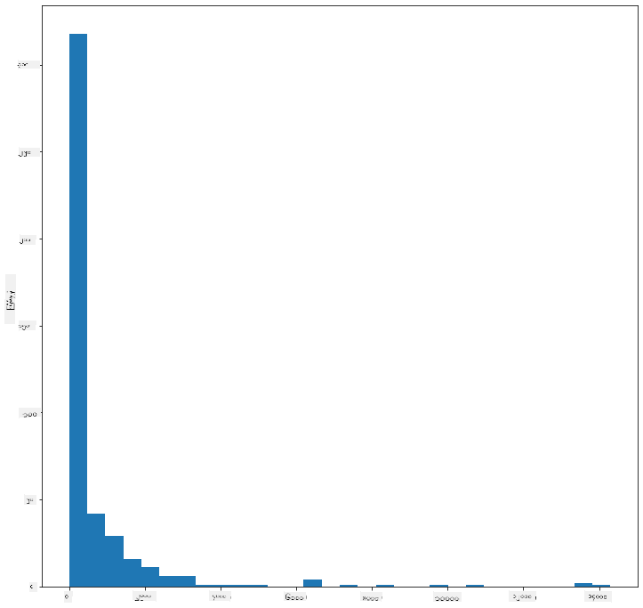

ဤ chart သည် အချိုးအစားကို ပိုမိုအသေးစိတ်ပြသပါသည်။ ပိုမိုလက်ဝဲဘက်သို့ မဆွဲထားသော chart တစ်ခုကို ဖန်တီးရန် သတ်မှတ်ထားသော အကွာအဝေးအတွင်းရှိ ဒေတာကိုသာ ရွေးချယ်ပါ။

ကိုယ်အလေးချိန် 60 အောက်ရှိ ငှက်များကို filter လုပ်ပြီး `bins` 40 ကို ပြပါ။

```python
filteredBirds = birds[(birds['MaxBodyMass'] > 1) & (birds['MaxBodyMass'] < 60)]      
filteredBirds['MaxBodyMass'].plot(kind = 'hist',bins = 40,figsize = (12,12))
plt.show()     
```
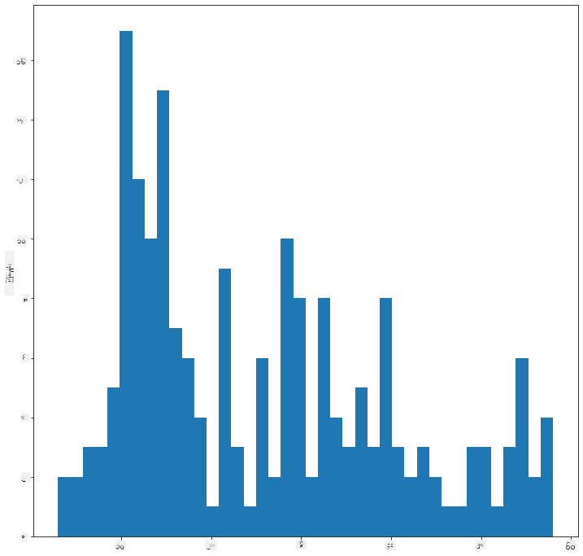

✅ အခြား filter များနှင့် ဒေတာအချက်အလက်များကို စမ်းကြည့်ပါ။ ဒေတာ၏ အချိုးအစားအပြည့်အစုံကို မြင်ရန် `['MaxBodyMass']` filter ကို ဖယ်ရှားပြီး labeled distributions ကို ပြပါ။

Histogram သည် အရောင်နှင့် label များကို တိုးတက်စေသော အလှဆင်မှုများကိုလည်း စမ်းသပ်နိုင်ပါသည်။

2D histogram တစ်ခု ဖန်တီးပြီး အချိုးအစားနှစ်ခုအကြား ဆက်စပ်မှုကို နှိုင်းယှဉ်ပါ။ `MaxBodyMass` နှင့် `MaxLength` ကို နှိုင်းယှဉ်ကြည့်ပါ။ Matplotlib သည် ပိုမိုတောက်ပသော အရောင်များကို အသုံးပြု၍ ဆုံမှတ်များကို ပြသနိုင်သော built-in နည်းလမ်းတစ်ခုကို ပေးပါသည်။

```python
x = filteredBirds['MaxBodyMass']
y = filteredBirds['MaxLength']

fig, ax = plt.subplots(tight_layout=True)
hist = ax.hist2d(x, y)
```
ဤအချက်အလက်တွင် မျှော်မှန်းထားသော အချိုးအစားတစ်ခုအတိုင်း ဆက်စပ်မှုရှိနေပြီး တစ်နေရာထဲတွင် အလွန်ပြင်းထန်သော ဆုံမှတ်တစ်ခု ရှိနေသည်။

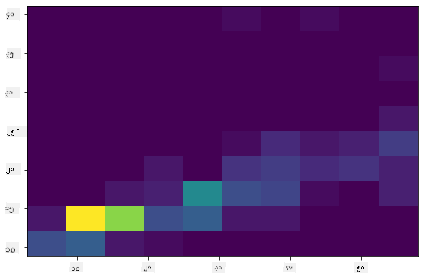

Histogram များသည် ကိန်းဂဏန်းဒေတာများအတွက် ပုံမှန်အားဖြင့် ကောင်းစွာ အလုပ်လုပ်ပါသည်။ သို့သော် စာသားဒေတာအရ အချိုးအစားများကို ကြည့်ရန် လိုအပ်ပါက ဘာလုပ်မလဲ?

## စာသားဒေတာကို အသုံးပြု၍ dataset ၏ အချိုးအစားများကို လေ့လာခြင်း

ဤ dataset တွင် ငှက်အမျိုးအစား၊ genus, species, family နှင့် conservation status အကြောင်း အချက်အလက်ကောင်းများလည်း ပါဝင်ပါသည်။ ဤ conservation အချက်အလက်များကို လေ့လာကြည့်ပါ။ ငှက်များကို သူတို့၏ conservation status အလိုက် အချိုးအစားဘယ်လိုရှိသလဲ?

> ✅ Dataset တွင် conservation status ကို ဖော်ပြရန် အတိုကောက်များစွာကို အသုံးပြုထားသည်။ ဤအတိုကောက်များသည် [IUCN Red List Categories](https://www.iucnredlist.org/) မှ ရယူထားခြင်းဖြစ်ပြီး အမျိုးအစားများ၏ status ကို စာရင်းပြုစုထားသော အဖွဲ့အစည်းတစ်ခုဖြစ်သည်။
> 
> - CR: အလွန်အန္တရာယ်ရှိသော
> - EN: အန္တရာယ်ရှိသော
> - EX: မျိုးသုဉ်းသွားသော
> - LC: အန္တရာယ်နည်းသော
> - NT: အန္တရာယ်နီးစပ်သော
> - VU: အန္တရာယ်ရှိနိုင်သော

ဤအချက်အလက်များသည် စာသားအခြေပြုတန်ဖိုးများဖြစ်သောကြောင့် histogram တစ်ခု ဖန်တီးရန် transform ပြုလုပ်ရန် လိုအပ်ပါသည်။ filteredBirds dataframe ကို အသုံးပြု၍ ၎င်း၏ conservation status ကို Minimum Wingspan နှင့်အတူ ပြပါ။ သင်ဘာတွေမြင်ရလဲ?

```python
x1 = filteredBirds.loc[filteredBirds.ConservationStatus=='EX', 'MinWingspan']
x2 = filteredBirds.loc[filteredBirds.ConservationStatus=='CR', 'MinWingspan']
x3 = filteredBirds.loc[filteredBirds.ConservationStatus=='EN', 'MinWingspan']
x4 = filteredBirds.loc[filteredBirds.ConservationStatus=='NT', 'MinWingspan']
x5 = filteredBirds.loc[filteredBirds.ConservationStatus=='VU', 'MinWingspan']
x6 = filteredBirds.loc[filteredBirds.ConservationStatus=='LC', 'MinWingspan']

kwargs = dict(alpha=0.5, bins=20)

plt.hist(x1, **kwargs, color='red', label='Extinct')
plt.hist(x2, **kwargs, color='orange', label='Critically Endangered')
plt.hist(x3, **kwargs, color='yellow', label='Endangered')
plt.hist(x4, **kwargs, color='green', label='Near Threatened')
plt.hist(x5, **kwargs, color='blue', label='Vulnerable')
plt.hist(x6, **kwargs, color='gray', label='Least Concern')

plt.gca().set(title='Conservation Status', ylabel='Min Wingspan')
plt.legend();
```

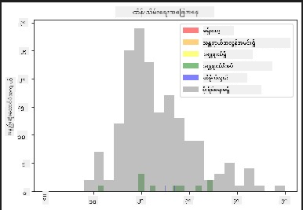

Minimum Wingspan နှင့် conservation status အကြား ဆက်စပ်မှုကောင်းတစ်ခု မရှိသလိုပဲ။ ဤနည်းလမ်းကို အသုံးပြု၍ dataset ၏ အခြား element များကို စမ်းကြည့်ပါ။ သင် ဆက်စပ်မှုတစ်ခု ရှာဖွေနိုင်ပါသလား?

## Density plots

ယခင်ကြည့်ရှုခဲ့သော histogram များသည် 'stepped' ဖြစ်ပြီး arc တစ်ခုအတိုင်း မျောနေခြင်း မရှိကြောင်း သင်သတိထားမိနိုင်ပါသည်။ ပိုမိုချောမွေ့သော density chart တစ်ခု ပြရန် density plot ကို စမ်းကြည့်နိုင်ပါသည်။

Density plots နှင့် အလုပ်လုပ်ရန် plotting library အသစ်တစ်ခုဖြစ်သော [Seaborn](https://seaborn.pydata.org/generated/seaborn.kdeplot.html) ကို လေ့လာပါ။

Seaborn ကို load လုပ်ပြီး basic density plot တစ်ခုကို စမ်းကြည့်ပါ။

```python
import seaborn as sns
import matplotlib.pyplot as plt
sns.kdeplot(filteredBirds['MinWingspan'])
plt.show()
```
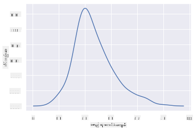

ဤ plot သည် Minimum Wingspan ဒေတာအတွက် ယခင် histogram ကို ပြန်လည်တူညီစေသည်။ ဒါပေမယ့် ပိုမိုချောမွေ့နေသည်။ Seaborn ၏ documentation အရ "Histogram နှင့် နှိုင်းယှဉ်လျှင် KDE သည် ပိုမိုရှင်းလင်းပြီး အဓိပ္ပါယ်ရှိသော plot တစ်ခုကို ဖန်တီးနိုင်သည်။ သို့သော် underlying distribution သည် bounded သို့မဟုတ် smooth မဖြစ်ပါက အတုအယောင်များကို ဖြစ်စေနိုင်သည်။ Histogram ကဲ့သို့ပင် representation ၏ အရည်အသွေးသည် smoothing parameters များကို ကောင်းစွာ ရွေးချယ်မှုအပေါ် မူတည်ပါသည်။" [source](https://seaborn.pydata.org/generated/seaborn.kdeplot.html) အဆိုအရ outliers များသည် အမြဲ chart များကို မကောင်းစေမည်ဖြစ်သည်။

MaxBodyMass ၏ jagged line ကို ပြန်လည်ချောမွေ့စေလိုပါက ဤနည်းလမ်းကို အသုံးပြု၍ ပြန်လည်ဖန်တီးနိုင်ပါသည်။

```python
sns.kdeplot(filteredBirds['MaxBodyMass'])
plt.show()
```
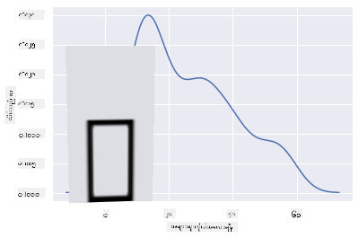

ချောမွေ့သော၊ သို့သော် အလွန်ချောမွေ့မဟုတ်သော line တစ်ခုလိုအပ်ပါက `bw_adjust` parameter ကို ပြင်ဆင်ပါ။

```python
sns.kdeplot(filteredBirds['MaxBodyMass'], bw_adjust=.2)
plt.show()
```
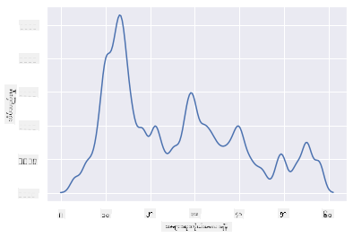

✅ ဤအမျိုးအစား plot အတွက် ရရှိနိုင်သော parameters များအကြောင်း ဖတ်ရှုပြီး စမ်းကြည့်ပါ။

ဤအမျိုးအစား chart သည် အလွန်ရှင်းလင်းသော visualizations များကို ပေးစွမ်းပါသည်။ ဥပမာအားဖြင့် ငှက်အမျိုးအစား (Order) တစ်ခုစီအလိုက် max body mass density ကို ပြသရန် code အကြောင်းအရာအနည်းငယ်ဖြင့် ပြုလုပ်နိုင်ပါသည်။

```python
sns.kdeplot(
   data=filteredBirds, x="MaxBodyMass", hue="Order",
   fill=True, common_norm=False, palette="crest",
   alpha=.5, linewidth=0,
)
```

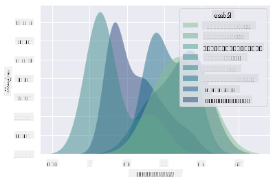

တစ်ခုတည်းသော chart တွင် variable အများအပြား၏ density ကိုလည်း map လုပ်နိုင်ပါသည်။ ငှက်တစ်ကောင်၏ MaxLength နှင့် MinLength ကို conservation status နှင့် နှိုင်းယှဉ်ကြည့်ပါ။

```python
sns.kdeplot(data=filteredBirds, x="MinLength", y="MaxLength", hue="ConservationStatus")
```

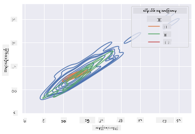

'Vulnerable' ငှက်များ၏ အရှည်အတိုင်းအတာအရ ဖြစ်ပေါ်နေသော cluster သည် အဓိပ္ပါယ်ရှိမရှိကို သုတေသနပြုရန် တန်ဖိုးရှိနိုင်ပါသည်။

## 🚀 စိန်ခေါ်မှု

Histogram များသည် scatterplots, bar charts, သို့မဟုတ် line charts များထက် ပိုမိုတိုးတက်သော chart အမျိုးအစားဖြစ်သည်။ အင်တာနက်တွင် Histogram များကို ကောင်းစွာ အသုံးပြုထားသော ဥပမာကောင်းများကို ရှာဖွေပါ။ ၎င်းတို့ကို ဘယ်လိုအသုံးပြုထားသလဲ၊ ဘာကို ပြသထားသလဲ၊ ၎င်းတို့ကို ဘယ်နယ်ပယ်များ သို့မဟုတ် ဘယ်လိုသုတေသနများတွင် အသုံးပြုလေ့ရှိသလဲ?

## [Post-lecture quiz](https://purple-hill-04aebfb03.1.azurestaticapps.net/quiz/19)

## ပြန်လည်သုံးသပ်ခြင်းနှင့် ကိုယ်တိုင်လေ့လာခြင်း

ဤသင်ခန်းစာတွင် သင်သည် Matplotlib ကို အသုံးပြုခဲ့ပြီး Seaborn ကို စတင်အသုံးပြုကာ ပိုမိုတိုးတက်သော chart များကို ဖော်ပြခဲ့သည်။ Seaborn တွင် "continuous probability density curve in one or more dimensions" ဟု ဖော်ပြထားသော `kdeplot` အကြောင်း သုတေသနပြုပါ။ [documentation](https://seaborn.pydata.org/generated/seaborn.kdeplot.html) ကို ဖတ်ရှုကာ ၎င်း၏ အလုပ်လုပ်ပုံကို နားလည်ပါ။

## လုပ်ငန်း

[သင့်ကျွမ်းကျင်မှုကို အသုံးချပါ](assignment.md)

---

**ဝက်ဘ်ဆိုက်မှတ်ချက်**:  
ဤစာရွက်စာတမ်းကို AI ဘာသာပြန်ဝန်ဆောင်မှု [Co-op Translator](https://github.com/Azure/co-op-translator) ကို အသုံးပြု၍ ဘာသာပြန်ထားပါသည်။ ကျွန်ုပ်တို့သည် တိကျမှန်ကန်မှုအတွက် ကြိုးစားနေပါသော်လည်း၊ အလိုအလျောက်ဘာသာပြန်ဆိုမှုများတွင် အမှားများ သို့မဟုတ် မမှန်ကန်မှုများ ပါဝင်နိုင်သည်ကို ကျေးဇူးပြု၍ သတိပြုပါ။ မူရင်းစာရွက်စာတမ်းကို ၎င်း၏ မူလဘာသာစကားဖြင့် အာဏာတည်သောရင်းမြစ်အဖြစ် သတ်မှတ်သင့်ပါသည်။ အရေးကြီးသောအချက်အလက်များအတွက် လူပညာရှင်များမှ လက်တွေ့ဘာသာပြန်ဆိုမှုကို အကြံပြုပါသည်။ ဤဘာသာပြန်ဆိုမှုကို အသုံးပြုခြင်းမှ ဖြစ်ပေါ်လာသော နားလည်မှုမှားများ သို့မဟုတ် အဓိပ္ပါယ်မှားများအတွက် ကျွန်ုပ်တို့သည် တာဝန်မယူပါ။