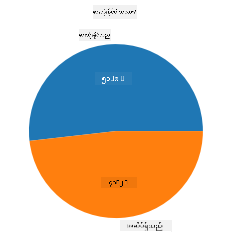
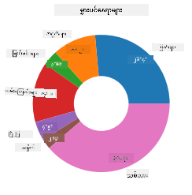
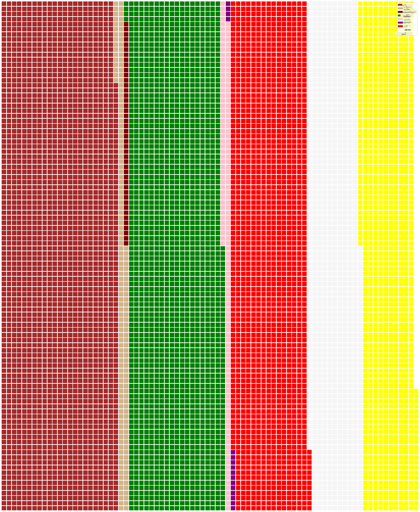

<!--
CO_OP_TRANSLATOR_METADATA:
{
  "original_hash": "af6a12015c6e250e500b570a9fa42593",
  "translation_date": "2025-08-30T18:59:22+00:00",
  "source_file": "3-Data-Visualization/11-visualization-proportions/README.md",
  "language_code": "my"
}
-->
# အချိုးအစားများကိုမြင်သာအောင်ဖော်ပြခြင်း

| ](../../sketchnotes/11-Visualizing-Proportions.png)|
|:---:|
|အချိုးအစားများကိုမြင်သာအောင်ဖော်ပြခြင်း - _Sketchnote by [@nitya](https://twitter.com/nitya)_ |

ဒီသင်ခန်းစာမှာ သင်သည် သဘာဝနှင့်ဆက်စပ်သောအခြား dataset ကိုအသုံးပြုပြီး အချိုးအစားများကိုမြင်သာအောင်ဖော်ပြပါမည်။ ဥပမာအားဖြင့် မုန့်ဖုတ် dataset တွင် မုန့်ဖုတ်အမျိုးအစားများ ဘယ်လောက်ရှိသည်ကိုဖော်ပြပါမည်။ Audubon မှရရှိသော Agaricus နှင့် Lepiota မိသားစုများတွင်ပါဝင်သော gilled မုန့်ဖုတ် 23 မျိုးအကြောင်းကိုဖော်ပြထားသော dataset ကိုအသုံးပြု၍ မုန့်ဖုတ်များ၏စိတ်ဝင်စားဖွယ်အချက်များကိုလေ့လာကြည့်ပါ။ သင်သည်အောက်ပါအချိုးအစားဖော်ပြမှုများကိုစမ်းသပ်နိုင်ပါသည်-

- ပိုင်ကတ် 🥧
- ဒိုနတ်ကတ် 🍩
- ဝါဖယ်ကတ် 🧇

> 💡 Microsoft Research မှ [Charticulator](https://charticulator.com) ဟုခေါ်သောစိတ်ဝင်စားဖွယ်ကောင်းသောပရောဂျက်တစ်ခုသည် ဒေတာဖော်ပြမှုများအတွက် အခမဲ့ drag and drop interface ကိုပေးသည်။ သူတို့၏ tutorial တစ်ခုတွင်လည်း ဒီမုန့်ဖုတ် dataset ကိုအသုံးပြုထားသည်! ဒါကြောင့် သင်သည် ဒေတာကိုလေ့လာပြီး library ကိုတစ်ချိန်တည်းမှာလည်းသင်ယူနိုင်သည်- [Charticulator tutorial](https://charticulator.com/tutorials/tutorial4.html)။

## [Pre-lecture quiz](https://purple-hill-04aebfb03.1.azurestaticapps.net/quiz/20)

## မုန့်ဖုတ်များကိုလေ့လာခြင်း 🍄

မုန့်ဖုတ်များသည် အလွန်စိတ်ဝင်စားဖွယ်ကောင်းသည်။ ဒေတာတစ်ခုကို import လုပ်ပြီးလေ့လာကြည့်ပါ-

```python
import pandas as pd
import matplotlib.pyplot as plt
mushrooms = pd.read_csv('../../data/mushrooms.csv')
mushrooms.head()
```
အလွန်ကောင်းမွန်သောဒေတာများပါဝင်သောဇယားတစ်ခု print ထုတ်ထားသည်-

| class     | cap-shape | cap-surface | cap-color | bruises | odor    | gill-attachment | gill-spacing | gill-size | gill-color | stalk-shape | stalk-root | stalk-surface-above-ring | stalk-surface-below-ring | stalk-color-above-ring | stalk-color-below-ring | veil-type | veil-color | ring-number | ring-type | spore-print-color | population | habitat |
| --------- | --------- | ----------- | --------- | ------- | ------- | --------------- | ------------ | --------- | ---------- | ----------- | ---------- | ------------------------ | ------------------------ | ---------------------- | ---------------------- | --------- | ---------- | ----------- | --------- | ----------------- | ---------- | ------- |
| Poisonous | Convex    | Smooth      | Brown     | Bruises | Pungent | Free            | Close        | Narrow    | Black      | Enlarging   | Equal      | Smooth                   | Smooth                   | White                  | White                  | Partial   | White      | One         | Pendant   | Black             | Scattered  | Urban   |
| Edible    | Convex    | Smooth      | Yellow    | Bruises | Almond  | Free            | Close        | Broad     | Black      | Enlarging   | Club       | Smooth                   | Smooth                   | White                  | White                  | Partial   | White      | One         | Pendant   | Brown             | Numerous   | Grasses |
| Edible    | Bell      | Smooth      | White     | Bruises | Anise   | Free            | Close        | Broad     | Brown      | Enlarging   | Club       | Smooth                   | Smooth                   | White                  | White                  | Partial   | White      | One         | Pendant   | Brown             | Numerous   | Meadows |
| Poisonous | Convex    | Scaly       | White     | Bruises | Pungent | Free            | Close        | Narrow    | Brown      | Enlarging   | Equal      | Smooth                   | Smooth                   | White                  | White                  | Partial   | White      | One         | Pendant   | Black             | Scattered  | Urban   |

အချက်အလက်များအားလုံးသည် စာသားအဖြစ်ရှိနေသည်ကို သင်ချက်ချင်းသတိပြုမိပါသည်။ ဒေတာကို chart တွင်အသုံးပြုနိုင်ရန် ပြောင်းလဲရမည်ဖြစ်သည်။ အချက်အလက်များအများစုသည် object အဖြစ်ဖော်ပြထားသည်-

```python
print(mushrooms.select_dtypes(["object"]).columns)
```

Output သည်-

```output
Index(['class', 'cap-shape', 'cap-surface', 'cap-color', 'bruises', 'odor',
       'gill-attachment', 'gill-spacing', 'gill-size', 'gill-color',
       'stalk-shape', 'stalk-root', 'stalk-surface-above-ring',
       'stalk-surface-below-ring', 'stalk-color-above-ring',
       'stalk-color-below-ring', 'veil-type', 'veil-color', 'ring-number',
       'ring-type', 'spore-print-color', 'population', 'habitat'],
      dtype='object')
```
ဒီဒေတာကိုယူပြီး 'class' column ကို category အဖြစ်ပြောင်းပါ-

```python
cols = mushrooms.select_dtypes(["object"]).columns
mushrooms[cols] = mushrooms[cols].astype('category')
```

```python
edibleclass=mushrooms.groupby(['class']).count()
edibleclass
```

အခု မုန့်ဖုတ်ဒေတာကို print ထုတ်ပါက poisonous/edible class အလိုက် category အဖြစ်အုပ်စုဖွဲ့ထားသည်ကိုတွေ့နိုင်ပါသည်-

|           | cap-shape | cap-surface | cap-color | bruises | odor | gill-attachment | gill-spacing | gill-size | gill-color | stalk-shape | ... | stalk-surface-below-ring | stalk-color-above-ring | stalk-color-below-ring | veil-type | veil-color | ring-number | ring-type | spore-print-color | population | habitat |
| --------- | --------- | ----------- | --------- | ------- | ---- | --------------- | ------------ | --------- | ---------- | ----------- | --- | ------------------------ | ---------------------- | ---------------------- | --------- | ---------- | ----------- | --------- | ----------------- | ---------- | ------- |
| class     |           |             |           |         |      |                 |              |           |            |             |     |                          |                        |                        |           |            |             |           |                   |            |         |
| Edible    | 4208      | 4208        | 4208      | 4208    | 4208 | 4208            | 4208         | 4208      | 4208       | 4208        | ... | 4208                     | 4208                   | 4208                   | 4208      | 4208       | 4208        | 4208      | 4208              | 4208       | 4208    |
| Poisonous | 3916      | 3916        | 3916      | 3916    | 3916 | 3916            | 3916         | 3916      | 3916       | 3916        | ... | 3916                     | 3916                   | 3916                   | 3916      | 3916       | 3916        | 3916      | 3916              | 3916       | 3916    |

ဒီဇယားတွင်ဖော်ပြထားသောအဆင့်လိုက်အတိုင်း class category labels များကိုဖန်တီးပါက pie chart တစ်ခုကိုဖော်ဆောင်နိုင်ပါသည်-

## ပိုင်!

```python
labels=['Edible','Poisonous']
plt.pie(edibleclass['population'],labels=labels,autopct='%.1f %%')
plt.title('Edible?')
plt.show()
```
Voila, ပိုင်ကတ်တစ်ခုသည် မုန့်ဖုတ်များ၏ poisonous/edible class အလိုက်အချိုးအစားများကိုဖော်ပြထားသည်။ ဒီနေရာမှာ label array ကိုဖန်တီးရာတွင် label များ၏အဆင့်ကိုမှန်ကန်စေရန် အထူးဂရုစိုက်ပါ။



## ဒိုနတ်!

အနည်းငယ်ပိုမိုစိတ်ဝင်စားဖွယ်ကောင်းသောပိုင်ကတ်တစ်ခုမှာ ဒိုနတ်ကတ်ဖြစ်သည်။ ဒိုနတ်ကတ်သည် ပိုင်ကတ်၏အလယ်တွင်အပေါက်ရှိသောပိုင်ကတ်တစ်ခုဖြစ်သည်။ ဒီနည်းလမ်းကိုအသုံးပြု၍ မုန့်ဖုတ်များ၏နေရာအမျိုးမျိုးကိုကြည့်ပါ-

```python
habitat=mushrooms.groupby(['habitat']).count()
habitat
```
ဒီနေရာမှာ သင်သည် မုန့်ဖုတ်များ၏နေရာအလိုက်အုပ်စုဖွဲ့ထားသည်။ 7 ခုရှိသော labels များကို ဒိုနတ်ကတ်အတွက်အသုံးပြုပါ-

```python
labels=['Grasses','Leaves','Meadows','Paths','Urban','Waste','Wood']

plt.pie(habitat['class'], labels=labels,
        autopct='%1.1f%%', pctdistance=0.85)
  
center_circle = plt.Circle((0, 0), 0.40, fc='white')
fig = plt.gcf()

fig.gca().add_artist(center_circle)
  
plt.title('Mushroom Habitats')
  
plt.show()
```



ဒီ code သည် chart တစ်ခုနှင့်အလယ်စက်ဝိုင်းတစ်ခုကိုဆွဲပြီး chart တွင်အလယ်စက်ဝိုင်းကိုထည့်သွင်းသည်။ အလယ်စက်ဝိုင်း၏အကျယ်ကို `0.40` ကိုအခြားတန်ဖိုးဖြင့်ပြောင်းလဲခြင်းဖြင့်တည်းဖြတ်နိုင်သည်။

ဒိုနတ်ကတ်များကို label များကိုဖော်ပြရန်အထူး highlight လုပ်ခြင်းစသည့်နည်းလမ်းများဖြင့်တည်းဖြတ်နိုင်သည်။ [docs](https://matplotlib.org/stable/gallery/pie_and_polar_charts/pie_and_donut_labels.html?highlight=donut) တွင်ပိုမိုလေ့လာပါ။

အခု သင်သည် ဒေတာကိုအုပ်စုဖွဲ့ပြီး pie သို့မဟုတ် donut အဖြစ်ဖော်ပြနိုင်သည်ကိုသိပြီး waffle chart ကိုစမ်းသပ်ပါ။ ဒါဟာအချိုးအစားကိုအခြားနည်းလမ်းဖြင့်ဖော်ပြခြင်းဖြစ်သည်။

## ဝါဖယ်!

'ဝါဖယ်' အမျိုးအစား chart သည် 2D array of squares အဖြစ်အချိုးအစားများကိုဖော်ပြရန်အခြားနည်းလမ်းဖြစ်သည်။ ဒီ dataset တွင် မုန့်ဖုတ် cap color များ၏အချိုးအစားများကိုဖော်ပြရန်ဝါဖယ် chart ကိုစမ်းသပ်ပါ။ ဒီအတွက် [PyWaffle](https://pypi.org/project/pywaffle/) ဟုခေါ်သော helper library ကို install လုပ်ပြီး Matplotlib ကိုအသုံးပြုပါ-

```python
pip install pywaffle
```

သင့်ဒေတာ၏ segment တစ်ခုကိုရွေးပါ-

```python
capcolor=mushrooms.groupby(['cap-color']).count()
capcolor
```

label များဖန်တီးပြီး ဒေတာကိုအုပ်စုဖွဲ့ခြင်းဖြင့် ဝါဖယ် chart တစ်ခုဖန်တီးပါ-

```python
import pandas as pd
import matplotlib.pyplot as plt
from pywaffle import Waffle
  
data ={'color': ['brown', 'buff', 'cinnamon', 'green', 'pink', 'purple', 'red', 'white', 'yellow'],
    'amount': capcolor['class']
     }
  
df = pd.DataFrame(data)
  
fig = plt.figure(
    FigureClass = Waffle,
    rows = 100,
    values = df.amount,
    labels = list(df.color),
    figsize = (30,30),
    colors=["brown", "tan", "maroon", "green", "pink", "purple", "red", "whitesmoke", "yellow"],
)
```

ဝါဖယ် chart ကိုအသုံးပြု၍ မုန့်ဖုတ် cap color များ၏အချိုးအစားများကိုရှင်းလင်းစွာမြင်နိုင်သည်။ စိတ်ဝင်စားဖွယ်ကောင်းသည်မှာ အစိမ်းရောင် cap မုန့်ဖုတ်များအများကြီးရှိနေသည်!



✅ Pywaffle သည် [Font Awesome](https://fontawesome.com/) တွင်ရရှိနိုင်သော icon များကို chart တွင်ထည့်သွင်းနိုင်သည်။ square များအစား icon များကိုအသုံးပြု၍ ပိုမိုစိတ်ဝင်စားဖွယ်ကောင်းသော waffle chart ကိုဖန်တီးရန်စမ်းသပ်ပါ။

ဒီသင်ခန်းစာတွင် သင်သည် အချိုးအစားများကိုဖော်ပြရန်နည်းလမ်း ၃ မျိုးကိုလေ့လာခဲ့သည်။ ပထမဦးစွာ သင်သည် သင့်ဒေတာကို category များအဖြစ်အုပ်စုဖွဲ့ပြီး pie, donut, သို့မဟုတ် waffle တစ်ခုကိုဖော်ပြရန်ဆုံးဖြတ်ရမည်။ အားလုံးသည် user ကို dataset ၏ snapshot ကိုချက်ချင်းမြင်နိုင်စေသည်။

## 🚀 စိန်ခေါ်မှု

ဒီအချိုးအစားဖော်ပြမှုများကို [Charticulator](https://charticulator.com) တွင်ပြန်ဖန်တီးကြည့်ပါ။
## [Post-lecture quiz](https://purple-hill-04aebfb03.1.azurestaticapps.net/quiz/21)

## ပြန်လည်သုံးသပ်ခြင်းနှင့် ကိုယ်တိုင်လေ့လာခြင်း

တစ်ခါတစ်ရံ pie, donut, သို့မဟုတ် waffle chart ကိုဘယ်အချိန်မှာအသုံးပြုရမည်ဆိုတာရှင်းလင်းမဖြစ်နိုင်ပါ။ ဒီအကြောင်းအရာနှင့်ပတ်သက်သောဆောင်းပါးများကိုဖတ်ရှုပါ-

https://www.beautiful.ai/blog/battle-of-the-charts-pie-chart-vs-donut-chart

https://medium.com/@hypsypops/pie-chart-vs-donut-chart-showdown-in-the-ring-5d24fd86a9ce

https://www.mit.edu/~mbarker/formula1/f1help/11-ch-c6.htm

https://medium.datadriveninvestor.com/data-visualization-done-the-right-way-with-tableau-waffle-chart-fdf2a19be402

ပိုမိုသိရှိရန် သုတေသနလုပ်ပါ။

## လုပ်ငန်းစဉ်

[Excel တွင်စမ်းကြည့်ပါ](assignment.md)

---

**ဝက်ဘ်ဆိုက်မှတ်ချက်**:  
ဤစာရွက်စာတမ်းကို AI ဘာသာပြန်ဝန်ဆောင်မှု [Co-op Translator](https://github.com/Azure/co-op-translator) ကို အသုံးပြု၍ ဘာသာပြန်ထားပါသည်။ ကျွန်ုပ်တို့သည် တိကျမှန်ကန်မှုအတွက် ကြိုးစားနေသော်လည်း၊ အလိုအလျောက် ဘာသာပြန်ခြင်းတွင် အမှားများ သို့မဟုတ် မမှန်ကန်မှုများ ပါဝင်နိုင်ကြောင်း သတိပြုပါ။ မူလဘာသာဖြင့် ရေးသားထားသော စာရွက်စာတမ်းကို အာဏာတည်သော ရင်းမြစ်အဖြစ် သတ်မှတ်သင့်ပါသည်။ အရေးကြီးသော အချက်အလက်များအတွက် လူ့ဘာသာပြန်ပညာရှင်များကို အသုံးပြုရန် အကြံပြုပါသည်။ ဤဘာသာပြန်ကို အသုံးပြုခြင်းမှ ဖြစ်ပေါ်လာသော နားလည်မှုမှားခြင်း သို့မဟုတ် အဓိပ္ပါယ်မှားခြင်းများအတွက် ကျွန်ုပ်တို့သည် တာဝန်မယူပါ။