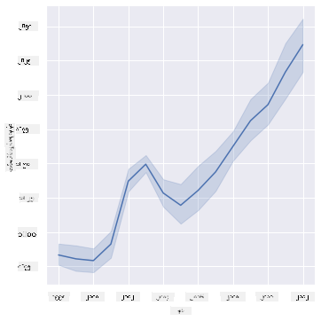
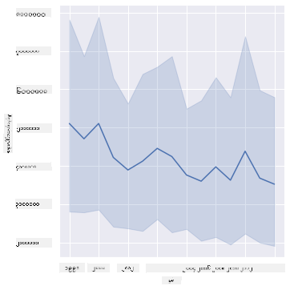
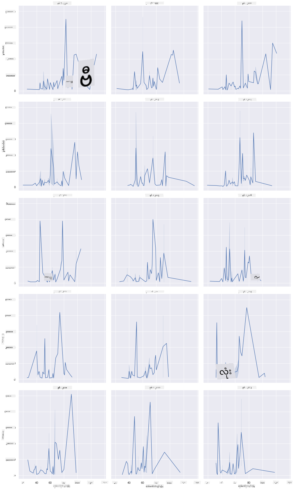
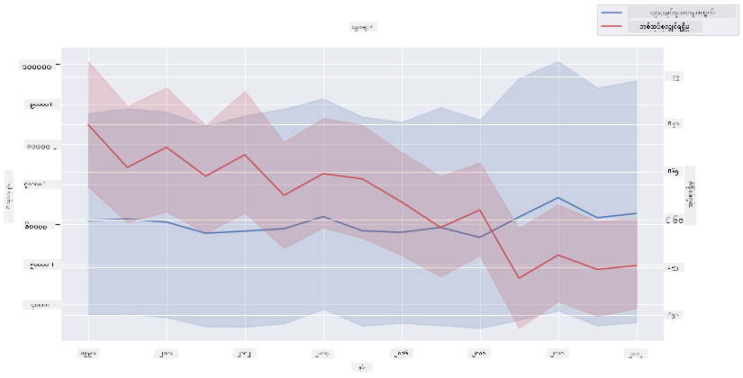

<!--
CO_OP_TRANSLATOR_METADATA:
{
  "original_hash": "cad419b574d5c35eaa417e9abfdcb0c8",
  "translation_date": "2025-08-30T19:12:42+00:00",
  "source_file": "3-Data-Visualization/12-visualization-relationships/README.md",
  "language_code": "my"
}
-->
# ဆက်ဆံရေးများကို မြင်သာအောင် ဖော်ပြခြင်း: ပျားရည်အကြောင်း 🍯

| ](../../sketchnotes/12-Visualizing-Relationships.png)|
|:---:|
|ဆက်ဆံရေးများကို မြင်သာအောင် ဖော်ပြခြင်း - _Sketchnote by [@nitya](https://twitter.com/nitya)_ |

ကျွန်ုပ်တို့၏ သုတေသနတွင် သဘာဝအပေါ် အာရုံစိုက်မှုကို ဆက်လက်လုပ်ဆောင်နေစဉ်၊ အမျိုးမျိုးသော ပျားရည်အမျိုးအစားများအကြား ဆက်ဆံရေးများကို ဖော်ပြရန် စိတ်ဝင်စားဖွယ် မြင်ကွင်းဖော်ပြမှုများကို ရှာဖွေကြမည်။ ဒီအချက်အလက်များကို [အမေရိကန် စိုက်ပျိုးရေးဌာန](https://www.nass.usda.gov/About_NASS/index.php) မှ ရရှိသော ဒေတာများအပေါ် အခြေခံထားသည်။

ဤဒေတာတွင် အမေရိကန်ပြည်နယ်များစွာမှ ပျားရည်ထုတ်လုပ်မှုအခြေအနေ ၆၀၀ ခန့်ပါဝင်သည်။ ဥပမာအားဖြင့်၊ ၁၉၉၈-၂၀၁၂ ခုနှစ်အတွင်း ပြည်နယ်တစ်ခုစီ၏ တစ်နှစ်စီအတွက် ပျားအုပ်ရေ၊ တစ်ပျားအုပ်လျှင် ထွက်ရှိမှု၊ စုစုပေါင်းထုတ်လုပ်မှု၊ စတော့များ၊ တစ်ပေါင်လျှင်ဈေးနှုန်းနှင့် ထုတ်လုပ်မှုတန်ဖိုးတို့ကို ကြည့်နိုင်သည်။

ဥပမာအားဖြင့်၊ တစ်ပြည်နယ်၏ တစ်နှစ်လျှင် ထုတ်လုပ်မှုနှင့် အဆိုပါပြည်နယ်၏ ပျားရည်ဈေးနှုန်းအကြား ဆက်ဆံရေးကို မြင်သာအောင် ဖော်ပြနိုင်သည်။ ဒါမှမဟုတ်၊ တစ်ပျားအုပ်လျှင် ပျားရည်ထွက်ရှိမှုနှင့် ပြည်နယ်များအကြား ဆက်ဆံရေးကို ဖော်ပြနိုင်သည်။ ၂၀၀၆ ခုနှစ်တွင် ပထမဆုံးတွေ့ရှိခဲ့သော 'CCD' သို့မဟုတ် 'Colony Collapse Disorder' (http://npic.orst.edu/envir/ccd.html) ကိုလည်း အချိန်ကာလအတွင်း လေ့လာရန် စိတ်ဝင်စားဖွယ် ဒေတာတစ်ခုဖြစ်သည်။ 🐝

## [Pre-lecture quiz](https://purple-hill-04aebfb03.1.azurestaticapps.net/quiz/22)

ဒီသင်ခန်းစာတွင် သင်ဟာ ယခင်က အသုံးပြုဖူးသော Seaborn ကို အသုံးပြုနိုင်ပြီး၊ အမျိုးမျိုးသော အပြောင်းအလဲများအကြား ဆက်ဆံရေးများကို မြင်သာအောင် ဖော်ပြရန် ကောင်းမွန်သော စာကြည့်တိုက်တစ်ခုဖြစ်သည်။ အထူးသဖြင့် Seaborn ၏ `relplot` function ကို အသုံးပြုခြင်းဖြင့် scatter plots နှင့် line plots များကို အလွယ်တကူ ဖော်ပြနိုင်သည်။ ၎င်းသည် ဒေတာသိပ္ပံပညာရှင်များအား အပြောင်းအလဲများအကြား ဆက်ဆံရေးကို ပိုမိုနားလည်စေရန် ကူညီပေးသည်။

## Scatterplots

ပျားရည်ဈေးနှုန်းသည် တစ်နှစ်နှင့်တစ်နှစ်အကြား ပြည်နယ်အလိုက် မည်သို့ တိုးတက်လာသည်ကို ဖော်ပြရန် scatterplot ကို အသုံးပြုပါ။ Seaborn ၏ `relplot` ကို အသုံးပြုခြင်းဖြင့် ပြည်နယ်ဒေတာများကို အုပ်စုဖွဲ့ပြီး အမျိုးအစားနှင့် ကိန်းဂဏန်းဒေတာများအတွက် ဒေတာအချက်အလက်များကို ဖော်ပြသည်။

ပထမဦးစွာ ဒေတာနှင့် Seaborn ကို တင်သွင်းပါ-

```python
import pandas as pd
import matplotlib.pyplot as plt
import seaborn as sns
honey = pd.read_csv('../../data/honey.csv')
honey.head()
```
ပျားရည်ဒေတာတွင် နှစ်နှင့် တစ်ပေါင်လျှင်ဈေးနှုန်းအပါအဝင် စိတ်ဝင်စားဖွယ် ကော်လံများစွာ ပါဝင်သည်ကို သတိပြုမိပါသည်။ အမေရိကန်ပြည်နယ်အလိုက် အုပ်စုဖွဲ့ထားသော ဒေတာကို စူးစမ်းကြည့်ပါ-

| state | numcol | yieldpercol | totalprod | stocks   | priceperlb | prodvalue | year |
| ----- | ------ | ----------- | --------- | -------- | ---------- | --------- | ---- |
| AL    | 16000  | 71          | 1136000   | 159000   | 0.72       | 818000    | 1998 |
| AZ    | 55000  | 60          | 3300000   | 1485000  | 0.64       | 2112000   | 1998 |
| AR    | 53000  | 65          | 3445000   | 1688000  | 0.59       | 2033000   | 1998 |
| CA    | 450000 | 83          | 37350000  | 12326000 | 0.62       | 23157000  | 1998 |
| CO    | 27000  | 72          | 1944000   | 1594000  | 0.7        | 1361000   | 1998 |

ပျားရည်တစ်ပေါင်လျှင်ဈေးနှုန်းနှင့် ၎င်း၏ အမေရိကန်ပြည်နယ်မူလအရင်းအမြစ်အကြား ဆက်ဆံရေးကို ဖော်ပြရန် အခြေခံ scatterplot တစ်ခု ဖန်တီးပါ။ `y` ဦးတည်ချက်ကို ပြည်နယ်အားလုံးကို ဖော်ပြနိုင်အောင် ရှည်လျားစေပါ-

```python
sns.relplot(x="priceperlb", y="state", data=honey, height=15, aspect=.5);
```


ယခု၊ နှစ်အလိုက် ပျားရည်ဈေးနှုန်း မည်သို့ တိုးတက်လာသည်ကို ဖော်ပြရန် ပျားရည်အရောင်စနစ်ကို အသုံးပြုပါ။ ၎င်းကို နှစ်အလိုက် အပြောင်းအလဲကို ဖော်ပြရန် 'hue' parameter ကို ထည့်သွင်းခြင်းဖြင့် ပြုလုပ်နိုင်သည်-

> ✅ Seaborn တွင် အသုံးပြုနိုင်သော [အရောင်စနစ်များ](https://seaborn.pydata.org/tutorial/color_palettes.html) အကြောင်းပိုမိုလေ့လာပါ - လှပသော rainbow အရောင်စနစ်ကို စမ်းကြည့်ပါ!

```python
sns.relplot(x="priceperlb", y="state", hue="year", palette="YlOrBr", data=honey, height=15, aspect=.5);
```


ဤအရောင်စနစ်ပြောင်းလဲမှုဖြင့်၊ ပျားရည်တစ်ပေါင်လျှင်ဈေးနှုန်းသည် နှစ်အလိုက် တိုးတက်မှုရှိနေသည်ကို ရှင်းလင်းစွာ မြင်နိုင်သည်။ အချို့သောဒေတာများကို စစ်ဆေးပါက (ဥပမာအားဖြင့် Arizona ပြည်နယ်) နှစ်အလိုက် ဈေးနှုန်းတိုးတက်မှုပုံစံကို အချို့သောအထူးကိစ္စများအပြင် တွေ့နိုင်သည်-

| state | numcol | yieldpercol | totalprod | stocks  | priceperlb | prodvalue | year |
| ----- | ------ | ----------- | --------- | ------- | ---------- | --------- | ---- |
| AZ    | 55000  | 60          | 3300000   | 1485000 | 0.64       | 2112000   | 1998 |
| AZ    | 52000  | 62          | 3224000   | 1548000 | 0.62       | 1999000   | 1999 |
| AZ    | 40000  | 59          | 2360000   | 1322000 | 0.73       | 1723000   | 2000 |
| AZ    | 43000  | 59          | 2537000   | 1142000 | 0.72       | 1827000   | 2001 |
| AZ    | 38000  | 63          | 2394000   | 1197000 | 1.08       | 2586000   | 2002 |
| AZ    | 35000  | 72          | 2520000   | 983000  | 1.34       | 3377000   | 2003 |
| AZ    | 32000  | 55          | 1760000   | 774000  | 1.11       | 1954000   | 2004 |
| AZ    | 36000  | 50          | 1800000   | 720000  | 1.04       | 1872000   | 2005 |
| AZ    | 30000  | 65          | 1950000   | 839000  | 0.91       | 1775000   | 2006 |
| AZ    | 30000  | 64          | 1920000   | 902000  | 1.26       | 2419000   | 2007 |
| AZ    | 25000  | 64          | 1600000   | 336000  | 1.26       | 2016000   | 2008 |
| AZ    | 20000  | 52          | 1040000   | 562000  | 1.45       | 1508000   | 2009 |
| AZ    | 24000  | 77          | 1848000   | 665000  | 1.52       | 2809000   | 2010 |
| AZ    | 23000  | 53          | 1219000   | 427000  | 1.55       | 1889000   | 2011 |
| AZ    | 22000  | 46          | 1012000   | 253000  | 1.79       | 1811000   | 2012 |

အရောင်အစား အရွယ်အစားကို အသုံးပြုခြင်းဖြင့် အခြားတစ်နည်းဖြင့် ဖော်ပြနိုင်သည်။ အရောင်မမြင်နိုင်သူများအတွက်၊ ၎င်းသည် ပိုမိုကောင်းမွန်သော ရွေးချယ်မှုဖြစ်နိုင်သည်။ dot အရွယ်အစားတိုးလာမှုဖြင့် ဈေးနှုန်းတိုးလာမှုကို ဖော်ပြရန် visualization ကို ပြင်ဆင်ပါ-

```python
sns.relplot(x="priceperlb", y="state", size="year", data=honey, height=15, aspect=.5);
```
dot အရွယ်အစားသည် တဖြည်းဖြည်း တိုးလာသည်ကို မြင်နိုင်သည်။


ဤသည်သည် ရိုးရှင်းသော supply နှင့် demand အခြေအနေဖြစ်နိုင်ပါသလား။ ရာသီဥတုပြောင်းလဲမှုနှင့် ပျားအုပ်ပျက်စီးမှုကြောင့် နှစ်အလိုက် ဝယ်ယူနိုင်သော ပျားရည်ပမာဏ လျော့နည်းနေပြီး ဈေးနှုန်းတက်နေပါသလား။

ဤဒေတာတွင် အချို့သော အပြောင်းအလဲများအကြား ဆက်စပ်မှုကို ရှာဖွေရန်၊ line charts များကို စူးစမ်းကြည့်ပါ။

## Line charts

မေးခွန်း- ပျားရည်တစ်ပေါင်လျှင်ဈေးနှုန်းသည် နှစ်အလိုက် တိုးတက်မှု ရှိပါသလား။ ၎င်းကို တစ်ကြိမ်တည်း မြင်နိုင်ရန် single line chart တစ်ခု ဖန်တီးပါ-

```python
sns.relplot(x="year", y="priceperlb", kind="line", data=honey);
```
အဖြေ- ဟုတ်ကဲ့၊ ၂၀၀၃ ခုနှစ်အနီးတွင် အချို့သော အထူးကိစ္စများအပြင်-



✅ Seaborn သည် တစ်ကြိမ်တည်းတွင် ဒေတာများကို စုစည်းပြီး၊ "x value တစ်ခုစီတွင် အများအပြားတိုင်းတာမှုများကို အလယ်အလတ်နှင့် ၉၅% ယုံကြည်မှုအကွာအဝေးဖြင့် ဖော်ပြသည်"။ [အရင်းအမြစ်](https://seaborn.pydata.org/tutorial/relational.html)။ ဤအချိန်စားလုပ်ငန်းစဉ်ကို `ci=None` ဖြင့် ပိတ်ထားနိုင်သည်။

မေးခွန်း- ၂၀၀၃ ခုနှစ်တွင် ပျားရည်ထုတ်လုပ်မှုတွင်လည်း တက်တက်ကြွကြောင်း မြင်နိုင်ပါသလား။ နှစ်အလိုက် စုစုပေါင်းထုတ်လုပ်မှုကို ကြည့်ပါ-

```python
sns.relplot(x="year", y="totalprod", kind="line", data=honey);
```



အဖြေ- မဟုတ်ပါ။ စုစုပေါင်းထုတ်လုပ်မှုကို ကြည့်ပါက၊ အထူးသဖြင့် ထိုနှစ်တွင် တိုးတက်မှုရှိသော်လည်း၊ ယင်းနှစ်များအတွင်း ပျားရည်ထုတ်လုပ်မှုသည် ယေဘူယျအားဖြင့် လျော့နည်းနေသည်ကို တွေ့နိုင်သည်။

မေးခွန်း- ထိုအချိန်တွင် ၂၀၀၃ ခုနှစ်အနီး ပျားရည်ဈေးနှုန်း တက်တက်ကြွမှုကို ဘာကြောင့် ဖြစ်စေခဲ့နိုင်သလဲ။

ဤအကြောင်းကို ရှာဖွေရန်၊ facet grid ကို စမ်းကြည့်ပါ။

## Facet grids

Facet grids သည် ဒေတာ၏ တစ်ဖက်ကို (ဤအခါတွင် 'year' ကို ရွေးချယ်ပါ) အသုံးပြုသည်။ Seaborn သည် သတ်မှတ်ထားသော x နှင့် y ကိုယ်ရေးအချက်အလက်များအတွက် facet တစ်ခုစီအတွက် plot တစ်ခုစီ ဖန်တီးနိုင်သည်။ ၂၀၀၃ ခုနှစ်သည် ဤအမျိုးအစားတွင် ထူးခြားနေပါသလား။

Seaborn ၏ [documentation](https://seaborn.pydata.org/generated/seaborn.FacetGrid.html?highlight=facetgrid#seaborn.FacetGrid) အတိုင်း `relplot` ကို ဆက်လက်အသုံးပြု၍ facet grid တစ်ခု ဖန်တီးပါ။

```python
sns.relplot(
    data=honey, 
    x="yieldpercol", y="numcol",
    col="year", 
    col_wrap=3,
    kind="line"
```
ဤ visualization တွင်၊ နှစ်အလိုက်နှင့် ပြည်နယ်အလိုက် တစ်ပျားအုပ်လျှင် ထွက်ရှိမှုနှင့် ပျားအုပ်ရေကို နှိုင်းယှဉ်ကြည့်နိုင်သည်။ wrap ကို ၃ အဖြစ် သတ်မှတ်ထားသည်-



ဤဒေတာအတွက်၊ နှစ်အလိုက်နှင့် ပြည်နယ်အလိုက် ပျားအုပ်ရေနှင့် ၎င်းတို့၏ ထွက်ရှိမှုနှင့် ပတ်သက်၍ ထူးခြားသောအရာမရှိပါ။ ဤ variables နှစ်ခုအကြား ဆက်စပ်မှုကို ရှာဖွေရန် အခြားနည်းလမ်းတစ်ခု ရှိပါသလား။

## Dual-line Plots

Seaborn ၏ 'despine' ကို အသုံးပြု၍ ထိပ်နှင့် ညာဘက် spines များကို ဖယ်ရှားပြီး၊ Matplotlib မှ [ax.twinx](https://matplotlib.org/stable/api/_as_gen/matplotlib.axes.Axes.twinx.html) ကို အသုံးပြု၍၊ နှစ်ခုသော lineplots များကို တစ်ခုနှင့်တစ်ခု အပြိုင်ဖော်ပြပါ။ Twinx သည် x axis ကို မျှဝေပြီး y axis နှစ်ခုကို ဖော်ပြနိုင်သည်။ ထို့ကြောင့်၊ တစ်ပျားအုပ်လျှင် ထွက်ရှိမှုနှင့် ပျားအုပ်ရေကို superimposed အဖြစ် ဖော်ပြပါ-

```python
fig, ax = plt.subplots(figsize=(12,6))
lineplot = sns.lineplot(x=honey['year'], y=honey['numcol'], data=honey, 
                        label = 'Number of bee colonies', legend=False)
sns.despine()
plt.ylabel('# colonies')
plt.title('Honey Production Year over Year');

ax2 = ax.twinx()
lineplot2 = sns.lineplot(x=honey['year'], y=honey['yieldpercol'], ax=ax2, color="r", 
                         label ='Yield per colony', legend=False) 
sns.despine(right=False)
plt.ylabel('colony yield')
ax.figure.legend();
```


၂၀၀၃ ခုနှစ်အနီး ထူးခြားသောအရာ မတွေ့ရသော်လည်း၊ ပျားအုပ်ရေသည် လျော့နည်းနေသော်လည်း တည်ငြိမ်နေပြီး၊ တစ်ပျားအုပ်လျှင် ထွက်ရှိမှုသည် လျော့နည်းနေသည်ကို မြင်နိုင်သည်။

ပျားများကို အားပေးကြပါစို့!

🐝❤️
## 🚀 စိန်ခေါ်မှု

ဤသင်ခန်းစာတွင်၊ scatterplots နှင့် line grids များ၏ အခြားအသုံးများအကြောင်း နည်းနည်းပိုမိုလေ့လာခဲ့ပါသည်။ သင်ယခင်သင်ခန်းစာများတွင် အသုံးပြုခဲ့သော ဒေတာတစ်ခုကို အသုံးပြု၍ facet grid တစ်ခု ဖန်တီးရန် ကိုယ်တိုင်စိန်ခေါ်ပါ။ ၎င်းတို့ကို ဖန်တီးရန် ကြာချိန်နှင့် grid များအရေအတွက်ကို သတိထားရန် လိုအပ်သည်ကို သတိပြုပါ။

## [Post-lecture quiz](https://purple-hill-04aebfb03.1.azurestaticapps.net/quiz/23)

## ပြန်လည်သုံးသပ်ခြင်းနှင့် ကိုယ်တိုင်လေ့

---

**အကြောင်းကြားချက်**:  
ဤစာရွက်စာတမ်းကို AI ဘာသာပြန်ဝန်ဆောင်မှု [Co-op Translator](https://github.com/Azure/co-op-translator) ကို အသုံးပြု၍ ဘာသာပြန်ထားပါသည်။ ကျွန်ုပ်တို့သည် တိကျမှုအတွက် ကြိုးစားနေသော်လည်း၊ အလိုအလျောက် ဘာသာပြန်ခြင်းတွင် အမှားများ သို့မဟုတ် မတိကျမှုများ ပါရှိနိုင်သည်ကို သတိပြုပါ။ မူရင်းဘာသာစကားဖြင့် ရေးသားထားသော စာရွက်စာတမ်းကို အာဏာရှိသော ရင်းမြစ်အဖြစ် သတ်မှတ်သင့်ပါသည်။ အရေးကြီးသော အချက်အလက်များအတွက် လူ့ဘာသာပြန်ပညာရှင်များမှ ပရော်ဖက်ရှင်နယ် ဘာသာပြန်ခြင်းကို အကြံပြုပါသည်။ ဤဘာသာပြန်ကို အသုံးပြုခြင်းမှ ဖြစ်ပေါ်လာသော အလွဲအလွဲအချော်အချော်များ သို့မဟုတ် အနားလွဲမှုများအတွက် ကျွန်ုပ်တို့သည် တာဝန်မယူပါ။