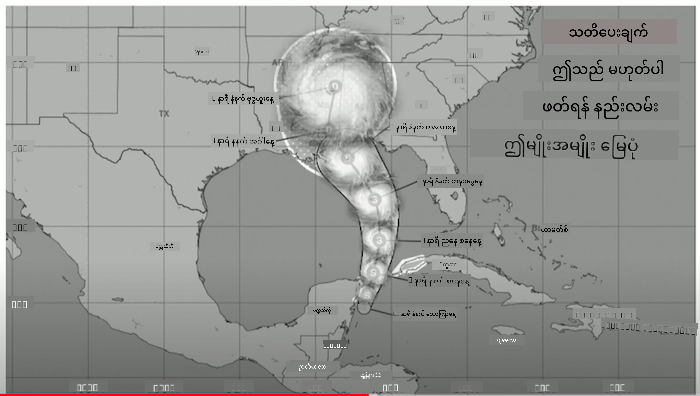
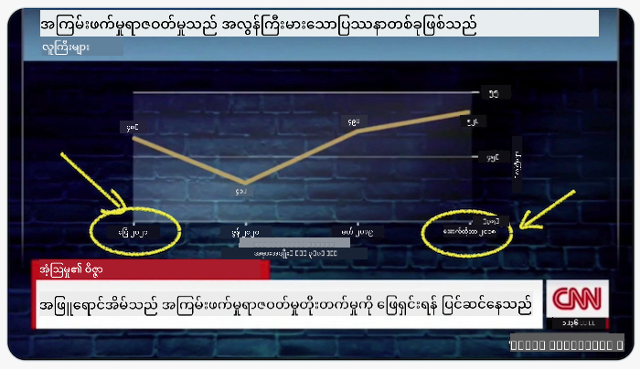
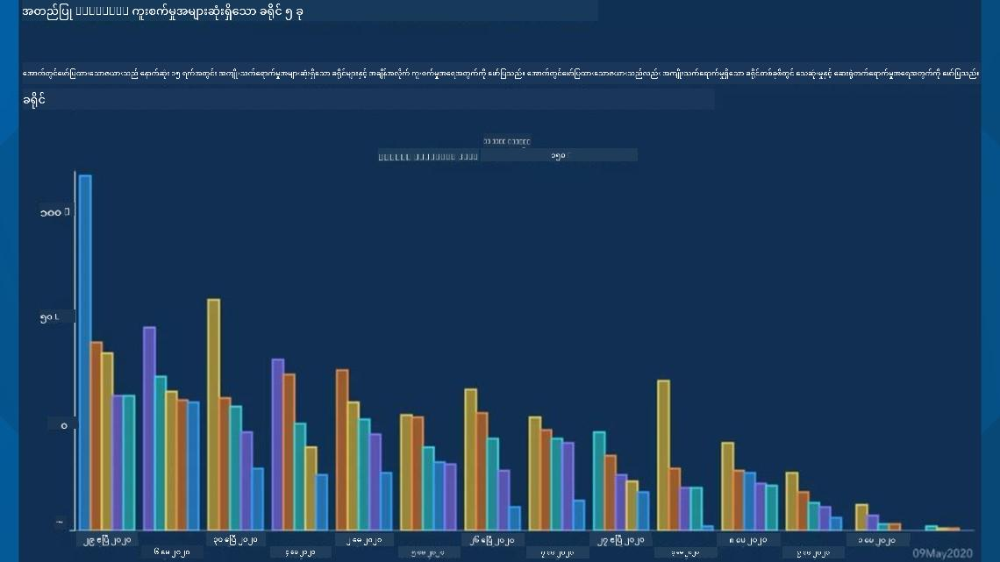
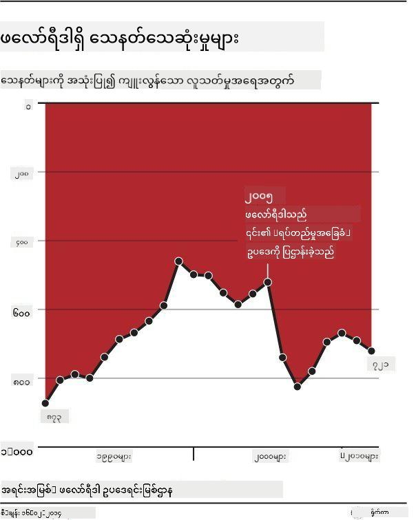

<!--
CO_OP_TRANSLATOR_METADATA:
{
  "original_hash": "4ec4747a9f4f7d194248ea29903ae165",
  "translation_date": "2025-08-30T19:08:03+00:00",
  "source_file": "3-Data-Visualization/13-meaningful-visualizations/README.md",
  "language_code": "my"
}
-->
# အဓိပ္ပါယ်ရှိသော ဒေတာအမြင်ဖန်တီးခြင်း

| ](../../sketchnotes/13-MeaningfulViz.png)|
|:---:|
| အဓိပ္ပါယ်ရှိသော ဒေတာအမြင်ဖန်တီးခြင်း - _Sketchnote by [@nitya](https://twitter.com/nitya)_ |

> "ဒေတာကို အလွန်အမင်းနှိပ်စက်လိုက်ရင်၊ အရာအားလုံးကို ဝန်ခံမယ်" -- [Ronald Coase](https://en.wikiquote.org/wiki/Ronald_Coase)

ဒေတာသိပ္ပံပညာရှင်တစ်ဦး၏ အခြေခံကျသော ကျွမ်းကျင်မှုတစ်ခုမှာ မိမိတွေးထားသော မေးခွန်းများကို ဖြေရှင်းနိုင်ရန် အထောက်အကူပြုသော အဓိပ္ပါယ်ရှိသော ဒေတာအမြင်ကို ဖန်တီးနိုင်စွမ်းဖြစ်သည်။ ဒေတာကို အမြင်ဖန်တီးမည်မီတွင်၊ ယခင်သင်ခန်းစာများတွင်လုပ်ခဲ့သည့်အတိုင်း ဒေတာကို သန့်စင်ပြီး ပြင်ဆင်ထားရန် လိုအပ်သည်။ ထို့နောက်၊ ဒေတာကို အကောင်းဆုံး ဖော်ပြရန် ဆုံးဖြတ်နိုင်ပါပြီ။

ဒီသင်ခန်းစာမှာ သင်လေ့လာမည့်အရာများမှာ -

1. မှန်ကန်သော ချတ်အမျိုးအစားကို ရွေးချယ်နည်း
2. လှည့်စားသော ချတ်ဖန်တီးမှုကို ရှောင်ရှားနည်း
3. အရောင်နှင့် အလုပ်လုပ်နည်း
4. ဖတ်ရှုရလွယ်ကူစေရန် ချတ်များကို စတိုင်ပြင်ဆင်နည်း
5. အနုစိတ်အမြင်များ သို့မဟုတ် 3D ချတ်ဖန်တီးနည်း
6. ဖန်တီးမှုအမြင်တစ်ခုကို ဖန်တီးနည်း

## [Pre-Lecture Quiz](https://purple-hill-04aebfb03.1.azurestaticapps.net/quiz/24)

## မှန်ကန်သော ချတ်အမျိုးအစားကို ရွေးချယ်ခြင်း

ယခင်သင်ခန်းစာများတွင်၊ သင်သည် Matplotlib နှင့် Seaborn ကို အသုံးပြု၍ စိတ်ဝင်စားဖွယ် ဒေတာအမြင်များကို ဖန်တီးခဲ့သည်။ ယေဘူယျအားဖြင့်၊ မေးခွန်းတစ်ခုကို ဖြေရှင်းရန် [မှန်ကန်သော ချတ်အမျိုးအစား](https://chartio.com/learn/charts/how-to-select-a-data-vizualization/) ကို ရွေးချယ်နိုင်သည်။ အောက်ပါဇယားကို အသုံးပြုပါ -

| သင်လိုအပ်သည်:               | သင်အသုံးပြုသင့်သည်:                 |
| -------------------------- | ------------------------------- |
| အချိန်အလိုက် ဒေတာလမ်းကြောင်းကို ဖော်ပြရန် | Line                            |
| အမျိုးအစားများကို နှိုင်းယှဉ်ရန်         | Bar, Pie                        |
| စုစုပေါင်းကို နှိုင်းယှဉ်ရန်             | Pie, Stacked Bar                |
| ဆက်နွယ်မှုများကို ဖော်ပြရန်         | Scatter, Line, Facet, Dual Line |
| ဖြန့်ဝေမှုများကို ဖော်ပြရန်         | Scatter, Histogram, Box         |
| အချိုးအစားများကို ဖော်ပြရန်           | Pie, Donut, Waffle              |

> ✅ သင့်ဒေတာ၏ ဖွဲ့စည်းမှုအပေါ် မူတည်၍၊ ချတ်တစ်ခုကို ထောက်ပံ့ရန် ဒေတာကို စာသားမှ နံပါတ်သို့ ပြောင်းလဲရန် လိုအပ်နိုင်သည်။

## လှည့်စားမှုကို ရှောင်ရှားခြင်း

ဒေတာသိပ္ပံပညာရှင်တစ်ဦးသည် မှန်ကန်သော ချတ်ကို မှန်ကန်သော ဒေတာအတွက် ရွေးချယ်သော်လည်း၊ ဒေတာကို အမှန်တစ်ရားကို ဖျက်ဆီးရန် ဖော်ပြနိုင်သော နည်းလမ်းများစွာရှိသည်။ ဒေတာကို လှည့်စားသော ချတ်များနှင့် အင်ဖိုဂရပ်များ၏ ဥပမာများစွာရှိသည်။

[](https://www.youtube.com/watch?v=oX74Nge8Wkw "How charts lie")

> 🎥 အထက်ပါပုံကို နှိပ်၍ လှည့်စားသော ချတ်များအကြောင်း ဆွေးနွေးမှုကို ကြည့်ပါ

ဒီချတ်သည် X axis ကို ပြောင်းလဲပြီး ရက်စွဲအပေါ် မူတည်၍ အမှန်တစ်ရား၏ ဆန့်ကျင်ဘက်ကို ဖော်ပြသည် -



[ဒီချတ်](https://media.firstcoastnews.com/assets/WTLV/images/170ae16f-4643-438f-b689-50d66ca6a8d8/170ae16f-4643-438f-b689-50d66ca6a8d8_1140x641.jpg) သည် ပိုမိုလှည့်စားမှုများရှိပြီး၊ မျက်လုံးသည် COVID အမှုများသည် အချိန်အလိုက် လျော့နည်းလာသည်ဟု သတ်မှတ်ရန် ညာဘက်သို့ ဆွဲဆောင်သည်။ သို့သော်၊ ရက်စွဲများကို အနိမ့်ဆွဲလျှောက်ထားထားသောကြောင့် လျော့နည်းမှုကို လှည့်စားထားသည်။



ဒီချတ်သည် အရောင်နှင့် ပြောင်းလဲထားသော Y axis ကို အသုံးပြု၍ လှည့်စားထားသည် - သေနတ်ပစ်မှုများသည် ဥပဒေပြုမှုအပြီး တက်လာသည်ဟု မျက်လုံးကို လှည့်စားစေသည်။



ဒီအဆန်းချတ်သည် အချိုးအစားကို ပြောင်းလဲပြီး ဟာသဆန်သော အကျိုးသက်ရောက်မှုကို ဖန်တီးသည် -


မတူညီသောအရာများကို နှိုင်းယှဉ်ခြင်းသည် လှည့်စားမှုတစ်ခုဖြစ်သည်။ [Spurious correlations](https://tylervigen.com/spurious-correlations) ဆိုသော ဝဘ်ဆိုဒ်သည် Maine တွင် အိမ်ထောင်ဖျက်နှင့် Margarine စားသုံးမှုတို့ကို နှိုင်းယှဉ်ထားသော 'အတု correlation' များကို ဖော်ပြသည်။ Reddit မှာလည်း [dataisugly](https://www.reddit.com/r/dataisugly/top/?t=all) ဆိုသော အဖွဲ့သည် ဒေတာကို မလှပစွာ အသုံးပြုထားသော ဥပမာများကို စုဆောင်းထားသည်။

## အရောင်

'Florida gun violence' ချတ်တွင် မြင်ရသည့်အတိုင်း၊ အရောင်သည် ချတ်များတွင် အဓိပ္ပါယ်တစ်ခုကို ထပ်ဆောင်းပေးနိုင်သည်။ Matplotlib နှင့် Seaborn ကဲ့သို့သော စာကြောင်းများကို အသုံးပြု၍ ဖန်တီးထားသော ချတ်များတွင် အရောင် library များနှင့် palette များပါဝင်သည်။ သင်ကိုယ်တိုင် ချတ်ကို ဖန်တီးနေပါက၊ [အရောင်သီအိုရီ](https://colormatters.com/color-and-design/basic-color-theory) ကို လေ့လာပါ။

> ✅ ချတ်များကို ဒီဇိုင်းဆွဲနေစဉ်၊ အရောင်မမြင်နိုင်သောသူများအတွက် ချတ်သည် အဆင်ပြေမပြေ စဉ်းစားပါ။

## ချတ်များကို ဖတ်ရှုရလွယ်ကူစေရန် စတိုင်ပြင်ဆင်ခြင်း

ချတ်များသည် ဖတ်ရှုရလွယ်ကူမှသာ အဓိပ္ပါယ်ရှိသည်။ ချတ်၏ အကျယ်အနံကို သင့်ဒေတာနှင့် ကိုက်ညီစေရန် စဉ်းစားပါ။ အမျိုးအစားများစွာ (ဥပမာ - 50 ပြည်နယ်) ကို ဖော်ပြရန်လိုပါက၊ Y axis တွင် တန်းစီဖော်ပြပါ။

## အနုစိတ်အမြင်များနှင့် 3D ချတ်ဖန်တီးခြင်း

ယနေ့အချိန်တွင် အကောင်းဆုံး ဒေတာအမြင်များသည် အနုစိတ်ဖြစ်သည်။ Shirley Wu ၏ '[film flowers](http://bl.ocks.org/sxywu/raw/d612c6c653fb8b4d7ff3d422be164a5d/)' ကဲ့သို့သော D3 ဖြင့် ဖန်တီးထားသော အနုစိတ်အမြင်များသည် ထူးခြားသည်။

## Project: D3.js ဖြင့် network ကို ဖော်ပြသော ချတ်တစ်ခု ဖန်တီးပါ

> ဒီသင်ခန်းစာ folder တွင် `solution` folder ပါဝင်ပြီး၊ အပြီးသတ် project ကို ရှာနိုင်ပါသည်။

1. README.md ဖိုင်တွင် ရှိသော လမ်းညွှန်ချက်များကို လိုက်နာပါ။ NPM နှင့် Node.js ကို သင့်စက်တွင် အလုပ်လုပ်စေပါ။

2. `starter/src` folder ကို ဖွင့်ပါ။ `assets` folder တွင် .json ဖိုင်တစ်ခုရှိပြီး၊ 'to' နှင့် 'from' annotation ပါဝင်သည်။

3. `components/Nodes.vue` တွင် `createLinks()` method ကို ပြည့်စုံစေရန် loop ကို ထည့်ပါ။

```javascript
//loop through letters
      let f = 0;
      let t = 0;
      for (var i = 0; i < letters.length; i++) {
          for (var j = 0; j < characters.length; j++) {
              
            if (characters[j] == letters[i].from) {
              f = j;
            }
            if (characters[j] == letters[i].to) {
              t = j;
            }
        }
        this.links.push({ sid: f, tid: t });
      }
  ```

Terminal မှာ app ကို run (npm run serve) ပြီး visualization ကို ခံစားပါ။

## 🚀 Challenge

အင်တာနက်တွင် လှည့်စားသော visualization များကို ရှာပါ။ အရေးသားသူသည် မျက်လုံးကို လှည့်စားသည့်နည်းလမ်းများကို လေ့လာပြီး၊ အမှန်တစ်ရားကို ပြန်လည်ပြင်ဆင်ပါ။

## [Post-lecture quiz](https://purple-hill-04aebfb03.1.azurestaticapps.net/quiz/25)

## Review & Self Study

ဒီဆောင်းပါးများကို ဖတ်ပါ -

https://gizmodo.com/how-to-lie-with-data-visualization-1563576606

http://ixd.prattsi.org/2017/12/visual-lies-usability-in-deceptive-data-visualizations/

## Assignment

[သင့်ကိုယ်ပိုင် custom visualization ကို ဖန်တီးပါ](assignment.md)

---

**အကြောင်းကြားချက်**:  
ဤစာရွက်စာတမ်းကို AI ဘာသာပြန်ဝန်ဆောင်မှု [Co-op Translator](https://github.com/Azure/co-op-translator) ကို အသုံးပြု၍ ဘာသာပြန်ထားပါသည်။ ကျွန်ုပ်တို့သည် တိကျမှုအတွက် ကြိုးစားနေသော်လည်း၊ အလိုအလျောက် ဘာသာပြန်ခြင်းတွင် အမှားများ သို့မဟုတ် မတိကျမှုများ ပါဝင်နိုင်သည်ကို သတိပြုပါ။ မူရင်းစာရွက်စာတမ်းကို ၎င်း၏ မူရင်းဘာသာစကားဖြင့် အာဏာတရားရှိသော အရင်းအမြစ်အဖြစ် သတ်မှတ်သင့်ပါသည်။ အရေးကြီးသော အချက်အလက်များအတွက် လူက ဘာသာပြန်ခြင်းကို အကြံပြုပါသည်။ ဤဘာသာပြန်ကို အသုံးပြုခြင်းမှ ဖြစ်ပေါ်လာသော အလွဲအလွဲအချော်အချော်များ သို့မဟုတ် အနားလွဲမှုများအတွက် ကျွန်ုပ်တို့သည် တာဝန်မယူပါ။