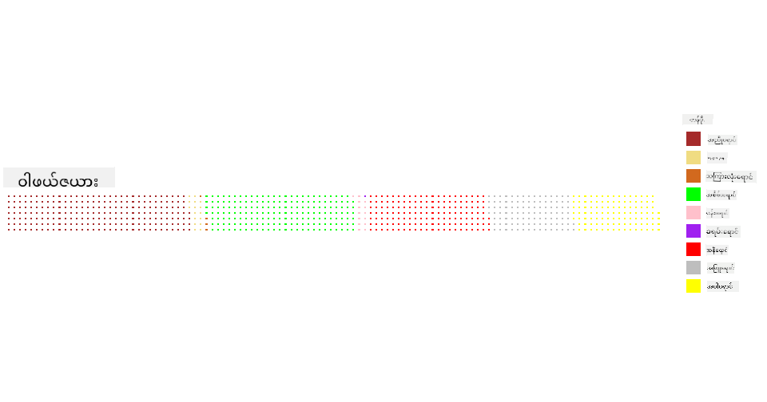

<!--
CO_OP_TRANSLATOR_METADATA:
{
  "original_hash": "47028abaaafa2bcb1079702d20569066",
  "translation_date": "2025-08-30T18:41:57+00:00",
  "source_file": "3-Data-Visualization/R/11-visualization-proportions/README.md",
  "language_code": "my"
}
-->
# အချိုးအစားများကို မြင်သာအောင် ဖော်ပြခြင်း

| ](../../../sketchnotes/11-Visualizing-Proportions.png)|
|:---:|
|အချိုးအစားများကို မြင်သာအောင် ဖော်ပြခြင်း - _Sketchnote by [@nitya](https://twitter.com/nitya)_ |

ဒီသင်ခန်းစာမှာ သဘာဝနှင့်ဆိုင်သော အခြားသောဒေတာစနစ်တစ်ခုကို အသုံးပြုပြီး မျိုးစုံသော မှိုများအကြောင်းကို အချိုးအစားအလိုက် မြင်သာအောင် ဖော်ပြမည်ဖြစ်သည်။ Audubon မှ ရရှိသော Agaricus နှင့် Lepiota မျိုးရင်းမှ အမျိုးအစား ၂၃ မျိုးပါဝင်သည့် မှိုများအကြောင်း ဒေတာကို အသုံးပြုကာ အလွန်စိတ်ဝင်စားဖွယ် မှိုများကို လေ့လာကြည့်ရအောင်။ သင်သည် အောက်ပါအတိုင်း စားချင်စရာကောင်းသော ဂရပ်ဖ်များကို စမ်းသပ်ကြည့်မည်ဖြစ်သည်-

- ပိုင်းကတ်များ 🥧  
- ဒိုနတ်ကတ်များ 🍩  
- ဝဖယ်ကတ်များ 🧇  

> 💡 Microsoft Research မှ ဖန်တီးထားသော [Charticulator](https://charticulator.com) ဟူသော စိတ်ဝင်စားဖွယ်ကောင်းသော ပရောဂျက်တစ်ခုသည် ဒေတာကို မြင်သာအောင် ဖော်ပြရန် အခမဲ့ drag-and-drop အင်တာဖေ့စ်ကို ပေးထားသည်။ သူတို့၏ သင်ခန်းစာတစ်ခုတွင်လည်း မှိုဒေတာကို အသုံးပြုထားသည်။ ဒေတာကို လေ့လာပြီး အဆိုပါ လိုက်ဘရရီကို တစ်ပြိုင်နက်တည်း သင်ယူနိုင်သည်- [Charticulator tutorial](https://charticulator.com/tutorials/tutorial4.html)။

## [သင်ခန်းစာမတိုင်မီ စမ်းမေးခွန်း](https://purple-hill-04aebfb03.1.azurestaticapps.net/quiz/20)

## သင်၏ မှိုများကို သိရှိကြည့်ပါ 🍄

မှိုများသည် အလွန်စိတ်ဝင်စားဖွယ်ကောင်းသည်။ ဒေတာတစ်ခုကို တင်သွင်းပြီး လေ့လာကြည့်ရအောင်-

```r
mushrooms = read.csv('../../data/mushrooms.csv')
head(mushrooms)
```  
အောက်တွင် အလွန်ကောင်းမွန်သော ဒေတာဇယားတစ်ခုကို ပုံနှိပ်ထားသည်-  

| class     | cap-shape | cap-surface | cap-color | bruises | odor    | gill-attachment | gill-spacing | gill-size | gill-color | stalk-shape | stalk-root | stalk-surface-above-ring | stalk-surface-below-ring | stalk-color-above-ring | stalk-color-below-ring | veil-type | veil-color | ring-number | ring-type | spore-print-color | population | habitat |
| --------- | --------- | ----------- | --------- | ------- | ------- | --------------- | ------------ | --------- | ---------- | ----------- | ---------- | ------------------------ | ------------------------ | ---------------------- | ---------------------- | --------- | ---------- | ----------- | --------- | ----------------- | ---------- | ------- |
| Poisonous | Convex    | Smooth      | Brown     | Bruises | Pungent | Free            | Close        | Narrow    | Black      | Enlarging   | Equal      | Smooth                   | Smooth                   | White                  | White                  | Partial   | White      | One         | Pendant   | Black             | Scattered  | Urban   |
| Edible    | Convex    | Smooth      | Yellow    | Bruises | Almond  | Free            | Close        | Broad     | Black      | Enlarging   | Club       | Smooth                   | Smooth                   | White                  | White                  | Partial   | White      | One         | Pendant   | Brown             | Numerous   | Grasses |
| Edible    | Bell      | Smooth      | White     | Bruises | Anise   | Free            | Close        | Broad     | Brown      | Enlarging   | Club       | Smooth                   | Smooth                   | White                  | White                  | Partial   | White      | One         | Pendant   | Brown             | Numerous   | Meadows |
| Poisonous | Convex    | Scaly       | White     | Bruises | Pungent | Free            | Close        | Narrow    | Brown      | Enlarging   | Equal      | Smooth                   | Smooth                   | White                  | White                  | Partial   | White      | One         | Pendant   | Black             | Scattered  | Urban |
| Edible    | Convex    | Smooth      | Green     | No Bruises | None   | Free            | Crowded      | Broad     | Black      | Tapering    | Equal      | Smooth                   | Smooth                   | White                  | White                  | Partial   | White      | One         | Evanescent | Brown             | Abundant   | Grasses |
| Edible    | Convex    | Scaly       | Yellow    | Bruises | Almond  | Free            | Close        | Broad     | Brown      | Enlarging   | Club       | Smooth                   | Smooth                   | White                  | White                  | Partial   | White      | One         | Pendant   | Black             | Numerous   | Grasses |

အလျင်အမြန် သတိထားမိသည်မှာ ဒေတာအားလုံးသည် စာသားဖြင့် ဖော်ပြထားခြင်းဖြစ်သည်။ ဂရပ်ဖ်တွင် အသုံးပြုနိုင်ရန်အတွက် ဒေတာကို ပြောင်းလဲရမည်ဖြစ်သည်။ အများစုသော ဒေတာသည် object အဖြစ် ဖော်ပြထားသည်-  

```r
names(mushrooms)
```  

အထွက်မှာ-  

```output
[1] "class"                    "cap.shape"               
 [3] "cap.surface"              "cap.color"               
 [5] "bruises"                  "odor"                    
 [7] "gill.attachment"          "gill.spacing"            
 [9] "gill.size"                "gill.color"              
[11] "stalk.shape"              "stalk.root"              
[13] "stalk.surface.above.ring" "stalk.surface.below.ring"
[15] "stalk.color.above.ring"   "stalk.color.below.ring"  
[17] "veil.type"                "veil.color"              
[19] "ring.number"              "ring.type"               
[21] "spore.print.color"        "population"              
[23] "habitat"            
```  

ဒီဒေတာကို ယူပြီး 'class' ကော်လံကို အမျိုးအစားအလိုက် ပြောင်းလဲပါ-  

```r
library(dplyr)
grouped=mushrooms %>%
  group_by(class) %>%
  summarise(count=n())
```  

ယခုမှ သင်၏ မှိုဒေတာကို ပုံနှိပ်ကြည့်ပါက Poisonous/Edible အမျိုးအစားအလိုက် အုပ်စုဖွဲ့ထားသည်ကို တွေ့နိုင်ပါသည်-  

```r
View(grouped)
```  

| class | count |
| --------- | --------- |
| Edible | 4208 |
| Poisonous| 3916 |

ဒီဇယားတွင် ဖော်ပြထားသည့် အစီအစဉ်အတိုင်း သင်၏ class အမျိုးအစားအတွက် အမှတ်အသားများကို ဖန်တီးပါက ပိုင်းကတ်တစ်ခုကို ဖန်တီးနိုင်ပါသည်။  

## ပိုင်းကတ်!

```r
pie(grouped$count,grouped$class, main="Edible?")
```  
Voila, ဒီဒေတာကို အမျိုးအစားနှစ်မျိုးအလိုက် ဖော်ပြထားသည့် ပိုင်းကတ်တစ်ခုဖြစ်သည်။ အမှတ်အသားများ၏ အစီအစဉ်ကို မှန်ကန်စေရန် အထူးသတိထားပါ။  


## ဒိုနတ်ကတ်များ!

ပိုင်းကတ်ထက် ပိုမိုစိတ်ဝင်စားဖွယ်ကောင်းသော ဒိုနတ်ကတ်သည် အလယ်တွင် အပေါက်ပါသော ပိုင်းကတ်တစ်မျိုးဖြစ်သည်။ မှိုများ၏ နေရာအမျိုးမျိုးကို ဒီနည်းဖြင့် ကြည့်ကြည့်ရအောင်-  

```r
library(dplyr)
habitat=mushrooms %>%
  group_by(habitat) %>%
  summarise(count=n())
View(habitat)
```  

အထွက်မှာ-  

| habitat| count |
| --------- | --------- |
| Grasses    | 2148 |
| Leaves| 832 |
| Meadows    | 292 |
| Paths| 1144 |
| Urban    | 368 |
| Waste| 192 |
| Wood| 3148 |

ဒီနေရာမှာ သင်၏ ဒေတာကို habitat အလိုက် အုပ်စုဖွဲ့ထားသည်။ Habitat ၇ မျိုးရှိပြီး ဒိုနတ်ကတ်အတွက် အမှတ်အသားများအဖြစ် အသုံးပြုနိုင်သည်-  

```r
library(ggplot2)
library(webr)
PieDonut(habitat, aes(habitat, count=count))
```  


ဒီကုဒ်သည် ggplot2 နှင့် webr ဆိုသော လိုက်ဘရရီနှစ်ခုကို အသုံးပြုထားသည်။ webr လိုက်ဘရရီ၏ PieDonut function ကို အသုံးပြု၍ ဒိုနတ်ကတ်ကို လွယ်ကူစွာ ဖန်တီးနိုင်သည်။  

R တွင် ggplot2 လိုက်ဘရရီကိုသာ အသုံးပြု၍လည်း ဒိုနတ်ကတ်ကို ဖန်တီးနိုင်သည်။ [ဒီမှာ](https://www.r-graph-gallery.com/128-ring-or-donut-plot.html) ပိုမိုလေ့လာနိုင်ပြီး ကိုယ်တိုင်စမ်းကြည့်နိုင်ပါသည်။  

## ဝဖယ်ကတ်များ!

'ဝဖယ်' ကတ်သည် အချိုးအစားများကို ၂D စတုရန်းများအဖြစ် ဖော်ပြသည့် နည်းလမ်းတစ်ခုဖြစ်သည်။ မှို cap color များ၏ အချိုးအစားကို ဖော်ပြကြည့်ရအောင်။ [waffle](https://cran.r-project.org/web/packages/waffle/waffle.pdf) ဆိုသော helper library ကို ထည့်သွင်းပြီး visualization ဖန်တီးပါ-  

```r
install.packages("waffle", repos = "https://cinc.rud.is")
```  

ဒေတာတစ်ခုကို ရွေးချယ်ပြီး အုပ်စုဖွဲ့ပါ-  

```r
library(dplyr)
cap_color=mushrooms %>%
  group_by(cap.color) %>%
  summarise(count=n())
View(cap_color)
```  

ဝဖယ်ကတ်ကို ဖန်တီးရန် အမှတ်အသားများကို ဖန်တီးပြီး ဒေတာကို အုပ်စုဖွဲ့ပါ-  

```r
library(waffle)
names(cap_color$count) = paste0(cap_color$cap.color)
waffle((cap_color$count/10), rows = 7, title = "Waffle Chart")+scale_fill_manual(values=c("brown", "#F0DC82", "#D2691E", "green", 
                                                                                     "pink", "purple", "red", "grey", 
                                                                                     "yellow","white"))
```  

ဝဖယ်ကတ်ကို အသုံးပြု၍ မှို cap color များ၏ အချိုးအစားကို ရှင်းလင်းစွာ မြင်နိုင်သည်။ စိတ်ဝင်စားစရာကောင်းသည်မှာ အစိမ်းရောင် cap များစွာရှိနေခြင်းဖြစ်သည်။  



ဒီသင်ခန်းစာတွင် သင်သည် အချိုးအစားများကို ဖော်ပြရန် နည်းလမ်းသုံးမျိုးကို သင်ယူခဲ့သည်- ပိုင်းကတ်၊ ဒိုနတ်ကတ်၊ နှင့် ဝဖယ်ကတ်။ ဒေတာကို အုပ်စုဖွဲ့ပြီး အကောင်းဆုံး ဖော်ပြနည်းကို ရွေးချယ်ပါ။  

## 🚀 စိန်ခေါ်မှု

[Charticulator](https://charticulator.com) တွင် ဒီဂရပ်ဖ်များကို ပြန်ဖန်တီးကြည့်ပါ။  

## [သင်ခန်းစာပြီးနောက် စမ်းမေးခွန်း](https://purple-hill-04aebfb03.1.azurestaticapps.net/quiz/21)

## ပြန်လည်သုံးသပ်ခြင်းနှင့် ကိုယ်တိုင်လေ့လာခြင်း

တစ်ခါတစ်ရံတွင် ပိုင်းကတ်၊ ဒိုနတ်ကတ်၊ သို့မဟုတ် ဝဖယ်ကတ်ကို ဘယ်အချိန်မှာ အသုံးပြုရမည်ဆိုတာ မရှင်းလင်းနိုင်ပါ။ ဒီအကြောင်းကို ဖတ်ရှုရန် ဆောင်းပါးများ-  

https://www.beautiful.ai/blog/battle-of-the-charts-pie-chart-vs-donut-chart  

https://medium.com/@hypsypops/pie-chart-vs-donut-chart-showdown-in-the-ring-5d24fd86a9ce  

https://www.mit.edu/~mbarker/formula1/f1help/11-ch-c6.htm  

https://medium.datadriveninvestor.com/data-visualization-done-the-right-way-with-tableau-waffle-chart-fdf2a19be402  

ဒီဆုံးဖြတ်ချက်အကြောင်း ပိုမိုသိရှိရန် သုတေသနလုပ်ပါ။  

## လက်တွေ့လေ့ကျင့်မှု

[Excel တွင် စမ်းကြည့်ပါ](assignment.md)  

---

**အကြောင်းကြားချက်**:  
ဤစာရွက်စာတမ်းကို AI ဘာသာပြန်ဝန်ဆောင်မှု [Co-op Translator](https://github.com/Azure/co-op-translator) ကို အသုံးပြု၍ ဘာသာပြန်ထားပါသည်။ ကျွန်ုပ်တို့သည် တိကျမှုအတွက် ကြိုးစားနေသော်လည်း၊ အလိုအလျောက် ဘာသာပြန်ခြင်းတွင် အမှားများ သို့မဟုတ် မတိကျမှုများ ပါဝင်နိုင်သည်ကို သတိပြုပါ။ မူရင်းစာရွက်စာတမ်းကို ၎င်း၏ မူရင်းဘာသာစကားဖြင့် အာဏာတရားရှိသော အရင်းအမြစ်အဖြစ် ရှုလေ့လာသင့်ပါသည်။ အရေးကြီးသော အချက်အလက်များအတွက် လူ့ဘာသာပြန်ပညာရှင်များမှ ပရော်ဖက်ရှင်နယ် ဘာသာပြန်ခြင်းကို အကြံပြုပါသည်။ ဤဘာသာပြန်ကို အသုံးပြုခြင်းမှ ဖြစ်ပေါ်လာသော အလွဲသုံးစားမှု သို့မဟုတ် အနားလွဲမှုများအပေါ် ကျွန်ုပ်တို့သည် တာဝန်မယူပါ။