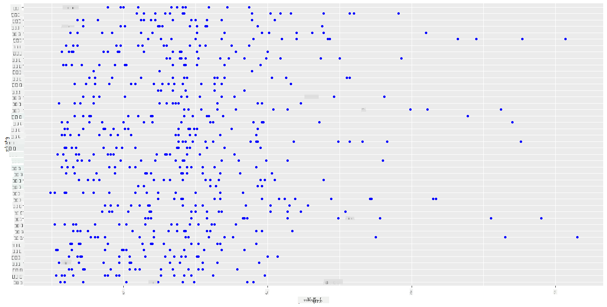
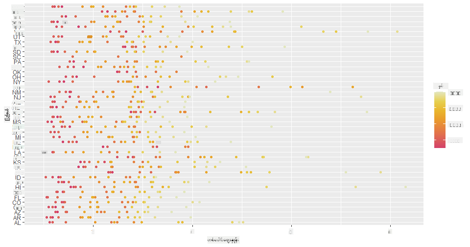
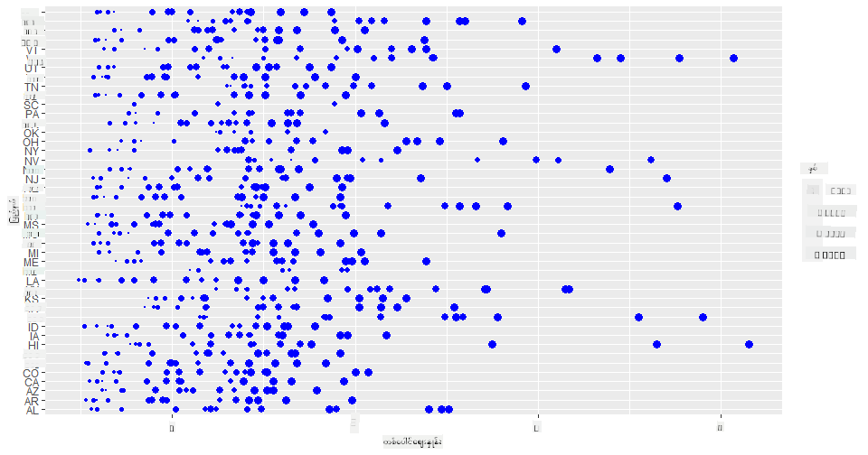
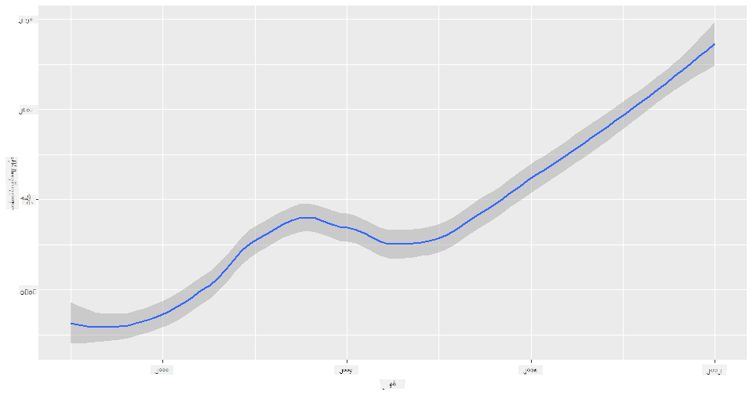
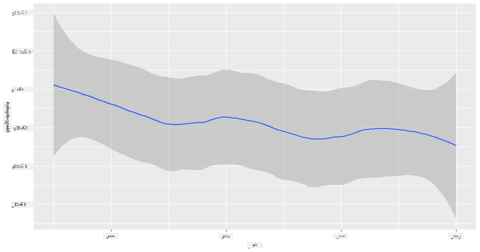
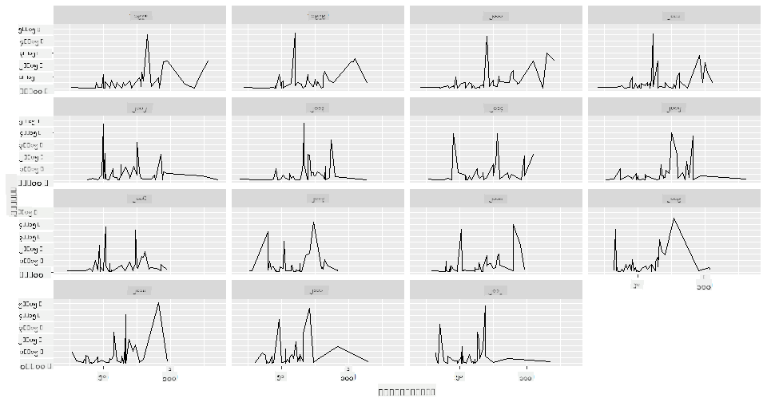
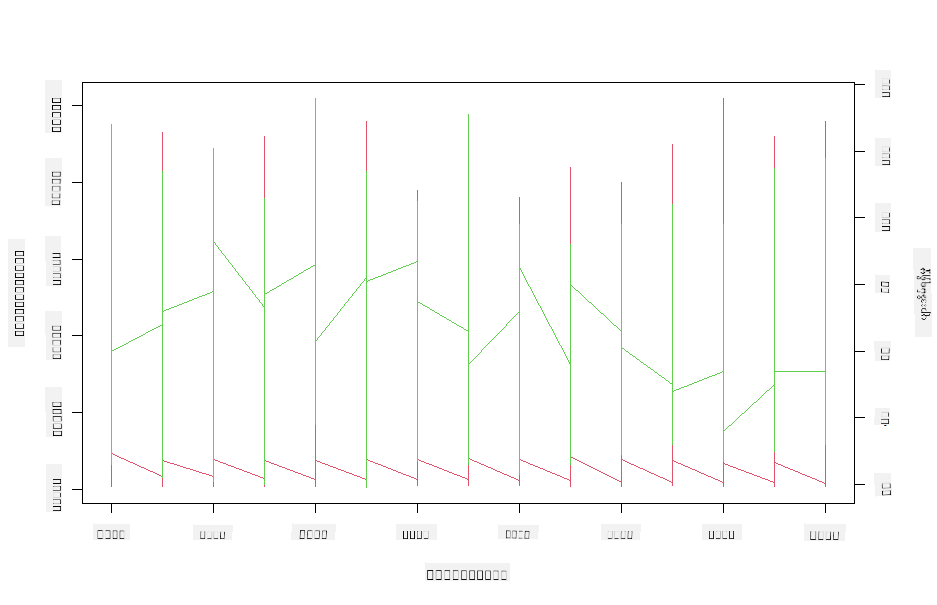

<!--
CO_OP_TRANSLATOR_METADATA:
{
  "original_hash": "a33c5d4b4156a2b41788d8720b6f724c",
  "translation_date": "2025-08-30T18:49:21+00:00",
  "source_file": "3-Data-Visualization/R/12-visualization-relationships/README.md",
  "language_code": "my"
}
-->
# ဆက်စပ်မှုများကိုမြင်သာစေခြင်း: ပျားရည်အကြောင်း 🍯

| ](../../../sketchnotes/12-Visualizing-Relationships.png)|
|:---:|
|ဆက်စပ်မှုများကိုမြင်သာစေခြင်း - _Sketchnote by [@nitya](https://twitter.com/nitya)_ |

သဘာဝကိုအခြေခံထားသော ကျွန်ုပ်တို့၏သုတေသနကို ဆက်လက်လုပ်ဆောင်ရင်း၊ [အမေရိကန်စိုက်ပျိုးရေးဌာန](https://www.nass.usda.gov/About_NASS/index.php) မှရရှိသောဒေတာအရ ပျားရည်အမျိုးအစားများအကြား ဆက်စပ်မှုများကို ပြသရန် စိတ်ဝင်စားဖွယ်မြင်ကွင်းများကို ရှာဖွေကြပါစို့။

ဤဒေတာစဉ်တွင် အမေရိကန်ပြည်နယ်များစွာမှ ပျားရည်ထုတ်လုပ်မှုအခြေအနေကို ၆၀၀ ခန့်ဖော်ပြထားသည်။ ဥပမာအားဖြင့်၊ ၁၉၉၈-၂၀၁၂ အတွင်း တစ်နှစ်စီအတွက် ပြည်နယ်တစ်ခုစီ၏ ပျားအုပ်အရေအတွက်၊ တစ်အုပ်လျှင်ထွက်ရှိမှု၊ စုစုပေါင်းထုတ်လုပ်မှု၊ လက်ကျန်ပစ္စည်းများ၊ တစ်ပေါင်လျှင်ဈေးနှုန်းနှင့် ထုတ်လုပ်မှုတန်ဖိုးကို ကြည့်နိုင်ပါသည်။

ဥပမာအားဖြင့် တစ်ပြည်နယ်၏ တစ်နှစ်စီအတွက် ထုတ်လုပ်မှုနှင့် ထိုပြည်နယ်ရှိ ပျားရည်ဈေးနှုန်းအကြား ဆက်စပ်မှုကို မြင်သာစေမည့် မြင်ကွင်းတစ်ခုကို ဖန်တီးနိုင်ပါသည်။ ဒါမှမဟုတ် တစ်အုပ်လျှင်ထွက်ရှိမှုအရ ပြည်နယ်များအကြား ဆက်စပ်မှုကို မြင်သာစေမည့် မြင်ကွင်းတစ်ခုကို ဖန်တီးနိုင်ပါသည်။ ဤနှစ်အပိုင်းတွင် ၂၀၀၆ ခုနှစ်တွင် ပထမဆုံးတွေ့ရှိခဲ့သော 'CCD' သို့မဟုတ် 'Colony Collapse Disorder' (http://npic.orst.edu/envir/ccd.html) ကိုလည်း ဖော်ပြထားသောကြောင့် စိတ်ဝင်စားဖွယ်ဒေတာစဉ်တစ်ခုဖြစ်သည်။ 🐝

## [Pre-lecture quiz](https://purple-hill-04aebfb03.1.azurestaticapps.net/quiz/22)

ဤသင်ခန်းစာတွင် သင်သည် ယခင်ကအသုံးပြုခဲ့သော ggplot2 ကို အသုံးပြုနိုင်မည်ဖြစ်ပြီး၊ အမျိုးမျိုးသောအပြောင်းအလဲများအကြား ဆက်စပ်မှုများကို မြင်သာစေရာတွင် အထူးကောင်းမွန်သော စာကြည့်တိုက်တစ်ခုဖြစ်သည်။ အထူးသဖြင့် ggplot2 ၏ `geom_point` နှင့် `qplot` function ကို အသုံးပြု၍ scatter plot နှင့် line plot များကို အလွယ်တကူဖန်တီးနိုင်သည်။ ဤသည်မှာ '[statistical relationships](https://ggplot2.tidyverse.org/)' ကို မြင်သာစေပြီး ဒေတာသိပ္ပံပညာရှင်များအတွက် အပြောင်းအလဲများအကြား ဆက်စပ်မှုကို ပိုမိုနားလည်စေရန် ကူညီပေးသည်။

## Scatterplots

ပျားရည်ဈေးနှုန်းသည် တစ်နှစ်စီအလိုက် ပြည်နယ်အလိုက် ဘယ်လိုပြောင်းလဲလာသည်ကို ပြသရန် scatterplot ကို အသုံးပြုပါ။ ggplot2 ၏ `ggplot` နှင့် `geom_point` ကို အသုံးပြု၍ ပြည်နယ်ဒေတာများကို အလွယ်တကူအုပ်စုဖွဲ့ပြီး အမျိုးအစားနှင့် ကိန်းဂဏန်းဒေတာများအတွက် ဒေတာအမှတ်များကို ပြသနိုင်သည်။

ပထမဦးစွာ ဒေတာနှင့် Seaborn ကို သွင်းယူပါ:

```r
honey=read.csv('../../data/honey.csv')
head(honey)
```
ပျားရည်ဒေတာတွင် တစ်နှစ်နှင့် တစ်ပေါင်လျှင်ဈေးနှုန်းအပါအဝင် စိတ်ဝင်စားဖွယ်ကောင်းသော ကော်လံများစွာရှိသည်ကို သတိပြုမိပါသည်။ အမေရိကန်ပြည်နယ်အလိုက် အုပ်စုဖွဲ့ထားသောဤဒေတာကို စူးစမ်းကြည့်ပါ:

| state | numcol | yieldpercol | totalprod | stocks   | priceperlb | prodvalue | year |
| ----- | ------ | ----------- | --------- | -------- | ---------- | --------- | ---- |
| AL    | 16000  | 71          | 1136000   | 159000   | 0.72       | 818000    | 1998 |
| AZ    | 55000  | 60          | 3300000   | 1485000  | 0.64       | 2112000   | 1998 |
| AR    | 53000  | 65          | 3445000   | 1688000  | 0.59       | 2033000   | 1998 |
| CA    | 450000 | 83          | 37350000  | 12326000 | 0.62       | 23157000  | 1998 |
| CO    | 27000  | 72          | 1944000   | 1594000  | 0.7        | 1361000   | 1998 |
| FL    | 230000 | 98          |22540000   | 4508000  | 0.64       | 14426000  | 1998 |

ပျားရည်တစ်ပေါင်လျှင်ဈေးနှုန်းနှင့် ထိုပျားရည်ထွက်ရှိသော အမေရိကန်ပြည်နယ်အကြား ဆက်စပ်မှုကို ပြသရန် အခြေခံ scatterplot တစ်ခု ဖန်တီးပါ။ `y` ဂဏန်းတန်းကို ပြည်နယ်အားလုံးကို ပြသနိုင်ရန် လုံလောက်အောင် မြင့်တင်ပါ:

```r
library(ggplot2)
ggplot(honey, aes(x = priceperlb, y = state)) +
  geom_point(colour = "blue")
```


ယခုအခါ၊ ပျားရည်အရောင်စနစ်ကို အသုံးပြု၍ ဤဒေတာကို ပြသပါ၊ ဈေးနှုန်းသည် နှစ်အလိုက် ဘယ်လိုပြောင်းလဲလာသည်ကို ပြပါ။ ဤအရာကို 'scale_color_gradientn' parameter ကို ထည့်သွင်းခြင်းဖြင့် ပြုလုပ်နိုင်သည်၊ နှစ်အလိုက်ပြောင်းလဲမှုကို ပြသရန်:

> ✅ [scale_color_gradientn](https://www.rdocumentation.org/packages/ggplot2/versions/0.9.1/topics/scale_colour_gradientn) အကြောင်းပိုမိုလေ့လာပါ - အလှပဆုံးသော rainbow အရောင်စနစ်ကို စမ်းကြည့်ပါ!

```r
ggplot(honey, aes(x = priceperlb, y = state, color=year)) +
  geom_point()+scale_color_gradientn(colours = colorspace::heat_hcl(7))
```


ဤအရောင်စနစ်ပြောင်းလဲမှုဖြင့် ပျားရည်တစ်ပေါင်လျှင်ဈေးနှုန်းသည် နှစ်အလိုက် ပြောင်းလဲမှုရှိနေသည်ကို အလွယ်တကူမြင်နိုင်သည်။ အမှန်တကယ်၊ ဒေတာထဲမှ နမူနာတစ်ခုကို စစ်ဆေးပါက (ဥပမာအားဖြင့် Arizona ပြည်နယ်) နှစ်အလိုက် ဈေးနှုန်းတိုးလာမှုပုံစံကို အချို့သောအထွေထွေကိစ္စများမှလွဲ၍ မြင်နိုင်ပါသည်:

| state | numcol | yieldpercol | totalprod | stocks  | priceperlb | prodvalue | year |
| ----- | ------ | ----------- | --------- | ------- | ---------- | --------- | ---- |
| AZ    | 55000  | 60          | 3300000   | 1485000 | 0.64       | 2112000   | 1998 |
| AZ    | 52000  | 62          | 3224000   | 1548000 | 0.62       | 1999000   | 1999 |
| AZ    | 40000  | 59          | 2360000   | 1322000 | 0.73       | 1723000   | 2000 |
| AZ    | 43000  | 59          | 2537000   | 1142000 | 0.72       | 1827000   | 2001 |
| AZ    | 38000  | 63          | 2394000   | 1197000 | 1.08       | 2586000   | 2002 |
| AZ    | 35000  | 72          | 2520000   | 983000  | 1.34       | 3377000   | 2003 |
| AZ    | 32000  | 55          | 1760000   | 774000  | 1.11       | 1954000   | 2004 |
| AZ    | 36000  | 50          | 1800000   | 720000  | 1.04       | 1872000   | 2005 |
| AZ    | 30000  | 65          | 1950000   | 839000  | 0.91       | 1775000   | 2006 |
| AZ    | 30000  | 64          | 1920000   | 902000  | 1.26       | 2419000   | 2007 |
| AZ    | 25000  | 64          | 1600000   | 336000  | 1.26       | 2016000   | 2008 |
| AZ    | 20000  | 52          | 1040000   | 562000  | 1.45       | 1508000   | 2009 |
| AZ    | 24000  | 77          | 1848000   | 665000  | 1.52       | 2809000   | 2010 |
| AZ    | 23000  | 53          | 1219000   | 427000  | 1.55       | 1889000   | 2011 |
| AZ    | 22000  | 46          | 1012000   | 253000  | 1.79       | 1811000   | 2012 |

အရောင်အစားထက် dot အရွယ်အစားကို အသုံးပြု၍ ဤတိုးတက်မှုကို ပြသပါ။ အရောင်မမြင်နိုင်သူများအတွက် ဤနည်းလမ်းသည် ပိုမိုကောင်းမွန်နိုင်သည်။ dot circumference တိုးလာမှုဖြင့် ဈေးနှုန်းတိုးလာမှုကို ပြသရန် သင့်မြင်ကွင်းကို ပြင်ဆင်ပါ:

```r
ggplot(honey, aes(x = priceperlb, y = state)) +
  geom_point(aes(size = year),colour = "blue") +
  scale_size_continuous(range = c(0.25, 3))
```
dot အရွယ်အစားသည် တဖြည်းဖြည်းတိုးလာနေသည်ကို မြင်နိုင်ပါသည်။



ဤသည်သည် တိုးတက်မှုနှင့် တိုက်ရိုက်ဆက်စပ်မှုရှိသော supply နှင့် demand ဖြစ်နိုင်ပါသလား။ ရာသီဥတုပြောင်းလဲမှုနှင့် ပျားအုပ်ပျက်စီးမှုကြောင့် နှစ်အလိုက် ဝယ်ယူနိုင်သော ပျားရည်ပမာဏလျော့နည်းလာပြီး ဈေးနှုန်းတိုးလာနေပါသလား။

ဤဒေတာစဉ်တွင် အချို့သော variable များအကြား ဆက်စပ်မှုကို ရှာဖွေရန်၊ line chart များကို စူးစမ်းကြည့်ပါ။

## Line charts

မေးခွန်း- ပျားရည်တစ်ပေါင်လျှင်ဈေးနှုန်းသည် နှစ်အလိုက် တိုးတက်မှုရှိပါသလား။ ဤအရာကို single line chart တစ်ခုဖန်တီးခြင်းဖြင့် အလွယ်တကူရှာဖွေနိုင်သည်:

```r
qplot(honey$year,honey$priceperlb, geom='smooth', span =0.5, xlab = "year",ylab = "priceperlb")
```
အဖြေ- ဟုတ်ကဲ့၊ ၂၀၀၃ ခုနှစ်အနီးတွင် အချို့သောထူးခြားမှုများရှိသည်:



မေးခွန်း- ၂၀၀၃ ခုနှစ်တွင် ပျားရည်ပမာဏတိုးတက်မှုကိုလည်း မြင်နိုင်ပါသလား။ စုစုပေါင်းထုတ်လုပ်မှုကို နှစ်အလိုက်ကြည့်ပါက ဘာတွေ့နိုင်မလဲ။

```python
qplot(honey$year,honey$totalprod, geom='smooth', span =0.5, xlab = "year",ylab = "totalprod")
```



အဖြေ- အမှန်တကယ်တော့ မဟုတ်ပါ။ စုစုပေါင်းထုတ်လုပ်မှုကိုကြည့်ပါက၊ ထိုနှစ်တွင် တိုးတက်မှုရှိသော်လည်း၊ ယေဘူယျအားဖြင့် ထုတ်လုပ်မှုသည် လျော့နည်းလာနေသည်ကို မြင်နိုင်ပါသည်။

မေးခွန်း- ထိုကိစ္စတွင် ၂၀၀၃ ခုနှစ်တွင် ပျားရည်ဈေးနှုန်းတက်လာမှုကို ဘာက ဖြစ်စေခဲ့နိုင်ပါသလဲ။

ဤအရာကို ရှာဖွေရန် facet grid ကို စမ်းကြည့်ပါ။

## Facet grids

Facet grid များသည် သင့်ဒေတာစဉ်၏ တစ်ခုတည်းသော facet (ဤအခါတွင် 'year' ကိုရွေးချယ်ပါ) ကို အသုံးပြုသည်။ Seaborn သည် သင့်ရွေးချယ်ထားသော x နှင့် y ကိုအခြေခံ၍ facet တစ်ခုစီအတွက် plot တစ်ခုဖန်တီးပေးနိုင်သည်။ ၂၀၀၃ ခုနှစ်သည် ဤမျိုးအမျိုးခြားခြားစီတွင် ထူးခြားနေပါသလား။

[ggplot2 ၏ documentation](https://ggplot2.tidyverse.org/reference/facet_wrap.html) မှ အကြံပြုထားသည့် `facet_wrap` ကို အသုံးပြု၍ facet grid တစ်ခုဖန်တီးပါ။

```r
ggplot(honey, aes(x=yieldpercol, y = numcol,group = 1)) + 
  geom_line() + facet_wrap(vars(year))
```
ဤမြင်ကွင်းတွင် yield per colony နှင့် number of colonies ကို နှစ်အလိုက် နှိုင်းယှဉ်ကြည့်နိုင်သည်၊ column ကို ၃ အထိ wrap ပြုလုပ်ထားသည်:



ဤဒေတာစဉ်အတွက်၊ နှစ်အလိုက်နှင့် ပြည်နယ်အလိုက် number of colonies နှင့် yield အကြား ထူးခြားမှုမရှိပါ။ ဤ variable နှစ်ခုအကြား ဆက်စပ်မှုကို ရှာဖွေရန် အခြားနည်းလမ်းတစ်ခုရှိပါသလား။

## Dual-line Plots

R ၏ `par` နှင့် `plot` function ကို အသုံးပြု၍ lineplot နှစ်ခုကို တစ်ခုအပေါ်တစ်ခု ထပ်တင်ထားသော multiline plot တစ်ခုကို စမ်းကြည့်ပါ။ x axis တွင် နှစ်ကို ပြသပြီး y axis နှစ်ခုကို ပြသပါ။ yield per colony နှင့် number of colonies ကို superimposed ပြုလုပ်ပါ:

```r
par(mar = c(5, 4, 4, 4) + 0.3)              
plot(honey$year, honey$numcol, pch = 16, col = 2,type="l")              
par(new = TRUE)                             
plot(honey$year, honey$yieldpercol, pch = 17, col = 3,              
     axes = FALSE, xlab = "", ylab = "",type="l")
axis(side = 4, at = pretty(range(y2)))      
mtext("colony yield", side = 4, line = 3)   
```


၂၀၀၃ ခုနှစ်အနီးတွင် ထူးခြားမှုမရှိသော်လည်း၊ ပျားအုပ်အရေအတွက်သည် လျော့နည်းနေသော်လည်း တည်ငြိမ်နေပြီး၊ တစ်အုပ်လျှင်ထွက်ရှိမှုသည် လျော့နည်းနေသည်ကို မြင်နိုင်ပါသည်။

ပျားများအားပေးကြပါစို့!

🐝❤️
## 🚀 စိန်ခေါ်မှု

ဤသင်ခန်းစာတွင် scatterplot နှင့် line grid များ၏ အခြားအသုံးများအကြောင်းပိုမိုလေ့လာခဲ့ပါသည်။ သင်ယခင်သင်ခန်းစာများတွင် အသုံးပြုခဲ့သော ဒေတာစဉ်တစ်ခုကို အသုံးပြု၍ facet grid တစ်ခုဖန်တီးရန် ကိုယ်တိုင်စိန်ခေါ်ပါ။ ဤနည်းလမ်းများကို အသုံးပြု၍ grid များဖန်တီးရန် အချိန်ကြာမြင့်မှုနှင့် grid အရေအတွက်ကို သတိထားရန်လိုအပ်မှုကို မှတ်သားပါ။
## [Post-lecture quiz](https://purple-hill-04aebfb03.1.azurestaticapps.net/quiz/23)

## ပြန်လည်သုံးသပ်ခြင်းနှင့် ကိုယ်တိုင်လေ့လာခြင်း

Line plot များသည် ရိုးရှင်းသော်လည်း အလွန်ရှုပ်ထွေးနိုင်သည်။ [ggplot2 documentation](https://ggplot2.tidyverse.org/reference/geom_path.html#:~:text=geom_line()%20connects%20them%20in,which%20cases%20are%20connected%20together) တွင် ဖော်ပြထားသော နည်းလမ်းများကို ဖတ်ရှုပါ။ ဤသင်ခန်းစာတွင် ဖန်တီးခဲ့သော line chart များကို documentation တွင်ဖော်ပြထားသော အခြားနည်းလမ်းများဖြင့် တိုးတက်အောင်လုပ်ကြည့်ပါ။
## အိမ်စာ

[Dive into the beehive](assignment.md

---

**အကြောင်းကြားချက်**:  
ဤစာရွက်စာတမ်းကို AI ဘာသာပြန်ဝန်ဆောင်မှု [Co-op Translator](https://github.com/Azure/co-op-translator) ကို အသုံးပြု၍ ဘာသာပြန်ထားပါသည်။ ကျွန်ုပ်တို့သည် တိကျမှုအတွက် ကြိုးစားနေသော်လည်း၊ အလိုအလျောက် ဘာသာပြန်မှုများတွင် အမှားများ သို့မဟုတ် မတိကျမှုများ ပါရှိနိုင်သည်ကို သတိပြုပါ။ မူရင်းဘာသာစကားဖြင့် ရေးသားထားသော စာရွက်စာတမ်းကို အာဏာရှိသော ရင်းမြစ်အဖြစ် သတ်မှတ်သင့်ပါသည်။ အရေးကြီးသော အချက်အလက်များအတွက် လူ့ဘာသာပြန်ပညာရှင်များမှ ပရော်ဖက်ရှင်နယ် ဘာသာပြန်မှုကို အကြံပြုပါသည်။ ဤဘာသာပြန်မှုကို အသုံးပြုခြင်းမှ ဖြစ်ပေါ်လာသော အလွဲအမှားများ သို့မဟုတ် အနားယူမှုများအတွက် ကျွန်ုပ်တို့သည် တာဝန်မယူပါ။