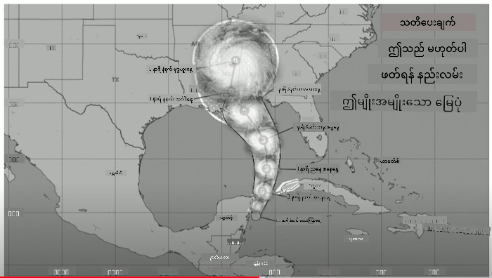
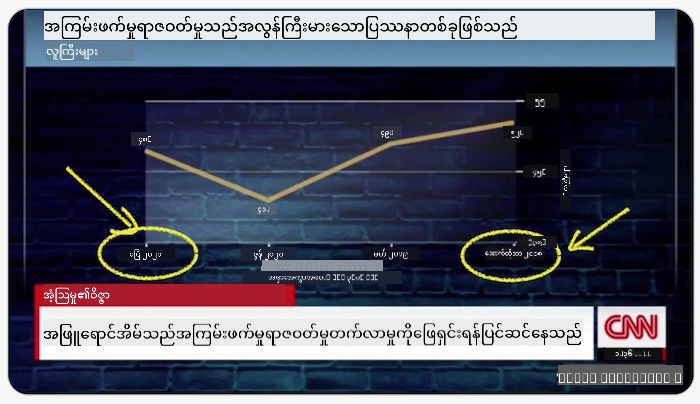
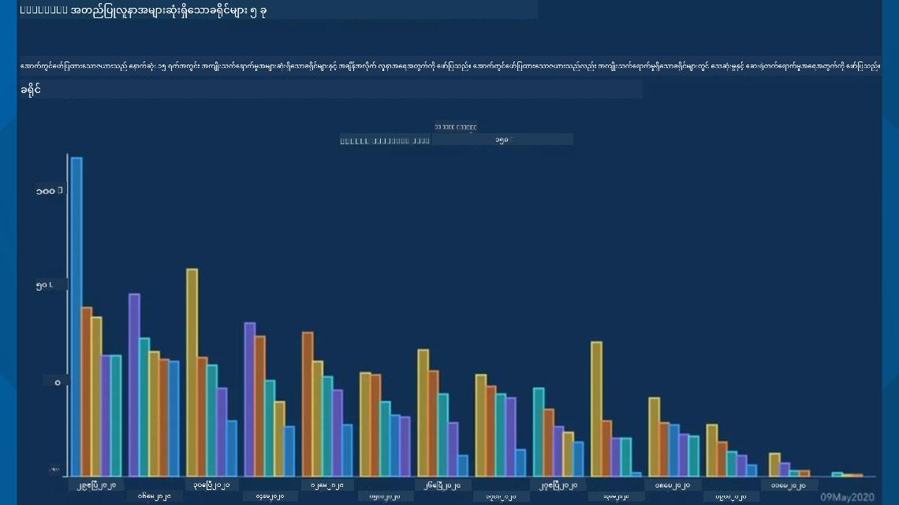
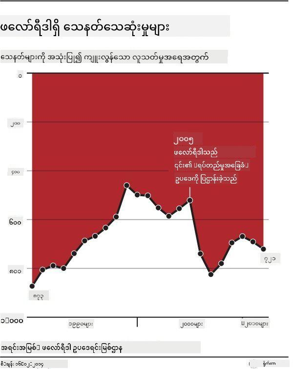
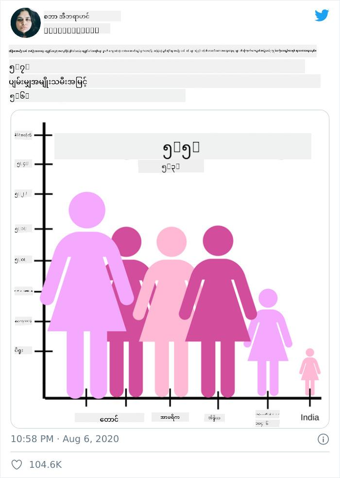
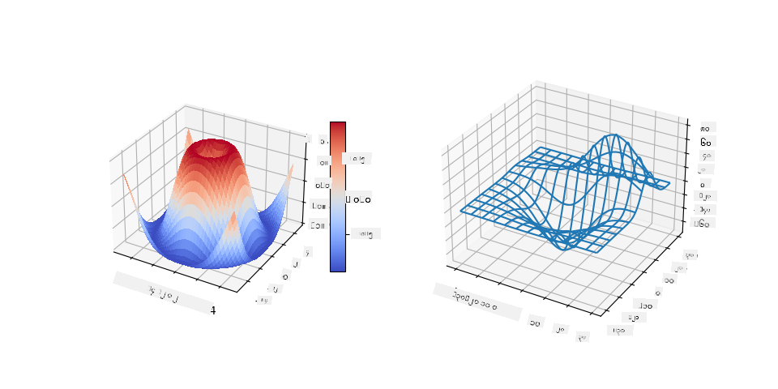
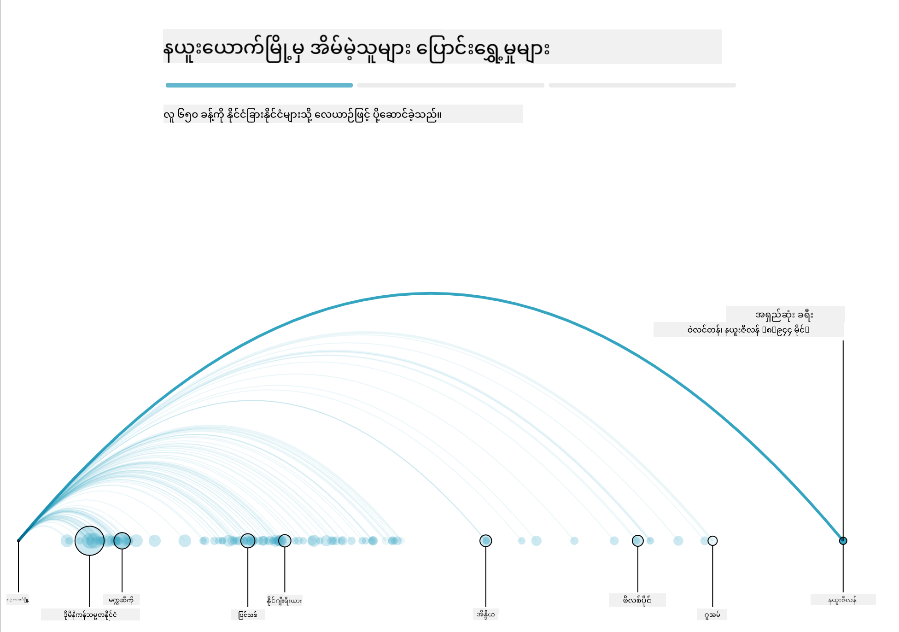
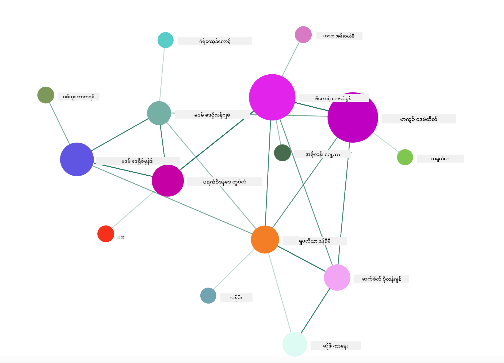

<!--
CO_OP_TRANSLATOR_METADATA:
{
  "original_hash": "b4039f1c76548d144a0aee0bf28304ec",
  "translation_date": "2025-08-30T18:56:45+00:00",
  "source_file": "3-Data-Visualization/R/13-meaningful-vizualizations/README.md",
  "language_code": "my"
}
-->
# အဓိပ္ပါယ်ရှိသော ဒေတာအမြင်ဖန်တီးခြင်း

| ](../../../sketchnotes/13-MeaningfulViz.png)|
|:---:|
| အဓိပ္ပါယ်ရှိသော ဒေတာအမြင်ဖန်တီးခြင်း - _Sketchnote by [@nitya](https://twitter.com/nitya)_ |

> "ဒေတာကို အလွန်အမင်းနှိပ်စက်လိုက်ရင်၊ အရာအားလုံးကို ဝန်ခံမယ်" -- [Ronald Coase](https://en.wikiquote.org/wiki/Ronald_Coase)

ဒေတာသိပ္ပံပညာရှင်တစ်ဦး၏ အခြေခံကျသော ကျွမ်းကျင်မှုတစ်ခုမှာ မိမိမေးမြန်းလိုသော မေးခွန်းများကို ဖြေရှင်းနိုင်ရန် အထောက်အကူဖြစ်စေသော အဓိပ္ပါယ်ရှိသော ဒေတာအမြင်တစ်ခုကို ဖန်တီးနိုင်စွမ်းဖြစ်သည်။ ဒေတာကို အမြင်ဖန်တီးမည့်အခါ မိမိ၏ ဒေတာကို သင်ခန်းစာများတွင် ပြုလုပ်ခဲ့သည့်အတိုင်း သန့်စင်ပြီး ပြင်ဆင်ထားရန် လိုအပ်သည်။ ထို့နောက် ဒေတာကို အကောင်းဆုံး ဖော်ပြနိုင်ရန် ဆုံးဖြတ်နိုင်ပါပြီ။

ဒီသင်ခန်းစာမှာ သင်လေ့လာမည့်အရာများမှာ -

1. မှန်ကန်သော ချတ်အမျိုးအစားကို ရွေးချယ်နည်း
2. လှည့်စားသော ချတ်ဖန်တီးမှုကို ရှောင်ရှားနည်း
3. အရောင်နှင့် အလုပ်လုပ်နည်း
4. ဖတ်ရှုရလွယ်ကူစေရန် ချတ်များကို စတိုင်ပြင်ဆင်နည်း
5. အနုစိတ်လှုပ်ရှားမှုနှင့် 3D ချတ်ဖြေရှင်းမှု ဖန်တီးနည်း
6. ဖန်တီးမှုအမြင်တစ်ခု ဖန်တီးနည်း

## [Pre-Lecture Quiz](https://purple-hill-04aebfb03.1.azurestaticapps.net/quiz/24)

## မှန်ကန်သော ချတ်အမျိုးအစားကို ရွေးချယ်ခြင်း

ယခင်သင်ခန်းစာများတွင် သင်သည် Matplotlib နှင့် Seaborn ကို အသုံးပြု၍ စိတ်ဝင်စားဖွယ် ဒေတာအမြင်များကို ဖန်တီးခဲ့သည်။ အထူးသဖြင့် မိမိမေးမြန်းလိုသော မေးခွန်းအတွက် [မှန်ကန်သော ချတ်အမျိုးအစား](https://chartio.com/learn/charts/how-to-select-a-data-vizualization/) ကို ရွေးချယ်နိုင်ရန် အောက်ပါဇယားကို အသုံးပြုနိုင်သည် -

| သင်လိုအပ်သည်:               | သင်အသုံးပြုသင့်သည်:                 |
| -------------------------- | ------------------------------- |
| အချိန်အလိုက် ဒေတာလမ်းကြောင်းကို ဖော်ပြရန် | Line                            |
| အမျိုးအစားများကို နှိုင်းယှဉ်ရန်         | Bar, Pie                        |
| စုစုပေါင်းကို နှိုင်းယှဉ်ရန်             | Pie, Stacked Bar                |
| ဆက်စပ်မှုများကို ဖော်ပြရန်         | Scatter, Line, Facet, Dual Line |
| ဖြန့်ဝေမှုများကို ဖော်ပြရန်         | Scatter, Histogram, Box         |
| အချိုးအစားများကို ဖော်ပြရန်           | Pie, Donut, Waffle              |

> ✅ သင့်ဒေတာ၏ ဖွဲ့စည်းမှုအပေါ် မူတည်၍ ချတ်တစ်ခုကို ထောက်ခံရန် သင်သည် ဒေတာကို စာသားမှ နံပါတ်သို့ ပြောင်းလဲရန် လိုအပ်နိုင်သည်။

## လှည့်စားမှုကို ရှောင်ရှားခြင်း

ဒေတာသိပ္ပံပညာရှင်တစ်ဦးသည် မှန်ကန်သော ချတ်ကို မှန်ကန်သော ဒေတာအတွက် ရွေးချယ်သော်လည်း၊ ဒေတာကို အမှန်မဟုတ်သော အချက်အလက်များကို သက်သေပြရန် ဖော်ပြနိုင်သော နည်းလမ်းများစွာရှိသည်။ လှည့်စားသော ချတ်များနှင့် အင်ဖိုဂရပ်များ၏ ဥပမာများစွာရှိသည်။

[](https://www.youtube.com/watch?v=oX74Nge8Wkw "How charts lie")

> 🎥 အထက်ပါပုံကို နှိပ်၍ လှည့်စားသော ချတ်များအကြောင်း ဆွေးနွေးမှုကို ကြည့်ပါ

ဒီချတ်သည် X axis ကို ပြောင်းလဲထားပြီး အမှန်တရား၏ ဆန့်ကျင်ဘက်ကို ဖော်ပြသည် -



[ဒီချတ်](https://media.firstcoastnews.com/assets/WTLV/images/170ae16f-4643-438f-b689-50d66ca6a8d8/170ae16f-4643-438f-b689-50d66ca6a8d8_1140x641.jpg) သည် အလွန်လှည့်စားမှုများဖြစ်ပြီး၊ COVID အမှုများသည် အချိန်အလိုက် လျော့နည်းလာသည်ဟု သက်သေပြရန် ရည်ရွယ်ထားသည်။ သို့သော်၊ ရက်စွဲများကို အနည်းငယ်ကြည့်ပါက လျော့နည်းမှုကို ဖန်တီးရန် ပြောင်းလဲထားသည်ကို တွေ့ရမည်။



ဒီနာမည်ဆိုးရှိသော ဥပမာသည် အရောင်နှင့် ပြောင်းလဲထားသော Y axis ကို အသုံးပြု၍ လှည့်စားထားသည်။ ဥပမာအားဖြင့် သက်တမ်းတိုးသော ဥပဒေကြောင့် သေနတ်သေဆုံးမှုများ တက်လာသည်ဟု မဟုတ်ဘဲ ဆန့်ကျင်ဘက်ကို ဖော်ပြရန် ရည်ရွယ်ထားသည်။



ဒီထူးဆန်းသော ချတ်သည် အချိုးအစားကို ပြောင်းလဲထားပြီး ဟာသဆန်သော အကျိုးသက်ရောက်မှုကို ဖန်တီးထားသည်။



မတူညီသော အရာများကို နှိုင်းယှဉ်ခြင်းသည် လှည့်စားမှုတစ်ခုဖြစ်သည်။ [spurious correlations](https://tylervigen.com/spurious-correlations) ဆိုသော ဝဘ်ဆိုဒ်သည် Maine တွင် အိမ်ထောင်ဖျက်နှင့် Margarine စားသုံးမှုတို့ကို ဆက်စပ်ထားသော 'အချက်အလက်' များကို ဖော်ပြထားသည်။ Reddit မှာလည်း [ugly uses](https://www.reddit.com/r/dataisugly/top/?t=all) ဆိုသော ဒေတာအသုံးပြုမှုများကို စုဆောင်းထားသည်။

လှည့်စားသော ချတ်များကြောင့် မျက်လုံးသည် လွယ်ကူစွာ လှည့်စားခံရနိုင်သည်ကို နားလည်ရန် အရေးကြီးသည်။ ဒေတာသိပ္ပံပညာရှင်၏ ရည်ရွယ်ချက်ကောင်းကောင်းဖြစ်သော်လည်း၊ ချတ်အမျိုးအစားကို မမှန်ကန်စွာ ရွေးချယ်ခြင်းသည် လှည့်စားမှုကို ဖြစ်စေနိုင်သည်။

## အရောင်

အထက်ပါ 'Florida gun violence' ချတ်တွင် မြင်ရသည့်အတိုင်း အရောင်သည် ချတ်များတွင် အဓိပ္ပါယ်တစ်ခု ထပ်ဆောင်းပေးနိုင်သည်။ ggplot2 နှင့် RColorBrewer ကဲ့သို့သော စာကြောင်းများကို အသုံးပြု၍ ဖန်တီးထားသော ချတ်များမဟုတ်ပါက [အရောင်သီအိုရီ](https://colormatters.com/color-and-design/basic-color-theory) ကို လေ့လာပါ။

> ✅ ချတ်များကို ဒီဇိုင်းဆွဲသောအခါ၊ အရောင်မမြင်နိုင်သောသူများအတွက် ချတ်သည် အဆင်ပြေမပြေ စဉ်းစားပါ။

ချတ်အတွက် အရောင်ကို ရွေးချယ်သောအခါ သင်မရည်ရွယ်သော အဓိပ္ပါယ်ကို ပေးနိုင်သောကြောင့် သတိထားပါ။ 'height' ချတ်တွင် 'pink ladies' သည် 'feminine' အဓိပ္ပါယ်ကို ပေးပြီး ချတ်ကို ထူးဆန်းစေသည်။

[အရောင်အဓိပ္ပါယ်](https://colormatters.com/color-symbolism/the-meanings-of-colors) သည် ကမ္ဘာ့အပိုင်းအစအလိုက် မတူကွဲပြားနိုင်ပြီး၊ အရောင်၏ အရောင်အဆင်းအပေါ် မူတည်၍ အဓိပ္ပါယ်ပြောင်းလဲနိုင်သည်။ အထူးသဖြင့် အရောင်များ၏ အဓိပ္ပါယ်မှာ -

| အရောင်  | အဓိပ္ပါယ်             |
| ------ | ------------------- |
| အနီ    | အာဏာ               |
| အပြာ   | ယုံကြည်မှု၊ သစ္စာ      |
| အဝါ    | ပျော်ရွှင်မှု၊ သတိထားမှု  |
| အစိမ်း | သဘာဝ၊ ကံကောင်းမှု၊ မနာလိုမှု |
| ခရမ်း  | ပျော်ရွှင်မှု           |
| လိမ္မော် | တက်ကြွမှု            |

အရောင်ကို စိတ်ကြိုက်ရွေးချယ်ပြီး ချတ်တစ်ခုကို ဖန်တီးရန် တာဝန်ရှိပါက၊ သင့်ချတ်သည် အရောင်မမြင်နိုင်သောသူများအတွက် အဆင်ပြေမှုရှိပြီး၊ သင်ရည်ရွယ်သော အဓိပ္ပါယ်နှင့် ကိုက်ညီမှုရှိသည်ကို သေချာပါစေ။

## ဖတ်ရှုရလွယ်ကူစေရန် ချတ်များကို စတိုင်ပြင်ဆင်ခြင်း

ချတ်များသည် ဖတ်ရှုရလွယ်ကူမှုမရှိပါက အဓိပ္ပါယ်မရှိပါ။ သင့်ဒေတာနှင့် ကိုက်ညီစေရန် ချတ်၏ အကျယ်နှင့် အမြင့်ကို စတိုင်ပြင်ဆင်ရန် အချိန်ယူပါ။ အပြည့်အဝပြသရန် လိုအပ်သော အချက်အလက်များ (ဥပမာ - 50 ပြည်နယ်များ) ကို Y axis တွင် တန်းစီထားပါ။

Axis များကို အမှတ်အသားပြုပါ၊ လိုအပ်ပါက Legend ကို ပေးပါ၊ Tooltips ကို ထည့်သွင်းပါ။

X axis တွင် စာသားများသည် အလွန်ရှည်လျားပါက၊ ဖတ်ရှုရလွယ်ကူစေရန် စာသားကို ထောင့်ချပါ။ [plot3D](https://cran.r-project.org/web/packages/plot3D/index.html) သည် 3D plotting ကို ပေးသည်။



## အနုစိတ်လှုပ်ရှားမှုနှင့် 3D ချတ်ဖန်တီးခြင်း

ယနေ့အချိန်တွင် အကောင်းဆုံး ဒေတာအမြင်များသည် အနုစိတ်လှုပ်ရှားမှုများပါဝင်သည်။ Shirley Wu ၏ '[film flowers](http://bl.ocks.org/sxywu/raw/d612c6c653fb8b4d7ff3d422be164a5d/)' ကဲ့သို့သော D3 ဖြင့် ဖန်တီးထားသော အံ့ဩဖွယ်အမြင်များရှိသည်။ Guardian ၏ 'bussed out' သည် NYC ၏ အိမ်မဲ့သူများကို မြို့မှ ထုတ်ပေးသော နည်းလမ်းကို ဖော်ပြရန် visualizations နှင့် scrollytelling ကို ပေါင်းစပ်ထားသည်။



> "Bussed Out: How America Moves its Homeless" from [the Guardian](https://www.theguardian.com/us-news/ng-interactive/2017/dec/20/bussed-out-america-moves-homeless-people-country-study). Visualizations by Nadieh Bremer & Shirley Wu

ဒီသင်ခန်းစာသည် visualization libraries များကို အနက်အနက် သင်ပေးရန် မလုံလောက်သော်လည်း၊ Vue.js app တွင် D3 ကို အသုံးပြု၍ 'Dangerous Liaisons' စာအုပ်၏ animated social network visualization ကို ဖန်တီးကြည့်ပါ။

> "Les Liaisons Dangereuses" သည် စာလုံးများစွာဖြင့် ဖော်ပြထားသော စာအုပ်တစ်အုပ်ဖြစ်သည်။ 1782 ခုနှစ်တွင် Choderlos de Laclos မှ ရေးသားခဲ့ပြီး၊ 18 ရာစုနှစ်အလယ်ပိုင်းတွင် ပြင်သစ်အာရစတိုကရေစီ၏ လူမှုရေးဆန်သော အကြောင်းအရာများကို ဖော်ပြထားသည်။ စာအုပ်သည် စာလုံးများစွာဖြင့် ဖော်ပြထားပြီး၊ လူမှုရေးဆန်သော အကြောင်းအရာများကို ဖန်တီးထားသည်။ 

သင်သည် Vue.js နှင့် D3 ကို အသုံးပြု၍ animated social network ကို ဖန်တီးမည့် web app ကို ပြီးစီးမည်ဖြစ်သည်။



## Project: D3.js ကို အသုံးပြု၍ network ကို ဖော်ပြသော ချတ်တစ်ခု ဖန်တီးပါ

> ဒီသင်ခန်းစာ folder တွင် `solution` folder ပါဝင်ပြီး၊ ပြီးစီးထားသော project ကို ရှာဖွေနိုင်ပါသည်။

1. starter folder ရှိ README.md ဖိုင်တွင် ရှိသော လမ်းညွှန်ချက်များကို လိုက်နာပါ။ သင်၏ project dependencies မတိုင်မီ NPM နှင့် Node.js ကို သင့်စက်တွင် run လုပ်ထားပါ။

2. `starter/src` folder ကို ဖွင့်ပါ။ `assets` folder တွင် novel ၏ စာလုံးများအားလုံးပါဝင်သော .json ဖိုင်ကို ရှာဖွေပါ။

3. `components/Nodes.vue` တွင် code ကို ပြီးစီးပါ။ `createLinks()` method ကို ရှာပြီး အောက်ပါ nested loop ကို ထည့်ပါ။

```javascript
//loop through letters
      let f = 0;
      let t = 0;
      for (var i = 0; i < letters.length; i++) {
          for (var j = 0; j < characters.length; j++) {
              
            if (characters[j] == letters[i].from) {
              f = j;
            }
            if (characters[j] == letters[i].to) {
              t = j;
            }
        }
        this.links.push({ sid: f, tid: t });
      }
  ```

Terminal မှ app ကို run (npm run serve) လုပ်ပြီး visualization ကို ခံစားပါ။

## 🚀 Challenge

အင်တာနက်တွင် လှည့်စားသော visualizations များကို ရှာဖွေပါ။ အရေးအသားသည် မျက်လုံးကို လှည့်စားရန် ဘယ်လိုနည်းလမ်းများကို အသုံးပြုသလဲ၊ ရည်ရွယ်ချက်ရှိ/မရှိ စဉ်းစားပါ။ visualizations များကို ပြင်ဆင်ပြီး မှန်ကန်သော အမြင်ကို ဖော်ပြပါ။

## [Post-lecture quiz](https://purple-hill-04aebfb03.1.azurestaticapps.net/quiz/25)

## Review & Self Study

ဒီအကြောင်းအရာများကို လေ့လာပါ -

https://gizmodo.com/how-to-lie-with-data-visualization-1563576606

http://ixd.prattsi.org/2017/12/visual-lies-usability-in-deceptive-data-visualizations/

သမိုင်းဆိုင်ရာ assets နှင့် artifacts အတွက် စိတ်ဝင်စားဖွယ် visualizations များကို ကြည့်ပါ -

https://handbook.pubpub.org/

animation သည် visualizations ကို ဘယ်လိုတိုးတက်စေမည်ကို ကြည့်ပါ -

https://medium.com/@EvanSinar/use-animation-to-supercharge-data-visualization-cd905a882ad4

## Assignment

[သင့်ကိုယ်ပိုင် custom visualization ကို ဖန်တီးပါ](assignment.md)

---

**အကြောင်းကြားချက်**:  
ဤစာရွက်စာတမ်းကို AI ဘာသာပြန်ဝန်ဆောင်မှု [Co-op Translator](https://github.com/Azure/co-op-translator) ကို အသုံးပြု၍ ဘာသာပြန်ထားပါသည်။ ကျွန်ုပ်တို့သည် တိကျမှုအတွက် ကြိုးစားနေသော်လည်း၊ အလိုအလျောက် ဘာသာပြန်ခြင်းတွင် အမှားများ သို့မဟုတ် မတိကျမှုများ ပါရှိနိုင်သည်ကို သတိပြုပါ။ မူရင်းဘာသာစကားဖြင့် ရေးသားထားသော စာရွက်စာတမ်းကို အာဏာရှိသော ရင်းမြစ်အဖြစ် သတ်မှတ်သင့်ပါသည်။ အရေးကြီးသော အချက်အလက်များအတွက် လူ့ဘာသာပြန်ပညာရှင်များမှ ပရော်ဖက်ရှင်နယ် ဘာသာပြန်ခြင်းကို အကြံပြုပါသည်။ ဤဘာသာပြန်ကို အသုံးပြုခြင်းမှ ဖြစ်ပေါ်လာသော အလွဲအမှားများ သို့မဟုတ် အနားယူမှုများအတွက် ကျွန်ုပ်တို့သည် တာဝန်မယူပါ။