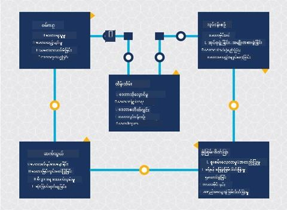
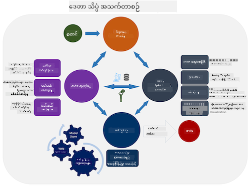
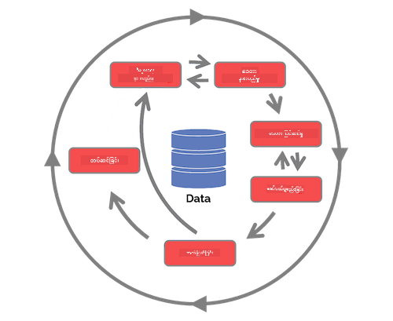

<!--
CO_OP_TRANSLATOR_METADATA:
{
  "original_hash": "c368f8f2506fe56bca0f7be05c4eb71d",
  "translation_date": "2025-08-30T18:30:07+00:00",
  "source_file": "4-Data-Science-Lifecycle/14-Introduction/README.md",
  "language_code": "my"
}
-->
# ဒေတာသိပ္ပံ၏ အသက်တာစဉ်ကို မိတ်ဆက်ခြင်း

| ](../../sketchnotes/14-DataScience-Lifecycle.png)|
|:---:|
| ဒေတာသိပ္ပံ၏ အသက်တာစဉ်ကို မိတ်ဆက်ခြင်း - _Sketchnote by [@nitya](https://twitter.com/nitya)_ |

## [Pre-Lecture Quiz](https://red-water-0103e7a0f.azurestaticapps.net/quiz/26)

ဒီအချိန်မှာ သင်ဟာ ဒေတာသိပ္ပံဟာ တစ်ခုတည်းသော လုပ်ငန်းစဉ်ဖြစ်တယ်ဆိုတာ သိရှိလာပြီးဖြစ်နိုင်ပါတယ်။ ဒီလုပ်ငန်းစဉ်ကို အောက်ပါ ၅ အဆင့်အလိုက် ခွဲခြားနိုင်ပါတယ်-

- ဒေတာရယူခြင်း
- ဒေတာကို အလုပ်လုပ်ခြင်း
- ဒေတာကို ခွဲခြမ်းစိတ်ဖြာခြင်း
- ဆက်သွယ်ပေးခြင်း
- ထိန်းသိမ်းခြင်း

ဒီသင်ခန်းစာမှာ အသက်တာစဉ်ရဲ့ အစိတ်အပိုင်း ၃ ခုကို အဓိကထားပြီး လေ့လာပါမယ်- ဒေတာရယူခြင်း၊ အလုပ်လုပ်ခြင်း၊ ထိန်းသိမ်းခြင်း။

> [Berkeley School of Information](https://ischoolonline.berkeley.edu/data-science/what-is-data-science/) မှဓာတ်ပုံ

## ဒေတာရယူခြင်း

အသက်တာစဉ်ရဲ့ ပထမအဆင့်ဟာ အရေးကြီးဆုံးဖြစ်ပြီး နောက်အဆင့်တွေဟာ ဒီအဆင့်ပေါ်မှာ မူတည်ပါတယ်။ ဒါဟာ အခြေခံအားဖြင့် အဆင့် ၂ ခုကို ပေါင်းစပ်ထားတဲ့ အဆင့်တစ်ခုဖြစ်ပါတယ်- ဒေတာရယူခြင်းနှင့် ရည်ရွယ်ချက်များ၊ ဖြေရှင်းရန်လိုအပ်သော ပြဿနာများကို သတ်မှတ်ခြင်း။

ပရောဂျက်ရဲ့ ရည်မှန်းချက်တွေကို သတ်မှတ်ဖို့အတွက် ပြဿနာရဲ့ အခြေခံအကြောင်းအရာကို နက်နက်ရှိုင်းရှိုင်းနားလည်ဖို့ လိုအပ်ပါတယ်။ ပထမဦးဆုံးမှာ ပြဿနာကို ဖြေရှင်းဖို့လိုအပ်တဲ့သူတွေကို ရှာဖွေပြီး ရယူဖို့ လိုအပ်ပါတယ်။ ဒါတွေဟာ စီးပွားရေးလုပ်ငန်းရဲ့ အကျိုးဆောင်တွေဖြစ်နိုင်ပြီး ပရောဂျက်ရဲ့ အဓိကပံ့ပိုးသူတွေဖြစ်နိုင်ပါတယ်။ သူတို့က ဒီပရောဂျက်က ဘယ်သူတွေ၊ ဘာတွေ အကျိုးရှိမယ်ဆိုတာကို သတ်မှတ်ပေးနိုင်ပါတယ်။ ရည်မှန်းချက်တစ်ခုကို သေချာစွာ သတ်မှတ်ထားရမယ်၊ အလားအလာရှိတဲ့ ရလဒ်ကို တိုင်းတာနိုင်ဖို့ လိုအပ်ပါတယ်။

ဒေတာသိပ္ပံပညာရှင်တွေ မေးနိုင်တဲ့မေးခွန်းတွေ:
- ဒီပြဿနာကို အရင်က ရှင်းလင်းဖူးလား? ဘာတွေ ရှာဖွေတွေ့ရှိခဲ့လဲ?
- ရည်ရွယ်ချက်နဲ့ ရည်မှန်းချက်ကို ပါဝင်သူအားလုံး နားလည်ထားလား?
- မရေရာမှုရှိလား? ဘယ်လို လျှော့ချနိုင်မလဲ?
- အကန့်အသတ်တွေ ဘာတွေလဲ?
- နောက်ဆုံးရလဒ်ဟာ ဘယ်လိုပုံစံရှိနိုင်မလဲ?
- အရင်းအမြစ် (အချိန်၊ လူတွေ၊ ကွန်ပျူတာ) ဘယ်လောက် ရရှိနိုင်လဲ?

နောက်တစ်ခုကတော့ ရည်မှန်းချက်တွေကို ရရှိဖို့လိုအပ်တဲ့ ဒေတာကို ရှာဖွေ၊ စုဆောင်းပြီး စူးစမ်းခြင်းဖြစ်ပါတယ်။ ဒီအဆင့်မှာ ဒေတာသိပ္ပံပညာရှင်တွေဟာ ဒေတာရဲ့ အရေအတွက်နဲ့ အရည်အသွေးကို သုံးသပ်ဖို့ လိုအပ်ပါတယ်။ ဒေတာရရှိမှုအဆင့်မှာ ဒေတာကို စူးစမ်းပြီး ရလဒ်ရောက်ရှိဖို့ အထောက်အကူဖြစ်မယ့်အရာတွေကို အတည်ပြုဖို့ လိုအပ်ပါတယ်။

ဒေတာနဲ့ပတ်သက်ပြီး ဒေတာသိပ္ပံပညာရှင်တွေ မေးနိုင်တဲ့မေးခွန်းတွေ:
- အခုတစ်ခါမှာ ရရှိထားတဲ့ ဒေတာတွေ ဘာတွေလဲ?
- ဒီဒေတာကို ဘယ်သူပိုင်ထားလဲ?
- ကိုယ်ရေးကိုယ်တာအချက်အလက်နဲ့ ပတ်သက်တဲ့ စိုးရိမ်မှုတွေ ရှိလား?
- ဒီပြဿနာကို ဖြေရှင်းဖို့ ဒေတာလုံလောက်လား?
- ဒီပြဿနာအတွက် ဒေတာရဲ့ အရည်အသွေး လက်ခံနိုင်ဖွယ်ရှိလား?
- ဒေတာကနေ အပိုအချက်အလက်တွေ ရှာဖွေတွေ့ရှိရင် ရည်မှန်းချက်တွေကို ပြောင်းလဲသတ်မှတ်ဖို့ လိုအပ်လား?

## ဒေတာကို အလုပ်လုပ်ခြင်း

အသက်တာစဉ်ရဲ့ ဒေတာကို အလုပ်လုပ်ခြင်းအဆင့်ဟာ ဒေတာထဲမှာ ပုံစံတွေကို ရှာဖွေခြင်းနဲ့ မော်ဒယ်တည်ဆောက်ခြင်းကို အဓိကထားပါတယ်။ ဒီအဆင့်မှာ အသုံးပြုတဲ့နည်းလမ်းတွေဟာ ဒေတာထဲမှာ ပုံစံတွေကို ရှာဖွေဖို့ စာရင်းဇယားနည်းလမ်းတွေကို အသုံးပြုရပါတယ်။ ဒေတာအများကြီးနဲ့ အလုပ်လုပ်ရတဲ့အခါမှာ လူတွေ အလုပ်လုပ်ဖို့ အလွန်ခက်ခဲပြီး ကွန်ပျူတာတွေက အလုပ်ကို မြန်မြန်ဆန်ဆန်လုပ်ဆောင်ပေးနိုင်ပါတယ်။ ဒီအဆင့်မှာ ဒေတာသိပ္ပံနဲ့ စက်ရုပ်သင်ယူမှု (Machine Learning) တို့ ဆုံဆည်းပါတယ်။ စက်ရုပ်သင်ယူမှုဟာ ဒေတာကို နားလည်ဖို့ မော်ဒယ်တည်ဆောက်တဲ့ လုပ်ငန်းစဉ်ဖြစ်ပါတယ်။ မော်ဒယ်တွေဟာ ဒေတာထဲမှာ အပြောင်းအလဲရှိတဲ့ အချက်အလက်တွေကို ကိုယ်စားပြုပြီး ရလဒ်ကို ခန့်မှန်းဖို့ အထောက်အကူဖြစ်ပါတယ်။

ဒီအဆင့်မှာ အသုံးပြုတဲ့ နည်းလမ်းတွေကို ML for Beginners သင်ခန်းစာမှာ လေ့လာနိုင်ပါတယ်။ အောက်ပါလင့်ခ်တွေကို အသုံးပြုပြီး နည်းလမ်းတွေကို ပိုမိုနားလည်ပါ:

- [Classification](https://github.com/microsoft/ML-For-Beginners/tree/main/4-Classification): ဒေတာကို အမျိုးအစားအလိုက် စီစဉ်ခြင်း။
- [Clustering](https://github.com/microsoft/ML-For-Beginners/tree/main/5-Clustering): ဒေတာကို ဆင်တူတဲ့အုပ်စုတွေထဲ စုပေါင်းခြင်း။
- [Regression](https://github.com/microsoft/ML-For-Beginners/tree/main/2-Regression): အပြောင်းအလဲရှိတဲ့ အချက်အလက်တွေကြား ဆက်စပ်မှုကို သတ်မှတ်ပြီး တန်ဖိုးတွေကို ခန့်မှန်းခြင်း။

## ထိန်းသိမ်းခြင်း

အသက်တာစဉ်ရဲ့ ပုံစံမှာ Maintenance (ထိန်းသိမ်းခြင်း) ဟာ ဒေတာရယူခြင်းနဲ့ ဒေတာကို အလုပ်လုပ်ခြင်းအကြားမှာ ရှိနေပါတယ်။ Maintenance ဟာ ပရောဂျက်တစ်ခုရဲ့ လုပ်ငန်းစဉ်တစ်ခုလုံးအတွင်း ဒေတာကို စီမံခြင်း၊ သိမ်းဆည်းခြင်းနဲ့ လုံခြုံရေးကို စဉ်ဆက်မပြတ် စဉ်းစားရမယ့် လုပ်ငန်းစဉ်ဖြစ်ပါတယ်။

### ဒေတာကို သိမ်းဆည်းခြင်း
ဒေတာကို ဘယ်လိုနဲ့ ဘယ်မှာ သိမ်းဆည်းမလဲဆိုတာက ဒေတာကို သိမ်းဆည်းတဲ့ ကုန်ကျစရိတ်နဲ့ ဒေတာကို မြန်မြန်ဆန်ဆန် ရယူနိုင်မှုကို သက်ရောက်စေပါတယ်။ ဒီဆုံးဖြတ်ချက်တွေဟာ ဒေတာသိပ္ပံပညာရှင်တစ်ဦးတည်းက မလုပ်နိုင်ပေမယ့် ဒေတာကို ဘယ်လိုနဲ့ အလုပ်လုပ်မလဲဆိုတာကို သိမ်းဆည်းပုံအပေါ် မူတည်ပြီး ရွေးချယ်ရနိုင်ပါတယ်။

**On premise vs off premise vs public or private cloud**

On premise ဆိုတာက ကိုယ့်ပိုင်ပစ္စည်းပေါ်မှာ ဒေတာကို သိမ်းဆည်းခြင်းဖြစ်ပြီး Server နဲ့ Hard Drive တွေကို ကိုယ်ပိုင်ထားတာဖြစ်ပါတယ်။ Off premise ဆိုတာက ကိုယ်ပိုင်မဟုတ်တဲ့ Data Center တွေကို အားကိုးရတာဖြစ်ပါတယ်။ Public cloud ဟာ ဒေတာကို သိမ်းဆည်းဖို့ လူကြိုက်များတဲ့ ရွေးချယ်မှုဖြစ်ပြီး ဒေတာကို ဘယ်မှာ သိမ်းဆည်းထားတယ်ဆိုတာကို မသိရပါဘူး။ Public cloud ဟာ Cloud ကို အသုံးပြုသူအားလုံးအတွက် အခြေခံအဆောက်အအုံတူညီတဲ့ Shared Infrastructure ကို အသုံးပြုပါတယ်။ အဖွဲ့အစည်းတချို့မှာ လုံခြုံရေးမူဝါဒတွေကြောင့် ကိုယ်ပိုင် Cloud ကို အသုံးပြုရပါတယ်။ Cloud နဲ့ပတ်သက်တဲ့ ဒေတာကို [နောက်ဆုံးသင်ခန်းစာ](https://github.com/microsoft/Data-Science-For-Beginners/tree/main/5-Data-Science-In-Cloud) မှာ ပိုမိုလေ့လာနိုင်ပါတယ်။

**Cold vs hot data**

မော်ဒယ်တွေကို သင်ကြားတဲ့အခါမှာ Training Data ပိုမိုလိုအပ်နိုင်ပါတယ်။ မော်ဒယ်ကို ပြည့်စုံအောင်လုပ်ပြီးရင် ဒေတာအသစ်တွေ ရောက်လာနိုင်ပါတယ်။ ဒေတာကို သိမ်းဆည်းခြင်းနဲ့ ရယူခြင်းအတွက် ကုန်ကျစရိတ်တွေ တိုးလာနိုင်ပါတယ်။ အသုံးမပြုတဲ့ Cold Data ကို Frequently Accessed Hot Data နဲ့ ခွဲခြားထားခြင်းက စျေးသက်သာတဲ့ ရွေးချယ်မှုဖြစ်နိုင်ပါတယ်။ Cold Data ကို ရယူဖို့ လိုအပ်ရင် Hot Data ထက် နည်းနည်းကြာနိုင်ပါတယ်။

### ဒေတာကို စီမံခြင်း
ဒေတာနဲ့ အလုပ်လုပ်တဲ့အခါမှာ ဒေတာတစ်ချို့ကို သန့်စင်ဖို့ လိုအပ်နိုင်ပါတယ်။ [Data Preparation](https://github.com/microsoft/Data-Science-For-Beginners/tree/main/2-Working-With-Data/08-data-preparation) သင်ခန်းစာမှာ လေ့လာထားတဲ့ နည်းလမ်းတွေကို အသုံးပြုနိုင်ပါတယ်။ ဒေတာအသစ်ရောက်လာတဲ့အခါမှာ အရည်အသွေးကို တူညီအောင် ထိန်းသိမ်းဖို့ လိုအပ်ပါတယ်။ Automated Tool တွေကို အသုံးပြုပြီး Cleansing, Aggregation နဲ့ Compression လုပ်ပြီး ဒေတာကို နောက်ဆုံးနေရာကို ရွှေ့နိုင်ပါတယ်။ Azure Data Factory ဟာ ဒီ Tool တွေထဲက တစ်ခုဖြစ်ပါတယ်။

### ဒေတာကို လုံခြုံစွာ သိမ်းဆည်းခြင်း
ဒေတာကို လုံခြုံစွာ သိမ်းဆည်းဖို့ရည်ရွယ်ချက်က ဒေတာကို ဘယ်လိုရယူပြီး ဘယ်လိုအသုံးပြုမလဲဆိုတာကို ထိန်းချုပ်ထားဖို့ ဖြစ်ပါတယ်။ ဒေတာကို လုံခြုံစွာ သိမ်းဆည်းဖို့အတွက် အောက်ပါအချက်တွေကို လိုက်နာရပါတယ်-

- ဒေတာအားလုံးကို Encryption လုပ်ထားတာကို အတည်ပြုပါ။
- Customer တွေကို သူတို့ရဲ့ ဒေတာကို ဘယ်လိုအသုံးပြုမလဲဆိုတာကို အကြောင်းကြားပါ။
- ပရောဂျက်ကနေ ထွက်သွားတဲ့သူတွေကို ဒေတာရယူခွင့်ကို ဖယ်ရှားပါ။
- ပရောဂျက်အဖွဲ့ဝင်တချို့ကိုသာ ဒေတာကို ပြောင်းလဲခွင့်ပေးပါ။

## 🚀 စိန်ခေါ်မှု

Data Science Lifecycle ရဲ့ အမျိုးအစားတွေ အများကြီးရှိပြီး အဆင့်နဲ့ အမည်တွေက မတူနိုင်ပေမယ့် ဒီသင်ခန်းစာမှာ ဖော်ပြထားတဲ့ လုပ်ငန်းစဉ်တွေကို ပါဝင်ထားပါတယ်။

[Team Data Science Process lifecycle](https://docs.microsoft.com/en-us/azure/architecture/data-science-process/lifecycle) နဲ့ [Cross-industry standard process for data mining](https://www.datascience-pm.com/crisp-dm-2/) ကို လေ့လာပြီး တူညီချက် ၃ ခုနဲ့ ကွဲလွဲချက် ၃ ခုကို ဖော်ပြပါ။

|Team Data Science Process (TDSP)|Cross-industry standard process for data mining (CRISP-DM)|
|--|--|
| |  |
| [Microsoft](https://docs.microsoft.comazure/architecture/data-science-process/lifecycle) မှပုံ | [Data Science Process Alliance](https://www.datascience-pm.com/crisp-dm-2/) မှပုံ |

## [Post-Lecture Quiz](https://red-water-0103e7a0f.azurestaticapps.net/quiz/27)

## ပြန်လည်သုံးသပ်ခြင်းနှင့် ကိုယ်တိုင်လေ့လာခြင်း

Data Science Lifecycle ကို အသုံးချတဲ့အခါမှာ အခန်းကဏ္ဍနဲ့ လုပ်ငန်းတာဝန်တွေ အများကြီး ပါဝင်ပြီး တစ်ချို့က အဆင့်တစ်ခုချင်းစီရဲ့ အပိုင်းအခြားတွေကို အဓိကထားနိုင်ပါတယ်။ Team Data Science Process ဟာ ပရောဂျက်တစ်ခုမှာ ပါဝင်နိုင်တဲ့ အခန်းကဏ္ဍနဲ့ လုပ်ငန်းတာဝန်တွေကို ရှင်းပြထားတဲ့ အရင်းအမြစ်တွေကို ပေးထားပါတယ်။

* [Team Data Science Process roles and tasks](https://docs.microsoft.com/en-us/azure/architecture/data-science-process/roles-tasks)
* [Execute data science tasks: exploration, modeling, and deployment](https://docs.microsoft.com/en-us/azure/architecture/data-science-process/execute-data-science-tasks)

## လုပ်ငန်းတာဝန်

[Assessing a Dataset](assignment.md)

---

**အကြောင်းကြားချက်**:  
ဤစာရွက်စာတမ်းကို AI ဘာသာပြန်ဝန်ဆောင်မှု [Co-op Translator](https://github.com/Azure/co-op-translator) ကို အသုံးပြု၍ ဘာသာပြန်ထားပါသည်။ ကျွန်ုပ်တို့သည် တိကျမှုအတွက် ကြိုးစားနေပါသော်လည်း၊ အလိုအလျောက် ဘာသာပြန်မှုများတွင် အမှားများ သို့မဟုတ် မတိကျမှုများ ပါရှိနိုင်သည်ကို သတိပြုပါ။ မူရင်းဘာသာစကားဖြင့် ရေးသားထားသော စာရွက်စာတမ်းကို အာဏာရှိသော ရင်းမြစ်အဖြစ် သတ်မှတ်သင့်ပါသည်။ အရေးကြီးသော အချက်အလက်များအတွက် လူက ဘာသာပြန်မှုကို အသုံးပြုရန် အကြံပြုပါသည်။ ဤဘာသာပြန်မှုကို အသုံးပြုခြင်းမှ ဖြစ်ပေါ်လာသော အလွဲအလွတ်များ သို့မဟုတ် အနားလွဲမှုများအတွက် ကျွန်ုပ်တို့သည် တာဝန်မယူပါ။