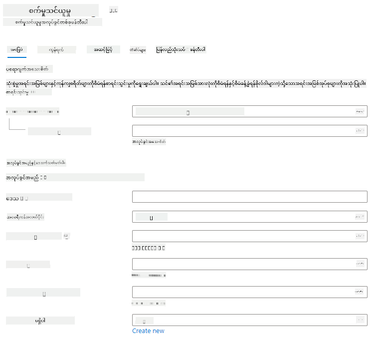
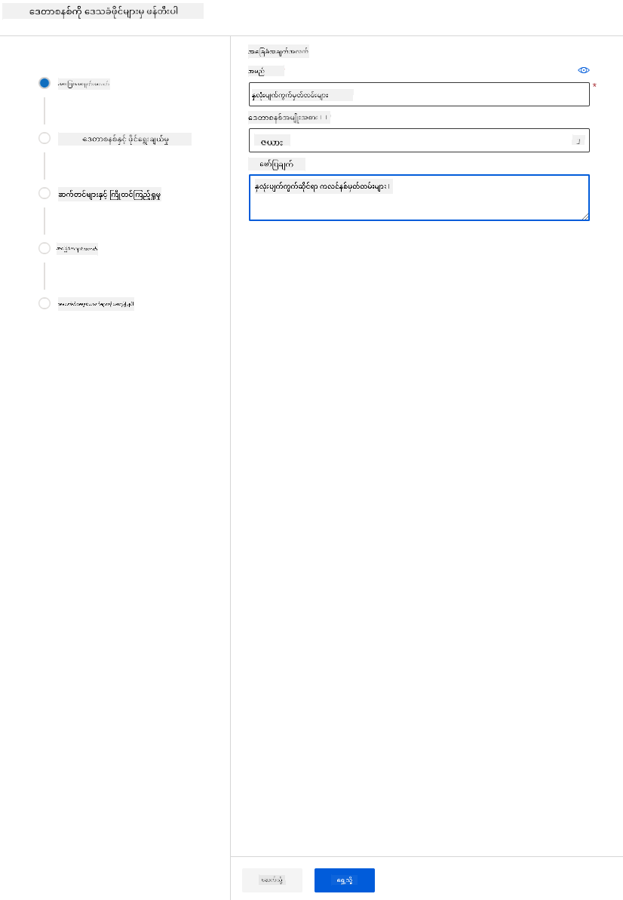

<!--
CO_OP_TRANSLATOR_METADATA:
{
  "original_hash": "14b2a7f1c63202920bd98eeb913f5614",
  "translation_date": "2025-08-30T17:43:16+00:00",
  "source_file": "5-Data-Science-In-Cloud/18-Low-Code/README.md",
  "language_code": "my"
}
-->
# Cloud တွင် Data Science: "Low code/No code" နည်းလမ်း

| ](../../sketchnotes/18-DataScience-Cloud.png)|
|:---:|
| Cloud တွင် Data Science: Low Code - _Sketchnote by [@nitya](https://twitter.com/nitya)_ |

အကြောင်းအရာများစာရင်း:

- [Cloud တွင် Data Science: "Low code/No code" နည်းလမ်း](../../../../5-Data-Science-In-Cloud/18-Low-Code)
  - [Pre-Lecture Quiz](../../../../5-Data-Science-In-Cloud/18-Low-Code)
  - [1. နိဒါန်း](../../../../5-Data-Science-In-Cloud/18-Low-Code)
    - [1.1 Azure Machine Learning ဆိုတာဘာလဲ?](../../../../5-Data-Science-In-Cloud/18-Low-Code)
    - [1.2 Heart Failure ခန့်မှန်းမှု Project:](../../../../5-Data-Science-In-Cloud/18-Low-Code)
    - [1.3 Heart Failure Dataset:](../../../../5-Data-Science-In-Cloud/18-Low-Code)
  - [2. Azure ML Studio တွင် Low code/No code နည်းလမ်းဖြင့် မော်ဒယ်ကို သင်ကြားခြင်း](../../../../5-Data-Science-In-Cloud/18-Low-Code)
    - [2.1 Azure ML workspace တစ်ခု ဖန်တီးခြင်း](../../../../5-Data-Science-In-Cloud/18-Low-Code)
    - [2.2 Compute Resources](../../../../5-Data-Science-In-Cloud/18-Low-Code)
      - [2.2.1 Compute Resources အတွက် မှန်ကန်သော ရွေးချယ်မှုများ](../../../../5-Data-Science-In-Cloud/18-Low-Code)
      - [2.2.2 Compute Cluster တစ်ခု ဖန်တီးခြင်း](../../../../5-Data-Science-In-Cloud/18-Low-Code)
    - [2.3 Dataset ကို Load လုပ်ခြင်း](../../../../5-Data-Science-In-Cloud/18-Low-Code)
    - [2.4 AutoML ဖြင့် Low code/No code သင်ကြားခြင်း](../../../../5-Data-Science-In-Cloud/18-Low-Code)
  - [3. Low code/No code မော်ဒယ်ကို တင်ပို့ခြင်းနှင့် Endpoint အသုံးပြုခြင်း](../../../../5-Data-Science-In-Cloud/18-Low-Code)
    - [3.1 မော်ဒယ် တင်ပို့ခြင်း](../../../../5-Data-Science-In-Cloud/18-Low-Code)
    - [3.2 Endpoint အသုံးပြုခြင်း](../../../../5-Data-Science-In-Cloud/18-Low-Code)
  - [🚀 စိန်ခေါ်မှု](../../../../5-Data-Science-In-Cloud/18-Low-Code)
  - [Post-Lecture Quiz](../../../../5-Data-Science-In-Cloud/18-Low-Code)
  - [ပြန်လည်သုံးသပ်ခြင်းနှင့် ကိုယ်တိုင်လေ့လာမှု](../../../../5-Data-Science-In-Cloud/18-Low-Code)
  - [အိမ်စာ](../../../../5-Data-Science-In-Cloud/18-Low-Code)

## [Pre-Lecture Quiz](https://purple-hill-04aebfb03.1.azurestaticapps.net/quiz/34)

## 1. နိဒါန်း

### 1.1 Azure Machine Learning ဆိုတာဘာလဲ?

Azure cloud ပလက်ဖောင်းသည် အသစ်သောဖြေရှင်းနည်းများကို ဖန်တီးရန်အတွက် 200 ကျော်သော ထုတ်ကုန်များနှင့် cloud ဝန်ဆောင်မှုများကို ပံ့ပိုးပေးထားသည်။  
Data Scientist များသည် ဒေတာကို စူးစမ်းခြင်း၊ ကြိုတင်လုပ်ငန်းစဉ်များ ပြုလုပ်ခြင်းနှင့် မော်ဒယ်သင်ကြားမှု အယ်လဂိုရီသမ်အမျိုးမျိုးကို စမ်းသပ်ခြင်းတို့တွင် အချိန်အများအပြား သုံးစွဲကြသည်။ ဤလုပ်ငန်းစဉ်များသည် အချိန်စားပြီး အချို့သော အကောင်းဆုံး hardware ကို မထိရောက်စွာ အသုံးပြုစေတတ်သည်။

[Azure ML](https://docs.microsoft.com/azure/machine-learning/overview-what-is-azure-machine-learning?WT.mc_id=academic-77958-bethanycheum&ocid=AID3041109) သည် Azure တွင် Machine Learning ဖြေရှင်းနည်းများကို ဖန်တီးခြင်းနှင့် လည်ပတ်စေခြင်းအတွက် cloud-based ပလက်ဖောင်းတစ်ခုဖြစ်သည်။  
ဤပလက်ဖောင်းတွင် Data Scientist များအတွက် ဒေတာကို ပြင်ဆင်ခြင်း၊ မော်ဒယ်များကို သင်ကြားခြင်း၊ ခန့်မှန်းမှု ဝန်ဆောင်မှုများကို ထုတ်ဝေခြင်းနှင့် ၎င်းတို့၏ အသုံးပြုမှုကို စောင့်ကြည့်ခြင်းတို့အတွက် လိုအပ်သော အင်္ဂါရပ်များစွာ ပါဝင်သည်။ အဓိကအားဖြင့် မော်ဒယ်သင်ကြားမှုနှင့် ဆက်စပ်သော အချိန်စားလုပ်ငန်းစဉ်များကို အလိုအလျောက်လုပ်ဆောင်ခြင်းဖြင့် ထိရောက်မှုကို တိုးတက်စေသည်။ ထို့အပြင် cloud-based compute resources များကို အသုံးပြု၍ ဒေတာအများအပြားကို ထိရောက်စွာ ကိုင်တွယ်နိုင်စေပြီး အသုံးပြုချိန်တွင်သာ ကုန်ကျစရိတ်ကို ပေးဆောင်ရမည်ဖြစ်သည်။

Azure ML သည် Machine Learning လုပ်ငန်းစဉ်များအတွက် Developer များနှင့် Data Scientist များအတွက် လိုအပ်သော အရာအားလုံးကို ပံ့ပိုးပေးသည်။ ၎င်းတို့တွင် ပါဝင်သည်-

- **Azure Machine Learning Studio**: မော်ဒယ်သင်ကြားမှု၊ တင်ပို့မှု၊ အလိုအလျောက်လုပ်ဆောင်မှု၊ ခြေရာခံမှုနှင့် Asset စီမံခန့်ခွဲမှုအတွက် low-code နှင့် no-code ရွေးချယ်မှုများကို ပံ့ပိုးပေးသည့် web portal တစ်ခုဖြစ်သည်။
- **Jupyter Notebooks**: ML မော်ဒယ်များကို အလျင်အမြန် စမ်းသပ်ရန်။
- **Azure Machine Learning Designer**: Drag-n-drop မော်ဂျူးများဖြင့် စမ်းသပ်မှုများကို ဖန်တီးပြီး low-code ပတ်ဝန်းကျင်တွင် pipeline များကို တင်ပို့နိုင်သည်။
- **Automated machine learning UI (AutoML)**: ML မော်ဒယ်ဖွံ့ဖြိုးမှု၏ အကြိမ်ကြိမ်လုပ်ငန်းစဉ်များကို အလိုအလျောက်လုပ်ဆောင်ခြင်းဖြင့် အကျိုးရှိစွာ၊ ထိရောက်စွာ၊ ထုတ်လုပ်မှုမြင့်မားစွာ မော်ဒယ်များကို ဖန်တီးနိုင်သည်။
- **Data Labelling**: ဒေတာများကို အလိုအလျောက် label လုပ်ပေးသည့် ML tool တစ်ခု။
- **Machine learning extension for Visual Studio Code**: ML project များကို ဖန်တီးခြင်းနှင့် စီမံခန့်ခွဲခြင်းအတွက် အပြည့်အစုံသော ဖွံ့ဖြိုးရေးပတ်ဝန်းကျင်ကို ပံ့ပိုးပေးသည်။
- **Machine learning CLI**: Command line မှတစ်ဆင့် Azure ML resources များကို စီမံခန့်ခွဲရန် command များကို ပံ့ပိုးပေးသည်။
- **PyTorch, TensorFlow, Scikit-learn** စသည့် open-source frameworks များနှင့် ပေါင်းစပ်အသုံးပြုနိုင်သည်။
- **MLflow**: ML စမ်းသပ်မှုများ၏ အသက်တာစဉ်ကို စီမံခန့်ခွဲရန်အတွက် open-source library တစ်ခုဖြစ်သည်။ **MLFlow Tracking** သည် သင်၏ စမ်းသပ်မှုမှ metrics နှင့် မော်ဒယ် artifacts များကို log လုပ်ပြီး ခြေရာခံပေးသည်။

### 1.2 Heart Failure ခန့်မှန်းမှု Project:

Project များကို ဖန်တီးခြင်းနှင့် တည်ဆောက်ခြင်းသည် သင်၏ ကျွမ်းကျင်မှုနှင့် သိမှတ်မှုကို စမ်းသပ်ရန် အကောင်းဆုံးနည်းလမ်းဖြစ်သည်။  
ဤသင်ခန်းစာတွင် Heart Failure အန္တရာယ်ကို ခန့်မှန်းနိုင်ရန် Data Science Project တစ်ခုကို Azure ML Studio တွင် Low code/No code နည်းလမ်းနှင့် Azure ML SDK နည်းလမ်းဖြင့် တည်ဆောက်မည်ဖြစ်သည်။


နည်းလမ်းတစ်ခုစီတွင် အားသာချက်နှင့် အားနည်းချက်များ ရှိသည်။ Low code/No code နည်းလမ်းသည် GUI (Graphical User Interface) ကို အသုံးပြုသဖြင့် စတင်ရန် လွယ်ကူပြီး အချိန်တိုအတွင်း POC (Proof Of Concept) ဖန်တီးနိုင်သည်။ သို့သော် Project ကြီးထွားလာပြီး ထုတ်လုပ်မှုအဆင့်သို့ ရောက်လာသောအခါ GUI ဖြင့် အားလုံးကို ဖန်တီးရန် မသင့်တော်တော့ပါ။ ထိုအချိန်တွင် Azure ML SDK ကို အသုံးပြု၍ အားလုံးကို အလိုအလျောက်လုပ်ဆောင်ရန် လိုအပ်သည်။

|                   | Low code/No code | Azure ML SDK              |
|-------------------|------------------|---------------------------|
| Code ကျွမ်းကျင်မှု | မလိုအပ်          | လိုအပ်သည်                |
| ဖွံ့ဖြိုးမှုအချိန် | လွယ်ကူနှင့် မြန်ဆန် | Code ကျွမ်းကျင်မှုပေါ် မူတည် |
| ထုတ်လုပ်မှုအဆင့် | မဟုတ်              | ဟုတ်သည်                  |

### 1.3 Heart Failure Dataset:

Cardiovascular diseases (CVDs) သည် ကမ္ဘာတစ်ဝှမ်းတွင် သေဆုံးမှုအကြောင်းရင်းများအနက် အဆင့် ၁ ဖြစ်ပြီး ၃၁% အထိ သေဆုံးမှုများအတွက် တာဝန်ရှိသည်။  
CVD ဖြစ်နိုင်ခြေကို ခန့်မှန်းရန် Tobacco အသုံးပြုမှု၊ အာဟာရမမှန်မှု၊ အလေးချိန်ပိုမှု၊ ရုပ်ပိုင်းဆိုင်ရာ မလှုပ်ရှားမှုနှင့် အရက်သောက်မှု စသည့် အချက်အလက်များကို အသုံးပြုနိုင်သည်။  
CVD ဖြစ်နိုင်ခြေကို ခန့်မှန်းနိုင်ခြင်းသည် အန္တရာယ်ရှိသူများကို ကာကွယ်ရန် အထောက်အကူဖြစ်နိုင်သည်။

Kaggle တွင် [Heart Failure dataset](https://www.kaggle.com/andrewmvd/heart-failure-clinical-data) ကို အများပြည်သူ အသုံးပြုနိုင်ရန် ထုတ်ဝေထားပြီး Project အတွက် အသုံးပြုမည်ဖြစ်သည်။ Dataset သည် 13 ကော်လံ (12 features နှင့် 1 target variable) နှင့် 299 rows ပါဝင်သည်။

|    | Variable name             | Type            | Description                                               | Example           |
|----|---------------------------|-----------------|-----------------------------------------------------------|-------------------|
| 1  | age                       | numerical       | လူနာ၏ အသက်                                             | 25                |
| 2  | anaemia                   | boolean         | အနီရောင်သွေးဆဲလ်များ သို့မဟုတ် Haemoglobin လျော့နည်းမှု | 0 or 1            |
| 3  | creatinine_phosphokinase  | numerical       | သွေးထဲရှိ CPK အင်ဇိုင်း အဆင့်                          | 542               |
| 4  | diabetes                  | boolean         | လူနာတွင် ဆီးချို ရှိ/မရှိ                               | 0 or 1            |
| 5  | ejection_fraction         | numerical       | နှလုံးတစ်ခုခု ကျုံ့သွားစဉ် သွေးထွက်မှု ရာခိုင်နှုန်း   | 45                |
| 6  | high_blood_pressure       | boolean         | လူနာတွင် သွေးတိုး ရှိ/မရှိ                              | 0 or 1            |
| 7  | platelets                 | numerical       | သွေးထဲရှိ Platelets အရေအတွက်                          | 149000            |
| 8  | serum_creatinine          | numerical       | သွေးထဲရှိ Serum Creatinine အဆင့်                       | 0.5               |
| 9  | serum_sodium              | numerical       | သွေးထဲရှိ Serum Sodium အဆင့်                           | jun               |
| 10 | sex                       | boolean         | အမျိုးသမီး/အမျိုးသား                                    | 0 or 1            |
| 11 | smoking                   | boolean         | လူနာသည် ဆေးလိပ်သောက်/မသောက်                           | 0 or 1            |
| 12 | time                      | numerical       | လိုက်နာမှုကာလ (ရက်ပေါင်း)                              | 4                 |
|----|---------------------------|-----------------|-----------------------------------------------------------|-------------------|
| 21 | DEATH_EVENT [Target]      | boolean         | လိုက်နာမှုကာလအတွင်း လူနာ သေဆုံး/မသေဆုံး               | 0 or 1            |

Dataset ရရှိပြီးပါက Azure တွင် Project ကို စတင်နိုင်ပါပြီ။

## 2. Azure ML Studio တွင် Low code/No code နည်းလမ်းဖြင့် မော်ဒယ်ကို သင်ကြားခြင်း

### 2.1 Azure ML workspace တစ်ခု ဖန်တီးခြင်း

Azure ML တွင် မော်ဒယ်ကို သင်ကြားရန်အတွက် အရင်ဆုံး Azure ML workspace တစ်ခု ဖန်တီးရန် လိုအပ်သည်။ Workspace သည် Azure Machine Learning အတွက် အထက်ဆုံးအရင်းအမြစ်ဖြစ်ပြီး သင်ဖန်တီးသည့် အရာအားလုံးကို စုစည်းထားသည်။  
Workspace သည် သင်ကြားမှုလုပ်ငန်းစဉ်များ၏ မှတ်တမ်းများ (logs, metrics, output, scripts snapshot) ကို သိမ်းဆည်းထားပြီး အကောင်းဆုံး မော်ဒယ်ကို ရွေးချယ်ရန် အထောက်အကူဖြစ်သည်။ [ပိုမိုလေ့လာရန်](https://docs.microsoft.com/azure/machine-learning/concept-workspace?WT.mc_id=academic-77958-bethanycheum&ocid=AID3041109)

Azure ML workspace ဖန်တီးရန် အဆင့်များမှာ-

1. Microsoft အကောင့်ဖြင့် [Azure portal](https://ms.portal.azure.com/) သို့ ဝင်ပါ။
2. **＋Create a resource** ကို ရွေးပါ။
   
   

   Machine Learning ကို ရှာပြီး Machine Learning tile ကို ရွေးပါ။

   

   Create ခလုတ်ကို နှိပ်ပါ။

   

   အောက်ပါအတိုင်း ပြည့်စုံစွာ ဖြည့်ပါ-
   - Subscription: သင့် Azure subscription
   - Resource group: Resource group တစ်ခု ဖန်တီး/ရွေးချယ်ပါ
   - Workspace name: သင့် workspace အတွက် တစ်ခုတည်းသောအမည်
   - Region: သင့်အနီးဆုံး ဒေသ
   - Storage account: Default storage account
   - Key vault: Default key vault
   - Application insights: Default application insights
   - Container registry: မလိုအပ် (မော်ဒယ်ကို container သို့ တင်ပို့သောအခါ အလိုအလျောက် ဖန်တီးမည်)

    

   - Review + Create ကို နှိပ်ပြီး Create ခလုတ်ကို နှိပ်ပါ။
3. Workspace ဖန်တီးမှု ပြီးဆုံးရန် စောင့်ပါ (မိနစ်အနည်းငယ်ကြာနိုင်သည်)။ ပြီးလျှင် Azure portal တွင် သင့် workspace ကို သွားပါ။
4. Workspace ၏ Overview စာမျက်နှာတွင် Azure Machine Learning Studio ကို ဖွင့်ပါ (သို့မဟုတ် https://ml.azure.com သို့ သွားပါ)။ Microsoft အကောင့်ဖြင့် ဝင်ပါ။ Azure directory, subscription နှင့် Azure ML workspace ကို ရွေးပါ။
   


5. Azure Machine Learning Studio တွင် ☰ icon ကို နှိပ်ပြီး interface ၏ စာမျက်နှာများကို ကြည့်ပါ။ Workspace ရှိ အရင်းအမြစ်များကို စီမံရန် စာမျက်နှာများကို အသုံးပြုနိုင်သည်။


Data Scientist များနှင့် Machine Learning Operations Engineer များအတွက် Azure Machine Learning Studio သည် Workspace အရင်းအမြစ်များကို စီမံရန် ပိုမိုအာရုံစိုက်သော interface ကို ပံ့ပိုးပေးသည်။

### 2.2 Compute Resources

Compute Resources သည် မော်ဒယ်သင်ကြားမှုနှင့် ဒေတာစူးစမ်းမှုလုပ်ငန်းစဉ်များကို လုပ်ဆောင်ရန် cloud-based အရင်းအမြစ်များဖြစ်သည်။ Compute Resources မျိုးစုံရှိသည်-

- **Compute Instances**: Data Scientist များအတွက် ဖွံ့ဖြိုးရေး workstation များ။
- **Compute Clusters**: Scalable VM cluster များ။
- **Inference Clusters**: သင့်မော်ဒယ်များကို အသုံးပြုသည့် predictive services များအတွက် Deployment Targets။
- **Attached Compute**: Azure ရဲ့ရှိပြီးသား Compute အရင်းအမြစ်များ (ဥပမာ Virtual Machines သို့မဟုတ် Azure Databricks clusters) နှင့်ချိတ်ဆက်သည်။

#### 2.2.1 သင့် Compute အရင်းအမြစ်များအတွက်မှန်ကန်သောရွေးချယ်မှုများကိုရွေးချယ်ခြင်း

Compute အရင်းအမြစ်တစ်ခုကိုဖန်တီးရာတွင်စဉ်းစားရမည့်အချက်အချို့ရှိပြီး၊ အဲဒီရွေးချယ်မှုများသည်အရေးကြီးသောဆုံးဖြတ်ချက်များဖြစ်နိုင်သည်။

**သင့်အား CPU လိုအပ်ပါသလား၊ GPU လိုအပ်ပါသလား?**

CPU (Central Processing Unit) သည် ကွန်ပျူတာပရိုဂရမ်တစ်ခု၏အမိန့်များကို အကောင်အထည်ဖော်ဆောင်ရွက်သည့် အီလက်ထရွန်နစ်စက်ကိရိယာဖြစ်သည်။ GPU (Graphics Processing Unit) သည် ဂရပ်ဖစ်ဆိုင်ရာကုဒ်များကို အလွန်မြန်ဆန်စွာဆောင်ရွက်နိုင်သည့် အထူးပြုအီလက်ထရွန်နစ်စက်ကိရိယာဖြစ်သည်။

CPU နှင့် GPU အဆောက်အဦးအကြားအဓိကကွာခြားချက်မှာ CPU သည် အလုပ်အမျိုးမျိုးကို မြန်ဆန်စွာ (CPU clock speed ဖြင့်တိုင်းတာသည်) ဆောင်ရွက်ရန်ဒီဇိုင်းပြုလုပ်ထားပြီး၊ တစ်ချိန်တည်းတွင်လုပ်ဆောင်နိုင်သည့်အလုပ်အရေအတွက်မှာ ကန့်သတ်ထားသည်။ GPU များသည် ပျမ်းမျှလုပ်ဆောင်မှုအတွက်ဒီဇိုင်းပြုလုပ်ထားပြီး၊ အထူးသဖြင့် Deep Learning အလုပ်များအတွက်ပိုမိုထူးချွန်သည်။

| CPU                                     | GPU                         |
|-----------------------------------------|-----------------------------|
| စျေးနှုန်းသက်သာသည်                        | စျေးနှုန်းပိုကြီးသည်              |
| လုပ်ဆောင်မှုတစ်ခုချင်းစီအတွက် concurrency နည်းသည် | concurrency များသည်          |
| Deep Learning မော်ဒယ်များကိုလေ့ကျင့်ရာတွင်နှေးသည် | Deep Learning အတွက်အကောင်းဆုံး |

**Cluster Size**

Cluster အရွယ်အစားကြီးလေ၊ စျေးကြီးလေ၊ သို့သော် တုံ့ပြန်မှုကပိုကောင်းလိမ့်မည်။ ထို့ကြောင့် အချိန်ရှိပြီး ငွေမလုံလောက်ပါက Cluster အသေးကိုစတင်သင့်သည်။ အချိန်မရှိဘဲ ငွေရှိပါက Cluster ကြီးကိုစတင်သင့်သည်။

**VM Size**

သင့်အချိန်နှင့်ဘဏ္ဍာရေးကန့်သတ်ချက်များပေါ်မူတည်၍ RAM, disk, core အရေအတွက်နှင့် clock speed အရွယ်အစားကိုပြောင်းလဲနိုင်သည်။ အဲဒီ parameter အားလုံးကိုတိုးမြှင့်ခြင်းသည် စျေးကြီးသော်လည်း၊ စွမ်းဆောင်ရည်ပိုမိုကောင်းမွန်စေမည်။

**Dedicated သို့မဟုတ် Low-Priority Instances?**

Low-priority instance သည် interruptible ဖြစ်သည်။ အဓိပ္ပါယ်မှာ Microsoft Azure သည် အရင်းအမြစ်များကိုအခြားအလုပ်တစ်ခုအတွက်သုံးနိုင်ပြီး၊ သင့်အလုပ်ကိုရပ်တန့်စေနိုင်သည်။ Dedicated instance သည် interruptible မဟုတ်သည့်အလုပ်ဖြစ်ပြီး၊ သင့်ခွင့်ပြုချက်မရှိဘဲ အလုပ်ကိုရပ်တန့်မည်မဟုတ်ပါ။ 

ဤရွေးချယ်မှုသည် အချိန်နှင့်ငွေကြားအချိုးအစားဖြစ်ပြီး၊ interruptible instances များသည် Dedicated instances များထက်စျေးသက်သာသည်။

#### 2.2.2 Compute Cluster ဖန်တီးခြင်း

[Azure ML workspace](https://ml.azure.com/) တွင် Compute ကိုသွားပြီး၊ Compute အရင်းအမြစ်အမျိုးမျိုး (ဥပမာ Compute instances, Compute clusters, Inference clusters, Attached compute) ကိုကြည့်နိုင်သည်။ ဤပရောဂျက်အတွက် မော်ဒယ်လေ့ကျင့်ရန် Compute Cluster တစ်ခုလိုအပ်မည်။ Studio တွင် "Compute" မီနူးကိုနှိပ်ပြီး၊ "Compute cluster" tab ကိုရွေးပါ၊ "+ New" ခလုတ်ကိုနှိပ်ပြီး Compute Cluster တစ်ခုဖန်တီးပါ။


1. သင့်ရွေးချယ်မှုများကိုရွေးပါ - Dedicated vs Low priority, CPU သို့မဟုတ် GPU, VM အရွယ်အစားနှင့် core အရေအတွက် (ဤပရောဂျက်အတွက် default setting များကိုထားနိုင်သည်)။
2. Next ခလုတ်ကိုနှိပ်ပါ။


3. Cluster ကို Compute အမည်တစ်ခုပေးပါ။
4. သင့်ရွေးချယ်မှုများကိုရွေးပါ - Minimum/Maximum node အရေအတွက်၊ Idle seconds before scale down, SSH access။ Minimum node အရေအတွက် 0 ဖြစ်ပါက Cluster idle ဖြစ်နေစဉ်ငွေသက်သာမည်။ Maximum node အရေအတွက်မြင့်မားလေ Training အချိန်ပိုမိုတိုတောင်းမည်။ အများဆုံး node အရေအတွက်အကြံပြုချက်မှာ 3 ဖြစ်သည်။
5. "Create" ခလုတ်ကိုနှိပ်ပါ။ ဤအဆင့်သည် မိနစ်အနည်းငယ်ကြာနိုင်သည်။


အံ့သြဖွယ်! ယခု Compute Cluster ရှိပြီးသည့်အတွက်၊ ဒေတာကို Azure ML Studio သို့တင်ရမည်။

### 2.3 Dataset တင်ခြင်း

1. [Azure ML workspace](https://ml.azure.com/) တွင် "Datasets" ကိုနှိပ်ပြီး၊ "+ Create dataset" ခလုတ်ကိုနှိပ်ပါ။ "From local files" ရွေးပြီး၊ ယခင်ကဒေါင်းလုပ်လုပ်ထားသော Kaggle dataset ကိုရွေးပါ။

   

2. သင့် dataset ကို အမည်၊ အမျိုးအစားနှင့် ဖော်ပြချက်ပေးပါ။ Next ကိုနှိပ်ပါ။ ဖိုင်များမှဒေတာတင်ပါ။ Next ကိုနှိပ်ပါ။

   

3. Schema တွင် anaemia, diabetes, high blood pressure, sex, smoking, DEATH_EVENT စသည့် feature များအတွက် data type ကို Boolean သို့ပြောင်းပါ။ Next နှိပ်ပြီး Create ကိုနှိပ်ပါ။

   

အံ့သြဖွယ်! Dataset ကိုတင်ပြီး၊ Compute Cluster ကိုဖန်တီးပြီးဖြစ်သောကြောင့်၊ ယခုမော်ဒယ်လေ့ကျင့်မှုကိုစတင်နိုင်ပါပြီ။

### 2.4 AutoML ဖြင့် Low code/No Code လေ့ကျင့်ခြင်း

စံမှန်သော Machine Learning မော်ဒယ်ဖွံ့ဖြိုးတိုးတက်မှုသည် အချိန်နှင့်အရင်းအမြစ်များအလွန်လိုအပ်ပြီး၊ မော်ဒယ်များစွာကိုဖန်တီးပြီးနှိုင်းယှဉ်ရန်အချိန်ကြာသည်။ Automated Machine Learning (AutoML) သည် ML မော်ဒယ်ဖွံ့ဖြိုးတိုးတက်မှု၏ အချိန်စားသောလုပ်ငန်းစဉ်များကို အလိုအလျောက်လုပ်ဆောင်ပေးသည်။ AutoML သည် ML မော်ဒယ်များကို အမြင့်ဆုံးစွမ်းဆောင်ရည်၊ ထိရောက်မှုနှင့် ထုတ်လုပ်မှုဖြင့် ဖန်တီးရန်ကူညီပေးသည်။ [ပိုမိုလေ့လာရန်](https://docs.microsoft.com/azure/machine-learning/concept-automated-ml?WT.mc_id=academic-77958-bethanycheum&ocid=AID3041109)

1. [Azure ML workspace](https://ml.azure.com/) တွင် "Automated ML" ကိုနှိပ်ပြီး၊ သင့်တင်ထားသော dataset ကိုရွေးပါ။ Next ကိုနှိပ်ပါ။

   

2. အသစ်သော experiment အမည်၊ target column (DEATH_EVENT) နှင့် Compute Cluster ကိုရွေးပါ။ Next ကိုနှိပ်ပါ။

   

3. "Classification" ကိုရွေးပြီး Finish ကိုနှိပ်ပါ။ ဤအဆင့်သည် သင့် Compute Cluster အရွယ်အစားပေါ်မူတည်၍ 30 မိနစ်မှ 1 နာရီကြာနိုင်သည်။

   

4. Run ပြီးဆုံးသောအခါ "Automated ML" tab ကိုနှိပ်ပြီး၊ သင့် Run ကိုနှိပ်ပါ။ "Best model summary" ကဒ်တွင် Algorithm ကိုနှိပ်ပါ။

   

ဒီမှာ AutoML ဖန်တီးထားသောအကောင်းဆုံးမော်ဒယ်၏အသေးစိတ်ဖော်ပြချက်ကိုကြည့်နိုင်သည်။ Models tab တွင်အခြားမော်ဒယ်များကိုလည်းလေ့လာနိုင်သည်။ Explanations (preview) ခလုတ်ကိုနှိပ်ပြီး မော်ဒယ်များကိုလေ့လာရန်အချိန်ယူပါ။ AutoML ရွေးချယ်ထားသောအကောင်းဆုံးမော်ဒယ်ကိုရွေးပြီး၊ Deployment အဆင့်သို့သွားပါမည်။

## 3. Low code/No Code မော်ဒယ် Deployment နှင့် Endpoint အသုံးပြုမှု
### 3.1 Model Deployment

Automated Machine Learning Interface သည် အကောင်းဆုံးမော်ဒယ်ကို Web Service အဖြစ် Deployment ပြုလုပ်ရန် လွယ်ကူသောအဆင့်အနည်းငယ်ဖြင့်လုပ်ဆောင်နိုင်သည်။ Deployment သည် မော်ဒယ်ကိုအသစ်သောဒေတာများအပေါ်မူတည်၍ ခန့်မှန်းချက်များပြုလုပ်ရန်အIntegration ဖြစ်သည်။ 

အကောင်းဆုံးမော်ဒယ်ဖော်ပြချက်တွင် "Deploy" ခလုတ်ကိုနှိပ်ပါ။


15. အမည်၊ ဖော်ပြချက်၊ Compute အမျိုးအစား (Azure Container Instance) ကိုပေးပြီး Authentication ကိုဖွင့်ပါ။ Deploy ကိုနှိပ်ပါ။ Deployment အဆင့်သည် 20 မိနစ်ခန့်ကြာနိုင်သည်။ Deployment အခြေအနေကို Refresh နှိပ်ပြီးစစ်ဆေးပါ။ "Healthy" ဖြစ်သောအခါ Deployment ပြီးဆုံးသည်။


16. Deployment ပြီးဆုံးသောအခါ Endpoint tab ကိုနှိပ်ပြီး၊ သင့် Deployment Endpoint ကိုနှိပ်ပါ။ Endpoint အကြောင်းအသေးစိတ်ကိုဒီမှာကြည့်နိုင်သည်။


အံ့သြဖွယ်! ယခုမော်ဒယ်ကို Deployment ပြုလုပ်ပြီးဖြစ်သောကြောင့်၊ Endpoint ကိုအသုံးပြုနိုင်ပါပြီ။

### 3.2 Endpoint အသုံးပြုမှု

"Consume" tab ကိုနှိပ်ပါ။ REST Endpoint နှင့် Python Script ကိုဒီမှာတွေ့နိုင်သည်။ Python Code ကိုဖတ်ရန်အချိန်ယူပါ။

ဒီ Script ကိုသင့် Local Machine မှတစ်ဆင့်တိုက်ရိုက် Run လုပ်ပြီး Endpoint ကိုအသုံးပြုနိုင်သည်။


ဒီလို Code ကိုစစ်ဆေးပါ -

```python
url = 'http://98e3715f-xxxx-xxxx-xxxx-9ec22d57b796.centralus.azurecontainer.io/score'
api_key = '' # Replace this with the API key for the web service
```
`url` variable သည် Consume tab တွင်တွေ့ရသော REST Endpoint ဖြစ်ပြီး၊ `api_key` variable သည် Primary Key ဖြစ်သည် (Authentication ဖွင့်ထားပါကเท่านั้น)။ Script သည် Endpoint ကိုဒီလိုအသုံးပြုသည်။

18. Script ကို Run လုပ်ပါက အောက်ပါအဖြေကိုတွေ့ရမည် -
    ```python
    b'"{\\"result\\": [true]}"'
    ```
ဒီအဓိပ္ပါယ်မှာ ပေးထားသောဒေတာအပေါ်မူတည်၍ Heart Failure ဖြစ်နိုင်ခြေရှိသည်ဟုခန့်မှန်းသည်။ Script တွင် Default အနေဖြင့် အားလုံး 0 နှင့် False ဖြစ်နေသည်ကိုသတိပြုပါ။ အောက်ပါ Input Sample ဖြင့်ဒေတာကိုပြောင်းနိုင်သည် -

```python
data = {
    "data":
    [
        {
            'age': "0",
            'anaemia': "false",
            'creatinine_phosphokinase': "0",
            'diabetes': "false",
            'ejection_fraction': "0",
            'high_blood_pressure': "false",
            'platelets': "0",
            'serum_creatinine': "0",
            'serum_sodium': "0",
            'sex': "false",
            'smoking': "false",
            'time': "0",
        },
        {
            'age': "60",
            'anaemia': "false",
            'creatinine_phosphokinase': "500",
            'diabetes': "false",
            'ejection_fraction': "38",
            'high_blood_pressure': "false",
            'platelets': "260000",
            'serum_creatinine': "1.40",
            'serum_sodium': "137",
            'sex': "false",
            'smoking': "false",
            'time': "130",
        },
    ],
}
```
Script သည် အောက်ပါအဖြေကိုပြန်ပေးမည် -
    ```python
    b'"{\\"result\\": [true, false]}"'
    ```

ဂုဏ်ယူပါတယ်! သင်သည် Azure ML တွင် မော်ဒယ်ကိုလေ့ကျင့်ပြီး၊ Deployment ပြုလုပ်ပြီး၊ Endpoint ကိုအသုံးပြုနိုင်ခဲ့ပါပြီ။

> **_မှတ်ချက်:_** ပရောဂျက်ပြီးဆုံးပါက Resource အားလုံးကိုဖျက်ရန်မမေ့ပါနှင့်။
## 🚀 စိန်ခေါ်မှု

AutoML ဖန်တီးထားသောအကောင်းဆုံးမော်ဒယ်နှင့်အခြားမော်ဒယ်များကိုနှိုင်းယှဉ်ကြည့်ပါ။ အကောင်းဆုံးမော်ဒယ်သည်ဘာကြောင့်ပိုကောင်းသနည်းဆိုတာကိုနားလည်ရန်ကြိုးစားပါ။ ဘယ် Algorithm များကိုနှိုင်းယှဉ်ခဲ့သလဲ? အကောင်းဆုံးမော်ဒယ်သည်ဘာကြောင့်ဤအခါတွင်ပိုမိုထိရောက်သနည်း?

## [Post-Lecture Quiz](https://purple-hill-04aebfb03.1.azurestaticapps.net/quiz/35)

## ပြန်လည်သုံးသပ်ခြင်းနှင့် ကိုယ်တိုင်လေ့လာခြင်း

ဤသင်ခန်းစာတွင် Heart Failure ဖြစ်နိုင်ခြေခန့်မှန်းရန် Low code/No Code နည်းလမ်းဖြင့် Cloud တွင် မော်ဒယ်ကိုလေ့ကျင့်ခြင်း၊ Deployment ပြုလုပ်ခြင်းနှင့် အသုံးပြုခြင်းကိုသင်ယူခဲ့သည်။ AutoML ဖန်တီးထားသောအကောင်းဆုံးမော်ဒယ်၏ Explanations ကိုနက်နက်ရှိုင်းရှိုင်းလေ့လာပြီး၊ အခြားမော်ဒယ်များနှင့်ဘာကြောင့်ကွာခြားသလဲဆိုတာကိုနားလည်ရန်ကြိုးစားပါ။

Low code/No Code AutoML အကြောင်းပိုမိုလေ့လာရန်ဤ [စာရွက်စာတမ်း](https://docs.microsoft.com/azure/machine-learning/tutorial-first-experiment-automated-ml?WT.mc_id=academic-77958-bethanycheum&ocid=AID3041109) ကိုဖတ်ပါ။

## လုပ်ငန်းတာဝန်

[Azure ML တွင် Low code/No Code Data Science ပရောဂျက်](assignment.md)

---

**ဝက်ဘ်ဆိုက်မှတ်ချက်**:  
ဤစာရွက်စာတမ်းကို AI ဘာသာပြန်ဝန်ဆောင်မှု [Co-op Translator](https://github.com/Azure/co-op-translator) ကို အသုံးပြု၍ ဘာသာပြန်ထားပါသည်။ ကျွန်ုပ်တို့သည် တိကျမှန်ကန်မှုအတွက် ကြိုးစားနေသော်လည်း၊ အလိုအလျောက်ဘာသာပြန်ခြင်းတွင် အမှားများ သို့မဟုတ် မမှန်ကန်မှုများ ပါဝင်နိုင်ကြောင်း သတိပြုပါ။ မူလဘာသာစကားဖြင့် ရေးသားထားသော စာရွက်စာတမ်းကို အာဏာတရားရှိသော ရင်းမြစ်အဖြစ် သတ်မှတ်သင့်ပါသည်။ အရေးကြီးသော အချက်အလက်များအတွက် လူ့ဘာသာပြန်ပညာရှင်များကို အသုံးပြုရန် အကြံပြုပါသည်။ ဤဘာသာပြန်ကို အသုံးပြုခြင်းမှ ဖြစ်ပေါ်လာသော နားလည်မှုမှားများ သို့မဟုတ် အဓိပ္ပါယ်မှားများအတွက် ကျွန်ုပ်တို့သည် တာဝန်မယူပါ။