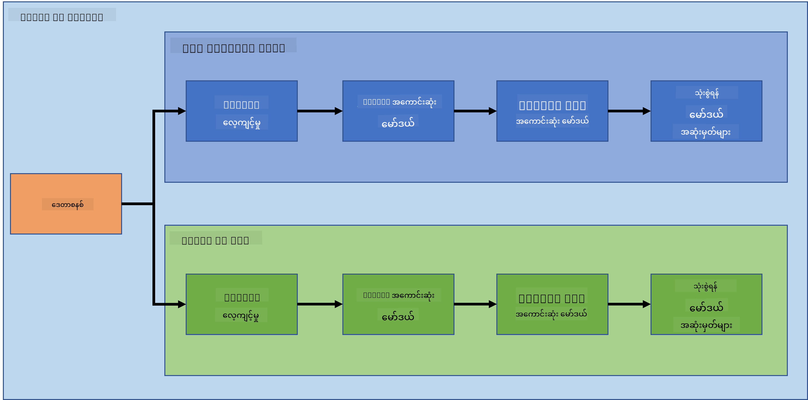
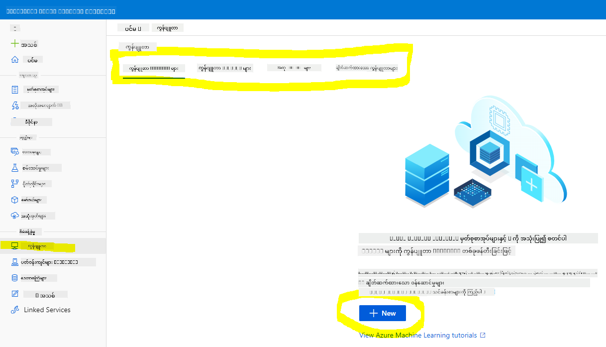
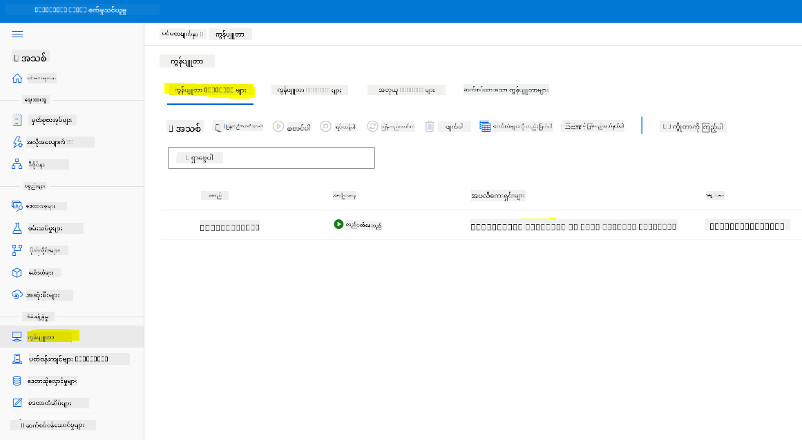
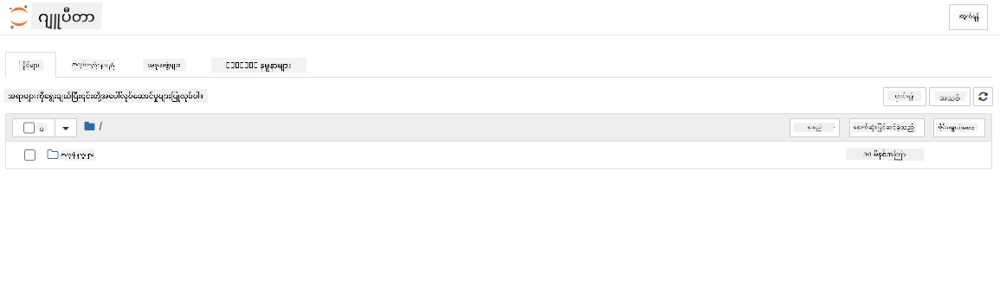

<!--
CO_OP_TRANSLATOR_METADATA:
{
  "original_hash": "73dead89dc2ddda4d6ec0232814a191e",
  "translation_date": "2025-08-30T17:58:02+00:00",
  "source_file": "5-Data-Science-In-Cloud/19-Azure/README.md",
  "language_code": "my"
}
-->
# Cloud တွင် Data Science: "Azure ML SDK" နည်းလမ်း

| ](../../sketchnotes/19-DataScience-Cloud.png)|
|:---:|
| Cloud တွင် Data Science: Azure ML SDK - _Sketchnote by [@nitya](https://twitter.com/nitya)_ |

အကြောင်းအရာများစာရင်း:

- [Cloud တွင် Data Science: "Azure ML SDK" နည်းလမ်း](../../../../5-Data-Science-In-Cloud/19-Azure)
  - [မစခင် စစ်ဆေးမေးခွန်း](../../../../5-Data-Science-In-Cloud/19-Azure)
  - [1. နိဒါန်း](../../../../5-Data-Science-In-Cloud/19-Azure)
    - [1.1 Azure ML SDK ဆိုတာဘာလဲ?](../../../../5-Data-Science-In-Cloud/19-Azure)
    - [1.2 နှလုံးရောဂါကြိုတင်ခန့်မှန်းမှု စီမံကိန်းနှင့် ဒေတာအကြောင်းမိတ်ဆက်](../../../../5-Data-Science-In-Cloud/19-Azure)
  - [2. Azure ML SDK ဖြင့် မော်ဒယ်တင်သင်ကြားခြင်း](../../../../5-Data-Science-In-Cloud/19-Azure)
    - [2.1 Azure ML workspace တစ်ခု ဖန်တီးခြင်း](../../../../5-Data-Science-In-Cloud/19-Azure)
    - [2.2 Compute instance တစ်ခု ဖန်တီးခြင်း](../../../../5-Data-Science-In-Cloud/19-Azure)
    - [2.3 ဒေတာစနစ်တင်ခြင်း](../../../../5-Data-Science-In-Cloud/19-Azure)
    - [2.4 Notebook များ ဖန်တီးခြင်း](../../../../5-Data-Science-In-Cloud/19-Azure)
    - [2.5 မော်ဒယ်တင်သင်ကြားခြင်း](../../../../5-Data-Science-In-Cloud/19-Azure)
      - [2.5.1 Workspace, experiment, compute cluster နှင့် dataset ကို စတင်ပြင်ဆင်ခြင်း](../../../../5-Data-Science-In-Cloud/19-Azure)
      - [2.5.2 AutoML Configuration နှင့် သင်ကြားမှု](../../../../5-Data-Science-In-Cloud/19-Azure)
  - [3. Azure ML SDK ဖြင့် မော်ဒယ်တင်သင်ကြားပြီး deployment နှင့် endpoint အသုံးပြုခြင်း](../../../../5-Data-Science-In-Cloud/19-Azure)
    - [3.1 အကောင်းဆုံးမော်ဒယ်ကို သိမ်းဆည်းခြင်း](../../../../5-Data-Science-In-Cloud/19-Azure)
    - [3.2 မော်ဒယ် Deployment](../../../../5-Data-Science-In-Cloud/19-Azure)
    - [3.3 Endpoint အသုံးပြုခြင်း](../../../../5-Data-Science-In-Cloud/19-Azure)
  - [🚀 စိန်ခေါ်မှု](../../../../5-Data-Science-In-Cloud/19-Azure)
  - [မစခင် စစ်ဆေးမေးခွန်း](../../../../5-Data-Science-In-Cloud/19-Azure)
  - [ပြန်လည်သုံးသပ်ခြင်းနှင့် ကိုယ်တိုင်လေ့လာမှု](../../../../5-Data-Science-In-Cloud/19-Azure)
  - [အိမ်စာ](../../../../5-Data-Science-In-Cloud/19-Azure)

## [မစခင် စစ်ဆေးမေးခွန်း](https://purple-hill-04aebfb03.1.azurestaticapps.net/quiz/36)

## 1. နိဒါန်း

### 1.1 Azure ML SDK ဆိုတာဘာလဲ?

Data scientist များနှင့် AI developer များသည် Azure Machine Learning SDK ကို အသုံးပြု၍ Azure Machine Learning service ဖြင့် machine learning workflow များကို တည်ဆောက်ပြီး အကောင်အထည်ဖော်ကြသည်။ Python environment မည်သည့်အရာတွင်မဆို (ဥပမာ Jupyter Notebooks, Visual Studio Code, သို့မဟုတ် သင်နှစ်သက်သော Python IDE) service နှင့် အပြန်အလှန်ဆက်သွယ်နိုင်သည်။

SDK ၏ အဓိကအပိုင်းများမှာ:

- Machine learning စမ်းသပ်မှုများတွင် အသုံးပြုမည့် dataset များကို စူးစမ်းခြင်း၊ ပြင်ဆင်ခြင်းနှင့် ၎င်းတို့၏ အသက်တာစဉ်ကို စီမံခန့်ခွဲခြင်း။
- Cloud resources များကို စီမံခန့်ခွဲခြင်း၊ စောင့်ကြည့်ခြင်း၊ log မှတ်တမ်းများရေးသားခြင်းနှင့် စမ်းသပ်မှုများကို စီမံခြင်း။
- မော်ဒယ်များကို ဒေသတွင် သို့မဟုတ် GPU acceleration ပါဝင်သည့် cloud resources အသုံးပြု၍ သင်ကြားခြင်း။
- AutoML ကို အသုံးပြုခြင်း၊ ၎င်းသည် configuration parameters နှင့် training data ကို လက်ခံပြီး အကောင်းဆုံးမော်ဒယ်ကို ရှာဖွေရန် algorithm နှင့် hyperparameter များကို အလိုအလျောက် iteration ပြုလုပ်သည်။
- သင်ကြားပြီးသော မော်ဒယ်များကို RESTful service များအဖြစ် deploy လုပ်ပြီး မည်သည့် application တွင်မဆို အသုံးပြုနိုင်သော web service များအဖြစ် ပြောင်းလဲခြင်း။

[Azure Machine Learning SDK အကြောင်းပိုမိုလေ့လာရန်](https://docs.microsoft.com/python/api/overview/azure/ml?WT.mc_id=academic-77958-bethanycheum&ocid=AID3041109)

[ယခင်သင်ခန်းစာ](../18-Low-Code/README.md) တွင် Low code/No code နည်းလမ်းဖြင့် မော်ဒယ်တစ်ခုကို သင်ကြားခြင်း၊ deploy လုပ်ခြင်းနှင့် အသုံးပြုခြင်းကို ကြည့်ခဲ့ပါသည်။ Heart Failure dataset ကို အသုံးပြု၍ နှလုံးရောဂါကြိုတင်ခန့်မှန်းမော်ဒယ်ကို ဖန်တီးခဲ့သည်။ ယခုသင်ခန်းစာတွင် အတူတူသောအရာကို Azure Machine Learning SDK ကို အသုံးပြု၍ ပြုလုပ်သွားမည်ဖြစ်သည်။



### 1.2 နှလုံးရောဂါကြိုတင်ခန့်မှန်းမှု စီမံကိန်းနှင့် ဒေတာအကြောင်းမိတ်ဆက်

[ဒီနေရာ](../18-Low-Code/README.md) တွင် နှလုံးရောဂါကြိုတင်ခန့်မှန်းမှု စီမံကိန်းနှင့် dataset အကြောင်းကို ကြည့်ပါ။

## 2. Azure ML SDK ဖြင့် မော်ဒယ်တင်သင်ကြားခြင်း

### 2.1 Azure ML workspace တစ်ခု ဖန်တီးခြင်း

ရိုးရှင်းစွာ Jupyter notebook တွင် အလုပ်လုပ်မည်ဖြစ်သည်။ ၎င်းသည် သင်မှာ Workspace နှင့် compute instance ရှိပြီးဖြစ်သည်ဟု ဆိုလိုသည်။ Workspace ရှိပြီးသားဖြစ်ပါက 2.3 Notebook ဖန်တီးခြင်း အပိုင်းသို့ တိုက်ရိုက်သွားနိုင်သည်။

Workspace မရှိသေးပါက [ယခင်သင်ခန်းစာ](../18-Low-Code/README.md) ၏ **2.1 Azure ML workspace ဖန်တီးခြင်း** အပိုင်းတွင် ဖော်ပြထားသည့် လမ်းညွှန်ချက်များကို လိုက်နာပါ။

### 2.2 Compute instance တစ်ခု ဖန်တီးခြင်း

[Azure ML workspace](https://ml.azure.com/) တွင် Compute menu သို့သွားပြီး ရရှိနိုင်သော compute resources များကို ကြည့်ပါ။



Jupyter notebook တစ်ခုကို provision လုပ်ရန် compute instance တစ်ခု ဖန်တီးမည်။
1. + New ခလုတ်ကို နှိပ်ပါ။
2. Compute instance အတွက် အမည်တစ်ခုပေးပါ။
3. သင့်ရွေးချယ်မှုများ (CPU သို့မဟုတ် GPU, VM အရွယ်အစားနှင့် core အရေအတွက်) ကို ရွေးပါ။
4. Create ခလုတ်ကို နှိပ်ပါ။

ဂုဏ်ယူပါတယ်၊ သင်သည် compute instance တစ်ခု ဖန်တီးပြီးပါပြီ! [Notebook ဖန်တီးခြင်း](../../../../5-Data-Science-In-Cloud/19-Azure) အပိုင်းတွင် ၎င်းကို အသုံးပြုမည်ဖြစ်သည်။

### 2.3 ဒေတာစနစ်တင်ခြင်း

Dataset ကို မတင်ရသေးပါက [ယခင်သင်ခန်းစာ](../18-Low-Code/README.md) ၏ **2.3 ဒေတာစနစ်တင်ခြင်း** အပိုင်းကို ကြည့်ပါ။

### 2.4 Notebook များ ဖန်တီးခြင်း

> **_မှတ်ချက်:_** နောက်တစ်ဆင့်အတွက် သင်အသစ် notebook တစ်ခု ဖန်တီးနိုင်သလို၊ [ယခင်ဖန်တီးထားသော notebook](notebook.ipynb) ကို upload လုပ်နိုင်ပါသည်။ Upload လုပ်ရန် "Notebook" menu ကို နှိပ်ပြီး notebook ကို upload လုပ်ပါ။

Notebook များသည် Data Science လုပ်ငန်းစဉ်တွင် အရေးကြီးသော အစိတ်အပိုင်းတစ်ခုဖြစ်သည်။ ၎င်းတို့ကို Exploratory Data Analysis (EDA) ပြုလုပ်ရန်၊ compute cluster သို့ ခေါ်ရန်၊ သို့မဟုတ် inference cluster သို့ ခေါ်ရန် အသုံးပြုနိုင်သည်။

Notebook ဖန်တီးရန် Jupyter notebook instance ကို run လုပ်နေသော compute node တစ်ခု လိုအပ်သည်။ [Azure ML workspace](https://ml.azure.com/) သို့ ပြန်သွားပြီး Compute instances ကို နှိပ်ပါ။ [ယခင်ဖန်တီးထားသော compute instance](../../../../5-Data-Science-In-Cloud/19-Azure) ကို တွေ့ရမည်။

1. Applications အပိုင်းတွင် Jupyter ကို နှိပ်ပါ။
2. "Yes, I understand" ကို အမှန်ခြစ်ပြီး Continue ခလုတ်ကို နှိပ်ပါ။

3. Jupyter notebook instance ဖြင့် browser tab အသစ်တစ်ခု ဖွင့်မည်ဖြစ်သည်။ "New" ခလုတ်ကို နှိပ်ပြီး notebook တစ်ခု ဖန်တီးပါ။



Notebook ရရှိပြီးပါက Azure ML SDK ဖြင့် မော်ဒယ်ကို သင်ကြားနိုင်ပါပြီ။

### 2.5 မော်ဒယ်တင်သင်ကြားခြင်း

မည်သည့်အချိန်တွင်မဆို သင်မသေချာပါက [Azure ML SDK documentation](https://docs.microsoft.com/python/api/overview/azure/ml?WT.mc_id=academic-77958-bethanycheum&ocid=AID3041109) ကို ကြည့်ပါ။ ၎င်းတွင် သင်ခန်းစာတွင် ကြည့်မည့် module များအကြောင်း လိုအပ်သော အချက်အလက်များ ပါဝင်သည်။

#### 2.5.1 Workspace, experiment, compute cluster နှင့် dataset ကို စတင်ပြင်ဆင်ခြင်း

`workspace` ကို configuration ဖိုင်မှ load လုပ်ရန် အောက်ပါ code ကို အသုံးပြုပါ:

```python
from azureml.core import Workspace
ws = Workspace.from_config()
```

ဤသည်သည် workspace ကို ကိုယ်စားပြုသည့် `Workspace` အမျိုးအစား object တစ်ခုကို ပြန်ပေးသည်။ experiment တစ်ခု ဖန်တီးရန် အောက်ပါ code ကို အသုံးပြုပါ:

```python
from azureml.core import Experiment
experiment_name = 'aml-experiment'
experiment = Experiment(ws, experiment_name)
```

Workspace မှ experiment တစ်ခုကို ရယူရန် သို့မဟုတ် ဖန်တီးရန် experiment အမည်ကို အသုံးပြုပါ။ Experiment အမည်သည် 3-36 လုံးရှိရမည်၊ စာလုံး သို့မဟုတ် နံပါတ်ဖြင့် စရမည်၊ စာလုံးများ၊ နံပါတ်များ၊ underscore များနှင့် dash များသာ ပါဝင်နိုင်သည်။ Workspace တွင် experiment မတွေ့ပါက အသစ်တစ်ခု ဖန်တီးမည်ဖြစ်သည်။

Training အတွက် compute cluster တစ်ခု ဖန်တီးရန် အောက်ပါ code ကို အသုံးပြုပါ။ ဤအဆင့်သည် မိနစ်အနည်းငယ်ကြာနိုင်သည်။

```python
from azureml.core.compute import AmlCompute

aml_name = "heart-f-cluster"
try:
    aml_compute = AmlCompute(ws, aml_name)
    print('Found existing AML compute context.')
except:
    print('Creating new AML compute context.')
    aml_config = AmlCompute.provisioning_configuration(vm_size = "Standard_D2_v2", min_nodes=1, max_nodes=3)
    aml_compute = AmlCompute.create(ws, name = aml_name, provisioning_configuration = aml_config)
    aml_compute.wait_for_completion(show_output = True)

cts = ws.compute_targets
compute_target = cts[aml_name]
```

Workspace မှ dataset ကို dataset အမည်ဖြင့် ရယူနိုင်သည်:

```python
dataset = ws.datasets['heart-failure-records']
df = dataset.to_pandas_dataframe()
df.describe()
```

#### 2.5.2 AutoML Configuration နှင့် သင်ကြားမှု

AutoML configuration ကို သတ်မှတ်ရန် [AutoMLConfig class](https://docs.microsoft.com/python/api/azureml-train-automl-client/azureml.train.automl.automlconfig(class)?WT.mc_id=academic-77958-bethanycheum&ocid=AID3041109) ကို အသုံးပြုပါ။

Doc တွင် ဖော်ပြထားသည့်အတိုင်း parameter များစွာရှိပြီး သင်ကစားနိုင်သည်။ ဤစီမံကိန်းအတွက် အောက်ပါ parameter များကို အသုံးပြုမည်:

- `experiment_timeout_minutes`: Experiment ကို အလိုအလျောက်ရပ်တန့်ပြီး ရလဒ်များကို ရရှိနိုင်ရန် ခွင့်ပြုထားသည့် အချိန်အများဆုံး (မိနစ်)။
- `max_concurrent_iterations`: Experiment အတွက် ခွင့်ပြုထားသည့် concurrent training iteration အများဆုံး။
- `primary_metric`: Experiment ၏ status ကို သတ်မှတ်ရန် အသုံးပြုသည့် primary metric။
- `compute_target`: Automated Machine Learning experiment ကို run လုပ်ရန် Azure Machine Learning compute target။
- `task`: Run လုပ်ရန် task အမျိုးအစား။ 'classification', 'regression', သို့မဟုတ် 'forecasting' ဖြစ်နိုင်သည်။
- `training_data`: Experiment အတွင်း အသုံးပြုရန် training data။ Training features နှင့် label column (optional sample weights column) ပါဝင်ရမည်။
- `label_column_name`: Label column ၏ အမည်။
- `path`: Azure Machine Learning project folder ၏ လမ်းကြောင်းအပြည့်။
- `enable_early_stopping`: အချိန်တိုအတွင်း score မတိုးတက်ပါက early termination ကို ဖွင့်ရန်။
- `featurization`: Featurization အဆင့်ကို အလိုအလျောက်ပြုလုပ်ရန် သို့မဟုတ် customize လုပ်ရန်။
- `debug_log`: Debug အချက်အလက်များကို ရေးရန် log ဖိုင်။

```python
from azureml.train.automl import AutoMLConfig

project_folder = './aml-project'

automl_settings = {
    "experiment_timeout_minutes": 20,
    "max_concurrent_iterations": 3,
    "primary_metric" : 'AUC_weighted'
}

automl_config = AutoMLConfig(compute_target=compute_target,
                             task = "classification",
                             training_data=dataset,
                             label_column_name="DEATH_EVENT",
                             path = project_folder,  
                             enable_early_stopping= True,
                             featurization= 'auto',
                             debug_log = "automl_errors.log",
                             **automl_settings
                            )
```

Configuration သတ်မှတ်ပြီးပါက အောက်ပါ code ကို အသုံးပြု၍ မော်ဒယ်ကို သင်ကြားနိုင်သည်။ ဤအဆင့်သည် cluster အရွယ်အစားပေါ်မူတည်၍ တစ်နာရီအထိ ကြာနိုင်သည်။

```python
remote_run = experiment.submit(automl_config)
```

RunDetails widget ကို အသုံးပြု၍ စမ်းသပ်မှုများကို ပြသနိုင်သည်။

```python
from azureml.widgets import RunDetails
RunDetails(remote_run).show()
```

## 3. Azure ML SDK ဖြင့် မော်ဒယ်တင်သင်ကြားပြီး deployment နှင့် endpoint အသုံးပြုခြင်း

### 3.1 အကောင်းဆုံးမော်ဒယ်ကို သိမ်းဆည်းခြင်း

`remote_run` သည် [AutoMLRun](https://docs.microsoft.com/python/api/azureml-train-automl-client/azureml.train.automl.run.automlrun?WT.mc_id=academic-77958-bethanycheum&ocid=AID3041109) အမျိုးအစား object တစ်ခုဖြစ်သည်။ ၎င်းတွင် `get_output()` method ပါဝင်ပြီး ၎င်းသည် အကောင်းဆုံး run နှင့် ၎င်းနှင့်ဆက်စပ်သော fitted model ကို ပြန်ပေးသည်။

```python
best_run, fitted_model = remote_run.get_output()
```

အကောင်းဆုံးမော်ဒယ်တွင် အသုံးပြုထားသည့် parameter များကို fitted_model ကို print လုပ်ခြင်းဖြင့် ကြည့်နိုင်သည်။ အကောင်းဆုံးမော်ဒယ်၏ property များကို [get_properties()](https://docs.microsoft.com/python/api/azureml-core/azureml.core.run(class)?view=azure-ml-py#azureml_core_Run_get_properties?WT.mc_id=academic-77958-bethanycheum&ocid=AID3041109) method ဖြင့် ကြည့်နိုင်သည်။

```python
best_run.get_properties()
```

ယခု [register_model](https://docs.microsoft.com/python/api/azureml-train-automl-client/azureml.train.automl.run.automlrun?view=azure-ml-py#register-model-model-name-none--description-none--tags-none--iteration-none--metric-none-?WT.mc_id=academic-77958-bethanycheum&ocid=AID3041109) method ဖြင့် မော်ဒယ်ကို register လုပ်ပါ။

```python
model_name = best_run.properties['model_name']
script_file_name = 'inference/score.py'
best_run.download_file('outputs/scoring_file_v_1_0_0.py', 'inference/score.py')
description = "aml heart failure project sdk"
model = best_run.register_model(model_name = model_name,
                                model_path = './outputs/',
                                description = description,
                                tags = None)
```

### 3.2 မော်ဒယ် Deployment

အကောင်းဆုံးမော်ဒယ်ကို သိမ်းဆည်းပြီးပါက [InferenceConfig](https://docs.microsoft.com/python/api/azureml-core/azureml.core.model.inferenceconfig?view=azure-ml-py?ocid=AID3041109) class ဖြင့် deploy လုပ်နိုင်သည်။ InferenceConfig သည် deployment အတွက် custom environment တစ်ခု၏ configuration setting များကို ကိုယ်စားပြုသည်။ [AciWebservice](https://docs.microsoft.com/python/api/azureml-core/azureml.core.webservice.aciwebservice?view=azure-ml-py) class သည် Azure Container Instances တွင် web service endpoint အဖြစ် deploy
```python
response = aci_service.run(input_data=test_sample)
response
```  
ဒီဟာက `'{"result": [false]}'` ကို output ပေးသင့်ပါတယ်။ ဒါကဆိုရင်တော့ ကျွန်တော်တို့ endpoint ကို ပို့လိုက်တဲ့ patient input က `false` ဆိုတဲ့ အနက်ကို generate လုပ်ပေးတယ်၊ ဒါကဆိုရင် ဒီလူဟာ နှလုံးရောဂါဖြစ်နိုင်ခြေ မရှိဘူးလို့ ဆိုလိုပါတယ်။

ဂုဏ်ယူပါတယ်! Azure ML SDK ကို အသုံးပြုပြီး Azure ML ပေါ်မှာ train လုပ်ပြီး deploy လုပ်ထားတဲ့ model ကို သင်အသုံးပြုနိုင်ခဲ့ပါပြီ!

> **_NOTE:_** Project ကိုပြီးမြောက်သွားတဲ့အခါမှာ သင်အသုံးပြုထားတဲ့ resource တွေကို မမေ့ဘဲ delete လုပ်ပေးပါ။

## 🚀 စိန်ခေါ်မှု

SDK ကို အသုံးပြုပြီး လုပ်ဆောင်နိုင်တဲ့ အခြားအရာတွေ အများကြီးရှိပါတယ်၊ ဒါပေမယ့် ဒီသင်ခန်းစာမှာ အားလုံးကို ဖော်ပြပေးလို့ မရနိုင်ပါဘူး။ သို့သော် သတင်းကောင်းတစ်ခုကတော့ SDK documentation ကို skim လုပ်တတ်တာက သင်ကိုယ်တိုင် အတော်လေးအထောက်အကူဖြစ်စေမှာပါ။ Azure ML SDK documentation ကို ကြည့်ပြီး `Pipeline` class ကို ရှာဖွေကြည့်ပါ၊ ဒါကတော့ workflow အနေနဲ့ အဆင့်ဆင့်လုပ်ဆောင်နိုင်တဲ့ pipelines တွေကို ဖန်တီးနိုင်စေပါတယ်။

**HINT:** [SDK documentation](https://docs.microsoft.com/python/api/overview/azure/ml/?view=azure-ml-py?WT.mc_id=academic-77958-bethanycheum&ocid=AID3041109) ကို သွားပြီး "Pipeline" ဆိုတဲ့ keyword ကို ရိုက်ထည့်ရှာဖွေပါ။ ရလဒ်တွေထဲမှာ `azureml.pipeline.core.Pipeline` class ကို တွေ့ရမယ်။

## [Post-lecture quiz](https://purple-hill-04aebfb03.1.azurestaticapps.net/quiz/37)

## ပြန်လည်သုံးသပ်ခြင်းနှင့် ကိုယ်တိုင်လေ့လာခြင်း

ဒီသင်ခန်းစာမှာ သင် Azure ML SDK ကို cloud ပေါ်မှာ အသုံးပြုပြီး နှလုံးရောဂါဖြစ်နိုင်ခြေကို ခန့်မှန်းတဲ့ model ကို train, deploy, consume လုပ်ပုံကို သင်ယူခဲ့ပါတယ်။ Azure ML SDK အကြောင်းပိုမိုသိရှိရန် ဒီ [documentation](https://docs.microsoft.com/python/api/overview/azure/ml/?view=azure-ml-py?WT.mc_id=academic-77958-bethanycheum&ocid=AID3041109) ကို ကြည့်ပါ။ Azure ML SDK ကို အသုံးပြုပြီး သင့်ရဲ့ ကိုယ်ပိုင် model ကို ဖန်တီးကြည့်ပါ။

## အိမ်စာ

[Azure ML SDK ကို အသုံးပြုတဲ့ Data Science project](assignment.md)

---

**ဝက်ဘ်ဆိုက်မှတ်ချက်**:  
ဤစာရွက်စာတမ်းကို AI ဘာသာပြန်ဝန်ဆောင်မှု [Co-op Translator](https://github.com/Azure/co-op-translator) ကို အသုံးပြု၍ ဘာသာပြန်ထားပါသည်။ ကျွန်ုပ်တို့သည် တိကျမှန်ကန်မှုအတွက် ကြိုးစားနေသော်လည်း၊ အလိုအလျောက်ဘာသာပြန်ခြင်းတွင် အမှားများ သို့မဟုတ် မမှန်ကန်မှုများ ပါဝင်နိုင်ကြောင်း သတိပြုပါ။ မူလဘာသာစကားဖြင့် ရေးသားထားသော စာရွက်စာတမ်းကို အာဏာတည်သော ရင်းမြစ်အဖြစ် သတ်မှတ်သင့်ပါသည်။ အရေးကြီးသော အချက်အလက်များအတွက် လူ့ဘာသာပြန်ပညာရှင်များကို အသုံးပြုရန် အကြံပြုပါသည်။ ဤဘာသာပြန်ကို အသုံးပြုခြင်းမှ ဖြစ်ပေါ်လာသော နားလည်မှုမှားများ သို့မဟုတ် အဓိပ္ပာယ်မှားများအတွက် ကျွန်ုပ်တို့သည် တာဝန်မယူပါ။