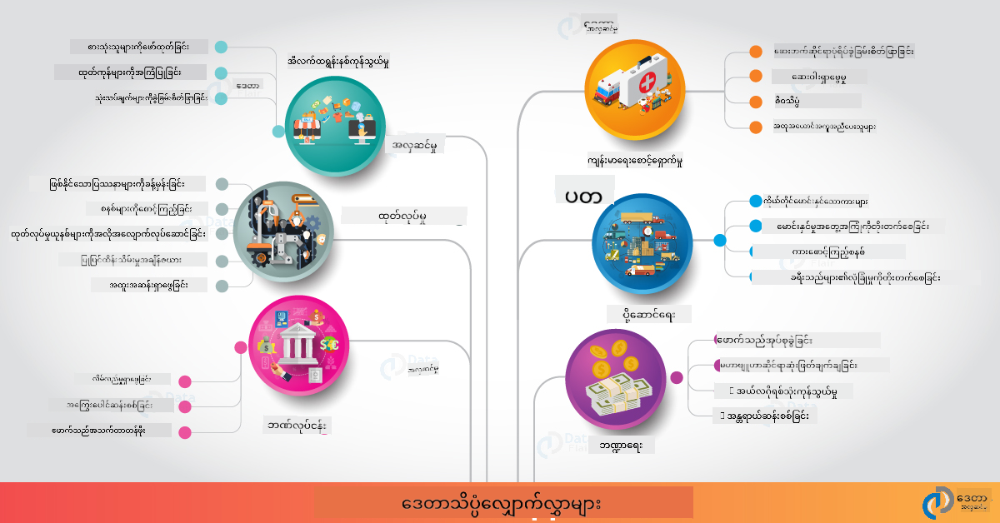

<!--
CO_OP_TRANSLATOR_METADATA:
{
  "original_hash": "67076ed50f54e7d26ba1ba378d6078f1",
  "translation_date": "2025-08-30T19:55:29+00:00",
  "source_file": "6-Data-Science-In-Wild/20-Real-World-Examples/README.md",
  "language_code": "my"
}
-->
# အမှန်တကယ်ကမ္ဘာတွင် ဒေတာသိပ္ပံ

|  ](../../sketchnotes/20-DataScience-RealWorld.png) |
| :--------------------------------------------------------------------------------------------------------------: |
|               အမှန်တကယ်ကမ္ဘာတွင် ဒေတာသိပ္ပံ - _Sketchnote by [@nitya](https://twitter.com/nitya)_               |

ကျွန်တော်တို့၏ သင်ကြားမှုခရီးစဉ်၏ နောက်ဆုံးအဆင့်သို့ ရောက်ရှိလာပါပြီ။

ကျွန်တော်တို့သည် ဒေတာသိပ္ပံနှင့် စည်းကမ်းချက်များ၏ အဓိပ္ပါယ်များဖြင့် စတင်ခဲ့ပြီး၊ ဒေတာခွဲခြမ်းစိတ်ဖြာမှုနှင့် ရှုထောင့်ဖော်ပြမှုအတွက် အမျိုးမျိုးသော ကိရိယာများနှင့် နည်းလမ်းများကို လေ့လာခဲ့ကြသည်။ ဒေတာသိပ္ပံ၏ အသက်တာစက်ဝန်းကို ပြန်လည်သုံးသပ်ပြီး၊ cloud computing ဝန်ဆောင်မှုများဖြင့် ဒေတာသိပ္ပံလုပ်ငန်းစဉ်များကို အတိုင်းအတာချဲ့ထွင်ခြင်းနှင့် အလိုအလျောက်လုပ်ဆောင်ခြင်းကို လေ့လာခဲ့ကြသည်။ ထို့ကြောင့် သင်သည် _"ဒီလေ့လာမှုအားလုံးကို အမှန်တကယ်ကမ္ဘာကြီးတွင် ဘယ်လိုဆက်စပ်ရမလဲ?"_ ဟု စဉ်းစားနေကြလိမ့်မည်။

ဒီသင်ခန်းစာတွင်၊ စက်မှုလုပ်ငန်းအတွင်း ဒေတာသိပ္ပံ၏ အမှန်တကယ်အသုံးချမှုများကို လေ့လာပြီး၊ သုတေသန၊ ဒစ်ဂျစ်တယ် လူ့ဘာသာရပ်များနှင့် တာရှည်တည်တံ့မှုဆိုင်ရာ အထူးဥပမာများကို ဆွေးနွေးသွားမည်ဖြစ်သည်။ ကျောင်းသားများအတွက် စီမံကိန်းအခွင့်အလမ်းများကိုလည်း လေ့လာပြီး၊ သင်၏ သင်ကြားမှုခရီးစဉ်ကို ဆက်လက်တိုးတက်စေရန် အသုံးဝင်သော အရင်းအမြစ်များဖြင့် အဆုံးသတ်သွားမည်။

## သင်ခန်းစာမတိုင်မီ စစ်ဆေးမှု

[သင်ခန်းစာမတိုင်မီ စစ်ဆေးမှု](https://purple-hill-04aebfb03.1.azurestaticapps.net/quiz/38)

## ဒေတာသိပ္ပံ + စက်မှုလုပ်ငန်း

AI ကို လူတိုင်းအသုံးပြုနိုင်စေရန် အခွင့်အရေးများ ပိုမိုရရှိလာသည့်အတွက်၊ ဖွံ့ဖြိုးသူများသည် AI အခြေပြု ဆုံးဖြတ်ချက်များနှင့် ဒေတာအခြေပြု အမြင်များကို အသုံးပြုသူအတွေ့အကြုံများနှင့် ဖွံ့ဖြိုးမှုလုပ်ငန်းစဉ်များတွင် ပိုမိုလွယ်ကူစွာ ထည့်သွင်းနိုင်ကြသည်။ ဒေတာသိပ္ပံကို စက်မှုလုပ်ငန်းအတွင်း "အသုံးချ" သည့် အချို့သော ဥပမာများမှာ -

 * [Google Flu Trends](https://www.wired.com/2015/10/can-learn-epic-failure-google-flu-trends/) သည် ရောဂါဖြစ်ပွားမှုများနှင့် ရှာဖွေမှုစကားလုံးများကို ဆက်စပ်ရန် ဒေတာသိပ္ပံကို အသုံးပြုခဲ့သည်။ နည်းလမ်းတွင် အားနည်းချက်များရှိသော်လည်း၊ ဒေတာအခြေပြု ကျန်းမာရေးခန့်မှန်းမှုများ၏ အခွင့်အလမ်းများ (နှင့် စိန်ခေါ်မှုများ) အပေါ် သတိပေးမှုကို တိုးတက်စေခဲ့သည်။

 * [UPS Routing Predictions](https://www.technologyreview.com/2018/11/21/139000/how-ups-uses-ai-to-outsmart-bad-weather/) - UPS သည် ဒေတာသိပ္ပံနှင့် စက်လေ့လာမှုကို အသုံးပြု၍ ရေဥတုအခြေအနေများ၊ ယာဉ်အသွားအလာပုံစံများ၊ ပို့ဆောင်ချိန်ကန့်သတ်ချက်များစသည့် အချက်အလက်များကို အခြေခံ၍ ပို့ဆောင်မှုအတွက် အကောင်းဆုံးလမ်းကြောင်းများကို ခန့်မှန်းသည်။

 * [NYC Taxicab Route Visualization](http://chriswhong.github.io/nyctaxi/) - [Freedom Of Information Laws](https://chriswhong.com/open-data/foil_nyc_taxi/) ကို အသုံးပြု၍ ရရှိသည့် ဒေတာများကို အသုံးပြု၍ နယူးယောက်မြို့၏ တစ်နေ့တာအတွင်း တက်စီများ၏ လှုပ်ရှားမှုများကို ရှုထောင့်ဖော်ပြခဲ့သည်။

 * [Uber Data Science Workbench](https://eng.uber.com/dsw/) - Uber ၏ နေ့စဉ် ခရီးစဉ်များမှ ရရှိသည့် ဒေတာများကို အသုံးပြု၍ (ဥပမာ - ခရီးစဉ်အချိန်၊ လမ်းကြောင်းများ) စျေးနှုန်းသတ်မှတ်မှု၊ လုံခြုံမှု၊ လိမ်လည်မှုရှာဖွေမှုနှင့် လမ်းညွှန်မှုဆိုင်ရာ ဆုံးဖြတ်ချက်များအတွက် ဒေတာခွဲခြမ်းစိတ်ဖြာမှုကိရိယာတစ်ခုကို တည်ဆောက်ခဲ့သည်။

 * [အားကစားဒေတာခွဲခြမ်းစိတ်ဖြာမှု](https://towardsdatascience.com/scope-of-analytics-in-sports-world-37ed09c39860) - _ခန့်မှန်းခွဲခြမ်းစိတ်ဖြာမှု_ (အသင်းနှင့် ကစားသမားခွဲခြမ်းစိတ်ဖြာမှု - [Moneyball](https://datasciencedegree.wisconsin.edu/blog/moneyball-proves-importance-big-data-big-ideas/) ကို စဉ်းစားပါ) နှင့် _ဒေတာရှုထောင့်ဖော်ပြမှု_ (အသင်းနှင့် ပရိသတ် dashboard များ) တို့ကို အဓိကထားသည်။

 * [ဘဏ္ဍာရေးလုပ်ငန်းအတွင်း ဒေတာသိပ္ပံ](https://data-flair.training/blogs/data-science-in-banking/) - အန္တရာယ်ခန့်မှန်းမှု၊ လိမ်လည်မှုရှာဖွေမှု၊ ဖောက်သည်ခွဲခြမ်းစိတ်ဖြာမှု၊ အချိန်နှင့်တပြေးညီ ခန့်မှန်းမှုနှင့် အကြံပြုစနစ်များအတွက် ဒေတာသိပ္ပံ၏ တန်ဖိုးကို ဖော်ပြသည်။

 * [ကျန်းမာရေးလုပ်ငန်းအတွင်း ဒေတာသိပ္ပံ](https://data-flair.training/blogs/data-science-in-healthcare/) - ဆေးဘက်ဆိုင်ရာ ရုပ်ပုံခွဲခြမ်းစိတ်ဖြာမှု (ဥပမာ - MRI, X-Ray, CT-Scan)၊ DNA စဉ်ဆက်မပြတ်ခွဲခြမ်းစိတ်ဖြာမှု၊ ဆေးဝါးဖွံ့ဖြိုးမှု၊ ရောဂါခြေရာခံမှုနှင့် ကာကွယ်မှုတို့ကို အဓိကထားသည်။

 ပုံရင်းအရင်းအမြစ်: [Data Flair: 6 Amazing Data Science Applications ](https://data-flair.training/blogs/data-science-applications/)

ပုံတွင် ဒေတာသိပ္ပံနည်းလမ်းများကို အသုံးချနိုင်သည့် အခြားသော နယ်ပယ်များနှင့် ဥပမာများကို ဖော်ပြထားသည်။ အခြားသော အသုံးချမှုများကို လေ့လာလိုပါသလား? [Review & Self Study](../../../../6-Data-Science-In-Wild/20-Real-World-Examples) အပိုင်းကို ကြည့်ပါ။

## ဒေတာသိပ္ပံ + သုတေသန

|  ](../../sketchnotes/20-DataScience-Research.png) |
| :---------------------------------------------------------------------------------------------------------------: |
|              ဒေတာသိပ္ပံနှင့် သုတေသန - _Sketchnote by [@nitya](https://twitter.com/nitya)_              |

အမှန်တကယ်အသုံးချမှုများသည် အများအားဖြင့် စက်မှုလုပ်ငန်းအတွင်း အတိုင်းအတာချဲ့ထွင်မှုများကို အဓိကထားသော်လည်း၊ **သုတေသန** လုပ်ငန်းစဉ်များနှင့် စီမံကိန်းများသည် အောက်ပါနှစ်မျိုးဖြင့် အသုံးဝင်နိုင်သည် -

* **ဆန်းသစ်မှုအခွင့်အလမ်းများ** - နောက်မျိုးဆက်အက်ပလီကေးရှင်းများအတွက် အဆင့်မြင့်အယူအဆများကို အမြန်စမ်းသပ်ရန်။
* **တပ်ဆင်မှုစိန်ခေါ်မှုများ** - အမှန်တကယ်ကမ္ဘာကြီးတွင် ဒေတာသိပ္ပံနည်းပညာများ၏ အန္တရာယ်များ သို့မဟုတ် မျှော်လင့်မထားသော ရလဒ်များကို စူးစမ်းရန်။

ကျောင်းသားများအတွက်၊ သုတေသနစီမံကိန်းများသည် သင်ကြားမှုနှင့် ပူးပေါင်းဆောင်ရွက်မှုအခွင့်အလမ်းများကို ပေးစွမ်းနိုင်ပြီး၊ အကြောင်းအရာကို ပိုမိုနားလည်မှုနှင့် စိတ်ဝင်စားမှုရှိသော လူများ သို့မဟုတ် အဖွဲ့များနှင့် ပိုမိုကျယ်ပြန့်စွာ ဆက်သွယ်နိုင်စေသည်။ 

ဥပမာတစ်ခုအနေဖြင့် [MIT Gender Shades Study](http://gendershades.org/overview.html) ကို ကြည့်ပါ။ 

**အဓိကရလဒ်များ**: AI ဖြေရှင်းချက်များတွင် bias များကို သောတိုင်မီရှင်းလင်းရန် သို့မဟုတ် လျော့ပါးစေရန်၊ ပိုမို **ကိုယ်စားပြုနိုင်သောဒေတာအစုများ** နှင့် ပိုမို **ပါဝင်မှုရှိသောအဖွဲ့များ** လိုအပ်ကြောင်း သတိပေးခဲ့သည်။ 

**Microsoft ၏ သုတေသနများကို လေ့လာလိုပါသလား?**

* [Microsoft Research Projects](https://www.microsoft.com/research/research-area/artificial-intelligence/?facet%5Btax%5D%5Bmsr-research-area%5D%5B%5D=13556&facet%5Btax%5D%5Bmsr-content-type%5D%5B%5D=msr-project) ကို ကြည့်ပါ။
* [Microsoft Research Data Science Summer School](https://www.microsoft.com/en-us/research/academic-program/data-science-summer-school/) မှ ကျောင်းသားစီမံကိန်းများကို လေ့လာပါ။
* [Fairlearn](https://fairlearn.org/) စီမံကိန်းနှင့် [Responsible AI](https://www.microsoft.com/en-us/ai/responsible-ai?activetab=pivot1%3aprimaryr6) အစီအစဉ်များကို ကြည့်ပါ။

## ဒေတာသိပ္ပံ + လူ့ဘာသာရပ်များ

|  ](../../sketchnotes/20-DataScience-Humanities.png) |
| :---------------------------------------------------------------------------------------------------------------: |
|              ဒေတာသိပ္ပံနှင့် ဒစ်ဂျစ်တယ် လူ့ဘာသာရပ်များ - _Sketchnote by [@nitya](https://twitter.com/nitya)_              |

ဒစ်ဂျစ်တယ် လူ့ဘာသာရပ်များကို [အဓိပ္ပါယ်ဖော်ပြထားသည်](https://digitalhumanities.stanford.edu/about-dh-stanford) - "ကွန်ပျူတာနည်းလမ်းများနှင့် လူ့ဘာသာရပ်ဆိုင်ရာ စူးစမ်းမှုများကို ပေါင်းစပ်ထားသော လုပ်ငန်းစဉ်များနှင့် နည်းလမ်းများ" ဟု။ 

ဥပမာအနေဖြင့် ["Emily Dickinson and the Meter of Mood"](https://gist.github.com/jlooper/ce4d102efd057137bc000db796bfd671) ကို ကြည့်ပါ။ 

ဒီစီမံကိန်းကို လေ့လာပြီး၊ သင်၏မေးခွန်းများကို ထပ်မံထည့်သွင်းပါ။

> [Digital Humanities toolkit](https://github.com/Digital-Humanities-Toolkit) တွင် အကူအညီရနိုင်သော ကိရိယာများကို အသုံးပြုပါ။

## ဒေတာသိပ္ပံ + တာရှည်တည်တံ့မှု

|  ](../../sketchnotes/20-DataScience-Sustainability.png) |
| :---------------------------------------------------------------------------------------------------------------: |
|              ဒေတာသိပ္ပံနှင့် တာရှည်တည်တံ့မှု - _Sketchnote by [@nitya](https://twitter.com/nitya)_              |

[2030 Agenda For Sustainable Development](https://sdgs.un.org/2030agenda) သည် ကမ္ဘာကြီးကို အန္တရာယ်မှ ကာကွယ်ရန်နှင့် ရာသီဥတုပြောင်းလဲမှု၏ သက်ရောက်မှုများကို လျော့ပါးစေရန် အဓိကထားသည်။ 

Microsoft ၏ [Planetary Computer](https://planetarycomputer.microsoft.com/) စီမံကိန်းသည် ဒေတာသိပ္ပံပညာရှင်များနှင့် ဖွံ့ဖြိုးသူများကို အောက်ပါ ၄ ခုဖြင့် ကူညီသည် -

 * [Data Catalog](https://planetarycomputer.microsoft.com/catalog) - Earth Systems ဒေတာများ (အခမဲ့နှင့် Azure-hosted)။
 * [Planetary API](https://planetarycomputer.microsoft.com/docs/reference/stac/) - အချိန်နှင့် နေရာအလိုက် ဒေတာရှာဖွေရန်။
 * [Hub](https://planetarycomputer.microsoft.com/docs/overview/environment/) - အကြီးမားဆုံး geospatial ဒေတာများကို စီမံရန်။
 * [Applications](https://planetarycomputer.microsoft.com/applications) - တာရှည်တည်တံ့မှုအမြင်များအတွက် အသုံးပြုမှုများနှင့် ကိရိယာများကို ပြသသည်။
**Planetary Computer Project သည် လက်ရှိတွင် preview အဆင့်တွင် ရှိနေပါသည် (စက်တင်ဘာ 2021 အခြေအနေဖြင့်)** - ဒေတာသိပ္ပံကို အသုံးပြု၍ တာဝန်ယူမှုရှိသော ဖြေရှင်းချက်များကို မည်သို့ စတင်ပံ့ပိုးနိုင်မည်ကို အောက်တွင် ဖော်ပြထားပါသည်။

* [အသုံးပြုခွင့်တောင်းဆိုပါ](https://planetarycomputer.microsoft.com/account/request) - စတင်လေ့လာပြီး မိတ်ဆွေများနှင့် ချိတ်ဆက်ရန်။
* [စာရွက်စာတမ်းများကို လေ့လာပါ](https://planetarycomputer.microsoft.com/docs/overview/about) - ပံ့ပိုးထားသော ဒေတာစုစည်းမှုများနှင့် API များကို နားလည်ရန်။
* [Ecosystem Monitoring](https://analytics-lab.org/ecosystemmonitoring/) ကဲ့သို့သော အက်ပလီကေးရှင်းများကို လေ့လာပြီး အကြံဉာဏ်များ ရယူပါ။

ဒေတာကို အသုံးပြု၍ ရှုထောင့်အသစ်များကို ဖော်ထုတ်ခြင်း သို့မဟုတ် ရှင်းလင်းစွာ ဖော်ပြခြင်းအားဖြင့် ရာသီဥတုပြောင်းလဲမှုနှင့် သစ်တောများဖျက်ဆီးမှုကဲ့သို့သော နယ်ပယ်များတွင် အကျိုးသက်ရောက်မှုရှိစေမည့် နည်းလမ်းများကို စဉ်းစားပါ။ ဒါမှမဟုတ်၊ အကျိုးသက်ရောက်မှုများကို အသုံးပြု၍ တာဝန်ယူမှုရှိသော နေထိုင်မှုအတွက် အပြုအမူပြောင်းလဲမှုများကို လှုံ့ဆော်မည့် အသုံးပြုသူအတွေ့အကြုံအသစ်များ ဖန်တီးနိုင်မည့် နည်းလမ်းများကို စဉ်းစားပါ။

## ဒေတာသိပ္ပံ + ကျောင်းသားများ

စက်မှုလုပ်ငန်းနှင့် သုတေသနတွင် အမှန်တကယ်အသုံးချနိုင်သော အက်ပလီကေးရှင်းများအကြောင်း ပြောခဲ့ပြီး၊ ဒစ်ဂျစ်တယ် လူ့ဘာသာရပ်များနှင့် တာဝန်ယူမှုရှိသော နယ်ပယ်များတွင် ဒေတာသိပ္ပံအက်ပလီကေးရှင်း ဥပမာများကို လေ့လာခဲ့ပါသည်။ ဒါဆိုရင် ဒေတာသိပ္ပံ စတင်လေ့လာသူများအနေဖြင့် မည်သို့ ကျွမ်းကျင်မှုများ တည်ဆောက်ပြီး သင်၏ အတတ်ပညာကို မျှဝေနိုင်မည်နည်း?

အောက်တွင် ကျောင်းသားများအတွက် ဒေတာသိပ္ပံ စီမံကိန်း ဥပမာများကို ဖော်ပြထားပါသည်။

* [MSR Data Science Summer School](https://www.microsoft.com/en-us/research/academic-program/data-science-summer-school/#!projects) နှင့် GitHub [projects](https://github.com/msr-ds3) တွင် အောက်ပါအကြောင်းအရာများကို လေ့လာပါ။
    - [ရဲတပ်ဖွဲ့၏ အင်အားသုံးမှုတွင် လူမျိုးရေး အခြေပြု အကြောင်းအရာများ](https://www.microsoft.com/en-us/research/video/data-science-summer-school-2019-replicating-an-empirical-analysis-of-racial-differences-in-police-use-of-force/) | [Github](https://github.com/msr-ds3/stop-question-frisk)
    - [နယူးယောက်မြို့ မီးရထားစနစ်၏ ယုံကြည်စိတ်ချမှု](https://www.microsoft.com/en-us/research/video/data-science-summer-school-2018-exploring-the-reliability-of-the-nyc-subway-system/) | [Github](https://github.com/msr-ds3/nyctransit)
* [Digitizing Material Culture: Exploring socio-economic distributions in Sirkap](https://claremont.maps.arcgis.com/apps/Cascade/index.html?appid=bdf2aef0f45a4674ba41cd373fa23afc) - [Ornella Altunyan](https://twitter.com/ornelladotcom) နှင့် Claremont မှ အဖွဲ့၏ စီမံကိန်း၊ [ArcGIS StoryMaps](https://storymaps.arcgis.com/) ကို အသုံးပြုထားသည်။

## 🚀 စိန်ခေါ်မှု

စတင်လေ့လာသူများအတွက် သင့်တော်သော ဒေတာသိပ္ပံ စီမံကိန်းများကို အကြံပြုထားသော ဆောင်းပါးများကို ရှာဖွေပါ - ဥပမာအားဖြင့် [ဤ 50 ခေါင်းစဉ်များ](https://www.upgrad.com/blog/data-science-project-ideas-topics-beginners/), [ဤ 21 စီမံကိန်းအကြံပြုချက်များ](https://www.intellspot.com/data-science-project-ideas) သို့မဟုတ် [ဤ 16 စီမံကိန်းများနှင့် အရင်းအမြစ်ကုဒ်](https://data-flair.training/blogs/data-science-project-ideas/) တို့ကို လေ့လာပြီး ပြန်လည်ဖွဲ့စည်းပါ။ သင်၏ လေ့လာမှုခရီးစဉ်များကို ဘလော့ဂ်ရေးသားပြီး သင်၏ အမြင်များကို ကျွန်ုပ်တို့အား မျှဝေရန် မမေ့ပါနှင့်။

## Post-Lecture Quiz

[Post-lecture quiz](https://purple-hill-04aebfb03.1.azurestaticapps.net/quiz/39)

## ပြန်လည်သုံးသပ်ခြင်းနှင့် ကိုယ်တိုင်လေ့လာခြင်း

နောက်ထပ် အသုံးချနိုင်သော နယ်ပယ်များကို လေ့လာလိုပါသလား? အောက်တွင် သက်ဆိုင်ရာ ဆောင်းပါးအချို့ကို ဖော်ပြထားပါသည်။
* [17 Data Science Applications and Examples](https://builtin.com/data-science/data-science-applications-examples) - ဇူလိုင် 2021
* [11 Breathtaking Data Science Applications in Real World](https://myblindbird.com/data-science-applications-real-world/) - မေ 2021
* [Data Science In The Real World](https://towardsdatascience.com/data-science-in-the-real-world/home) - ဆောင်းပါးစုစည်းမှု
* ဒေတာသိပ္ပံ အတွက်: [ပညာရေး](https://data-flair.training/blogs/data-science-in-education/), [စိုက်ပျိုးရေး](https://data-flair.training/blogs/data-science-in-agriculture/), [ဘဏ္ဍာရေး](https://data-flair.training/blogs/data-science-in-finance/), [ရုပ်ရှင်](https://data-flair.training/blogs/data-science-at-movies/) နှင့် အခြားများ။

## လုပ်ငန်းတာဝန်

[Explore A Planetary Computer Dataset](assignment.md)

---

**ဝက်ဘ်ဆိုက်မှတ်ချက်**:  
ဤစာရွက်စာတမ်းကို AI ဘာသာပြန်ဝန်ဆောင်မှု [Co-op Translator](https://github.com/Azure/co-op-translator) ကို အသုံးပြု၍ ဘာသာပြန်ထားပါသည်။ ကျွန်ုပ်တို့သည် တိကျမှန်ကန်မှုအတွက် ကြိုးစားနေသော်လည်း၊ အလိုအလျောက်ဘာသာပြန်ခြင်းတွင် အမှားများ သို့မဟုတ် မမှန်ကန်မှုများ ပါဝင်နိုင်ကြောင်း သတိပြုပါ။ မူလဘာသာစကားဖြင့် ရေးသားထားသော စာရွက်စာတမ်းကို အာဏာတည်သော ရင်းမြစ်အဖြစ် သတ်မှတ်သင့်ပါသည်။ အရေးကြီးသော အချက်အလက်များအတွက် လူ့ဘာသာပြန်ပညာရှင်များကို အသုံးပြုရန် အကြံပြုပါသည်။ ဤဘာသာပြန်ကို အသုံးပြုခြင်းမှ ဖြစ်ပေါ်လာသော နားလည်မှုမှားများ သို့မဟုတ် အဓိပ္ပာယ်မှားများအတွက် ကျွန်ုပ်တို့သည် တာဝန်မယူပါ။