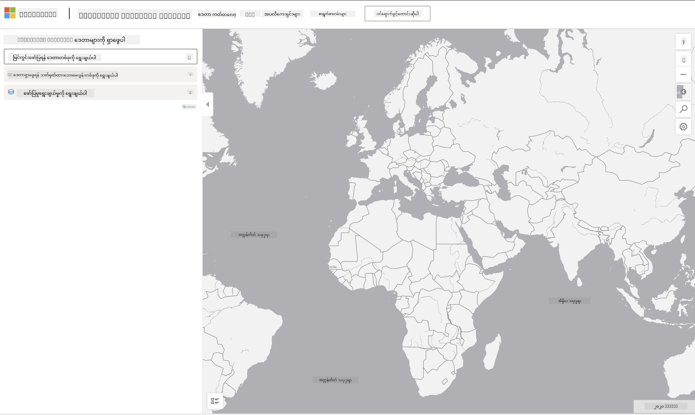

<!--
CO_OP_TRANSLATOR_METADATA:
{
  "original_hash": "d1e05715f9d97de6c4f1fb0c5a4702c0",
  "translation_date": "2025-08-30T19:57:19+00:00",
  "source_file": "6-Data-Science-In-Wild/20-Real-World-Examples/assignment.md",
  "language_code": "my"
}
-->
# အာကာသကွန်ပျူတာဒေတာအစုအဝေးကို စူးစမ်းပါ

## လမ်းညွှန်ချက်များ

ဒီသင်ခန်းစာမှာ ကျွန်တော်တို့က ဒေတာသိပ္ပံလျှောက်လွှာနယ်ပယ်အမျိုးမျိုးကို ဆွေးနွေးခဲ့ပြီး သုတေသန၊ တာရှည်တည်တံ့မှုနဲ့ ဒစ်ဂျစ်တယ် လူ့ကျင့်ဝတ်ဆိုင်ရာ ဥပမာတွေကို နက်ရှိုင်းစွာ လေ့လာခဲ့ပါတယ်။ ဒီအလုပ်မှာ သင်ဟာ ဒီဥပမာတွေထဲက တစ်ခုကို ပိုမိုအသေးစိတ် စူးစမ်းပြီး တာရှည်တည်တံ့မှုဆိုင်ရာ ဒေတာအပေါ် အမြင်တွေ ရရှိဖို့ ဒေတာအမြင်ပြမှုနဲ့ ခွဲခြမ်းစိတ်ဖြာမှုဆိုင်ရာ သင်ယူမှုတွေကို အသုံးချရပါမယ်။

[Planetary Computer](https://planetarycomputer.microsoft.com/) စီမံကိန်းမှာ အကောင့်နဲ့ ဝင်ရောက်နိုင်တဲ့ ဒေတာအစုအဝေးနဲ့ API တွေ ရှိပါတယ် - အလုပ်ဆောင်ချက်ရဲ့ အပိုအဆင့်ကို စမ်းသပ်ချင်ရင် အကောင့်တစ်ခုကို တောင်းဆိုပါ။ ဒီဆိုဒ်မှာလည်း အကောင့်မဖန်တီးဘဲ အသုံးပြုနိုင်တဲ့ [Explorer](https://planetarycomputer.microsoft.com/explore) လုပ်ဆောင်ချက်ကို ပံ့ပိုးပေးထားပါတယ်။

`အဆင့်များ:`
Explorer အင်တာဖေ့စ် (အောက်ပါ screenshot မှာ ပြထားတဲ့အတိုင်း) က သင့်ကို ဒေတာအစုအဝေးတစ်ခု (ပံ့ပိုးပေးထားတဲ့ ရွေးချယ်စရာတွေထဲက)၊ အကြိုတင်သတ်မှတ်ထားတဲ့ query (ဒေတာကို စစ်ထုတ်ဖို့) နဲ့ rendering ရွေးချယ်မှု (သက်ဆိုင်ရာ အမြင်ပြမှုတစ်ခု ဖန်တီးဖို့) ကို ရွေးချယ်ခွင့်ပေးပါတယ်။ ဒီအလုပ်မှာ သင့်တာဝန်ကတော့:

 1. [Explorer documentation](https://planetarycomputer.microsoft.com/docs/overview/explorer/) ကို ဖတ်ပါ - ရွေးချယ်စရာတွေကို နားလည်ပါ။
 2. [Catalog](https://planetarycomputer.microsoft.com/catalog) ဒေတာအစုအဝေးကို စူးစမ်းပါ - ဒါ့ရည်ရွယ်ချက်ကို လေ့လာပါ။
 3. Explorer ကို အသုံးပြုပါ - စိတ်ဝင်စားစရာ ဒေတာအစုအဝေးတစ်ခုကို ရွေးချယ်ပြီး သက်ဆိုင်ရာ query နဲ့ rendering ရွေးချယ်မှုကို ရွေးပါ။

`သင့်တာဝန်:`
Browser မှာ ပြသထားတဲ့ အမြင်ပြမှုကို လေ့လာပြီး အောက်ပါအတိုင်း ဖြေကြားပါ:
 * ဒေတာအစုအဝေးမှာ ဘယ်လို _features_ တွေ ပါဝင်လဲ?
 * အမြင်ပြမှုက ဘယ်လို _insights_ သို့မဟုတ် ရလဒ်တွေ ပေးသလဲ?
 * ဒီရလဒ်တွေက စီမံကိန်းရဲ့ တာရှည်တည်တံ့မှုရည်မှန်းချက်တွေနဲ့ ဘယ်လို _ဆက်စပ်မှု_ ရှိလဲ?
 * အမြင်ပြမှုရဲ့ _ကန့်သတ်ချက်_ တွေက ဘာတွေလဲ (ဥပမာ - ဘာအမြင်ကို မရနိုင်ခဲ့တာလဲ)?
 * raw data ကို ရနိုင်မယ်ဆိုရင် ဘယ်လို _အခြားအမြင်ပြမှု_ တွေ ဖန်တီးမလဲ၊ ဘာကြောင့်လဲ?

`အပိုအမှတ်များ:`
အကောင့်တစ်ခုအတွက် လျှောက်ထားပြီး - လက်ခံရရှိတဲ့အခါ login ဝင်ပါ။
 * _Launch Hub_ ရွေးချယ်မှုကို အသုံးပြုပြီး raw data ကို Notebook မှာ ဖွင့်ပါ။
 * ဒေတာကို အပြန်အလှန် စူးစမ်းပြီး သင့်စိတ်ကူးထားတဲ့ အခြားအမြင်ပြမှုတွေကို အကောင်အထည်ဖော်ပါ။
 * အခုတော့ သင့်ရဲ့ အထူးပြု အမြင်ပြမှုတွေကို ခွဲခြမ်းစိတ်ဖြာပါ - မူလမှာ မရနိုင်ခဲ့တဲ့ အမြင်တွေကို ရနိုင်ခဲ့လား?

## အကဲဖြတ်စံနှုန်း

ထူးချွန် | လုံလောက် | တိုးတက်မှုလိုအပ်
--- | --- | -- |
မူလမေးခွန်း ၅ ခုလုံးကို ဖြေကြားပြီး ဖြစ်ပါတယ်။ လက်ရှိအမြင်ပြမှုနဲ့ အခြားအမြင်ပြမှုတွေက တာရှည်တည်တံ့မှုရည်မှန်းချက်တွေ သို့မဟုတ် ရလဒ်တွေကို ဘယ်လိုပေးနိုင်မလဲဆိုတာကို ကျယ်ကျယ်ပြန့်ပြန့် ဖော်ပြနိုင်ပါတယ်။ | အထက်ပါ မေးခွန်း ၃ ခုကို အနည်းဆုံး အသေးစိတ် ဖြေကြားပြီး Explorer ကို လက်တွေ့အသုံးပြုခဲ့တာကို ပြသနိုင်ပါတယ်။ | မေးခွန်းအတော်များများကို ဖြေကြားမရနိုင်ဘဲ သို့မဟုတ် အသေးစိတ်မလုံလောက်ဘဲ ဖြေကြားထားပြီး စီမံကိန်းအတွက် အဓိကကြိုးစားမှု မရှိကြောင်း ပြသနေပါတယ်။ |

---

**ဝက်ဘ်ဆိုက်မှတ်ချက်**:  
ဤစာရွက်စာတမ်းကို AI ဘာသာပြန်ဝန်ဆောင်မှု [Co-op Translator](https://github.com/Azure/co-op-translator) ကို အသုံးပြု၍ ဘာသာပြန်ထားပါသည်။ ကျွန်ုပ်တို့သည် တိကျမှန်ကန်မှုအတွက် ကြိုးစားနေသော်လည်း၊ အလိုအလျောက်ဘာသာပြန်ခြင်းတွင် အမှားများ သို့မဟုတ် မမှန်ကန်မှုများ ပါဝင်နိုင်ကြောင်း သတိပြုပါ။ မူလဘာသာစကားဖြင့် ရေးသားထားသော စာရွက်စာတမ်းကို အာဏာတည်သော ရင်းမြစ်အဖြစ် သတ်မှတ်သင့်ပါသည်။ အရေးကြီးသော အချက်အလက်များအတွက် လူ့ဘာသာပြန်ပညာရှင်များကို အသုံးပြုရန် အကြံပြုပါသည်။ ဤဘာသာပြန်ကို အသုံးပြုခြင်းမှ ဖြစ်ပေါ်လာသော နားလည်မှုမှားများ သို့မဟုတ် အဓိပ္ပာယ်မှားများအတွက် ကျွန်ုပ်တို့သည် တာဝန်မယူပါ။