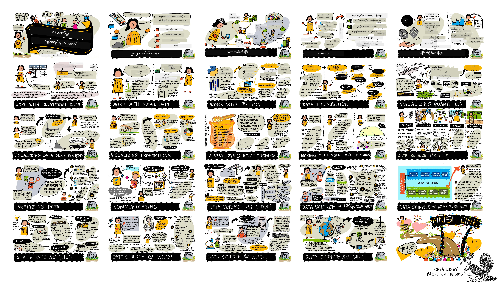

# အစ Beginner များအတွက် ဒေတာ သိပ္ပံ - သင်ရိုးအစီအစဉ်

[](https://github.com/codespaces/new?hide_repo_select=true&ref=main&repo=344191198)

[](https://github.com/microsoft/Data-Science-For-Beginners/blob/master/LICENSE)
[](https://GitHub.com/microsoft/Data-Science-For-Beginners/graphs/contributors/)
[](https://GitHub.com/microsoft/Data-Science-For-Beginners/issues/)
[](https://GitHub.com/microsoft/Data-Science-For-Beginners/pulls/)
[](http://makeapullrequest.com)

[](https://GitHub.com/microsoft/Data-Science-For-Beginners/watchers/)
[](https://GitHub.com/microsoft/Data-Science-For-Beginners/network/)
[](https://GitHub.com/microsoft/Data-Science-For-Beginners/stargazers/)


[](https://discord.gg/nTYy5BXMWG)

[](https://aka.ms/foundry/forum)

Microsoft ၏ Azure Cloud Advocates များသည် ဒေတာ သိပ္ပံအကြောင်း ၁၀ ပတ်၊ ၂၀ သင်ခန်းစာ သင်ရိုးအစီအစဉ်ကို စိတ်ဝင်စားဖွယ်အကြောင်းအရာကောင်းတစ်ခုအဖြစ် တင်ဆက်ပေးနေကြသည်။ သင်ခန်းစာတိုင်းတွင် သင်ခန်းစာမတိုင်မီနှင့် သင်ခန်းစာပြီးစီးသည့်နောက် ကွစ်ဇ်များ၊ သင်ခန်းစာပြုလုပ်ရန် အညွှန်းစာတမ်း၊ ဖြေရှင်းချက်နှင့် လေ့ကျင့်ခန်းများ ပါဝင်သည်။ ကျွန်ုပ်တို့၏ ပရောဂျက်အခြေပြု သင်ကြားပုံစံသည် စွမ်းရည်အသစ်များသို ့ ခိုင်မာစေရန် အတည်ပြုထားသည့် နည်းလမ်းဖြစ်ပြီး၊ သင်ယူခြင်းနှင့် တစ်ပြိုင်နက် တည်ဆောက်သင်ယူရာ ဖြစ်သည်။

**ကျေးဇူးစကားများကို ကျွန်ုပ်တို့၏ စာရေးသူများအား ပေးအပ်ပါသည်။** [Jasmine Greenaway](https://www.twitter.com/paladique), [Dmitry Soshnikov](http://soshnikov.com), [Nitya Narasimhan](https://twitter.com/nitya), [Jalen McGee](https://twitter.com/JalenMcG), [Jen Looper](https://twitter.com/jenlooper), [Maud Levy](https://twitter.com/maudstweets), [Tiffany Souterre](https://twitter.com/TiffanySouterre), [Christopher Harrison](https://www.twitter.com/geektrainer)။

**🙏 ကျေးဇူးအထူးတင်ရှိပါသည် 🙏 ကျွန်ုပ်တို့၏ [Microsoft Student Ambassador](https://studentambassadors.microsoft.com/) စာရေးသူများ၊ ပြန်လည်ဆန်းစစ်သူများနှင့် အကြောင်းအရာထည့်သွင်းသူများအား၊** အထူးသဖြင့် Aaryan Arora, [Aditya Garg](https://github.com/AdityaGarg00), [Alondra Sanchez](https://www.linkedin.com/in/alondra-sanchez-molina/), [Ankita Singh](https://www.linkedin.com/in/ankitasingh007), [Anupam Mishra](https://www.linkedin.com/in/anupam--mishra/), [Arpita Das](https://www.linkedin.com/in/arpitadas01/), ChhailBihari Dubey, [Dibri Nsofor](https://www.linkedin.com/in/dibrinsofor), [Dishita Bhasin](https://www.linkedin.com/in/dishita-bhasin-7065281bb), [Majd Safi](https://www.linkedin.com/in/majd-s/), [Max Blum](https://www.linkedin.com/in/max-blum-6036a1186/), [Miguel Correa](https://www.linkedin.com/in/miguelmque/), [Mohamma Iftekher (Iftu) Ebne Jalal](https://twitter.com/iftu119), [Nawrin Tabassum](https://www.linkedin.com/in/nawrin-tabassum), [Raymond Wangsa Putra](https://www.linkedin.com/in/raymond-wp/), [Rohit Yadav](https://www.linkedin.com/in/rty2423), Samridhi Sharma, [Sanya Sinha](https://www.linkedin.com/mwlite/in/sanya-sinha-13aab1200),
[Sheena Narula](https://www.linkedin.com/in/sheena-narua-n/), [Tauqeer Ahmad](https://www.linkedin.com/in/tauqeerahmad5201/), Yogendrasingh Pawar , [Vidushi Gupta](https://www.linkedin.com/in/vidushi-gupta07/), [Jasleen Sondhi](https://www.linkedin.com/in/jasleen-sondhi/)

||
|:---:|
| အစ Beginner များအတွက် ဒေတာ သိပ္ပံ - _Sketchnote ကို [@nitya](https://twitter.com/nitya) မှ ရေးဆွဲခဲ့သည်_ |

### 🌐 ဘာသာစကား မျိုးစုံ ထောက်ပံ့မှု

#### GitHub Action ဖြင့် ထောက်ပံ့သည် (အလိုအလျောက်နှင့် အမြဲပြင်ဆင်မှုများပါ)

<!-- CO-OP TRANSLATOR LANGUAGES TABLE START -->
[Arabic](../ar/README.md) | [Bengali](../bn/README.md) | [Bulgarian](../bg/README.md) | [Burmese (Myanmar)](./README.md) | [Chinese (Simplified)](../zh-CN/README.md) | [Chinese (Traditional, Hong Kong)](../zh-HK/README.md) | [Chinese (Traditional, Macau)](../zh-MO/README.md) | [Chinese (Traditional, Taiwan)](../zh-TW/README.md) | [Croatian](../hr/README.md) | [Czech](../cs/README.md) | [Danish](../da/README.md) | [Dutch](../nl/README.md) | [Estonian](../et/README.md) | [Finnish](../fi/README.md) | [French](../fr/README.md) | [German](../de/README.md) | [Greek](../el/README.md) | [Hebrew](../he/README.md) | [Hindi](../hi/README.md) | [Hungarian](../hu/README.md) | [Indonesian](../id/README.md) | [Italian](../it/README.md) | [Japanese](../ja/README.md) | [Kannada](../kn/README.md) | [Khmer](../km/README.md) | [Korean](../ko/README.md) | [Lithuanian](../lt/README.md) | [Malay](../ms/README.md) | [Malayalam](../ml/README.md) | [Marathi](../mr/README.md) | [Nepali](../ne/README.md) | [Nigerian Pidgin](../pcm/README.md) | [Norwegian](../no/README.md) | [Persian (Farsi)](../fa/README.md) | [Polish](../pl/README.md) | [Portuguese (Brazil)](../pt-BR/README.md) | [Portuguese (Portugal)](../pt-PT/README.md) | [Punjabi (Gurmukhi)](../pa/README.md) | [Romanian](../ro/README.md) | [Russian](../ru/README.md) | [Serbian (Cyrillic)](../sr/README.md) | [Slovak](../sk/README.md) | [Slovenian](../sl/README.md) | [Spanish](../es/README.md) | [Swahili](../sw/README.md) | [Swedish](../sv/README.md) | [Tagalog (Filipino)](../tl/README.md) | [Tamil](../ta/README.md) | [Telugu](../te/README.md) | [Thai](../th/README.md) | [Turkish](../tr/README.md) | [Ukrainian](../uk/README.md) | [Urdu](../ur/README.md) | [Vietnamese](../vi/README.md)

> **ဒေသခံအဖြစ် Clone လုပ်လိုပါသလား?**
>
> ဒီ repository တွင်ဘာသာစကား ၅၀ ကျော် ပါဝင်ပြီး ဒါကြောင့် ဒေါင်းလုပ်အရွယ်အစား တိုးပွားသွားသည်။ ဘာသာစကားများမပါအောင် Clone လုပ်ရန် sparse checkout ကိုအသုံးပြုပါ။
>
> **Bash / macOS / Linux:**
> ```bash
> git clone --filter=blob:none --sparse https://github.com/microsoft/Data-Science-For-Beginners.git
> cd Data-Science-For-Beginners
> git sparse-checkout set --no-cone '/*' '!translations' '!translated_images'
> ```
>
> **CMD (Windows):**
> ```cmd
> git clone --filter=blob:none --sparse https://github.com/microsoft/Data-Science-For-Beginners.git
> cd Data-Science-For-Beginners
> git sparse-checkout set --no-cone "/*" "!translations" "!translated_images"
> ```
>
> ဒီလိုလုပ်ရင် သင်သင်ကြားမှုအတွက်လိုအပ်သမျှ အရာအားလုံးကို ပိုမြန်ဆန်စွာ ဒေါင်းလုပ်ဆွဲနိုင်ပါသည်။
<!-- CO-OP TRANSLATOR LANGUAGES TABLE END -->

**မိဆက် ဘာသာစကား ထပ်မံလိုလားပါက [ဒီနေရာ](https://github.com/Azure/co-op-translator/blob/main/getting_started/supported-languages.md) တွင် စာရင်းပြုစုထားသည်။**

#### ကျွန်ုပ်တို့၏ အသိုင်းအဝိုင်းသို့ စည်းဝေးပါ
[](https://discord.gg/nTYy5BXMWG)

ကျွန်ုပ်တို့တွင် Discord မှာ AI နဲ့တကွ သင်ယူနိုင်မည့် စီးရီးတစ်ခု ရှိပြီး၊ ၂၀၂၅ခုနှစ် စက်တင်ဘာလ ၁၈ ရက်မှ ၃၀ ရက်အထိ [Learn with AI Series](https://aka.ms/learnwithai/discord) တွင် ပိုမိုသိရှိနိုင်ပြီး GitHub Copilot ကို ဒေတာ သိပ္ပံအတွက် ဘယ်လိုအသုံးချရမည်ဆိုတာ အကြံပြုချက်များ ထောက်ပံ့ပေးနေပါသည်။


# သင်သည် ကျောင်းသားဘူးလား?

အောက်ပါ အရင်းအမြစ်များနှင့် စတင်ပါ။

- [Student Hub စာမျက်နှာ](https://docs.microsoft.com/en-gb/learn/student-hub?WT.mc_id=academic-77958-bethanycheum) ဒီစာမျက်နှာအတွင်းမှာ မစစတိုင်း အရင်းအမြစ်များ၊ ကျောင်းသားပက်စ်များနဲ့ လည်း အခမဲ့ စာမိတ်တစ်ခု ရနိုင်တဲ့နည်းလမ်းတွေ ပါဝင်ပါတယ်။ တစ်ခါထဲ သိမ်းဆည်းထားပြီး အချိန်ပိုင်းတိုင်း ကြည့်ရှုဖို့ အသင့်ရှိသင့်တဲ့ စာမျက်နှာတစ်ခု ဖြစ်ပါတယ်။
- [Microsoft Learn Student Ambassadors](https://studentambassadors.microsoft.com?WT.mc_id=academic-77958-bethanycheum) ကျောင်းသား သံတမန်များ၏ ကမ္ဘာ့အသိုင်းအဝိုင်းတွင် ပါဝင်ရန်၊ မိုက်ခရိုဆော့ဖ်သို့ ဝင်ရောက်နိုင်မည့် နည်းလမ်း ဖြစ်နိုင်သည်။

# စတင်ခြင်း

## 📚 စာတမ်းစာတမ်းများ

- **[တပ်ဆင်ခြင်း လမ်းညွှန်](INSTALLATION.md)** - စတင်သူများအတွက် ခြေလှမ်းခြေလှမ်း ချမှတ်ချက်များ
- **[အသုံးပြုနည်း လမ်းညွှန်](USAGE.md)** - ဥပမာများနှင့် ပုံမှန် လုပ်ငန်းစဉ်များ
- **[ပြဿနာဖြေရှင်းမှု](TROUBLESHOOTING.md)** - ပုံမှန်ပြဿနာများ အတွက် ဖြေရှင်းချက်များ
- **[အဖွဲ့ဝင်ဖြစ်ရန် လမ်းညွှန်](CONTRIBUTING.md)** - ဒီပရောဂျက်ကို မည်သို့ ပံ့ပိုးထည့်သွင်းရမည်
- **[ဆရာများအတွက်](for-teachers.md)** - သင်ကြားမှု ညွှန်ကြားချက်နှင့် တန်းထဲ သုံးစွဲရန် အရင်းအမြစ်များ

## 👨‍🎓 ကျောင်းသားများအတွက်
> **စတင်လေ့လာသူများ**: ဒေတာ သိပ္ပံ အသစ်လား? ကျွန်ုပ်တို့၏ [စတင်လေ့လာသူများအတွက် ဥပမာများ](examples/README.md) နဲ့ စတင်ပါ! ဤလွယ်ကူပြီး သေချာဖော်ပြထားသော ဥပမာများက လုံးဝ အခြေခံများကို နားလည်စေပါလိမ့်မည်။
> **[ကျောင်းသားများ](https://aka.ms/student-page)**: ဒီသင်ရိုးအစီအစဉ်ကို ကိုယ်တိုင် သုံးစွဲရန် ရှိသည့် repo အားလုံးကို fork ဆွဲပြီး ကိုယ့်ကိုယ်ကို သရုပ်ပြခွင့်များပြီး ကြိုတင် ပညာသင်ယူမှုစစ်ဆေးမှု (pre-lecture quiz) ဖြေဆိုပါ။ နောက်တစ်ဆင့် သင်ခန်းစာကို ဖတ်ရှုပြီး ကျန်ရှိသော လေ့ကျင့်ခန်းများ ပြီးစီးပါ။ ဖြေရှင်းနည်းကော်ဒ်ကို မထပ်မံကူးယူဘဲ အကြောင်းအရာ အနက်နားလည်ပြီး ဆောင်ရွက် ကြည့်ပါ။ သို့သော် ဖြေရှင်းနည်းကော်ဒ်သည် တစ်ခုချင်းစီ ပရောဂျက်အခြေပြု သင်ခန်းစာများတွင် /solutions ဖိုလ်ဒါအတွင်း တွင် ရနိုင်ပါသည်။ နောက်ထပ် အကြံဉာဏ်တစ်ခုမှာ မိတ်ဆွေများနှင့် အတူ သင်တန်းအုပ်စုတစ်ခု ဖွဲ့၍ အတူတကွ သင်ယူသင်ကြားနိုင်သည်။ ပိုမိုလေ့လာလိုပါက [Microsoft Learn](https://docs.microsoft.com/en-us/users/jenlooper-2911/collections/qprpajyoy3x0g7?WT.mc_id=academic-77958-bethanycheum) ကို အကြံပြုပါသည်။

**အမြန် စတင်ခြင်း:**
1. သင့်ပတ်ဝန်းကျင် စတင်တပ်ဆင်ရန် [တပ်ဆင်ခြင်း လမ်းညွှန်](INSTALLATION.md) ကို ကြည့်ရှုပါ
2. သင်ရိုးအစီအစဉ်နှင့် ပတ်သက်၍ သိရှိရန် [အသုံးပြုနည်း လမ်းညွှန်](USAGE.md) ကို ပြန်လည်သုံးသပ်ပါ
3. သင်ခန်းစာ ၁ ကနေစတင်၍ အဆင့်လိုက်ဆောင်ရွက်ပါ
4. အကူအညီလိုလျှင် ကျွန်ုပ်တို့၏ [Discord အသိုင်းအဝိုင်း](https://aka.ms/ds4beginners/discord) မှာ ပါဝင်ပါ

## 👩‍🏫 ဆရာ/ဆရာမများအတွက်
> **ဆရာ/ဆရာမများ**: ကျွန်ုပ်တို့မှာ ဒီသင်ရိုးညွှန်းတမ်းကို ဘယ်လိုသုံးရမည်ဆိုသည့် [အကြံပြုချက်များ](for-teachers.md) ပါဝင်သည်။ ကျေးဇူးပြု၍ [ကျွန်ုပ်တို့ရဲ့ ဆွေးနွေးပွဲကဏ္ဍတွင်](https://github.com/microsoft/Data-Science-For-Beginners/discussions) သင့်အကြံပြုချက်များကို မျှဝေလိုပါသည်!

## အဖွဲ့ကို တွေ့ဆုံရအောင်

[](https://youtu.be/8mzavjQSMM4 "ကြော်ငြာဗီဒီယို")

**Gif ကို ဖန်တီးသော** [Mohit Jaisal](https://www.linkedin.com/in/mohitjaisal)

> 🎥 ပရိုဂျက်နှင့် ဖန်တီးသူများအကြောင်း ဗီဒီယိုအတွက် အပေါ်ဓါတ်ပုံကိုနှိပ်ပါ!

## သင်ကြားပုံ

ဒီသင်ရိုးညွှန်းတမ်းကို တည်ဆောက်ရာတွင် ကျွန်ုပ်တို့ ဘာသာသင်ကြားခြင်း၏ အခြေခံသော အချက်နှစ်ချက်ကို ရွေးချယ်ထားသည်- ပရိုဂျက်အခြေပြုထားပြီး မကြာခဏ စစ်ဆေးမေးခွန်းများ ပါဝင်ခြင်းဖြစ်သည်။ ဒီတန်းစီးရီးအဆုံးတွင် ကျောင်းသားများသည် ဒေတာသိပ္ပံ၏ အခြေခံအယူအဆများ၊ သစ္စာပေါ်မူတည်သော အကြောင်းအရာများ, ဒေတာပြင်ဆင်ခြင်း, ဒေတာနှင့်အလုပ်လုပ်နည်းမျိုးစုံ, ဒေတာမြင်ကွင်းဖော်ခြင်း, ဒေတာခွဲခြမ်းစိတ်ဖြာမှု, ဒေတာသိပ္ပံ၏ အမှန်တကယ်အသုံးချမှုများနှင့် အခြားများကို သင်ယူထားလိမ့်မည်။

ထို့အပြင် သင်တန်းမတက်မီ သက်သာသော စစ်ဆေးမေးခွန်းတစ်ခုက ကျောင်းသား၏ သင်ယူလိုသော အဓိက நோက်ချက်ကို သတ်မှတ်ပေးပြီး သင်တန်းပြီးနောက် မေးခွန်းတစ်ခုက စွဲမြဲမှုကို အာမခံပေးသည်။ ဒီသင်ရိုးညွှန်းတမ်းကို သဘောကျနိုင်သည့်နှစ်ချက်အတိုင်း ဖန်တီးထားပြီး အပိုင်းတစ်ခုတည်း သို့မဟုတ် အပိုင်းအချို့အားယူပြီး လေ့လာနိုင်သည်။ ပရိုဂျက်များသည် တစိတ်တပိုင်းလေးကနေ စတင်ကာ ၁၀ အပတ်သီစဉ်အဆုံးတွင် ပို၍ ခက်ခဲသည်။

> ကျွန်ုပ်တို့၏ [သွက်လက်မှုစည်းမျဉ်း](CODE_OF_CONDUCT.md), [အထောက်အပံ့ပေးခြင်း](CONTRIBUTING.md), [ဘာသာပြန်လမ်းညွှန်](TRANSLATIONS.md) များကို ရှာဖွေကြည့်ပါ။ သင့်၏တည်ဆောက်မှုအကြံပြုချက်များကို ကြိုဆိုပါသည်!

## တစ်ခုချင်းစီသင်ခန်းစာတွင် ပါဝင်သည်များ-

- ရွေးချယ်ရသော စကက်ချနုတ်
- ရွေးချယ်ရသော ပံ့ပိုးဗီဒီယို
- သင်ခန်းစာမတက်မီ အပူအဆွေး စစ်ဆေးမေးခွန်း
- ရေးသားထားသော သင်ခန်းစာ
- ပရိုဂျက်အခြေပြု သင်ခန်းစာများအတွက် ပရိုဂျက် တည်ဆောက်နည်း အဆင့်ဆင့် လမ်းညွှန်များ
- အတွေးသိမြင်စစ်ဆေးမှုများ
- စိန်ခေါ်မှုတစ်ခု
- ပံ့ပိုးစာဖတ်ခြင်း
- တာဝန်ပေးမှု
- [သင်ခန်းစာပြီးနောက် စစ်ဆေးမေးခွန်း](https://ff-quizzes.netlify.app/en/)

> **စစ်ဆေးမေးခွန်းများအကြောင်း မှတ်ချက်**: စစ်ဆေးမေးခွန်းအားလုံးကို Quiz-App ဖိုဒါအတွင်း ထည့်သွင်းထားပြီး တစ်ခုစီတွင် မေးခွန်းသုံးခုပါဝင်သော စုစုပေါင်း ၄၀ မေးခွန်းရှိသည်။ သင်ခန်းစာများတွင် လင့်ခ်ထားပေမယ့် စစ်ဆေးမေးခွန်းအက်ပ်ကို ဒေတာရှည်မရှိဘဲ ဒေသတွင်းသုံးနိုင်ပြီး သို့မဟုတ် Azure တွင် ထည့်သွင်းနိုင်သည်။ `quiz-app` ဖိုဒါအတွင်း လမ်းညွှန်ချက်များကို လိုက်နာပါ။ မေးခွန်းများကို တဖြည်းဖြည်း ဘာသာပြန်လျက်ရှိသည်။

## 🎓 စတင်လေ့လာသူ လွယ်ကူသော ဥပမာများ

**ဒေတာသိပ္ပံအသစ်ဖြစ်ပါသလား?** ကျွန်ုပ်တို့သည် လွယ်ကူ၍ ရှင်းလင်းစွာ မှတ်ချက်ထည့်ထားသော ကုဒ်ရှိသော အထူး [ဥပမာဖိုင်များ](examples/README.md) ကို ဖန်တီးထားသည်။

- 🌟 **ဟယ်လို ကမ္ဘာ** - သင့်ရဲ့ ပထမဆုံး ဒေတာသိပ္ပံပရိုဂရမ်
- 📂 **ဒေတာကို ဖတ်ခြင်း** - ဒေတာထုတ်ယူပြီး စူးစမ်းသုံးသပ်ခြင်းသင်ယူပါ
- 📊 **ရိုးရှင်းသော လေ့လာမှု** - စာရင်းအင်းများတွက်ချက်ပြီး ပုံစံများ ရှာဖွေပါ
- 📈 **အခြေခံ မြင်ကွင်းဖော်ခြင်း** - ဇယားများနှင့် ကွက်ဆွဲများ ဖန်တီးပါ
- 🔬 **အမှန်တကယ် ပရိုဂျက်** - စတင်မှ အပြီးထိ လုပ်ငန်းစဉ် ပြီးစီးခြင်း

ဥပမာအတိုင်း စိတ်ဖော်ရွေစေသည့် အဆင့်လိုက် မှတ်ချက်များပါဝင်ပြီး စတင်လေ့လာသူများအတွက် အထူးသင့်တော်သည်!

👉 **[ဥပမာများနှင့် စတင်ပါ](examples/README.md)** 👈

## သင်ခန်းစာများ


||
|:---:|
| Data Science For Beginners: Roadmap - _Sketchnote by [@nitya](https://twitter.com/nitya)_ |


| သင်ခန်းစာနံပါတ် | ခေါင်းစဉ် | သင်ခန်းစာ အုပ်စု | လေ့လာမှု ရည်မှန်းချက်များ | လင့်ခ်ထားသင်ခန်းစာ | ဖန်တီးသူ |
| :-----------: | :----------------------------------------: | :--------------------------------------------------: | :-----------------------------------------------------------------------------------------------------------------------------------------------------------------------: | :---------------------------------------------------------------------: | :----: |
| 01 | ဒေတာသိပ္ပံဖော်ပြချက် | [နိဒါန်း](1-Introduction/README.md) | ဒေတာသိပ္ပံ၏ အခြေခံအယူအဆများနှင့် ဘာသာရပ်တစ်ခုဖြစ်သော စက်ရည်မွန်းမှုနှင့် ကြီးမားသောဒေတာနှင့် ဆက်နွယ်ပုံကို သင်ယူပါ | [သင်ခန်းစာ](1-Introduction/01-defining-data-science/README.md) [ဗီဒီယို](https://youtu.be/beZ7Mb_oz9I) | [Dmitry](http://soshnikov.com) |
| 02 | ဒေတာသိပ္ပံသမားများ၏ သစ္စာကျင့်ခြင်း | [နိဒါန်း](1-Introduction/README.md) | ဒေတာသစ္စာကျင့်ခွင့် အယူအဆများ၊ စိန်ခေါ်မှုများနှင့် မူဝါဒများ | [သင်ခန်းစာ](1-Introduction/02-ethics/README.md) | [Nitya](https://twitter.com/nitya) |
| 03 | ဒေတာ သတ်မှတ်ချက် | [နိဒါန်း](1-Introduction/README.md) | ဒေတာကို မည်သို့ အမျိုးအစားခွဲ၍ ရပြီး ပုံမှန် ဒေတာရင်းမြစ်များ | [သင်ခန်းစာ](1-Introduction/03-defining-data/README.md) | [Jasmine](https://www.twitter.com/paladique) |
| 04 | စာရင်းအင်းနှင့် ဖြစ်နိုင်စေမှု အခြေခံမှတ်ချက် | [နိဒါန်း](1-Introduction/README.md) | ဒေတာကို နားလည်ရန် ဖြစ်နိုင်ခြေ သဖြင့် သင်တန်းနှင့် စာရင်းအင်း ကိရိယာများ | [သင်ခန်းစာ](1-Introduction/04-stats-and-probability/README.md) [ဗီဒီယို](https://youtu.be/Z5Zy85g4Yjw) | [Dmitry](http://soshnikov.com) |
| 05 | ဆက်စပ်ဒေတာဖြင့် လုပ်ကိုင်ခြင်း | [ဒေတာနှင့်အလုပ်လုပ်ခြင်း](2-Working-With-Data/README.md) | ဆက်စပ်ဒေတာကို သင်ယူခြင်းနှင့် Structured Query Language (SQL) ဖြင့် စူးစမ်းခွင့်အခြေခံ | [သင်ခန်းစာ](2-Working-With-Data/05-relational-databases/README.md) | [Christopher](https://www.twitter.com/geektrainer) | | |
| 06 | NoSQL ဒေတာဖြင့် လုပ်ကိုင်ခြင်း | [ဒေတာနှင့်အလုပ်လုပ်ခြင်း](2-Working-With-Data/README.md) | ဆက်စပ်မဟုတ်သော ဒေတာ အမျိုးအစားများနှင့် စာရွက်အချက်အလက်သိုလှောင်မှုကို စူးစမ်းခွင့်အခြေခံ | [သင်ခန်းစာ](2-Working-With-Data/06-non-relational/README.md) | [Jasmine](https://twitter.com/paladique)|
| 07 | Python ဖြင့် လုပ်ဆောင်ခြင်း | [ဒေတာနှင့်အလုပ်လုပ်ခြင်း](2-Working-With-Data/README.md) | Pandas စသည့်စာကြည့်တိုက်များဖြင့် ဒေတာစူးစမ်းရန် Python အသုံးပြုခြင်း အခြေခံ။ Python programming အခြေခံကို တခြားကောင်းမွန်ရန် အကြံပြုသည်| [သင်ခန်းစာ](2-Working-With-Data/07-python/README.md) [ဗီဒီယို](https://youtu.be/dZjWOGbsN4Y) | [Dmitry](http://soshnikov.com) |
| 08 | ဒေတာ ပြင်ဆင်ခြင်း | [ဒေတာနှင့်အလုပ်လုပ်ခြင်း](2-Working-With-Data/README.md) | ဒေတာ ပျောက်ဆုံးခြင်း, မှားယွင်းခြင်း သို့မဟုတ် မပြည့်စုံသော ဒေတာကို ထိန်းသိမ်း ကျင့်သုံးနည်းများ | [သင်ခန်းစာ](2-Working-With-Data/08-data-preparation/README.md) | [Jasmine](https://www.twitter.com/paladique) |
| 09 | ပမာဏများ မြင်ကွင်းဖော်ခြင်း | [ဒေတာမြင်ကွင်းဖော်ခြင်း](3-Data-Visualization/README.md) | Matplotlib ကိုအသုံးပြု၍ ငှက်ဒေတာ မြင်ကွင်းဖော်နည်း သင်ယူပါ 🦆 | [သင်ခန်းစာ](3-Data-Visualization/09-visualization-quantities/README.md) | [Jen](https://twitter.com/jenlooper) |
| 10 | ဒေတာ ဖန်တီးမှု ပြသခြင်း | [ဒေတာမြင်ကွင်းဖော်ခြင်း](3-Data-Visualization/README.md) | အကွာအဝေးအတွင်း မှတ်ချက်များနှင့် လုသောဒေသများ မြင်ကွင်းဖော်ခြင်း | [သင်ခန်းစာ](3-Data-Visualization/10-visualization-distributions/README.md) | [Jen](https://twitter.com/jenlooper) |
| 11 | အချိုးအစားများ မြင်ကွင်းဖော်ခြင်း | [ဒေတာမြင်ကွင်းဖော်ခြင်း](3-Data-Visualization/README.md) | ကွဲပြားခြားနားသည့် စုစုပေါင်းနှုန်းများ ဖော်ပြခြင်း | [သင်ခန်းစာ](3-Data-Visualization/11-visualization-proportions/README.md) | [Jen](https://twitter.com/jenlooper) |
| 12 | ဆက်နွယ်မှုများ မြင်ကွင်းဖော်ခြင်း | [ဒေတာမြင်ကွင်းဖော်ခြင်း](3-Data-Visualization/README.md) | ဒေတာအစုများ နှင့် ၎င်းတို့၏ အဝိသေသလက္ခဏာများကြား ဆက်နွယ်မှုများ မြင်ကွင်းဖော်ခြင်း | [သင်ခန်းစာ](3-Data-Visualization/12-visualization-relationships/README.md) | [Jen](https://twitter.com/jenlooper) |
| 13 | အဓိပ္ပါယ်ရှိသော မြင်ကွင်းဖော်ခြင်း | [ဒေတာမြင်ကွင်းဖော်ခြင်း](3-Data-Visualization/README.md) | သင်၏ မြင်ကွင်းဖော်သူများကို အကျိုးရှိစေရန် နည်းပညာများနှင့် လမ်းညွှန်ချက်များ | [သင်ခန်းစာ](3-Data-Visualization/13-meaningful-visualizations/README.md) | [Jen](https://twitter.com/jenlooper) |
| 14 | ဒေတာသိပ္ပံ အသက်တာဝက် စတင်မိတ်ဆက်ခြင်း | [အသက်တာဝက်](4-Data-Science-Lifecycle/README.md) | ဒေတာသိပ္ပံ အသက်တာဝက်နှင့် ဒေတာ ရယူခြင်းနှင့် ထုတ်ယူခြင်း အဆင့် အစ | [သင်ခန်းစာ](4-Data-Science-Lifecycle/14-Introduction/README.md) | [Jasmine](https://twitter.com/paladique) |
| 15 | ခွဲခြမ်းစိတ်ဖြာမှု | [အသက်တာဝက်](4-Data-Science-Lifecycle/README.md) | ဒေတာသိပ္ပံ အသက်တာဝက်၏ ဒီအဆင့်သည် ဒေတာ ခွဲခြမ်းစိတ်ဖြာနိုင်မှု နည်းဗျူဟာများအပေါ် အာရုံစိုက်သည် | [သင်ခန်းစာ](4-Data-Science-Lifecycle/15-analyzing/README.md) | [Jasmine](https://twitter.com/paladique) | | |
| 16 | ဆက်သွယ်မှု | [အသက်တာဝက်](4-Data-Science-Lifecycle/README.md) | ဒေတာသိပ္ပံ အသက်တာဝက်၏ ဒီအဆင့်မှာ ချဉ်းကပ်သူများ အသိအမြင်များကို ပိုမိုနားလည်ရန် ရည်ရွယ်ပြီး ချပြမှုများအပေါ် အာရုံစိုက်သည် | [သင်ခန်းစာ](4-Data-Science-Lifecycle/16-communication/README.md) | [Jalen](https://twitter.com/JalenMcG) | | |
| 17 | တိမ်မွှမ်းတွင် ဒေတာသိပ္ပံ | [တိမ်မွှမ်းဒေတာ](5-Data-Science-In-Cloud/README.md) | ဒီသင်ခန်းစာတွဲသည် တိမ်မွှမ်းတွင် ဒေတာသိပ္ပံနှင့် ၎င်း၏ အကျိုးကျေးဇူးများကို မိတ်ဆက်သည် | [သင်ခန်းစာ](5-Data-Science-In-Cloud/17-Introduction/README.md) | [Tiffany](https://twitter.com/TiffanySouterre) နှင့် [Maud](https://twitter.com/maudstweets) |
| 18 | တိမ်မွှမ်းတွင် ဒေတာသိပ္ပံ | [တိမ်မွှမ်းဒေတာ](5-Data-Science-In-Cloud/README.md) | Low Code ကိရိယာများဖြင့် မော်ဒယ်လေ့လာရေး |[သင်ခန်းစာ](5-Data-Science-In-Cloud/18-Low-Code/README.md) | [Tiffany](https://twitter.com/TiffanySouterre) နှင့် [Maud](https://twitter.com/maudstweets) |
| 19 | တိမ်မွှမ်းတွင် ဒေတာသိပ္ပံ | [တိမ်မွှမ်းဒေတာ](5-Data-Science-In-Cloud/README.md) | Azure Machine Learning Studio ဖြင့် မော်ဒယ်များ ထည့်သွင်းခြင်း | [သင်ခန်းစာ](5-Data-Science-In-Cloud/19-Azure/README.md)| [Tiffany](https://twitter.com/TiffanySouterre) နှင့် [Maud](https://twitter.com/maudstweets) |
| 20 | သဘာဝအရ ဒေတာသိပ္ပံ | [သဘာဝအရ](6-Data-Science-In-Wild/README.md) | အမှန်တကယ် ဒေတာသိပ္ပံများ တာဝန်ယူ ဆောင်ရွက် ထားသော ပရိုဂျက်များ | [သင်ခန်းစာ](6-Data-Science-In-Wild/20-Real-World-Examples/README.md) | [Nitya](https://twitter.com/nitya) |

## GitHub Codespaces

ဒီနမူနာကို Codespace မှာဖွင့်ရန် အောက်ပါအဆင့်များကို လိုက်နာပါ-
1. Code drop-down မီနူးကို နှိပ်ပြီး Open with Codespaces ရွေးချယ်ပါ။
2. ပန်နယ်၏ အောက်ဘက်တွင် + New codespace ကို ရွေးချယ်ပါ။
နောက်ထပ်သိရှိလိုပါက [GitHub မှာကျမ်းပုံ](https://docs.github.com/en/codespaces/developing-in-codespaces/creating-a-codespace-for-a-repository#creating-a-codespace) ရှိ ရှင်းလင်းချက်ကို ကြည့်ပါ။

## VSCode Remote - Containers
သင့် ကွန်ပျူတာတွင် VS Code Remote - Containers အထောက်အကူပြု ထပ်ဆင့်ကို သုံး၍ ဒီ repository ကို ကွန်တိန်နာတစ်ခုအဖြစ် ဖွင့်ရန် အောက်ပါအဆင့်များကိုလိုက်နာပါ-

1. သင့်ဝင်းဒိုးကို Docker စနစ်ဖြင့် အသုံးပြု၍ဖွင့်ခြင်း မပြုခင် [ဖွင့်ပုံနည်း](https://code.visualstudio.com/docs/devcontainers/containers#_getting-started) တွင် ဖော်ပြထားသည့် လိုအပ်ချက်များများ ပြည့်မှီခြင်းကို သေချာစေပါ။

ဒီ repository ကို သီးသန့် Docker volume တစ်ခုအတွင်း ဖွင့်ရန်-

**သတိပြုရန်**: ဘက်စုံ၊ အောက်က မျက်နှာပြင်သည် Remote-Containers: **Clone Repository in Container Volume...** ကုဒ်ကောင်ဒေါင်းလုပ်ကို သုံးသည်။ ဒါ့ဧကွာက Docker volume မှာသိုလှောင်၍ ဒေတာများ မပြောင်းလဲဘဲ သိမ်းဆည်းနိုင်ရန် စနစ်ဖြစ်သည်။ [Volumes](https://docs.docker.com/storage/volumes/) သည် container ဒေတာများကို သိမ်းဆည်းရာတွင် အကောင်းဆုံး ဖြစ်သည်။

သို့မဟုတ် ဒေါင်းလုပ်ဒါသည့် သိုလှောင်ထားသော repository ကို ဖွင့်သည်-

- ဒီ repository ကို သင့်သုံးစွဲဖိုင်စနစ်သို့ ယူဆောင်ပါ။
- F1 ကိုနှိပ်ပြီး **Remote-Containers: Open Folder in Container...** ကို ရွေးချယ်ပါ။
- ဒီဖိုဒါ၏ မိတ္တူကို ရွေးပြီး ကွန်တိန်နာတက္ကစတင်ရေး မျှော်လင့်အားတင်ပါ။
- စမ်းသပ်အသုံးပြုပါ။

## အွန်လိုင်းမရှိဘဲ အသုံးပြုခြင်း

ဒီစာတမ်းများကို အွန်လိုင်းမရှိလျှင် Docsify ကို သုံး၍ အသုံးပြုနိုင်သည်။ ရင်းမြစ်ကို fork ပြီး [Docsify](https://docsify.js.org/#/quickstart) ကို သင့်ကွန်ပျူတာတွင် ထည့်သွင်းပါ၊ ထို့နောက် ဒီ repository ရဲ့ အကြွပ်အတည်းအတွင်း `docsify serve` ဟု ရိုက်ထည့်ပါ။ ဝက်ဘ်ဆိုက်ကို သင့် localhost တွင် port 3000 နေရာတွင် ကြည့်ရှုနိုင်မည် ဖြစ်သည် - `localhost:3000`။

> မှတ်ချက်- notebook များကို Docsify ဖြင့် မဖော်ပြနိုင်သည့်ကြောင့် notebook ကို သီးခြား VS Code ထဲမှ Python kernel ဖြင့် လည်ပတ်ရန် လိုအပ်သည်။

## အခြား သင်ရိုးညွှန်းများ

ကျွန်ုပ်တို့အဖွဲ့သည် အခြား သင်ရိုးညွှန်းများကို တွန်းလှန် ထုတ်လုပ်သည်! ကြည့်ပါ-

<!-- CO-OP TRANSLATOR OTHER COURSES START -->
### LangChain
[](https://aka.ms/langchain4j-for-beginners)
[](https://aka.ms/langchainjs-for-beginners?WT.mc_id=m365-94501-dwahlin)
[](https://github.com/microsoft/langchain-for-beginners?WT.mc_id=m365-94501-dwahlin)
---

### Azure / Edge / MCP / Agents
[](https://github.com/microsoft/AZD-for-beginners?WT.mc_id=academic-105485-koreyst)
[](https://github.com/microsoft/edgeai-for-beginners?WT.mc_id=academic-105485-koreyst)
[](https://github.com/microsoft/mcp-for-beginners?WT.mc_id=academic-105485-koreyst)
[](https://github.com/microsoft/ai-agents-for-beginners?WT.mc_id=academic-105485-koreyst)

---
 
### Generative AI Series
[](https://github.com/microsoft/generative-ai-for-beginners?WT.mc_id=academic-105485-koreyst)
[-9333EA?style=for-the-badge&labelColor=E5E7EB&color=9333EA)](https://github.com/microsoft/Generative-AI-for-beginners-dotnet?WT.mc_id=academic-105485-koreyst)
[-C084FC?style=for-the-badge&labelColor=E5E7EB&color=C084FC)](https://github.com/microsoft/generative-ai-for-beginners-java?WT.mc_id=academic-105485-koreyst)
[-E879F9?style=for-the-badge&labelColor=E5E7EB&color=E879F9)](https://github.com/microsoft/generative-ai-with-javascript?WT.mc_id=academic-105485-koreyst)

---
 
### Core Learning
[](https://aka.ms/ml-beginners?WT.mc_id=academic-105485-koreyst)
[](https://aka.ms/datascience-beginners?WT.mc_id=academic-105485-koreyst)
[](https://aka.ms/ai-beginners?WT.mc_id=academic-105485-koreyst)
[](https://github.com/microsoft/Security-101?WT.mc_id=academic-96948-sayoung)
[](https://aka.ms/webdev-beginners?WT.mc_id=academic-105485-koreyst)
[](https://aka.ms/iot-beginners?WT.mc_id=academic-105485-koreyst)
[](https://github.com/microsoft/xr-development-for-beginners?WT.mc_id=academic-105485-koreyst)

---
 
### Copilot Series
[](https://aka.ms/GitHubCopilotAI?WT.mc_id=academic-105485-koreyst)
[](https://github.com/microsoft/mastering-github-copilot-for-dotnet-csharp-developers?WT.mc_id=academic-105485-koreyst)
[](https://github.com/microsoft/CopilotAdventures?WT.mc_id=academic-105485-koreyst)
<!-- CO-OP TRANSLATOR OTHER COURSES END -->

## Getting Help

**ပြဿနာများကြုံတွေ့နေပါသလား?** များသောပြဿနာများအတွက်ဖြေရှင်းနည်းများကို ကြည့်ရှုရန် [Troubleshooting Guide](TROUBLESHOOTING.md) သို့ဝင်ကြည့်ပါ။

AI app များဖန်တီးရာတွင် ကြုံတွေ့ရသောမှတ်ချက်များ သို့မဟုတ်မေးခွန်းများရှိပါက MCP နှင့်ပတ်သက်၍ နားလည်မြင်သာမှုရှိသည့် ကျွမ်းကျင်သူများနှင့် သင်ယူလေ့လာသူများထဲတွင် ဆွေးနွေးနိုင်ပါသည်။ ၎င်းသည် မေးခွန်းများကို လက်ခံပြီး အသိပညာကို လွတ်လပ်စွာမျှဝေသည့် ပံ့ပိုးကြားနယ်ဖြစ်ပါသည်။

[](https://discord.gg/nTYy5BXMWG)

ထုတ်ကုန်တုံ့ပြန်ချက် သို့မဟုတ် ဖန်တီးခြင်းအတွင်းအမှားများရှိပါက:

[](https://aka.ms/foundry/forum)

---

<!-- CO-OP TRANSLATOR DISCLAIMER START -->
**အတည်မပြုချက်**:  
ဤစာတမ်းကို AI ဘာသာပြန်မှုဝန်ဆောင်မှု [Co-op Translator](https://github.com/Azure/co-op-translator) ဖြင့် ဘာသာပြန်ထားပါသည်။ ကျွန်ုပ်တို့သည် တိကျမှန်ကန်မှုအတွက် ကြိုးပမ်းသောကြောင့်ဖြစ်ပေမယ့် အလိုအလျောက် ဘာသာပြန်ချက်များတွင် အမှားများ သို့မဟုတ် မှားယွင်းမှုများ ပါရှိနိုင်ခြင်းကို သတိပြုပါရန်အကြံပြုလိုက်ပါသည်။ မူလစာတမ်းကို မူလဘာသာဖြင့် အတည်ရှိသော စာရင်းအဖြစ် သတ်မှတ်ရန်လိုအပ်ပါသည်။ အရေးကြီးသောအချက်အလက်များအတွက် လူကြီးမင်းများ အဆင့်မြင့်လူသားဘာသာပြန်သူများဆီမှ ဘာသာပြန်ခြင်းကို အကြံပြုပါသည်။ ဤဘာသာပြန်ချက်ကို အသုံးပြုရာမှ ဖြစ်ပေါ်လာသော နားလည်မှုမှားယွင်းခြင်းများ သို့မဟုတ် အဓိပ္ပာယ် မတိကျမှုများအတွက် ကျွန်ုပ်တို့သည် တာဝန်မရှိပါ။
<!-- CO-OP TRANSLATOR DISCLAIMER END -->