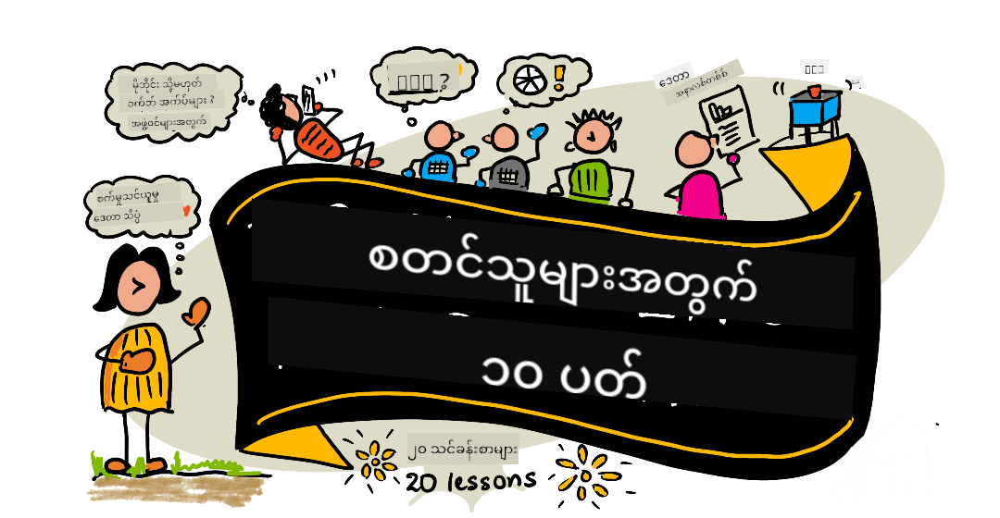

<!--
CO_OP_TRANSLATOR_METADATA:
{
  "original_hash": "f9a704f7494ca2d185ded59ba3da99ef",
  "translation_date": "2025-10-24T09:27:36+00:00",
  "source_file": "README.md",
  "language_code": "my"
}
-->
# အခြေခံအဆင့် ဒေတာသိပ္ပံ - သင်ခန်းစာအစီအစဉ်

Azure Cloud Advocates မှ Microsoft တွင် 10 ပတ်ကြာ 20 သင်ခန်းစာပါဝင်သော ဒေတာသိပ္ပံသင်ခန်းစာအစီအစဉ်ကို ပေးဆောင်ရန် ဝမ်းမြောက်ဝမ်းသာဖြစ်နေပါသည်။ သင်ခန်းစာတစ်ခုစီတွင် သင်ခန်းစာမတိုင်မီနှင့်ပြီးနောက် စမ်းမေးခွန်းများ၊ သင်ခန်းစာကို ပြီးမြောက်ရန် လိုအပ်သော လမ်းညွှန်စာများ၊ ဖြေရှင်းချက်နှင့် လုပ်ငန်းတာဝန်များ ပါဝင်သည်။ ကျွန်ုပ်တို့၏ ပရောဂျက်အခြေခံ သင်ကြားမှုနည်းလမ်းသည် သင်ကြားရင်း တည်ဆောက်နိုင်ရန် အခွင့်အရေးပေးပြီး၊ အသစ်သော ကျွမ်းကျင်မှုများကို သင်ယူရန် အကောင်းဆုံးနည်းလမ်းတစ်ခုဖြစ်သည်။

**ကျေးဇူးအထူးတင်ရှိပါသည်** [Jasmine Greenaway](https://www.twitter.com/paladique), [Dmitry Soshnikov](http://soshnikov.com), [Nitya Narasimhan](https://twitter.com/nitya), [Jalen McGee](https://twitter.com/JalenMcG), [Jen Looper](https://twitter.com/jenlooper), [Maud Levy](https://twitter.com/maudstweets), [Tiffany Souterre](https://twitter.com/TiffanySouterre), [Christopher Harrison](https://www.twitter.com/geektrainer) တို့အား။

**🙏 Microsoft Student Ambassador [Microsoft Student Ambassador](https://studentambassadors.microsoft.com/) များအား အထူးကျေးဇူးတင်ရှိပါသည် 🙏** အထူးသဖြင့် Aaryan Arora, [Aditya Garg](https://github.com/AdityaGarg00), [Alondra Sanchez](https://www.linkedin.com/in/alondra-sanchez-molina/), [Ankita Singh](https://www.linkedin.com/in/ankitasingh007), [Anupam Mishra](https://www.linkedin.com/in/anupam--mishra/), [Arpita Das](https://www.linkedin.com/in/arpitadas01/), ChhailBihari Dubey, [Dibri Nsofor](https://www.linkedin.com/in/dibrinsofor), [Dishita Bhasin](https://www.linkedin.com/in/dishita-bhasin-7065281bb), [Majd Safi](https://www.linkedin.com/in/majd-s/), [Max Blum](https://www.linkedin.com/in/max-blum-6036a1186/), [Miguel Correa](https://www.linkedin.com/in/miguelmque/), [Mohamma Iftekher (Iftu) Ebne Jalal](https://twitter.com/iftu119), [Nawrin Tabassum](https://www.linkedin.com/in/nawrin-tabassum), [Raymond Wangsa Putra](https://www.linkedin.com/in/raymond-wp/), [Rohit Yadav](https://www.linkedin.com/in/rty2423), Samridhi Sharma, [Sanya Sinha](https://www.linkedin.com/mwlite/in/sanya-sinha-13aab1200), [Sheena Narula](https://www.linkedin.com/in/sheena-narua-n/), [Tauqeer Ahmad](https://www.linkedin.com/in/tauqeerahmad5201/), Yogendrasingh Pawar, [Vidushi Gupta](https://www.linkedin.com/in/vidushi-gupta07/), [Jasleen Sondhi](https://www.linkedin.com/in/jasleen-sondhi/) တို့အား။

||
|:---:|
| အခြေခံအဆင့် ဒေတာသိပ္ပံ - _Sketchnote by [@nitya](https://twitter.com/nitya)_ |

### 🌐 ဘာသာစကားများအထောက်အပံ့

#### GitHub Action မှတဆင့် အလိုအလျောက် (အမြဲတမ်း နောက်ဆုံးပေါ်)

[Arabic](../ar/README.md) | [Bengali](../bn/README.md) | [Bulgarian](../bg/README.md) | [Burmese (Myanmar)](./README.md) | [Chinese (Simplified)](../zh/README.md) | [Chinese (Traditional, Hong Kong)](../hk/README.md) | [Chinese (Traditional, Macau)](../mo/README.md) | [Chinese (Traditional, Taiwan)](../tw/README.md) | [Croatian](../hr/README.md) | [Czech](../cs/README.md) | [Danish](../da/README.md) | [Dutch](../nl/README.md) | [Estonian](../et/README.md) | [Finnish](../fi/README.md) | [French](../fr/README.md) | [German](../de/README.md) | [Greek](../el/README.md) | [Hebrew](../he/README.md) | [Hindi](../hi/README.md) | [Hungarian](../hu/README.md) | [Indonesian](../id/README.md) | [Italian](../it/README.md) | [Japanese](../ja/README.md) | [Korean](../ko/README.md) | [Lithuanian](../lt/README.md) | [Malay](../ms/README.md) | [Marathi](../mr/README.md) | [Nepali](../ne/README.md) | [Norwegian](../no/README.md) | [Persian (Farsi)](../fa/README.md) | [Polish](../pl/README.md) | [Portuguese (Brazil)](../br/README.md) | [Portuguese (Portugal)](../pt/README.md) | [Punjabi (Gurmukhi)](../pa/README.md) | [Romanian](../ro/README.md) | [Russian](../ru/README.md) | [Serbian (Cyrillic)](../sr/README.md) | [Slovak](../sk/README.md) | [Slovenian](../sl/README.md) | [Spanish](../es/README.md) | [Swahili](../sw/README.md) | [Swedish](../sv/README.md) | [Tagalog (Filipino)](../tl/README.md) | [Tamil](../ta/README.md) | [Thai](../th/README.md) | [Turkish](../tr/README.md) | [Ukrainian](../uk/README.md) | [Urdu](../ur/README.md) | [Vietnamese](../vi/README.md)

**အခြားဘာသာစကားများကို ထည့်သွင်းလိုပါက [ဒီနေရာ](https://github.com/Azure/co-op-translator/blob/main/getting_started/supported-languages.md) တွင် ကြည့်ရှုနိုင်ပါသည်**

#### ကျွန်ုပ်တို့၏အသိုင်းအဝိုင်းနှင့် ပူးပေါင်းပါ

ကျွန်ုပ်တို့တွင် AI နှင့်အတူ သင်ယူရန် Discord စီးရီးရှိပြီး၊ 2025 ခုနှစ် စက်တင်ဘာလ 18 - 30 ရက်အတွင်း ပိုမိုလေ့လာပြီး [Learn with AI Series](https://aka.ms/learnwithai/discord) တွင် ပူးပေါင်းပါ။ GitHub Copilot ကို ဒေတာသိပ္ပံအတွက် အသုံးပြုရန် အကြံဉာဏ်များနှင့် နည်းလမ်းများကို ရရှိပါမည်။

# ကျောင်းသားများအတွက်

အောက်ပါ အရင်းအမြစ်များဖြင့် စတင်ပါ-

- [Student Hub page](https://docs.microsoft.com/en-gb/learn/student-hub?WT.mc_id=academic-77958-bethanycheum) ဒီစာမျက်နှာတွင် အခြေခံအရင်းအမြစ်များ၊ ကျောင်းသားအထုပ်များနှင့် အခမဲ့လက်မှတ်အထောက်အထားရရှိရန် နည်းလမ်းများကို ရှာဖွေပါမည်။ ဒီစာမျက်နှာကို Bookmark လုပ်ပြီး အကြောင်းအရာများကို လစဉ်အနည်းဆုံး ပြောင်းလဲသည့်အတွက် အချိန်ကြာကြာကြည့်ရှုပါ။
- [Microsoft Learn Student Ambassadors](https://studentambassadors.microsoft.com?WT.mc_id=academic-77958-bethanycheum) Microsoft သို့ ဝင်ရောက်ရန် အခွင့်အရေးဖြစ်နိုင်သော ကျောင်းသားအဆင့်ဆရာကြီးများ၏ ကမ္ဘာလုံးဆိုင်ရာအသိုင်းအဝိုင်းကို ပူးပေါင်းပါ။

# စတင်ခြင်း

## 📚 အထောက်အထားများ

- **[Installation Guide](INSTALLATION.md)** - အခြေခံအဆင့်များအတွက် အဆင့်ဆင့် Setup လမ်းညွှန်
- **[Usage Guide](USAGE.md)** - နမူနာများနှင့် ပုံမှန် Workflow များ
- **[Troubleshooting](TROUBLESHOOTING.md)** - ပုံမှန်ပြဿနာများအတွက် ဖြေရှင်းချက်များ
- **[Contributing Guide](CONTRIBUTING.md)** - ဒီပရောဂျက်ကို ပူးပေါင်းရန် နည်းလမ်းများ
- **[For Teachers](for-teachers.md)** - သင်ကြားမှု လမ်းညွှန်နှင့် သင်တန်းခန်းအရင်းအမြစ်များ

## 👨‍🎓 ကျောင်းသားများအတွက်
> **အခြေခံအဆင့်များ**: ဒေတာသိပ္ပံကို အသစ်စတင်သင်ယူနေပါသလား? ကျွန်ုပ်တို့၏ [အခြေခံအဆင့်နမူနာများ](examples/README.md) ဖြင့် စတင်ပါ! ဒီနမူနာများသည် ရိုးရှင်းပြီး မှတ်ချက်များပါဝင်သောကြောင့် အခြေခံများကို နားလည်ရန် ကူညီပါမည်။
> **[Students](https://aka.ms/student-page)**: ဒီသင်ခန်းစာအစီအစဉ်ကို ကိုယ်တိုင်အသုံးပြုရန်၊ repo အားလုံးကို fork လုပ်ပြီး သင်ခန်းစာများကို ကိုယ်တိုင်ပြီးမြောက်ပါ။ သင်ခန်းစာမတိုင်မီ စမ်းမေးခွန်းဖြေပြီး၊ သင်ခန်းစာကို ဖတ်ရှုပြီး အခြားလုပ်ငန်းများကို ပြီးမြောက်ပါ။ သင်ခန်းစာများကို နားလည်ပြီး ပရောဂျက်များကို ဖန်တီးရန် ကြိုးစားပါ။ သို့သော် ဖြေရှင်းချက်ကုဒ်ကို /solutions ဖိုလ်ဒါများတွင် ရှာနိုင်ပါသည်။ အခြားအကြံဉာဏ်တစ်ခုမှာ မိတ်ဆွေများနှင့် သင်ခန်းစာအတူတူကို လေ့လာရန် အဖွဲ့ဖွဲ့ပြီး အတူတူ သင်ယူပါ။ ထပ်မံလေ့လာရန် [Microsoft Learn](https://docs.microsoft.com/en-us/users/jenlooper-2911/collections/qprpajyoy3x0g7?WT.mc_id=academic-77958-bethanycheum) ကို အကြံပြုပါသည်။

**အမြန်စတင်ရန်:**
1. [Installation Guide](INSTALLATION.md) ကိုကြည့်ပြီး သင့်ပတ်ဝန်းကျင်ကို Setup လုပ်ပါ
2. [Usage Guide](USAGE.md) ကိုကြည့်ပြီး သင်ခန်းစာအစီအစဉ်ကို အသုံးပြုနည်းကို လေ့လာပါ
3. Lesson 1 မှ စတင်ပြီး အဆင့်လိုက်လုပ်ဆောင်ပါ
4. ကျွန်ုပ်တို့၏ [Discord community](https://aka.ms/ds4beginners/discord) တွင် ပံ့ပိုးမှုရယူပါ

## 👩‍🏫 ဆရာများအတွက်

> **ဆရာများ**: ကျွန်ုပ်တို့ [အကြံပြုချက်များ](for-teachers.md) ကို ထည့်သွင်းထားပြီး၊ ဒီသင်ခန်းစာအစီအစဉ်ကို အသုံးပြုနည်းကို ဖော်ပြထားပါသည်။ [Discussion forum](https://github.com/microsoft/Data-Science-For-Beginners/discussions) တွင် သင့်အကြံပြုချက်ကို ကျွန်ုပ်တို့နှင့် မျှဝေပါ။

## အဖွဲ့ကို တွေ့ဆုံပါ

**Gif by** [Mohit Jaisal](https://www.linkedin.com/in/mohitjaisal)

> 🎥 အထက်ပါပုံကို နှိပ်ပြီး ပရောဂျက်နှင့် ဖန်တီးသူများအကြောင်း ဗီဒီယိုကို ကြည့်ပါ!

## သင်ကြားမှုနည်းလမ်း
ကျောင်းသားများအတွက် ဒီသင်ရိုးညွှန်းတန်းကို တည်ဆောက်ရာတွင် ကျွန်ုပ်တို့နှစ်ခုသော ပညာရေးဆိုင်ရာအခြေခံသဘောတရားများကို ရွေးချယ်ခဲ့ပါသည်။ အဆိုပါသဘောတရားများမှာ ပရောဂျက်အခြေခံထားပြီး မကြာခဏမေးခွန်းများပါဝင်စေရန်ဖြစ်သည်။ ဒီစီးရီးအဆုံးတွင် ကျောင်းသားများသည် ဒေတာသိပ္ပံ၏ အခြေခံအယူအဆများကို သင်ယူနိုင်မည်ဖြစ်ပြီး၊ အကျင့်သိက္ခာဆိုင်ရာအယူအဆများ၊ ဒေတာပြင်ဆင်ခြင်း၊ ဒေတာနှင့်အလုပ်လုပ်နည်းများ၊ ဒေတာကိုမြင်သာအောင်ပြသခြင်း၊ ဒေတာခွဲခြမ်းစိတ်ဖြာခြင်း၊ ဒေတာသိပ္ပံ၏ အမှန်တကယ်အသုံးချမှုများနှင့် အခြားအရာများကိုလည်း သင်ယူနိုင်မည်ဖြစ်သည်။

ထို့အပြင်၊ သင်ခန်းစာမတိုင်မီ မေးခွန်းတစ်ခုကို အနည်းငယ်အရေးမကြီးသောပုံစံဖြင့် မေးခြင်းသည် ကျောင်းသား၏ အာရုံစိုက်မှုကို သင်ခန်းစာအကြောင်းသို့ ဦးတည်စေပြီး၊ သင်ခန်းစာပြီးဆုံးပြီးနောက် မေးခွန်းတစ်ခုကို ထပ်မံမေးခြင်းဖြင့် သင်ယူမှုကို ပိုမိုတည်မြဲစေသည်။ ဒီသင်ရိုးညွှန်းတန်းကို အလွယ်တကူနားလည်နိုင်ပြီး ပျော်ရွှင်စေရန်အတွက် ဒီဇိုင်းဆွဲထားပြီး၊ အစအဆုံး သို့မဟုတ် အစိတ်အပိုင်းတစ်ခုချင်းစီကို သင်ယူနိုင်ပါသည်။ ပရောဂျက်များသည် သေးငယ်သောအဆင့်မှ စတင်ပြီး ၁၀ ပတ်အတွင်း ပိုမိုရှုပ်ထွေးလာမည်ဖြစ်သည်။

> ကျွန်ုပ်တို့၏ [Code of Conduct](CODE_OF_CONDUCT.md), [Contributing](CONTRIBUTING.md), [Translation](TRANSLATIONS.md) လမ်းညွှန်ချက်များကို ရှာဖွေပါ။ သင့်အကြံပြုချက်များကို ကြိုဆိုပါသည်။

## သင်ခန်းစာတစ်ခုစီတွင် ပါဝင်သောအရာများ:

- ရွေးချယ်နိုင်သော sketchnote
- ရွေးချယ်နိုင်သော အပိုဗီဒီယို
- သင်ခန်းစာမတိုင်မီ အပူတက်မေးခွန်း
- ရေးသားထားသော သင်ခန်းစာ
- ပရောဂျက်အခြေခံသင်ခန်းစာများအတွက် ပရောဂျက်တည်ဆောက်နည်းအဆင့်ဆင့်လမ်းညွှန်ချက်များ
- အသိပညာစစ်ဆေးမှုများ
- စိန်ခေါ်မှု
- အပိုဖတ်ရှုရန်စာရွက်စာတမ်း
- အိမ်စာ
- [သင်ခန်းစာပြီးနောက် မေးခွန်း](https://ff-quizzes.netlify.app/en/)

> **မေးခွန်းများအကြောင်းမှတ်ချက်**: မေးခွန်းအားလုံးကို Quiz-App ဖိုလ်ဒါတွင် ထည့်သွင်းထားပြီး၊ မေးခွန်း ၃ ခုပါဝင်သော မေးခွန်း ၄၀ စုစုပေါင်းရှိသည်။ မေးခွန်းများကို သင်ခန်းစာများတွင် ချိတ်ဆွဲထားသော်လည်း၊ quiz app ကို ဒေသတွင်းတွင် အလုပ်လည်စေခြင်း သို့မဟုတ် Azure တွင် တင်နိုင်သည်။ `quiz-app` ဖိုလ်ဒါရှိ လမ်းညွှန်ချက်များကို လိုက်နာပါ။ မေးခွန်းများကို တဖြည်းဖြည်း ဒေသခံဘာသာစကားများသို့ ပြောင်းလဲနေပါသည်။

## 🎓 အခြေခံအဆင့်အတွက် ဥပမာများ

**ဒေတာသိပ္ပံကို အသစ်စတင်လေ့လာနေပါသလား?** ကျွန်ုပ်တို့သည် သင့်အား စတင်ရန်အတွက် အလွယ်တကူနားလည်နိုင်သော [examples directory](examples/README.md) ကို ဖန်တီးထားပြီး၊ ရှင်းလင်းသော မှတ်ချက်များပါဝင်သော ကုဒ်များကို ထည့်သွင်းထားပါသည်။

- 🌟 **Hello World** - သင့်ရဲ့ ပထမဆုံး ဒေတာသိပ္ပံအစီအစဉ်
- 📂 **Loading Data** - ဒေတာများကို ဖတ်ရှုခြင်းနှင့် စူးစမ်းလေ့လာခြင်း
- 📊 **Simple Analysis** - စာရင်းအင်းများတွက်ချက်ခြင်းနှင့် ပုံစံများရှာဖွေခြင်း
- 📈 **Basic Visualization** - ဇယားများနှင့် ပုံစံများဖန်တီးခြင်း
- 🔬 **Real-World Project** - အစအဆုံး လုပ်ငန်းစဉ်ကို ပြီးမြောက်စေခြင်း

ဥပမာတစ်ခုစီတွင် အဆင့်တိုင်းကို ရှင်းလင်းသော မှတ်ချက်များပါဝင်ပြီး၊ အခြေခံကျသောသူများအတွက် အထူးသင့်လျော်ပါသည်။

👉 **[ဥပမာများနှင့် စတင်ပါ](examples/README.md)** 👈

## သင်ခန်းစာများ

||
|:---:|
| ဒေတာသိပ္ပံအတွက် စတင်သူများ: လမ်းကြောင်းပြမြေပုံ - _Sketchnote by [@nitya](https://twitter.com/nitya)_ |

| သင်ခန်းစာနံပါတ် | ခေါင်းစဉ် | သင်ခန်းစာအုပ်စု | သင်ယူရမည့်ရည်ရွယ်ချက်များ | ချိတ်ဆွဲထားသော သင်ခန်းစာ | စာရေးသူ |
| :-----------: | :----------------------------------------: | :--------------------------------------------------: | :-----------------------------------------------------------------------------------------------------------------------------------------------------------------------: | :---------------------------------------------------------------------: | :----: |
| 01 | ဒေတာသိပ္ပံကို အဓိပ္ပါယ်ဖွင့်ဆိုခြင်း | [မိတ်ဆက်](1-Introduction/README.md) | ဒေတာသိပ္ပံ၏ အခြေခံအယူအဆများနှင့် ၎င်းသည် အတုအယောင်ထောက်ခံမှု၊ စက်ရုပ်သင်ယူမှုနှင့် Big Data နှင့် ဘယ်လိုဆက်စပ်နေသည်ကို သင်ယူပါ။ | [lesson](1-Introduction/01-defining-data-science/README.md) [video](https://youtu.be/beZ7Mb_oz9I) | [Dmitry](http://soshnikov.com) |
| 02 | ဒေတာသိပ္ပံ၏ အကျင့်သိက္ခာ | [မိတ်ဆက်](1-Introduction/README.md) | ဒေတာအကျင့်သိက္ခာဆိုင်ရာ အယူအဆများ၊ စိန်ခေါ်မှုများနှင့် အခြေခံစနစ်များ။ | [lesson](1-Introduction/02-ethics/README.md) | [Nitya](https://twitter.com/nitya) |
| 03 | ဒေတာကို အဓိပ္ပါယ်ဖွင့်ဆိုခြင်း | [မိတ်ဆက်](1-Introduction/README.md) | ဒေတာကို အမျိုးအစားခွဲခြားနည်းနှင့် ၎င်း၏ အများဆုံးရင်းမြစ်များ။ | [lesson](1-Introduction/03-defining-data/README.md) | [Jasmine](https://www.twitter.com/paladique) |
| 04 | စာရင်းအင်းနှင့် အလားအလာဆိုင်ရာ သင်္ချာအခြေခံ | [မိတ်ဆက်](1-Introduction/README.md) | ဒေတာကို နားလည်ရန်အတွက် အလားအလာနှင့် စာရင်းအင်းဆိုင်ရာ သင်္ချာနည်းလမ်းများ။ | [lesson](1-Introduction/04-stats-and-probability/README.md) [video](https://youtu.be/Z5Zy85g4Yjw) | [Dmitry](http://soshnikov.com) |
| 05 | ဆက်စပ်ဒေတာနှင့် အလုပ်လုပ်ခြင်း | [ဒေတာနှင့်အလုပ်လုပ်ခြင်း](2-Working-With-Data/README.md) | ဆက်စပ်ဒေတာနှင့် မိတ်ဆက်ခြင်းနှင့် SQL (see-quell) ဟုခေါ်သော Structured Query Language ဖြင့် ဆက်စပ်ဒေတာကို စူးစမ်းခြင်းနှင့် ခွဲခြမ်းစိတ်ဖြာခြင်း၏ အခြေခံများ။ | [lesson](2-Working-With-Data/05-relational-databases/README.md) | [Christopher](https://www.twitter.com/geektrainer) | | |
| 06 | NoSQL ဒေတာနှင့် အလုပ်လုပ်ခြင်း | [ဒေတာနှင့်အလုပ်လုပ်ခြင်း](2-Working-With-Data/README.md) | ဆက်စပ်မဟုတ်သော ဒေတာနှင့် ၎င်း၏ အမျိုးအစားများနှင့် စာရွက်စာတမ်းဒေတာဘေ့စ်များကို စူးစမ်းခြင်းနှင့် ခွဲခြမ်းစိတ်ဖြာခြင်း၏ အခြေခံများ။ | [lesson](2-Working-With-Data/06-non-relational/README.md) | [Jasmine](https://twitter.com/paladique)|
| 07 | Python နှင့် အလုပ်လုပ်ခြင်း | [ဒေတာနှင့်အလုပ်လုပ်ခြင်း](2-Working-With-Data/README.md) | Pandas ကဲ့သို့သော စာကြည့်တိုက်များနှင့် ဒေတာစူးစမ်းမှုအတွက် Python ကို အသုံးပြုခြင်း၏ အခြေခံများ။ Python programming အခြေခံနားလည်မှုကို အကြံပြုပါသည်။ | [lesson](2-Working-With-Data/07-python/README.md) [video](https://youtu.be/dZjWOGbsN4Y) | [Dmitry](http://soshnikov.com) |
| 08 | ဒေတာပြင်ဆင်ခြင်း | [ဒေတာနှင့်အလုပ်လုပ်ခြင်း](2-Working-With-Data/README.md) | ပျောက်ဆုံးနေသော၊ မမှန်ကန်သော သို့မဟုတ် မပြည့်စုံသော ဒေတာ၏ စိန်ခေါ်မှုများကို ကိုင်တွယ်ရန် ဒေတာကို သန့်စင်ခြင်းနှင့် ပြောင်းလဲခြင်းဆိုင်ရာ နည်းလမ်းများအကြောင်း။ | [lesson](2-Working-With-Data/08-data-preparation/README.md) | [Jasmine](https://www.twitter.com/paladique) |
| 09 | အရေအတွက်များကို မြင်သာအောင်ပြသခြင်း | [ဒေတာမြင်သာအောင်ပြသခြင်း](3-Data-Visualization/README.md) | 🦆ငှက်ဒေတာကို Matplotlib အသုံးပြု၍ မြင်သာအောင်ပြသနည်းကို သင်ယူပါ။ | [lesson](3-Data-Visualization/09-visualization-quantities/README.md) | [Jen](https://twitter.com/jenlooper) |
| 10 | ဒေတာဖြန့်ဝေမှုများကို မြင်သာအောင်ပြသခြင်း | [ဒေတာမြင်သာအောင်ပြသခြင်း](3-Data-Visualization/README.md) | အကွာအဝေးအတွင်းရှိ စောင့်ကြည့်မှုများနှင့် လမ်းကြောင်းများကို မြင်သာအောင်ပြသခြင်း။ | [lesson](3-Data-Visualization/10-visualization-distributions/README.md) | [Jen](https://twitter.com/jenlooper) |
| 11 | အချိုးအစားများကို မြင်သာအောင်ပြသခြင်း | [ဒေတာမြင်သာအောင်ပြသခြင်း](3-Data-Visualization/README.md) | သီးခြားနှင့် အုပ်စုဖွဲ့ထားသော ရာခိုင်နှုန်းများကို မြင်သာအောင်ပြသခြင်း။ | [lesson](3-Data-Visualization/11-visualization-proportions/README.md) | [Jen](https://twitter.com/jenlooper) |
| 12 | ဆက်နွယ်မှုများကို မြင်သာအောင်ပြသခြင်း | [ဒေတာမြင်သာအောင်ပြသခြင်း](3-Data-Visualization/README.md) | ဒေတာအစုအဖွဲ့များနှင့် ၎င်းတို့၏ အပြောင်းအလဲများအကြား ဆက်နွယ်မှုများနှင့် အချိုးအစားများကို မြင်သာအောင်ပြသခြင်း။ | [lesson](3-Data-Visualization/12-visualization-relationships/README.md) | [Jen](https://twitter.com/jenlooper) |
| 13 | အဓိပ္ပါယ်ရှိသော မြင်သာအောင်ပြသမှုများ | [ဒေတာမြင်သာအောင်ပြသခြင်း](3-Data-Visualization/README.md) | ပြဿနာများကို ထိရောက်စွာ ဖြေရှင်းရန်နှင့် အမြင်များရရန် သင့်မြင်သာအောင်ပြသမှုများကို တန်ဖိုးရှိစေရန် နည်းလမ်းများနှင့် လမ်းညွှန်ချက်များ။ | [lesson](3-Data-Visualization/13-meaningful-visualizations/README.md) | [Jen](https://twitter.com/jenlooper) |
| 14 | ဒေတာသိပ္ပံ၏ အသက်တာလည်ပတ်မှုကို မိတ်ဆက်ခြင်း | [အသက်တာလည်ပတ်မှု](4-Data-Science-Lifecycle/README.md) | ဒေတာသိပ္ပံ၏ အသက်တာလည်ပတ်မှုနှင့် ဒေတာကို ရယူခြင်းနှင့် ထုတ်ယူခြင်း၏ ပထမအဆင့်ကို မိတ်ဆက်ခြင်း။ | [lesson](4-Data-Science-Lifecycle/14-Introduction/README.md) | [Jasmine](https://twitter.com/paladique) |
| 15 | ခွဲခြမ်းစိတ်ဖြာခြင်း | [အသက်တာလည်ပတ်မှု](4-Data-Science-Lifecycle/README.md) | ဒေတာသိပ္ပံ၏ အသက်တာလည်ပတ်မှု၏ ဒီအဆင့်သည် ဒေတာကို ခွဲခြမ်းစိတ်ဖြာရန် နည်းလမ်းများကို အာရုံစိုက်ထားသည်။ | [lesson](4-Data-Science-Lifecycle/15-analyzing/README.md) | [Jasmine](https://twitter.com/paladique) | | |
| 16 | ဆက်သွယ်မှု | [အသက်တာလည်ပတ်မှု](4-Data-Science-Lifecycle/README.md) | ဒေတာမှ အမြင်များကို ဆုံးဖြတ်သူများအတွက် နားလည်ရလွယ်ကူစေရန် တင်ပြခြင်းကို အာရုံစိုက်ထားသော ဒေတာသိပ္ပံ၏ အသက်တာလည်ပတ်မှု၏ ဒီအဆင့်။ | [lesson](4-Data-Science-Lifecycle/16-communication/README.md) | [Jalen](https://twitter.com/JalenMcG) | | |
| 17 | Cloud တွင် ဒေတာသိပ္ပံ | [Cloud Data](5-Data-Science-In-Cloud/README.md) | Cloud တွင် ဒေတာသိပ္ပံနှင့် ၎င်း၏ အကျိုးကျေးဇူးများကို မိတ်ဆက်သော သင်ခန်းစာများစီးရီး။ | [lesson](5-Data-Science-In-Cloud/17-Introduction/README.md) | [Tiffany](https://twitter.com/TiffanySouterre) နှင့် [Maud](https://twitter.com/maudstweets) |
| 18 | Cloud တွင် ဒေတာသိပ္ပံ | [Cloud Data](5-Data-Science-In-Cloud/README.md) | Low Code tools အသုံးပြု၍ မော်ဒယ်များကို လေ့ကျင့်ခြင်း။ |[lesson](5-Data-Science-In-Cloud/18-Low-Code/README.md) | [Tiffany](https://twitter.com/TiffanySouterre) နှင့် [Maud](https://twitter.com/maudstweets) |
| 19 | Cloud တွင် ဒေတာသိပ္ပံ | [Cloud Data](5-Data-Science-In-Cloud/README.md) | Azure Machine Learning Studio ဖြင့် မော်ဒယ်များကို တင်ဆောင်ခြင်း။ | [lesson](5-Data-Science-In-Cloud/19-Azure/README.md)| [Tiffany](https://twitter.com/TiffanySouterre) နှင့် [Maud](https://twitter.com/maudstweets) |
| 20 | သဘာဝပတ်ဝန်းကျင်တွင် ဒေတာသိပ္ပံ | [In the Wild](6-Data-Science-In-Wild/README.md) | အမှန်တကယ်သော ကမ္ဘာတွင် ဒေတာသိပ္ပံအခြေခံထားသော ပရောဂျက်များ။ | [lesson](6-Data-Science-In-Wild/20-Real-World-Examples/README.md) | [Nitya](https://twitter.com/nitya) |

## GitHub Codespaces

ဒီနမူနာကို Codespace တွင် ဖွင့်ရန် အောက်ပါအဆင့်များကို လိုက်နာပါ:
1. Code drop-down menu ကိုနှိပ်ပြီး Open with Codespaces ရွေးချယ်ပါ။
2. Pane အောက်ဆုံးတွင် + New codespace ကို ရွေးချယ်ပါ။
ပိုမိုသိရှိရန် [GitHub documentation](https://docs.github.com/en/codespaces/developing-in-codespaces/creating-a-codespace-for-a-repository#creating-a-codespace) ကို ကြည့်ပါ
  

---

### Generative AI Series  
  
[-9333EA?style=for-the-badge&labelColor=E5E7EB&color=9333EA)](https://github.com/microsoft/Generative-AI-for-beginners-dotnet?WT.mc_id=academic-105485-koreyst)  
[-C084FC?style=for-the-badge&labelColor=E5E7EB&color=C084FC)](https://github.com/microsoft/generative-ai-for-beginners-java?WT.mc_id=academic-105485-koreyst)  
[-E879F9?style=for-the-badge&labelColor=E5E7EB&color=E879F9)](https://github.com/microsoft/generative-ai-with-javascript?WT.mc_id=academic-105485-koreyst)

---

### Core Learning  
  
  
  
  
  
  

---

### Copilot Series  
  
  
  
<!-- CO-OP TRANSLATOR OTHER COURSES END -->

## အကူအညီရယူခြင်း  

**ပြဿနာတွေ့ရှိပါသလား?** [Troubleshooting Guide](TROUBLESHOOTING.md) ကိုကြည့်ပြီး ပုံမှန်ပြဿနာများအတွက် ဖြေရှင်းနည်းများကို ရှာဖွေပါ။

AI အက်ပ်များ တည်ဆောက်ရာတွင် အခက်အခဲရှိပါက သို့မဟုတ် မေးခွန်းများရှိပါက အောက်ပါအဖွဲ့ဝင်များနှင့် ဆွေးနွေးပါ:

ထုတ်ကုန်အကြံပြုချက်များ သို့မဟုတ် တည်ဆောက်ရာတွင် အမှားများရှိပါက အောက်ပါနေရာသို့ သွားပါ:

---

**အကြောင်းကြားချက်**:  
ဤစာရွက်စာတမ်းကို AI ဘာသာပြန်ဝန်ဆောင်မှု [Co-op Translator](https://github.com/Azure/co-op-translator) ကို အသုံးပြု၍ ဘာသာပြန်ထားပါသည်။ ကျွန်ုပ်တို့သည် တိကျမှုအတွက် ကြိုးစားနေသော်လည်း အလိုအလျောက် ဘာသာပြန်မှုများတွင် အမှားများ သို့မဟုတ် မမှန်ကန်မှုများ ပါဝင်နိုင်သည်ကို သတိပြုပါ။ မူရင်းဘာသာစကားဖြင့် ရေးသားထားသော စာရွက်စာတမ်းကို အာဏာတရ အရင်းအမြစ်အဖြစ် သတ်မှတ်သင့်ပါသည်။ အရေးကြီးသော အချက်အလက်များအတွက် လူက ဘာသာပြန်မှုကို အကြံပြုပါသည်။ ဤဘာသာပြန်မှုကို အသုံးပြုခြင်းမှ ဖြစ်ပေါ်လာသော အလွဲအမှားများ သို့မဟုတ် အနားလွဲမှုများအတွက် ကျွန်ုပ်တို့သည် တာဝန်မယူပါ။