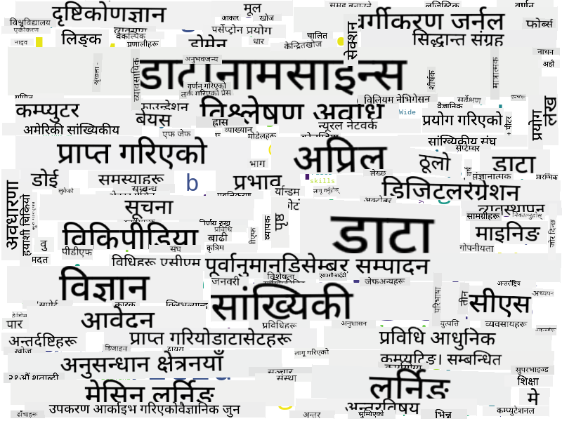

<!--
CO_OP_TRANSLATOR_METADATA:
{
  "original_hash": "2583a9894af7123b2fcae3376b14c035",
  "translation_date": "2025-08-27T17:14:14+00:00",
  "source_file": "1-Introduction/01-defining-data-science/README.md",
  "language_code": "ne"
}
-->
## डेटा प्रकारहरू

जसरी हामीले पहिले नै उल्लेख गरिसकेका छौं, डेटा हरेक ठाउँमा छ। हामीले यसलाई सही तरिकाले समात्न मात्र आवश्यक छ! **संरचित** र **असंरचित** डेटा बीच भिन्नता गर्न उपयोगी हुन्छ। संरचित डेटा प्रायः राम्रो संरचित रूपमा प्रस्तुत गरिन्छ, प्रायः टेबल वा धेरै टेबलहरूको रूपमा, जबकि असंरचित डेटा फाइलहरूको संग्रह मात्र हो। कहिलेकाहीं हामी **अर्ध-संरचित** डेटा पनि कुरा गर्न सक्छौं, जसमा केही प्रकारको संरचना हुन्छ तर यो धेरै फरक हुन सक्छ।

| संरचित                                                                   | अर्ध-संरचित                                                                                  | असंरचित                            |
| ------------------------------------------------------------------------ | -------------------------------------------------------------------------------------------- | ----------------------------------- |
| व्यक्तिहरूको सूची र उनीहरूको फोन नम्बर                                    | विकिपीडिया पृष्ठहरू लिंकहरूसहित                                                               | इनसाइक्लोपेडिया ब्रिटानिकाको पाठ  |
| पछिल्लो २० वर्षको प्रत्येक मिनेटमा भवनका सबै कोठाहरूको तापक्रम            | JSON ढाँचामा वैज्ञानिक कागजातहरूको संग्रह, लेखकहरू, प्रकाशन मिति, र सारांशसहित                 | निगरानी क्यामेराबाट कच्चा भिडियो फिड |
| भवनमा प्रवेश गर्ने सबै व्यक्तिहरूको उमेर र लिङ्गको डेटा                   | इन्टरनेट पृष्ठहरू                                                                              | कर्पोरेट दस्तावेजहरूको फाइल शेयर   |

## डेटा कहाँबाट प्राप्त गर्ने

डेटा प्राप्त गर्नका लागि धेरै सम्भावित स्रोतहरू छन्, र तिनीहरू सबै सूचीबद्ध गर्न असम्भव हुनेछ! तर, केही सामान्य स्थानहरू उल्लेख गरौं जहाँबाट तपाईं डेटा प्राप्त गर्न सक्नुहुन्छ:

* **संरचित**
  - **इन्टरनेट अफ थिङ्स** (IoT), जस्तै तापक्रम वा दबाब सेन्सरहरूबाट प्राप्त डेटा। उदाहरणका लागि, यदि कार्यालय भवन IoT सेन्सरहरूले सुसज्जित छ भने, हामी स्वचालित रूपमा तापक्रम र प्रकाश नियन्त्रण गर्न सक्दछौं ताकि लागत कम गर्न सकियोस्।
  - **सर्वेक्षणहरू**, जुन हामी प्रयोगकर्ताहरूलाई खरिद पछि वा वेबसाइट भ्रमण पछि पूरा गर्न अनुरोध गर्छौं।
  - **व्यवहारको विश्लेषण**, जसले उदाहरणका लागि, प्रयोगकर्ताले साइटमा कति गहिरो जान्छ र साइट छोड्ने सामान्य कारण के हो भन्ने कुरा बुझ्न मद्दत गर्न सक्छ।
* **असंरचित**
  - **पाठहरू**, जस्तै समग्र **भावनात्मक स्कोर** वा मुख्य शब्दहरू र अर्थ निकाल्नका लागि।
  - **छविहरू** वा **भिडियो**। निगरानी क्यामेराको भिडियोले सडकमा ट्राफिकको अनुमान गर्न र सम्भावित ट्राफिक जामको बारेमा जानकारी दिन प्रयोग गर्न सकिन्छ।
  - वेब सर्भर **लगहरू**, जसले हाम्रो साइटका कुन पृष्ठहरू सबैभन्दा धेरै भ्रमण गरिन्छ र कति समयसम्मका लागि भनेर बुझ्न मद्दत गर्न सक्छ।
* **अर्ध-संरचित**
  - **सामाजिक नेटवर्क** ग्राफहरू, जसले प्रयोगकर्ताको व्यक्तित्व र जानकारी फैलाउनको सम्भावित प्रभावकारिताको बारेमा डेटा प्रदान गर्न सक्छ।
  - पार्टीबाट प्राप्त फोटोहरूको संग्रह हुँदा, हामी **समूह गतिशीलता** डेटा निकाल्न सक्दछौं, जस्तै एकअर्कासँग फोटो खिच्ने व्यक्तिहरूको ग्राफ निर्माण गरेर।

विभिन्न सम्भावित डेटा स्रोतहरू जान्दा, तपाईं विभिन्न परिदृश्यहरूको बारेमा सोच्न सक्नुहुन्छ जहाँ डेटा विज्ञान प्रविधिहरू प्रयोग गरेर स्थिति राम्रोसँग बुझ्न र व्यापार प्रक्रियाहरू सुधार गर्न सकिन्छ।

## डेटा संग के गर्न सकिन्छ

डेटा विज्ञानमा, हामी डेटा यात्रा निम्न चरणहरूमा केन्द्रित गर्छौं:

## डिजिटलाइजेशन र डिजिटल रूपान्तरण

पछिल्लो दशकमा, धेरै व्यवसायहरूले व्यापार निर्णयहरू गर्दा डेटा महत्त्वपूर्ण हुने कुरा बुझ्न थालेका छन्। व्यापार सञ्चालनमा डेटा विज्ञानका सिद्धान्तहरू लागू गर्न, पहिलो चरणमा केही डेटा सङ्कलन गर्न आवश्यक छ, अर्थात् व्यापार प्रक्रियाहरूलाई डिजिटल रूपमा अनुवाद गर्नु। यसलाई **डिजिटलाइजेशन** भनिन्छ। यस डेटा विज्ञान प्रविधिहरूलाई निर्णयहरू मार्गदर्शन गर्न लागू गर्दा उत्पादकत्वमा उल्लेखनीय वृद्धि (वा व्यापारको नयाँ दिशा) हुन सक्छ, जसलाई **डिजिटल रूपान्तरण** भनिन्छ।

उदाहरणको रूपमा विचार गरौं। मानौं हामीसँग एक डेटा विज्ञान पाठ्यक्रम छ (जस्तै यो पाठ्यक्रम) जुन हामी विद्यार्थीहरूलाई अनलाइन प्रदान गर्छौं, र हामी यसलाई सुधार गर्न डेटा विज्ञान प्रयोग गर्न चाहन्छौं। हामी यसलाई कसरी गर्न सक्छौं?

हामी "के डिजिटलाइज गर्न सकिन्छ?" भनेर सोध्न सुरु गर्न सक्छौं। सबैभन्दा सरल तरिका भनेको प्रत्येक विद्यार्थीलाई प्रत्येक मोड्युल पूरा गर्न लाग्ने समय मापन गर्नु र प्रत्येक मोड्युलको अन्त्यमा बहुविकल्पीय परीक्षण दिएर प्राप्त ज्ञान मापन गर्नु हो। सबै विद्यार्थीहरूमा औसत समय-समाप्ति गणना गरेर, हामी पत्ता लगाउन सक्छौं कि कुन मोड्युलहरूले विद्यार्थीहरूलाई सबैभन्दा धेरै कठिनाइ दिन्छ, र तिनीहरूलाई सरल बनाउन काम गर्न सक्छौं।
तपाईंले तर्क गर्न सक्नुहुन्छ कि यो दृष्टिकोण आदर्श होइन, किनकि मोड्युलहरू विभिन्न लम्बाइका हुन सक्छन्। सम्भवतः समयलाई मोड्युलको लम्बाइ (अक्षरहरूको संख्या) द्वारा विभाजन गरेर ती मानहरू तुलना गर्नु अधिक न्यायसंगत हुनेछ।
जब हामी बहुविकल्पीय परीक्षाको नतिजा विश्लेषण गर्न सुरु गर्छौं, हामी विद्यार्थीहरूले कुन अवधारणाहरू बुझ्न कठिनाइ महसुस गर्छन् भनेर पत्ता लगाउन सक्छौं, र त्यस जानकारीलाई सामग्री सुधार गर्न प्रयोग गर्न सक्छौं। त्यसका लागि, हामीले परीक्षालाई यसरी डिजाइन गर्नुपर्छ कि प्रत्येक प्रश्नले निश्चित अवधारणा वा ज्ञानको टुक्रासँग सम्बन्धित होस्।

यदि हामी अझ जटिल हुन चाहन्छौं भने, हामी प्रत्येक मोड्युलमा लागेको समयलाई विद्यार्थीहरूको उमेर समूहसँग तुलना गर्न सक्छौं। हामीले पत्ता लगाउन सक्छौं कि केही उमेर समूहका लागि मोड्युल पूरा गर्न अत्यधिक समय लाग्छ, वा विद्यार्थीहरूले मोड्युल पूरा गर्नु अघि नै छोड्छन्। यसले हामीलाई मोड्युलका लागि उमेर सिफारिसहरू प्रदान गर्न मद्दत गर्न सक्छ, र गलत अपेक्षाबाट हुने असन्तुष्टि कम गर्न सक्छ।

## 🚀 चुनौती

यस चुनौतीमा, हामी डेटा साइन्सको क्षेत्रसँग सम्बन्धित अवधारणाहरू पत्ता लगाउने प्रयास गर्नेछौं। हामी डेटा साइन्सको विषयमा रहेको विकिपिडिया लेख लिनेछौं, पाठ डाउनलोड र प्रक्रिया गर्नेछौं, र त्यसपछि यस्तो वर्ड क्लाउड बनाउनेछौं:

कोड पढ्नका लागि [`notebook.ipynb`](../../../../../../../../../1-Introduction/01-defining-data-science/notebook.ipynb ':ignore') मा जानुहोस्। तपाईं कोड चलाउन सक्नुहुन्छ, र वास्तविक समयमा सबै डेटा रूपान्तरणहरू कसरी काम गर्छन् हेर्न सक्नुहुन्छ।

> यदि तपाईंलाई Jupyter Notebook मा कोड कसरी चलाउने थाहा छैन भने, [यो लेख](https://soshnikov.com/education/how-to-execute-notebooks-from-github/) हेर्नुहोस्।

## [पाठपछिको क्विज](https://purple-hill-04aebfb03.1.azurestaticapps.net/quiz/1)

## असाइनमेन्टहरू

* **कार्य १**: माथिको कोडलाई परिमार्जन गरेर **Big Data** र **Machine Learning** क्षेत्रका सम्बन्धित अवधारणाहरू पत्ता लगाउनुहोस्।
* **कार्य २**: [डेटा साइन्स परिदृश्यहरूबारे सोच्नुहोस्](assignment.md)

## श्रेय

यो पाठ [Dmitry Soshnikov](http://soshnikov.com) द्वारा ♥️ सहित लेखिएको हो।

---

**अस्वीकरण**:  
यो दस्तावेज़ AI अनुवाद सेवा [Co-op Translator](https://github.com/Azure/co-op-translator) प्रयोग गरेर अनुवाद गरिएको छ। हामी शुद्धताको लागि प्रयास गर्छौं, तर कृपया ध्यान दिनुहोस् कि स्वचालित अनुवादमा त्रुटिहरू वा अशुद्धताहरू हुन सक्छ। यसको मूल भाषा मा रहेको मूल दस्तावेज़लाई आधिकारिक स्रोत मानिनुपर्छ। महत्वपूर्ण जानकारीको लागि, व्यावसायिक मानव अनुवाद सिफारिस गरिन्छ। यस अनुवादको प्रयोगबाट उत्पन्न हुने कुनै पनि गलतफहमी वा गलत व्याख्याको लागि हामी जिम्मेवार हुने छैनौं।