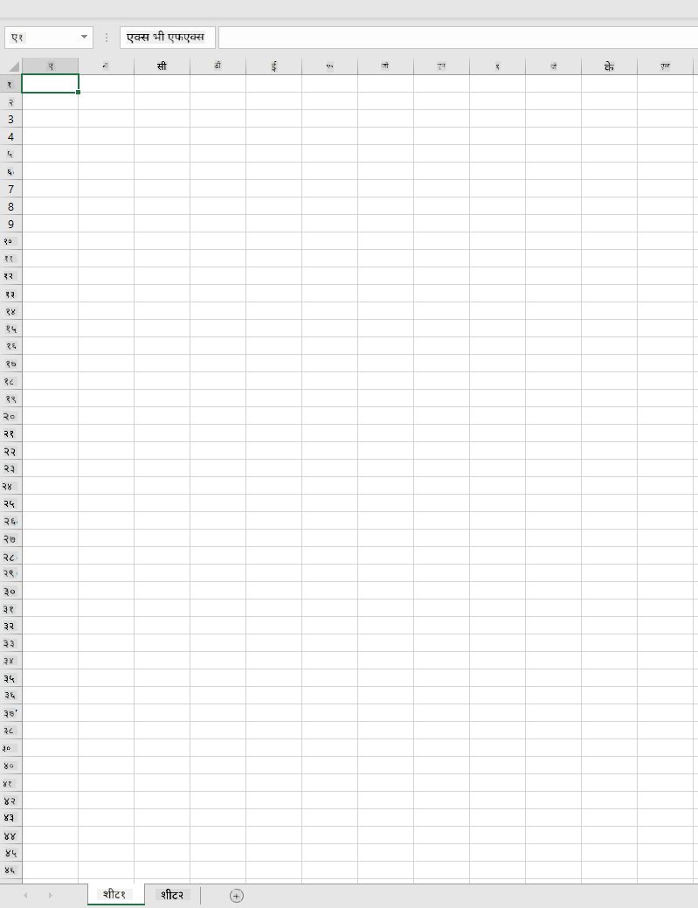
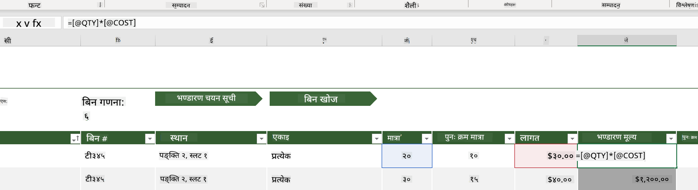
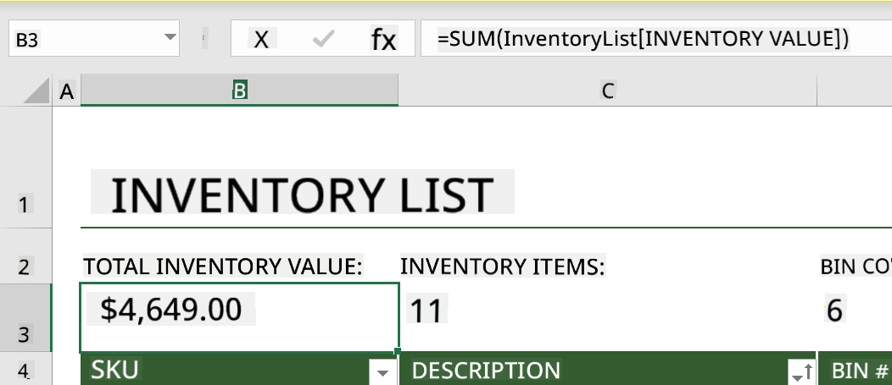
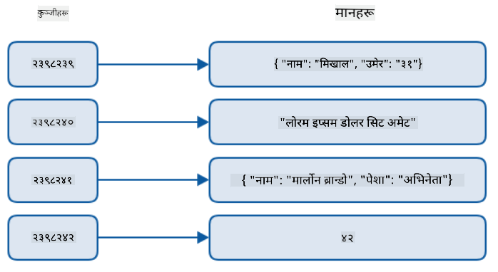
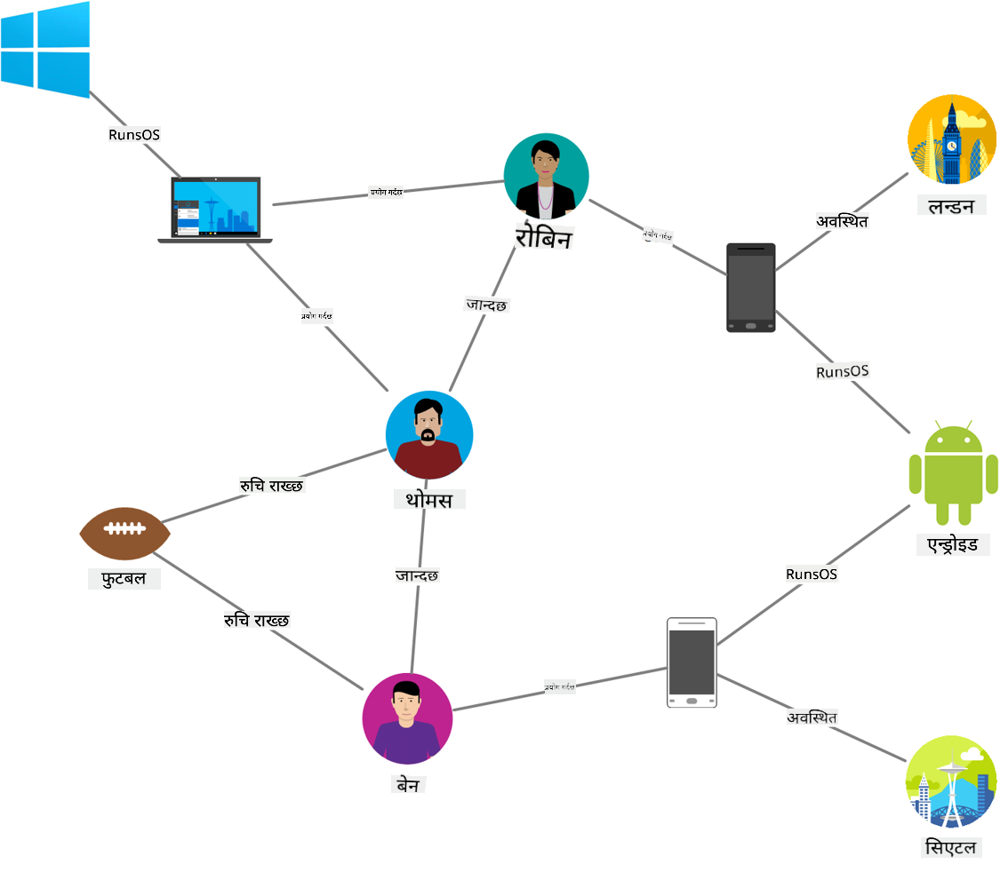
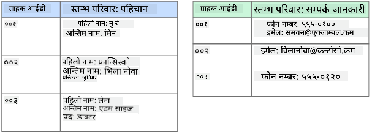
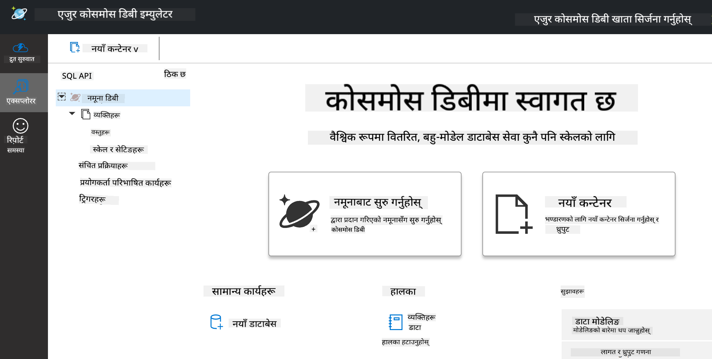
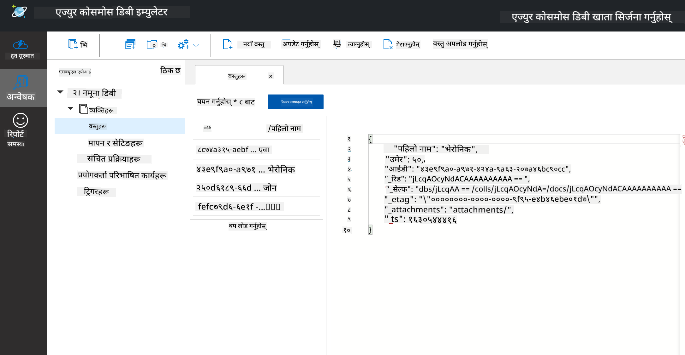
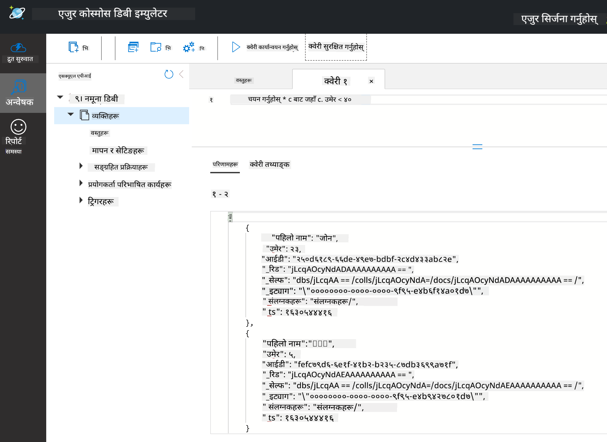

<!--
CO_OP_TRANSLATOR_METADATA:
{
  "original_hash": "32ddfef8121650f2ca2f3416fd283c37",
  "translation_date": "2025-08-27T16:58:03+00:00",
  "source_file": "2-Working-With-Data/06-non-relational/README.md",
  "language_code": "ne"
}
-->
# डेटा संग काम गर्ने: गैर-संबंधित डेटा

| द्वारा स्केच नोट ](../../sketchnotes/06-NoSQL.png)|
|:---:|
|NoSQL डेटासँग काम गर्ने - _[@nitya](https://twitter.com/nitya) द्वारा स्केच नोट_ |

## [पूर्व-व्याख्यान क्विज](https://purple-hill-04aebfb03.1.azurestaticapps.net/quiz/10)

डेटा केवल रिलेशनल डाटाबेसमा सीमित छैन। यो पाठले गैर-संबंधित डेटामा केन्द्रित छ र स्प्रेडशीट र NoSQL को आधारभूत कुराहरू समेट्छ।

## स्प्रेडशीटहरू

स्प्रेडशीटहरू डेटा भण्डारण र अन्वेषण गर्न लोकप्रिय तरिका हुन् किनभने यसलाई सेटअप गर्न र सुरु गर्न कम काम आवश्यक पर्छ। यस पाठमा तपाईं स्प्रेडशीटका आधारभूत भागहरू, साथै सूत्रहरू र कार्यहरू सिक्नुहुनेछ। उदाहरणहरू Microsoft Excel मार्फत देखाइनेछ, तर अधिकांश भागहरू र विषयवस्तुहरू अन्य स्प्रेडशीट सफ्टवेयरसँग मिल्दोजुल्दो नाम र चरणहरू हुनेछन्।



स्प्रेडशीट एउटा फाइल हो र यो कम्प्युटर, उपकरण, वा क्लाउड-आधारित फाइल प्रणालीको फाइल प्रणालीमा पहुँचयोग्य हुनेछ। सफ्टवेयर आफैं ब्राउजरमा आधारित हुन सक्छ वा कम्प्युटरमा इन्स्टल गर्नुपर्ने एप्लिकेसन वा डाउनलोड गर्नुपर्ने एप हुन सक्छ। Excel मा यी फाइलहरूलाई **वर्कबुक** भनेर परिभाषित गरिन्छ र यो शब्दावली यस पाठको बाँकी भागमा प्रयोग गरिनेछ।

वर्कबुकमा एक वा बढी **वर्कशीटहरू** हुन्छन्, जहाँ प्रत्येक वर्कशीटलाई ट्याबहरूद्वारा लेबल गरिएको हुन्छ। वर्कशीटभित्र आयताकारहरू हुन्छन् जसलाई **सेलहरू** भनिन्छ, जसले वास्तविक डेटा समावेश गर्दछ। सेल पङ्क्ति र स्तम्भको अन्तरसेचन हो, जहाँ स्तम्भहरू वर्णानुक्रमिक अक्षरहरूले लेबल गरिएका छन् र पङ्क्तिहरू सङ्ख्यात्मक रूपमा लेबल गरिएका छन्। केही स्प्रेडशीटहरूमा पहिलो केही पङ्क्तिहरूमा हेडरहरू हुन्छन् जसले सेलमा रहेको डेटालाई वर्णन गर्दछ।

Excel वर्कबुकका यी आधारभूत तत्वहरूसँग, हामी [Microsoft Templates](https://templates.office.com/) बाट लिइएको इनभेन्टरीमा केन्द्रित उदाहरण प्रयोग गरेर स्प्रेडशीटका थप भागहरूमा हिँड्नेछौं।

### इनभेन्टरी व्यवस्थापन

"InventoryExample" नामक स्प्रेडशीट फाइल इनभेन्टरीभित्रका वस्तुहरूको स्वरूपित स्प्रेडशीट हो जसमा तीन वर्कशीटहरू छन्, जहाँ ट्याबहरू "Inventory List", "Inventory Pick List" र "Bin Lookup" भनेर लेबल गरिएका छन्। Inventory List वर्कशीटको पङ्क्ति 4 हेडर हो, जसले हेडर स्तम्भमा प्रत्येक सेलको मानलाई वर्णन गर्दछ।



कहिलेकाहीँ कुनै सेलको मान अन्य सेलहरूको मानमा निर्भर हुन्छ। Inventory List स्प्रेडशीटले आफ्नो इनभेन्टरीमा प्रत्येक वस्तुको लागत ट्र्याक गर्दछ, तर यदि हामीलाई इनभेन्टरीको कुल मूल्य थाहा पाउनुपर्‍यो भने के गर्ने? [**सूत्रहरू**](https://support.microsoft.com/en-us/office/overview-of-formulas-34519a4e-1e8d-4f4b-84d4-d642c4f63263) सेल डेटामा कार्यहरू प्रदर्शन गर्न प्रयोग गरिन्छ र यस उदाहरणमा इनभेन्टरीको लागत गणना गर्न प्रयोग गरिएको छ। यस स्प्रेडशीटले QTY हेडर अन्तर्गतको मात्रा र COST हेडर अन्तर्गतको लागतलाई गुणा गरेर प्रत्येक वस्तुको मूल्य गणना गर्न Inventory Value स्तम्भमा सूत्र प्रयोग गरेको छ। कुनै सेललाई डबल क्लिक गर्दा वा हाइलाइट गर्दा सूत्र देखिन्छ। सूत्रहरू बराबर चिन्हबाट सुरु हुन्छन्, त्यसपछि गणना वा अपरेशन हुन्छ।



हामी अर्को सूत्र प्रयोग गरेर Inventory Value का सबै मानहरूलाई जोडेर यसको कुल मूल्य पाउन सक्छौं। यो प्रत्येक सेललाई जोडेर गणना गर्न सकिन्छ, तर त्यो झन्झटिलो काम हुन सक्छ। Excel मा [**कार्यहरू**](https://support.microsoft.com/en-us/office/sum-function-043e1c7d-7726-4e80-8f32-07b23e057f89), वा पूर्वनिर्धारित सूत्रहरू, सेल मानहरूमा गणना गर्न प्रयोग गरिन्छ। कार्यहरूलाई गणना गर्न आवश्यक मानहरू, जसलाई तर्क भनिन्छ, चाहिन्छ। जब कार्यहरूलाई एकभन्दा बढी तर्क चाहिन्छ, तिनीहरूलाई विशेष क्रममा सूचीबद्ध गर्न आवश्यक पर्छ, अन्यथा कार्यले सही मान गणना गर्न सक्दैन। यस उदाहरणले SUM कार्य प्रयोग गर्दछ, र Inventory Value का मानहरूलाई तर्कको रूपमा प्रयोग गरेर B3 (पङ्क्ति 3, स्तम्भ B) मा सूचीबद्ध कुल मान उत्पन्न गर्दछ।

## NoSQL

NoSQL गैर-संबंधित डेटा भण्डारण गर्ने विभिन्न तरिकाहरूको लागि प्रयोग गरिने छाता शब्द हो र यसलाई "non-SQL", "non-relational" वा "not only SQL" भनेर व्याख्या गर्न सकिन्छ। यी प्रकारका डाटाबेस प्रणालीहरूलाई चार प्रकारमा वर्गीकृत गर्न सकिन्छ।


> स्रोत: [Michał Białecki Blog](https://www.michalbialecki.com/2018/03/18/azure-cosmos-db-key-value-database-cloud/)

[कुञ्जी-मूल्य](https://docs.microsoft.com/en-us/azure/architecture/data-guide/big-data/non-relational-data#keyvalue-data-stores) डाटाबेसहरूले अद्वितीय कुञ्जीहरूलाई जोडी बनाउँछन्, जुन मानसँग सम्बन्धित अद्वितीय पहिचानकर्ता हो। यी जोडीहरू [ह्यास तालिका](https://www.hackerearth.com/practice/data-structures/hash-tables/basics-of-hash-tables/tutorial/) प्रयोग गरेर भण्डारण गरिन्छ, जसमा उपयुक्त ह्यासिङ कार्य हुन्छ।


> स्रोत: [Microsoft](https://docs.microsoft.com/en-us/azure/cosmos-db/graph/graph-introduction#graph-database-by-example)

[ग्राफ](https://docs.microsoft.com/en-us/azure/architecture/data-guide/big-data/non-relational-data#graph-data-stores) डाटाबेसहरूले डेटामा सम्बन्धहरू वर्णन गर्छन् र नोड र किनारहरूको संग्रहको रूपमा प्रतिनिधित्व गरिन्छ। नोडले वास्तविक संसारमा अवस्थित कुनै वस्तु, जस्तै विद्यार्थी वा बैंक स्टेटमेन्टलाई प्रतिनिधित्व गर्दछ। किनारहरूले दुई वस्तुहरू बीचको सम्बन्धलाई प्रतिनिधित्व गर्छन्। प्रत्येक नोड र किनारसँग तिनीहरूको बारेमा थप जानकारी प्रदान गर्ने गुणहरू हुन्छन्।



[स्तम्भीय](https://docs.microsoft.com/en-us/azure/architecture/data-guide/big-data/non-relational-data#columnar-data-stores) डेटा स्टोरहरूले डेटा स्तम्भ र पङ्क्तिहरूमा व्यवस्थित गर्छन्, जसले रिलेशनल डेटा संरचनासँग मिल्दोजुल्दो देखिन्छ, तर प्रत्येक स्तम्भ समूहहरूमा विभाजित हुन्छ, जसलाई स्तम्भ परिवार भनिन्छ। एउटै स्तम्भ अन्तर्गतको सबै डेटा सम्बन्धित हुन्छ र एकाइमा पुनःप्राप्त र परिवर्तन गर्न सकिन्छ।

### Azure Cosmos DB सँग कागजात डेटा स्टोरहरू

[कागजात](https://docs.microsoft.com/en-us/azure/architecture/data-guide/big-data/non-relational-data#document-data-stores) डेटा स्टोरहरूले कुञ्जी-मूल्य डेटा स्टोरको अवधारणामा निर्माण गर्छन् र क्षेत्रहरू र वस्तुहरूको श्रृंखलाबाट बनेका हुन्छन्। यो खण्डले Cosmos DB इम्युलेटरको साथ कागजात डाटाबेसहरूको अन्वेषण गर्नेछ।

Cosmos DB डाटाबेस "Not Only SQL" को परिभाषामा फिट हुन्छ, जहाँ Cosmos DB को कागजात डाटाबेसले डेटा सोध्न SQL मा निर्भर गर्दछ। SQL को आधारभूत कुराहरू [पछिल्लो पाठ](../05-relational-databases/README.md) मा समेटिएको छ, र हामी यहाँ कागजात डाटाबेसमा केही समान सोधहरू लागू गर्न सक्षम हुनेछौं। हामी Cosmos DB इम्युलेटर प्रयोग गर्नेछौं, जसले हामीलाई कम्प्युटरमा स्थानीय रूपमा कागजात डाटाबेस सिर्जना र अन्वेषण गर्न अनुमति दिन्छ। इम्युलेटरको बारेमा थप पढ्न [यहाँ](https://docs.microsoft.com/en-us/azure/cosmos-db/local-emulator?tabs=ssl-netstd21) जानुहोस्।

कागजात क्षेत्रहरू र वस्तु मानहरूको संग्रह हो, जहाँ क्षेत्रहरूले वस्तु मानले के प्रतिनिधित्व गर्छ भन्ने वर्णन गर्दछ। तल एउटा कागजातको उदाहरण छ।

```json
{
    "firstname": "Eva",
    "age": 44,
    "id": "8c74a315-aebf-4a16-bb38-2430a9896ce5",
    "_rid": "bHwDAPQz8s0BAAAAAAAAAA==",
    "_self": "dbs/bHwDAA==/colls/bHwDAPQz8s0=/docs/bHwDAPQz8s0BAAAAAAAAAA==/",
    "_etag": "\"00000000-0000-0000-9f95-010a691e01d7\"",
    "_attachments": "attachments/",
    "_ts": 1630544034
}
```

यस कागजातमा चासोका क्षेत्रहरू: `firstname`, `id`, र `age` हुन्। Cosmos DB द्वारा उत्पन्न गरिएका अन्य क्षेत्रहरू अन्डरस्कोरहरूसँग छन्।

#### Cosmos DB इम्युलेटरको साथ डेटाको अन्वेषण

तपाईं [Windows का लागि यहाँ](https://aka.ms/cosmosdb-emulator) इम्युलेटर डाउनलोड र इन्स्टल गर्न सक्नुहुन्छ। macOS र Linux का लागि इम्युलेटर चलाउने विकल्पहरूको लागि यो [डकुमेन्टेसन](https://docs.microsoft.com/en-us/azure/cosmos-db/local-emulator?tabs=ssl-netstd21#run-on-linux-macos) हेर्नुहोस्।

इम्युलेटरले ब्राउजर विन्डो सुरु गर्छ, जहाँ Explorer दृश्यले तपाईंलाई कागजातहरूको अन्वेषण गर्न अनुमति दिन्छ।



यदि तपाईं अनुसरण गर्दै हुनुहुन्छ भने, "Start with Sample" मा क्लिक गर्नुहोस् जसले SampleDB नामक नमूना डाटाबेस उत्पन्न गर्दछ। SampleDB विस्तार गर्नको लागि एरोमा क्लिक गर्दा `Persons` नामक कन्टेनर फेला पर्नेछ। कन्टेनरले वस्तुहरूको संग्रह समावेश गर्दछ, जुन कन्टेनरभित्रका कागजातहरू हुन्। तपाईं `Items` अन्तर्गत चार व्यक्तिगत कागजातहरूको अन्वेषण गर्न सक्नुहुन्छ।



#### Cosmos DB इम्युलेटरको साथ कागजात डेटाको सोध

हामी नयाँ SQL Query बटन (बायाँबाट दोस्रो बटन) क्लिक गरेर नमूना डेटाको सोध पनि गर्न सक्छौं।

`SELECT * FROM c` ले कन्टेनरभित्रका सबै कागजातहरू फिर्ता गर्छ। अब हामी where क्लज थपेर 40 भन्दा कम उमेर भएका व्यक्तिहरू फेला पारौं।

`SELECT * FROM c where c.age < 40`



सोधले दुई कागजातहरू फिर्ता गर्छ, प्रत्येक कागजातको उमेर मान 40 भन्दा कम छ।

#### JSON र कागजातहरू

यदि तपाईं JavaScript Object Notation (JSON) सँग परिचित हुनुहुन्छ भने, तपाईंले कागजातहरू JSON जस्तै देखिन्छन् भन्ने देख्नुहुनेछ। यो निर्देशिकामा `PersonsData.json` नामक फाइल छ, जसमा थप डेटा छ, जुन तपाईं इम्युलेटरमा `Upload Item` बटन प्रयोग गरेर Persons कन्टेनरमा अपलोड गर्न सक्नुहुन्छ।

धेरैजसो अवस्थामा, JSON डेटा फिर्ता गर्ने API हरूलाई प्रत्यक्ष रूपमा कागजात डाटाबेसहरूमा स्थानान्तरण र भण्डारण गर्न सकिन्छ। तल अर्को कागजात छ, यो Microsoft Twitter खाताबाट ट्वीटहरू प्रतिनिधित्व गर्दछ, जुन Twitter API प्रयोग गरेर पुनःप्राप्त गरिएको थियो, त्यसपछि Cosmos DB मा सम्मिलित गरिएको थियो।

```json
{
    "created_at": "2021-08-31T19:03:01.000Z",
    "id": "1432780985872142341",
    "text": "Blank slate. Like this tweet if you’ve ever painted in Microsoft Paint before. https://t.co/cFeEs8eOPK",
    "_rid": "dhAmAIUsA4oHAAAAAAAAAA==",
    "_self": "dbs/dhAmAA==/colls/dhAmAIUsA4o=/docs/dhAmAIUsA4oHAAAAAAAAAA==/",
    "_etag": "\"00000000-0000-0000-9f84-a0958ad901d7\"",
    "_attachments": "attachments/",
    "_ts": 1630537000
```

यस कागजातमा चासोका क्षेत्रहरू: `created_at`, `id`, र `text` हुन्।

## 🚀 चुनौती

`TwitterData.json` नामक फाइल छ, जुन तपाईं SampleDB डाटाबेसमा अपलोड गर्न सक्नुहुन्छ। यो फाइललाई छुट्टै कन्टेनरमा थप्न सिफारिस गरिन्छ। यो निम्न चरणहरूद्वारा गर्न सकिन्छ:

1. माथिल्लो दायाँ कुनामा नयाँ कन्टेनर बटन क्लिक गर्नुहोस्
1. विद्यमान डाटाबेस (SampleDB) चयन गर्नुहोस्, कन्टेनरको लागि कन्टेनर ID सिर्जना गर्नुहोस्
1. पार्टिशन कुञ्जीलाई `/id` मा सेट गर्नुहोस्
1. OK क्लिक गर्नुहोस् (तपाईं यस दृश्यको बाँकी जानकारीलाई बेवास्ता गर्न सक्नुहुन्छ किनभने यो सानो डेटासेट तपाईंको मेसिनमा स्थानीय रूपमा चलिरहेको छ)
1. आफ्नो नयाँ कन्टेनर खोल्नुहोस् र `Upload Item` बटन प्रयोग गरेर Twitter Data फाइल अपलोड गर्नुहोस्

`text` क्षेत्रमा Microsoft भएको कागजातहरू फेला पार्न केही SELECT सोधहरू चलाउन प्रयास गर्नुहोस्। सुझाव: [LIKE कीवर्ड](https://docs.microsoft.com/en-us/azure/cosmos-db/sql/sql-query-keywords#using-like-with-the--wildcard-character) प्रयोग गर्न प्रयास गर्नुहोस्।

## [पश्च-व्याख्यान क्विज](https://purple-hill-04aebfb03.1.azurestaticapps.net/quiz/11)

## समीक्षा र आत्म-अध्ययन

- यस पाठले समेटेको छैन तर यस स्प्रेडशीटमा थप स्वरूपण र सुविधाहरू छन्। Excel को बारेमा थप जान्न इच्छुक हुनुहुन्छ भने Microsoft को [ठूलो डकुमेन्टेसन र भिडियो पुस्तकालय](https://support.microsoft.com/excel) हेर्नुहोस्।

- गैर-संबंधित डेटा र NoSQL का विभिन्न प्रकारहरूको विशेषताहरूको बारेमा यो वास्तुकला डकुमेन्टेसन विवरण दिन्छ: [गैर-संबंधित डेटा र NoSQL](https://docs.microsoft.com/en-us/azure/architecture/data-guide/big-data/non-relational-data)

- Cosmos DB एक क्लाउड-आधारित गैर-संबंधित डाटाबेस हो, जसले यस पाठमा उल्लेख गरिएका विभिन्न NoSQL प्रकारहरू पनि भण्डारण गर्न सक्छ। यी प्रकारहरूको बारेमा थप जान्न यो [Cosmos DB Microsoft Learn Module](https://docs.microsoft.com/en-us/learn/paths/work-with-nosql-data-in-azure-cosmos-db/) हेर्नुहोस्।

## असाइनमेन्ट

[Soda Profits](assignment.md)

---

**अस्वीकरण**:  
यो दस्तावेज़ AI अनुवाद सेवा [Co-op Translator](https://github.com/Azure/co-op-translator) प्रयोग गरेर अनुवाद गरिएको छ। हामी शुद्धताको लागि प्रयास गर्छौं, तर कृपया ध्यान दिनुहोस् कि स्वचालित अनुवादमा त्रुटिहरू वा अशुद्धताहरू हुन सक्छ। यसको मूल भाषा मा रहेको मूल दस्तावेज़लाई आधिकारिक स्रोत मानिनुपर्छ। महत्वपूर्ण जानकारीको लागि, व्यावसायिक मानव अनुवाद सिफारिस गरिन्छ। यस अनुवादको प्रयोगबाट उत्पन्न हुने कुनै पनि गलतफहमी वा गलत व्याख्याको लागि हामी जिम्मेवार हुने छैनौं।