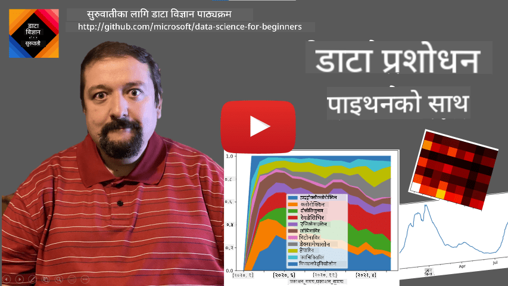
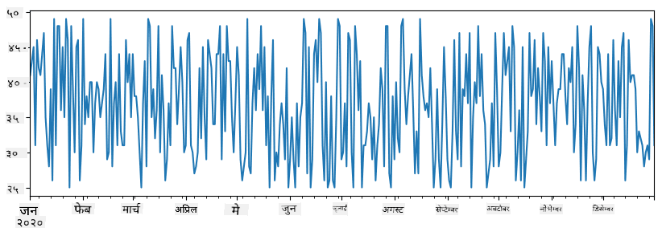
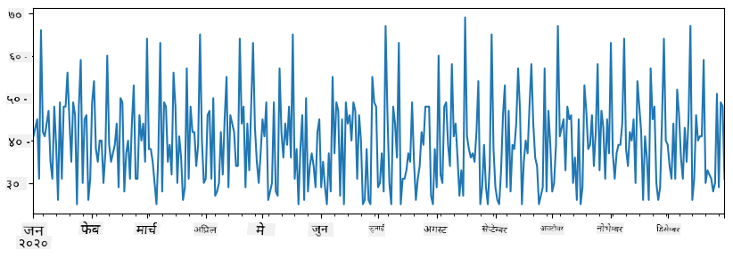
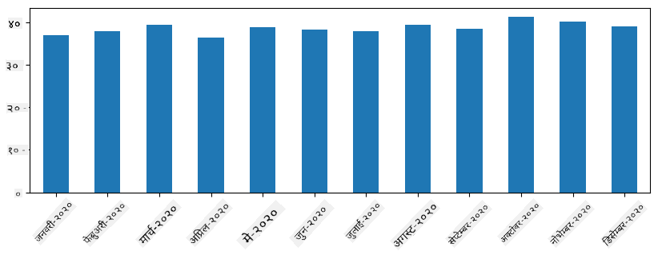
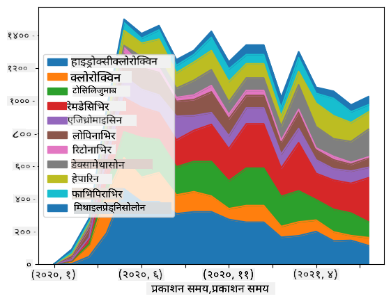

<!--
CO_OP_TRANSLATOR_METADATA:
{
  "original_hash": "57f7db1f4c3ae3361c1d1fbafcdd690c",
  "translation_date": "2025-09-04T16:58:00+00:00",
  "source_file": "2-Working-With-Data/07-python/README.md",
  "language_code": "ne"
}
-->
# डेटा संग काम गर्ने: Python र Pandas लाइब्रेरी

|  ](../../sketchnotes/07-WorkWithPython.png) |
| :-------------------------------------------------------------------------------------------------------: |
|                 Python संग काम गर्ने - _Sketchnote by [@nitya](https://twitter.com/nitya)_                 |

[](https://youtu.be/dZjWOGbsN4Y)

डाटाबेसहरूले डेटा भण्डारण गर्न र क्वेरी भाषाहरू प्रयोग गरेर तिनीहरूलाई क्वेरी गर्न धेरै प्रभावकारी तरिका प्रदान गर्छन्। तर, डेटा प्रशोधनको सबैभन्दा लचिलो तरिका भनेको आफ्नो प्रोग्राम लेखेर डेटा हेरफेर गर्नु हो। धेरै अवस्थामा, डाटाबेस क्वेरी गर्नु अधिक प्रभावकारी तरिका हुन सक्छ। तर, कहिलेकाहीँ जब जटिल डेटा प्रशोधन आवश्यक हुन्छ, SQL प्रयोग गरेर यो सजिलै गर्न सकिँदैन। 
डेटा प्रशोधन कुनै पनि प्रोग्रामिङ भाषामा गर्न सकिन्छ, तर केही भाषाहरू डेटा संग काम गर्न उच्च स्तरका हुन्छन्। डेटा वैज्ञानिकहरूले सामान्यतया निम्न भाषाहरू मध्ये एकलाई प्राथमिकता दिन्छन्:

* **[Python](https://www.python.org/)**, एक सामान्य-उद्देश्य प्रोग्रामिङ भाषा, जसलाई यसको सरलताका कारण प्रायः प्रारम्भकर्ताहरूको लागि उत्कृष्ट विकल्प मानिन्छ। Python मा धेरै अतिरिक्त लाइब्रेरीहरू छन् जसले तपाईंलाई धेरै व्यावहारिक समस्याहरू समाधान गर्न मद्दत गर्न सक्छ, जस्तै ZIP आर्काइभबाट तपाईंको डेटा निकाल्ने वा तस्वीरलाई ग्रेस्केलमा रूपान्तरण गर्ने। डेटा विज्ञानको अतिरिक्त, Python वेब विकासको लागि पनि प्रायः प्रयोग गरिन्छ। 
* **[R](https://www.r-project.org/)** एक परम्परागत उपकरण हो जसलाई सांख्यिकीय डेटा प्रशोधनको लागि विकास गरिएको हो। यसमा ठूलो लाइब्रेरीको संग्रह (CRAN) छ, जसले यसलाई डेटा प्रशोधनको लागि राम्रो विकल्प बनाउँछ। तर, R सामान्य-उद्देश्य प्रोग्रामिङ भाषा होइन, र डेटा विज्ञानको क्षेत्र बाहिर कम प्रयोग गरिन्छ।
* **[Julia](https://julialang.org/)** अर्को भाषा हो जुन विशेष रूपमा डेटा विज्ञानको लागि विकास गरिएको हो। यसले Python भन्दा राम्रो प्रदर्शन दिनको लागि बनाइएको हो, जसले यसलाई वैज्ञानिक प्रयोगको लागि उत्कृष्ट उपकरण बनाउँछ।

यस पाठमा, हामी सरल डेटा प्रशोधनको लागि Python प्रयोगमा केन्द्रित हुनेछौं। हामी भाषाको आधारभूत परिचितता मान्नेछौं। यदि तपाईं Python को गहिरो भ्रमण चाहनुहुन्छ भने, तपाईं निम्न स्रोतहरू मध्ये एकलाई सन्दर्भ गर्न सक्नुहुन्छ:

* [Learn Python in a Fun Way with Turtle Graphics and Fractals](https://github.com/shwars/pycourse) - GitHub आधारित Python प्रोग्रामिङको छोटो परिचयात्मक पाठ्यक्रम
* [Take your First Steps with Python](https://docs.microsoft.com/en-us/learn/paths/python-first-steps/?WT.mc_id=academic-77958-bethanycheum) [Microsoft Learn](http://learn.microsoft.com/?WT.mc_id=academic-77958-bethanycheum) मा लर्निङ पाथ

डेटा धेरै प्रकारका हुन सक्छ। यस पाठमा, हामी तीन प्रकारका डेटा - **तालिका डेटा**, **पाठ** र **तस्बिरहरू** विचार गर्नेछौं।

हामी सम्बन्धित लाइब्रेरीहरूको पूर्ण अवलोकन दिनुको सट्टा डेटा प्रशोधनका केही उदाहरणहरूमा केन्द्रित हुनेछौं। यसले तपाईंलाई के सम्भव छ भन्ने मुख्य विचार दिन्छ, र तपाईंलाई आवश्यक पर्दा तपाईंको समस्याहरूको समाधान कहाँ खोज्ने भन्ने समझ छोड्छ।

> **सबैभन्दा उपयोगी सल्लाह**। जब तपाईंलाई डेटा मा कुनै निश्चित अपरेशन गर्न आवश्यक छ जुन तपाईंलाई कसरी गर्ने थाहा छैन, इन्टरनेटमा खोज्ने प्रयास गर्नुहोस्। [Stackoverflow](https://stackoverflow.com/) मा Python मा धेरै सामान्य कार्यहरूको लागि उपयोगी कोड नमूना प्रायः पाइन्छ। 

## [पाठ अघि क्विज](https://purple-hill-04aebfb03.1.azurestaticapps.net/quiz/12)

## तालिका डेटा र डेटा फ्रेमहरू

तपाईंले पहिले नै तालिका डेटा भेट्नुभएको छ जब हामी सम्बन्धित डाटाबेसहरूको बारेमा कुरा गर्यौं। जब तपाईंसँग धेरै डेटा हुन्छ, र यो धेरै विभिन्न लिंक गरिएको तालिकाहरूमा समावेश हुन्छ, SQL प्रयोग गरेर यससँग काम गर्नु निश्चित रूपमा अर्थपूर्ण हुन्छ। तर, धेरै अवस्थामा जब हामीसँग डेटा को एक तालिका हुन्छ, र हामीले यस डेटा को बारेमा केही **समझ** वा **अन्तर्दृष्टि** प्राप्त गर्न आवश्यक छ, जस्तै वितरण, मानहरू बीचको सम्बन्ध, आदि। डेटा विज्ञानमा, धेरै अवस्थामा हामीले मूल डेटा को केही रूपान्तरण गर्न आवश्यक छ, त्यसपछि दृश्यात्मकता। यी दुई चरणहरू Python प्रयोग गरेर सजिलै गर्न सकिन्छ।

Python मा तालिका डेटा संग व्यवहार गर्न मद्दत गर्ने दुई सबैभन्दा उपयोगी लाइब्रेरीहरू छन्:
* **[Pandas](https://pandas.pydata.org/)** तपाईंलाई तथाकथित **Dataframes** हेरफेर गर्न अनुमति दिन्छ, जुन सम्बन्धित तालिकाहरूको समानान्तर हुन्छ। तपाईंसँग नामित स्तम्भहरू हुन सक्छ, र पङ्क्ति, स्तम्भहरू र सामान्य रूपमा डेटा फ्रेमहरूमा विभिन्न अपरेशनहरू प्रदर्शन गर्न सक्नुहुन्छ। 
* **[Numpy](https://numpy.org/)** **tensors**, अर्थात् बहु-आयामिक **arrays** संग काम गर्नको लागि लाइब्रेरी हो। Array मा समान आधारभूत प्रकारका मानहरू हुन्छन्, र यो डेटा फ्रेम भन्दा सरल छ, तर यसले अधिक गणितीय अपरेशनहरू प्रदान गर्दछ, र कम ओभरहेड सिर्जना गर्दछ।

त्यहाँ केही अन्य लाइब्रेरीहरू पनि छन् जुन तपाईंलाई थाहा हुनुपर्छ:
* **[Matplotlib](https://matplotlib.org/)** डेटा दृश्यात्मकता र ग्राफहरू प्लट गर्न प्रयोग गरिने लाइब्रेरी हो
* **[SciPy](https://www.scipy.org/)** केही अतिरिक्त वैज्ञानिक कार्यहरू भएको लाइब्रेरी हो। हामीले पहिले नै सम्भाव्यता र सांख्यिकीको बारेमा कुरा गर्दा यो लाइब्रेरी भेटेका थियौं

यहाँ एउटा कोडको टुक्रा छ जुन तपाईं सामान्यतया आफ्नो Python प्रोग्रामको सुरुमा ती लाइब्रेरीहरू आयात गर्न प्रयोग गर्नुहुन्छ:
```python
import numpy as np
import pandas as pd
import matplotlib.pyplot as plt
from scipy import ... # you need to specify exact sub-packages that you need
``` 

Pandas केही आधारभूत अवधारणाहरू वरिपरि केन्द्रित छ।

### Series 

**Series** मानहरूको अनुक्रम हो, सूची वा numpy array जस्तै। मुख्य भिन्नता भनेको series मा **index** पनि हुन्छ, र जब हामी series मा अपरेशन गर्छौं (जस्तै, तिनीहरूलाई थप्छौं), index लाई ध्यानमा राखिन्छ। Index साधारण पूर्णांक पङ्क्ति नम्बर जस्तै सरल हुन सक्छ (यो सूची वा array बाट series सिर्जना गर्दा प्रयोग गरिएको डिफल्ट index हो), वा यो जटिल संरचना, जस्तै मिति अन्तराल, हुन सक्छ।

> **Note**: Pandas को केही परिचयात्मक कोड संग notebook [`notebook.ipynb`](notebook.ipynb) मा समावेश छ। हामी यहाँ केही उदाहरणहरू मात्र outline गर्छौं, र तपाईंलाई पूर्ण notebook हेर्न स्वागत छ।

उदाहरण विचार गर्नुहोस्: हामी हाम्रो ice-cream spot को बिक्री विश्लेषण गर्न चाहन्छौं। केही समय अवधिको लागि बिक्री संख्या (प्रत्येक दिन बेचिएका वस्तुहरूको संख्या) को series सिर्जना गरौं:

```python
start_date = "Jan 1, 2020"
end_date = "Mar 31, 2020"
idx = pd.date_range(start_date,end_date)
print(f"Length of index is {len(idx)}")
items_sold = pd.Series(np.random.randint(25,50,size=len(idx)),index=idx)
items_sold.plot()
```


अब मानौं कि प्रत्येक हप्ता हामी साथीहरूको लागि पार्टी आयोजना गर्छौं, र पार्टीको लागि अतिरिक्त 10 ice-cream को packs लिन्छौं। हामी अर्को series सिर्जना गर्न सक्छौं, हप्ताको आधारमा index गरेर, यो देखाउन:
```python
additional_items = pd.Series(10,index=pd.date_range(start_date,end_date,freq="W"))
```
जब हामी दुई series सँगै जोड्छौं, हामी कुल संख्या प्राप्त गर्छौं:
```python
total_items = items_sold.add(additional_items,fill_value=0)
total_items.plot()
```


> **Note** कि हामी साधारण syntax `total_items+additional_items` प्रयोग गरिरहेका छैनौं। यदि हामीले गरेमा, हामीले परिणामस्वरूप series मा धेरै `NaN` (*Not a Number*) मानहरू प्राप्त गर्ने थियौं। यो `additional_items` series मा index को केही बिन्दुहरूको लागि मानहरू हराइरहेको छ, र `NaN` लाई कुनै पनि चीजमा थप्दा `NaN` परिणाम दिन्छ। त्यसैले हामीले addition को समयमा `fill_value` parameter निर्दिष्ट गर्न आवश्यक छ।

Time series संग, हामी विभिन्न समय अन्तराल संग series लाई **resample** गर्न सक्छौं। उदाहरणका लागि, मानौं हामी मासिक औसत बिक्री मात्रा गणना गर्न चाहन्छौं। हामी निम्न कोड प्रयोग गर्न सक्छौं:
```python
monthly = total_items.resample("1M").mean()
ax = monthly.plot(kind='bar')
```


### DataFrame

DataFrame मूलतः समान index भएको series को संग्रह हो। हामी धेरै series सँगै DataFrame मा संयोजन गर्न सक्छौं:
```python
a = pd.Series(range(1,10))
b = pd.Series(["I","like","to","play","games","and","will","not","change"],index=range(0,9))
df = pd.DataFrame([a,b])
```
यसले यस्तो horizontal तालिका सिर्जना गर्नेछ:
|     | 0   | 1    | 2   | 3   | 4      | 5   | 6      | 7    | 8    |
| --- | --- | ---- | --- | --- | ------ | --- | ------ | ---- | ---- |
| 0   | 1   | 2    | 3   | 4   | 5      | 6   | 7      | 8    | 9    |
| 1   | I   | like | to  | use | Python | and | Pandas | very | much |

हामी series लाई स्तम्भको रूपमा प्रयोग गर्न सक्छौं, र dictionary प्रयोग गरेर स्तम्भको नाम निर्दिष्ट गर्न सक्छौं:
```python
df = pd.DataFrame({ 'A' : a, 'B' : b })
```
यसले हामीलाई यस्तो तालिका दिनेछ:

|     | A   | B      |
| --- | --- | ------ |
| 0   | 1   | I      |
| 1   | 2   | like   |
| 2   | 3   | to     |
| 3   | 4   | use    |
| 4   | 5   | Python |
| 5   | 6   | and    |
| 6   | 7   | Pandas |
| 7   | 8   | very   |
| 8   | 9   | much   |

**Note** कि हामीले `.T` लेखेर पहिलेको तालिका transpose गरेर पनि यो तालिका लेआउट प्राप्त गर्न सक्छौं। 
```python
df = pd.DataFrame([a,b]).T..rename(columns={ 0 : 'A', 1 : 'B' })
```
यहाँ `.T` ले DataFrame को transpose अपरेशनलाई जनाउँछ, अर्थात् पङ्क्ति र स्तम्भहरू परिवर्तन गर्ने, र `rename` अपरेशनले हामीलाई स्तम्भहरू पहिलेको उदाहरणसँग मिलाउन नाम परिवर्तन गर्न अनुमति दिन्छ।

यहाँ DataFrames मा प्रदर्शन गर्न सकिने केही सबैभन्दा महत्त्वपूर्ण अपरेशनहरू छन्:

**स्तम्भ चयन**। हामी `df['A']` लेखेर व्यक्तिगत स्तम्भहरू चयन गर्न सक्छौं - यो अपरेशनले Series फर्काउँछ। हामी `df[['B','A']]` लेखेर अर्को DataFrame मा स्तम्भहरूको subset चयन गर्न सक्छौं - यसले अर्को DataFrame फर्काउँछ।

**केवल निश्चित पङ्क्तिहरू फिल्टर गर्ने**। उदाहरणका लागि, स्तम्भ `A` 5 भन्दा ठूलो भएको पङ्क्तिहरू मात्र छोड्नको लागि, हामी `df[df['A']>5]` लेख्न सक्छौं।

> **Note**: फिल्टरिंग कसरी काम गर्छ भन्ने तरिका निम्नानुसार छ। अभिव्यक्ति `df['A']<5` ले boolean series फर्काउँछ, जसले मूल series `df['A']` को प्रत्येक तत्वको लागि अभिव्यक्ति `True` वा `False` हो कि होइन भनेर संकेत गर्दछ। जब boolean series लाई index को रूपमा प्रयोग गरिन्छ, यसले DataFrame मा पङ्क्तिहरूको subset फर्काउँछ। त्यसैले arbitrary Python boolean अभिव्यक्ति प्रयोग गर्न सम्भव छैन, उदाहरणका लागि, `df[df['A']>5 and df['A']<7]` लेख्नु गलत हुनेछ। यसको सट्टा, तपाईं boolean series मा विशेष `&` अपरेशन प्रयोग गर्नुपर्छ, लेख्दै `df[(df['A']>5) & (df['A']<7)]` (*brackets यहाँ महत्त्वपूर्ण छन्*).

**नयाँ गणनात्मक स्तम्भहरू सिर्जना गर्ने**। हामी हाम्रो DataFrame को लागि नयाँ गणनात्मक स्तम्भहरू सजिलै सिर्जना गर्न सकिन्छ:
```python
df['DivA'] = df['A']-df['A'].mean() 
``` 
यो उदाहरणले A को mean मानबाट divergence गणना गर्दछ। यहाँ वास्तवमा के हुन्छ भने हामी series गणना गर्दैछौं, र त्यसपछि यो series लाई बायाँ-पक्षमा assign गर्दैछौं, अर्को स्तम्भ सिर्जना गर्दै। त्यसैले, हामी series संग उपयुक्त नभएको कुनै पनि अपरेशन प्रयोग गर्न सक्दैनौं, उदाहरणका लागि, तलको कोड गलत छ:
```python
# Wrong code -> df['ADescr'] = "Low" if df['A'] < 5 else "Hi"
df['LenB'] = len(df['B']) # <- Wrong result
``` 
पछिल्लो उदाहरण, जबकि syntactically सही छ, हामीलाई गलत परिणाम दिन्छ, किनभने यसले series `B` को लम्बाइलाई स्तम्भका सबै मानहरूमा assign गर्दछ, र व्यक्तिगत तत्वहरूको लम्बाइ होइन।

यदि हामीलाई यस्तो जटिल अभिव्यक्ति गणना गर्न आवश्यक छ भने, हामी `apply` function प्रयोग गर्न सक्छौं। अन्तिम उदाहरण निम्नानुसार लेख्न सकिन्छ:
```python
df['LenB'] = df['B'].apply(lambda x : len(x))
# or 
df['LenB'] = df['B'].apply(len)
```

माथिका अपरेशनहरू पछि, हामीसँग निम्न DataFrame हुनेछ:

|     | A   | B      | DivA | LenB |
| --- | --- | ------ | ---- | ---- |
| 0   | 1   | I      | -4.0 | 1    |
| 1   | 2   | like   | -3.0 | 4    |
| 2   | 3   | to     | -2.0 | 2    |
| 3   | 4   | use    | -1.0 | 3    |
| 4   | 5   | Python | 0.0  | 6    |
| 5   | 6   | and    | 1.0  | 3    |
| 6   | 7   | Pandas | 2.0  | 6    |
| 7   | 8   | very   | 3.0  | 4    |
| 8   | 9   | much   | 4.0  | 4    |

**पङ्क्तिहरू चयन गर्ने**। पङ्क्तिहरूको संख्या आधारित चयन `iloc` construct प्रयोग गरेर गर्न सकिन्छ। उदाहरणका लागि, DataFrame बाट पहिलो 5 पङ्क्तिहरू चयन गर्न:
```python
df.iloc[:5]
```

**Grouping** प्रायः Excel मा *pivot tables* जस्तै परिणाम प्राप्त गर्न प्रयोग गरिन्छ। मानौं कि हामी `LenB` को प्रत्येक संख्या को लागि स्तम्भ `A` को mean मान गणना गर्न चाहन्छौं। त्यसपछि हामी `LenB` द्वारा हाम्रो DataFrame लाई group गर्न सक्छौं, र `mean` कल गर्न सक्छौं:
```python
df.groupby(by='LenB').mean()
```
यदि हामीलाई समूहमा mean र तत्वहरूको संख्या गणना गर्न आवश्यक छ भने, हामी अधिक जटिल `aggregate` function प्रयोग गर्न सक्छौं:
```python
df.groupby(by='LenB') \
 .aggregate({ 'DivA' : len, 'A' : lambda x: x.mean() }) \
 .rename(columns={ 'DivA' : 'Count', 'A' : 'Mean'})
```
यसले हामीलाई निम्न तालिका दिन्छ:

| LenB | Count | Mean     |
| ---- | ----- | -------- |
| 1    | 1     | 1.000000 |
| 2    | 1     | 3.000000 |
| 3    | 2     | 5.000000 |
| 4    | 3     | 6.333333 |
| 6    | 2     | 6.000000 |

### डेटा प्राप्त गर्ने
हामीले देख्यौं कि Python वस्तुहरूबाट Series र DataFrames निर्माण गर्न कति सजिलो छ। तर, डाटा प्रायः पाठ फाइल वा Excel तालिकाको रूपमा आउँछ। सौभाग्यवश, Pandas ले हामीलाई डिस्कबाट डाटा लोड गर्न सजिलो तरिका प्रदान गर्दछ। उदाहरणका लागि, CSV फाइल पढ्न यति सजिलो छ:
```python
df = pd.read_csv('file.csv')
```
हामी "Challenge" खण्डमा बाह्य वेबसाइटहरूबाट डाटा ल्याउने सहित लोड गर्ने थप उदाहरणहरू हेर्नेछौं।

### प्रिन्टिंग र प्लटिंग

एक Data Scientist ले प्रायः डाटालाई अन्वेषण गर्नुपर्छ, त्यसैले यसलाई दृश्यात्मक बनाउन सक्षम हुनु महत्त्वपूर्ण छ। जब DataFrame ठूलो हुन्छ, धेरै पटक हामी केवल सुनिश्चित गर्न चाहन्छौं कि हामी सबै कुरा सही गरिरहेका छौं, त्यसका लागि पहिलो केही पङ्क्तिहरू प्रिन्ट गर्न चाहन्छौं। यो `df.head()` कल गरेर गर्न सकिन्छ। यदि तपाईंले यसलाई Jupyter Notebook बाट चलाउनु भयो भने, यो DataFrame लाई राम्रो टेबलको रूपमा प्रिन्ट गर्नेछ।

हामीले `plot` फङ्क्शनको प्रयोग गरेर केही स्तम्भहरूलाई दृश्यात्मक बनाउने कुरा पनि देख्यौं। जबकि `plot` धेरै कार्यहरूको लागि उपयोगी छ, र `kind=` प्यारामिटर मार्फत विभिन्न प्रकारका ग्राफहरू समर्थन गर्दछ, तपाईं सधैं कच्चा `matplotlib` लाइब्रेरी प्रयोग गरेर थप जटिल कुरा प्लट गर्न सक्नुहुन्छ। हामी डाटा दृश्यात्मकता विस्तृत रूपमा अलग पाठहरूमा कभर गर्नेछौं।

यो अवलोकनले Pandas का सबैभन्दा महत्त्वपूर्ण अवधारणाहरू कभर गर्दछ, तर लाइब्रेरी धेरै समृद्ध छ, र तपाईंले यसबाट गर्न सक्ने कुराको कुनै सीमा छैन! अब हामी यो ज्ञानलाई विशिष्ट समस्याहरू समाधान गर्न प्रयोग गरौं।

## 🚀 Challenge 1: COVID फैलावटको विश्लेषण

पहिलो समस्या जसमा हामी केन्द्रित हुनेछौं, COVID-19 को महामारी फैलावटको मोडलिङ हो। यसका लागि, हामी विभिन्न देशहरूमा संक्रमित व्यक्तिहरूको संख्या सम्बन्धी डाटा प्रयोग गर्नेछौं, जुन [Center for Systems Science and Engineering](https://systems.jhu.edu/) (CSSE) द्वारा [Johns Hopkins University](https://jhu.edu/) मा प्रदान गरिएको छ। डाटासेट [यस GitHub Repository](https://github.com/CSSEGISandData/COVID-19) मा उपलब्ध छ।

हामीले डाटासँग कसरी व्यवहार गर्ने देखाउन चाहन्छौं, त्यसैले कृपया [`notebook-covidspread.ipynb`](notebook-covidspread.ipynb) खोल्नुहोस् र माथिदेखि तलसम्म पढ्नुहोस्। तपाईंले सेलहरू चलाउन सक्नुहुन्छ, र अन्त्यमा हामीले तपाईंका लागि छोडेका केही चुनौतीहरू गर्न सक्नुहुन्छ।


> यदि तपाईंलाई Jupyter Notebook मा कोड कसरी चलाउने थाहा छैन भने, [यस लेख](https://soshnikov.com/education/how-to-execute-notebooks-from-github/) हेर्नुहोस्।

## असंरचित डाटासँग काम गर्ने

डाटा प्रायः टेबलको रूपमा आउँछ, तर केही अवस्थामा हामी कम संरचित डाटासँग व्यवहार गर्नुपर्छ, जस्तै पाठ वा छविहरू। यस अवस्थामा, माथि देखिएका डाटा प्रशोधन प्रविधिहरू लागू गर्न, हामीले कुनै प्रकारको **संरचित डाटा निकाल्न** आवश्यक छ। यहाँ केही उदाहरणहरू छन्:

* पाठबाट मुख्य शब्दहरू निकाल्ने, र ती शब्दहरू कति पटक देखा परेका छन् हेर्ने
* तस्बिरमा वस्तुहरूको बारेमा जानकारी निकाल्न न्युरल नेटवर्क प्रयोग गर्ने
* भिडियो क्यामेरा फिडमा व्यक्तिहरूको भावनाको जानकारी प्राप्त गर्ने

## 🚀 Challenge 2: COVID कागजातहरूको विश्लेषण

यस चुनौतीमा, हामी COVID महामारीको विषयलाई जारी राख्नेछौं, र यस विषयमा वैज्ञानिक कागजातहरूको प्रशोधनमा केन्द्रित हुनेछौं। [CORD-19 Dataset](https://www.kaggle.com/allen-institute-for-ai/CORD-19-research-challenge) मा 7000 भन्दा बढी (लेखनको समयमा) COVID सम्बन्धी कागजातहरू उपलब्ध छन्, जसमा मेटाडाटा र सारांशहरू (र लगभग आधा कागजातहरूको पूर्ण पाठ पनि प्रदान गरिएको छ) समावेश छन्।

[Text Analytics for Health](https://docs.microsoft.com/azure/cognitive-services/text-analytics/how-tos/text-analytics-for-health/?WT.mc_id=academic-77958-bethanycheum) प्रयोग गरेर यस डाटासेटको विश्लेषणको पूर्ण उदाहरण [यस ब्लग पोस्ट](https://soshnikov.com/science/analyzing-medical-papers-with-azure-and-text-analytics-for-health/) मा वर्णन गरिएको छ। हामी यस विश्लेषणको सरल संस्करण छलफल गर्नेछौं।

> **NOTE**: हामी यस रिपोजिटरीको भागको रूपमा डाटासेटको प्रतिलिपि प्रदान गर्दैनौं। तपाईंले पहिले [`metadata.csv`](https://www.kaggle.com/allen-institute-for-ai/CORD-19-research-challenge?select=metadata.csv) फाइल [यस Kaggle डाटासेट](https://www.kaggle.com/allen-institute-for-ai/CORD-19-research-challenge) बाट डाउनलोड गर्न आवश्यक हुन सक्छ। Kaggle मा दर्ता आवश्यक हुन सक्छ। तपाईंले दर्ता बिना पनि [यहाँबाट](https://ai2-semanticscholar-cord-19.s3-us-west-2.amazonaws.com/historical_releases.html) डाटासेट डाउनलोड गर्न सक्नुहुन्छ, तर यसमा मेटाडाटा फाइलको अतिरिक्त सबै पूर्ण पाठहरू समावेश हुनेछ।

[`notebook-papers.ipynb`](notebook-papers.ipynb) खोल्नुहोस् र माथिदेखि तलसम्म पढ्नुहोस्। तपाईंले सेलहरू चलाउन सक्नुहुन्छ, र अन्त्यमा हामीले तपाईंका लागि छोडेका केही चुनौतीहरू गर्न सक्नुहुन्छ।



## छवि डाटा प्रशोधन

हालसालै, धेरै शक्तिशाली AI मोडेलहरू विकास भएका छन् जसले छविहरूलाई बुझ्न अनुमति दिन्छ। धेरै कार्यहरू छन् जुन प्रि-ट्रेन गरिएको न्युरल नेटवर्कहरू वा क्लाउड सेवाहरू प्रयोग गरेर समाधान गर्न सकिन्छ। केही उदाहरणहरू समावेश छन्:

* **छवि वर्गीकरण**, जसले तपाईंलाई छविलाई पूर्व-परिभाषित वर्गहरू मध्ये एकमा वर्गीकृत गर्न मद्दत गर्न सक्छ। तपाईं [Custom Vision](https://azure.microsoft.com/services/cognitive-services/custom-vision-service/?WT.mc_id=academic-77958-bethanycheum) जस्ता सेवाहरू प्रयोग गरेर सजिलै आफ्नै छवि वर्गीकरणकर्ता प्रशिक्षण गर्न सक्नुहुन्छ।
* **वस्तु पत्ता लगाउने**, जसले छविमा विभिन्न वस्तुहरू पत्ता लगाउन मद्दत गर्दछ। [computer vision](https://azure.microsoft.com/services/cognitive-services/computer-vision/?WT.mc_id=academic-77958-bethanycheum) जस्ता सेवाहरूले धेरै सामान्य वस्तुहरू पत्ता लगाउन सक्छन्, र तपाईं [Custom Vision](https://azure.microsoft.com/services/cognitive-services/custom-vision-service/?WT.mc_id=academic-77958-bethanycheum) मोडेललाई केही विशिष्ट चासोका वस्तुहरू पत्ता लगाउन प्रशिक्षण गर्न सक्नुहुन्छ।
* **अनुहार पत्ता लगाउने**, जसमा उमेर, लिङ्ग र भावनाको पत्ता लगाउने समावेश छ। यो [Face API](https://azure.microsoft.com/services/cognitive-services/face/?WT.mc_id=academic-77958-bethanycheum) मार्फत गर्न सकिन्छ।

यी सबै क्लाउड सेवाहरू [Python SDKs](https://docs.microsoft.com/samples/azure-samples/cognitive-services-python-sdk-samples/cognitive-services-python-sdk-samples/?WT.mc_id=academic-77958-bethanycheum) प्रयोग गरेर कल गर्न सकिन्छ, र यसैले तपाईंको डाटा अन्वेषण कार्यप्रवाहमा सजिलै समावेश गर्न सकिन्छ।

यहाँ छवि डाटा स्रोतहरूबाट डाटा अन्वेषण गर्ने केही उदाहरणहरू छन्:
* ब्लग पोस्ट [How to Learn Data Science without Coding](https://soshnikov.com/azure/how-to-learn-data-science-without-coding/) मा हामी Instagram फोटोहरू अन्वेषण गर्छौं, मानिसहरूले फोटोमा बढी लाइक दिन के बनाउँछ भन्ने कुरा बुझ्न प्रयास गर्दै। हामीले [computer vision](https://azure.microsoft.com/services/cognitive-services/computer-vision/?WT.mc_id=academic-77958-bethanycheum) प्रयोग गरेर तस्बिरबाट सकेसम्म धेरै जानकारी निकाल्छौं, र त्यसपछि [Azure Machine Learning AutoML](https://docs.microsoft.com/azure/machine-learning/concept-automated-ml/?WT.mc_id=academic-77958-bethanycheum) प्रयोग गरेर व्याख्यात्मक मोडेल निर्माण गर्छौं।
* [Facial Studies Workshop](https://github.com/CloudAdvocacy/FaceStudies) मा हामी [Face API](https://azure.microsoft.com/services/cognitive-services/face/?WT.mc_id=academic-77958-bethanycheum) प्रयोग गरेर घटनाहरूको फोटोहरूमा व्यक्तिहरूको भावनाहरू निकाल्छौं, मानिसहरूलाई खुशी बनाउने कुरा बुझ्न प्रयास गर्न।

## निष्कर्ष

चाहे तपाईंसँग संरचित वा असंरचित डाटा होस्, Python प्रयोग गरेर तपाईं डाटा प्रशोधन र बुझाइसँग सम्बन्धित सबै चरणहरू प्रदर्शन गर्न सक्नुहुन्छ। यो सम्भवतः डाटा प्रशोधनको सबैभन्दा लचिलो तरिका हो, र यही कारणले अधिकांश डाटा वैज्ञानिकहरूले Python लाई आफ्नो प्राथमिक उपकरणको रूपमा प्रयोग गर्छन्। यदि तपाईं आफ्नो डाटा विज्ञान यात्रा गम्भीरतापूर्वक लिन चाहनुहुन्छ भने Python गहिरो रूपमा सिक्नु राम्रो विचार हो!

## [पाठ-पछिको क्विज](https://ff-quizzes.netlify.app/en/ds/)

## समीक्षा र आत्म अध्ययन

**पुस्तकहरू**
* [Wes McKinney. Python for Data Analysis: Data Wrangling with Pandas, NumPy, and IPython](https://www.amazon.com/gp/product/1491957662)

**अनलाइन स्रोतहरू**
* आधिकारिक [10 minutes to Pandas](https://pandas.pydata.org/pandas-docs/stable/user_guide/10min.html) ट्युटोरियल
* [Pandas Visualization सम्बन्धी दस्तावेज](https://pandas.pydata.org/pandas-docs/stable/user_guide/visualization.html)

**Python सिक्ने**
* [Learn Python in a Fun Way with Turtle Graphics and Fractals](https://github.com/shwars/pycourse)
* [Python मा पहिलो कदम चाल्नुहोस्](https://docs.microsoft.com/learn/paths/python-first-steps/?WT.mc_id=academic-77958-bethanycheum) [Microsoft Learn](http://learn.microsoft.com/?WT.mc_id=academic-77958-bethanycheum) मा सिक्ने पथ

## असाइनमेन्ट

[माथिका चुनौतीहरूको लागि थप विस्तृत डाटा अध्ययन गर्नुहोस्](assignment.md)

## क्रेडिट

यो पाठ [Dmitry Soshnikov](http://soshnikov.com) द्वारा ♥️ सहित लेखिएको छ।

---

**अस्वीकरण**:  
यो दस्तावेज़ AI अनुवाद सेवा [Co-op Translator](https://github.com/Azure/co-op-translator) प्रयोग गरेर अनुवाद गरिएको छ। हामी शुद्धताको लागि प्रयास गर्छौं, तर कृपया ध्यान दिनुहोस् कि स्वचालित अनुवादहरूमा त्रुटि वा अशुद्धता हुन सक्छ। यसको मूल भाषा मा रहेको मूल दस्तावेज़लाई आधिकारिक स्रोत मानिनुपर्छ। महत्वपूर्ण जानकारीको लागि, व्यावसायिक मानव अनुवाद सिफारिस गरिन्छ। यस अनुवादको प्रयोगबाट उत्पन्न हुने कुनै पनि गलतफहमी वा गलत व्याख्याको लागि हामी जिम्मेवार हुने छैनौं।