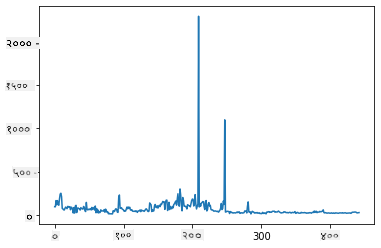
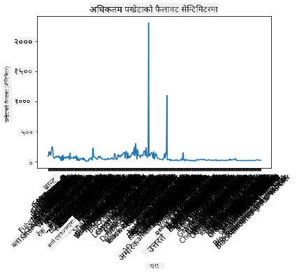
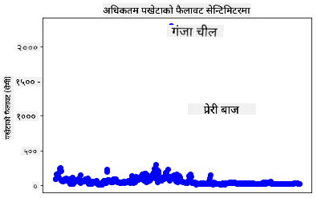
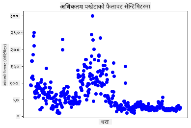
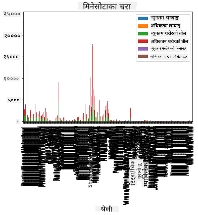
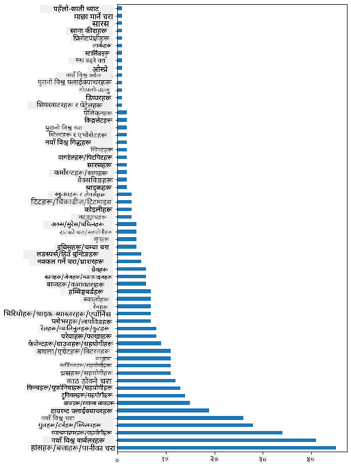
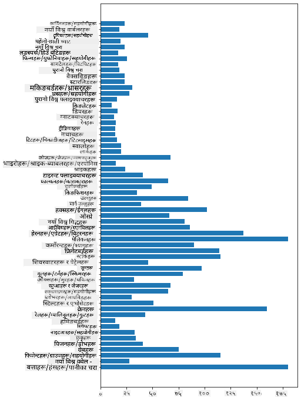
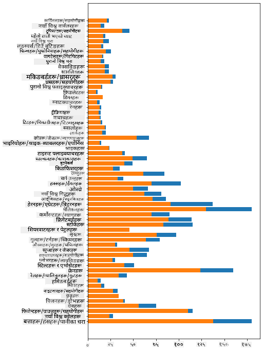

<!--
CO_OP_TRANSLATOR_METADATA:
{
  "original_hash": "69b32b6789a91f796ebc7a02f5575e03",
  "translation_date": "2025-09-04T17:04:28+00:00",
  "source_file": "3-Data-Visualization/09-visualization-quantities/README.md",
  "language_code": "ne"
}
-->
# परिमाणको दृश्यात्मकता

| ](../../sketchnotes/09-Visualizing-Quantities.png)|
|:---:|
| परिमाणको दृश्यात्मकता - _Sketchnote by [@nitya](https://twitter.com/nitya)_ |

यस पाठमा तपाईंले परिमाणको अवधारणालाई केन्द्रित गर्दै रोचक दृश्यात्मकता सिर्जना गर्नका लागि उपलब्ध धेरै Python पुस्तकालयहरू मध्ये एकको प्रयोग गर्न सिक्नुहुनेछ। मिनेसोटाका चराहरूको सफा गरिएको डेटासेट प्रयोग गरेर, तपाईं स्थानीय वन्यजन्तुका बारेमा धेरै रोचक तथ्यहरू जान्न सक्नुहुन्छ।  
## [पाठ अघि क्विज](https://purple-hill-04aebfb03.1.azurestaticapps.net/quiz/16)

## Matplotlib प्रयोग गरेर पखेटाको फैलावट अवलोकन गर्नुहोस्

सरल र जटिल प्रकारका प्लट र चार्टहरू सिर्जना गर्नका लागि उत्कृष्ट पुस्तकालय [Matplotlib](https://matplotlib.org/stable/index.html) हो। सामान्य रूपमा, यी पुस्तकालयहरू प्रयोग गरेर डेटा प्लट गर्ने प्रक्रिया समावेश गर्दछ: तपाईंको डेटा फ्रेमको लक्षित भागहरू पहिचान गर्नुहोस्, आवश्यक परिमार्जनहरू गर्नुहोस्, यसको x र y अक्ष मानहरू निर्धारण गर्नुहोस्, कुन प्रकारको प्लट देखाउने निर्णय गर्नुहोस्, र त्यसपछि प्लट देखाउनुहोस्। Matplotlib ले दृश्यात्मकताको ठूलो विविधता प्रदान गर्दछ, तर यस पाठका लागि, परिमाणको दृश्यात्मकता गर्न उपयुक्त चार्टहरूमा ध्यान केन्द्रित गरौं: लाइन चार्ट, स्क्याटरप्लट, र बार प्लट।

> ✅ तपाईंको डेटा संरचना र तपाईंले भन्न चाहेको कथालाई उपयुक्त चार्ट प्रयोग गर्नुहोस्।  
> - समयको साथ प्रवृत्ति विश्लेषण गर्न: लाइन  
> - मानहरूको तुलना गर्न: बार, स्तम्भ, पाई, स्क्याटरप्लट  
> - भागहरू सम्पूर्णसँग कसरी सम्बन्धित छन् देखाउन: पाई  
> - डेटा वितरण देखाउन: स्क्याटरप्लट, बार  
> - प्रवृत्ति देखाउन: लाइन, स्तम्भ  
> - मानहरू बीचको सम्बन्ध देखाउन: लाइन, स्क्याटरप्लट, बबल  

यदि तपाईंसँग डेटासेट छ र कुनै वस्तुको कति मात्रा समावेश छ भनेर पत्ता लगाउन आवश्यक छ भने, तपाईंको पहिलो कार्य यसको मानहरू निरीक्षण गर्नु हुनेछ।  

✅ Matplotlib का लागि धेरै राम्रो 'चीट शीट' [यहाँ](https://matplotlib.org/cheatsheets/cheatsheets.pdf) उपलब्ध छन्।

## पखेटाको फैलावटको बारेमा लाइन प्लट बनाउनुहोस्

यस पाठको फोल्डरको जडमा रहेको `notebook.ipynb` फाइल खोल्नुहोस् र एउटा सेल थप्नुहोस्।  

> नोट: डेटा यस रिपोजिटरीको जडमा `/data` फोल्डरमा संग्रहित छ।  

```python
import pandas as pd
import matplotlib.pyplot as plt
birds = pd.read_csv('../../data/birds.csv')
birds.head()
```  
यो डेटा पाठ र संख्याको मिश्रण हो:

|      | नाम                          | वैज्ञानिक नाम          | श्रेणी                | क्रम         | परिवार   | वंश         | संरक्षण स्थिति      | न्यूनतम लम्बाई | अधिकतम लम्बाई | न्यूनतम शरीर भार | अधिकतम शरीर भार | न्यूनतम पखेटा फैलावट | अधिकतम पखेटा फैलावट |
| ---: | :--------------------------- | :--------------------- | :-------------------- | :----------- | :------- | :---------- | :----------------- | --------: | --------: | ----------: | ----------: | ----------: | ----------: |
|    0 | कालो-पेट भएको सिठ्ठी बतख     | Dendrocygna autumnalis | बतख/हंस/पानीपक्षी     | Anseriformes | Anatidae | Dendrocygna | LC                 |        47 |        56 |         652 |        1020 |          76 |          94 |
|    1 | Fulvous सिठ्ठी बतख           | Dendrocygna bicolor    | बतख/हंस/पानीपक्षी     | Anseriformes | Anatidae | Dendrocygna | LC                 |        45 |        53 |         712 |        1050 |          85 |          93 |
|    2 | हिउँ हंस                     | Anser caerulescens     | बतख/हंस/पानीपक्षी     | Anseriformes | Anatidae | Anser       | LC                 |        64 |        79 |        2050 |        4050 |         135 |         165 |
|    3 | Ross's हंस                   | Anser rossii           | बतख/हंस/पानीपक्षी     | Anseriformes | Anatidae | Anser       | LC                 |      57.3 |        64 |        1066 |        1567 |         113 |         116 |
|    4 | Greater white-fronted हंस    | Anser albifrons        | बतख/हंस/पानीपक्षी     | Anseriformes | Anatidae | Anser       | LC                 |        64 |        81 |        1930 |        3310 |         130 |         165 |

आउनुहोस्, यी रोचक चराहरूको अधिकतम पखेटा फैलावटको दृश्य प्राप्त गर्न आधारभूत लाइन प्लट प्रयोग गरौं।  

```python
wingspan = birds['MaxWingspan'] 
wingspan.plot()
```  
  

तपाईंले तुरुन्तै के देख्नुहुन्छ? कम्तीमा एउटा बाहिरको मान (outlier) देखिन्छ - यो पखेटा फैलावट निकै ठूलो छ! 2300 सेन्टिमिटर पखेटा फैलावट 23 मिटर बराबर हो - के मिनेसोटामा प्टेरोड्याक्टिल्स घुमिरहेका छन्? अनुसन्धान गरौं।  

Excel मा छिटो सर्ट गरेर बाहिरको मानहरू पत्ता लगाउन सकिन्छ, तर प्लटबाटै काम जारी राखौं।  

x-अक्षमा चराहरूको प्रकार देखाउन लेबलहरू थप्नुहोस्:  

```
plt.title('Max Wingspan in Centimeters')
plt.ylabel('Wingspan (CM)')
plt.xlabel('Birds')
plt.xticks(rotation=45)
x = birds['Name'] 
y = birds['MaxWingspan']

plt.plot(x, y)

plt.show()
```  
  

लेबलहरूलाई 45 डिग्रीमा घुमाए पनि धेरै पढ्न सकिने छैन। अर्को रणनीति प्रयास गरौं: केवल बाहिरको मानहरूलाई लेबल गर्नुहोस् र चार्टभित्र लेबल सेट गर्नुहोस्। स्क्याटर चार्ट प्रयोग गरेर लेबलिङको लागि थप ठाउँ बनाउनुहोस्:  

```python
plt.title('Max Wingspan in Centimeters')
plt.ylabel('Wingspan (CM)')
plt.tick_params(axis='both',which='both',labelbottom=False,bottom=False)

for i in range(len(birds)):
    x = birds['Name'][i]
    y = birds['MaxWingspan'][i]
    plt.plot(x, y, 'bo')
    if birds['MaxWingspan'][i] > 500:
        plt.text(x, y * (1 - 0.05), birds['Name'][i], fontsize=12)
    
plt.show()
```  
यहाँ के भइरहेको छ? तपाईंले `tick_params` प्रयोग गरेर तलका लेबलहरू लुकाउनुभयो र त्यसपछि तपाईंको चराहरूको डेटासेटमा लूप सिर्जना गर्नुभयो। `bo` प्रयोग गरेर साना गोलो नीलो बिन्दुहरू प्लट गर्दै, तपाईंले अधिकतम पखेटा फैलावट 500 भन्दा बढी भएको कुनै पनि चराको नाम बिन्दुको छेउमा देखाउनुभयो। तपाईंले y अक्षमा लेबललाई थोरै अफसेट गर्नुभयो (`y * (1 - 0.05)`) र चराको नामलाई लेबलको रूपमा प्रयोग गर्नुभयो।  

तपाईंले के पत्ता लगाउनुभयो?  

  

## तपाईंको डेटा फिल्टर गर्नुहोस्  

Bald Eagle र Prairie Falcon, सम्भवतः धेरै ठूला चराहरू भए पनि, गलत लेबल गरिएको देखिन्छ, अधिकतम पखेटा फैलावटमा अतिरिक्त `0` थपिएको छ। Bald Eagle को 25 मिटर पखेटा फैलावट भेट्न असम्भव छ, तर यदि भेट्नुभयो भने, कृपया हामीलाई जानकारी दिनुहोस्! आउनुहोस्, ती दुई बाहिरको मानहरू बिना नयाँ डेटाफ्रेम सिर्जना गरौं:  

```python
plt.title('Max Wingspan in Centimeters')
plt.ylabel('Wingspan (CM)')
plt.xlabel('Birds')
plt.tick_params(axis='both',which='both',labelbottom=False,bottom=False)
for i in range(len(birds)):
    x = birds['Name'][i]
    y = birds['MaxWingspan'][i]
    if birds['Name'][i] not in ['Bald eagle', 'Prairie falcon']:
        plt.plot(x, y, 'bo')
plt.show()
```  

बाहिरको मानहरू फिल्टर गरेर, तपाईंको डेटा अब अधिक सुसंगत र बुझ्न योग्य छ।  

  

अब हामीसँग पखेटा फैलावटको सन्दर्भमा सफा डेटासेट छ, आउनुहोस् यी चराहरूको बारेमा थप पत्ता लगाऔं।  

लाइन र स्क्याटर प्लटहरूले डेटा मानहरू र तिनीहरूको वितरणको बारेमा जानकारी देखाउन सक्छन्, तर हामी यस डेटासेटमा निहित मानहरूको बारेमा सोच्न चाहन्छौं। तपाईं परिमाणको बारेमा निम्न प्रश्नहरूको उत्तर दिन दृश्यात्मकता सिर्जना गर्न सक्नुहुन्छ:  

> कति प्रकारका चराहरू छन्, र तिनीहरूको संख्या कति छ?  
> कति चराहरू विलुप्त, संकटग्रस्त, दुर्लभ, वा सामान्य छन्?  
> Linnaeus को शब्दावलीमा विभिन्न वंश र क्रमहरूको संख्या कति छ?  

## बार चार्ट अन्वेषण गर्नुहोस्  

बार चार्ट डेटा समूहहरू देखाउन व्यावहारिक हुन्छ। आउनुहोस्, यस डेटासेटमा रहेका चराहरूको श्रेणी अन्वेषण गरौं ताकि कुन श्रेणी सबैभन्दा सामान्य छ भनेर थाहा पाउन सकियोस्।  

नोटबुक फाइलमा आधारभूत बार चार्ट सिर्जना गर्नुहोस्।  

✅ नोट, तपाईंले पहिचान गरिएका दुई बाहिरको चराहरूलाई फिल्टर गर्न सक्नुहुन्छ, तिनीहरूको पखेटा फैलावटमा टाइपो सम्पादन गर्न सक्नुहुन्छ, वा तिनीहरूलाई छोड्न सक्नुहुन्छ किनकि यी अभ्यासहरू पखेटा फैलावट मानहरूमा निर्भर गर्दैनन्।  

यदि तपाईं बार चार्ट सिर्जना गर्न चाहनुहुन्छ भने, तपाईंले ध्यान केन्द्रित गर्न चाहेको डेटा चयन गर्न सक्नुहुन्छ। बार चार्ट कच्चा डेटाबाट सिर्जना गर्न सकिन्छ:  

```python
birds.plot(x='Category',
        kind='bar',
        stacked=True,
        title='Birds of Minnesota')

```  
  

तर यो बार चार्ट पढ्न असम्भव छ किनकि धेरै गैर-समूहित डेटा छ। तपाईंले प्लट गर्न चाहेको डेटा मात्र चयन गर्न आवश्यक छ, त्यसैले आउनुहोस् चराहरूको श्रेणीको आधारमा तिनीहरूको लम्बाई हेर्नुहोस्।  

तपाईंको डेटा केवल चराको श्रेणी समावेश गर्न फिल्टर गर्नुहोस्।  

✅ ध्यान दिनुहोस् कि तपाईंले Pandas प्रयोग गरेर डेटा व्यवस्थापन गर्नुभयो, र त्यसपछि Matplotlib लाई चार्टिङ गर्न दिनुभयो।  

किनकि धेरै श्रेणीहरू छन्, तपाईंले यो चार्टलाई ठाडो रूपमा प्रदर्शन गर्न सक्नुहुन्छ र सबै डेटा समायोजन गर्न यसको उचाइ समायोजन गर्न सक्नुहुन्छ:  

```python
category_count = birds.value_counts(birds['Category'].values, sort=True)
plt.rcParams['figure.figsize'] = [6, 12]
category_count.plot.barh()
```  
  

यो बार चार्टले प्रत्येक श्रेणीमा चराहरूको संख्या राम्रोसँग देखाउँछ। एक झलकमा, तपाईंले देख्न सक्नुहुन्छ कि यस क्षेत्रमा सबैभन्दा धेरै चराहरू बतख/हंस/पानीपक्षी श्रेणीमा छन्। मिनेसोटा '10,000 तालहरूको भूमि' हो, त्यसैले यो आश्चर्यजनक छैन!  

✅ यस डेटासेटमा केही अन्य गणनाहरू प्रयास गर्नुहोस्। के तपाईंलाई केही चकित पार्छ?  

## डेटा तुलना गर्नुहोस्  

तपाईंले नयाँ अक्षहरू सिर्जना गरेर समूहित डेटा तुलना गर्न सक्नुहुन्छ। चराको श्रेणीको आधारमा चराको अधिकतम लम्बाईको तुलना प्रयास गर्नुहोस्:  

```python
maxlength = birds['MaxLength']
plt.barh(y=birds['Category'], width=maxlength)
plt.rcParams['figure.figsize'] = [6, 12]
plt.show()
```  
  

यहाँ केही आश्चर्यजनक छैन: ह्युमिङबर्ड्सको अधिकतम लम्बाई पेलिकन वा हंसको तुलनामा सबैभन्दा कम छ। जब डेटा तार्किक रूपमा अर्थपूर्ण हुन्छ, यो राम्रो हो!  

तपाईं बार चार्टहरूको अधिक रोचक दृश्यात्मकता सिर्जना गर्न डेटा सुपरइम्पोज गर्न सक्नुहुन्छ। आउनुहोस्, न्यूनतम र अधिकतम लम्बाईलाई दिइएको चराको श्रेणीमा सुपरइम्पोज गरौं:  

```python
minLength = birds['MinLength']
maxLength = birds['MaxLength']
category = birds['Category']

plt.barh(category, maxLength)
plt.barh(category, minLength)

plt.show()
```  
यस प्लटमा, तपाईंले न्यूनतम लम्बाई र अधिकतम लम्बाईको दायरा प्रति चराको श्रेणी देख्न सक्नुहुन्छ। तपाईं सुरक्षित रूपमा भन्न सक्नुहुन्छ कि, यो डेटाको आधारमा, चराको आकार जति ठूलो हुन्छ, यसको लम्बाई दायरा पनि त्यति नै ठूलो हुन्छ। रोचक!  

  

## 🚀 चुनौती  

यो चराको डेटासेटले विशेष पारिस्थितिक तन्त्रभित्र विभिन्न प्रकारका चराहरूको बारेमा जानकारीको खजाना प्रदान गर्दछ। इन्टरनेटमा खोजी गर्नुहोस् र अन्य चरासम्बन्धी डेटासेटहरू पत्ता लगाउनुहोस्। यी चराहरूको वरिपरि चार्ट र ग्राफहरू निर्माण गर्ने अभ्यास गर्नुहोस् ताकि तपाईंले थाहा नपाएका तथ्यहरू पत्ता लगाउन सक्नुहुन्छ।  

## [पाठ पछि क्विज](https://ff-quizzes.netlify.app/en/ds/)  

## समीक्षा र आत्म अध्ययन  

यस पहिलो पाठले तपाईंलाई परिमाणको दृश्यात्मकता गर्न Matplotlib प्रयोग गर्ने केही जानकारी दिएको छ। डेटासेटहरूसँग काम गर्ने अन्य तरिकाहरूको बारेमा अनुसन्धान गर्नुहोस्। [Plotly](https://github.com/plotly/plotly.py) एउटा हो जुन हामी यी पाठहरूमा समेट्ने छैनौं, त्यसैले यसले के प्रस्ताव गर्न सक्छ हेर्नुहोस्।  

## असाइनमेन्ट  

[लाइन, स्क्याटर, र बारहरू](assignment.md)  

---

**अस्वीकरण**:  
यो दस्तावेज़ AI अनुवाद सेवा [Co-op Translator](https://github.com/Azure/co-op-translator) प्रयोग गरेर अनुवाद गरिएको छ। हामी शुद्धताको लागि प्रयास गर्छौं, तर कृपया ध्यान दिनुहोस् कि स्वचालित अनुवादहरूमा त्रुटि वा अशुद्धता हुन सक्छ। यसको मूल भाषा मा रहेको मूल दस्तावेज़लाई आधिकारिक स्रोत मानिनुपर्छ। महत्वपूर्ण जानकारीको लागि, व्यावसायिक मानव अनुवाद सिफारिस गरिन्छ। यस अनुवादको प्रयोगबाट उत्पन्न हुने कुनै पनि गलतफहमी वा गलत व्याख्याको लागि हामी जिम्मेवार हुने छैनौं।