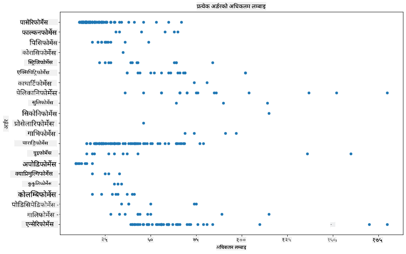
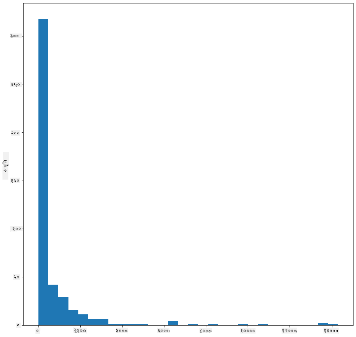
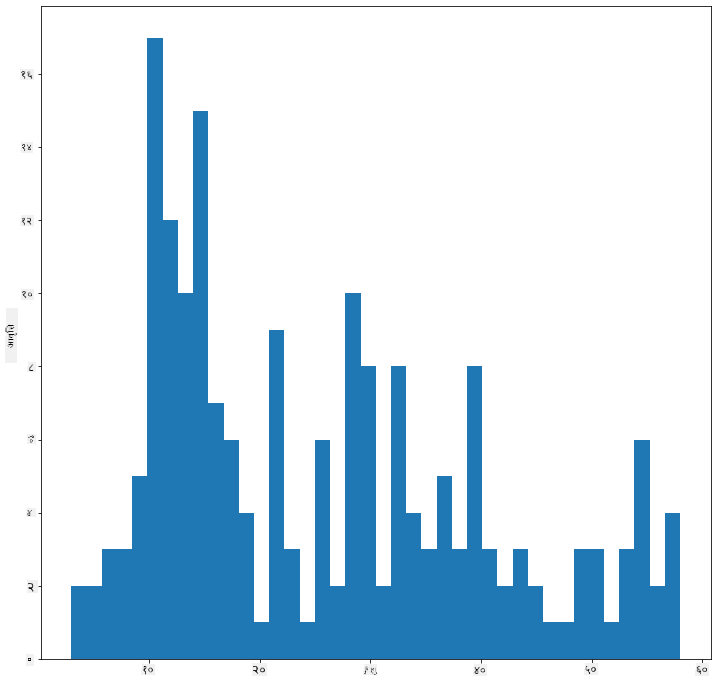
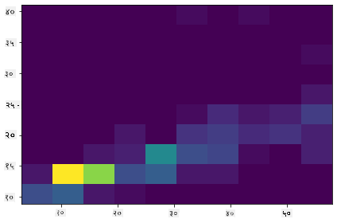
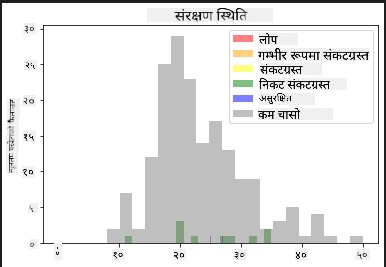
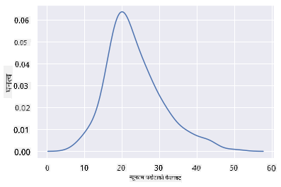
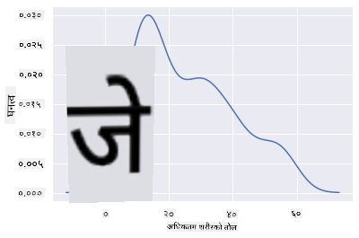
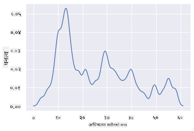
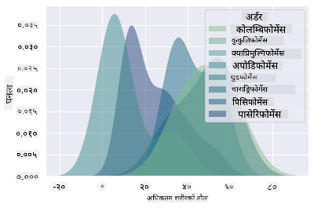
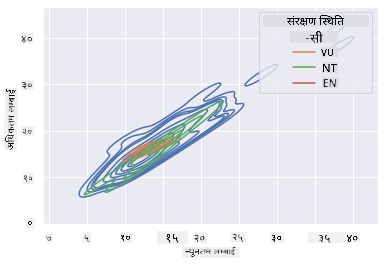

<!--
CO_OP_TRANSLATOR_METADATA:
{
  "original_hash": "02ce904bc1e2bfabb7dc05c25aae375c",
  "translation_date": "2025-09-04T17:06:12+00:00",
  "source_file": "3-Data-Visualization/10-visualization-distributions/README.md",
  "language_code": "ne"
}
-->
# वितरणहरू दृश्यात्मक बनाउने

| ](../../sketchnotes/10-Visualizing-Distributions.png)|
|:---:|
| वितरणहरू दृश्यात्मक बनाउने - _Sketchnote by [@nitya](https://twitter.com/nitya)_ |

अघिल्लो पाठमा, तपाईंले मिनेसोटाका चराहरूको बारेमा रहेको डेटासेटमा केही रोचक तथ्यहरू सिक्नुभयो। तपाईंले बाहिरिएका डाटाहरूलाई दृश्यात्मक बनाउँदै त्रुटिपूर्ण डाटा पत्ता लगाउनुभयो र चराको श्रेणीहरू बीचको भिन्नता तिनीहरूको अधिकतम लम्बाइको आधारमा हेर्नुभयो।

## [पाठ अघि क्विज](https://purple-hill-04aebfb03.1.azurestaticapps.net/quiz/18)
## चराहरूको डेटासेट अन्वेषण गर्नुहोस्

डेटामा गहिरो रूपमा जान अर्को तरिका यसको वितरण हेर्नु हो, अर्थात् डाटा कसरी अक्षमा व्यवस्थित छ। उदाहरणका लागि, तपाईं मिनेसोटाका चराहरूको अधिकतम पखेटाको फैलावट वा अधिकतम शरीरको तौलको सामान्य वितरणको बारेमा जान्न चाहनुहुन्छ होला।

आउनुहोस्, यस डेटासेटमा डाटाको वितरणको बारेमा केही तथ्यहरू पत्ता लगाउँ। _notebook.ipynb_ फाइलमा, जुन यस पाठको फोल्डरको जडमा छ, Pandas, Matplotlib, र तपाईंको डाटा आयात गर्नुहोस्:

```python
import pandas as pd
import matplotlib.pyplot as plt
birds = pd.read_csv('../../data/birds.csv')
birds.head()
```

|      | नाम                          | वैज्ञानिक नाम          | श्रेणी                | क्रम         | परिवार   | वंश         | संरक्षण स्थिति | न्यूनतम लम्बाइ | अधिकतम लम्बाइ | न्यूनतम शरीर तौल | अधिकतम शरीर तौल | न्यूनतम पखेटा फैलावट | अधिकतम पखेटा फैलावट |
| ---: | :--------------------------- | :--------------------- | :-------------------- | :----------- | :------- | :---------- | :----------------- | --------: | --------: | ----------: | ----------: | ----------: | ----------: |
|    0 | कालो-पेट भएको सिठ्ठी बतासे हाँस | Dendrocygna autumnalis | हाँस/बतासे/पानी चराहरू | Anseriformes | Anatidae | Dendrocygna | LC                 |        47 |        56 |         652 |        1020 |          76 |          94 |
|    1 | फुल्भस सिठ्ठी बतासे हाँस       | Dendrocygna bicolor    | हाँस/बतासे/पानी चराहरू | Anseriformes | Anatidae | Dendrocygna | LC                 |        45 |        53 |         712 |        1050 |          85 |          93 |
|    2 | हिउँ हाँस                   | Anser caerulescens     | हाँस/बतासे/पानी चराहरू | Anseriformes | Anatidae | Anser       | LC                 |        64 |        79 |        2050 |        4050 |         135 |         165 |
|    3 | रोसको हाँस                 | Anser rossii           | हाँस/बतासे/पानी चराहरू | Anseriformes | Anatidae | Anser       | LC                 |      57.3 |        64 |        1066 |        1567 |         113 |         116 |
|    4 | ठूलो सेतो-अगाडि भएको हाँस  | Anser albifrons        | हाँस/बतासे/पानी चराहरू | Anseriformes | Anatidae | Anser       | LC                 |        64 |        81 |        1930 |        3310 |         130 |         165 |

सामान्यतया, तपाईं डाटाको वितरणलाई छिटो हेर्न सक्नुहुन्छ स्क्याटर प्लट प्रयोग गरेर, जस्तै हामीले अघिल्लो पाठमा गरेका थियौं:

```python
birds.plot(kind='scatter',x='MaxLength',y='Order',figsize=(12,8))

plt.title('Max Length per Order')
plt.ylabel('Order')
plt.xlabel('Max Length')

plt.show()
```


यसले प्रत्येक चराको क्रम अनुसार शरीरको लम्बाइको सामान्य वितरणको झलक दिन्छ, तर यो साँचो वितरण देखाउनको लागि उत्तम तरिका होइन। यो कार्य सामान्यतया हिस्टोग्राम बनाएर गरिन्छ।

## हिस्टोग्रामसँग काम गर्ने

Matplotlib ले हिस्टोग्राम प्रयोग गरेर डाटाको वितरणलाई दृश्यात्मक बनाउने उत्कृष्ट तरिकाहरू प्रदान गर्दछ। यो प्रकारको चार्ट बार चार्ट जस्तै हो जहाँ वितरण बारहरूको उचाइ र गिरावटबाट देख्न सकिन्छ। हिस्टोग्राम बनाउनको लागि, तपाईंलाई संख्यात्मक डाटा चाहिन्छ। हिस्टोग्राम बनाउनको लागि, तपाईंले चार्टलाई 'hist' प्रकारको रूपमा परिभाषित गर्न सक्नुहुन्छ। यो चार्टले सम्पूर्ण डेटासेटको संख्यात्मक डाटाको दायराको लागि MaxBodyMass को वितरण देखाउँछ। डाटाको एरेलाई साना बिनहरूमा विभाजन गरेर, यसले डाटाको मानहरूको वितरण देखाउन सक्छ:

```python
birds['MaxBodyMass'].plot(kind = 'hist', bins = 10, figsize = (12,12))
plt.show()
```


जस्तो देखिन्छ, यस डेटासेटका 400+ चराहरूको अधिकांश Max Body Mass 2000 भन्दा कमको दायरामा पर्दछ। `bins` प्यारामिटरलाई उच्च संख्यामा परिवर्तन गरेर डाटाको बारेमा थप जानकारी प्राप्त गर्नुहोस्, जस्तै 30:

```python
birds['MaxBodyMass'].plot(kind = 'hist', bins = 30, figsize = (12,12))
plt.show()
```


यो चार्टले वितरणलाई अलि बढी विस्तृत रूपमा देखाउँछ। कम बाँया तिर झुकिएको चार्ट बनाउनको लागि, तपाईंले निश्चित दायराभित्रको डाटा मात्र चयन गर्न सुनिश्चित गर्न सक्नुहुन्छ:

तपाईंको डाटालाई फिल्टर गर्नुहोस् र केवल ती चराहरूलाई प्राप्त गर्नुहोस् जसको शरीर तौल 60 भन्दा कम छ, र 40 `bins` देखाउनुहोस्:

```python
filteredBirds = birds[(birds['MaxBodyMass'] > 1) & (birds['MaxBodyMass'] < 60)]      
filteredBirds['MaxBodyMass'].plot(kind = 'hist',bins = 40,figsize = (12,12))
plt.show()     
```


✅ अन्य फिल्टरहरू र डाटाका बिन्दुहरू प्रयास गर्नुहोस्। डाटाको पूर्ण वितरण हेर्नको लागि, `['MaxBodyMass']` फिल्टर हटाएर लेबल गरिएको वितरणहरू देखाउनुहोस्।

हिस्टोग्रामले केही राम्रो रंग र लेबलिङ सुधारहरू पनि प्रदान गर्दछ:

दुई वितरणहरू बीचको सम्बन्ध तुलना गर्न 2D हिस्टोग्राम बनाउनुहोस्। आउनुहोस् `MaxBodyMass` र `MaxLength` तुलना गरौं। Matplotlib ले उज्यालो रंगहरू प्रयोग गरेर एकीकृतता देखाउने बिल्ट-इन तरिका प्रदान गर्दछ:

```python
x = filteredBirds['MaxBodyMass']
y = filteredBirds['MaxLength']

fig, ax = plt.subplots(tight_layout=True)
hist = ax.hist2d(x, y)
```
जस्तो देखिन्छ, यी दुई तत्वहरू बीच अपेक्षित अक्षमा एक अपेक्षित सम्बन्ध छ, एक विशेष रूपमा बलियो एकीकृत बिन्दु सहित:



हिस्टोग्रामहरू संख्यात्मक डाटाको लागि डिफल्ट रूपमा राम्रोसँग काम गर्छन्। यदि तपाईंले पाठ डाटाको अनुसार वितरणहरू हेर्न आवश्यक छ भने के गर्ने? 
## पाठ डाटाको प्रयोग गरेर डेटासेटको वितरण अन्वेषण गर्नुहोस् 

यस डेटासेटमा चराको श्रेणी, वंश, प्रजाति, र परिवारको साथै यसको संरक्षण स्थिति बारे राम्रो जानकारी पनि समावेश छ। आउनुहोस् यस संरक्षण जानकारीलाई अन्वेषण गरौं। चराहरूको संरक्षण स्थितिको अनुसार वितरण के हो?

> ✅ डेटासेटमा, संरक्षण स्थितिलाई वर्णन गर्न विभिन्न संक्षेप शब्दहरू प्रयोग गरिएका छन्। यी संक्षेप शब्दहरू [IUCN रेड लिस्ट श्रेणीहरू](https://www.iucnredlist.org/) बाट आएका हुन्, एक संगठन जसले प्रजातिहरूको स्थितिलाई सूचीबद्ध गर्दछ।
> 
> - CR: अत्यधिक संकटग्रस्त
> - EN: संकटग्रस्त
> - EX: विलुप्त
> - LC: न्यूनतम चिन्ता
> - NT: निकट संकटग्रस्त
> - VU: कमजोर

यी पाठ-आधारित मानहरू हुन् त्यसैले तपाईंले हिस्टोग्राम बनाउन परिवर्तन गर्न आवश्यक छ। FilteredBirds डेटाफ्रेम प्रयोग गरेर यसको संरक्षण स्थिति र न्यूनतम पखेटा फैलावट देखाउनुहोस्। तपाईं के देख्नुहुन्छ?

```python
x1 = filteredBirds.loc[filteredBirds.ConservationStatus=='EX', 'MinWingspan']
x2 = filteredBirds.loc[filteredBirds.ConservationStatus=='CR', 'MinWingspan']
x3 = filteredBirds.loc[filteredBirds.ConservationStatus=='EN', 'MinWingspan']
x4 = filteredBirds.loc[filteredBirds.ConservationStatus=='NT', 'MinWingspan']
x5 = filteredBirds.loc[filteredBirds.ConservationStatus=='VU', 'MinWingspan']
x6 = filteredBirds.loc[filteredBirds.ConservationStatus=='LC', 'MinWingspan']

kwargs = dict(alpha=0.5, bins=20)

plt.hist(x1, **kwargs, color='red', label='Extinct')
plt.hist(x2, **kwargs, color='orange', label='Critically Endangered')
plt.hist(x3, **kwargs, color='yellow', label='Endangered')
plt.hist(x4, **kwargs, color='green', label='Near Threatened')
plt.hist(x5, **kwargs, color='blue', label='Vulnerable')
plt.hist(x6, **kwargs, color='gray', label='Least Concern')

plt.gca().set(title='Conservation Status', ylabel='Min Wingspan')
plt.legend();
```



न्यूनतम पखेटा फैलावट र संरक्षण स्थितिको बीचमा राम्रो सम्बन्ध देखिँदैन। यस विधि प्रयोग गरेर डेटासेटका अन्य तत्वहरू परीक्षण गर्नुहोस्। तपाईं विभिन्न फिल्टरहरू पनि प्रयास गर्न सक्नुहुन्छ। के तपाईं कुनै सम्बन्ध पाउनुहुन्छ?

## घनत्व प्लटहरू

तपाईंले देख्नुभएको हुन सक्छ कि अहिलेसम्मका हिस्टोग्रामहरू 'स्टेप्ड' छन् र चिल्लो रूपमा आर्कमा प्रवाह गर्दैनन्। चिल्लो घनत्व चार्ट देखाउन, तपाईं घनत्व प्लट प्रयास गर्न सक्नुहुन्छ।

घनत्व प्लटहरूसँग काम गर्नको लागि, नयाँ प्लटिङ लाइब्रेरी [Seaborn](https://seaborn.pydata.org/generated/seaborn.kdeplot.html) सँग परिचित हुनुहोस्। 

Seaborn लोड गर्दै, आधारभूत घनत्व प्लट प्रयास गर्नुहोस्:

```python
import seaborn as sns
import matplotlib.pyplot as plt
sns.kdeplot(filteredBirds['MinWingspan'])
plt.show()
```


तपाईंले देख्न सक्नुहुन्छ कि न्यूनतम पखेटा फैलावट डाटाको लागि प्लटले अघिल्लो चार्टलाई प्रतिध्वनित गर्दछ; यो केवल अलि चिल्लो छ। Seaborn को दस्तावेज अनुसार, "हिस्टोग्रामको तुलनामा, KDE ले कम अव्यवस्थित र बढी व्याख्यात्मक प्लट उत्पादन गर्न सक्छ, विशेष गरी जब धेरै वितरणहरू कोर्दै। तर यसले विकृतिहरू ल्याउन सक्छ यदि अन्तर्निहित वितरण सीमित वा चिल्लो छैन। हिस्टोग्राम जस्तै, प्रतिनिधित्वको गुणस्तर पनि राम्रो चिल्लो प्यारामिटरहरूको चयनमा निर्भर गर्दछ।" [स्रोत](https://seaborn.pydata.org/generated/seaborn.kdeplot.html) अन्य शब्दमा, बाहिरिएका डाटाहरूले सधैं तपाईंको चार्टलाई खराब बनाउँछन्।

यदि तपाईंले दोस्रो चार्टमा बनाएको जंगली MaxBodyMass लाइनलाई पुनः हेर्न चाहनुभयो भने, तपाईं यस विधि प्रयोग गरेर यसलाई धेरै राम्रोसँग चिल्लो बनाउन सक्नुहुन्छ:

```python
sns.kdeplot(filteredBirds['MaxBodyMass'])
plt.show()
```


यदि तपाईंले चिल्लो तर धेरै चिल्लो नभएको लाइन चाहनुभयो भने, `bw_adjust` प्यारामिटर सम्पादन गर्नुहोस्:

```python
sns.kdeplot(filteredBirds['MaxBodyMass'], bw_adjust=.2)
plt.show()
```


✅ यस प्रकारको प्लटको लागि उपलब्ध प्यारामिटरहरूको बारेमा पढ्नुहोस् र प्रयोग गर्नुहोस्!

यो प्रकारको चार्टले सुन्दर व्याख्यात्मक दृश्यहरू प्रदान गर्दछ। उदाहरणका लागि, केही लाइनहरूको कोड प्रयोग गरेर, तपाईं प्रत्येक चराको क्रम अनुसार अधिकतम शरीर तौल घनत्व देखाउन सक्नुहुन्छ:

```python
sns.kdeplot(
   data=filteredBirds, x="MaxBodyMass", hue="Order",
   fill=True, common_norm=False, palette="crest",
   alpha=.5, linewidth=0,
)
```



तपाईं एक चार्टमा धेरै भेरिएबलहरूको घनत्व पनि म्याप गर्न सक्नुहुन्छ। चराको संरक्षण स्थितिको तुलनामा MaxLength र MinLength परीक्षण गर्नुहोस्:

```python
sns.kdeplot(data=filteredBirds, x="MinLength", y="MaxLength", hue="ConservationStatus")
```



शायद 'कमजोर' चराहरूको लम्बाइको आधारमा क्लस्टर अर्थपूर्ण छ कि छैन भनेर अनुसन्धान गर्न लायक छ।

## 🚀 चुनौती

हिस्टोग्रामहरू आधारभूत स्क्याटरप्लट, बार चार्ट, वा लाइन चार्टभन्दा बढी परिष्कृत प्रकारका चार्ट हुन्। इन्टरनेटमा खोजी गरेर हिस्टोग्रामको प्रयोगका राम्रो उदाहरणहरू खोज्नुहोस्। तिनीहरू कसरी प्रयोग गरिन्छन्, तिनीहरूले के प्रदर्शन गर्छन्, र कुन क्षेत्रहरू वा अनुसन्धानका क्षेत्रमा तिनीहरू प्रायः प्रयोग गरिन्छन्?

## [पाठ पछि क्विज](https://ff-quizzes.netlify.app/en/ds/)

## समीक्षा र आत्म अध्ययन

यस पाठमा, तपाईंले Matplotlib प्रयोग गर्नुभयो र Seaborn प्रयोग गर्न सुरु गर्नुभयो ताकि अधिक परिष्कृत चार्टहरू देखाउन सकियोस्। Seaborn मा `kdeplot` को बारेमा अनुसन्धान गर्नुहोस्, एक "एक वा धेरै आयामहरूमा निरन्तर सम्भाव्यता घनत्व वक्र"। [दस्तावेज](https://seaborn.pydata.org/generated/seaborn.kdeplot.html) पढेर यसले कसरी काम गर्छ बुझ्नुहोस्।

## असाइनमेन्ट

[आफ्नो सीप लागू गर्नुहोस्](assignment.md)

---

**अस्वीकरण**:  
यो दस्तावेज़ AI अनुवाद सेवा [Co-op Translator](https://github.com/Azure/co-op-translator) प्रयोग गरेर अनुवाद गरिएको छ। हामी शुद्धताको लागि प्रयास गर्छौं, तर कृपया ध्यान दिनुहोस् कि स्वचालित अनुवादहरूमा त्रुटि वा अशुद्धता हुन सक्छ। यसको मूल भाषा मा रहेको मूल दस्तावेज़लाई आधिकारिक स्रोत मानिनुपर्छ। महत्वपूर्ण जानकारीको लागि, व्यावसायिक मानव अनुवाद सिफारिस गरिन्छ। यस अनुवादको प्रयोगबाट उत्पन्न हुने कुनै पनि गलतफहमी वा गलत व्याख्याको लागि हामी जिम्मेवार हुने छैनौं।