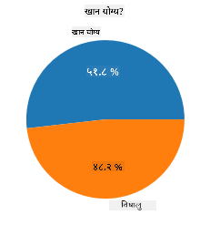
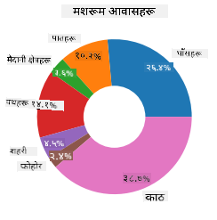
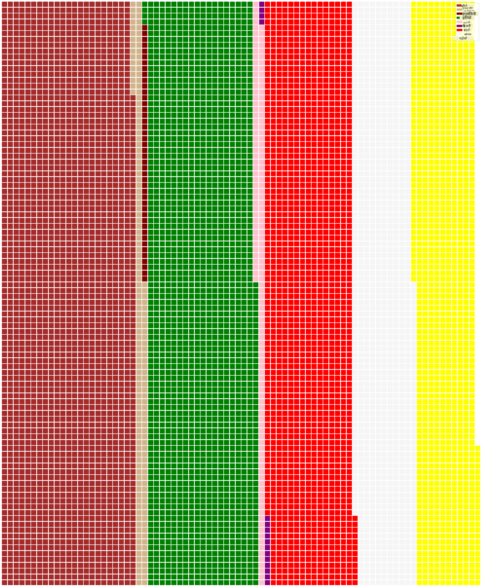

<!--
CO_OP_TRANSLATOR_METADATA:
{
  "original_hash": "af6a12015c6e250e500b570a9fa42593",
  "translation_date": "2025-08-27T18:43:15+00:00",
  "source_file": "3-Data-Visualization/11-visualization-proportions/README.md",
  "language_code": "ne"
}
-->
# अनुपातहरू देखाउने

| ](../../sketchnotes/11-Visualizing-Proportions.png)|
|:---:|
|अनुपातहरू देखाउने - _Sketchnote by [@nitya](https://twitter.com/nitya)_ |

यस पाठमा, तपाईंले प्रकृतिमा आधारित अर्को डेटासेट प्रयोग गरेर अनुपातहरू देखाउनुहुनेछ, जस्तै च्याउको डेटासेटमा विभिन्न प्रकारका फङ्गसहरूको संख्या। आउनुहोस्, यी रोचक फङ्गसहरूको अध्ययन गरौं, जुन Audubon बाट लिइएको डेटासेट हो, जसमा Agaricus र Lepiota परिवारका 23 प्रजातिहरूको विवरण छ। तपाईं स्वादिष्ट चार्टहरू प्रयोग गरेर प्रयोग गर्नुहुनेछ, जस्तै:

- पाई चार्ट 🥧
- डोनट चार्ट 🍩
- वाफल चार्ट 🧇

> 💡 माइक्रोसफ्ट रिसर्चद्वारा बनाइएको [Charticulator](https://charticulator.com) नामक एक रोचक परियोजनाले डेटा भिजुअलाइजेसनका लागि निःशुल्क ड्र्याग र ड्रप इन्टरफेस प्रदान गर्दछ। उनीहरूको एउटा ट्युटोरियलमा पनि यो च्याउको डेटासेट प्रयोग गरिएको छ! त्यसैले तपाईं डेटा अन्वेषण गर्न र पुस्तकालय सिक्न सक्नुहुन्छ: [Charticulator ट्युटोरियल](https://charticulator.com/tutorials/tutorial4.html)।

## [पाठ अघि क्विज](https://purple-hill-04aebfb03.1.azurestaticapps.net/quiz/20)

## तपाईंको च्याउलाई चिन्नुहोस् 🍄

च्याउहरू धेरै रोचक हुन्छन्। आउनुहोस्, तिनीहरूको अध्ययन गर्न डेटासेट आयात गरौं:

```python
import pandas as pd
import matplotlib.pyplot as plt
mushrooms = pd.read_csv('../../data/mushrooms.csv')
mushrooms.head()
```
एक तालिका प्रिन्ट हुन्छ जसमा विश्लेषणका लागि उत्कृष्ट डेटा हुन्छ:

| वर्ग       | टोपीको आकार | टोपीको सतह | टोपीको रंग | चोटपटक | गन्ध    | गिलको जडान | गिलको दूरी | गिलको आकार | गिलको रंग | डाँठको आकार | डाँठको जरा | डाँठको सतह-रिंगमाथि | डाँठको सतह-रिंगमुनि | डाँठको रंग-रिंगमाथि | डाँठको रंग-रिंगमुनि | आवरण प्रकार | आवरण रंग | रिंग संख्या | रिंग प्रकार | स्पोर प्रिन्ट रंग | जनसंख्या | आवास |
| --------- | --------- | ----------- | --------- | ------- | ------- | --------------- | ------------ | --------- | ---------- | ----------- | ---------- | ------------------------ | ------------------------ | ---------------------- | ---------------------- | --------- | ---------- | ----------- | --------- | ----------------- | ---------- | ------- |
| विषाक्त    | उभिएको    | चिल्लो      | खैरो     | चोटपटक | तीखो   | स्वतन्त्र       | नजिक         | साँघुरो    | कालो       | बढ्दै       | समान      | चिल्लो                   | चिल्लो                   | सेतो                  | सेतो                  | आंशिक     | सेतो      | एक         | झुन्डिएको   | कालो             | छरिएको    | शहरी   |
| खानेयोग्य | उभिएको    | चिल्लो      | पहेंलो   | चोटपटक | बदाम   | स्वतन्त्र       | नजिक         | चौडा       | कालो       | बढ्दै       | क्लब      | चिल्लो                   | चिल्लो                   | सेतो                  | सेतो                  | आंशिक     | सेतो      | एक         | झुन्डिएको   | खैरो             | धेरै      | घाँस |
| खानेयोग्य | घण्टी      | चिल्लो      | सेतो     | चोटपटक | सौंफ   | स्वतन्त्र       | नजिक         | चौडा       | खैरो       | बढ्दै       | क्लब      | चिल्लो                   | चिल्लो                   | सेतो                  | सेतो                  | आंशिक     | सेतो      | एक         | झुन्डिएको   | खैरो             | धेरै      | मैदान |
| विषाक्त    | उभिएको    | खस्रो       | सेतो     | चोटपटक | तीखो   | स्वतन्त्र       | नजिक         | साँघुरो    | खैरो       | बढ्दै       | समान      | चिल्लो                   | चिल्लो                   | सेतो                  | सेतो                  | आंशिक     | सेतो      | एक         | झुन्डिएको   | कालो             | छरिएको    | शहरी   |

तुरुन्तै, तपाईंले देख्नुहुन्छ कि सबै डेटा पाठ्यात्मक छ। तपाईंले यसलाई चार्टमा प्रयोग गर्न सक्षम हुन रूपान्तरण गर्नुपर्नेछ। वास्तवमा, अधिकांश डेटा वस्तुको रूपमा प्रस्तुत गरिएको छ:

```python
print(mushrooms.select_dtypes(["object"]).columns)
```

आउटपुट:

```output
Index(['class', 'cap-shape', 'cap-surface', 'cap-color', 'bruises', 'odor',
       'gill-attachment', 'gill-spacing', 'gill-size', 'gill-color',
       'stalk-shape', 'stalk-root', 'stalk-surface-above-ring',
       'stalk-surface-below-ring', 'stalk-color-above-ring',
       'stalk-color-below-ring', 'veil-type', 'veil-color', 'ring-number',
       'ring-type', 'spore-print-color', 'population', 'habitat'],
      dtype='object')
```
यस डेटालाई लिई 'वर्ग' स्तम्भलाई श्रेणीमा रूपान्तरण गर्नुहोस्:

```python
cols = mushrooms.select_dtypes(["object"]).columns
mushrooms[cols] = mushrooms[cols].astype('category')
```

```python
edibleclass=mushrooms.groupby(['class']).count()
edibleclass
```

अब, यदि तपाईं च्याउको डेटा प्रिन्ट गर्नुहुन्छ भने, तपाईं देख्न सक्नुहुन्छ कि यो विषाक्त/खानेयोग्य वर्ग अनुसार श्रेणीहरूमा समूह गरिएको छ:

|           | टोपीको आकार | टोपीको सतह | टोपीको रंग | चोटपटक | गन्ध | गिलको जडान | गिलको दूरी | गिलको आकार | गिलको रंग | डाँठको आकार | ... | डाँठको सतह-रिंगमुनि | डाँठको रंग-रिंगमाथि | डाँठको रंग-रिंगमुनि | आवरण प्रकार | आवरण रंग | रिंग संख्या | रिंग प्रकार | स्पोर प्रिन्ट रंग | जनसंख्या | आवास |
| --------- | --------- | ----------- | --------- | ------- | ---- | --------------- | ------------ | --------- | ---------- | ----------- | --- | ------------------------ | ---------------------- | ---------------------- | --------- | ---------- | ----------- | --------- | ----------------- | ---------- | ------- |
| वर्ग       |           |             |           |         |      |                 |              |           |            |             |     |                          |                        |                        |           |            |             |           |                   |            |         |
| खानेयोग्य | 4208      | 4208        | 4208      | 4208    | 4208 | 4208            | 4208         | 4208      | 4208       | 4208        | ... | 4208                     | 4208                   | 4208                   | 4208      | 4208       | 4208        | 4208      | 4208              | 4208       | 4208    |
| विषाक्त    | 3916      | 3916        | 3916      | 3916    | 3916 | 3916            | 3916         | 3916      | 3916       | 3916        | ... | 3916                     | 3916                   | 3916                   | 3916      | 3916       | 3916        | 3916      | 3916              | 3916       | 3916    |

यदि तपाईंले यस तालिकामा प्रस्तुत गरिएको क्रमलाई पालना गरेर वर्ग श्रेणी लेबलहरू सिर्जना गर्नुभयो भने, तपाईं पाई चार्ट बनाउन सक्नुहुन्छ:

## पाई!

```python
labels=['Edible','Poisonous']
plt.pie(edibleclass['population'],labels=labels,autopct='%.1f %%')
plt.title('Edible?')
plt.show()
```
हेर्नुहोस्, पाई चार्टले च्याउको दुई वर्ग अनुसार अनुपात देखाउँछ। यहाँ लेबलहरूको क्रम सही राख्नु महत्त्वपूर्ण छ, त्यसैले लेबल एरे निर्माण गर्दा क्रम जाँच गर्न निश्चित गर्नुहोस्!



## डोनट!

पाई चार्टको तुलनामा अलि बढी आकर्षक चार्ट डोनट चार्ट हो, जसमा बीचमा प्वाल हुन्छ। आउनुहोस्, हाम्रो डेटा यस विधिबाट हेर्नुहोस्।

च्याउहरू विभिन्न आवासहरूमा बढ्छन्। ती आवासहरूको अध्ययन गरौं:

```python
habitat=mushrooms.groupby(['habitat']).count()
habitat
```
यहाँ, तपाईं आफ्नो डेटालाई आवास अनुसार समूह गर्दै हुनुहुन्छ। 7 सूचीबद्ध छन्, त्यसैले ती डोनट चार्टका लागि लेबलको रूपमा प्रयोग गर्नुहोस्:

```python
labels=['Grasses','Leaves','Meadows','Paths','Urban','Waste','Wood']

plt.pie(habitat['class'], labels=labels,
        autopct='%1.1f%%', pctdistance=0.85)
  
center_circle = plt.Circle((0, 0), 0.40, fc='white')
fig = plt.gcf()

fig.gca().add_artist(center_circle)
  
plt.title('Mushroom Habitats')
  
plt.show()
```



यस कोडले चार्ट र केन्द्र सर्कल बनाउँछ, त्यसपछि चार्टमा केन्द्र सर्कल थप्छ। केन्द्र सर्कलको चौडाइ परिवर्तन गर्न `0.40` लाई अर्को मानमा परिवर्तन गर्नुहोस्।

डोनट चार्टहरू विभिन्न तरिकामा परिमार्जन गर्न सकिन्छ। विशेष गरी लेबलहरू पढ्न सजिलो बनाउन हाइलाइट गर्न सकिन्छ। थप जानकारीका लागि [डक्स](https://matplotlib.org/stable/gallery/pie_and_polar_charts/pie_and_donut_labels.html?highlight=donut) हेर्नुहोस्।

अब तपाईंले आफ्नो डेटालाई समूह गर्न र त्यसलाई पाई वा डोनटको रूपमा देखाउन सिक्नुभयो, तपाईं अन्य प्रकारका चार्टहरू अन्वेषण गर्न सक्नुहुन्छ। वाफल चार्ट प्रयास गर्नुहोस्, जुन मात्राको अन्वेषण गर्ने अर्को तरिका हो।

## वाफल!

'वाफल' प्रकारको चार्ट मात्रालाई 2D वर्गहरूको एरेको रूपमा देखाउने फरक तरिका हो। यस डेटासेटमा च्याउको टोपीको रंगहरूको विभिन्न मात्राहरू देखाउन प्रयास गर्नुहोस्। यसका लागि, तपाईंले [PyWaffle](https://pypi.org/project/pywaffle/) नामक सहायक पुस्तकालय स्थापना गर्नुपर्नेछ र Matplotlib प्रयोग गर्नुपर्नेछ:

```python
pip install pywaffle
```

तपाईंको डेटाको खण्ड चयन गर्नुहोस्:

```python
capcolor=mushrooms.groupby(['cap-color']).count()
capcolor
```

लेबलहरू सिर्जना गरेर र आफ्नो डेटालाई समूह गरेर वाफल चार्ट बनाउनुहोस्:

```python
import pandas as pd
import matplotlib.pyplot as plt
from pywaffle import Waffle
  
data ={'color': ['brown', 'buff', 'cinnamon', 'green', 'pink', 'purple', 'red', 'white', 'yellow'],
    'amount': capcolor['class']
     }
  
df = pd.DataFrame(data)
  
fig = plt.figure(
    FigureClass = Waffle,
    rows = 100,
    values = df.amount,
    labels = list(df.color),
    figsize = (30,30),
    colors=["brown", "tan", "maroon", "green", "pink", "purple", "red", "whitesmoke", "yellow"],
)
```

वाफल चार्ट प्रयोग गरेर, तपाईं च्याउको टोपीको रंगहरूको अनुपात स्पष्ट रूपमा देख्न सक्नुहुन्छ। रोचक कुरा, धेरै हरियो टोपी भएका च्याउहरू छन्!



✅ PyWaffle ले [Font Awesome](https://fontawesome.com/) मा उपलब्ध कुनै पनि आइकन प्रयोग गरेर चार्टहरूमा आइकनहरू समर्थन गर्दछ। वर्गहरूको सट्टा आइकन प्रयोग गरेर अझ रोचक वाफल चार्ट बनाउन केही प्रयोगहरू गर्नुहोस्।

यस पाठमा, तपाईंले अनुपातहरू देखाउने तीन तरिकाहरू सिक्नुभयो। पहिलो, तपाईंले आफ्नो डेटालाई श्रेणीहरूमा समूह गर्नुपर्नेछ र त्यसपछि डेटा देखाउन सबैभन्दा राम्रो तरिका निर्णय गर्नुपर्नेछ - पाई, डोनट, वा वाफल। सबै स्वादिष्ट छन् र प्रयोगकर्तालाई डेटासेटको झलक प्रदान गर्छन्।

## 🚀 चुनौती

[Charticulator](https://charticulator.com) मा यी स्वादिष्ट चार्टहरू पुनः सिर्जना गर्न प्रयास गर्नुहोस्।
## [पाठ पछि क्विज](https://purple-hill-04aebfb03.1.azurestaticapps.net/quiz/21)

## समीक्षा र आत्म अध्ययन

कहिलेकाहीं पाई, डोनट, वा वाफल चार्ट कहिले प्रयोग गर्ने स्पष्ट हुँदैन। यस विषयमा पढ्नका लागि केही लेखहरू यहाँ छन्:

https://www.beautiful.ai/blog/battle-of-the-charts-pie-chart-vs-donut-chart

https://medium.com/@hypsypops/pie-chart-vs-donut-chart-showdown-in-the-ring-5d24fd86a9ce

https://www.mit.edu/~mbarker/formula1/f1help/11-ch-c6.htm

https://medium.datadriveninvestor.com/data-visualization-done-the-right-way-with-tableau-waffle-chart-fdf2a19be402

थप जानकारीका लागि अनुसन्धान गर्नुहोस्।

## असाइनमेन्ट

[Excel मा प्रयास गर्नुहोस्](assignment.md)

---

**अस्वीकरण**:  
यो दस्तावेज़ AI अनुवाद सेवा [Co-op Translator](https://github.com/Azure/co-op-translator) प्रयोग गरी अनुवाद गरिएको हो। हामी यथासम्भव शुद्धताको प्रयास गर्छौं, तर कृपया ध्यान दिनुहोस् कि स्वचालित अनुवादमा त्रुटिहरू वा अशुद्धताहरू हुन सक्छन्। यसको मूल भाषामा रहेको मूल दस्तावेज़लाई आधिकारिक स्रोत मानिनुपर्छ। महत्वपूर्ण जानकारीका लागि, व्यावसायिक मानव अनुवाद सिफारिस गरिन्छ। यस अनुवादको प्रयोगबाट उत्पन्न हुने कुनै पनि गलतफहमी वा गलत व्याख्याका लागि हामी जिम्मेवार हुने छैनौं।