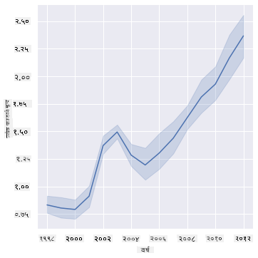
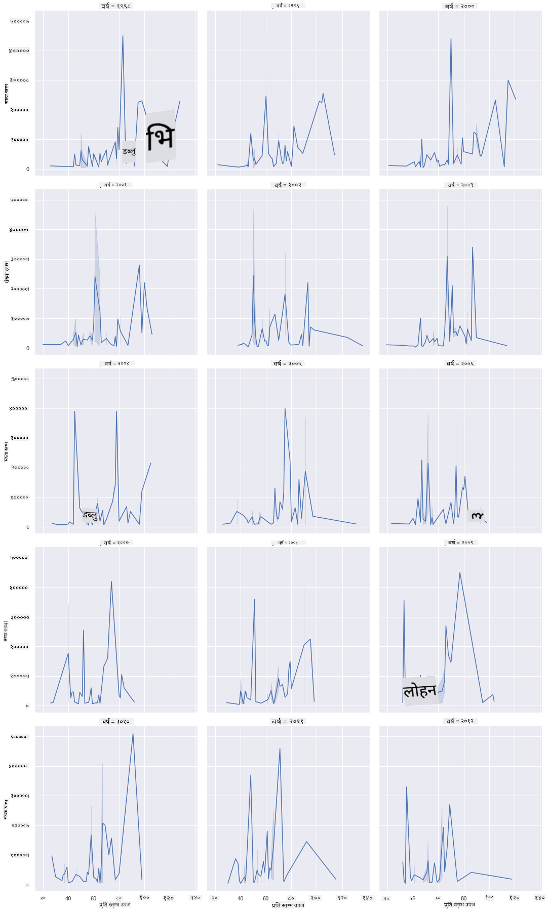
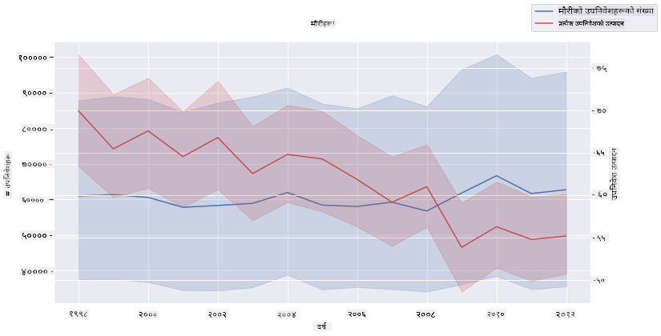

<!--
CO_OP_TRANSLATOR_METADATA:
{
  "original_hash": "cad419b574d5c35eaa417e9abfdcb0c8",
  "translation_date": "2025-08-27T18:20:11+00:00",
  "source_file": "3-Data-Visualization/12-visualization-relationships/README.md",
  "language_code": "ne"
}
-->
# सम्बन्धहरू देखाउने: महको कथा 🍯

| ](../../sketchnotes/12-Visualizing-Relationships.png)|
|:---:|
|सम्बन्धहरू देखाउने - _Sketchnote by [@nitya](https://twitter.com/nitya)_ |

हाम्रो अनुसन्धानको प्रकृतिमा आधारित विषयलाई निरन्तरता दिँदै, विभिन्न प्रकारका महहरू बीचको सम्बन्ध देखाउन रोचक दृश्यहरू पत्ता लगाऔं, जुन [संयुक्त राज्य कृषि विभाग](https://www.nass.usda.gov/About_NASS/index.php) बाट प्राप्त डेटासेटमा आधारित छ। 

यो करिब ६०० वस्तुहरूको डेटासेटले धेरै अमेरिकी राज्यहरूमा मह उत्पादन देखाउँछ। उदाहरणका लागि, तपाईंले १९९८-२०१२ को अवधिमा कुनै राज्यको मह उत्पादन, प्रति उपनिवेश उत्पादन, कुल उत्पादन, स्टक, प्रति पाउन्ड मूल्य, र महको मूल्य हेर्न सक्नुहुन्छ, प्रत्येक वर्षको लागि प्रत्येक राज्यको एक पङ्क्ति सहित। 

कुनै राज्यको वार्षिक उत्पादन र त्यस राज्यको महको मूल्य बीचको सम्बन्ध देखाउन यो रोचक हुनेछ। वैकल्पिक रूपमा, तपाईंले राज्यहरूको प्रति उपनिवेश मह उत्पादनको सम्बन्ध देखाउन सक्नुहुन्छ। यो समयावधि २००६ मा पहिलो पटक देखिएको 'सीसीडी' वा 'कोलोनी कोलाप्स डिसअर्डर' (http://npic.orst.edu/envir/ccd.html) को विनाशकारी प्रभाव समेट्छ, जसले यो अध्ययन गर्न महत्त्वपूर्ण बनाउँछ। 🐝

## [पाठ अघि क्विज](https://purple-hill-04aebfb03.1.azurestaticapps.net/quiz/22)

यस पाठमा, तपाईंले पहिले प्रयोग गरिसकेको Seaborn लाई प्रयोग गर्न सक्नुहुन्छ, जुन चरहरू बीचको सम्बन्ध देखाउन राम्रो पुस्तकालय हो। विशेष गरी, Seaborn को `relplot` कार्य प्रयोग गर्नु रोचक छ, जसले छिटो '[सांख्यिकीय सम्बन्धहरू](https://seaborn.pydata.org/tutorial/relational.html?highlight=relationships)' देखाउन स्क्याटर प्लट र लाइन प्लटहरू अनुमति दिन्छ, जसले डेटा वैज्ञानिकलाई चरहरू बीचको सम्बन्ध राम्रोसँग बुझ्न मद्दत गर्दछ।

## स्क्याटरप्लटहरू

महको मूल्य वर्ष-प्रतिवर्ष, राज्य अनुसार कसरी परिवर्तन भएको छ भन्ने देखाउन स्क्याटरप्लट प्रयोग गर्नुहोस्। Seaborn ले `relplot` प्रयोग गरेर राज्यको डेटा समूहबद्ध गर्दछ र श्रेणीगत र संख्यात्मक डेटा दुवैका लागि डेटा बिन्दुहरू देखाउँछ। 

डाटा र Seaborn आयात गरेर सुरु गरौं:

```python
import pandas as pd
import matplotlib.pyplot as plt
import seaborn as sns
honey = pd.read_csv('../../data/honey.csv')
honey.head()
```
तपाईंले देख्नुहुनेछ कि महको डेटामा वर्ष र प्रति पाउन्ड मूल्य जस्ता धेरै रोचक स्तम्भहरू छन्। यो डेटा अमेरिकी राज्य अनुसार समूहबद्ध गरेर अन्वेषण गरौं:

| state | numcol | yieldpercol | totalprod | stocks   | priceperlb | prodvalue | year |
| ----- | ------ | ----------- | --------- | -------- | ---------- | --------- | ---- |
| AL    | 16000  | 71          | 1136000   | 159000   | 0.72       | 818000    | 1998 |
| AZ    | 55000  | 60          | 3300000   | 1485000  | 0.64       | 2112000   | 1998 |
| AR    | 53000  | 65          | 3445000   | 1688000  | 0.59       | 2033000   | 1998 |
| CA    | 450000 | 83          | 37350000  | 12326000 | 0.62       | 23157000  | 1998 |
| CO    | 27000  | 72          | 1944000   | 1594000  | 0.7        | 1361000   | 1998 |

प्रति पाउन्ड महको मूल्य र यसको अमेरिकी राज्यको उत्पत्तिबीचको सम्बन्ध देखाउन एउटा आधारभूत स्क्याटरप्लट बनाउनुहोस्। `y` अक्षलाई सबै राज्यहरू देखाउन पर्याप्त अग्लो बनाउनुहोस्:

```python
sns.relplot(x="priceperlb", y="state", data=honey, height=15, aspect=.5);
```


अब, महको मूल्य वर्ष-प्रतिवर्ष कसरी परिवर्तन भएको छ भन्ने देखाउन महको रङ योजना प्रयोग गरेर उही डेटा देखाउनुहोस्। तपाईंले 'hue' प्यारामिटर थपेर यो गर्न सक्नुहुन्छ:

> ✅ Seaborn मा [रङ प्यालेटहरू](https://seaborn.pydata.org/tutorial/color_palettes.html) को बारेमा थप जान्नुहोस् - सुन्दर रेनबो रङ योजना प्रयास गर्नुहोस्!

```python
sns.relplot(x="priceperlb", y="state", hue="year", palette="YlOrBr", data=honey, height=15, aspect=.5);
```


यो रङ योजनाको परिवर्तनसँगै, तपाईंले देख्न सक्नुहुन्छ कि महको प्रति पाउन्ड मूल्यमा वर्ष-प्रतिवर्ष स्पष्ट प्रगति छ। वास्तवमा, यदि तपाईं डेटाको नमूना सेट हेर्नुहुन्छ (उदाहरणका लागि, एरिजोना राज्य), तपाईंले केही अपवादहरू बाहेक, वर्ष-प्रतिवर्ष मूल्य वृद्धि हुने ढाँचा देख्न सक्नुहुन्छ:

| state | numcol | yieldpercol | totalprod | stocks  | priceperlb | prodvalue | year |
| ----- | ------ | ----------- | --------- | ------- | ---------- | --------- | ---- |
| AZ    | 55000  | 60          | 3300000   | 1485000 | 0.64       | 2112000   | 1998 |
| AZ    | 52000  | 62          | 3224000   | 1548000 | 0.62       | 1999000   | 1999 |
| AZ    | 40000  | 59          | 2360000   | 1322000 | 0.73       | 1723000   | 2000 |
| AZ    | 43000  | 59          | 2537000   | 1142000 | 0.72       | 1827000   | 2001 |
| AZ    | 38000  | 63          | 2394000   | 1197000 | 1.08       | 2586000   | 2002 |
| AZ    | 35000  | 72          | 2520000   | 983000  | 1.34       | 3377000   | 2003 |
| AZ    | 32000  | 55          | 1760000   | 774000  | 1.11       | 1954000   | 2004 |
| AZ    | 36000  | 50          | 1800000   | 720000  | 1.04       | 1872000   | 2005 |
| AZ    | 30000  | 65          | 1950000   | 839000  | 0.91       | 1775000   | 2006 |
| AZ    | 30000  | 64          | 1920000   | 902000  | 1.26       | 2419000   | 2007 |
| AZ    | 25000  | 64          | 1600000   | 336000  | 1.26       | 2016000   | 2008 |
| AZ    | 20000  | 52          | 1040000   | 562000  | 1.45       | 1508000   | 2009 |
| AZ    | 24000  | 77          | 1848000   | 665000  | 1.52       | 2809000   | 2010 |
| AZ    | 23000  | 53          | 1219000   | 427000  | 1.55       | 1889000   | 2011 |
| AZ    | 22000  | 46          | 1012000   | 253000  | 1.79       | 1811000   | 2012 |

रङको सट्टा आकार प्रयोग गरेर यो प्रगति देखाउने अर्को तरिका हो। रङ अन्धोपन भएका प्रयोगकर्ताहरूका लागि, यो राम्रो विकल्प हुन सक्छ। मूल्य वृद्धिलाई डटको परिधि बढाएर देखाउन आफ्नो दृश्यलाई सम्पादन गर्नुहोस्:

```python
sns.relplot(x="priceperlb", y="state", size="year", data=honey, height=15, aspect=.5);
```
तपाईंले डटहरूको आकार क्रमशः बढ्दै गएको देख्न सक्नुहुन्छ।


के यो आपूर्ति र मागको साधारण मामला हो? जलवायु परिवर्तन र कोलोनी कोलाप्स जस्ता कारकहरूको कारण, के वर्ष-प्रतिवर्ष खरिदका लागि कम मह उपलब्ध छ, र त्यसैले मूल्य बढ्छ?

यस डेटासेटका केही चरहरू बीचको सम्बन्ध पत्ता लगाउन, केही लाइन चार्टहरू अन्वेषण गरौं।

## लाइन चार्टहरू

प्रश्न: के महको प्रति पाउन्ड मूल्यमा वर्ष-प्रतिवर्ष स्पष्ट वृद्धि छ? तपाईंले यो सबैभन्दा सजिलै एकल लाइन चार्ट बनाएर पत्ता लगाउन सक्नुहुन्छ:

```python
sns.relplot(x="year", y="priceperlb", kind="line", data=honey);
```
उत्तर: हो, केही अपवादहरू सहित, विशेष गरी २००३ को आसपास:



✅ Seaborn ले एकल रेखामा डेटा समग्र बनाउँदा, यो "प्रत्येक x मानमा बहु मापनहरूलाई औसत र औसतको वरिपरि ९५% विश्वास अन्तराल प्लट गरेर" देखाउँछ। [स्रोत](https://seaborn.pydata.org/tutorial/relational.html)। यो समय लाग्ने व्यवहारलाई `ci=None` थपेर अक्षम गर्न सकिन्छ।

प्रश्न: खैर, २००३ मा के हामी महको आपूर्तिमा पनि वृद्धि देख्न सक्छौं? यदि तपाईं कुल उत्पादन वर्ष-प्रतिवर्ष हेर्नुहुन्छ भने के हुन्छ?

```python
sns.relplot(x="year", y="totalprod", kind="line", data=honey);
```


उत्तर: वास्तवमा होइन। यदि तपाईं कुल उत्पादन हेर्नुहुन्छ भने, यो विशेष वर्षमा बढेको जस्तो देखिन्छ, यद्यपि सामान्य रूपमा मह उत्पादनको मात्रा ती वर्षहरूमा घट्दै गएको छ।

प्रश्न: त्यस अवस्थामा, २००३ को आसपास महको मूल्यमा भएको वृद्धि के कारण हुन सक्छ?

यो पत्ता लगाउन, तपाईंले फ्यासेट ग्रिड अन्वेषण गर्न सक्नुहुन्छ।

## फ्यासेट ग्रिडहरू

फ्यासेट ग्रिडहरूले तपाईंको डेटासेटको एउटा पक्ष (हाम्रो मामलामा, 'वर्ष' छान्न सक्नुहुन्छ ताकि धेरै फ्यासेटहरू उत्पादन नहोस्) लिन्छ। त्यसपछि Seaborn ले तपाईंको रोजेको x र y निर्देशांकहरूको लागि प्रत्येक फ्यासेटको प्लट बनाउन सक्छ, जसले सजिलो दृश्य तुलना गर्न मद्दत गर्दछ। के २००३ यस प्रकारको तुलनामा विशेष देखिन्छ?

Seaborn को [डकुमेन्टेसन](https://seaborn.pydata.org/generated/seaborn.FacetGrid.html?highlight=facetgrid#seaborn.FacetGrid) ले सिफारिस गरेअनुसार `relplot` प्रयोग गर्न जारी राखेर फ्यासेट ग्रिड बनाउनुहोस्। 

```python
sns.relplot(
    data=honey, 
    x="yieldpercol", y="numcol",
    col="year", 
    col_wrap=3,
    kind="line"
```
यस दृश्यमा, तपाईंले प्रति उपनिवेश उत्पादन र उपनिवेशहरूको संख्या वर्ष-प्रतिवर्ष, राज्य-प्रतिराज्य तुलना गर्न सक्नुहुन्छ, ३ स्तम्भहरूमा सेट गरिएको र्यापसँग:



यस डेटासेटका लागि, उपनिवेशहरूको संख्या र तिनीहरूको उत्पादनमा वर्ष-प्रतिवर्ष र राज्य-प्रतिराज्य केही विशेष देखिँदैन। के यी दुई चरहरू बीचको सम्बन्ध पत्ता लगाउन हेर्ने कुनै फरक तरिका छ?

## डुअल-लाइन प्लटहरू

Seaborn को 'despine' प्रयोग गरेर दुई लाइनप्लटहरू एकअर्काको माथि सुपरइम्पोज गरेर, र `ax.twinx` [Matplotlib बाट व्युत्पन्न](https://matplotlib.org/stable/api/_as_gen/matplotlib.axes.Axes.twinx.html) प्रयोग गरेर मल्टिलाइन प्लट प्रयास गर्नुहोस्। Twinx ले चार्टलाई x अक्ष साझा गर्न र दुई y अक्षहरू प्रदर्शन गर्न अनुमति दिन्छ। त्यसैले, प्रति उपनिवेश उत्पादन र उपनिवेशहरूको संख्या सुपरइम्पोज गरेर प्रदर्शन गर्नुहोस्:

```python
fig, ax = plt.subplots(figsize=(12,6))
lineplot = sns.lineplot(x=honey['year'], y=honey['numcol'], data=honey, 
                        label = 'Number of bee colonies', legend=False)
sns.despine()
plt.ylabel('# colonies')
plt.title('Honey Production Year over Year');

ax2 = ax.twinx()
lineplot2 = sns.lineplot(x=honey['year'], y=honey['yieldpercol'], ax=ax2, color="r", 
                         label ='Yield per colony', legend=False) 
sns.despine(right=False)
plt.ylabel('colony yield')
ax.figure.legend();
```


२००३ को आसपास आँखा झस्किने केही देखिँदैन, तर यसले हामीलाई यो पाठलाई अलि खुसीसाथ अन्त्य गर्न अनुमति दिन्छ: यद्यपि उपनिवेशहरूको संख्या घट्दै छ, उपनिवेशहरूको संख्या स्थिर हुँदैछ, यद्यपि तिनीहरूको प्रति उपनिवेश उत्पादन घट्दै छ।

जाऊ, मौरीहरू, जाऊ!

🐝❤️
## 🚀 चुनौती

यस पाठमा, तपाईंले स्क्याटरप्लट र लाइन ग्रिडहरूको अन्य प्रयोगहरू, फ्यासेट ग्रिडहरू सहित, बारेमा अलि बढी सिक्नुभयो। यी प्रविधिहरू प्रयोग गरेर बनाउनु पर्ने ग्रिडहरूको संख्या प्रति विचार गर्न आवश्यक छ। चुनौतीस्वरूप, कुनै फरक डेटासेट प्रयोग गरेर फ्यासेट ग्रिड बनाउनुहोस्, सायद तपाईंले यी पाठहरू अघि प्रयोग गर्नुभएको कुनै डेटासेट। 

## [पाठ पछि क्विज](https://purple-hill-04aebfb03.1.azurestaticapps.net/quiz/23)

## समीक्षा र आत्म-अध्ययन

लाइन प्लटहरू सरल वा धेरै जटिल हुन सक्छन्। [Seaborn डकुमेन्टेसन](https://seaborn.pydata.org/generated/seaborn.lineplot.html) मा विभिन्न तरिकाहरूको बारेमा पढ्नुहोस्। यस पाठमा बनाइएका लाइन चार्टहरूलाई डकुमेन्टेसनमा सूचीबद्ध अन्य विधिहरू प्रयोग गरेर सुधार गर्न प्रयास गर्नुहोस्।

## असाइनमेन्ट

[Dive into the beehive](assignment.md)

---

**अस्वीकरण**:  
यो दस्तावेज़ AI अनुवाद सेवा [Co-op Translator](https://github.com/Azure/co-op-translator) प्रयोग गरेर अनुवाद गरिएको छ। हामी शुद्धताको लागि प्रयास गर्छौं, तर कृपया ध्यान दिनुहोस् कि स्वचालित अनुवादहरूमा त्रुटि वा अशुद्धता हुन सक्छ। यसको मूल भाषा मा रहेको मूल दस्तावेज़लाई आधिकारिक स्रोत मानिनुपर्छ। महत्वपूर्ण जानकारीको लागि, व्यावसायिक मानव अनुवाद सिफारिस गरिन्छ। यस अनुवादको प्रयोगबाट उत्पन्न हुने कुनै पनि गलतफहमी वा गलत व्याख्याको लागि हामी जिम्मेवार हुने छैनौं।