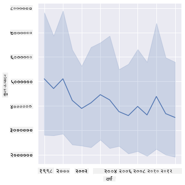

<!--
CO_OP_TRANSLATOR_METADATA:
{
  "original_hash": "b29e427401499e81f4af55a8c4afea76",
  "translation_date": "2025-09-04T17:05:35+00:00",
  "source_file": "3-Data-Visualization/12-visualization-relationships/README.md",
  "language_code": "ne"
}
-->
# सम्बन्धहरू देखाउने: महको कथा 🍯

| ](../../sketchnotes/12-Visualizing-Relationships.png)|
|:---:|
|सम्बन्धहरू देखाउने - _Sketchnote by [@nitya](https://twitter.com/nitya)_ |

हाम्रो अनुसन्धानको प्रकृति केन्द्रित विषयलाई अगाडि बढाउँदै, विभिन्न प्रकारका महहरू बीचको सम्बन्ध देखाउन रोचक दृश्यहरू खोजौं, जुन [संयुक्त राज्यको कृषि विभाग](https://www.nass.usda.gov/About_NASS/index.php) बाट प्राप्त डेटासेटमा आधारित छ।

यो लगभग ६०० वस्तुहरूको डेटासेटले धेरै अमेरिकी राज्यहरूमा मह उत्पादन देखाउँछ। उदाहरणका लागि, तपाईं १९९८-२०१२ को अवधिमा प्रत्येक राज्यको लागि प्रति वर्ष एक पङ्क्ति सहित, उपनिवेशहरूको संख्या, प्रति उपनिवेश उत्पादन, कुल उत्पादन, स्टकहरू, प्रति पाउन्ड मूल्य, र उत्पादनको मूल्य हेर्न सक्नुहुन्छ।

यो रोचक हुनेछ कि कुनै राज्यको वार्षिक उत्पादन र त्यस राज्यमा महको मूल्य बीचको सम्बन्ध देखाउने दृश्य बनाउने। वैकल्पिक रूपमा, तपाईं राज्यहरूको प्रति उपनिवेश मह उत्पादनको सम्बन्ध देखाउन सक्नुहुन्छ। यो समयावधि २००६ मा पहिलो पटक देखिएको 'CCD' वा 'Colony Collapse Disorder' (http://npic.orst.edu/envir/ccd.html) को विनाशकारी प्रभाव समेट्छ, त्यसैले यो अध्ययन गर्नको लागि एक महत्वपूर्ण डेटासेट हो। 🐝

## [पाठ अघि क्विज](https://purple-hill-04aebfb03.1.azurestaticapps.net/quiz/22)

यस पाठमा, तपाईंले पहिले प्रयोग गरेको Seaborn लाई प्रयोग गर्न सक्नुहुन्छ, जुन चरहरू बीचको सम्बन्ध देखाउनको लागि राम्रो पुस्तकालय हो। विशेष रूपमा रोचक छ Seaborn को `relplot` फङ्क्शनको प्रयोग, जसले छिटो '[सांख्यिकीय सम्बन्धहरू](https://seaborn.pydata.org/tutorial/relational.html?highlight=relationships)' देखाउन स्क्याटर प्लट र लाइन प्लटहरू अनुमति दिन्छ, जसले डेटा वैज्ञानिकलाई चरहरू बीचको सम्बन्ध राम्रोसँग बुझ्न मद्दत गर्दछ।

## स्क्याटरप्लटहरू

महको मूल्य वर्ष दर वर्ष, प्रति राज्य कसरी विकसित भएको छ भन्ने देखाउन स्क्याटरप्लट प्रयोग गर्नुहोस्। Seaborn, `relplot` प्रयोग गरेर, राज्य डेटा समूहबद्ध गर्दछ र श्रेणीगत र संख्यात्मक डेटा दुवैका लागि डेटा बिन्दुहरू देखाउँछ।

आउनुहोस्, डेटा र Seaborn आयात गरेर सुरु गरौं:

```python
import pandas as pd
import matplotlib.pyplot as plt
import seaborn as sns
honey = pd.read_csv('../../data/honey.csv')
honey.head()
```
तपाईंले देख्नुहुन्छ कि मह डेटामा धेरै रोचक स्तम्भहरू छन्, जस्तै वर्ष र प्रति पाउन्ड मूल्य। आउनुहोस्, यो डेटा अमेरिकी राज्य अनुसार समूहबद्ध गरेर अन्वेषण गरौं:

| state | numcol | yieldpercol | totalprod | stocks   | priceperlb | prodvalue | year |
| ----- | ------ | ----------- | --------- | -------- | ---------- | --------- | ---- |
| AL    | 16000  | 71          | 1136000   | 159000   | 0.72       | 818000    | 1998 |
| AZ    | 55000  | 60          | 3300000   | 1485000  | 0.64       | 2112000   | 1998 |
| AR    | 53000  | 65          | 3445000   | 1688000  | 0.59       | 2033000   | 1998 |
| CA    | 450000 | 83          | 37350000  | 12326000 | 0.62       | 23157000  | 1998 |
| CO    | 27000  | 72          | 1944000   | 1594000  | 0.7        | 1361000   | 1998 |

प्रति पाउन्ड महको मूल्य र यसको अमेरिकी राज्यको उत्पत्तिको सम्बन्ध देखाउन आधारभूत स्क्याटरप्लट बनाउनुहोस्। `y` अक्षलाई सबै राज्यहरू देखाउन पर्याप्त अग्लो बनाउनुहोस्:

```python
sns.relplot(x="priceperlb", y="state", data=honey, height=15, aspect=.5);
```


अब, महको रंग योजनाको साथ समान डेटा देखाउनुहोस् ताकि मूल्य वर्ष दर वर्ष कसरी विकसित भएको छ भन्ने देखाउन सकियोस्। तपाईंले 'hue' प्यारामिटर थपेर यो गर्न सक्नुहुन्छ:

> ✅ Seaborn मा प्रयोग गर्न सकिने [रंग योजनाहरू](https://seaborn.pydata.org/tutorial/color_palettes.html) को बारेमा थप जान्नुहोस् - सुन्दर इन्द्रेणी रंग योजना प्रयास गर्नुहोस्!

```python
sns.relplot(x="priceperlb", y="state", hue="year", palette="YlOrBr", data=honey, height=15, aspect=.5);
```


यो रंग योजनाको परिवर्तनसँग, तपाईंले देख्न सक्नुहुन्छ कि महको प्रति पाउन्ड मूल्यमा वर्ष दर वर्ष स्पष्ट प्रगति छ। वास्तवमा, यदि तपाईं डेटाको नमूना सेट हेर्नुहुन्छ (उदाहरणका लागि, एरिजोना राज्य चयन गर्नुहोस्) तपाईंले मूल्य वृद्धि वर्ष दर वर्षको ढाँचा देख्न सक्नुहुन्छ, केही अपवादहरू सहित:

| state | numcol | yieldpercol | totalprod | stocks  | priceperlb | prodvalue | year |
| ----- | ------ | ----------- | --------- | ------- | ---------- | --------- | ---- |
| AZ    | 55000  | 60          | 3300000   | 1485000 | 0.64       | 2112000   | 1998 |
| AZ    | 52000  | 62          | 3224000   | 1548000 | 0.62       | 1999000   | 1999 |
| AZ    | 40000  | 59          | 2360000   | 1322000 | 0.73       | 1723000   | 2000 |
| AZ    | 43000  | 59          | 2537000   | 1142000 | 0.72       | 1827000   | 2001 |
| AZ    | 38000  | 63          | 2394000   | 1197000 | 1.08       | 2586000   | 2002 |
| AZ    | 35000  | 72          | 2520000   | 983000  | 1.34       | 3377000   | 2003 |
| AZ    | 32000  | 55          | 1760000   | 774000  | 1.11       | 1954000   | 2004 |
| AZ    | 36000  | 50          | 1800000   | 720000  | 1.04       | 1872000   | 2005 |
| AZ    | 30000  | 65          | 1950000   | 839000  | 0.91       | 1775000   | 2006 |
| AZ    | 30000  | 64          | 1920000   | 902000  | 1.26       | 2419000   | 2007 |
| AZ    | 25000  | 64          | 1600000   | 336000  | 1.26       | 2016000   | 2008 |
| AZ    | 20000  | 52          | 1040000   | 562000  | 1.45       | 1508000   | 2009 |
| AZ    | 24000  | 77          | 1848000   | 665000  | 1.52       | 2809000   | 2010 |
| AZ    | 23000  | 53          | 1219000   | 427000  | 1.55       | 1889000   | 2011 |
| AZ    | 22000  | 46          | 1012000   | 253000  | 1.79       | 1811000   | 2012 |

रंगको सट्टा आकार प्रयोग गरेर यो प्रगति देखाउने अर्को तरिका हो। रंग अन्धोपन भएका प्रयोगकर्ताहरूको लागि, यो राम्रो विकल्प हुन सक्छ। मूल्य वृद्धि डटको परिधि वृद्धि गरेर देखाउनको लागि आफ्नो दृश्यलाई सम्पादन गर्नुहोस्:

```python
sns.relplot(x="priceperlb", y="state", size="year", data=honey, height=15, aspect=.5);
```
तपाईंले देख्न सक्नुहुन्छ कि डटहरूको आकार क्रमशः बढ्दै गएको छ।


के यो आपूर्ति र मागको साधारण मामला हो? जलवायु परिवर्तन र उपनिवेश पतन जस्ता कारकहरूको कारण, वर्ष दर वर्ष किन कम मह उपलब्ध छ, र त्यसैले मूल्य बढ्छ?

यस डेटासेटका केही चरहरू बीचको सम्बन्ध पत्ता लगाउन, आउनुहोस् केही लाइन चार्टहरू अन्वेषण गरौं।

## लाइन चार्टहरू

प्रश्न: के महको प्रति पाउन्ड मूल्यमा वर्ष दर वर्ष स्पष्ट वृद्धि छ? तपाईंले यो सबैभन्दा सजिलै एकल लाइन चार्ट बनाएर पत्ता लगाउन सक्नुहुन्छ:

```python
sns.relplot(x="year", y="priceperlb", kind="line", data=honey);
```
उत्तर: हो, केही अपवादहरू सहित, विशेष गरी २००३ को वरिपरि:


✅ किनभने Seaborn एक लाइन वरिपरि डेटा समग्र गर्दैछ, यसले "प्रत्येक x मानमा बहु मापनहरू औसत र औसत वरिपरि ९५% विश्वास अन्तराल प्लट गरेर देखाउँछ।" [स्रोत](https://seaborn.pydata.org/tutorial/relational.html)। यो समय लाग्ने व्यवहारलाई `ci=None` थपेर अक्षम गर्न सकिन्छ।

प्रश्न: खैर, २००३ मा के हामी महको आपूर्तिमा पनि वृद्धि देख्न सक्छौं? यदि तपाईं कुल उत्पादन वर्ष दर वर्ष हेर्नुहुन्छ भने के हुन्छ?

```python
sns.relplot(x="year", y="totalprod", kind="line", data=honey);
```



उत्तर: वास्तवमा होइन। यदि तपाईं कुल उत्पादन हेर्नुहुन्छ भने, यो विशेष वर्षमा बढेको जस्तो देखिन्छ, यद्यपि सामान्य रूपमा मह उत्पादनको मात्रा यी वर्षहरूमा घट्दै गएको छ।

प्रश्न: त्यस अवस्थामा, २००३ को वरिपरि महको मूल्यमा भएको वृद्धि केले कारण बनायो?

यो पत्ता लगाउन, तपाईंले फेसेट ग्रिड अन्वेषण गर्न सक्नुहुन्छ।

## फेसेट ग्रिडहरू

फेसेट ग्रिडहरूले तपाईंको डेटासेटको एक पक्ष (हाम्रो मामलामा, तपाईंले 'वर्ष' चयन गर्न सक्नुहुन्छ ताकि धेरै धेरै फेसेटहरू उत्पादन नगरियोस्) लिन्छ। Seaborn त्यसपछि तपाईंको चयन गरिएको x र y निर्देशांकहरूको लागि प्रत्येक फेसेटको प्लट बनाउँछ ताकि सजिलो दृश्य तुलना गर्न सकियोस्। के २००३ यस प्रकारको तुलना मा बाहिर देखिन्छ?

Seaborn को [डकुमेन्टेसन](https://seaborn.pydata.org/generated/seaborn.FacetGrid.html?highlight=facetgrid#seaborn.FacetGrid) द्वारा सिफारिस गरिएको `relplot` प्रयोग गरेर फेसेट ग्रिड बनाउनुहोस्।

```python
sns.relplot(
    data=honey, 
    x="yieldpercol", y="numcol",
    col="year", 
    col_wrap=3,
    kind="line"
```
यस दृश्यमा, तपाईं उपनिवेश प्रति उत्पादन र उपनिवेशहरूको संख्या वर्ष दर वर्ष, राज्य दर राज्य, सँगै तुलना गर्न सक्नुहुन्छ, स्तम्भहरूको लागि wrap ३ मा सेट गरिएको छ:


यस डेटासेटको लागि, उपनिवेशहरूको संख्या र तिनीहरूको उत्पादन, वर्ष दर वर्ष र राज्य दर राज्य, सम्बन्धमा केही विशेष कुरा बाहिर देखिँदैन। के यी दुई चरहरू बीचको सम्बन्ध पत्ता लगाउन हेर्ने फरक तरिका छ?

## डुअल-लाइन प्लटहरू

Seaborn को 'despine' प्रयोग गरेर दुई लाइनप्लटहरू एक अर्काको माथि सुपरइम्पोज गरेर, र `ax.twinx` [Matplotlib बाट व्युत्पन्न](https://matplotlib.org/stable/api/_as_gen/matplotlib.axes.Axes.twinx.html) प्रयोग गरेर मल्टीलाइन प्लट प्रयास गर्नुहोस्। Twinx ले चार्टलाई x अक्ष साझा गर्न र दुई y अक्षहरू देखाउन अनुमति दिन्छ। त्यसैले, उपनिवेश प्रति उत्पादन र उपनिवेशहरूको संख्या, सुपरइम्पोज गरिएको देखाउनुहोस्:

```python
fig, ax = plt.subplots(figsize=(12,6))
lineplot = sns.lineplot(x=honey['year'], y=honey['numcol'], data=honey, 
                        label = 'Number of bee colonies', legend=False)
sns.despine()
plt.ylabel('# colonies')
plt.title('Honey Production Year over Year');

ax2 = ax.twinx()
lineplot2 = sns.lineplot(x=honey['year'], y=honey['yieldpercol'], ax=ax2, color="r", 
                         label ='Yield per colony', legend=False) 
sns.despine(right=False)
plt.ylabel('colony yield')
ax.figure.legend();
```


२००३ को वरिपरि आँखा बाहिर केही नजम्पे पनि, यसले हामीलाई यो पाठलाई अलिक खुशीको नोटमा अन्त्य गर्न अनुमति दिन्छ: उपनिवेशहरूको संख्या घट्दै गएको भए पनि, उपनिवेशहरूको संख्या स्थिर हुँदैछ, यद्यपि तिनीहरूको उपनिवेश प्रति उत्पादन घट्दैछ।

जाऊ, महका मौरीहरू, जाऊ!

🐝❤️
## 🚀 चुनौती

यस पाठमा, तपाईंले स्क्याटरप्लटहरू र लाइन ग्रिडहरूको अन्य प्रयोगहरूको बारेमा, फेसेट ग्रिडहरू सहित, थोरै बढी सिक्नुभयो। आफैंलाई चुनौती दिनुहोस् कि तपाईंले पहिलेका पाठहरूमा प्रयोग गरेको फरक डेटासेट प्रयोग गरेर फेसेट ग्रिड बनाउनुहोस्। तिनीहरू बनाउन कति समय लाग्छ र यी प्रविधिहरू प्रयोग गरेर तपाईंले कति ग्रिडहरू बनाउन आवश्यक छ भन्ने कुरामा ध्यान दिनुहोस्।

## [पाठ पछि क्विज](https://ff-quizzes.netlify.app/en/ds/)

## समीक्षा र आत्म अध्ययन

लाइन प्लटहरू सरल वा धेरै जटिल हुन सक्छन्। [Seaborn डकुमेन्टेसन](https://seaborn.pydata.org/generated/seaborn.lineplot.html) मा विभिन्न तरिकाहरूको बारेमा थोरै पढ्नुहोस् जसले तपाईंलाई तिनीहरू निर्माण गर्न अनुमति दिन्छ। तपाईंले यस पाठमा निर्माण गरेका लाइन चार्टहरूलाई डकुमेन्टेसनमा सूचीबद्ध अन्य विधिहरूको साथ सुधार गर्न प्रयास गर्नुहोस्।
## असाइनमेन्ट

[महको छत्तामा डुब्नुहोस्](assignment.md)

---

**अस्वीकरण**:  
यो दस्तावेज़ AI अनुवाद सेवा [Co-op Translator](https://github.com/Azure/co-op-translator) प्रयोग गरेर अनुवाद गरिएको छ। हामी शुद्धताको लागि प्रयास गर्छौं, तर कृपया ध्यान दिनुहोस् कि स्वचालित अनुवादमा त्रुटिहरू वा अशुद्धताहरू हुन सक्छ। यसको मूल भाषा मा रहेको मूल दस्तावेज़लाई आधिकारिक स्रोत मानिनुपर्छ। महत्वपूर्ण जानकारीको लागि, व्यावसायिक मानव अनुवाद सिफारिस गरिन्छ। यस अनुवादको प्रयोगबाट उत्पन्न हुने कुनै पनि गलतफहमी वा गलत व्याख्याको लागि हामी जिम्मेवार हुने छैनौं।