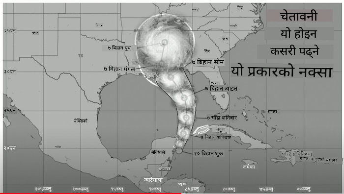
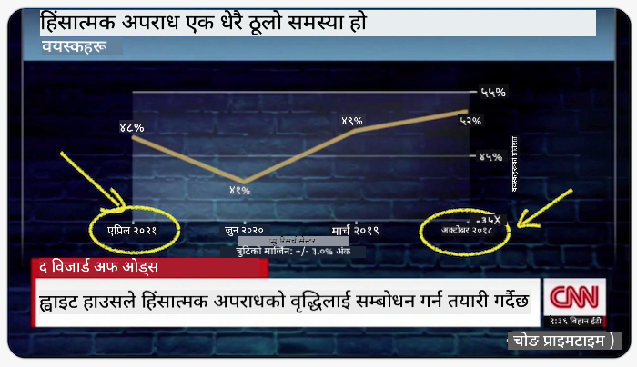
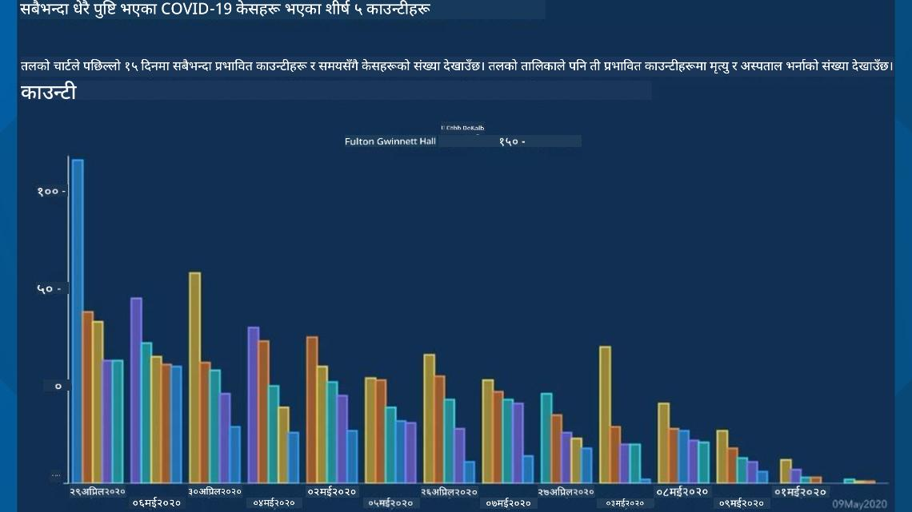
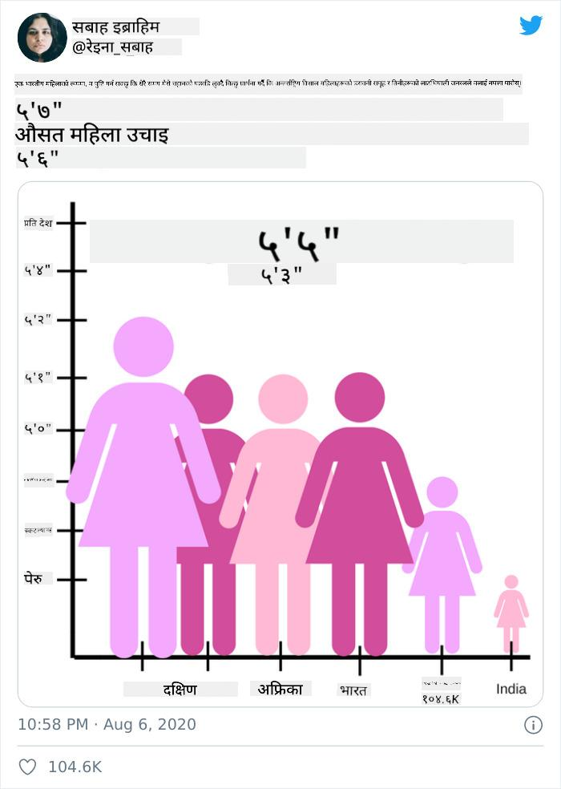
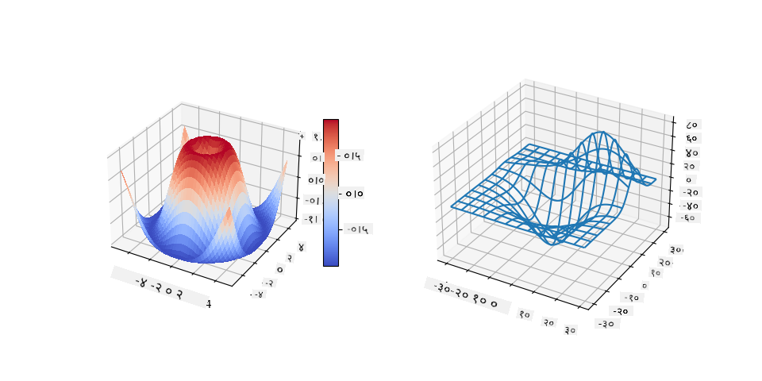
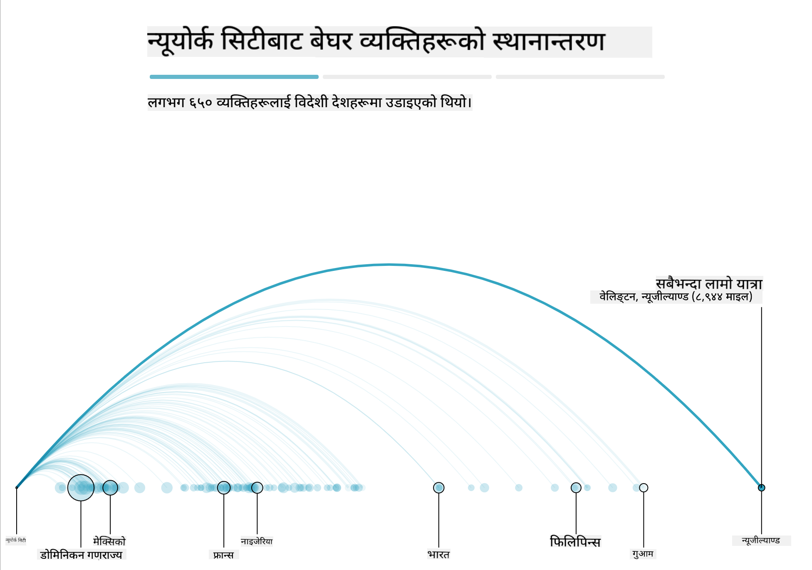
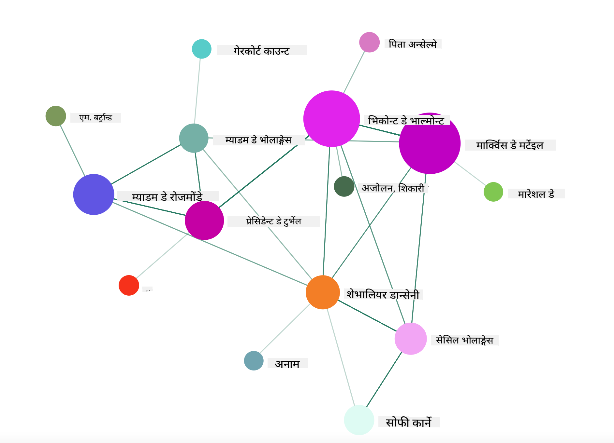

<!--
CO_OP_TRANSLATOR_METADATA:
{
  "original_hash": "4ec4747a9f4f7d194248ea29903ae165",
  "translation_date": "2025-08-27T18:12:08+00:00",
  "source_file": "3-Data-Visualization/13-meaningful-visualizations/README.md",
  "language_code": "ne"
}
-->
# अर्थपूर्ण दृश्यावलोकनहरू बनाउने

| ](../../sketchnotes/13-MeaningfulViz.png)|
|:---:|
| अर्थपूर्ण दृश्यावलोकनहरू - _Sketchnote by [@nitya](https://twitter.com/nitya)_ |

> "यदि तपाईंले डाटालाई पर्याप्त यातना दिनुभयो भने, यसले जे पनि स्वीकार गर्नेछ।" -- [Ronald Coase](https://en.wikiquote.org/wiki/Ronald_Coase)

डाटा वैज्ञानिकको आधारभूत सीपहरूमध्ये एक हो, यस्तो अर्थपूर्ण डाटा दृश्यावलोकन बनाउन सक्ने क्षमता, जसले तपाईंले सोध्न सक्ने प्रश्नहरूको उत्तर दिन मद्दत गर्दछ। तपाईंको डाटालाई दृश्यात्मक बनाउनुअघि, यसलाई सफा र तयार गरिएको सुनिश्चित गर्नु आवश्यक छ, जस्तै तपाईंले अघिल्लो पाठहरूमा गर्नुभएको थियो। त्यसपछि, तपाईंले डाटालाई कसरी प्रस्तुत गर्ने भन्ने निर्णय गर्न सुरु गर्न सक्नुहुन्छ।

यस पाठमा, तपाईंले समीक्षा गर्नुहुनेछ:

1. सही चार्ट प्रकार कसरी छान्ने
2. भ्रामक चार्टिङबाट कसरी बच्ने
3. रङसँग कसरी काम गर्ने
4. पढ्न सजिलो बनाउन चार्टलाई कसरी शैली दिनु
5. एनिमेटेड वा 3D चार्टिङ समाधान कसरी बनाउने
6. सिर्जनात्मक दृश्यावलोकन कसरी बनाउने

## [पाठपूर्व क्विज](https://purple-hill-04aebfb03.1.azurestaticapps.net/quiz/24)

## सही चार्ट प्रकार छान्नुहोस्

अघिल्लो पाठहरूमा, तपाईंले Matplotlib र Seaborn प्रयोग गरेर विभिन्न प्रकारका रोचक डाटा दृश्यावलोकनहरू निर्माण गर्न अभ्यास गर्नुभएको थियो। सामान्यतया, तपाईंले सोध्नुभएको प्रश्नको लागि [सही प्रकारको चार्ट](https://chartio.com/learn/charts/how-to-select-a-data-vizualization/) यो तालिकाको आधारमा छान्न सक्नुहुन्छ:

| तपाईंलाई चाहिएको छ:         | तपाईंले प्रयोग गर्नुपर्छ:         |
| -------------------------- | ------------------------------- |
| समयसँगै डाटाको प्रवृत्ति देखाउनु | रेखा (Line)                     |
| श्रेणीहरूको तुलना गर्नु       | बार (Bar), पाई (Pie)             |
| कुलहरूको तुलना गर्नु         | पाई (Pie), स्ट्याक्ड बार         |
| सम्बन्धहरू देखाउनु          | स्क्याटर (Scatter), रेखा (Line), फेसट (Facet), डुअल लाइन |
| वितरणहरू देखाउनु            | स्क्याटर (Scatter), हिस्टोग्राम (Histogram), बक्स (Box) |
| अनुपातहरू देखाउनु           | पाई (Pie), डोनट (Donut), वाफल (Waffle) |

> ✅ तपाईंको डाटाको संरचनाको आधारमा, तपाईंले यसलाई पाठबाट संख्यात्मकमा रूपान्तरण गर्न आवश्यक पर्न सक्छ, ताकि चार्टले यसलाई समर्थन गर्न सकोस्।

## भ्रामकता रोक्नुहोस्

डाटा वैज्ञानिकले सही डाटाका लागि सही चार्ट छान्न सावधान भए पनि, डाटालाई कुनै बिन्दु प्रमाणित गर्न, प्रायः डाटाको विश्वसनीयता कमजोर पार्दै, प्रस्तुत गर्न धेरै तरिकाहरू छन्। भ्रामक चार्ट र इन्फोग्राफिक्सका धेरै उदाहरणहरू छन्!

[](https://www.youtube.com/watch?v=oX74Nge8Wkw "How charts lie")

> 🎥 माथिको छविमा क्लिक गरेर भ्रामक चार्टहरूको बारेमा सम्मेलनको प्रस्तुति हेर्नुहोस्।

यो चार्टले X अक्षलाई उल्ट्याएर मितिको आधारमा सत्यको विपरीत देखाउँछ:



[यो चार्ट](https://media.firstcoastnews.com/assets/WTLV/images/170ae16f-4643-438f-b689-50d66ca6a8d8/170ae16f-4643-438f-b689-50d66ca6a8d8_1140x641.jpg) अझ बढी भ्रामक छ, किनभने आँखा दायाँतिर तानिन्छ, जसले विभिन्न काउन्टीहरूमा समयसँगै COVID केसहरू घटेको निष्कर्ष निकाल्छ। वास्तवमा, यदि तपाईं मितिहरूलाई ध्यानपूर्वक हेर्नुहुन्छ भने, तपाईंले पाउनुहुनेछ कि ती मितिहरूलाई घट्दो प्रवृत्ति देखाउन फेरबदल गरिएको छ।



यो कुख्यात उदाहरणले रङ र उल्टिएको Y अक्ष प्रयोग गरेर झुक्याउँछ: बन्दुक-मैत्री कानुन पारित भएपछि बन्दुक मृत्युहरू बढेको निष्कर्ष निकाल्नुको सट्टा, वास्तवमा आँखा उल्टो सोच्न झुक्याइन्छ:


यो अनौठो चार्टले अनुपातलाई कसरी हाँस्यास्पद रूपमा हेरफेर गर्न सकिन्छ भन्ने देखाउँछ:



अतुलनीय कुराहरूको तुलना गर्नु अर्को छायादार चाल हो। 'स्प्युरियस कोरिलेसन' भन्ने [एक अद्भुत वेबसाइट](https://tylervigen.com/spurious-correlations) छ, जसले 'तथ्यहरू' जस्तै मेनको डिभोर्स दर र मार्जरीनको खपतलाई सम्बन्धित देखाउँछ। एक Reddit समूहले डाटाको [कुरूप प्रयोगहरू](https://www.reddit.com/r/dataisugly/top/?t=all) पनि सङ्कलन गर्दछ।

भ्रामक चार्टहरूले आँखा कति सजिलै झुक्याउन सक्छ भन्ने कुरा बुझ्नु महत्त्वपूर्ण छ। डाटा वैज्ञानिकको उद्देश्य राम्रो भए पनि, धेरै श्रेणीहरू देखाउने पाई चार्ट जस्तो खराब प्रकारको चार्टको छनोटले भ्रामक हुन सक्छ।

## रङ

तपाईंले माथिको 'फ्लोरिडा बन्दुक हिंसा' चार्टमा देख्नुभयो, रङले चार्टहरूमा थप अर्थ प्रदान गर्न सक्छ, विशेष गरी Matplotlib र Seaborn जस्ता पुस्तकालयहरू प्रयोग नगरी बनाइएका चार्टहरूमा। यदि तपाईंले चार्ट हातले बनाउँदै हुनुहुन्छ भने, [रङ सिद्धान्त](https://colormatters.com/color-and-design/basic-color-theory) को अध्ययन गर्नुहोस्।

> ✅ चार्ट डिजाइन गर्दा, पहुँचयोग्यता दृश्यावलोकनको महत्त्वपूर्ण पक्ष हो भन्ने कुरा सचेत हुनुहोस्। तपाईंका केही प्रयोगकर्ताहरू रङ अन्धा हुन सक्छन् - के तपाईंको चार्टले दृष्टि समस्याहरू भएका प्रयोगकर्ताहरूका लागि राम्रोसँग प्रदर्शन गर्छ?

चार्टका लागि रङ छान्दा सावधान हुनुहोस्, किनभने रङले तपाईंले चाहेको अर्थभन्दा फरक अर्थ दिन सक्छ। माथिको 'उचाइ' चार्टमा 'गुलाबी महिलाहरू' ले स्पष्ट रूपमा 'महिलासँग सम्बन्धित' अर्थ दिन्छ, जसले चार्टलाई अझ अनौठो बनाउँछ।

[रङको अर्थ](https://colormatters.com/color-symbolism/the-meanings-of-colors) संसारका विभिन्न भागहरूमा फरक हुन सक्छ, र तिनीहरूको छायाँ अनुसार अर्थ परिवर्तन हुने傾 tendency हुन्छ। सामान्यतया, रङका अर्थहरूमा समावेश छन्:

| रङ    | अर्थ                  |
| ------ | ------------------- |
| रातो   | शक्ति                |
| निलो   | विश्वास, निष्ठा       |
| पहेँलो | खुशी, सतर्कता         |
| हरियो  | पारिस्थितिकी, भाग्य, डाह |
| बैजनी  | खुशी                 |
| सुन्तला | जीवन्तता             |

यदि तपाईंलाई अनुकूल रङहरू भएको चार्ट बनाउन जिम्मा दिइएको छ भने, सुनिश्चित गर्नुहोस् कि तपाईंका चार्टहरू पहुँचयोग्य छन् र तपाईंले छानेको रङले तपाईंले व्यक्त गर्न खोजेको अर्थसँग मेल खान्छ।

## पढ्न सजिलो बनाउन चार्टलाई शैली दिनुहोस्

चार्टहरू अर्थपूर्ण हुँदैनन् यदि तिनीहरू पढ्न सजिलो छैनन् भने! तपाईंको डाटासँग राम्रोसँग स्केल गर्न चार्टको चौडाइ र उचाइलाई शैली दिन विचार गर्नुहोस्। यदि एउटा भेरिएबल (जस्तै सबै 50 राज्यहरू) प्रदर्शन गर्न आवश्यक छ भने, सकेसम्म तिनीहरूलाई Y अक्षमा ठाडो रूपमा देखाउनुहोस् ताकि क्षैतिज स्क्रोलिङ चार्टबाट बच्न सकियोस्।

तपाईंका अक्षहरू लेबल गर्नुहोस्, आवश्यक भएमा एउटा लेजेन्ड प्रदान गर्नुहोस्, र डाटाको राम्रो बुझाइका लागि टुलटिप्स प्रस्ताव गर्नुहोस्।

यदि तपाईंको डाटा X अक्षमा पाठात्मक र लामो छ भने, राम्रो पढ्नका लागि पाठलाई कोण दिन सक्नुहुन्छ। [Matplotlib](https://matplotlib.org/stable/tutorials/toolkits/mplot3d.html) ले 3D प्लटिङ प्रदान गर्दछ, यदि तपाईंको डाटाले यसलाई समर्थन गर्छ भने। `mpl_toolkits.mplot3d` प्रयोग गरेर परिष्कृत डाटा दृश्यावलोकनहरू उत्पादन गर्न सकिन्छ।



## एनिमेसन र 3D चार्ट प्रदर्शन

आजका केही उत्कृष्ट डाटा दृश्यावलोकनहरू एनिमेटेड छन्। Shirley Wu ले D3 प्रयोग गरेर बनाएका अद्भुत दृश्यावलोकनहरू छन्, जस्तै '[फिल्म फ्लावरहरू](http://bl.ocks.org/sxywu/raw/d612c6c653fb8b4d7ff3d422be164a5d/)', जहाँ प्रत्येक फूल एउटा चलचित्रको दृश्यावलोकन हो। Guardian का लागि अर्को उदाहरण हो 'बस्ट आउट', जसले NYC ले आफ्नो बेघर समस्या समाधान गर्न मानिसहरूलाई शहरबाट बाहिर बसमा पठाउने तरिकालाई देखाउन Greensock र D3 को साथमा स्क्रोलिटेलिङ लेख ढाँचासँग दृश्यावलोकनहरू संयोजन गर्दछ।



> "बस्ट आउट: कसरी अमेरिका आफ्नो बेघर मानिसहरूलाई सार्छ" [Guardian](https://www.theguardian.com/us-news/ng-interactive/2017/dec/20/bussed-out-america-moves-homeless-people-country-study) बाट। दृश्यावलोकनहरू Nadieh Bremer & Shirley Wu द्वारा।

यो पाठले यी शक्तिशाली दृश्यावलोकन पुस्तकालयहरू सिकाउन गहिराइमा जाने पर्याप्त छैन, तर D3 मा Vue.js एपमा पुस्तक 'Dangerous Liaisons' को एनिमेटेड सामाजिक नेटवर्कको रूपमा दृश्यावलोकन प्रदर्शन गर्न प्रयास गर्नुहोस्।

> "Les Liaisons Dangereuses" एउटा पत्रात्मक उपन्यास हो, वा पत्रहरूको श्रृंखलाको रूपमा प्रस्तुत गरिएको उपन्यास। 1782 मा Choderlos de Laclos द्वारा लेखिएको, यसले 18 औं शताब्दीको फ्रेन्च अभिजात वर्गका दुई प्रतिस्पर्धी पात्रहरूको निर्दयी, नैतिक रूपमा दिवालिया सामाजिक चालहरूको कथा बताउँछ, Vicomte de Valmont र Marquise de Merteuil। दुवैको अन्त्यमा पतन हुन्छ, तर धेरै सामाजिक क्षति नगरी होइन। उपन्यास पत्रहरूको श्रृंखलाको रूपमा unfolds हुन्छ, जसले बदला लिन वा केवल समस्या सिर्जना गर्न विभिन्न व्यक्तिहरूलाई लेखिएको हुन्छ। यी पत्रहरूको दृश्यावलोकन बनाएर कथाको प्रमुख पात्रहरूलाई दृश्यात्मक रूपमा पत्ता लगाउनुहोस्।

तपाईंले एउटा वेब एप पूरा गर्नुहुनेछ, जसले यस सामाजिक नेटवर्कको एनिमेटेड दृश्य प्रदर्शन गर्नेछ। यसले Vue.js र D3 प्रयोग गरेर [नेटवर्कको दृश्य](https://github.com/emiliorizzo/vue-d3-network) बनाउनको लागि बनाइएको पुस्तकालय प्रयोग गर्दछ। एप चलिरहेको बेला, तपाईं स्क्रिनमा नोडहरू तान्न सक्नुहुन्छ र डाटालाई फेरबदल गर्न सक्नुहुन्छ।



## परियोजना: D3.js प्रयोग गरेर नेटवर्क देखाउने चार्ट बनाउनुहोस्

> यो पाठ फोल्डरमा एउटा `solution` फोल्डर समावेश छ, जहाँ तपाईंले सन्दर्भका लागि पूरा गरिएको परियोजना पाउन सक्नुहुन्छ।

1. स्टार्ट फोल्डरको रुटमा रहेको README.md फाइलमा निर्देशनहरू पालना गर्नुहोस्। तपाईंको मेसिनमा NPM र Node.js चलिरहेको सुनिश्चित गर्नुहोस्, त्यसपछि तपाईंको परियोजनाका निर्भरता स्थापना गर्नुहोस्।

2. `starter/src` फोल्डर खोल्नुहोस्। तपाईंले एउटा `assets` फोल्डर पाउनुहुनेछ, जहाँ उपन्यासका सबै पत्रहरू भएको .json फाइल छ, नम्बर गरिएको, 'to' र 'from' एनोटेसनसहित।

3. `components/Nodes.vue` मा रहेको कोड पूरा गर्नुहोस्, ताकि दृश्यावलोकन सक्षम होस्। `createLinks()` नामक विधि खोज्नुहोस् र निम्न नेस्टेड लूप थप्नुहोस्।

.json वस्तुमा लूप गर्नुहोस्, पत्रहरूको 'to' र 'from' डाटा समात्न र `links` वस्तु निर्माण गर्न, ताकि दृश्यावलोकन पुस्तकालयले यसलाई उपभोग गर्न सकोस्:

```javascript
//loop through letters
      let f = 0;
      let t = 0;
      for (var i = 0; i < letters.length; i++) {
          for (var j = 0; j < characters.length; j++) {
              
            if (characters[j] == letters[i].from) {
              f = j;
            }
            if (characters[j] == letters[i].to) {
              t = j;
            }
        }
        this.links.push({ sid: f, tid: t });
      }
  ```

टर्मिनलबाट तपाईंको एप चलाउनुहोस् (npm run serve) र दृश्यावलोकनको मजा लिनुहोस्!

## 🚀 चुनौती

इन्टरनेटको भ्रमण गरेर भ्रामक दृश्यावलोकनहरू पत्ता लगाउनुहोस्। लेखकले प्रयोगकर्तालाई कसरी झुक्याउँछ, र के यो जानाजानी हो? दृश्यावलोकनहरू सुधार गरेर तिनीहरू कस्तो देखिनुपर्छ भनेर देखाउने प्रयास गर्नुहोस्।

## [पाठपछिको क्विज](https://purple-hill-04aebfb03.1.azurestaticapps.net/quiz/25)

## समीक्षा र आत्म-अध्ययन

भ्रामक डाटा दृश्यावलोकनको बारेमा पढ्नका लागि यी लेखहरू हेर्नुहोस्:

https://gizmodo.com/how-to-lie-with-data-visualization-1563576606

http://ixd.prattsi.org/2017/12/visual-lies-usability-in-deceptive-data-visualizations/

ऐतिहासिक सम्पत्ति र कलाकृतिहरूका लागि यी रोचक दृश्यावलोकनहरू हेर्नुहोस्:

https://handbook.pubpub.org/

एनिमेसनले तपाईंका दृश्यावलोकनहरूलाई कसरी सुधार गर्न सक्छ भन्ने बारे यो लेख हेर्नुहोस्:

https://medium.com/@EvanSinar/use-animation-to-supercharge-data-visualization-cd905a882ad4

## असाइनमेन्ट

[आफ्नै अनुकूल दृश्यावलोकन बनाउनुहोस्](assignment.md)

---

**अस्वीकरण**:  
यो दस्तावेज़ AI अनुवाद सेवा [Co-op Translator](https://github.com/Azure/co-op-translator) प्रयोग गरेर अनुवाद गरिएको हो। हामी शुद्धताको लागि प्रयास गर्छौं, तर कृपया ध्यान दिनुहोस् कि स्वचालित अनुवादमा त्रुटिहरू वा अशुद्धताहरू हुन सक्छ। यसको मूल भाषा मा रहेको मूल दस्तावेज़लाई आधिकारिक स्रोत मानिनुपर्छ। महत्वपूर्ण जानकारीको लागि, व्यावसायिक मानव अनुवाद सिफारिस गरिन्छ। यस अनुवादको प्रयोगबाट उत्पन्न हुने कुनै पनि गलतफहमी वा गलत व्याख्याको लागि हामी जिम्मेवार हुने छैनौं।