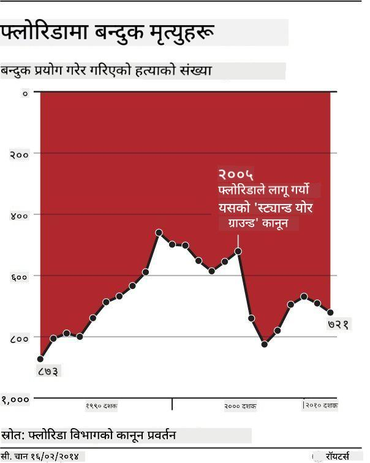

<!--
CO_OP_TRANSLATOR_METADATA:
{
  "original_hash": "0b380bb6d34102bb061eb41de23d9834",
  "translation_date": "2025-09-04T17:05:01+00:00",
  "source_file": "3-Data-Visualization/13-meaningful-visualizations/README.md",
  "language_code": "ne"
}
-->
# अर्थपूर्ण दृश्यचित्र बनाउने

| ](../../sketchnotes/13-MeaningfulViz.png)|
|:---:|
| अर्थपूर्ण दृश्यचित्र - _Sketchnote by [@nitya](https://twitter.com/nitya)_ |

> "यदि तपाईंले डाटालाई पर्याप्त यातना दिनुभयो भने, यसले केही पनि स्वीकार गर्नेछ" -- [Ronald Coase](https://en.wikiquote.org/wiki/Ronald_Coase)

डाटा वैज्ञानिकको आधारभूत सीपहरूमध्ये एक भनेको अर्थपूर्ण डाटा दृश्यचित्र बनाउने क्षमता हो, जसले तपाईंलाई आवश्यक प्रश्नहरूको उत्तर दिन मद्दत गर्दछ। डाटालाई दृश्यचित्रमा बदल्नुअघि, तपाईंले यसलाई सफा र तयार पार्नुपर्छ, जस्तै तपाईंले अघिल्लो पाठहरूमा गरेको थियो। त्यसपछि, तपाईंले डाटालाई प्रस्तुत गर्ने उत्तम तरिका निर्णय गर्न सुरु गर्न सक्नुहुन्छ।

यस पाठमा, तपाईंले समीक्षा गर्नुहुनेछ:

1. सही चार्ट प्रकार कसरी चयन गर्ने
2. भ्रामक चार्टिङबाट कसरी बच्ने
3. रंगसँग कसरी काम गर्ने
4. चार्टलाई पढ्न सजिलो बनाउन कसरी शैली दिने
5. एनिमेटेड वा 3D चार्टिङ समाधान कसरी बनाउने
6. रचनात्मक दृश्यचित्र कसरी बनाउने

## [पाठ अघि क्विज](https://purple-hill-04aebfb03.1.azurestaticapps.net/quiz/24)

## सही चार्ट प्रकार चयन गर्नुहोस्

अघिल्लो पाठहरूमा, तपाईंले Matplotlib र Seaborn प्रयोग गरेर विभिन्न प्रकारका रोचक डाटा दृश्यचित्रहरू बनाउने अभ्यास गर्नुभएको थियो। सामान्यतया, तपाईंले [सही प्रकारको चार्ट](https://chartio.com/learn/charts/how-to-select-a-data-vizualization/) चयन गर्न सक्नुहुन्छ, जुन तपाईंले सोधेको प्रश्नको लागि उपयुक्त हुन्छ। यस तालिकाको प्रयोग गर्नुहोस्:

| तपाईंलाई चाहिन्छ:          | तपाईंले प्रयोग गर्नुपर्छ:         |
| -------------------------- | ------------------------------- |
| समयसँगै डाटा प्रवृत्ति देखाउनुहोस् | रेखा                          |
| श्रेणीहरूको तुलना गर्नुहोस् | बार, पाई                        |
| कुल तुलना गर्नुहोस्         | पाई, स्ट्याक्ड बार              |
| सम्बन्ध देखाउनुहोस्         | स्क्याटर, रेखा, फेसट, डुअल रेखा |
| वितरण देखाउनुहोस्           | स्क्याटर, हिस्टोग्राम, बक्स     |
| अनुपात देखाउनुहोस्          | पाई, डोनट, वाफल                |

> ✅ तपाईंको डाटाको स्वरूप अनुसार, तपाईंले यसलाई पाठबाट संख्यात्मकमा परिवर्तन गर्न आवश्यक हुन सक्छ ताकि चार्टले यसलाई समर्थन गर्न सकून्।

## भ्रामकता रोक्नुहोस्

डाटा वैज्ञानिकले सही चार्ट सही डाटाको लागि चयन गरे पनि, डाटालाई कुनै बिन्दु प्रमाणित गर्न गलत तरिकाले प्रस्तुत गर्न सकिन्छ, जसले डाटाको विश्वसनीयता कमजोर बनाउँछ। भ्रामक चार्ट र इन्फोग्राफिक्सका धेरै उदाहरणहरू छन्!

[](https://www.youtube.com/watch?v=oX74Nge8Wkw "How charts lie")

> 🎥 माथिको चित्रमा क्लिक गरेर भ्रामक चार्टहरूको बारेमा सम्मेलनको कुरा सुन्नुहोस्।

यो चार्टले X अक्षलाई उल्टाएर सत्यको विपरीत देखाउँछ, मिति अनुसार:


[यो चार्ट](https://media.firstcoastnews.com/assets/WTLV/images/170ae16f-4643-438f-b689-50d66ca6a8d8/170ae16f-4643-438f-b689-50d66ca6a8d8_1140x641.jpg) अझ भ्रामक छ, किनकि आँखा दायाँतिर तानिन्छ र निष्कर्ष निकाल्छ कि समयसँगै COVID केसहरू विभिन्न काउन्टीहरूमा घटेका छन्। वास्तवमा, यदि तपाईं मितिहरूलाई ध्यानपूर्वक हेर्नुहुन्छ भने, तपाईंले पत्ता लगाउनुहुनेछ कि तिनीहरूलाई भ्रामक घट्दो प्रवृत्ति देखाउन पुनः व्यवस्था गरिएको छ।


यो कुख्यात उदाहरणले रंग र उल्टिएको Y अक्ष प्रयोग गरेर भ्रम सिर्जना गर्दछ: बन्दुक-मैत्री कानून पारित भएपछि बन्दुक मृत्युहरू बढेको निष्कर्ष निकाल्नुको सट्टा, वास्तवमा आँखा उल्टो सोच्न बाध्य पारिन्छ।



यो अनौठो चार्टले अनुपातलाई हाँसउठ्दो तरिकामा हेरफेर गरेको देखाउँछ:


अतुलनीयको तुलना गर्नु अर्को छायादार चाल हो। त्यहाँ [एक अद्भुत वेबसाइट](https://tylervigen.com/spurious-correlations) छ, जसले 'स्प्युरियस कोरिलेसन' देखाउँछ, जस्तै माइनको डिभोर्स दर र मार्जरीनको खपत। एक Reddit समूहले पनि [डाटाको खराब प्रयोगहरू](https://www.reddit.com/r/dataisugly/top/?t=all) सङ्कलन गर्दछ।

भ्रामक चार्टहरूले आँखा कति सजिलै भ्रमित गर्न सक्छ भन्ने कुरा बुझ्न महत्त्वपूर्ण छ। डाटा वैज्ञानिकको उद्देश्य राम्रो भए पनि, खराब प्रकारको चार्टको चयन, जस्तै धेरै श्रेणीहरू देखाउने पाई चार्ट, भ्रामक हुन सक्छ।

## रंग

तपाईंले माथिको 'फ्लोरिडा बन्दुक हिंसा' चार्टमा देख्नुभयो कि रंगले चार्टहरूमा थप अर्थ प्रदान गर्न सक्छ, विशेष गरी Matplotlib र Seaborn जस्ता पुस्तकालयहरू प्रयोग नगरी बनाइएका चार्टहरूमा। यदि तपाईंले चार्ट हातले बनाउँदै हुनुहुन्छ भने, [रंग सिद्धान्त](https://colormatters.com/color-and-design/basic-color-theory) को अध्ययन गर्नुहोस्।

> ✅ चार्ट डिजाइन गर्दा, पहुँचयोग्यता दृश्यचित्रको महत्त्वपूर्ण पक्ष हो। तपाईंका केही प्रयोगकर्ताहरू रंग अन्धा हुन सक्छन् - के तपाईंको चार्ट दृष्टि समस्याहरू भएका प्रयोगकर्ताहरूका लागि राम्रोसँग प्रदर्शन गर्दछ?

चार्टका लागि रंग चयन गर्दा सावधान रहनुहोस्, किनकि रंगले तपाईंले चाहेको अर्थभन्दा फरक अर्थ दिन सक्छ। माथिको 'पिंक लेडिज' चार्टले 'महिला' अर्थलाई व्यक्त गर्दछ, जसले चार्टलाई अझ अनौठो बनाउँछ।

[रंगको अर्थ](https://colormatters.com/color-symbolism/the-meanings-of-colors) विभिन्न भागहरूमा फरक हुन सक्छ, र तिनीहरूको छायाअनुसार परिवर्तन हुन सक्छ। सामान्यतया, रंगका अर्थहरू समावेश छन्:

| रंग    | अर्थ                 |
| ------ | ------------------- |
| रातो   | शक्ति               |
| निलो   | विश्वास, निष्ठा      |
| पहेंलो | खुशी, सतर्कता       |
| हरियो  | पारिस्थितिकी, भाग्य, ईर्ष्या |
| बैजनी  | खुशी               |
| सुन्तला | जीवन्तता            |

यदि तपाईंलाई अनुकूलित रंगहरू प्रयोग गरेर चार्ट बनाउने जिम्मेवारी दिइएको छ भने, सुनिश्चित गर्नुहोस् कि तपाईंका चार्टहरू पहुँचयोग्य छन् र तपाईंले चयन गरेको रंगले तपाईंले व्यक्त गर्न खोजेको अर्थसँग मेल खान्छ।

## चार्टलाई पढ्न सजिलो बनाउन शैली दिनुहोस्

चार्टहरू अर्थपूर्ण हुँदैनन् यदि तिनीहरू पढ्न सजिलो छैनन् भने! तपाईंको डाटासँग राम्रोसँग स्केल गर्न चार्टको चौडाइ र उचाइको शैली दिन विचार गर्नुहोस्। यदि एक भेरिएबल (जस्तै सबै 50 राज्यहरू) प्रदर्शन गर्न आवश्यक छ भने, तिनीहरूलाई Y अक्षमा ठाडो रूपमा देखाउनुहोस् ताकि क्षैतिज स्क्रोलिङ चार्टबाट बच्न सकियोस्।

तपाईंका अक्षहरू लेबल गर्नुहोस्, आवश्यक भएमा एउटा लेजेन्ड प्रदान गर्नुहोस्, र डाटाको राम्रो बुझाइका लागि टूलटिप्स प्रस्ताव गर्नुहोस्।

यदि तपाईंको डाटा X अक्षमा पाठात्मक र विस्तृत छ भने, राम्रो पढ्नको लागि पाठलाई कोण दिन सक्नुहुन्छ। [Matplotlib](https://matplotlib.org/stable/tutorials/toolkits/mplot3d.html) ले 3D प्लटिङ प्रदान गर्दछ, यदि तपाईंको डाटाले यसलाई समर्थन गर्दछ भने। `mpl_toolkits.mplot3d` प्रयोग गरेर परिष्कृत डाटा दृश्यचित्रहरू उत्पादन गर्न सकिन्छ।


## एनिमेसन र 3D चार्ट प्रदर्शन

आजका केही उत्कृष्ट डाटा दृश्यचित्रहरू एनिमेटेड छन्। Shirley Wu ले D3 प्रयोग गरेर अद्भुत दृश्यचित्रहरू बनाएकी छिन्, जस्तै '[फिल्म फ्लावरहरू](http://bl.ocks.org/sxywu/raw/d612c6c653fb8b4d7ff3d422be164a5d/)', जहाँ प्रत्येक फूल एउटा चलचित्रको दृश्यचित्र हो। अर्को उदाहरण Guardian का लागि 'बुस्ड आउट' हो, जसले NYC ले आफ्नो बेघर समस्या समाधान गर्न मानिसहरूलाई शहरबाट बाहिर बसमा पठाउने तरिका देखाउन स्क्रोलिटेलिङ लेखको ढाँचासँग दृश्यचित्रहरू संयोजन गर्दछ।


> "बुस्ड आउट: कसरी अमेरिका आफ्नो बेघर मानिसहरूलाई सार्छ" [Guardian](https://www.theguardian.com/us-news/ng-interactive/2017/dec/20/bussed-out-america-moves-homeless-people-country-study) बाट। दृश्यचित्रहरू Nadieh Bremer & Shirley Wu द्वारा।

यो पाठले यी शक्तिशाली दृश्यचित्र पुस्तकालयहरू सिकाउन गहिराइमा जान पर्याप्त छैन, तर Vue.js एपमा D3 प्रयोग गरेर 'Dangerous Liaisons' पुस्तकको एनिमेटेड सामाजिक नेटवर्कको दृश्यचित्र प्रदर्शन गर्न प्रयास गर्नुहोस्।

> "Les Liaisons Dangereuses" एउटा पत्रात्मक उपन्यास हो, जसलाई पत्रहरूको श्रृङ्खलाको रूपमा प्रस्तुत गरिएको छ। यो 1782 मा Choderlos de Laclos द्वारा लेखिएको हो, जसले फ्रान्सको 18औं शताब्दीको अभिजात वर्गका दुई प्रतिस्पर्धी पात्रहरूको सामाजिक चालबाजीको कथा बताउँछ। Vicomte de Valmont र Marquise de Merteuil अन्ततः नष्ट हुन्छन् तर धेरै सामाजिक क्षति पुर्‍याउँछन्। उपन्यास पत्रहरूको श्रृङ्खलाको रूपमा खुल्छ, जसले बदला लिन वा केवल समस्या सिर्जना गर्न योजना बनाउँछ। यी पत्रहरूको दृश्यचित्र बनाएर कथाको प्रमुख पात्रहरू पत्ता लगाउनुहोस्।

तपाईंले एउटा वेब एप पूरा गर्नुहुनेछ, जसले यस सामाजिक नेटवर्कको एनिमेटेड दृश्य देखाउनेछ। यो Vue.js र D3 प्रयोग गरेर [नेटवर्कको दृश्य](https://github.com/emiliorizzo/vue-d3-network) बनाउनको लागि बनाइएको पुस्तकालय प्रयोग गर्दछ। एप चलिरहेको बेला, तपाईं स्क्रिनमा नोडहरू तान्न सक्नुहुन्छ र डाटालाई फेरबदल गर्न सक्नुहुन्छ।


## परियोजना: D3.js प्रयोग गरेर नेटवर्क देखाउने चार्ट बनाउनुहोस्

> यो पाठको फोल्डरमा `solution` फोल्डर समावेश छ, जहाँ तपाईं पूरा परियोजना सन्दर्भको लागि पाउन सक्नुहुन्छ।

1. `starter` फोल्डरको रूटमा रहेको README.md फाइलमा निर्देशनहरू पालना गर्नुहोस्। सुनिश्चित गर्नुहोस् कि तपाईंको मेसिनमा NPM र Node.js चलिरहेको छ परियोजनाका निर्भरता स्थापना गर्नु अघि।

2. `starter/src` फोल्डर खोल्नुहोस्। तपाईंले एउटा `assets` फोल्डर पाउनुहुनेछ, जहाँ उपन्यासका सबै पत्रहरू .json फाइलमा सङ्ख्याबद्ध, 'to' र 'from' एनोटेसनसहित छन्।

3. `components/Nodes.vue` मा कोड पूरा गर्नुहोस् ताकि दृश्यचित्र सक्षम होस्। `createLinks()` नामक विधि खोज्नुहोस् र निम्न नेस्टेड लूप थप्नुहोस्।

.json वस्तुमा लूप गर्नुहोस् ताकि पत्रहरूको 'to' र 'from' डाटा समात्न सकियोस् र `links` वस्तु निर्माण गरियोस् ताकि दृश्यचित्र पुस्तकालयले यसलाई उपभोग गर्न सकियोस्:

```javascript
//loop through letters
      let f = 0;
      let t = 0;
      for (var i = 0; i < letters.length; i++) {
          for (var j = 0; j < characters.length; j++) {
              
            if (characters[j] == letters[i].from) {
              f = j;
            }
            if (characters[j] == letters[i].to) {
              t = j;
            }
        }
        this.links.push({ sid: f, tid: t });
      }
  ```

टर्मिनलबाट आफ्नो एप चलाउनुहोस् (npm run serve) र दृश्यचित्रको मजा लिनुहोस्!

## 🚀 चुनौती

इन्टरनेटको भ्रमण गरेर भ्रामक दृश्यचित्रहरू पत्ता लगाउनुहोस्। लेखकले प्रयोगकर्तालाई कसरी भ्रमित गर्छ, र के यो जानाजानी हो? दृश्यचित्रहरू सुधार गरेर तिनीहरू कस्तो देखिनुपर्छ भनेर देखाउने प्रयास गर्नुहोस्।

## [पाठ पछि क्विज](https://ff-quizzes.netlify.app/en/ds/)

## समीक्षा र आत्म अध्ययन

भ्रामक डाटा दृश्यचित्रको बारेमा पढ्नका लागि यहाँ केही लेखहरू छन्:

https://gizmodo.com/how-to-lie-with-data-visualization-1563576606

http://ixd.prattsi.org/2017/12/visual-lies-usability-in-deceptive-data-visualizations/

ऐतिहासिक सम्पत्ति र कलाकृतिहरूका लागि यी रोचक दृश्यचित्रहरू हेर्नुहोस्:

https://handbook.pubpub.org/

एनिमेसनले तपाईंका दृश्यचित्रहरूलाई कसरी सुधार गर्न सक्छ भन्ने बारेमा यो लेख हेर्नुहोस्:

https://medium.com/@EvanSinar/use-animation-to-supercharge-data-visualization-cd905a882ad4

## असाइनमेन्ट

[आफ्नै अनुकूलित दृश्यचित्र बनाउनुहोस्](assignment.md)

---

**अस्वीकरण**:  
यो दस्तावेज़ AI अनुवाद सेवा [Co-op Translator](https://github.com/Azure/co-op-translator) प्रयोग गरेर अनुवाद गरिएको छ। हामी यथार्थताको लागि प्रयास गर्छौं, तर कृपया ध्यान दिनुहोस् कि स्वचालित अनुवादहरूमा त्रुटि वा अशुद्धता हुन सक्छ। यसको मूल भाषा मा रहेको मूल दस्तावेज़लाई आधिकारिक स्रोत मानिनुपर्छ। महत्वपूर्ण जानकारीको लागि, व्यावसायिक मानव अनुवाद सिफारिस गरिन्छ। यस अनुवादको प्रयोगबाट उत्पन्न हुने कुनै पनि गलतफहमी वा गलत व्याख्याको लागि हामी जिम्मेवार हुने छैनौं।