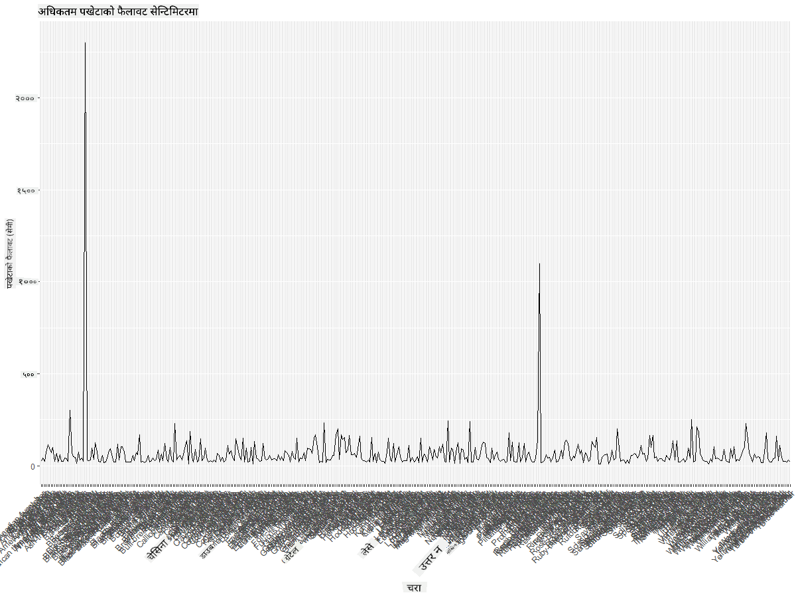
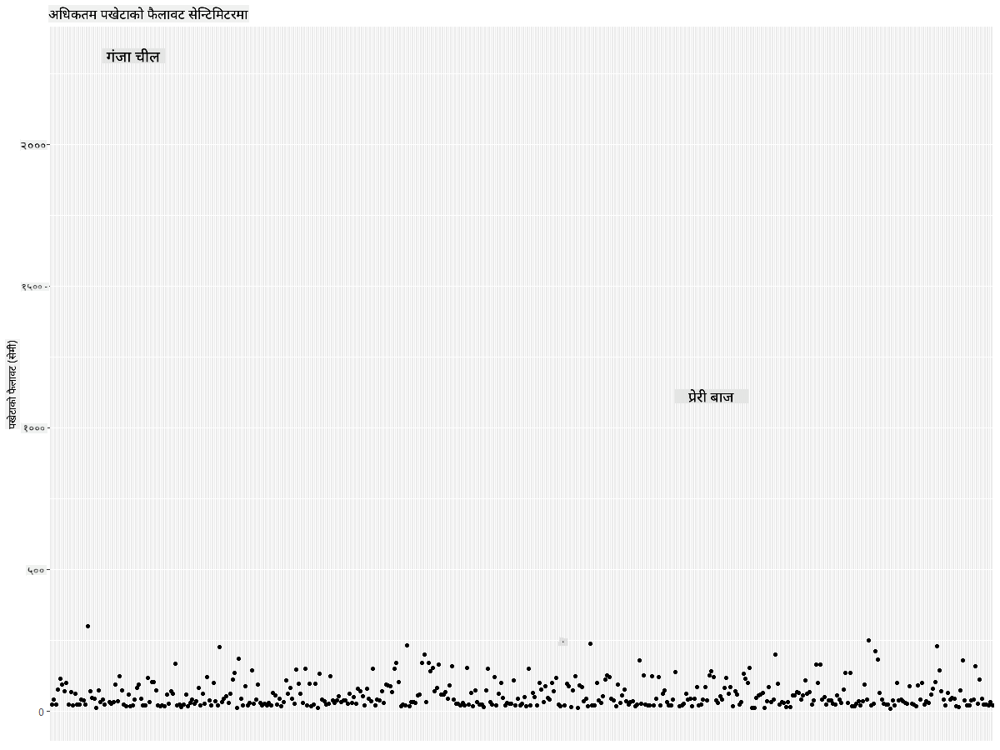
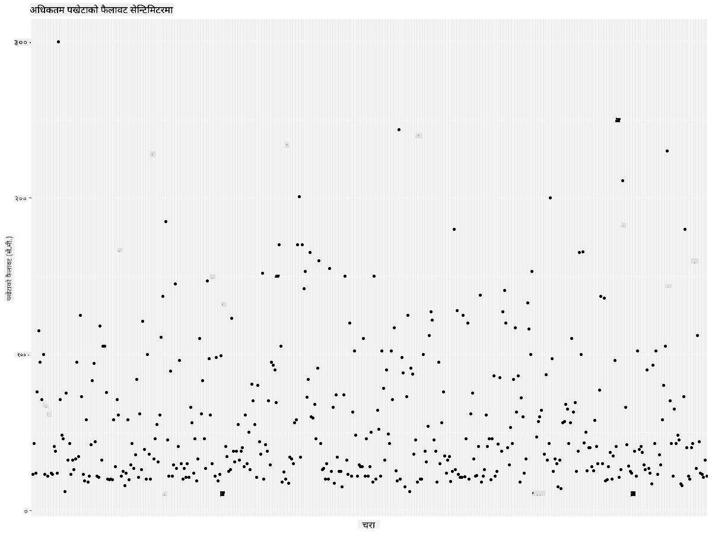
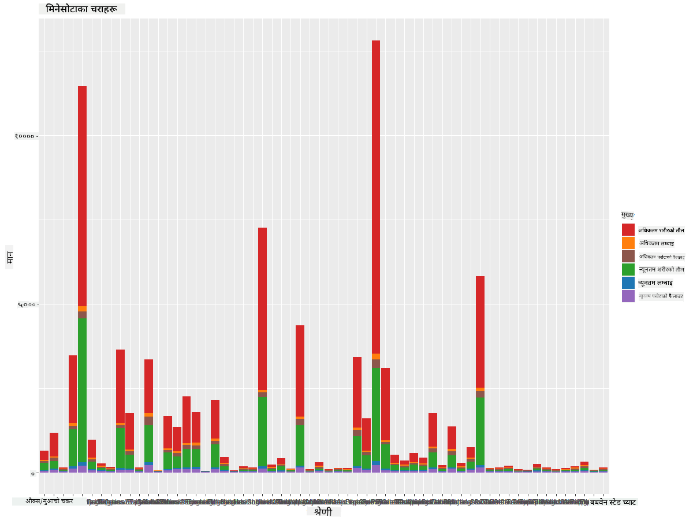
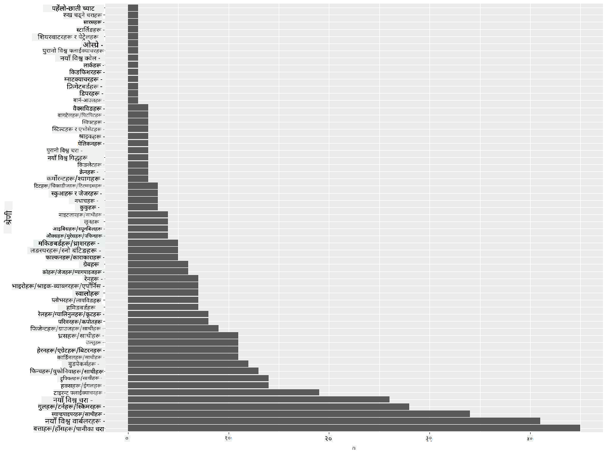
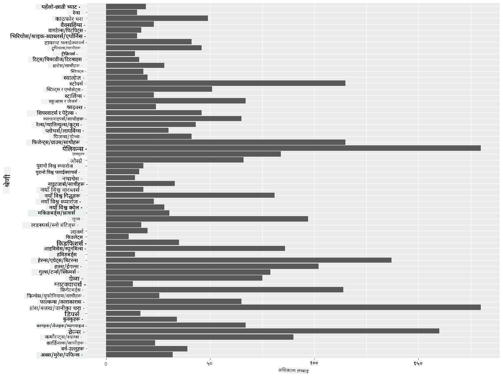

<!--
CO_OP_TRANSLATOR_METADATA:
{
  "original_hash": "22acf28f518a4769ea14fa42f4734b9f",
  "translation_date": "2025-08-27T18:30:27+00:00",
  "source_file": "3-Data-Visualization/R/09-visualization-quantities/README.md",
  "language_code": "ne"
}
-->
# परिमाणहरूको दृश्यात्मकता
| ](https://github.com/microsoft/Data-Science-For-Beginners/blob/main/sketchnotes/09-Visualizing-Quantities.png)|
|:---:|
| परिमाणहरूको दृश्यात्मकता - _Sketchnote by [@nitya](https://twitter.com/nitya)_ |

यस पाठमा तपाईंले परिमाणको अवधारणालाई केन्द्रित गर्दै रोचक दृश्यात्मकता बनाउन सिक्नका लागि उपलब्ध R प्याकेज पुस्तकालयहरूको प्रयोग गर्ने तरिका अन्वेषण गर्नुहुनेछ। मिनेसोटाका चराहरूको सफा गरिएको डेटासेट प्रयोग गरेर, तपाईंले स्थानीय वन्यजन्तुका बारेमा धेरै रोचक तथ्यहरू जान्न सक्नुहुन्छ।  
## [पाठपूर्व प्रश्नोत्तरी](https://purple-hill-04aebfb03.1.azurestaticapps.net/quiz/16)

## ggplot2 प्रयोग गरेर पखेटाको फैलावट अवलोकन गर्नुहोस्
विभिन्न प्रकारका साधारण र परिष्कृत प्लट र चार्टहरू बनाउनका लागि [ggplot2](https://cran.r-project.org/web/packages/ggplot2/index.html) एक उत्कृष्ट पुस्तकालय हो। सामान्यतया, यी पुस्तकालयहरूको प्रयोग गरेर डेटा प्लट गर्ने प्रक्रियामा तपाईंको डेटा फ्रेमका भागहरू पहिचान गर्ने, आवश्यक परिमार्जन गर्ने, x र y अक्षका मानहरू तोक्ने, कुन प्रकारको प्लट देखाउने निर्णय गर्ने, र त्यसपछि प्लट देखाउने समावेश हुन्छ।

`ggplot2` ग्राफिक्सको व्याकरणमा आधारित ग्राफिक्स सिर्जना गर्ने प्रणाली हो। [ग्राफिक्सको व्याकरण](https://en.wikipedia.org/wiki/Ggplot2) डेटा दृश्यात्मकताको लागि एउटा सामान्य योजना हो जसले ग्राफहरूलाई स्केल र तहजस्ता अर्थपूर्ण घटकहरूमा विभाजन गर्दछ। अर्को शब्दमा, थोरै कोडको साथ एकल वा बहुविविध डेटा प्लट र ग्राफहरू बनाउनको सजिलोपनले `ggplot2` लाई R मा दृश्यात्मकताका लागि सबैभन्दा लोकप्रिय प्याकेज बनाएको छ। प्रयोगकर्ताले `ggplot2` लाई कसरी चरहरूलाई सौन्दर्यमा म्याप गर्ने, ग्राफिकल प्रिमिटिभहरू प्रयोग गर्ने भनेर बताउँछ, र `ggplot2` ले बाँकी काम गर्छ।

> ✅ प्लट = डेटा + सौन्दर्य + ज्यामिति  
> - डेटा भनेको डेटासेट हो  
> - सौन्दर्यले अध्ययन गर्नुपर्ने चरहरू (x र y चरहरू) जनाउँछ  
> - ज्यामितिले प्लटको प्रकार (लाइन प्लट, बार प्लट, आदि) जनाउँछ  

तपाईंको डेटा र प्लटमार्फत भन्न चाहेको कथाको आधारमा उत्तम ज्यामिति (प्लटको प्रकार) छान्नुहोस्।  

> - प्रवृत्ति विश्लेषण गर्न: लाइन, स्तम्भ  
> - मानहरूको तुलना गर्न: बार, स्तम्भ, पाई, स्क्याटरप्लट  
> - भागहरू सम्पूर्णसँग कसरी सम्बन्धित छन् देखाउन: पाई  
> - डेटा वितरण देखाउन: स्क्याटरप्लट, बार  
> - मानहरू बीचको सम्बन्ध देखाउन: लाइन, स्क्याटरप्लट, बबल  

✅ तपाईंले यो वर्णनात्मक [चिटशीट](https://nyu-cdsc.github.io/learningr/assets/data-visualization-2.1.pdf) पनि हेर्न सक्नुहुन्छ ggplot2 का लागि।

## चराहरूको पखेटाको फैलावटको बारेमा लाइन प्लट बनाउनुहोस्

R कन्सोल खोल्नुहोस् र डेटासेट आयात गर्नुहोस्।  
> नोट: डेटासेट यो रिपोजिटरीको रुटमा `/data` फोल्डरमा भण्डारण गरिएको छ।  

डेटासेट आयात गरौं र डेटा हेड (शीर्ष ५ पङ्क्तिहरू) अवलोकन गरौं।  

```r
birds <- read.csv("../../data/birds.csv",fileEncoding="UTF-8-BOM")
head(birds)
```  
डेटाको हेडमा पाठ र सङ्ख्याको मिश्रण छ:  

|      | नाम                          | वैज्ञानिक नाम          | श्रेणी               | क्रम         | परिवार   | वंश        | संरक्षण स्थिति | न्यूनतम लम्बाइ | अधिकतम लम्बाइ | न्यूनतम शरीर भार | अधिकतम शरीर भार | न्यूनतम पखेटा फैलावट | अधिकतम पखेटा फैलावट |  
| ---: | :--------------------------- | :--------------------- | :------------------- | :----------- | :------- | :--------- | :------------- | -------------: | -------------: | ---------------: | ---------------: | ------------------: | ------------------: |  
|    0 | कालो-पेट भएको सिठ्ठी बतासे | Dendrocygna autumnalis | हाँस/बतासे/पानीपक्षी | Anseriformes | Anatidae | Dendrocygna | LC              |              47 |              56 |               652 |              1020 |                  76 |                  94 |  
|    1 | फुल्भस सिठ्ठी बतासे        | Dendrocygna bicolor    | हाँस/बतासे/पानीपक्षी | Anseriformes | Anatidae | Dendrocygna | LC              |              45 |              53 |               712 |              1050 |                  85 |                  93 |  
|    2 | हिउँ हाँस                   | Anser caerulescens     | हाँस/बतासे/पानीपक्षी | Anseriformes | Anatidae | Anser       | LC              |              64 |              79 |              2050 |              4050 |                 135 |                 165 |  
|    3 | रॉसको हाँस                  | Anser rossii           | हाँस/बतासे/पानीपक्षी | Anseriformes | Anatidae | Anser       | LC              |            57.3 |              64 |              1066 |              1567 |                 113 |                 116 |  
|    4 | ठूलो सेतो-फ्रन्टेड हाँस    | Anser albifrons        | हाँस/बतासे/पानीपक्षी | Anseriformes | Anatidae | Anser       | LC              |              64 |              81 |              1930 |              3310 |                 130 |                 165 |  

अब यी रोचक चराहरूको अधिकतम पखेटा फैलावटको दृश्यात्मकता गर्न एउटा साधारण लाइन प्लट बनाऔं।  

```r
install.packages("ggplot2")
library("ggplot2")
ggplot(data=birds, aes(x=Name, y=MaxWingspan,group=1)) +
  geom_line() 
```  
यहाँ, तपाईंले `ggplot2` प्याकेज इन्स्टल गर्नुभयो र त्यसलाई `library("ggplot2")` आदेश प्रयोग गरेर कार्यक्षेत्रमा आयात गर्नुभयो। ggplot मा कुनै पनि प्लट बनाउन `ggplot()` फङ्क्सन प्रयोग गरिन्छ र तपाईं डेटासेट, x र y चरहरूलाई विशेषता रूपमा निर्दिष्ट गर्नुहुन्छ। यस अवस्थामा, हामीले लाइन प्लट बनाउन `geom_line()` फङ्क्सन प्रयोग गर्यौं।  

  

तपाईंले के तुरुन्तै देख्नुभयो? कम्तीमा एउटा बाहिरको मान (outlier) देखिन्छ - यो त धेरै ठूलो पखेटा फैलावट हो! २०००+ सेन्टिमिटरको पखेटा फैलावट भनेको २० मिटरभन्दा बढी हो - के मिनेसोटामा प्टेरोड्याक्टाइलहरू छन्? अनुसन्धान गरौं।  

Excel मा छिटो सर्ट गरेर ती बाहिरका मानहरू पत्ता लगाउन सकिन्छ, तर प्लटभित्रैबाट दृश्यात्मकता प्रक्रियालाई जारी राखौं।  

x-अक्षमा चराहरूको प्रकार देखाउन लेबलहरू थप्नुहोस्:  

```r
ggplot(data=birds, aes(x=Name, y=MaxWingspan,group=1)) +
  geom_line() +
  theme(axis.text.x = element_text(angle = 45, hjust=1))+
  xlab("Birds") +
  ylab("Wingspan (CM)") +
  ggtitle("Max Wingspan in Centimeters")
```  
हामीले `theme` मा कोण निर्दिष्ट गर्यौं र `xlab()` र `ylab()` मा x र y अक्षका लेबलहरू निर्दिष्ट गर्यौं। `ggtitle()` ले ग्राफ/प्लटलाई नाम दिन्छ।  

  

लेबलहरूलाई ४५ डिग्रीमा घुमाउँदा पनि धेरै पढ्न गाह्रो छ। अर्को रणनीति प्रयास गरौं: बाहिरका मानहरूलाई मात्र लेबल गरौं र चार्टभित्रै लेबल राखौं। स्क्याटर चार्ट प्रयोग गरेर लेबलिङका लागि बढी ठाउँ बनाऔं:  

```r
ggplot(data=birds, aes(x=Name, y=MaxWingspan,group=1)) +
  geom_point() +
  geom_text(aes(label=ifelse(MaxWingspan>500,as.character(Name),'')),hjust=0,vjust=0) + 
  theme(axis.title.x=element_blank(), axis.text.x=element_blank(), axis.ticks.x=element_blank())
  ylab("Wingspan (CM)") +
  ggtitle("Max Wingspan in Centimeters") + 
```  
यहाँ के भइरहेको छ? तपाईंले स्क्याटर बिन्दुहरू प्लट गर्न `geom_point()` फङ्क्सन प्रयोग गर्नुभयो। यससँगै, तपाईंले `MaxWingspan > 500` भएका चराहरूका लागि लेबलहरू थप्नुभयो र x अक्षका लेबलहरू लुकाउनुभयो ताकि प्लट सफा देखियो।  

तपाईंले के पत्ता लगाउनुभयो?  

  

## तपाईंको डेटा फिल्टर गर्नुहोस्  

बाल्ड इगल र प्रेरी फाल्कन, सम्भवतः धेरै ठूला चरा भए पनि, तिनीहरूको अधिकतम पखेटा फैलावटमा अतिरिक्त ० थपिएको जस्तो देखिन्छ। २५ मिटरको पखेटा फैलावट भएको बाल्ड इगल भेट्नुभयो भने कृपया हामीलाई जानकारी दिनुहोस्! ती दुई बाहिरका मानहरू बिना नयाँ डेटाफ्रेम बनाऔं:  

```r
birds_filtered <- subset(birds, MaxWingspan < 500)

ggplot(data=birds_filtered, aes(x=Name, y=MaxWingspan,group=1)) +
  geom_point() +
  ylab("Wingspan (CM)") +
  xlab("Birds") +
  ggtitle("Max Wingspan in Centimeters") + 
  geom_text(aes(label=ifelse(MaxWingspan>500,as.character(Name),'')),hjust=0,vjust=0) +
  theme(axis.text.x=element_blank(), axis.ticks.x=element_blank())
```  
हामीले नयाँ डेटाफ्रेम `birds_filtered` बनायौं र त्यसपछि स्क्याटर प्लट बनायौं। बाहिरका मानहरू हटाएर, तपाईंको डेटा अब बढी सुसंगत र बुझ्न योग्य छ।  

  

अब हामीसँग पखेटा फैलावटको हिसाबले सफा डेटासेट छ, यी चराहरूका बारेमा थप पत्ता लगाऔं।  

लाइन र स्क्याटर प्लटहरूले डेटा मानहरू र तिनीहरूको वितरणको जानकारी देखाउन सक्छन्, तर हामी यस डेटासेटमा निहित मानहरूको बारेमा सोच्न चाहन्छौं। तपाईंले परिमाणका बारेमा निम्न प्रश्नहरूको उत्तर दिन दृश्यात्मकता बनाउन सक्नुहुन्छ:  

> कति प्रकारका चराहरू छन्, र तिनीहरूको सङ्ख्या कति छ?  
> कति चरा लोप भएका, संकटग्रस्त, दुर्लभ, वा सामान्य छन्?  
> लिनियसको शब्दावलीमा विभिन्न वंश र क्रमका कति चरा छन्?  

## बार चार्टहरूको अन्वेषण गर्नुहोस्  

बार चार्टहरू डेटा समूहहरू देखाउनका लागि व्यावहारिक हुन्छन्। यस डेटासेटमा भएका चराहरूको श्रेणी अन्वेषण गरौं र कुन श्रेणी सबैभन्दा सामान्य छ हेर्नुहोस्।  
फिल्टर गरिएको डेटामा बार चार्ट बनाऔं।  

```r
install.packages("dplyr")
install.packages("tidyverse")

library(lubridate)
library(scales)
library(dplyr)
library(ggplot2)
library(tidyverse)

birds_filtered %>% group_by(Category) %>%
  summarise(n=n(),
  MinLength = mean(MinLength),
  MaxLength = mean(MaxLength),
  MinBodyMass = mean(MinBodyMass),
  MaxBodyMass = mean(MaxBodyMass),
  MinWingspan=mean(MinWingspan),
  MaxWingspan=mean(MaxWingspan)) %>% 
  gather("key", "value", - c(Category, n)) %>%
  ggplot(aes(x = Category, y = value, group = key, fill = key)) +
  geom_bar(stat = "identity") +
  scale_fill_manual(values = c("#D62728", "#FF7F0E", "#8C564B","#2CA02C", "#1F77B4", "#9467BD")) +                   
  xlab("Category")+ggtitle("Birds of Minnesota")

```  
तलको स्निपेटमा, हामीले डेटा हेरफेर र समूह गर्नका लागि [dplyr](https://www.rdocumentation.org/packages/dplyr/versions/0.7.8) र [lubridate](https://www.rdocumentation.org/packages/lubridate/versions/1.8.0) प्याकेजहरू इन्स्टल गर्यौं। त्यसपछि, `ggplot2` प्रयोग गरेर बार चार्ट प्लट गर्यौं।  

  

तर यो बार चार्ट पढ्न गाह्रो छ किनभने धेरै गैर-समूहित डेटा छ। तपाईंले प्लट गर्न चाहेको डेटा मात्र चयन गर्न आवश्यक छ। चराहरूको श्रेणीको आधारमा लम्बाइ हेर्नुहोस्।  

डेटालाई केवल चराहरूको श्रेणी समावेश गर्न फिल्टर गर्नुहोस्।  

किनभने धेरै श्रेणीहरू छन्, तपाईं यो चार्टलाई ठाडो रूपमा प्रदर्शन गर्न सक्नुहुन्छ र सबै डेटा समेट्न यसको उचाइ समायोजन गर्न सक्नुहुन्छ:  

```r
birds_count<-dplyr::count(birds_filtered, Category, sort = TRUE)
birds_count$Category <- factor(birds_count$Category, levels = birds_count$Category)
ggplot(birds_count,aes(Category,n))+geom_bar(stat="identity")+coord_flip()
```  
तपाईंले `Category` स्तम्भमा अद्वितीय मानहरूको गणना गर्नुभयो र त्यसलाई नयाँ डेटाफ्रेम `birds_count` मा क्रमबद्ध गर्नुभयो। यो क्रमबद्ध डेटालाई `ggplot2` प्रयोग गरेर बार चार्टमा प्लट गर्यौं। `coord_flip()` ले तेर्सो बारहरू प्लट गर्छ।  

  

यो बार चार्टले प्रत्येक श्रेणीमा चराहरूको सङ्ख्याको राम्रो दृश्य दिन्छ। एक झलकमा, तपाईंले देख्न सक्नुहुन्छ कि यस क्षेत्रमा सबैभन्दा धेरै सङ्ख्यामा चरा हाँस/बतासे/पानीपक्षी श्रेणीमा छन्। मिनेसोटा '१०,००० तालहरूको भूमि' भएकाले यो आश्चर्यजनक छैन!  

✅ यस डेटासेटमा अन्य गणनाहरू प्रयास गर्नुहोस्। के तपाईंलाई केही चकित पार्छ?  

## डेटा तुलना गर्नुहोस्  

समूहित डेटाको विभिन्न तुलना प्रयास गर्न नयाँ अक्षहरू सिर्जना गर्न सकिन्छ। चराको श्रेणीको आधारमा अधिकतम लम्बाइको तुलना प्रयास गर्नुहोस्:  

```r
birds_grouped <- birds_filtered %>%
  group_by(Category) %>%
  summarise(
  MaxLength = max(MaxLength, na.rm = T),
  MinLength = max(MinLength, na.rm = T)
           ) %>%
  arrange(Category)
  
ggplot(birds_grouped,aes(Category,MaxLength))+geom_bar(stat="identity")+coord_flip()
```  
हामीले `birds_filtered` डेटालाई `Category` द्वारा समूहबद्ध गर्यौं र बार चार्ट प्लट गर्यौं।  

  

यहाँ केही आश्चर्यजनक छैन: हमिङबर्डहरूको अधिकतम लम्बाइ पेलिकन वा हाँसको तुलनामा सबैभन्दा कम छ। डेटा तार्किक रूपमा सही हुँदा राम्रो लाग्छ!  

बार चार्टहरूको थप रोचक दृश्यात्मकता बनाउन, तपाईंले डेटा सुपरइम्पोज गर्न सक्नुहुन्छ। एउटा दिइएको चराको श्रेणीमा न्यूनतम र अधिकतम लम्बाइ सुपरइम्पोज गरौं:  

```r
ggplot(data=birds_grouped, aes(x=Category)) +
  geom_bar(aes(y=MaxLength), stat="identity", position ="identity",  fill='blue') +
  geom_bar(aes(y=MinLength), stat="identity", position="identity", fill='orange')+
  coord_flip()
```  
  

## 🚀 चुनौती  

यो चराको डेटासेटले विशेष पारिस्थितिकी तन्त्रभित्रका विभिन्न प्रकारका चराहरूको बारेमा जानकारीको खजाना प्रदान गर्दछ। इन्टरनेटमा खोजी गर्नुहोस् र अन्य चरा-सम्बन्धित डेटासेटहरू फेला पार्न प्रयास गर्नुहोस्। यी चराहरूको वरिपरि चार्ट र ग्राफहरू निर्माण गर्ने अभ्यास गर्नुहोस् र तपाईंले नबुझेका तथ्यहरू पत्ता लगाउनुहोस्।  
## [पाठपछिको प्रश्नोत्तरी](https://purple-hill-04aebfb03.1.azurestaticapps.net/quiz/17)

## समीक्षा र आत्म-अध्ययन  

यस पहिलो पाठले तपाईंलाई `ggplot2` प्रयोग गरेर परिमाणहरूको दृश्यात्मकता गर्ने केही जानकारी दिएको छ। डेटासेटहरूसँग काम गर्नका लागि अन्य तरिकाहरूको बारेमा अनुसन्धान गर्नुहोस्। अन्य प्याकेजहरू जस्तै [Lattice](https://stat.ethz.ch/R-manual/R-devel/library/lattice/html/Lattice.html) र [Plotly](https://github.com/plotly/plotly.R#readme) प्रयोग गरेर दृश्यात्मकता गर्न सकिने डेटासेटहरूको खोजी गर्नुहोस्।  

## असाइनमेन्ट  
[लाइन, स्क्याटर, र बारहरू](assignment.md)  

---

**अस्वीकरण**:  
यो दस्तावेज़ AI अनुवाद सेवा [Co-op Translator](https://github.com/Azure/co-op-translator) प्रयोग गरी अनुवाद गरिएको हो। हामी यथासम्भव शुद्धता सुनिश्चित गर्न प्रयास गर्छौं, तर कृपया ध्यान दिनुहोस् कि स्वचालित अनुवादमा त्रुटिहरू वा अशुद्धताहरू हुन सक्छन्। यसको मूल भाषामा रहेको मूल दस्तावेज़लाई आधिकारिक स्रोत मानिनुपर्छ। महत्वपूर्ण जानकारीका लागि, व्यावसायिक मानव अनुवाद सिफारिस गरिन्छ। यस अनुवादको प्रयोगबाट उत्पन्न हुने कुनै पनि गलतफहमी वा गलत व्याख्याका लागि हामी जिम्मेवार हुने छैनौं।