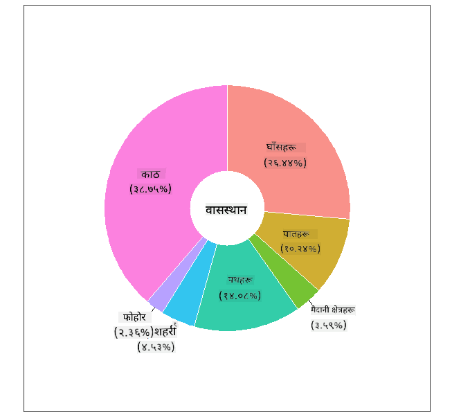
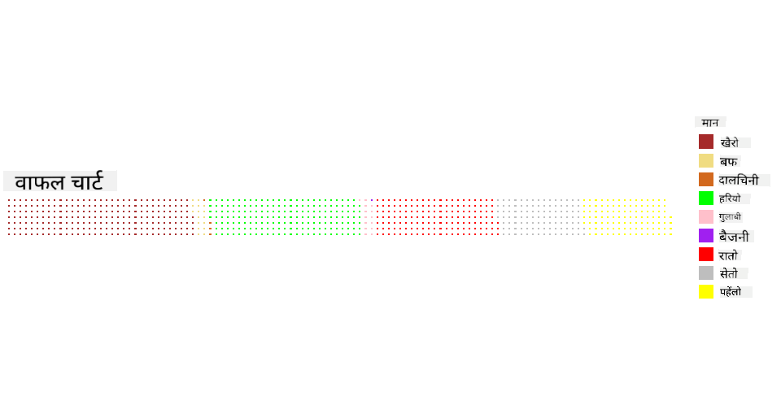

<!--
CO_OP_TRANSLATOR_METADATA:
{
  "original_hash": "47028abaaafa2bcb1079702d20569066",
  "translation_date": "2025-08-27T18:37:34+00:00",
  "source_file": "3-Data-Visualization/R/11-visualization-proportions/README.md",
  "language_code": "ne"
}
-->
# अनुपातहरूलाई दृश्यात्मक बनाउने

| ](../../../sketchnotes/11-Visualizing-Proportions.png)|
|:---:|
|अनुपातहरूलाई दृश्यात्मक बनाउने - _Sketchnote by [@nitya](https://twitter.com/nitya)_ |

यस पाठमा, तपाईंले प्रकृतिमा आधारित फरक डाटासेट प्रयोग गरेर अनुपातहरू दृश्यात्मक बनाउनुहुनेछ, जस्तै च्याउहरूको डाटासेटमा कति प्रकारका फङ्गीहरू छन् भनेर। आउनुहोस्, यी रोचक फङ्गीहरूको अध्ययन गरौं, जुन Audubon बाट लिइएको डाटासेट हो, जसमा Agaricus र Lepiota परिवारका २३ प्रजातिका गिल्ड च्याउहरूको विवरण छ। तपाईंले निम्न स्वादिष्ट चार्टहरूसँग प्रयोग गर्नुहुनेछ:

- पाई चार्ट 🥧  
- डोनट चार्ट 🍩  
- वाफल चार्ट 🧇  

> 💡 माइक्रोसफ्ट रिसर्चको [Charticulator](https://charticulator.com) नामक एक रोचक प्रोजेक्टले डेटा दृश्यात्मकताका लागि निःशुल्क ड्र्याग र ड्रप इन्टरफेस प्रदान गर्दछ। उनीहरूको एउटा ट्युटोरियलमा पनि यो च्याउ डाटासेट प्रयोग गरिएको छ! त्यसैले तपाईंले डेटा अन्वेषण गर्न र पुस्तकालय सिक्न एकैपटक मौका पाउनुहुन्छ: [Charticulator ट्युटोरियल](https://charticulator.com/tutorials/tutorial4.html)।

## [पाठपूर्व प्रश्नोत्तरी](https://purple-hill-04aebfb03.1.azurestaticapps.net/quiz/20)

## तपाईंका च्याउहरूलाई चिन्नुहोस् 🍄

च्याउहरू धेरै रोचक हुन्छन्। तिनीहरूको अध्ययन गर्न एउटा डाटासेट आयात गरौं:

```r
mushrooms = read.csv('../../data/mushrooms.csv')
head(mushrooms)
```  
एउटा तालिका प्रिन्ट हुन्छ, जसमा विश्लेषणका लागि उत्कृष्ट डेटा हुन्छ:

| वर्ग       | टोपी-आकार | टोपी-सतह | टोपी-रङ | चोटपटक | गन्ध    | गिल-जडान | गिल-दूरी | गिल-आकार | गिल-रङ | डाँठ-आकार | डाँठ-जरा | डाँठ-सतह-रिङमाथि | डाँठ-सतह-रिङमुनि | डाँठ-रङ-रिङमाथि | डाँठ-रङ-रिङमुनि | घुम्टो-प्रकार | घुम्टो-रङ | रिङ-सङ्ख्या | रिङ-प्रकार | बीउ-छाप-रङ | जनसङ्ख्या | बासस्थान |
| --------- | --------- | ----------- | --------- | ------- | ------- | --------------- | ------------ | --------- | ---------- | ----------- | ---------- | ------------------------ | ------------------------ | ---------------------- | ---------------------- | --------- | ---------- | ----------- | --------- | ----------------- | ---------- | ------- |
| विषाक्त    | उत्तल    | चिल्लो      | खैरो     | चोटपटक | तेज गन्ध | स्वतन्त्र        | नजिक        | साँघुरो    | कालो      | चौडा        | समान      | चिल्लो                   | चिल्लो                   | सेतो                  | सेतो                  | आंशिक     | सेतो      | एक         | झुन्डिएको   | कालो             | छरिएको    | शहरी     |
| खानेयोग्य | उत्तल    | चिल्लो      | पहेंलो   | चोटपटक | बदाम    | स्वतन्त्र        | नजिक        | चौडा      | कालो      | चौडा        | डन्डा      | चिल्लो                   | चिल्लो                   | सेतो                  | सेतो                  | आंशिक     | सेतो      | एक         | झुन्डिएको   | खैरो             | धेरै      | घाँस |
| खानेयोग्य | घण्टी     | चिल्लो      | सेतो     | चोटपटक | सौंफ    | स्वतन्त्र        | नजिक        | चौडा      | खैरो      | चौडा        | डन्डा      | चिल्लो                   | चिल्लो                   | सेतो                  | सेतो                  | आंशिक     | सेतो      | एक         | झुन्डिएको   | खैरो             | धेरै      | मैदान |
| विषाक्त    | उत्तल    | खस्रो       | सेतो     | चोटपटक | तेज गन्ध | स्वतन्त्र        | नजिक        | साँघुरो    | खैरो      | चौडा        | समान      | चिल्लो                   | चिल्लो                   | सेतो                  | सेतो                  | आंशिक     | सेतो      | एक         | झुन्डिएको   | कालो             | छरिएको    | शहरी |
| खानेयोग्य | उत्तल    | चिल्लो      | हरियो    | चोटपटक छैन | कुनै गन्ध छैन | स्वतन्त्र        | भीडभाड      | चौडा      | कालो      | टोकिएको    | समान      | चिल्लो                   | चिल्लो                   | सेतो                  | सेतो                  | आंशिक     | सेतो      | एक         | अस्थायी    | खैरो             | प्रशस्त   | घाँस |
| खानेयोग्य | उत्तल    | खस्रो       | पहेंलो   | चोटपटक | बदाम    | स्वतन्त्र        | नजिक        | चौडा      | खैरो      | चौडा        | डन्डा      | चिल्लो                   | चिल्लो                   | सेतो                  | सेतो                  | आंशिक     | सेतो      | एक         | झुन्डिएको   | कालो             | धेरै      | घाँस |

तुरुन्तै, तपाईंले देख्नुहुन्छ कि सबै डेटा पाठ्यात्मक छ। तपाईंले यसलाई चार्टमा प्रयोग गर्नका लागि रूपान्तरण गर्नुपर्नेछ। वास्तवमा, अधिकांश डेटा वस्तुका रूपमा प्रस्तुत गरिएको छ:

```r
names(mushrooms)
```  

आउटपुट यस्तो देखिन्छ:

```output
[1] "class"                    "cap.shape"               
 [3] "cap.surface"              "cap.color"               
 [5] "bruises"                  "odor"                    
 [7] "gill.attachment"          "gill.spacing"            
 [9] "gill.size"                "gill.color"              
[11] "stalk.shape"              "stalk.root"              
[13] "stalk.surface.above.ring" "stalk.surface.below.ring"
[15] "stalk.color.above.ring"   "stalk.color.below.ring"  
[17] "veil.type"                "veil.color"              
[19] "ring.number"              "ring.type"               
[21] "spore.print.color"        "population"              
[23] "habitat"            
```  
'वर्ग' स्तम्भलाई श्रेणीमा रूपान्तरण गर्न यो डेटा प्रयोग गर्नुहोस्:

```r
library(dplyr)
grouped=mushrooms %>%
  group_by(class) %>%
  summarise(count=n())
```  

अब, यदि तपाईं च्याउको डेटा प्रिन्ट गर्नुहुन्छ भने, यो विषाक्त/खानेयोग्य वर्गअनुसार श्रेणीमा समूह गरिएको देखिन्छ:  
```r
View(grouped)
```  

| वर्ग       | सङ्ख्या |
| --------- | --------- |
| खानेयोग्य | ४२०८ |
| विषाक्त    | ३९१६ |

यदि तपाईंले यस तालिकामा प्रस्तुत गरिएको क्रमलाई पछ्याएर वर्ग श्रेणीका लेबलहरू सिर्जना गर्नुभयो भने, तपाईं पाई चार्ट बनाउन सक्नुहुन्छ।

## पाई!

```r
pie(grouped$count,grouped$class, main="Edible?")
```  
ल, पाई चार्ट तयार भयो, जसले यी दुई वर्गका च्याउहरूको अनुपातलाई देखाउँछ। लेबलहरूको क्रम सही राख्नु यहाँ धेरै महत्त्वपूर्ण छ, त्यसैले लेबल एरे बनाउँदा क्रम जाँच गर्न निश्चित गर्नुहोस्!


## डोनट!

पाई चार्टको तुलनामा अलि बढी आकर्षक चार्ट भनेको डोनट चार्ट हो, जसमा बीचमा प्वाल हुन्छ। यस विधिबाट हाम्रो डेटा हेरौं।

च्याउहरू विभिन्न बासस्थानमा कसरी बढ्छन्, हेर्नुहोस्:

```r
library(dplyr)
habitat=mushrooms %>%
  group_by(habitat) %>%
  summarise(count=n())
View(habitat)
```  
आउटपुट यस्तो छ:  
| बासस्थान | सङ्ख्या |
| --------- | --------- |
| घाँस      | २१४८ |
| पातहरू    | ८३२ |
| मैदान     | २९२ |
| बाटोहरू   | ११४४ |
| शहरी      | ३६८ |
| फोहोर     | १९२ |
| काठ       | ३१४८ |

यहाँ, तपाईंले आफ्नो डेटा बासस्थानअनुसार समूह गर्नुभएको छ। ७ वटा सूचीबद्ध छन्, त्यसैले यीलाई डोनट चार्टका लागि लेबलका रूपमा प्रयोग गर्नुहोस्:

```r
library(ggplot2)
library(webr)
PieDonut(habitat, aes(habitat, count=count))
```  



यो कोडले ggplot2 र webr नामक दुई पुस्तकालयहरू प्रयोग गर्दछ। webr पुस्तकालयको PieDonut फङ्क्शन प्रयोग गरेर, हामी सजिलै डोनट चार्ट बनाउन सक्छौं!

R मा डोनट चार्ट केवल ggplot2 पुस्तकालय प्रयोग गरेर पनि बनाउन सकिन्छ। यसबारे थप जान्न [यहाँ](https://www.r-graph-gallery.com/128-ring-or-donut-plot.html) हेर्नुहोस् र आफैं प्रयास गर्नुहोस्।

अब तपाईंलाई थाहा भयो कि आफ्नो डेटा समूह गरेर पाई वा डोनट चार्टमा कसरी देखाउने, तपाईं अन्य प्रकारका चार्टहरू अन्वेषण गर्न सक्नुहुन्छ। वाफल चार्ट प्रयास गर्नुहोस्, जुन मात्रालाई अन्वेषण गर्ने फरक तरिका हो।

## वाफल!

'वाफल' प्रकारको चार्ट मात्रालाई २D वर्गहरूको एरेका रूपमा दृश्यात्मक बनाउने फरक तरिका हो। यस डाटासेटमा च्याउको टोपीका रङहरूको विभिन्न मात्राहरूलाई दृश्यात्मक बनाउन प्रयास गर्नुहोस्। यसका लागि, [waffle](https://cran.r-project.org/web/packages/waffle/waffle.pdf) नामक सहायक पुस्तकालय स्थापना गर्नुहोस् र यसलाई प्रयोग गरेर आफ्नो दृश्यात्मकता सिर्जना गर्नुहोस्:

```r
install.packages("waffle", repos = "https://cinc.rud.is")
```  

आफ्नो डेटा समूह गर्न खण्ड चयन गर्नुहोस्:

```r
library(dplyr)
cap_color=mushrooms %>%
  group_by(cap.color) %>%
  summarise(count=n())
View(cap_color)
```  

लेबलहरू सिर्जना गरेर र आफ्नो डेटा समूह गरेर वाफल चार्ट बनाउनुहोस्:

```r
library(waffle)
names(cap_color$count) = paste0(cap_color$cap.color)
waffle((cap_color$count/10), rows = 7, title = "Waffle Chart")+scale_fill_manual(values=c("brown", "#F0DC82", "#D2691E", "green", 
                                                                                     "pink", "purple", "red", "grey", 
                                                                                     "yellow","white"))
```  

वाफल चार्ट प्रयोग गरेर, तपाईंले च्याउको टोपीका रङहरूको अनुपात स्पष्ट रूपमा देख्न सक्नुहुन्छ। रोचक कुरा, धेरै हरियो टोपी भएका च्याउहरू छन्!



यस पाठमा, तपाईंले अनुपातहरू दृश्यात्मक बनाउन तीन तरिकाहरू सिक्नुभयो। पहिलो, तपाईंले आफ्नो डेटा श्रेणीमा समूह गर्नुपर्छ र त्यसपछि डेटा देखाउन सबैभन्दा उपयुक्त तरिका निर्णय गर्नुपर्छ - पाई, डोनट, वा वाफल। यी सबै स्वादिष्ट छन् र प्रयोगकर्तालाई डाटासेटको झलक तुरुन्तै दिन्छन्।

## 🚀 चुनौती

[Charticulator](https://charticulator.com) मा यी स्वादिष्ट चार्टहरू पुनः सिर्जना गर्न प्रयास गर्नुहोस्।  
## [पाठपछिको प्रश्नोत्तरी](https://purple-hill-04aebfb03.1.azurestaticapps.net/quiz/21)

## समीक्षा र आत्म-अध्ययन

कहिलेकाहीँ पाई, डोनट, वा वाफल चार्ट कहिले प्रयोग गर्ने भन्ने कुरा स्पष्ट हुँदैन। यस विषयमा पढ्नका लागि केही लेखहरू यहाँ छन्:

https://www.beautiful.ai/blog/battle-of-the-charts-pie-chart-vs-donut-chart  

https://medium.com/@hypsypops/pie-chart-vs-donut-chart-showdown-in-the-ring-5d24fd86a9ce  

https://www.mit.edu/~mbarker/formula1/f1help/11-ch-c6.htm  

https://medium.datadriveninvestor.com/data-visualization-done-the-right-way-with-tableau-waffle-chart-fdf2a19be402  

यस निर्णयबारे थप जानकारी खोज्न अनुसन्धान गर्नुहोस्।  
## असाइनमेन्ट

[Excel मा प्रयास गर्नुहोस्](assignment.md)  

---

**अस्वीकरण**:  
यो दस्तावेज़ AI अनुवाद सेवा [Co-op Translator](https://github.com/Azure/co-op-translator) प्रयोग गरी अनुवाद गरिएको हो। हामी यथासम्भव शुद्धताको प्रयास गर्छौं, तर कृपया ध्यान दिनुहोस् कि स्वचालित अनुवादहरूमा त्रुटि वा अशुद्धता हुन सक्छ। यसको मूल भाषामा रहेको मूल दस्तावेज़लाई आधिकारिक स्रोत मानिनुपर्छ। महत्त्वपूर्ण जानकारीका लागि, व्यावसायिक मानव अनुवाद सिफारिस गरिन्छ। यस अनुवादको प्रयोगबाट उत्पन्न हुने कुनै पनि गलतफहमी वा गलत व्याख्याको लागि हामी जिम्मेवार हुने छैनौं।  