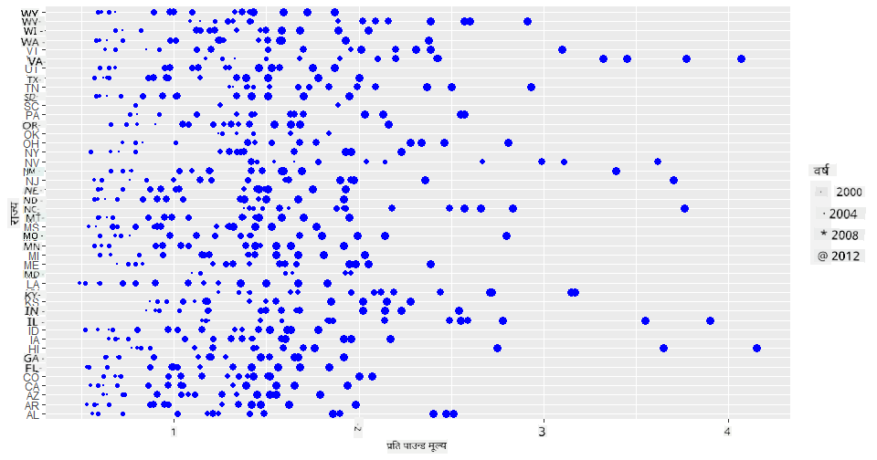
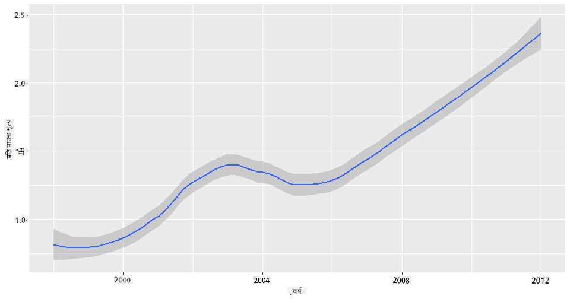
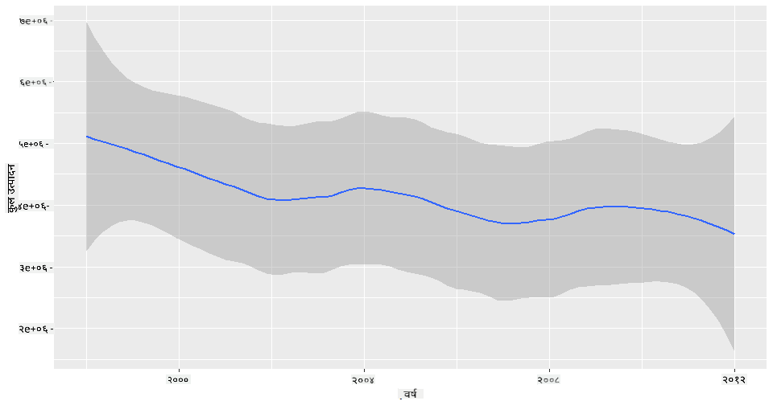
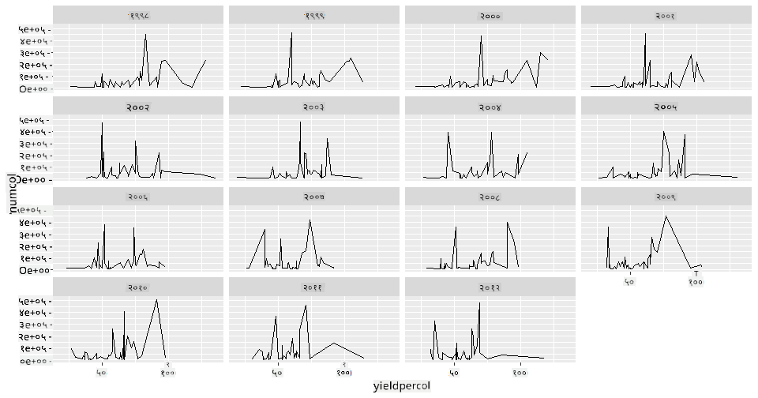
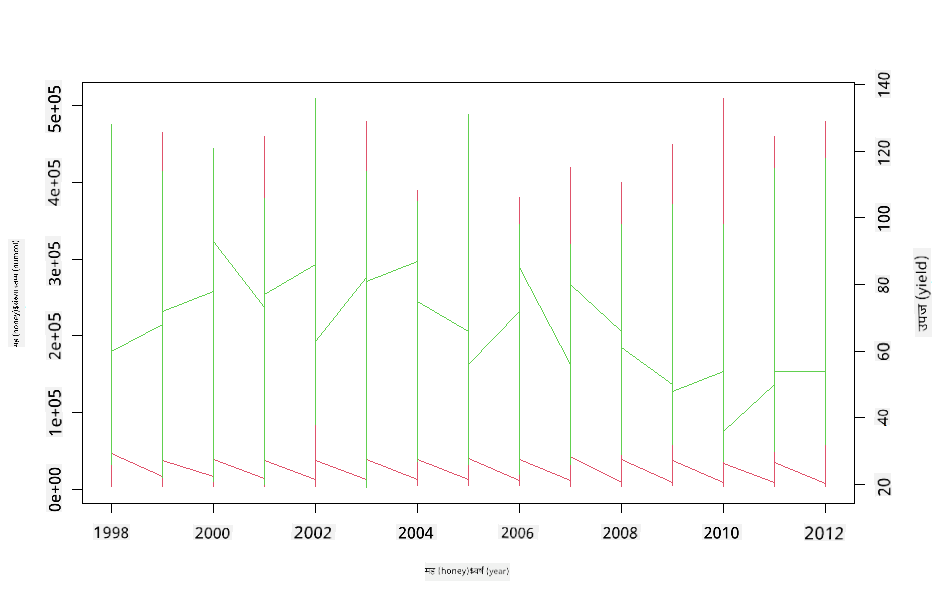

<!--
CO_OP_TRANSLATOR_METADATA:
{
  "original_hash": "a33c5d4b4156a2b41788d8720b6f724c",
  "translation_date": "2025-08-27T18:26:03+00:00",
  "source_file": "3-Data-Visualization/R/12-visualization-relationships/README.md",
  "language_code": "ne"
}
-->
# सम्बन्धहरू देखाउने: महको बारेमा 🍯

| ](../../../sketchnotes/12-Visualizing-Relationships.png)|
|:---:|
|सम्बन्धहरू देखाउने - _Sketchnote by [@nitya](https://twitter.com/nitya)_ |

हाम्रो अनुसन्धानको प्रकृतिमा केन्द्रित विषयलाई निरन्तरता दिँदै, विभिन्न प्रकारका महहरू बीचको सम्बन्ध देखाउन रोचक दृश्यहरू पत्ता लगाऔं, जुन [संयुक्त राज्य कृषि विभाग](https://www.nass.usda.gov/About_NASS/index.php) बाट प्राप्त डेटासेटमा आधारित छ। 

यो करिब ६०० वस्तुहरूको डेटासेटले धेरै अमेरिकी राज्यहरूमा मह उत्पादन देखाउँछ। उदाहरणका लागि, तपाईंले १९९८-२०१२ को अवधिमा कुनै राज्यको मह उत्पादन, प्रति उपनिवेश उत्पादन, कुल उत्पादन, स्टक, प्रति पाउन्ड मूल्य, र महको मूल्य जस्ता तथ्यांकहरू हेर्न सक्नुहुन्छ। प्रत्येक राज्यका लागि प्रत्येक वर्षको तथ्यांक एक पङ्क्तिमा समेटिएको छ। 

कुनै राज्यको वार्षिक उत्पादन र त्यस राज्यको महको मूल्य बीचको सम्बन्ध देखाउन यो डेटासेट उपयोगी हुन सक्छ। वैकल्पिक रूपमा, तपाईंले राज्यहरूको प्रति उपनिवेश मह उत्पादनको सम्बन्ध देखाउन सक्नुहुन्छ। यो समयावधि २००६ मा पहिलो पटक देखिएको 'सीसीडी' वा 'कोलोनी कोलाप्स डिसअर्डर' (http://npic.orst.edu/envir/ccd.html) लाई समेट्छ, जसले यो अध्ययन गर्न महत्त्वपूर्ण बनाउँछ। 🐝

## [पाठपूर्व प्रश्नोत्तरी](https://purple-hill-04aebfb03.1.azurestaticapps.net/quiz/22)

यस पाठमा, तपाईंले ggplot2 प्रयोग गर्न सक्नुहुन्छ, जुन तपाईंले पहिले पनि प्रयोग गर्नुभएको छ, र यो चरहरू बीचको सम्बन्ध देखाउन राम्रो पुस्तकालय हो। विशेष गरी ggplot2 को `geom_point` र `qplot` कार्यहरू उपयोगी छन्, जसले छिटो '[सांख्यिकीय सम्बन्धहरू](https://ggplot2.tidyverse.org/)' देखाउन स्क्याटर प्लट र लाइन प्लटहरू बनाउन अनुमति दिन्छ। यसले डेटा वैज्ञानिकलाई चरहरू बीचको सम्बन्ध राम्रोसँग बुझ्न मद्दत गर्दछ।

## स्क्याटरप्लटहरू

स्क्याटरप्लट प्रयोग गरेर महको मूल्य वर्ष-प्रति-वर्ष, राज्य अनुसार कसरी परिवर्तन भएको छ भनेर देखाउनुहोस्। ggplot2 को `ggplot` र `geom_point` प्रयोग गरेर, राज्यको डेटा समूहबद्ध गर्न र श्रेणीगत र संख्यात्मक डेटा दुवैका लागि डेटा बिन्दुहरू देखाउन सजिलो हुन्छ। 

सुरुमा डेटा आयात र Seaborn प्रयोग गरौं:

```r
honey=read.csv('../../data/honey.csv')
head(honey)
```
तपाईंले देख्नुहुनेछ कि मह डेटामा वर्ष र प्रति पाउन्ड मूल्य जस्ता धेरै रोचक स्तम्भहरू छन्। अमेरिकी राज्य अनुसार यो डेटा अन्वेषण गरौं:

| state | numcol | yieldpercol | totalprod | stocks   | priceperlb | prodvalue | year |
| ----- | ------ | ----------- | --------- | -------- | ---------- | --------- | ---- |
| AL    | 16000  | 71          | 1136000   | 159000   | 0.72       | 818000    | 1998 |
| AZ    | 55000  | 60          | 3300000   | 1485000  | 0.64       | 2112000   | 1998 |
| AR    | 53000  | 65          | 3445000   | 1688000  | 0.59       | 2033000   | 1998 |
| CA    | 450000 | 83          | 37350000  | 12326000 | 0.62       | 23157000  | 1998 |
| CO    | 27000  | 72          | 1944000   | 1594000  | 0.7        | 1361000   | 1998 |
| FL    | 230000 | 98          |22540000   | 4508000  | 0.64       | 14426000  | 1998 |

प्रति पाउन्ड महको मूल्य र यसको अमेरिकी राज्यको उत्पत्तिबीचको सम्बन्ध देखाउन एउटा आधारभूत स्क्याटरप्लट बनाउनुहोस्। `y` अक्षलाई सबै राज्यहरू देखाउन पर्याप्त अग्लो बनाउनुहोस्:

```r
library(ggplot2)
ggplot(honey, aes(x = priceperlb, y = state)) +
  geom_point(colour = "blue")
```


अब, महको मूल्य वर्ष-प्रति-वर्ष कसरी परिवर्तन भएको छ भनेर देखाउन महको रंग योजना प्रयोग गरेर उही डेटा देखाउनुहोस्। तपाईंले 'scale_color_gradientn' प्यारामिटर थपेर यो गर्न सक्नुहुन्छ:

> ✅ [scale_color_gradientn](https://www.rdocumentation.org/packages/ggplot2/versions/0.9.1/topics/scale_colour_gradientn) को बारेमा थप जान्नुहोस् - सुन्दर रेनबो रंग योजना प्रयास गर्नुहोस्!

```r
ggplot(honey, aes(x = priceperlb, y = state, color=year)) +
  geom_point()+scale_color_gradientn(colours = colorspace::heat_hcl(7))
```


यो रंग योजनाको परिवर्तनसँगै, तपाईंले स्पष्ट रूपमा देख्न सक्नुहुन्छ कि महको प्रति पाउन्ड मूल्य वर्ष-प्रति-वर्ष बलियो रूपमा बढिरहेको छ। उदाहरणका लागि, एरिजोना राज्यको डेटा हेर्दा, मूल्यमा वर्ष-प्रति-वर्ष वृद्धि भएको देखिन्छ, केही अपवादहरू बाहेक:

| state | numcol | yieldpercol | totalprod | stocks  | priceperlb | prodvalue | year |
| ----- | ------ | ----------- | --------- | ------- | ---------- | --------- | ---- |
| AZ    | 55000  | 60          | 3300000   | 1485000 | 0.64       | 2112000   | 1998 |
| AZ    | 52000  | 62          | 3224000   | 1548000 | 0.62       | 1999000   | 1999 |
| AZ    | 40000  | 59          | 2360000   | 1322000 | 0.73       | 1723000   | 2000 |
| AZ    | 43000  | 59          | 2537000   | 1142000 | 0.72       | 1827000   | 2001 |
| AZ    | 38000  | 63          | 2394000   | 1197000 | 1.08       | 2586000   | 2002 |
| AZ    | 35000  | 72          | 2520000   | 983000  | 1.34       | 3377000   | 2003 |
| AZ    | 32000  | 55          | 1760000   | 774000  | 1.11       | 1954000   | 2004 |
| AZ    | 36000  | 50          | 1800000   | 720000  | 1.04       | 1872000   | 2005 |
| AZ    | 30000  | 65          | 1950000   | 839000  | 0.91       | 1775000   | 2006 |
| AZ    | 30000  | 64          | 1920000   | 902000  | 1.26       | 2419000   | 2007 |
| AZ    | 25000  | 64          | 1600000   | 336000  | 1.26       | 2016000   | 2008 |
| AZ    | 20000  | 52          | 1040000   | 562000  | 1.45       | 1508000   | 2009 |
| AZ    | 24000  | 77          | 1848000   | 665000  | 1.52       | 2809000   | 2010 |
| AZ    | 23000  | 53          | 1219000   | 427000  | 1.55       | 1889000   | 2011 |
| AZ    | 22000  | 46          | 1012000   | 253000  | 1.79       | 1811000   | 2012 |

रंगको सट्टा आकार प्रयोग गरेर यो प्रगति देखाउने अर्को तरिका हो। रंग दृष्टिविहीन प्रयोगकर्ताहरूका लागि, यो राम्रो विकल्प हुन सक्छ। मूल्य वृद्धिलाई डटको परिधि बढाएर देखाउन आफ्नो दृश्यलाई सम्पादन गर्नुहोस्:

```r
ggplot(honey, aes(x = priceperlb, y = state)) +
  geom_point(aes(size = year),colour = "blue") +
  scale_size_continuous(range = c(0.25, 3))
```
तपाईंले डटहरूको आकार क्रमशः बढिरहेको देख्न सक्नुहुन्छ।



के यो आपूर्ति र मागको साधारण मामला हो? जलवायु परिवर्तन र कोलोनी कोलाप्स जस्ता कारकहरूको कारण, के वर्ष-प्रति-वर्ष किन्नको लागि कम मह उपलब्ध छ, जसका कारण मूल्य बढिरहेको छ?

यस डेटासेटका केही चरहरू बीचको सम्बन्ध पत्ता लगाउन, केही लाइन चार्टहरू अन्वेषण गरौं।

## लाइन चार्टहरू

प्रश्न: के महको प्रति पाउन्ड मूल्य वर्ष-प्रति-वर्ष स्पष्ट रूपमा बढिरहेको छ? तपाईंले यो सबैभन्दा सजिलै एकल लाइन चार्ट बनाएर पत्ता लगाउन सक्नुहुन्छ:

```r
qplot(honey$year,honey$priceperlb, geom='smooth', span =0.5, xlab = "year",ylab = "priceperlb")
```
उत्तर: हो, २००३ को आसपास केही अपवादहरूका साथ:



प्रश्न: २००३ मा के महको आपूर्तिमा पनि वृद्धि देखिन्छ? कुल उत्पादन वर्ष-प्रति-वर्ष हेर्दा के देखिन्छ?

```python
qplot(honey$year,honey$totalprod, geom='smooth', span =0.5, xlab = "year",ylab = "totalprod")
```



उत्तर: खासै होइन। कुल उत्पादन हेर्दा, त्यो वर्षमा वास्तवमा वृद्धि भएको देखिन्छ, यद्यपि सामान्य रूपमा मह उत्पादन ती वर्षहरूमा घट्दो क्रममा छ।

प्रश्न: त्यस अवस्थामा, २००३ को आसपास महको मूल्यमा भएको वृद्धि के कारण हुन सक्छ?

यो पत्ता लगाउन, तपाईंले फेसेट ग्रिड अन्वेषण गर्न सक्नुहुन्छ।

## फेसेट ग्रिडहरू

फेसेट ग्रिडहरूले तपाईंको डेटासेटको एउटा पक्ष (हाम्रो अवस्थामा, 'वर्ष' छान्न सकिन्छ) लिन्छ। Seaborn ले त्यसपछि तपाईंले छानेका x र y निर्देशांकहरूको लागि प्रत्येक पक्षको प्लट बनाउन सक्छ, जसले तुलनालाई सजिलो बनाउँछ। के २००३ यस प्रकारको तुलनामा फरक देखिन्छ?

[ggplot2 को दस्तावेज](https://ggplot2.tidyverse.org/reference/facet_wrap.html) ले सिफारिस गरेअनुसार `facet_wrap` प्रयोग गरेर फेसेट ग्रिड बनाउनुहोस्। 

```r
ggplot(honey, aes(x=yieldpercol, y = numcol,group = 1)) + 
  geom_line() + facet_wrap(vars(year))
```
यस दृश्यमा, तपाईंले प्रति उपनिवेश उत्पादन र उपनिवेशहरूको संख्या वर्ष-प्रति-वर्ष, राज्य-प्रति-राज्य तुलना गर्न सक्नुहुन्छ, ३ स्तम्भमा सेट गरिएको र्यापसँग:



यस डेटासेटका लागि, उपनिवेशहरूको संख्या र तिनको उत्पादनमा वर्ष-प्रति-वर्ष र राज्य-प्रति-राज्य केही विशेष कुरा देखिँदैन। के यी दुई चरहरू बीचको सम्बन्ध पत्ता लगाउन हेर्ने अर्को तरिका छ?

## डुअल-लाइन प्लटहरू

R को `par` र `plot` कार्य प्रयोग गरेर दुई लाइनप्लटहरू एकअर्कामा सुपरइम्पोज गरेर मल्टिलाइन प्लट प्रयास गर्नुहोस्। हामी x अक्षमा वर्ष प्लट गर्नेछौं र दुई y अक्षहरू प्रदर्शन गर्नेछौं। त्यसैले, प्रति उपनिवेश उत्पादन र उपनिवेशहरूको संख्या सुपरइम्पोज गरौं:

```r
par(mar = c(5, 4, 4, 4) + 0.3)              
plot(honey$year, honey$numcol, pch = 16, col = 2,type="l")              
par(new = TRUE)                             
plot(honey$year, honey$yieldpercol, pch = 17, col = 3,              
     axes = FALSE, xlab = "", ylab = "",type="l")
axis(side = 4, at = pretty(range(y2)))      
mtext("colony yield", side = 4, line = 3)   
```


२००३ को आसपास आँखा तान्ने केही देखिँदैन, तर यसले हामीलाई यो पाठलाई अलिकति खुसीको नोटमा अन्त्य गर्न अनुमति दिन्छ: उपनिवेशहरूको संख्या घट्दो भए पनि, उपनिवेशहरूको संख्या स्थिर हुँदैछ, यद्यपि तिनको प्रति उपनिवेश उत्पादन घट्दो छ।

जाऊ, मौरीहरू, जाऊ!

🐝❤️
## 🚀 चुनौती

यस पाठमा, तपाईंले स्क्याटरप्लट र लाइन ग्रिडहरूको अन्य प्रयोगहरू, जस्तै फेसेट ग्रिडहरू, बारेमा अलिकति बढी सिक्नुभयो। आफूलाई चुनौती दिनुहोस् र फरक डेटासेट प्रयोग गरेर फेसेट ग्रिड बनाउनुहोस्, सायद तपाईंले यी पाठहरू अघि प्रयोग गर्नुभएको कुनै डेटासेट। तिनीहरू बनाउन कति समय लाग्छ र यी प्रविधिहरू प्रयोग गर्दा कति ग्रिडहरू बनाउन आवश्यक छ भन्ने कुरामा ध्यान दिनुहोस्।
## [पाठपछिको प्रश्नोत्तरी](https://purple-hill-04aebfb03.1.azurestaticapps.net/quiz/23)

## समीक्षा र आत्म-अध्ययन

लाइन प्लटहरू सरल वा धेरै जटिल हुन सक्छन्। [ggplot2 को दस्तावेज](https://ggplot2.tidyverse.org/reference/geom_path.html#:~:text=geom_line()%20connects%20them%20in,which%20cases%20are%20connected%20together) मा विभिन्न तरिकाहरूको बारेमा पढ्नुहोस् जसले तपाईंलाई तिनीहरू निर्माण गर्न अनुमति दिन्छ। तपाईंले यस पाठमा निर्माण गर्नुभएको लाइन चार्टहरूलाई दस्तावेजमा सूचीबद्ध अन्य विधिहरू प्रयोग गरेर सुधार गर्न प्रयास गर्नुहोस्।
## असाइनमेन्ट

[मौरीको घारमा डुबुल्की मार्नुहोस्](assignment.md)

---

**अस्वीकरण**:  
यो दस्तावेज़ AI अनुवाद सेवा [Co-op Translator](https://github.com/Azure/co-op-translator) प्रयोग गरेर अनुवाद गरिएको छ। हामी शुद्धताको लागि प्रयास गर्छौं, तर कृपया ध्यान दिनुहोस् कि स्वचालित अनुवादहरूमा त्रुटि वा अशुद्धता हुन सक्छ। यसको मूल भाषा मा रहेको मूल दस्तावेज़लाई आधिकारिक स्रोत मानिनुपर्छ। महत्वपूर्ण जानकारीको लागि, व्यावसायिक मानव अनुवाद सिफारिस गरिन्छ। यस अनुवादको प्रयोगबाट उत्पन्न हुने कुनै पनि गलतफहमी वा गलत व्याख्याको लागि हामी जिम्मेवार हुने छैनौं।