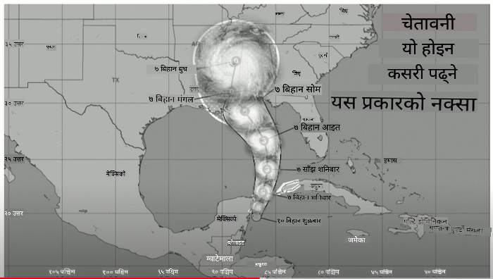
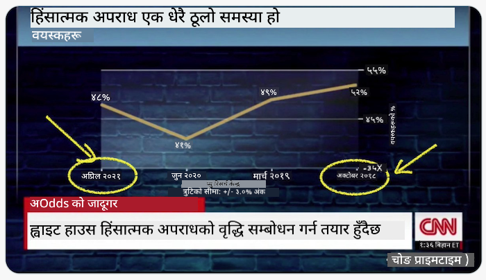
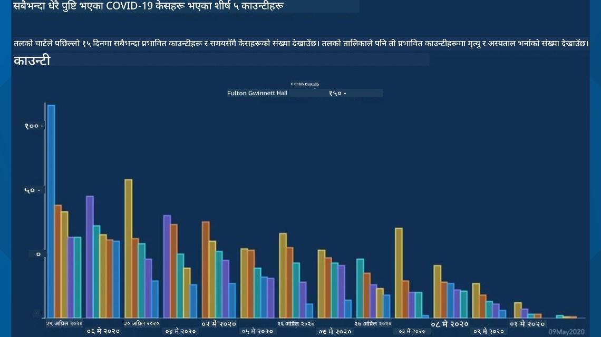
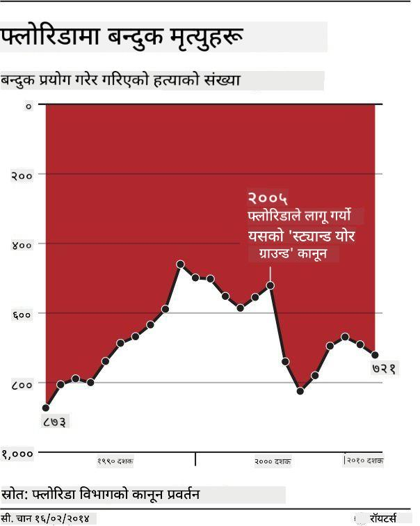
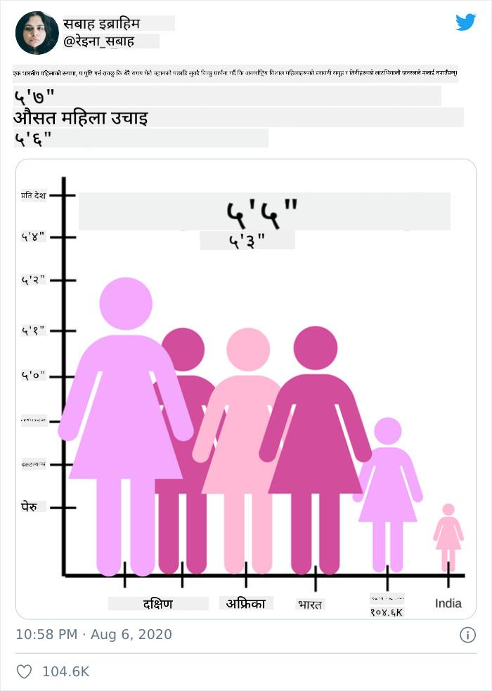
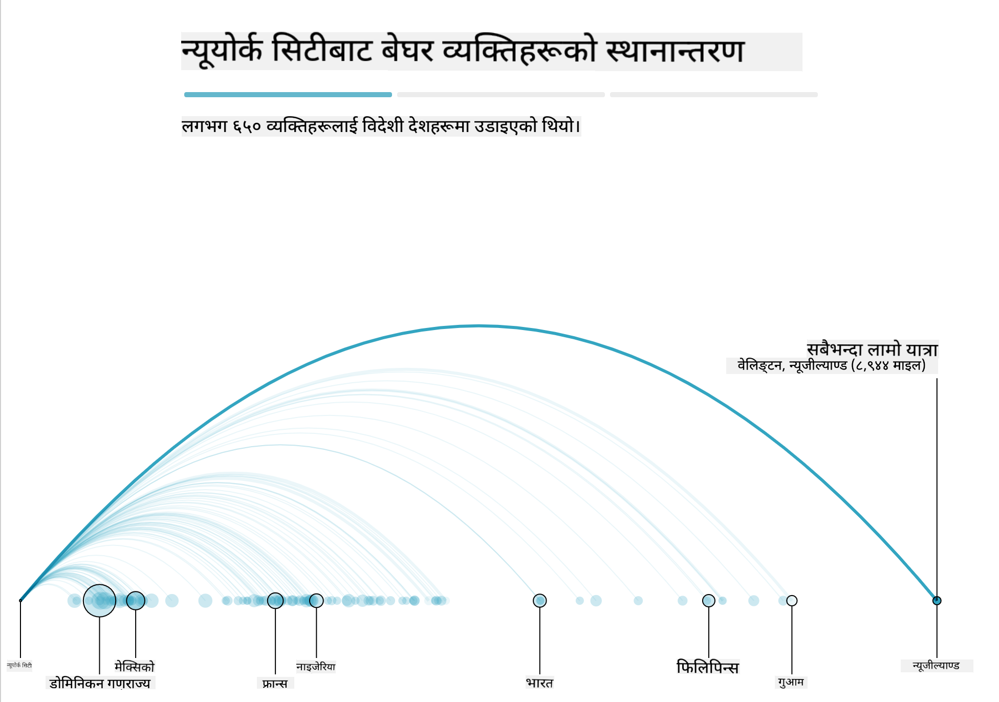
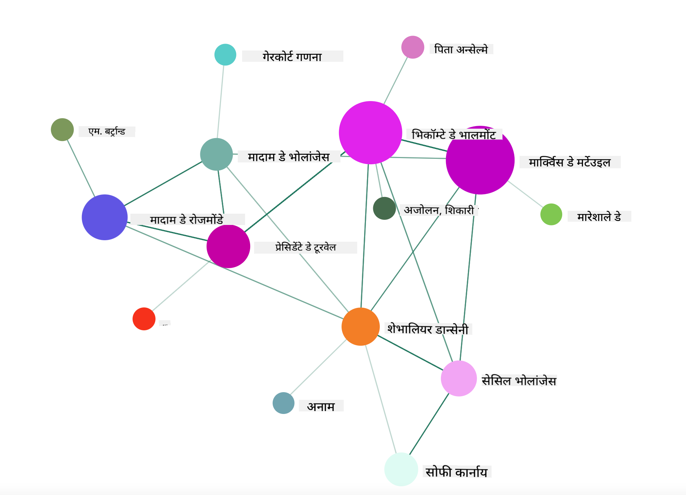

<!--
CO_OP_TRANSLATOR_METADATA:
{
  "original_hash": "b4039f1c76548d144a0aee0bf28304ec",
  "translation_date": "2025-08-27T18:34:59+00:00",
  "source_file": "3-Data-Visualization/R/13-meaningful-vizualizations/README.md",
  "language_code": "ne"
}
-->
# अर्थपूर्ण दृश्यहरू बनाउने

| ](../../../sketchnotes/13-MeaningfulViz.png)|
|:---:|
| अर्थपूर्ण दृश्यहरू - _Sketchnote by [@nitya](https://twitter.com/nitya)_ |

> "यदि तपाईंले डाटालाई पर्याप्त यातना दिनुभयो भने, यसले कुनै पनि कुरा स्वीकार गर्नेछ" -- [Ronald Coase](https://en.wikiquote.org/wiki/Ronald_Coase)

डाटा वैज्ञानिकको आधारभूत सीपहरूमध्ये एक भनेको अर्थपूर्ण डाटा दृश्य बनाउने क्षमता हो जसले तपाईंलाई भएका प्रश्नहरूको उत्तर दिन मद्दत गर्दछ। तपाईंको डाटालाई दृश्यमा प्रस्तुत गर्नु अघि, तपाईंले यसलाई सफा र तयार पार्नुपर्छ, जस्तै तपाईंले अघिल्लो पाठहरूमा गरेको थियो। त्यसपछि, तपाईंले डाटालाई प्रस्तुत गर्ने उत्तम तरिका निर्णय गर्न सुरु गर्न सक्नुहुन्छ।

यस पाठमा, तपाईंले समीक्षा गर्नुहुनेछ:

1. सही चार्ट प्रकार कसरी चयन गर्ने
2. भ्रामक चार्टिङबाट कसरी बच्ने
3. रंगसँग कसरी काम गर्ने
4. पढ्न सजिलो बनाउन चार्टलाई कसरी शैली दिने
5. एनिमेटेड वा 3D चार्टिङ समाधान कसरी बनाउने
6. रचनात्मक दृश्य कसरी बनाउने

## [पाठ अघि क्विज](https://purple-hill-04aebfb03.1.azurestaticapps.net/quiz/24)

## सही चार्ट प्रकार चयन गर्नुहोस्

अघिल्लो पाठहरूमा, तपाईंले Matplotlib र Seaborn प्रयोग गरेर विभिन्न प्रकारका रोचक डाटा दृश्यहरू बनाउने अभ्यास गर्नुभएको थियो। सामान्यतया, तपाईंले सोधिएको प्रश्नको लागि [सही प्रकारको चार्ट](https://chartio.com/learn/charts/how-to-select-a-data-vizualization/) चयन गर्न निम्न तालिका प्रयोग गर्न सक्नुहुन्छ:

| तपाईंलाई चाहिन्छ:          | तपाईंले प्रयोग गर्नुपर्छ:         |
| -------------------------- | ------------------------------- |
| समयको साथ डाटा प्रवृत्ति देखाउनुहोस् | रेखा                          |
| श्रेणीहरूको तुलना गर्नुहोस् | बार, पाई                       |
| कुलहरूको तुलना गर्नुहोस्    | पाई, स्ट्याक्ड बार              |
| सम्बन्ध देखाउनुहोस्         | स्क्याटर, रेखा, फेसट, डुअल रेखा |
| वितरण देखाउनुहोस्           | स्क्याटर, हिस्टोग्राम, बक्स     |
| अनुपात देखाउनुहोस्          | पाई, डोनट, वाफल                |

> ✅ तपाईंको डाटाको संरचना अनुसार, तपाईंले चार्टलाई समर्थन गर्न पाठलाई संख्यात्मकमा रूपान्तरण गर्न आवश्यक हुन सक्छ।

## भ्रामकता रोक्नुहोस्

डाटा वैज्ञानिकले सही डाटाको लागि सही चार्ट चयन गर्न सावधान भए पनि, डाटालाई कुनै बिन्दु प्रमाणित गर्न, प्रायः डाटाको विश्वसनीयता कमजोर पार्ने तरिकामा प्रस्तुत गर्न सकिन्छ। भ्रामक चार्ट र इन्फोग्राफिक्सका धेरै उदाहरणहरू छन्!

[](https://www.youtube.com/watch?v=oX74Nge8Wkw "How charts lie")

> 🎥 माथिको चित्रमा क्लिक गरेर भ्रामक चार्टहरूको बारेमा सम्मेलनको कुरा हेर्नुहोस्

यो चार्टले X अक्षलाई उल्टाएर सत्यको विपरीत देखाउँछ, मिति अनुसार:



[यो चार्ट](https://media.firstcoastnews.com/assets/WTLV/images/170ae16f-4643-438f-b689-50d66ca6a8d8/170ae16f-4643-438f-b689-50d66ca6a8d8_1140x641.jpg) अझ भ्रामक छ, किनकि आँखा दायाँतिर तानिन्छ र निष्कर्ष निकाल्छ कि समयको साथ, विभिन्न काउन्टीहरूमा COVID केसहरू घटेका छन्। वास्तवमा, यदि तपाईं मितिहरूलाई ध्यानपूर्वक हेर्नुहुन्छ भने, तपाईंले पत्ता लगाउनुहुनेछ कि ती मितिहरूलाई भ्रामक घट्दो प्रवृत्ति देखाउन पुनः व्यवस्था गरिएको छ।



यो कुख्यात उदाहरणले रंग र उल्टिएको Y अक्ष प्रयोग गरेर भ्रम सिर्जना गर्दछ: बन्दुक-मैत्री कानून पारित भएपछि बन्दुक मृत्युहरू बढेको निष्कर्ष निकाल्नुको सट्टा, वास्तवमा आँखा उल्टो सोच्न बाध्य पारिन्छ:



यो अनौठो चार्टले अनुपातलाई हाँसउठ्दो तरिकामा हेरफेर गर्न देखाउँछ:



अतुलनीयको तुलना गर्नु अर्को छायादार चाल हो। 'स्प्युरियस कोरिलेसन' नामक [एक अद्भुत वेबसाइट](https://tylervigen.com/spurious-correlations) छ जसले 'तथ्यहरू' प्रदर्शन गर्दछ, जस्तै माइनको डिभोर्स दर र मार्जरीनको खपत। एक Reddit समूहले डाटाको [खराब प्रयोगहरू](https://www.reddit.com/r/dataisugly/top/?t=all) पनि सङ्कलन गर्दछ।

भ्रामक चार्टहरूले आँखा कत्तिको सजिलै भ्रमित गर्न सकिन्छ भन्ने कुरा बुझ्न महत्त्वपूर्ण छ। डाटा वैज्ञानिकको उद्देश्य राम्रो भए पनि, खराब प्रकारको चार्ट चयन गर्नु, जस्तै धेरै श्रेणीहरू देखाउने पाई चार्ट, भ्रामक हुन सक्छ।

## रंग

तपाईंले माथिको 'फ्लोरिडा बन्दुक हिंसा' चार्टमा देख्नुभयो कि रंगले चार्टहरूमा थप अर्थ प्रदान गर्न सक्छ, विशेष गरी ggplot2 र RColorBrewer जस्ता पुस्तकालयहरू प्रयोग नगरी डिजाइन गरिएका चार्टहरूमा। यदि तपाईंले चार्ट हातले बनाउँदै हुनुहुन्छ भने, [रंग सिद्धान्त](https://colormatters.com/color-and-design/basic-color-theory) को अध्ययन गर्नुहोस्।

> ✅ चार्ट डिजाइन गर्दा, पहुँचयोग्यता दृश्यको महत्त्वपूर्ण पक्ष हो भन्ने कुरा सचेत हुनुहोस्। तपाईंका केही प्रयोगकर्ताहरू रंग अन्धा हुन सक्छन् - के तपाईंको चार्ट दृश्य अशक्तता भएका प्रयोगकर्ताहरूका लागि राम्रोसँग प्रदर्शन हुन्छ?

चार्टका लागि रंग चयन गर्दा सावधान रहनुहोस्, किनकि रंगले तपाईंले चाहेको अर्थभन्दा फरक अर्थ दिन सक्छ। माथिको 'उचाइ' चार्टमा 'पिंक लेडिज' ले स्पष्ट रूपमा 'महिला' अर्थ प्रदान गर्दछ, जसले चार्टलाई अझ अनौठो बनाउँछ।

जबकि [रंगको अर्थ](https://colormatters.com/color-symbolism/the-meanings-of-colors) संसारका विभिन्न भागहरूमा फरक हुन सक्छ, र तिनीहरूको छायाअनुसार परिवर्तन हुन सक्छ। सामान्यतया, रंगका अर्थहरू निम्न छन्:

| रंग    | अर्थ                 |
| ------ | ------------------- |
| रातो   | शक्ति               |
| निलो   | विश्वास, निष्ठा      |
| पहेंलो | खुशी, सतर्कता       |
| हरियो  | पारिस्थितिकी, भाग्य, ईर्ष्या |
| बैजनी  | खुशी                |
| सुन्तला| जीवन्तता            |

यदि तपाईंलाई अनुकूलित रंगहरू सहित चार्ट बनाउने जिम्मेवारी दिइएको छ भने, सुनिश्चित गर्नुहोस् कि तपाईंका चार्टहरू पहुँचयोग्य छन् र तपाईंले चयन गरेको रंगले तपाईंले व्यक्त गर्न खोजेको अर्थसँग मेल खान्छ।

## पढ्न सजिलो बनाउन चार्टलाई शैली दिने

चार्टहरू अर्थपूर्ण हुँदैनन् यदि तिनीहरू पढ्न सजिलो छैनन्! तपाईंको डाटासँग राम्रोसँग स्केल गर्न चार्टको चौडाइ र उचाइ शैली दिन विचार गर्नुहोस्। यदि एक चर (जस्तै सबै 50 राज्यहरू) प्रदर्शन गर्न आवश्यक छ भने, तिनीहरूलाई Y अक्षमा ठाडो रूपमा देखाउनुहोस् ताकि क्षैतिज स्क्रोलिङ चार्टबाट बच्न सकियोस्।

तपाईंका अक्षहरू लेबल गर्नुहोस्, आवश्यक परेमा एउटा लेजेन्ड प्रदान गर्नुहोस्, र डाटाको राम्रो बुझाइका लागि टूलटिप्स प्रस्ताव गर्नुहोस्।

यदि तपाईंको डाटा X अक्षमा पाठ्य र विस्तृत छ भने, राम्रो पढ्नका लागि पाठलाई कोण दिन सक्नुहुन्छ। [plot3D](https://cran.r-project.org/web/packages/plot3D/index.html) ले 3D प्लटिङ प्रदान गर्दछ, यदि तपाईंको डाटाले समर्थन गर्दछ भने। यसले परिष्कृत डाटा दृश्यहरू उत्पादन गर्न सक्छ।


## एनिमेसन र 3D चार्ट प्रदर्शन

आजका केही उत्कृष्ट डाटा दृश्यहरू एनिमेटेड छन्। Shirley Wu ले D3 प्रयोग गरेर अद्भुत दृश्यहरू बनाएकी छिन्, जस्तै '[फिल्म फ्लावरहरू](http://bl.ocks.org/sxywu/raw/d612c6c653fb8b4d7ff3d422be164a5d/)', जहाँ प्रत्येक फूल एउटा चलचित्रको दृश्य हो। Guardian का लागि अर्को उदाहरण 'बुस्ड आउट' हो, जसले NYC ले आफ्नो बेघर समस्या समाधान गर्न मानिसहरूलाई शहरबाट बाहिर बसमा पठाउने तरिका देखाउन दृश्यहरूलाई Greensock र D3 सँग मिलाएर स्क्रोलिटेलिङ लेखको ढाँचामा प्रस्तुत गर्दछ।



> "बुस्ड आउट: कसरी अमेरिका आफ्नो बेघर मानिसहरूलाई सार्छ" [Guardian](https://www.theguardian.com/us-news/ng-interactive/2017/dec/20/bussed-out-america-moves-homeless-people-country-study) बाट। दृश्यहरू Nadieh Bremer & Shirley Wu द्वारा।

जबकि यो पाठले यी शक्तिशाली दृश्य पुस्तकालयहरू सिकाउन गहिराइमा जान पर्याप्त छैन, Vue.js एपमा D3 प्रयोग गरेर 'Dangerous Liaisons' पुस्तकको एनिमेटेड सामाजिक नेटवर्कको दृश्य प्रदर्शन गर्न प्रयास गर्नुहोस्।

> "Les Liaisons Dangereuses" एउटा पत्रात्मक उपन्यास हो, वा पत्रहरूको श्रृङ्खलाको रूपमा प्रस्तुत गरिएको उपन्यास। यो 1782 मा Choderlos de Laclos द्वारा लेखिएको हो, जसले फ्रान्सको 18 औं शताब्दीको अभिजात वर्गका दुई प्रतिस्पर्धी पात्रहरू, Vicomte de Valmont र Marquise de Merteuil, को क्रूर, नैतिक रूपमा दिवालिया सामाजिक चालहरूको कथा बताउँछ। दुवै अन्त्यमा आफ्नो पतनमा पुग्छन् तर धेरै सामाजिक क्षति पुर्‍याएपछि। उपन्यास विभिन्न व्यक्तिहरूलाई लेखिएका पत्रहरूको श्रृङ्खलाको रूपमा खुल्छ, बदला लिन वा केवल समस्या सिर्जना गर्न योजना बनाउँदै। यी पत्रहरूको दृश्य बनाउनुहोस् ताकि कथाको प्रमुख पात्रहरूलाई दृश्य रूपमा पत्ता लगाउन सकियोस्।

तपाईंले एक वेब एप पूरा गर्नुहुनेछ जसले यस सामाजिक नेटवर्कको एनिमेटेड दृश्य प्रदर्शन गर्नेछ। यसले Vue.js र D3 प्रयोग गरेर [नेटवर्कको दृश्य](https://github.com/emiliorizzo/vue-d3-network) बनाउनको लागि बनाइएको पुस्तकालय प्रयोग गर्दछ। जब एप चलिरहेको छ, तपाईं स्क्रिनमा नोडहरू तान्न सक्नुहुन्छ ताकि डाटालाई वरिपरि मिलाउन सकियोस्।



## परियोजना: D3.js प्रयोग गरेर नेटवर्क देखाउने चार्ट बनाउनुहोस्

> यो पाठको फोल्डरमा `solution` फोल्डर समावेश छ जहाँ तपाईं पूरा परियोजना सन्दर्भको लागि पाउन सक्नुहुन्छ।

1. `starter` फोल्डरको मूलमा रहेको README.md फाइलमा निर्देशनहरू पालना गर्नुहोस्। सुनिश्चित गर्नुहोस् कि तपाईंको मेसिनमा NPM र Node.js चलिरहेको छ परियोजनाको निर्भरता स्थापना गर्नु अघि।

2. `starter/src` फोल्डर खोल्नुहोस्। तपाईंले एउटा `assets` फोल्डर पाउनुहुनेछ जहाँ उपन्यासका सबै पत्रहरू, क्रमांकित, 'to' र 'from' एनोटेसन सहितको .json फाइल पाउन सक्नुहुन्छ।

3. `components/Nodes.vue` मा कोड पूरा गर्नुहोस् ताकि दृश्य सक्षम गर्न सकियोस्। `createLinks()` नामक विधि खोज्नुहोस् र निम्न नेस्टेड लूप थप्नुहोस्।

.json वस्तुमा लूप गर्नुहोस् ताकि पत्रहरूको 'to' र 'from' डाटा समात्न सकियोस् र `links` वस्तु निर्माण गर्न सकियोस् ताकि दृश्य पुस्तकालयले यसलाई उपभोग गर्न सकियोस्:

```javascript
//loop through letters
      let f = 0;
      let t = 0;
      for (var i = 0; i < letters.length; i++) {
          for (var j = 0; j < characters.length; j++) {
              
            if (characters[j] == letters[i].from) {
              f = j;
            }
            if (characters[j] == letters[i].to) {
              t = j;
            }
        }
        this.links.push({ sid: f, tid: t });
      }
  ```

टर्मिनलबाट आफ्नो एप चलाउनुहोस् (npm run serve) र दृश्यको मजा लिनुहोस्!

## 🚀 चुनौती

इन्टरनेटको भ्रमण गरेर भ्रामक दृश्यहरू पत्ता लगाउनुहोस्। लेखकले प्रयोगकर्तालाई कसरी भ्रमित गर्छ, र के यो जानाजानी हो? दृश्यहरू सुधार गरेर तिनीहरू कस्तो देखिनुपर्छ भनेर देखाउने प्रयास गर्नुहोस्।

## [पाठ पछि क्विज](https://purple-hill-04aebfb03.1.azurestaticapps.net/quiz/25)

## समीक्षा र आत्म अध्ययन

भ्रामक डाटा दृश्यको बारेमा पढ्नका लागि यहाँ केही लेखहरू छन्:

https://gizmodo.com/how-to-lie-with-data-visualization-1563576606

http://ixd.prattsi.org/2017/12/visual-lies-usability-in-deceptive-data-visualizations/

ऐतिहासिक सम्पत्ति र कलाकृतिहरूका लागि यी रोचक दृश्यहरू हेर्नुहोस्:

https://handbook.pubpub.org/

एनिमेसनले तपाईंका दृश्यहरूलाई कसरी सुधार गर्न सक्छ भन्ने बारेमा यो लेख हेर्नुहोस्:

https://medium.com/@EvanSinar/use-animation-to-supercharge-data-visualization-cd905a882ad4

## असाइनमेन्ट

[आफ्नै अनुकूलित दृश्य बनाउनुहोस्](assignment.md)

---

**अस्वीकरण**:  
यो दस्तावेज़ AI अनुवाद सेवा [Co-op Translator](https://github.com/Azure/co-op-translator) प्रयोग गरेर अनुवाद गरिएको हो। हामी शुद्धताको लागि प्रयास गर्छौं, तर कृपया ध्यान दिनुहोस् कि स्वचालित अनुवादमा त्रुटिहरू वा अशुद्धताहरू हुन सक्छ। यसको मूल भाषा मा रहेको मूल दस्तावेज़लाई आधिकारिक स्रोत मानिनुपर्छ। महत्वपूर्ण जानकारीको लागि, व्यावसायिक मानव अनुवाद सिफारिस गरिन्छ। यस अनुवादको प्रयोगबाट उत्पन्न हुने कुनै पनि गलतफहमी वा गलत व्याख्याको लागि हामी जिम्मेवार हुने छैनौं।