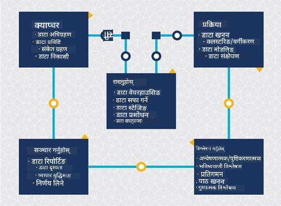
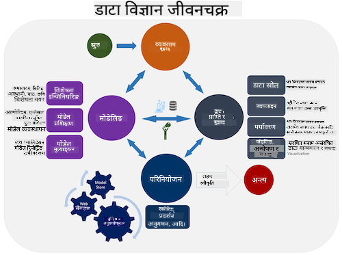
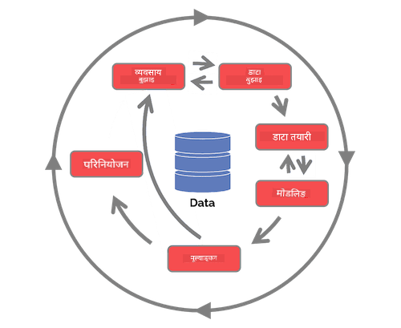

<!--
CO_OP_TRANSLATOR_METADATA:
{
  "original_hash": "c368f8f2506fe56bca0f7be05c4eb71d",
  "translation_date": "2025-08-27T17:57:21+00:00",
  "source_file": "4-Data-Science-Lifecycle/14-Introduction/README.md",
  "language_code": "ne"
}
-->
# डाटा साइन्स जीवनचक्रको परिचय

| ](../../sketchnotes/14-DataScience-Lifecycle.png)|
|:---:|
| डाटा साइन्स जीवनचक्रको परिचय - _Sketchnote by [@nitya](https://twitter.com/nitya)_ |

## [पूर्व-व्याख्यान क्विज](https://red-water-0103e7a0f.azurestaticapps.net/quiz/26)

यस बिन्दुमा तपाईंले सम्भवतः महसुस गर्नुभएको छ कि डाटा साइन्स एउटा प्रक्रिया हो। यो प्रक्रिया ५ चरणहरूमा विभाजित गर्न सकिन्छ:

- डाटा सङ्कलन
- प्रशोधन
- विश्लेषण
- सञ्चार
- मर्मत

यो पाठ जीवनचक्रका ३ भागहरूमा केन्द्रित छ: डाटा सङ्कलन, प्रशोधन, र मर्मत।

> फोटो [Berkeley School of Information](https://ischoolonline.berkeley.edu/data-science/what-is-data-science/) द्वारा

## डाटा सङ्कलन

जीवनचक्रको पहिलो चरण अत्यन्त महत्त्वपूर्ण छ किनभने यसमा आधारित भएर अन्य चरणहरू अघि बढ्छन्। यो चरण दुई भागहरूको संयोजन हो: डाटा प्राप्त गर्नु र समाधान गर्नुपर्ने उद्देश्य र समस्याहरू परिभाषित गर्नु।  
परियोजनाको लक्ष्य परिभाषित गर्न समस्या वा प्रश्नको गहिरो सन्दर्भ आवश्यक पर्छ। पहिलो चरणमा, हामीले समस्या समाधान गर्न चाहने व्यक्तिहरूलाई पहिचान र प्राप्त गर्नुपर्छ। यी व्यक्तिहरू व्यवसायका सरोकारवालाहरू वा परियोजनाका प्रायोजकहरू हुन सक्छन्, जसले परियोजनाबाट कसले वा केले फाइदा पाउँछ भन्ने कुरा पहिचान गर्न मद्दत गर्छन्। साथै, उनीहरूले किन यो आवश्यक छ भन्ने कुरा पनि स्पष्ट पार्छन्। राम्रोसँग परिभाषित लक्ष्य मापनयोग्य र परिमाणात्मक हुनुपर्छ ताकि स्वीकार्य परिणाम परिभाषित गर्न सकियोस्।

डाटा वैज्ञानिकले सोध्न सक्ने प्रश्नहरू:
- के यो समस्या पहिले समाधान गरिएको थियो? के पत्ता लगाइयो?
- के सबै सहभागीहरूले उद्देश्य र लक्ष्य बुझेका छन्?
- के अस्पष्टता छ, र यसलाई कसरी घटाउन सकिन्छ?
- के सीमाहरू छन्?
- अन्तिम परिणाम कस्तो देखिन सक्छ?
- कति स्रोतहरू (समय, जनशक्ति, कम्प्युटेसनल) उपलब्ध छन्?

अर्को चरण भनेको डाटा पहिचान, सङ्कलन, र त्यसपछि परिभाषित लक्ष्यहरू प्राप्त गर्न आवश्यक डाटाको अन्वेषण गर्नु हो। यस चरणमा, डाटा वैज्ञानिकहरूले डाटाको मात्रा र गुणस्तर मूल्याङ्कन गर्नुपर्छ। यसका लागि डाटाको अन्वेषण आवश्यक पर्छ ताकि प्राप्त गरिएको डाटाले इच्छित परिणाम प्राप्त गर्न सहयोग पुर्‍याउँछ कि भनेर पुष्टि गर्न सकियोस्।

डाटाबारे डाटा वैज्ञानिकले सोध्न सक्ने प्रश्नहरू:
- मेरो लागि पहिले नै उपलब्ध डाटा के हो?
- यो डाटाको मालिक को हो?
- गोपनीयतासम्बन्धी के चासोहरू छन्?
- के यो समस्या समाधान गर्न पर्याप्त छ?
- के यो डाटा यस समस्याका लागि स्वीकार्य गुणस्तरको छ?
- यदि मैले यस डाटाबाट थप जानकारी पत्ता लगाएँ भने, के हामीले लक्ष्य परिवर्तन वा पुनःपरिभाषित गर्न विचार गर्नुपर्छ?

## प्रशोधन

जीवनचक्रको प्रशोधन चरण डाटामा ढाँचाहरू पत्ता लगाउन र मोडलिङमा केन्द्रित छ। प्रशोधन चरणमा प्रयोग गरिने केही प्रविधिहरूले ढाँचाहरू पत्ता लगाउन सांख्यिकीय विधिहरूको आवश्यकता पर्छ। सामान्यतया, यो ठूलो डाटासेटको लागि मानिसले गर्नुपर्ने थकाउने काम हो, त्यसैले कम्प्युटरहरूले प्रक्रिया छिटो बनाउन भारी काम गर्छन्। यो चरणमा डाटा साइन्स र मेसिन लर्निङ एकअर्कासँग जोडिन्छन्। पहिलो पाठमा सिकेअनुसार, मेसिन लर्निङ भनेको डाटालाई बुझ्न मोडलहरू निर्माण गर्ने प्रक्रिया हो। मोडलहरू डाटामा रहेका भेरिएबलहरूबीचको सम्बन्धको प्रतिनिधित्व हुन्, जसले परिणामको भविष्यवाणी गर्न मद्दत गर्छ।

यस चरणमा प्रयोग गरिने सामान्य प्रविधिहरू ML for Beginners पाठ्यक्रममा समेटिएका छन्। थप जान्नका लागि लिंकहरू अनुसरण गर्नुहोस्:

- [Classification](https://github.com/microsoft/ML-For-Beginners/tree/main/4-Classification): डाटालाई श्रेणीहरूमा वर्गीकृत गरेर अधिक कुशलताका साथ प्रयोग गर्नु।
- [Clustering](https://github.com/microsoft/ML-For-Beginners/tree/main/5-Clustering): डाटालाई समान समूहहरूमा विभाजन गर्नु।
- [Regression](https://github.com/microsoft/ML-For-Beginners/tree/main/2-Regression): भेरिएबलहरूबीचको सम्बन्ध निर्धारण गरेर मानहरू भविष्यवाणी वा पूर्वानुमान गर्नु।

## मर्मत

जीवनचक्रको चित्रमा तपाईंले देख्नुभएको हुन सक्छ कि मर्मत डाटा सङ्कलन र प्रशोधनको बीचमा छ। मर्मत भनेको परियोजनाको प्रक्रियाभरि डाटाको व्यवस्थापन, भण्डारण, र सुरक्षाको निरन्तर प्रक्रिया हो, र यो परियोजनाको सम्पूर्ण अवधिमा विचार गर्नुपर्छ।

### डाटा भण्डारण
डाटा कसरी र कहाँ भण्डारण गर्ने भन्ने विचारले यसको लागत र डाटाको पहुँचको गति दुवैलाई प्रभाव पार्न सक्छ। यस्ता निर्णयहरू प्रायः डाटा वैज्ञानिकले मात्र गर्दैनन्, तर डाटा कसरी भण्डारण गरिएको छ भन्ने आधारमा काम गर्ने तरिकामा उनीहरूले छनोट गर्नुपर्ने हुन सक्छ।

आधुनिक डाटा भण्डारण प्रणालीका केही पक्षहरू:
**On premise vs off premise vs public or private cloud**

On premise भनेको आफ्नै उपकरणमा डाटा होस्ट र व्यवस्थापन गर्नु हो, जस्तै डाटालाई भण्डारण गर्नका लागि सर्भरको स्वामित्व। Off premise भनेको तपाईंको स्वामित्वमा नभएको उपकरण, जस्तै डाटा सेन्टरमा निर्भर हुनु हो। Public cloud भनेको डाटा भण्डारण गर्नका लागि लोकप्रिय विकल्प हो, जसले डाटा कहाँ र कसरी भण्डारण गरिएको छ भन्ने ज्ञान आवश्यक पर्दैन। Public भनेको सबै प्रयोगकर्ताहरूले साझा गर्ने एकीकृत आधारभूत संरचना हो। केही संस्थाहरूको कडा सुरक्षा नीति हुन्छ, जसले उनीहरूलाई डाटा होस्ट गरिएको उपकरणमा पूर्ण पहुँच आवश्यक पर्छ, र तिनीहरूले आफ्नै क्लाउड सेवाहरू प्रदान गर्ने private cloud मा निर्भर गर्छन्। तपाईंले [पछिल्ला पाठहरूमा](https://github.com/microsoft/Data-Science-For-Beginners/tree/main/5-Data-Science-In-Cloud) क्लाउडमा डाटाबारे थप जान्नुहुनेछ।

**Cold vs hot data**

जब तपाईं आफ्नो मोडलहरू प्रशिक्षण गर्दै हुनुहुन्छ, तपाईंलाई थप प्रशिक्षण डाटाको आवश्यकता पर्न सक्छ। यदि तपाईं आफ्नो मोडलसँग सन्तुष्ट हुनुहुन्छ भने, मोडलले आफ्नो उद्देश्य पूरा गर्न थप डाटा प्राप्त गर्नेछ। कुनै पनि अवस्थामा, डाटा सङ्कलनसँगै यसको भण्डारण र पहुँचको लागत बढ्नेछ। कम प्रयोग हुने डाटालाई, जसलाई cold data भनिन्छ, बारम्बार प्रयोग हुने hot data बाट अलग गर्नु सस्तो विकल्प हुन सक्छ। यदि cold data लाई पहुँच गर्न आवश्यक पर्‍यो भने, hot data को तुलनामा यसलाई पुनःप्राप्त गर्न अलि बढी समय लाग्न सक्छ।

### डाटा व्यवस्थापन
डाटासँग काम गर्दा तपाईंले पत्ता लगाउन सक्नुहुन्छ कि केही डाटालाई सफा गर्न आवश्यक छ। [डाटा तयारी](https://github.com/microsoft/Data-Science-For-Beginners/tree/main/2-Working-With-Data/08-data-preparation) सम्बन्धी पाठमा समेटिएका प्रविधिहरू प्रयोग गरेर सही मोडलहरू निर्माण गर्न यो महत्त्वपूर्ण छ। नयाँ डाटा आएपछि, गुणस्तरमा निरन्तरता कायम गर्न यसमा पनि उस्तै प्रविधिहरू लागू गर्न आवश्यक पर्छ। केही परियोजनाहरूमा डाटालाई अन्तिम स्थानमा सार्नु अघि सफा गर्ने, समग्र बनाउने, र कम्प्रेस गर्ने स्वचालित उपकरणको प्रयोग समावेश हुन्छ। Azure Data Factory यस्ता उपकरणहरूको उदाहरण हो।

### डाटाको सुरक्षा
डाटाको सुरक्षाको मुख्य उद्देश्य भनेको डाटासँग काम गर्ने व्यक्तिहरूले के सङ्कलन गरिन्छ र कुन सन्दर्भमा प्रयोग गरिन्छ भन्ने कुरामा नियन्त्रण राख्नु हो। डाटालाई सुरक्षित राख्नका लागि केवल आवश्यक व्यक्तिहरूलाई मात्र पहुँच दिनु, स्थानीय कानुन र नियमहरूको पालना गर्नु, साथै नैतिक मापदण्डहरू कायम राख्नु पर्दछ। [नैतिकता सम्बन्धी पाठ](https://github.com/microsoft/Data-Science-For-Beginners/tree/main/1-Introduction/02-ethics) मा यसबारे चर्चा गरिएको छ।

सुरक्षालाई ध्यानमा राखेर टोलीले गर्न सक्ने केही कामहरू:
- सबै डाटा इन्क्रिप्ट गरिएको छ भनेर सुनिश्चित गर्नु
- ग्राहकहरूलाई उनीहरूको डाटा कसरी प्रयोग भइरहेको छ भन्ने जानकारी दिनु
- परियोजनाबाट बाहिरिएका व्यक्तिहरूको डाटामा पहुँच हटाउनु
- केवल निश्चित परियोजना सदस्यहरूलाई मात्र डाटामा परिवर्तन गर्न दिनु

## 🚀 चुनौती

डाटा साइन्स जीवनचक्रका धेरै संस्करणहरू छन्, जहाँ प्रत्येक चरणको नाम र चरणहरूको संख्या फरक हुन सक्छ, तर यस पाठमा उल्लेख गरिएका प्रक्रियाहरू समावेश हुन्छन्।

[Team Data Science Process जीवनचक्र](https://docs.microsoft.com/en-us/azure/architecture/data-science-process/lifecycle) र [Cross-industry standard process for data mining](https://www.datascience-pm.com/crisp-dm-2/) अन्वेषण गर्नुहोस्। यी दुईबीच ३ समानता र भिन्नता नाम दिनुहोस्।

|Team Data Science Process (TDSP)|Cross-industry standard process for data mining (CRISP-DM)|
|--|--|
| |  |
| छवि [Microsoft](https://docs.microsoft.comazure/architecture/data-science-process/lifecycle) द्वारा | छवि [Data Science Process Alliance](https://www.datascience-pm.com/crisp-dm-2/) द्वारा |

## [पश्च-व्याख्यान क्विज](https://red-water-0103e7a0f.azurestaticapps.net/quiz/27)

## समीक्षा र आत्म-अध्ययन

डाटा साइन्स जीवनचक्र लागू गर्न धेरै भूमिकाहरू र कार्यहरू समावेश हुन्छन्, जहाँ केहीले प्रत्येक चरणका विशेष भागहरूमा ध्यान केन्द्रित गर्न सक्छन्। Team Data Science Process ले परियोजनामा कसैले गर्न सक्ने भूमिकाहरू र कार्यहरूको व्याख्या गर्ने केही स्रोतहरू प्रदान गर्दछ।

* [Team Data Science Process भूमिकाहरू र कार्यहरू](https://docs.microsoft.com/en-us/azure/architecture/data-science-process/roles-tasks)
* [डाटा साइन्स कार्यहरू कार्यान्वयन गर्नु: अन्वेषण, मोडलिङ, र परिनियोजन](https://docs.microsoft.com/en-us/azure/architecture/data-science-process/execute-data-science-tasks)

## असाइनमेन्ट

[डाटासेटको मूल्याङ्कन](assignment.md)

---

**अस्वीकरण**:  
यो दस्तावेज़ AI अनुवाद सेवा [Co-op Translator](https://github.com/Azure/co-op-translator) प्रयोग गरेर अनुवाद गरिएको छ। हामी शुद्धताको लागि प्रयास गर्छौं, तर कृपया ध्यान दिनुहोस् कि स्वचालित अनुवादमा त्रुटिहरू वा अशुद्धताहरू हुन सक्छ। यसको मूल भाषा मा रहेको मूल दस्तावेज़लाई आधिकारिक स्रोत मानिनुपर्छ। महत्वपूर्ण जानकारीको लागि, व्यावसायिक मानव अनुवाद सिफारिस गरिन्छ। यस अनुवादको प्रयोगबाट उत्पन्न हुने कुनै पनि गलतफहमी वा गलत व्याख्याको लागि हामी जिम्मेवार हुने छैनौं।