<!--
CO_OP_TRANSLATOR_METADATA:
{
  "original_hash": "39f3b3a9d873eaa522c2e792ce0ca503",
  "translation_date": "2025-09-04T16:54:30+00:00",
  "source_file": "5-Data-Science-In-Cloud/18-Low-Code/README.md",
  "language_code": "ne"
}
-->
# क्लाउडमा डेटा विज्ञान: "कम कोड/नो कोड" तरिका

| द्वारा ](../../sketchnotes/18-DataScience-Cloud.png)|
|:---:|
| क्लाउडमा डेटा विज्ञान: कम कोड - _[@nitya](https://twitter.com/nitya) द्वारा स्केच नोट_ |

सामग्रीको सूची:

- [क्लाउडमा डेटा विज्ञान: "कम कोड/नो कोड" तरिका](../../../../5-Data-Science-In-Cloud/18-Low-Code)
  - [पाठ अघि क्विज](../../../../5-Data-Science-In-Cloud/18-Low-Code)
  - [1. परिचय](../../../../5-Data-Science-In-Cloud/18-Low-Code)
    - [1.1 Azure Machine Learning के हो?](../../../../5-Data-Science-In-Cloud/18-Low-Code)
    - [1.2 हृदय विफलता भविष्यवाणी परियोजना:](../../../../5-Data-Science-In-Cloud/18-Low-Code)
    - [1.3 हृदय विफलता डेटासेट:](../../../../5-Data-Science-In-Cloud/18-Low-Code)
  - [2. Azure ML Studio मा कम कोड/नो कोड मोडेल प्रशिक्षण](../../../../5-Data-Science-In-Cloud/18-Low-Code)
    - [2.1 Azure ML कार्यक्षेत्र सिर्जना गर्नुहोस्](../../../../5-Data-Science-In-Cloud/18-Low-Code)
    - [2.2 कम्प्युट स्रोतहरू](../../../../5-Data-Science-In-Cloud/18-Low-Code)
      - [2.2.1 कम्प्युट स्रोतहरूको लागि सही विकल्पहरू चयन गर्नु](../../../../5-Data-Science-In-Cloud/18-Low-Code)
      - [2.2.2 कम्प्युट क्लस्टर सिर्जना गर्नु](../../../../5-Data-Science-In-Cloud/18-Low-Code)
    - [2.3 डेटासेट लोड गर्नु](../../../../5-Data-Science-In-Cloud/18-Low-Code)
    - [2.4 AutoML संग कम कोड/नो कोड प्रशिक्षण](../../../../5-Data-Science-In-Cloud/18-Low-Code)
  - [3. कम कोड/नो कोड मोडेल परिनियोजन र अन्त बिन्दु उपभोग](../../../../5-Data-Science-In-Cloud/18-Low-Code)
    - [3.1 मोडेल परिनियोजन](../../../../5-Data-Science-In-Cloud/18-Low-Code)
    - [3.2 अन्त बिन्दु उपभोग](../../../../5-Data-Science-In-Cloud/18-Low-Code)
  - [🚀 चुनौती](../../../../5-Data-Science-In-Cloud/18-Low-Code)
  - [पाठ पछि क्विज](../../../../5-Data-Science-In-Cloud/18-Low-Code)
  - [समीक्षा र आत्म अध्ययन](../../../../5-Data-Science-In-Cloud/18-Low-Code)
  - [असाइनमेन्ट](../../../../5-Data-Science-In-Cloud/18-Low-Code)
  
## [पाठ अघि क्विज](https://ff-quizzes.netlify.app/en/ds/)

## 1. परिचय
### 1.1 Azure Machine Learning के हो?

Azure क्लाउड प्लेटफर्म २०० भन्दा बढी उत्पादनहरू र क्लाउड सेवाहरूको संग्रह हो, जसले तपाईंलाई नयाँ समाधानहरू जीवनमा ल्याउन मद्दत गर्दछ। डेटा वैज्ञानिकहरूले डेटा अन्वेषण र पूर्व-प्रक्रिया गर्न, र विभिन्न प्रकारका मोडेल-प्रशिक्षण एल्गोरिदमहरू प्रयास गर्न धेरै समय खर्च गर्छन्। यी कार्यहरू समय खपत गर्ने हुन्छन् र महँगो कम्प्युट हार्डवेयरको प्रभावकारी प्रयोगलाई कम गर्छन्।

[Azure ML](https://docs.microsoft.com/azure/machine-learning/overview-what-is-azure-machine-learning?WT.mc_id=academic-77958-bethanycheum&ocid=AID3041109) Azure मा मेसिन लर्निङ समाधानहरू निर्माण र सञ्चालन गर्नको लागि क्लाउड-आधारित प्लेटफर्म हो। यसले डेटा वैज्ञानिकहरूलाई डेटा तयार गर्न, मोडेल प्रशिक्षण गर्न, भविष्यवाणी सेवाहरू प्रकाशित गर्न, र तिनीहरूको प्रयोगको निगरानी गर्न मद्दत गर्ने सुविधाहरू र क्षमताहरूको विस्तृत दायरा समावेश गर्दछ। सबैभन्दा महत्त्वपूर्ण कुरा, यसले मोडेल प्रशिक्षणसँग सम्बन्धित समय खपत गर्ने कार्यहरू स्वचालित गरेर तिनीहरूको दक्षता बढाउँछ; र यसले ठूलो मात्रामा डेटा ह्यान्डल गर्न प्रभावकारी रूपमा स्केल हुने क्लाउड-आधारित कम्प्युट स्रोतहरू प्रयोग गर्न सक्षम बनाउँछ, केवल प्रयोग गर्दा मात्र लागत लाग्ने गरी।

Azure ML ले विकासकर्ताहरू र डेटा वैज्ञानिकहरूलाई उनीहरूको मेसिन लर्निङ वर्कफ्लोहरूको लागि आवश्यक सबै उपकरणहरू प्रदान गर्दछ। यी समावेश छन्:

- **Azure Machine Learning Studio**: मोडेल प्रशिक्षण, परिनियोजन, स्वचालन, ट्र्याकिङ र सम्पत्ति व्यवस्थापनको लागि कम कोड र नो कोड विकल्पहरूको वेब पोर्टल। स्टुडियो Azure Machine Learning SDK संग एक सहज अनुभवको लागि एकीकृत छ।
- **Jupyter Notebooks**: छिटो प्रोटोटाइप र ML मोडेलहरू परीक्षण गर्न।
- **Azure Machine Learning Designer**: प्रयोगहरू निर्माण गर्न र कम कोड वातावरणमा पाइपलाइनहरू परिनियोजन गर्न मोड्युलहरू ड्र्याग-एन-ड्रप गर्न अनुमति दिन्छ।
- **स्वचालित मेसिन लर्निङ UI (AutoML)**: मेसिन लर्निङ मोडेल विकासको पुनरावृत्त कार्यहरू स्वचालित गर्दछ, उच्च स्केल, दक्षता, र उत्पादकता संग ML मोडेलहरू निर्माण गर्न अनुमति दिन्छ, सबै मोडेल गुणस्तर कायम राख्दै।
- **डेटा लेबलिङ**: डेटा स्वचालित रूपमा लेबल गर्नको लागि सहायक ML उपकरण।
- **Visual Studio Code को लागि मेसिन लर्निङ विस्तार**: ML परियोजनाहरू निर्माण र व्यवस्थापन गर्नको लागि पूर्ण-सुविधा विकास वातावरण प्रदान गर्दछ।
- **मेसिन लर्निङ CLI**: कमाण्ड लाइनबाट Azure ML स्रोतहरू व्यवस्थापन गर्न कमाण्डहरू प्रदान गर्दछ।
- **खुला-स्रोत फ्रेमवर्कहरूसँग एकीकरण** जस्तै PyTorch, TensorFlow, Scikit-learn र धेरै अन्य प्रशिक्षण, परिनियोजन, र अन्त-देखि-अन्त मेसिन लर्निङ प्रक्रियाको व्यवस्थापनको लागि।
- **MLflow**: यो मेसिन लर्निङ प्रयोगहरूको जीवन चक्र व्यवस्थापन गर्नको लागि खुला-स्रोत पुस्तकालय हो। **MLFlow Tracking** MLflow को एक घटक हो जसले तपाईंको प्रशिक्षण रन मेट्रिक्स र मोडेल कलाकृतिहरू लग र ट्र्याक गर्दछ, तपाईंको प्रयोगको वातावरणको परवाह नगरी।

### 1.2 हृदय विफलता भविष्यवाणी परियोजना:

परियोजना बनाउनु र निर्माण गर्नु तपाईंको सीप र ज्ञानलाई परीक्षण गर्नको लागि सबैभन्दा राम्रो तरिका हो। यस पाठमा, हामी Azure ML Studio मा हृदय विफलता आक्रमणको भविष्यवाणीको लागि डेटा विज्ञान परियोजना निर्माण गर्ने दुई फरक तरिकाहरू अन्वेषण गर्नेछौं, कम कोड/नो कोड र Azure ML SDK मार्फत, निम्न स्कीमामा देखाइएको छ:

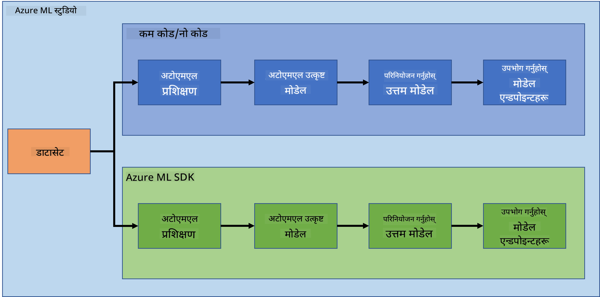

प्रत्येक तरिकाको आफ्नै फाइदा र बेफाइदा छन्। कम कोड/नो कोड तरिका सुरु गर्न सजिलो छ किनभने यसले GUI (ग्राफिकल युजर इन्टरफेस) संग अन्तरक्रिया समावेश गर्दछ, कोडको कुनै पूर्व ज्ञान आवश्यक छैन। यो विधिले परियोजनाको व्यवहार्यता छिटो परीक्षण गर्न र POC (प्रूफ अफ कन्सेप्ट) सिर्जना गर्न सक्षम बनाउँछ। तर, परियोजना बढ्दै जाँदा र उत्पादनको लागि तयार हुन आवश्यक पर्दा, GUI मार्फत स्रोतहरू सिर्जना गर्नु व्यवहारिक हुँदैन। हामीले स्रोतहरूको सिर्जना देखि मोडेलको परिनियोजनसम्म सबै कुरा प्रोग्रामेटिक रूपमा स्वचालित गर्न आवश्यक छ। यहीँ Azure ML SDK प्रयोग गर्न जान्न महत्त्वपूर्ण हुन्छ।

|                   | कम कोड/नो कोड | Azure ML SDK              |
|-------------------|------------------|---------------------------|
| कोडको विशेषज्ञता | आवश्यक छैन     | आवश्यक छ                  |
| विकासको समय     | छिटो र सजिलो    | कोड विशेषज्ञतामा निर्भर |
| उत्पादनको लागि तयार | छैन               | हो                       |

### 1.3 हृदय विफलता डेटासेट: 

कार्डियोभास्कुलर रोगहरू (CVDs) विश्वव्यापी रूपमा मृत्युको नम्बर १ कारण हुन्, विश्वव्यापी रूपमा सबै मृत्युहरूको ३१% को लागि जिम्मेवार। तम्बाकु प्रयोग, अस्वस्थ आहार र मोटोपन, शारीरिक निष्क्रियता र मदिराको हानिकारक प्रयोग जस्ता वातावरणीय र व्यवहारजन्य जोखिम कारकहरूलाई अनुमान मोडेलहरूको लागि सुविधाहरूको रूपमा प्रयोग गर्न सकिन्छ। CVD को विकासको सम्भावना अनुमान गर्न सक्षम हुनु उच्च जोखिम भएका व्यक्तिहरूमा आक्रमण रोक्नको लागि धेरै उपयोगी हुन सक्छ।

Kaggle ले [हृदय विफलता डेटासेट](https://www.kaggle.com/andrewmvd/heart-failure-clinical-data) सार्वजनिक रूपमा उपलब्ध गराएको छ, जुन हामी यस परियोजनाको लागि प्रयोग गर्नेछौं। तपाईं अहिले डेटासेट डाउनलोड गर्न सक्नुहुन्छ। यो १३ स्तम्भहरू (१२ सुविधाहरू र १ लक्ष्य चर) र २९९ पङ्क्तिहरू भएको ट्याबुलर डेटासेट हो। 

|    | चरको नाम             | प्रकार            | विवरण                                               | उदाहरण           |
|----|---------------------------|-----------------|-----------------------------------------------------------|-------------------|
| 1  | उमेर                       | संख्यात्मक       | बिरामीको उमेर                                        | २५                |
| 2  | एनेमिया                   | बूलियन         | रातो रक्त कोशिका वा हेमोग्लोबिनको कमी                | ० वा १            |
| 3  | क्रिएटिनिन फस्फोकाइनेज  | संख्यात्मक       | रक्तमा CPK इन्जाइमको स्तर                          | ५४२               |
| 4  | मधुमेह                  | बूलियन         | बिरामीलाई मधुमेह छ कि छैन                               | ० वा १            |
| 5  | इजेक्शन फ्र्याक्शन         | संख्यात्मक       | प्रत्येक संकुचनमा हृदयबाट निस्कने रक्तको प्रतिशत | ४५                |
| 6  | उच्च रक्तचाप       | बूलियन         | बिरामीलाई उच्च रक्तचाप छ कि छैन                           | ० वा १            |
| 7  | प्लेटलेट्स                 | संख्यात्मक       | रक्तमा प्लेटलेट्स                                    | १४९०००            |
| 8  | सिरम क्रिएटिनिन          | संख्यात्मक       | रक्तमा सिरम क्रिएटिनिनको स्तर                    | ०.५               |
| 9  | सिरम सोडियम              | संख्यात्मक       | रक्तमा सिरम सोडियमको स्तर                        | जुन               |
| 10 | लिङ्ग                       | बूलियन         | महिला वा पुरुष                                              | ० वा १            |
| 11 | धूम्रपान                   | बूलियन         | बिरामी धूम्रपान गर्छ कि गर्दैन                                     | ० वा १            |
| 12 | समय                      | संख्यात्मक       | अनुगमन अवधि (दिनहरू)                                   | ४                 |
|----|---------------------------|-----------------|-----------------------------------------------------------|-------------------|
| 21 | DEATH_EVENT [लक्ष्य]      | बूलियन         | अनुगमन अवधिमा बिरामीको मृत्यु हुन्छ कि हुँदैन           | ० वा १            |

डेटासेट प्राप्त गरेपछि, हामी Azure मा परियोजना सुरु गर्न सक्छौं।

## 2. Azure ML Studio मा कम कोड/नो कोड मोडेल प्रशिक्षण
### 2.1 Azure ML कार्यक्षेत्र सिर्जना गर्नुहोस्
Azure ML मा मोडेल प्रशिक्षण गर्नको लागि, तपाईंले पहिलो पटक Azure ML कार्यक्षेत्र सिर्जना गर्न आवश्यक छ। कार्यक्षेत्र Azure Machine Learning को शीर्ष-स्तर स्रोत हो, जसले तपाईंले Azure Machine Learning प्रयोग गर्दा सिर्जना गर्ने सबै कलाकृतिहरूको साथ काम गर्नको लागि केन्द्रित स्थान प्रदान गर्दछ। कार्यक्षेत्रले सबै प्रशिक्षण रनहरूको इतिहास राख्छ, जसमा लगहरू, मेट्रिक्स, आउटपुट, र तपाईंको स्क्रिप्टहरूको स्न्यापशट समावेश छ। तपाईंले कुन प्रशिक्षण रनले सबैभन्दा राम्रो मोडेल उत्पादन गर्छ भनेर निर्धारण गर्न यो जानकारी प्रयोग गर्नुहुन्छ। [थप जान्नुहोस्](https://docs.microsoft.com/azure/machine-learning/concept-workspace?WT.mc_id=academic-77958-bethanycheum&ocid=AID3041109)

तपाईंको अपरेटिङ सिस्टमसँग उपयुक्त सबैभन्दा अद्यावधिक ब्राउजर प्रयोग गर्न सिफारिस गरिन्छ। निम्न ब्राउजरहरू समर्थित छन्:

- Microsoft Edge (नयाँ Microsoft Edge, पछिल्लो संस्करण। Microsoft Edge legacy होइन)
- Safari (पछिल्लो संस्करण, केवल Mac)
- Chrome (पछिल्लो संस्करण)
- Firefox (पछिल्लो संस्करण)

Azure Machine Learning प्रयोग गर्न, तपाईंको Azure सदस्यतामा कार्यक्षेत्र सिर्जना गर्नुहोस्। त्यसपछि तपाईंले यो कार्यक्षेत्रलाई डेटा, कम्प्युट स्रोतहरू, कोड, मोडेलहरू, र तपाईंको मेसिन लर्निङ वर्कलोडहरूसँग सम्बन्धित अन्य कलाकृतिहरू व्यवस्थापन गर्न प्रयोग गर्न सक्नुहुन्छ।

> **_नोट:_** तपाईंको Azure सदस्यता कार्यक्षेत्रको लागि डेटा भण्डारणको लागि सानो शुल्क लगाइनेछ, त्यसैले हामी सिफारिस गर्छौं कि तपाईं Azure Machine Learning कार्यक्षेत्रलाई प्रयोग नगर्दा मेटाउनुहोस्।

1. [Azure पोर्टल](https://ms.portal.azure.com/) मा Microsoft क्रेडेन्सियलहरू प्रयोग गरेर साइन इन गर्नुहोस्।
2. **＋स्रोत सिर्जना गर्नुहोस्** चयन गर्नुहोस्
   
   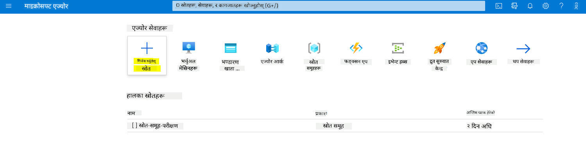

   Machine Learning खोज्नुहोस् र Machine Learning टाइल चयन गर्नुहोस्

   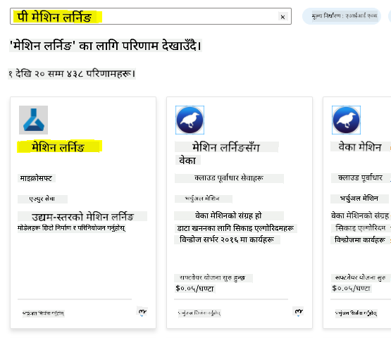

   सिर्जना बटनमा क्लिक गर्नुहोस्

   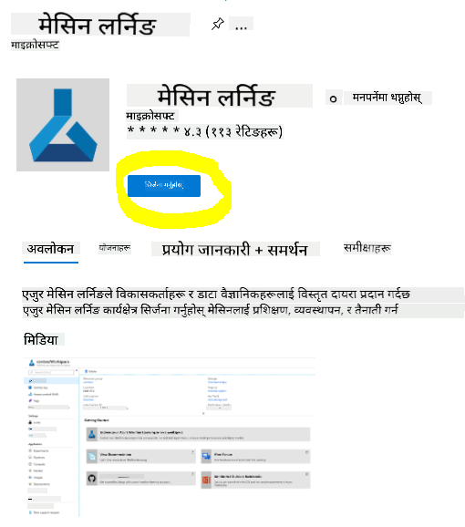

   सेटिङहरू निम्नानुसार भर्नुहोस्:
   - सदस्यता: तपाईंको Azure सदस्यता
   - स्रोत समूह: स्रोत समूह सिर्जना गर्नुहोस् वा चयन गर्नुहोस्
   - कार्यक्षेत्र नाम: तपाईंको कार्यक्षेत्रको लागि अद्वितीय नाम प्रविष्ट गर्नुहोस्
   - क्षेत्र: तपाईंको नजिकको भौगोलिक क्षेत्र चयन गर्नुहोस्
   - भण्डारण खाता: तपाईंको कार्यक्षेत्रको लागि सिर्जना गरिने नयाँ भण्डारण खाताको नोट गर्नुहोस्
   - कुञ्जी भण्डार: तपाईंको कार्यक्षेत्रको लागि सिर्जना गरिने नयाँ कुञ्जी भण्डारको नोट गर्नुहोस्
   - अनुप्रयोग अन्तर्दृष्टि: तपाईंको कार्यक्षेत्रको लागि सिर्जना गरिने नयाँ अनुप्रयोग अन्तर्दृष्टि स्रोतको नोट गर्नुहोस्
   - कन्टेनर रजिस्ट्री: कुनै पनि (मोडेललाई कन्टेनरमा परिनियोजन गर्ने पहिलो पटक स्वतः सिर्जना गरिनेछ)

    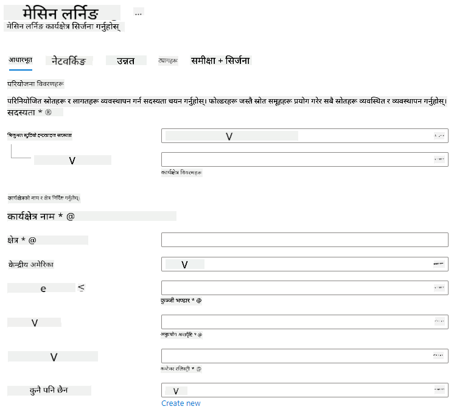

   - सिर्जना + समीक्षा क्लिक गर्नुहोस् र त्यसपछि सिर्जना बटनमा क्लिक गर्नुहोस्
3. तपाईंको कार्यक्षेत्र सिर्जना हुने प्रतीक्षा गर्नुहोस् (यसमा केही मिनेट लाग्न सक्छ)। त्यसपछि पोर्टलमा जानुहोस्। तपाईं यसलाई Machine Learning Azure सेवाबाट फेला पार्न सक्नुहुन्छ।
4. तपाईंको कार्यक्षेत्रको अवलोकन पृष्ठमा, Azure Machine Learning स्टुडियो सुरु गर्नुहोस् (वा नयाँ ब्राउजर ट्याब खोल्नुहोस् र https://ml.azure.com मा जानुहोस्), र Azure Machine Learning स्टुडियोमा तपाईंको Microsoft खाता प्रयोग गरेर साइन इन गर्नुहोस्। यदि संकेत गरिएको छ भने, तपाईंको Azure निर्देशिका र सदस्यता चयन गर्नुहोस्, र तपाईंको Azure Machine Learning कार्यक्षेत्र चयन गर्नुहोस्।
   
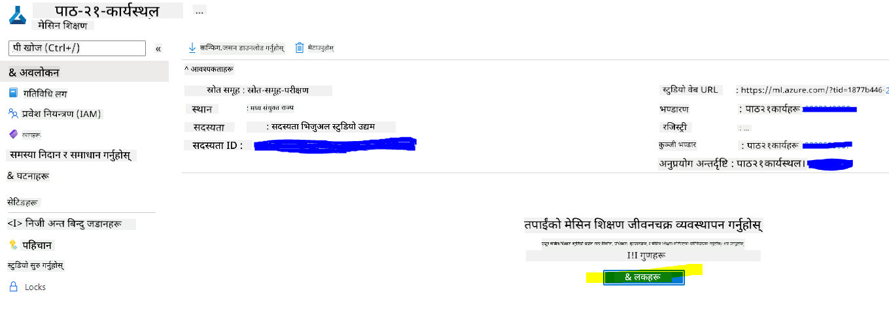

5. Azure Machine Learning स्टुडियोमा, शीर्ष बायाँमा ☰ आइकन टगल गर्नुहोस् ताकि इन्टरफेसका विभिन्न पृष्ठहरू हेर्न सक्नुहोस्। तपाईंले यी पृष्ठहरू प्रयोग गरेर तपाईंको कार्यक्षेत्रका स्रोतहरू व्यवस्थापन गर्न सक्नुहुन्छ।

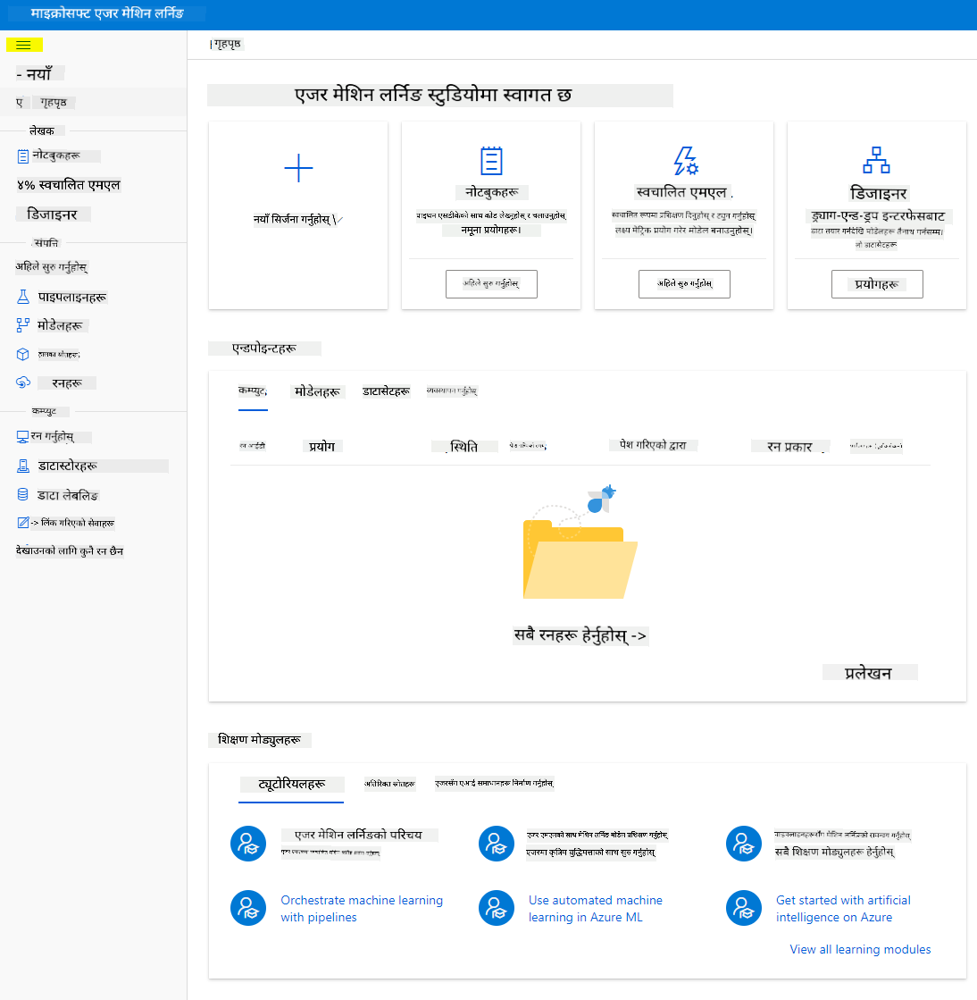

तपाईं Azure पोर्टल प्रयोग गरेर तपाईंको कार्यक्षेत्र व्यवस्थापन गर्न सक्नुहुन्छ, तर डेटा वैज्ञानिकहरू र मेसिन लर्निङ अपरेसन इन्जिनियरहरूको लागि, Azure Machine Learning स्टुडियोले कार्यक्षेत्र स्रोतहरू व्यवस्थापन गर्न अधिक केन्द्रित प्रयोगकर्ता इन्टरफेस प्रदान गर्दछ।

### 2.2 कम्प्युट स्रोतहरू

कम्प्युट स्रोतहरू क्लाउड-आधारित स्रोतहरू हुन् जसमा तपाईं मोडेल प्रशिक्षण र डेटा अन्वेषण प्रक्रियाहरू चलाउन सक्नुहुन्छ। तपाईंले चार प्रकारका कम्प्युट स्रोतहरू सिर्जना गर्न सक्नुहुन्छ:

- **कम्प्युट इन्स्ट्यान्सहरू**: विकास कार्यस्थलहरू जसलाई डेटा वैज्ञानिकहरूले डेटा र मोडेलहरूसँग काम गर्न प्रयोग गर्न सक्छन्। यसमा भर्चुअल मेसिन (VM) सिर्जना गर्नु र नोटबुक इन्स्ट्यान्स सुरु गर्नु समावेश छ। त्यसपछि तपाईंले नोटबुकबाट कम्प्युट क्लस्टरलाई कल गरेर मोडेल प्रशिक्षण गर्न सक्नुहुन्छ।
- **कम्प्युट क्लस्टरहरू**: प्रयोगको माग अनुसार प्रयोगात्मक कोडको प्रक्रिया गर्न VM को स्केलेबल क्लस्टरहरू। तपाईंलाई मोडेल प्रशिक्षण गर्दा यसको आवश्यकता हुनेछ। कम्प्युट क्लस्टरहरूले विशेष GPU वा CPU स्रोतहरू पनि प्रयोग गर्न सक्छ।
- **जोडिएको कम्प्युट**: Azure का विद्यमान कम्प्युट स्रोतहरू जस्तै Virtual Machines वा Azure Databricks क्लस्टरहरूसँग लिंक गर्दछ।

#### 2.2.1 तपाईँको कम्प्युट स्रोतहरूको लागि सही विकल्पहरू चयन गर्ने

कम्प्युट स्रोत सिर्जना गर्दा विचार गर्नुपर्ने केही मुख्य पक्षहरू छन्, र ती छनोटहरू महत्त्वपूर्ण निर्णयहरू हुन सक्छन्।

**तपाईँलाई CPU चाहिन्छ कि GPU?**

CPU (Central Processing Unit) कम्प्युटर प्रोग्रामका निर्देशनहरू कार्यान्वयन गर्ने इलेक्ट्रोनिक सर्किट हो। GPU (Graphics Processing Unit) एक विशेष इलेक्ट्रोनिक सर्किट हो जसले ग्राफिक्ससँग सम्बन्धित कोडलाई धेरै उच्च दरमा कार्यान्वयन गर्न सक्छ।

CPU र GPU को आर्किटेक्चरको मुख्य भिन्नता यो हो कि CPU लाई छिटो गतिमा (CPU क्लक स्पीडद्वारा मापन गरिन्छ) फराकिलो दायराका कार्यहरू गर्न डिजाइन गरिएको छ, तर यसले एकैपटक धेरै कार्यहरू चलाउन सीमितता राख्छ। GPU भने समानान्तर कम्प्युटिङका लागि डिजाइन गरिएको हुन्छ, जसले गर्दा यो गहिरो सिकाइ (Deep Learning) कार्यहरूको लागि धेरै राम्रो हुन्छ।

| CPU                                     | GPU                         |
|-----------------------------------------|-----------------------------|
| कम महँगो                                | बढी महँगो                  |
| कम स्तरको समानान्तरता                 | उच्च स्तरको समानान्तरता   |
| गहिरो सिकाइ मोडेलहरू प्रशिक्षणमा ढिलो  | गहिरो सिकाइका लागि उपयुक्त |

**क्लस्टर आकार**

ठूला क्लस्टरहरू महँगो हुन्छन् तर राम्रो प्रतिक्रिया समय दिन्छन्। त्यसैले, यदि तपाईंसँग समय छ तर पर्याप्त पैसा छैन भने, सानो क्लस्टरबाट सुरु गर्नुहोस्। उल्टो, यदि तपाईंसँग पैसा छ तर समय छैन भने, ठूलो क्लस्टरबाट सुरु गर्नुहोस्।

**VM आकार**

तपाईँको समय र बजेटीय सीमाहरूको आधारमा, तपाईँले RAM, डिस्क, कोरहरूको संख्या र क्लक स्पीडको आकार फरक पार्न सक्नुहुन्छ। यी सबै प्यारामिटरहरू बढाउँदा लागत बढ्छ, तर प्रदर्शन राम्रो हुन्छ।

**समर्पित वा कम प्राथमिकता भएका उदाहरणहरू?**

कम प्राथमिकता भएको उदाहरण भनेको यो अवरोध गर्न मिल्ने हो: मूलतः, Microsoft Azure ले ती स्रोतहरू लिन र अर्को कार्यमा असाइन गर्न सक्छ, जसले गर्दा कुनै काम अवरुद्ध हुन्छ। समर्पित उदाहरण, वा अवरोध गर्न नमिल्ने, भनेको तपाईँको अनुमति बिना काम कहिल्यै बन्द हुनेछैन। 
यो समय र पैसाको अर्को विचार हो, किनभने अवरोध गर्न मिल्ने उदाहरणहरू समर्पित उदाहरणहरूको तुलनामा सस्तो हुन्छन्।

#### 2.2.2 कम्प्युट क्लस्टर सिर्जना गर्ने

हामीले पहिले सिर्जना गरेको [Azure ML workspace](https://ml.azure.com/) मा जानुहोस्, कम्प्युटमा जानुहोस् र तपाईँले हामीले माथि छलफल गरेका विभिन्न कम्प्युट स्रोतहरू (जस्तै कम्प्युट उदाहरणहरू, कम्प्युट क्लस्टरहरू, इन्फरेन्स क्लस्टरहरू र जोडिएको कम्प्युट) देख्न सक्नुहुन्छ। यस परियोजनाको लागि, हामीलाई मोडेल प्रशिक्षणका लागि कम्प्युट क्लस्टर चाहिन्छ। Studio मा, "Compute" मेनुमा क्लिक गर्नुहोस्, त्यसपछि "Compute cluster" ट्याबमा क्लिक गर्नुहोस् र "+ New" बटनमा क्लिक गरेर कम्प्युट क्लस्टर सिर्जना गर्नुहोस्।

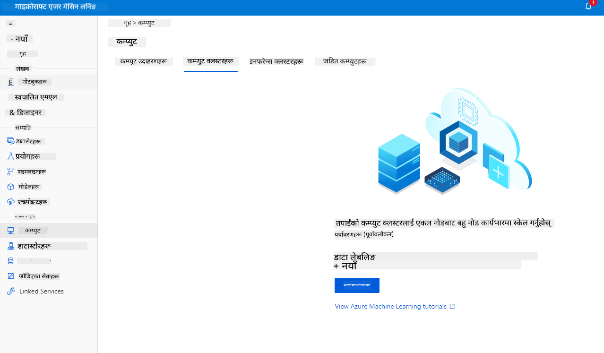

1. तपाईँका विकल्पहरू चयन गर्नुहोस्: समर्पित बनाम कम प्राथमिकता, CPU वा GPU, VM आकार र कोर संख्या (यस परियोजनाको लागि डिफल्ट सेटिङहरू राख्न सक्नुहुन्छ)।
2. Next बटनमा क्लिक गर्नुहोस्।

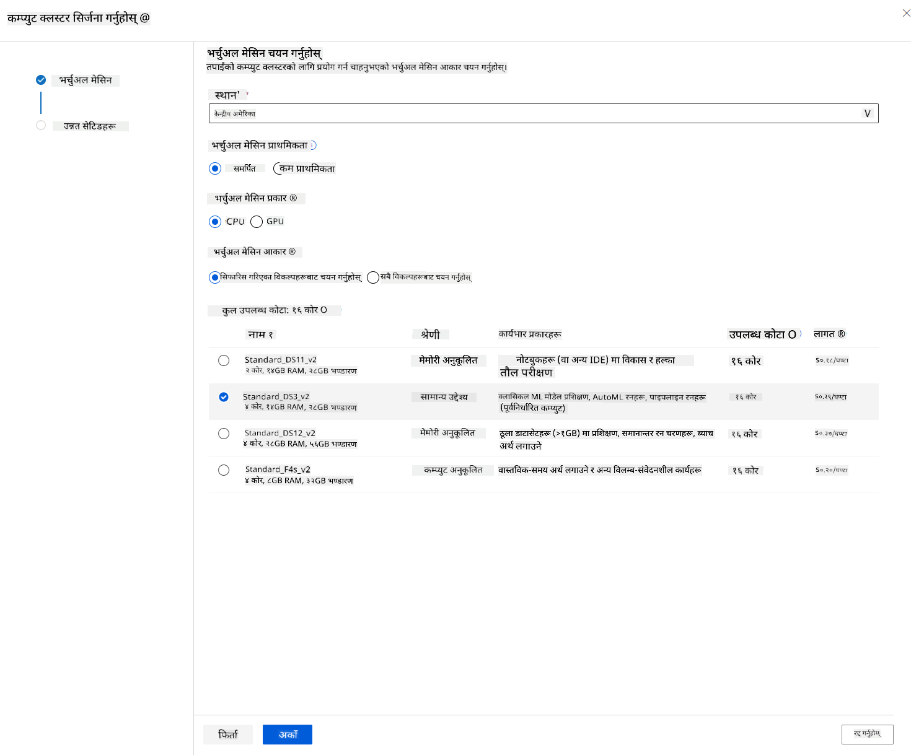

3. क्लस्टरलाई कम्प्युट नाम दिनुहोस्।
4. तपाईँका विकल्पहरू चयन गर्नुहोस्: न्यूनतम/अधिकतम नोडहरूको संख्या, स्केल डाउन गर्नु अघि निष्क्रिय सेकेन्डहरू, SSH पहुँच। ध्यान दिनुहोस् कि यदि न्यूनतम नोडहरूको संख्या 0 छ भने, क्लस्टर निष्क्रिय हुँदा तपाईँले पैसा बचत गर्नुहुनेछ। ध्यान दिनुहोस् कि अधिकतम नोडहरूको संख्या जति धेरै हुन्छ, प्रशिक्षण समय त्यति नै छोटो हुन्छ। अधिकतम 3 नोडहरू सिफारिस गरिन्छ।  
5. "Create" बटनमा क्लिक गर्नुहोस्। यो चरण पूरा हुन केही मिनेट लाग्न सक्छ।

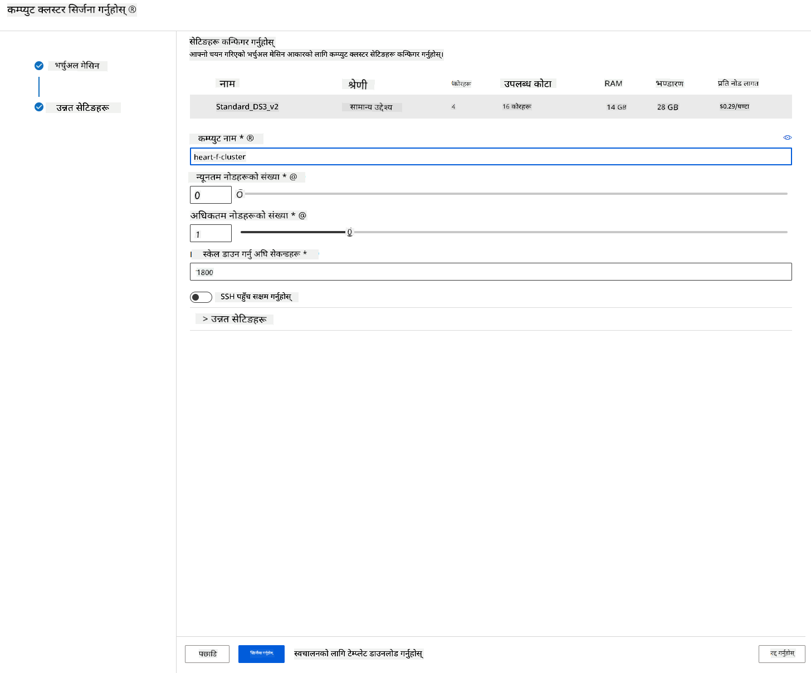

शानदार! अब हामीसँग कम्प्युट क्लस्टर छ, हामीले Azure ML Studio मा डेटा लोड गर्न आवश्यक छ।

### 2.3 डेटासेट लोड गर्ने

1. हामीले पहिले सिर्जना गरेको [Azure ML workspace](https://ml.azure.com/) मा, बायाँ मेनुमा "Datasets" मा क्लिक गर्नुहोस् र "+ Create dataset" बटनमा क्लिक गरेर डेटासेट सिर्जना गर्नुहोस्। "From local files" विकल्प चयन गर्नुहोस् र हामीले पहिले डाउनलोड गरेको Kaggle डेटासेट चयन गर्नुहोस्।

   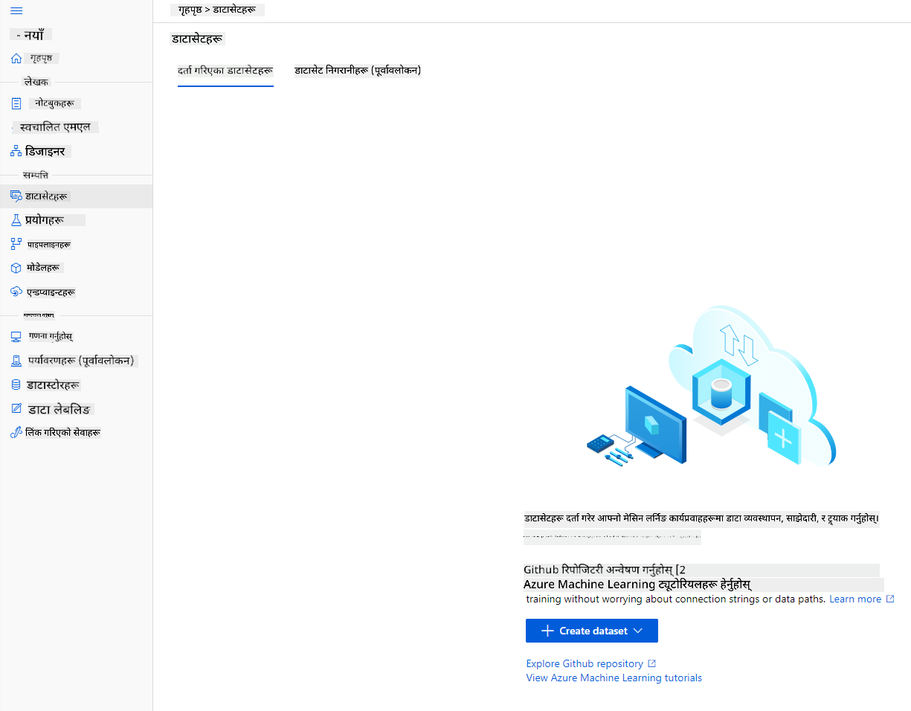

2. तपाईँको डेटासेटलाई नाम, प्रकार र विवरण दिनुहोस्। Next मा क्लिक गर्नुहोस्। फाइलहरूबाट डेटा अपलोड गर्नुहोस्। Next मा क्लिक गर्नुहोस्।

   

3. Schema मा, निम्न विशेषताहरूको लागि डेटा प्रकार Boolean मा परिवर्तन गर्नुहोस्: anaemia, diabetes, high blood pressure, sex, smoking, र DEATH_EVENT। Next मा क्लिक गर्नुहोस् र Create मा क्लिक गर्नुहोस्।

   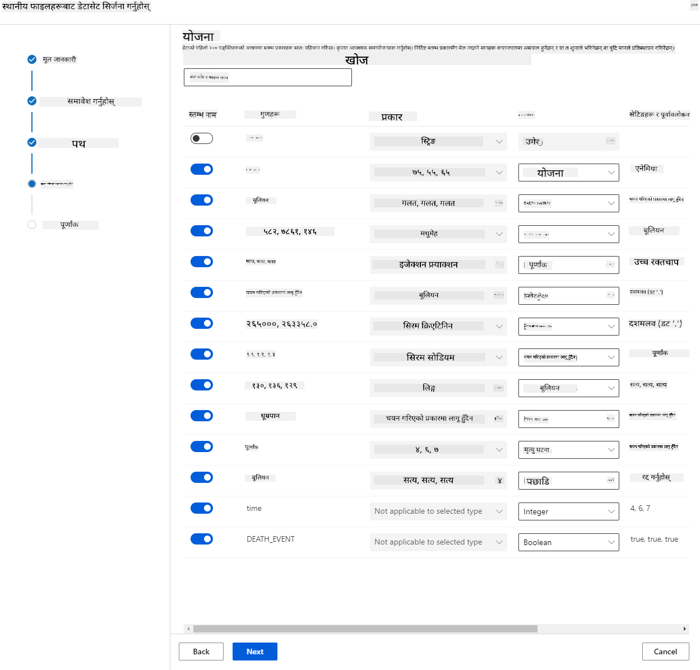

उत्कृष्ट! अब डेटासेट तयार छ र कम्प्युट क्लस्टर सिर्जना गरिएको छ, हामी मोडेलको प्रशिक्षण सुरु गर्न सक्छौं!

### 2.4 कम कोड/कुनै कोड बिना AutoML को साथ प्रशिक्षण

परम्परागत मेसिन लर्निङ मोडेल विकास स्रोत-गहन हुन्छ, महत्त्वपूर्ण डोमेन ज्ञान र दर्जनौं मोडेलहरू उत्पादन र तुलना गर्न समय लाग्छ। 
स्वचालित मेसिन लर्निङ (AutoML) भनेको मेसिन लर्निङ मोडेल विकासका समय-लाग्ने, पुनरावृत्त कार्यहरूलाई स्वचालित गर्ने प्रक्रिया हो। यसले डेटा वैज्ञानिकहरू, विश्लेषकहरू, र विकासकर्ताहरूलाई उच्च स्केल, दक्षता, र उत्पादकताका साथ ML मोडेलहरू निर्माण गर्न अनुमति दिन्छ, मोडेलको गुणस्तर कायम राख्दै। [थप जान्नुहोस्](https://docs.microsoft.com/azure/machine-learning/concept-automated-ml?WT.mc_id=academic-77958-bethanycheum&ocid=AID3041109)

1. हामीले पहिले सिर्जना गरेको [Azure ML workspace](https://ml.azure.com/) मा, बायाँ मेनुमा "Automated ML" मा क्लिक गर्नुहोस् र तपाईँले भर्खर अपलोड गरेको डेटासेट चयन गर्नुहोस्। Next मा क्लिक गर्नुहोस्।

   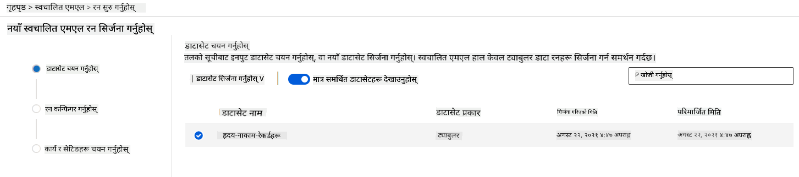

2. नयाँ प्रयोगको नाम, लक्ष्य स्तम्भ (DEATH_EVENT) र हामीले सिर्जना गरेको कम्प्युट क्लस्टर प्रविष्ट गर्नुहोस्। Next मा क्लिक गर्नुहोस्।

   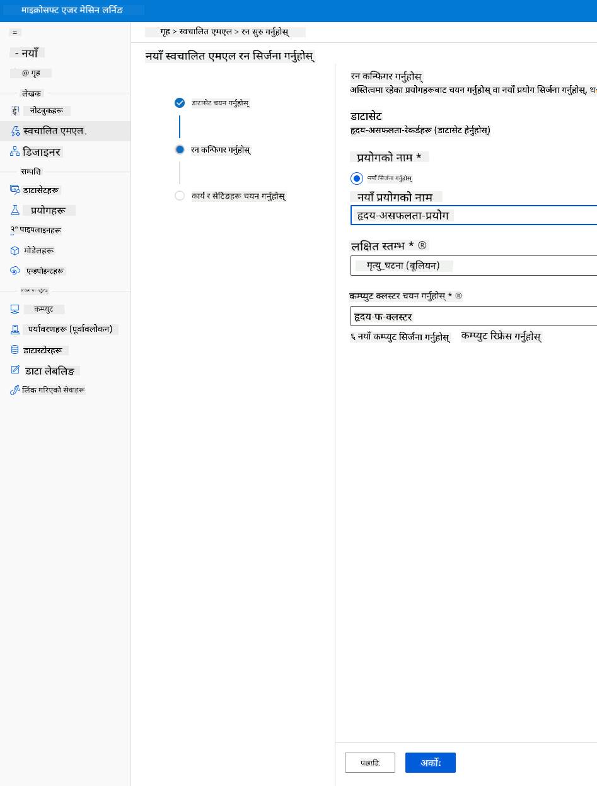

3. "Classification" चयन गर्नुहोस् र Finish मा क्लिक गर्नुहोस्। यो चरण 30 मिनेटदेखि 1 घण्टासम्म लाग्न सक्छ, तपाईँको कम्प्युट क्लस्टरको आकारमा निर्भर गर्दै।

    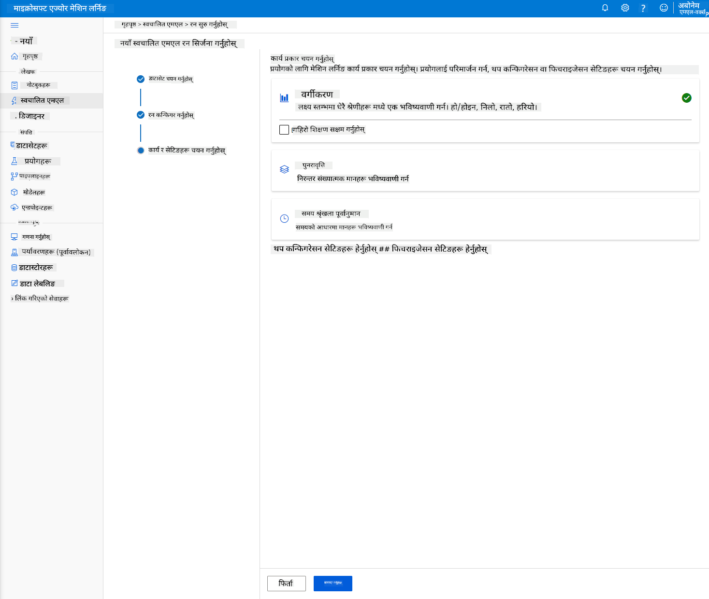

4. एकपटक रन पूरा भएपछि, "Automated ML" ट्याबमा क्लिक गर्नुहोस्, तपाईँको रनमा क्लिक गर्नुहोस्, र "Best model summary" कार्डमा Algorithm मा क्लिक गर्नुहोस्।

    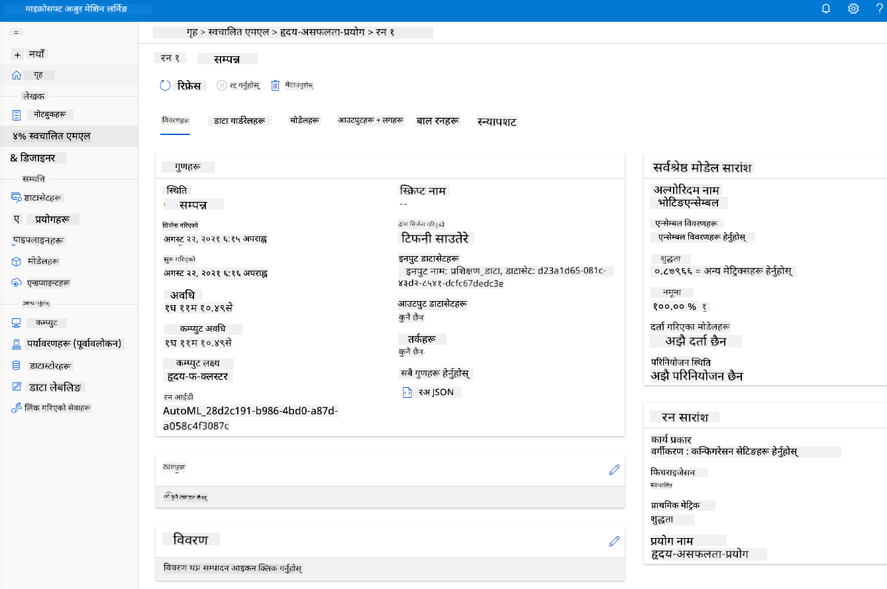

यहाँ तपाईँले AutoML ले उत्पन्न गरेको उत्कृष्ट मोडेलको विस्तृत विवरण देख्न सक्नुहुन्छ। तपाईँले Models ट्याबमा अन्य मोडेलहरू पनि अन्वेषण गर्न सक्नुहुन्छ। केही समय लिएर Explanations (preview) बटनमा मोडेलहरू अन्वेषण गर्नुहोस्। एकपटक तपाईँले प्रयोग गर्न चाहेको मोडेल चयन गर्नुभयो (यहाँ हामी AutoML द्वारा चयन गरिएको उत्कृष्ट मोडेल चयन गर्नेछौं), हामी यसलाई कसरी तैनाथ गर्ने देख्नेछौं।

## 3. कम कोड/कुनै कोड मोडेल तैनाथीकरण र अन्त बिन्दु उपभोग
### 3.1 मोडेल तैनाथीकरण

स्वचालित मेसिन लर्निङ इन्टरफेसले उत्कृष्ट मोडेललाई वेब सेवाको रूपमा केही चरणहरूमा तैनाथ गर्न अनुमति दिन्छ। तैनाथीकरण भनेको मोडेललाई नयाँ डेटा आधारमा भविष्यवाणी गर्न र सम्भावित अवसरका क्षेत्रहरू पहिचान गर्न सक्षम बनाउने एकीकरण हो। यस परियोजनाको लागि, वेब सेवामा तैनाथीकरणको अर्थ चिकित्सा अनुप्रयोगहरूले मोडेललाई उपभोग गर्न सक्नेछन् ताकि उनीहरूको बिरामीहरूको हृदयघातको जोखिमको प्रत्यक्ष भविष्यवाणी गर्न सकियोस्।

उत्कृष्ट मोडेल विवरणमा, "Deploy" बटनमा क्लिक गर्नुहोस्।

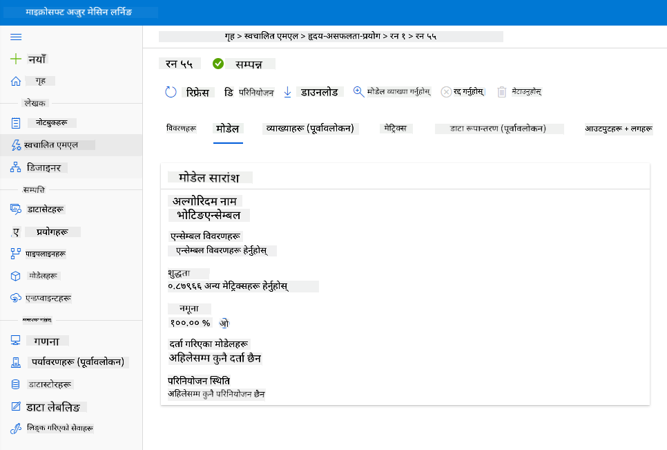

15. यसलाई नाम, विवरण, कम्प्युट प्रकार (Azure Container Instance) दिनुहोस्, प्रमाणीकरण सक्षम गर्नुहोस् र Deploy मा क्लिक गर्नुहोस्। यो चरण पूरा हुन लगभग 20 मिनेट लाग्न सक्छ। तैनाथीकरण प्रक्रियामा मोडेल दर्ता गर्ने, स्रोतहरू उत्पन्न गर्ने, र वेब सेवाको लागि तिनीहरूलाई कन्फिगर गर्ने चरणहरू समावेश छन्। Deploy status अन्तर्गत स्थिति सन्देश देखिन्छ। स्थिति जाँच गर्न Refresh चयन गर्नुहोस्। जब स्थिति "Healthy" हुन्छ, यो तैनाथ र चलिरहेको हुन्छ।

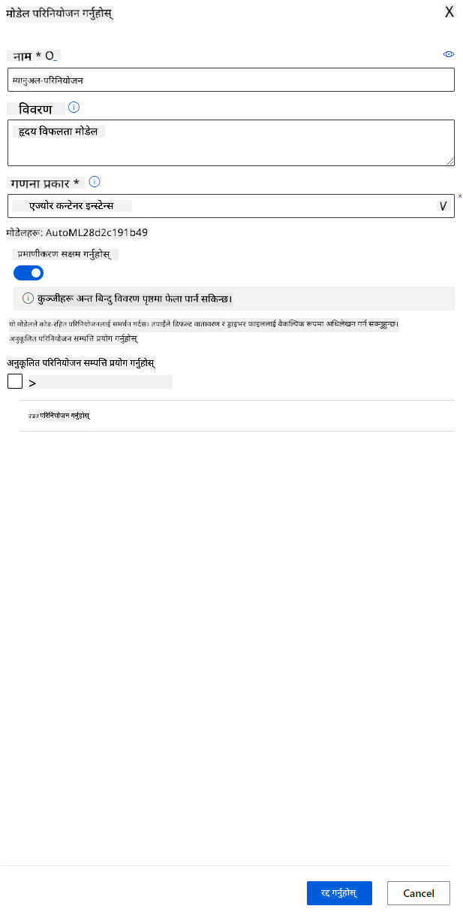

16. एकपटक यो तैनाथ भएपछि, Endpoint ट्याबमा क्लिक गर्नुहोस् र तपाईँले भर्खर तैनाथ गरेको अन्त बिन्दुमा क्लिक गर्नुहोस्। यहाँ तपाईँले अन्त बिन्दुका बारेमा जान्न आवश्यक सबै विवरणहरू पाउन सक्नुहुन्छ।

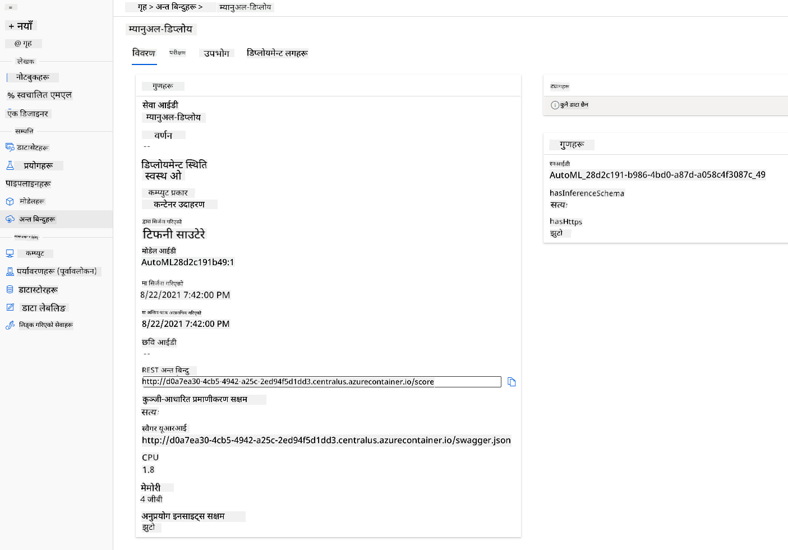

अद्भुत! अब हामीसँग मोडेल तैनाथ छ, हामी अन्त बिन्दुको उपभोग सुरु गर्न सक्छौं।

### 3.2 अन्त बिन्दु उपभोग

"Consume" ट्याबमा क्लिक गर्नुहोस्। यहाँ तपाईँले REST अन्त बिन्दु र उपभोग विकल्पमा पाइथन स्क्रिप्ट पाउन सक्नुहुन्छ। पाइथन कोड पढ्न केही समय लिनुहोस्।

यो स्क्रिप्ट तपाईँको स्थानीय मेसिनबाट सिधै चलाउन सकिन्छ र तपाईँको अन्त बिन्दु उपभोग गर्नेछ।

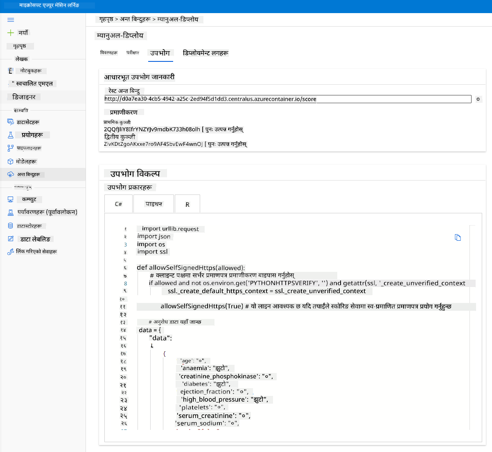

यी दुई लाइन कोडलाई ध्यान दिनुहोस्:

```python
url = 'http://98e3715f-xxxx-xxxx-xxxx-9ec22d57b796.centralus.azurecontainer.io/score'
api_key = '' # Replace this with the API key for the web service
```
`url` भेरिएबल उपभोग ट्याबमा पाइने REST अन्त बिन्दु हो र `api_key` भेरिएबल प्रमाणीकरण सक्षम गरिएको अवस्थामा उपभोग ट्याबमा पाइने प्राथमिक कुञ्जी हो। यसरी स्क्रिप्टले अन्त बिन्दु उपभोग गर्न सक्छ।

18. स्क्रिप्ट चलाउँदा, तपाईँले निम्न आउटपुट देख्नुहुनेछ:
    ```python
    b'"{\\"result\\": [true]}"'
    ```
यसको अर्थ दिएको डेटाका लागि हृदय विफलताको भविष्यवाणी सत्य हो। यो तर्कसंगत छ किनभने यदि तपाईँ स्क्रिप्टमा स्वतः उत्पन्न गरिएको डेटालाई नजिकबाट हेर्नुहुन्छ भने, सबै कुरा डिफल्ट रूपमा 0 र false मा छ। तपाईँ निम्न इनपुट नमूनासँग डेटा परिवर्तन गर्न सक्नुहुन्छ:

```python
data = {
    "data":
    [
        {
            'age': "0",
            'anaemia': "false",
            'creatinine_phosphokinase': "0",
            'diabetes': "false",
            'ejection_fraction': "0",
            'high_blood_pressure': "false",
            'platelets': "0",
            'serum_creatinine': "0",
            'serum_sodium': "0",
            'sex': "false",
            'smoking': "false",
            'time': "0",
        },
        {
            'age': "60",
            'anaemia': "false",
            'creatinine_phosphokinase': "500",
            'diabetes': "false",
            'ejection_fraction': "38",
            'high_blood_pressure': "false",
            'platelets': "260000",
            'serum_creatinine': "1.40",
            'serum_sodium': "137",
            'sex': "false",
            'smoking': "false",
            'time': "130",
        },
    ],
}
```
स्क्रिप्टले यो फिर्ता गर्नुपर्छ:
    ```python
    b'"{\\"result\\": [true, false]}"'
    ```

बधाई छ! तपाईँले Azure ML मा मोडेल तैनाथ र प्रशिक्षण गर्नुभयो र यसलाई उपभोग गर्नुभयो!

> **_NOTE:_** परियोजना समाप्त भएपछि, सबै स्रोतहरू मेटाउन नबिर्सनुहोस्।
## 🚀 चुनौती

AutoML ले शीर्ष मोडेलहरूको लागि उत्पन्न गरेको मोडेल व्याख्या र विवरणलाई नजिकबाट हेर्नुहोस्। उत्कृष्ट मोडेल अन्य मोडेलहरूभन्दा किन राम्रो छ भनेर बुझ्ने प्रयास गर्नुहोस्। कुन एल्गोरिदमहरूको तुलना गरियो? तिनीहरूका बीच के भिन्नताहरू छन्? यस अवस्थामा उत्कृष्ट मोडेल किन राम्रो प्रदर्शन गर्दैछ?

## [पोस्ट-व्याख्यान प्रश्नोत्तरी](https://ff-quizzes.netlify.app/en/ds/)

## समीक्षा र आत्म अध्ययन

यस पाठमा, तपाईँले क्लाउडमा कम कोड/कुनै कोड बिना हृदय विफलताको जोखिम भविष्यवाणी गर्न मोडेल प्रशिक्षण, तैनाथ र उपभोग गर्ने तरिका सिक्नुभयो। यदि तपाईँले अझै गर्नुभएको छैन भने, AutoML ले शीर्ष मोडेलहरूको लागि उत्पन्न गरेको मोडेल व्याख्यामा गहिरो डुबुल्की मार्नुहोस् र उत्कृष्ट मोडेल अन्य मोडेलहरूभन्दा किन राम्रो छ भनेर बुझ्ने प्रयास गर्नुहोस्।

तपाईँ Low code/No code AutoML मा अझ गहिराइमा जान सक्नुहुन्छ यो [डकुमेन्टेशन](https://docs.microsoft.com/azure/machine-learning/tutorial-first-experiment-automated-ml?WT.mc_id=academic-77958-bethanycheum&ocid=AID3041109) पढेर।

## असाइनमेन्ट

[Azure ML मा Low code/No code डेटा साइन्स परियोजना](assignment.md)

---

**अस्वीकरण**:  
यो दस्तावेज़ AI अनुवाद सेवा [Co-op Translator](https://github.com/Azure/co-op-translator) प्रयोग गरेर अनुवाद गरिएको छ। हामी यथार्थताको लागि प्रयास गर्छौं, तर कृपया ध्यान दिनुहोस् कि स्वचालित अनुवादमा त्रुटिहरू वा अशुद्धताहरू हुन सक्छ। यसको मूल भाषा मा रहेको मूल दस्तावेज़लाई आधिकारिक स्रोत मानिनुपर्छ। महत्वपूर्ण जानकारीको लागि, व्यावसायिक मानव अनुवाद सिफारिस गरिन्छ। यस अनुवादको प्रयोगबाट उत्पन्न हुने कुनै पनि गलतफहमी वा गलत व्याख्याको लागि हामी जिम्मेवार हुने छैनौं।