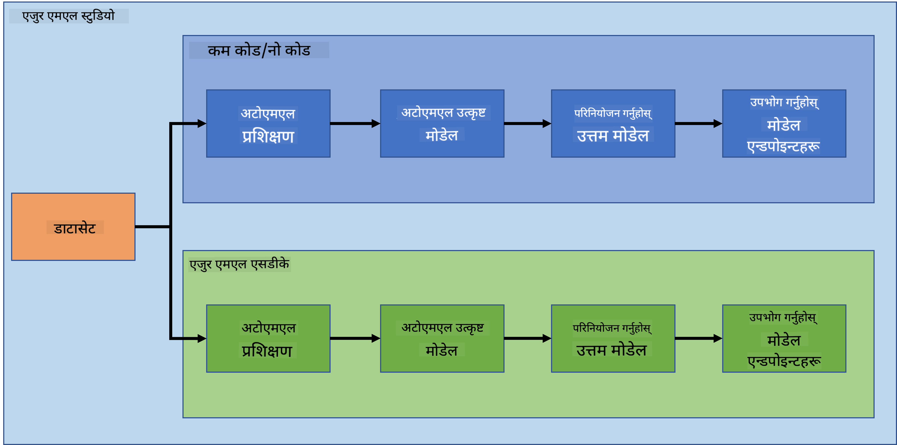
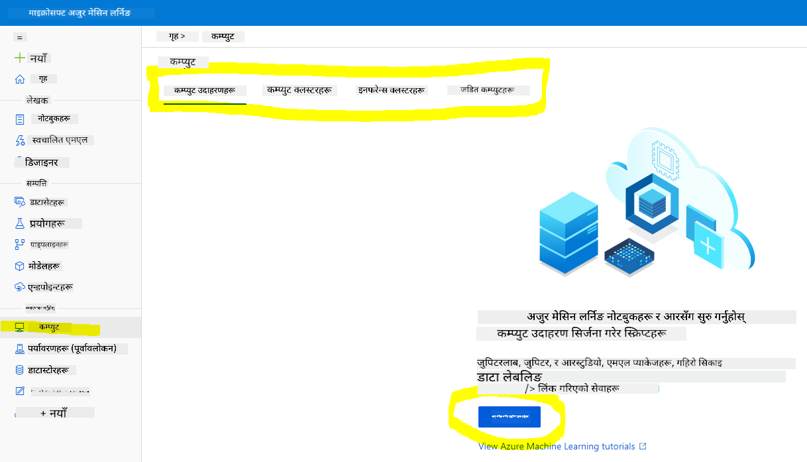
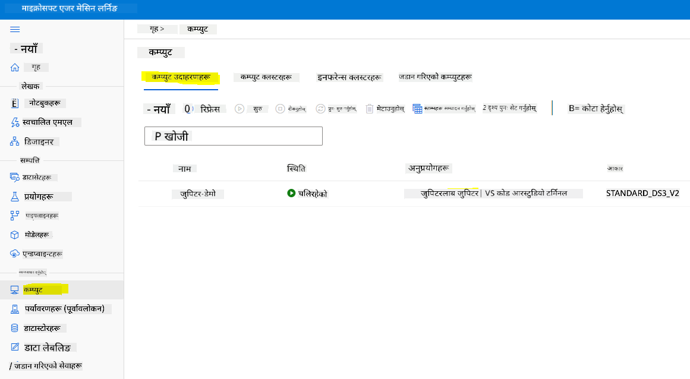
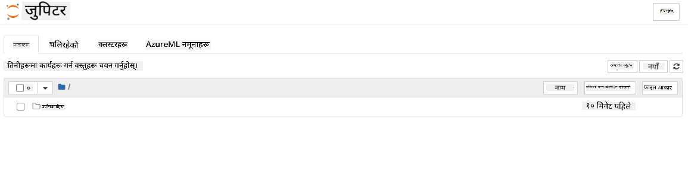

<!--
CO_OP_TRANSLATOR_METADATA:
{
  "original_hash": "73dead89dc2ddda4d6ec0232814a191e",
  "translation_date": "2025-08-27T17:49:32+00:00",
  "source_file": "5-Data-Science-In-Cloud/19-Azure/README.md",
  "language_code": "ne"
}
-->
# क्लाउडमा डेटा विज्ञान: "Azure ML SDK" बाट

| ](../../sketchnotes/19-DataScience-Cloud.png)|
|:---:|
| क्लाउडमा डेटा विज्ञान: Azure ML SDK - _Sketchnote by [@nitya](https://twitter.com/nitya)_ |

सामग्रीको सूची:

- [क्लाउडमा डेटा विज्ञान: "Azure ML SDK" बाट](../../../../5-Data-Science-In-Cloud/19-Azure)
  - [पाठ अघि क्विज](../../../../5-Data-Science-In-Cloud/19-Azure)
  - [१. परिचय](../../../../5-Data-Science-In-Cloud/19-Azure)
    - [१.१ Azure ML SDK के हो?](../../../../5-Data-Science-In-Cloud/19-Azure)
    - [१.२ हार्ट फेल्योर प्रिडिक्शन प्रोजेक्ट र डेटासेटको परिचय](../../../../5-Data-Science-In-Cloud/19-Azure)
  - [२. Azure ML SDK प्रयोग गरेर मोडेल प्रशिक्षण](../../../../5-Data-Science-In-Cloud/19-Azure)
    - [२.१ Azure ML कार्यक्षेत्र सिर्जना गर्नुहोस्](../../../../5-Data-Science-In-Cloud/19-Azure)
    - [२.२ कम्प्युट इन्स्टेन्स सिर्जना गर्नुहोस्](../../../../5-Data-Science-In-Cloud/19-Azure)
    - [२.३ डेटासेट लोड गर्दै](../../../../5-Data-Science-In-Cloud/19-Azure)
    - [२.४ नोटबुकहरू सिर्जना गर्दै](../../../../5-Data-Science-In-Cloud/19-Azure)
    - [२.५ मोडेल प्रशिक्षण](../../../../5-Data-Science-In-Cloud/19-Azure)
      - [२.५.१ कार्यक्षेत्र, प्रयोग, कम्प्युट क्लस्टर र डेटासेट सेटअप गर्नुहोस्](../../../../5-Data-Science-In-Cloud/19-Azure)
      - [२.५.२ AutoML कन्फिगरेसन र प्रशिक्षण](../../../../5-Data-Science-In-Cloud/19-Azure)
  - [३. Azure ML SDK प्रयोग गरेर मोडेल परिनियोजन र अन्त बिन्दु उपभोग](../../../../5-Data-Science-In-Cloud/19-Azure)
    - [३.१ उत्कृष्ट मोडेल बचत गर्दै](../../../../5-Data-Science-In-Cloud/19-Azure)
    - [३.२ मोडेल परिनियोजन](../../../../5-Data-Science-In-Cloud/19-Azure)
    - [३.३ अन्त बिन्दु उपभोग](../../../../5-Data-Science-In-Cloud/19-Azure)
  - [🚀 चुनौती](../../../../5-Data-Science-In-Cloud/19-Azure)
  - [पाठ पछि क्विज](../../../../5-Data-Science-In-Cloud/19-Azure)
  - [समीक्षा र आत्म अध्ययन](../../../../5-Data-Science-In-Cloud/19-Azure)
  - [असाइनमेन्ट](../../../../5-Data-Science-In-Cloud/19-Azure)

## [पाठ अघि क्विज](https://purple-hill-04aebfb03.1.azurestaticapps.net/quiz/36)

## १. परिचय

### १.१ Azure ML SDK के हो?

डेटा वैज्ञानिकहरू र AI विकासकर्ताहरू Azure Machine Learning SDK प्रयोग गरेर Azure Machine Learning सेवासँग मेसिन लर्निङ वर्कफ्लो निर्माण र सञ्चालन गर्छन्। तपाईंले यो सेवा कुनै पनि Python वातावरणमा, जस्तै Jupyter Notebooks, Visual Studio Code, वा तपाईंको मनपर्ने Python IDE मा प्रयोग गर्न सक्नुहुन्छ।

SDK का मुख्य क्षेत्रहरू:

- मेसिन लर्निङ प्रयोगहरूमा प्रयोग गरिएका डेटासेटहरूको जीवनचक्र अन्वेषण, तयारी र व्यवस्थापन गर्नुहोस्।
- मेसिन लर्निङ प्रयोगहरूको निगरानी, लगिङ, र संगठनका लागि क्लाउड स्रोतहरू व्यवस्थापन गर्नुहोस्।
- मोडेलहरू स्थानीय रूपमा वा GPU-प्रदत्त मोडेल प्रशिक्षण सहित क्लाउड स्रोतहरू प्रयोग गरेर प्रशिक्षण गर्नुहोस्।
- स्वचालित मेसिन लर्निङ प्रयोग गर्नुहोस्, जसले कन्फिगरेसन प्यारामिटरहरू र प्रशिक्षण डेटा स्वीकार गर्दछ। यसले एल्गोरिदम र हाइपरप्यारामिटर सेटिङहरूमा पुनरावृत्ति गरेर भविष्यवाणी चलाउनको लागि उत्कृष्ट मोडेल पत्ता लगाउँछ।
- वेब सेवाहरू परिनियोजन गर्नुहोस् ताकि तपाईंको प्रशिक्षित मोडेलहरूलाई RESTful सेवाहरूमा रूपान्तरण गर्न सकिन्छ जुन कुनै पनि एप्लिकेसनमा उपभोग गर्न सकिन्छ।

[Azure Machine Learning SDK को बारेमा थप जान्नुहोस्](https://docs.microsoft.com/python/api/overview/azure/ml?WT.mc_id=academic-77958-bethanycheum&ocid=AID3041109)

[अघिल्लो पाठमा](../18-Low-Code/README.md), हामीले कसरी Low code/No code तरिकामा मोडेल प्रशिक्षण, परिनियोजन र उपभोग गर्ने देख्यौं। हामीले हार्ट फेल्योर डेटासेट प्रयोग गरेर हार्ट फेल्योर प्रिडिक्शन मोडेल निर्माण गर्यौं। यस पाठमा, हामी ठीक त्यही कुरा गर्नेछौं तर Azure Machine Learning SDK प्रयोग गरेर।



### १.२ हार्ट फेल्योर प्रिडिक्शन प्रोजेक्ट र डेटासेटको परिचय

[यहाँ हेर्नुहोस्](../18-Low-Code/README.md) हार्ट फेल्योर प्रिडिक्शन प्रोजेक्ट र डेटासेटको परिचय।

## २. Azure ML SDK प्रयोग गरेर मोडेल प्रशिक्षण
### २.१ Azure ML कार्यक्षेत्र सिर्जना गर्नुहोस्

सरलताका लागि, हामी जुपिटर नोटबुकमा काम गर्नेछौं। यसको मतलब तपाईंले पहिले नै कार्यक्षेत्र र कम्प्युट इन्स्टेन्स बनाइसक्नुभएको छ। यदि तपाईंले पहिले नै कार्यक्षेत्र बनाइसक्नुभएको छ भने, तपाईं सिधै खण्ड २.३ नोटबुक सिर्जनामा जान सक्नुहुन्छ।

यदि छैन भने, कृपया [अघिल्लो पाठ](../18-Low-Code/README.md) को **२.१ Azure ML कार्यक्षेत्र सिर्जना गर्नुहोस्** खण्डमा निर्देशनहरू पालना गर्नुहोस्।

### २.२ कम्प्युट इन्स्टेन्स सिर्जना गर्नुहोस्

हामीले पहिले बनाएको [Azure ML कार्यक्षेत्र](https://ml.azure.com/) मा जानुहोस्, कम्प्युट मेनुमा जानुहोस् र तपाईंले उपलब्ध विभिन्न कम्प्युट स्रोतहरू देख्नुहुनेछ।



जुपिटर नोटबुकको लागि कम्प्युट इन्स्टेन्स सिर्जना गरौं। 
1. + New बटनमा क्लिक गर्नुहोस्। 
2. तपाईंको कम्प्युट इन्स्टेन्सलाई नाम दिनुहोस्।
3. तपाईंको विकल्पहरू चयन गर्नुहोस्: CPU वा GPU, VM साइज र कोर संख्या।
4. Create बटनमा क्लिक गर्नुहोस्।

बधाई छ, तपाईंले कम्प्युट इन्स्टेन्स सिर्जना गर्नुभयो! हामी यो कम्प्युट इन्स्टेन्सलाई [नोटबुक सिर्जनाको खण्ड](../../../../5-Data-Science-In-Cloud/19-Azure) मा प्रयोग गर्नेछौं।

### २.३ डेटासेट लोड गर्दै
यदि तपाईंले डेटासेट अपलोड गर्नुभएको छैन भने, [अघिल्लो पाठ](../18-Low-Code/README.md) को **२.३ डेटासेट लोड गर्दै** खण्डलाई हेर्नुहोस्।

### २.४ नोटबुकहरू सिर्जना गर्दै

> **_NOTE:_** अर्को चरणको लागि तपाईं नयाँ नोटबुक स्क्र्याचबाट सिर्जना गर्न सक्नुहुन्छ, वा तपाईंले [हामीले बनाएको नोटबुक](notebook.ipynb) Azure ML Studio मा अपलोड गर्न सक्नुहुन्छ। अपलोड गर्न, "Notebook" मेनुमा क्लिक गर्नुहोस् र नोटबुक अपलोड गर्नुहोस्।

नोटबुकहरू डेटा विज्ञान प्रक्रियाको एकदम महत्त्वपूर्ण भाग हुन्। तिनीहरूलाई अन्वेषणात्मक डेटा विश्लेषण (EDA) गर्न, कम्प्युट क्लस्टरमा मोडेल प्रशिक्षण गर्न, वा अन्त बिन्दु परिनियोजन गर्न प्रयोग गर्न सकिन्छ।

नोटबुक सिर्जना गर्न, हामीलाई जुपिटर नोटबुक इन्स्टेन्स प्रदान गर्ने कम्प्युट नोड चाहिन्छ। [Azure ML कार्यक्षेत्र](https://ml.azure.com/) मा फर्कनुहोस् र कम्प्युट इन्स्टेन्समा क्लिक गर्नुहोस्। कम्प्युट इन्स्टेन्सहरूको सूचीमा तपाईंले [पहिले बनाएको कम्प्युट इन्स्टेन्स](../../../../5-Data-Science-In-Cloud/19-Azure) देख्नुहुनेछ। 

1. Applications खण्डमा, Jupyter विकल्पमा क्लिक गर्नुहोस्। 
2. "Yes, I understand" बक्समा टिक गर्नुहोस् र Continue बटनमा क्लिक गर्नुहोस्।

3. यसले तपाईंको जुपिटर नोटबुक इन्स्टेन्सको साथ नयाँ ब्राउजर ट्याब खोल्नेछ। "New" बटनमा क्लिक गरेर नोटबुक सिर्जना गर्नुहोस्।



अब हामीसँग नोटबुक छ, हामी Azure ML SDK प्रयोग गरेर मोडेल प्रशिक्षण सुरु गर्न सक्छौं।

### २.५ मोडेल प्रशिक्षण

सबभन्दा पहिले, यदि तपाईंलाई कहिल्यै शंका लाग्छ भने, [Azure ML SDK डकुमेन्टेशन](https://docs.microsoft.com/python/api/overview/azure/ml?WT.mc_id=academic-77958-bethanycheum&ocid=AID3041109) हेर्नुहोस्। यसमा हामीले यस पाठमा हेर्ने मोड्युलहरू बुझ्न आवश्यक सबै जानकारी समावेश छ।

#### २.५.१ कार्यक्षेत्र, प्रयोग, कम्प्युट क्लस्टर र डेटासेट सेटअप गर्नुहोस्

तपाईंले निम्न कोड प्रयोग गरेर कन्फिगरेसन फाइलबाट `workspace` लोड गर्न आवश्यक छ:

```python
from azureml.core import Workspace
ws = Workspace.from_config()
```

यसले `Workspace` प्रकारको वस्तु फर्काउँछ जसले कार्यक्षेत्रलाई प्रतिनिधित्व गर्दछ। त्यसपछि तपाईंले निम्न कोड प्रयोग गरेर `experiment` सिर्जना गर्न आवश्यक छ:

```python
from azureml.core import Experiment
experiment_name = 'aml-experiment'
experiment = Experiment(ws, experiment_name)
```
कार्यक्षेत्रबाट प्रयोग प्राप्त गर्न वा सिर्जना गर्न, तपाईंले प्रयोगको नाम अनुरोध गर्नुपर्छ। प्रयोगको नाम ३-३६ अक्षरको हुनुपर्छ, अक्षर वा नम्बरबाट सुरु हुनुपर्छ, र केवल अक्षर, नम्बर, अन्डरस्कोर, र ड्यासहरू समावेश गर्न सकिन्छ। यदि कार्यक्षेत्रमा प्रयोग फेला परेन भने, नयाँ प्रयोग सिर्जना गरिन्छ।

अब तपाईंले निम्न कोड प्रयोग गरेर प्रशिक्षणको लागि कम्प्युट क्लस्टर सिर्जना गर्न आवश्यक छ। ध्यान दिनुहोस् कि यो चरणले केही मिनेट लिन सक्छ। 

```python
from azureml.core.compute import AmlCompute

aml_name = "heart-f-cluster"
try:
    aml_compute = AmlCompute(ws, aml_name)
    print('Found existing AML compute context.')
except:
    print('Creating new AML compute context.')
    aml_config = AmlCompute.provisioning_configuration(vm_size = "Standard_D2_v2", min_nodes=1, max_nodes=3)
    aml_compute = AmlCompute.create(ws, name = aml_name, provisioning_configuration = aml_config)
    aml_compute.wait_for_completion(show_output = True)

cts = ws.compute_targets
compute_target = cts[aml_name]
```

तपाईंले कार्यक्षेत्रबाट डेटासेट नाम प्रयोग गरेर डेटासेट प्राप्त गर्न सक्नुहुन्छ:

```python
dataset = ws.datasets['heart-failure-records']
df = dataset.to_pandas_dataframe()
df.describe()
```
#### २.५.२ AutoML कन्फिगरेसन र प्रशिक्षण

AutoML कन्फिगरेसन सेट गर्न, [AutoMLConfig class](https://docs.microsoft.com/python/api/azureml-train-automl-client/azureml.train.automl.automlconfig(class)?WT.mc_id=academic-77958-bethanycheum&ocid=AID3041109) प्रयोग गर्नुहोस्।

डकुमेन्टेशनमा वर्णन गरिए अनुसार, तपाईंले खेल्न सक्ने धेरै प्यारामिटरहरू छन्। यस प्रोजेक्टको लागि, हामी निम्न प्यारामिटरहरू प्रयोग गर्नेछौं:

- `experiment_timeout_minutes`: प्रयोगलाई स्वतः रोक्न र नतिजाहरू उपलब्ध गराउन अनुमति दिइएको अधिकतम समय (मिनेटमा)।
- `max_concurrent_iterations`: प्रयोगको लागि अनुमति दिइएको अधिकतम समवर्ती प्रशिक्षण पुनरावृत्तिहरू।
- `primary_metric`: प्रयोगको स्थिति निर्धारण गर्न प्रयोग गरिएको प्राथमिक मेट्रिक।
- `compute_target`: स्वचालित मेसिन लर्निङ प्रयोग चलाउन प्रयोग गरिएको Azure Machine Learning कम्प्युट लक्ष्य।
- `task`: चलाउनको लागि कार्यको प्रकार। मानहरू 'classification', 'regression', वा 'forecasting' हुन सक्छ।
- `training_data`: प्रयोग भित्र प्रयोग गरिने प्रशिक्षण डेटा। यसमा प्रशिक्षण सुविधाहरू र लेबल स्तम्भ (वैकल्पिक रूपमा नमूना वजन स्तम्भ) समावेश हुनुपर्छ।
- `label_column_name`: लेबल स्तम्भको नाम।
- `path`: Azure Machine Learning प्रोजेक्ट फोल्डरको पूर्ण पथ।
- `enable_early_stopping`: स्कोर छोटो अवधिमा सुधार नभएमा प्रारम्भिक समाप्ति सक्षम गर्ने वा नगर्ने।
- `featurization`: स्वतः सुविधाकरण चरण गरिनु पर्ने वा नगर्ने, वा अनुकूलित सुविधाकरण प्रयोग गरिनु पर्ने।
- `debug_log`: डिबग जानकारी लेख्नको लागि लग फाइल।

```python
from azureml.train.automl import AutoMLConfig

project_folder = './aml-project'

automl_settings = {
    "experiment_timeout_minutes": 20,
    "max_concurrent_iterations": 3,
    "primary_metric" : 'AUC_weighted'
}

automl_config = AutoMLConfig(compute_target=compute_target,
                             task = "classification",
                             training_data=dataset,
                             label_column_name="DEATH_EVENT",
                             path = project_folder,  
                             enable_early_stopping= True,
                             featurization= 'auto',
                             debug_log = "automl_errors.log",
                             **automl_settings
                            )
```
अब तपाईंको कन्फिगरेसन सेट भयो, तपाईंले निम्न कोड प्रयोग गरेर मोडेल प्रशिक्षण गर्न सक्नुहुन्छ। यो चरणले तपाईंको क्लस्टर साइजमा निर्भर गर्दै एक घण्टासम्म लिन सक्छ।

```python
remote_run = experiment.submit(automl_config)
```
तपाईंले RunDetails विजेट चलाउन सक्नुहुन्छ जसले विभिन्न प्रयोगहरू देखाउँछ।
```python
from azureml.widgets import RunDetails
RunDetails(remote_run).show()
```
## ३. Azure ML SDK प्रयोग गरेर मोडेल परिनियोजन र अन्त बिन्दु उपभोग

### ३.१ उत्कृष्ट मोडेल बचत गर्दै

`remote_run` [AutoMLRun](https://docs.microsoft.com/python/api/azureml-train-automl-client/azureml.train.automl.run.automlrun?WT.mc_id=academic-77958-bethanycheum&ocid=AID3041109) प्रकारको वस्तु हो। यस वस्तुमा `get_output()` विधि समावेश छ जसले उत्कृष्ट रन र त्यससँग सम्बन्धित फिट गरिएको मोडेल फर्काउँछ।

```python
best_run, fitted_model = remote_run.get_output()
```
तपाईंले उत्कृष्ट मोडेलको लागि प्रयोग गरिएका प्यारामिटरहरू प्रिन्ट गरेर हेर्न सक्नुहुन्छ र [get_properties()](https://docs.microsoft.com/python/api/azureml-core/azureml.core.run(class)?view=azure-ml-py#azureml_core_Run_get_properties?WT.mc_id=academic-77958-bethanycheum&ocid=AID3041109) विधि प्रयोग गरेर उत्कृष्ट मोडेलको गुणहरू देख्न सक्नुहुन्छ।

```python
best_run.get_properties()
```

अब [register_model](https://docs.microsoft.com/python/api/azureml-train-automl-client/azureml.train.automl.run.automlrun?view=azure-ml-py#register-model-model-name-none--description-none--tags-none--iteration-none--metric-none-?WT.mc_id=academic-77958-bethanycheum&ocid=AID3041109) विधि प्रयोग गरेर मोडेल दर्ता गर्नुहोस्।
```python
model_name = best_run.properties['model_name']
script_file_name = 'inference/score.py'
best_run.download_file('outputs/scoring_file_v_1_0_0.py', 'inference/score.py')
description = "aml heart failure project sdk"
model = best_run.register_model(model_name = model_name,
                                model_path = './outputs/',
                                description = description,
                                tags = None)
```
### ३.२ मोडेल परिनियोजन

एकपटक उत्कृष्ट मोडेल बचत भएपछि, हामी यसलाई [InferenceConfig](https://docs.microsoft.com/python/api/azureml-core/azureml.core.model.inferenceconfig?view=azure-ml-py?ocid=AID3041109) वर्ग प्रयोग गरेर परिनियोजन गर्न सक्छौं। InferenceConfig परिनियोजनको लागि प्रयोग गरिएको अनुकूल वातावरणको कन्फिगरेसन सेटिङहरू प्रतिनिधित्व गर्दछ। [AciWebservice](https://docs.microsoft.com/python/api/azureml-core/azureml.core.webservice.aciwebservice?view=azure-ml-py) वर्गले Azure Container Instances मा वेब सेवा अन्त बिन्दुको रूपमा परिनियोजित मेसिन लर्निङ मोडेललाई प्रतिनिधित्व गर्दछ। परिनियोजित सेवा मोडेल, स्क्रिप्ट, र सम्बन्धित फाइलहरूबाट सिर्जना गरिन्छ। परिणामी वेब सेवा लोड-ब्यालेन्स गरिएको, HTTP अन्त बिन्दु हो जसमा REST API छ। तपाईंले यस API मा डेटा पठाउन सक्नुहुन्छ र मोडेलले फर्काएको भविष्यवाणी प्राप्त गर्न सक्नुहुन्छ।

मोडेल [deploy](https://docs.microsoft.com/python/api/azureml-core/azureml.core.model(class)?view=azure-ml-py#deploy-workspace--name--models--inference-config-none--deployment-config-none--deployment-target-none--overwrite-false--show-output-false-?WT.mc_id=academic-77958-bethanycheum&ocid=AID3041109) विधि प्रयोग गरेर परिनियोजित गरिएको छ।

```python
from azureml.core.model import InferenceConfig, Model
from azureml.core.webservice import AciWebservice

inference_config = InferenceConfig(entry_script=script_file_name, environment=best_run.get_environment())

aciconfig = AciWebservice.deploy_configuration(cpu_cores = 1,
                                               memory_gb = 1,
                                               tags = {'type': "automl-heart-failure-prediction"},
                                               description = 'Sample service for AutoML Heart Failure Prediction')

aci_service_name = 'automl-hf-sdk'
aci_service = Model.deploy(ws, aci_service_name, [model], inference_config, aciconfig)
aci_service.wait_for_deployment(True)
print(aci_service.state)
```
यो चरणले केही मिनेट लिन सक्छ।

### ३.३ अन्त बिन्दु उपभोग

तपाईंको अन्त बिन्दु उपभोग गर्न, नमूना इनपुट सिर्जना गर्नुहोस्:

```python
data = {
    "data":
    [
        {
            'age': "60",
            'anaemia': "false",
            'creatinine_phosphokinase': "500",
            'diabetes': "false",
            'ejection_fraction': "38",
            'high_blood_pressure': "false",
            'platelets': "260000",
            'serum_creatinine': "1.40",
            'serum_sodium': "137",
            'sex': "false",
            'smoking': "false",
            'time': "130",
        },
    ],
}

test_sample = str.encode(json.dumps(data))
```
र त्यसपछि तपाईंले यो इनपुटलाई भविष्यवाणीको लागि आफ्नो मोडेलमा पठाउन सक्नुहुन्छ:
```python
response = aci_service.run(input_data=test_sample)
response
```
यसले `'{"result": [false]}'` उत्पादन गर्नुपर्छ। यसको अर्थ हामीले अन्तिम बिन्दुमा पठाएको बिरामीको इनपुटले `false` भविष्यवाणी उत्पन्न गर्‍यो, जसको अर्थ यो व्यक्तिलाई हृदयघात हुने सम्भावना छैन।

बधाई छ! तपाईंले Azure ML मा प्रशिक्षित र तैनात गरिएको मोडेललाई Azure ML SDK प्रयोग गरेर उपभोग गर्नुभयो!

> **_NOTE:_** परियोजना समाप्त भएपछि, सबै स्रोतहरू मेटाउन नबिर्सनुहोस्।

## 🚀 चुनौती

SDK मार्फत तपाईंले धेरै अन्य कामहरू गर्न सक्नुहुन्छ, तर दुर्भाग्यवश, हामी यस पाठमा तिनीहरू सबै हेर्न सक्दैनौं। तर राम्रो खबर, SDK दस्तावेजहरूलाई छिटो हेर्ने तरिका सिक्नाले तपाईंलाई धेरै टाढा लैजान सक्छ। Azure ML SDK दस्तावेज हेर्नुहोस् र `Pipeline` वर्ग खोज्नुहोस् जसले तपाईंलाई पाइपलाइनहरू सिर्जना गर्न अनुमति दिन्छ। पाइपलाइन भनेको चरणहरूको संग्रह हो जसलाई कार्यप्रवाहको रूपमा कार्यान्वयन गर्न सकिन्छ।

**सुझाव:** [SDK दस्तावेज](https://docs.microsoft.com/python/api/overview/azure/ml/?view=azure-ml-py?WT.mc_id=academic-77958-bethanycheum&ocid=AID3041109) मा जानुहोस् र खोज पट्टीमा "Pipeline" जस्ता कुञ्जी शब्दहरू टाइप गर्नुहोस्। तपाईंले खोज परिणामहरूमा `azureml.pipeline.core.Pipeline` वर्ग पाउनुपर्छ।

## [पाठपछिको क्विज](https://purple-hill-04aebfb03.1.azurestaticapps.net/quiz/37)

## समीक्षा र आत्म-अध्ययन

यस पाठमा, तपाईंले Azure ML SDK प्रयोग गरेर क्लाउडमा हृदयघातको जोखिमको भविष्यवाणी गर्न मोडेललाई प्रशिक्षण, तैनात र उपभोग गर्ने तरिका सिक्नुभयो। Azure ML SDK सम्बन्धी थप जानकारीको लागि यो [दस्तावेज](https://docs.microsoft.com/python/api/overview/azure/ml/?view=azure-ml-py?WT.mc_id=academic-77958-bethanycheum&ocid=AID3041109) हेर्नुहोस्। Azure ML SDK प्रयोग गरेर आफ्नो मोडेल सिर्जना गर्न प्रयास गर्नुहोस्।

## असाइनमेन्ट

[Azure ML SDK प्रयोग गरेर डेटा विज्ञान परियोजना](assignment.md)

---

**अस्वीकरण**:  
यो दस्तावेज़ AI अनुवाद सेवा [Co-op Translator](https://github.com/Azure/co-op-translator) प्रयोग गरेर अनुवाद गरिएको छ। हामी यथार्थताको लागि प्रयास गर्छौं, तर कृपया ध्यान दिनुहोस् कि स्वचालित अनुवादहरूमा त्रुटि वा अशुद्धता हुन सक्छ। यसको मूल भाषा मा रहेको मूल दस्तावेज़लाई आधिकारिक स्रोत मानिनुपर्छ। महत्वपूर्ण जानकारीको लागि, व्यावसायिक मानव अनुवाद सिफारिस गरिन्छ। यस अनुवादको प्रयोगबाट उत्पन्न हुने कुनै पनि गलतफहमी वा गलत व्याख्याको लागि हामी जिम्मेवार हुने छैनौं।