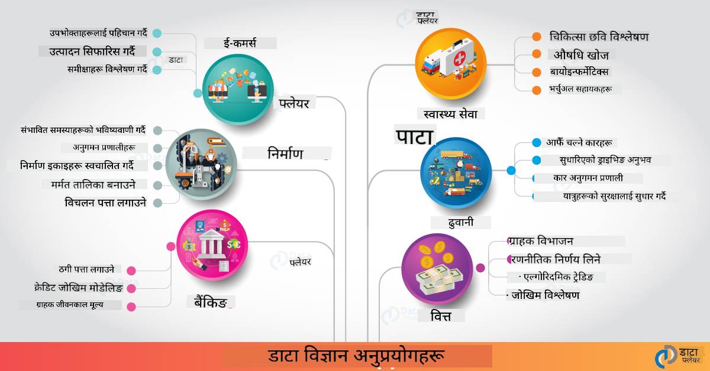

<!--
CO_OP_TRANSLATOR_METADATA:
{
  "original_hash": "0f67a4139454816631526779a456b734",
  "translation_date": "2025-09-06T18:23:24+00:00",
  "source_file": "6-Data-Science-In-Wild/20-Real-World-Examples/README.md",
  "language_code": "ne"
}
-->
# वास्तविक संसारमा डाटा साइन्स

|  ](../../sketchnotes/20-DataScience-RealWorld.png) |
| :--------------------------------------------------------------------------------------------------------------: |
|               वास्तविक संसारमा डाटा साइन्स - _Sketchnote by [@nitya](https://twitter.com/nitya)_               |

हामी यो सिकाइ यात्राको अन्त्यतिर आइपुगेका छौं!

हामीले डाटा साइन्स र नैतिकताको परिभाषाबाट सुरु गर्यौं, डाटा विश्लेषण र भिजुअलाइजेसनका विभिन्न उपकरण र प्रविधिहरू अन्वेषण गर्यौं, डाटा साइन्स जीवनचक्रको समीक्षा गर्यौं, र क्लाउड कम्प्युटिङ सेवाहरूको प्रयोग गरेर डाटा साइन्स वर्कफ्लोहरूलाई स्केल र स्वचालित गर्ने तरिकाहरू हेर्यौं। त्यसैले, तपाईं सोच्दै हुनुहुन्छ होला: _"यी सबै सिकाइहरूलाई वास्तविक संसारको सन्दर्भमा कसरी नक्सा बनाउन सकिन्छ?"_

यस पाठमा, हामी उद्योगभरि डाटा साइन्सका वास्तविक संसारका अनुप्रयोगहरू अन्वेषण गर्नेछौं र अनुसन्धान, डिजिटल मानविकी, र दिगोपनका सन्दर्भमा विशिष्ट उदाहरणहरूमा डुबुल्की मार्नेछौं। हामी विद्यार्थी परियोजनाका अवसरहरू हेर्नेछौं र तपाईंको सिकाइ यात्रा जारी राख्न मद्दत गर्ने उपयोगी स्रोतहरूसँग निष्कर्ष निकाल्नेछौं!

## पूर्व-पाठ प्रश्नोत्तरी

## [पूर्व-पाठ प्रश्नोत्तरी](https://ff-quizzes.netlify.app/en/ds/quiz/38)

## डाटा साइन्स + उद्योग

एआईको लोकतान्त्रिकरणको कारण, विकासकर्ताहरूले एआई-चालित निर्णय-निर्माण र डाटा-आधारित अन्तर्दृष्टिहरूलाई प्रयोगकर्ता अनुभव र विकास वर्कफ्लोहरूमा डिजाइन र एकीकृत गर्न सजिलो पाएका छन्। यहाँ उद्योगभरि डाटा साइन्सलाई "लागू" गर्ने केही उदाहरणहरू छन्:

 * [Google Flu Trends](https://www.wired.com/2015/10/can-learn-epic-failure-google-flu-trends/) ले खोजी शब्दहरूलाई फ्लू प्रवृत्तिहरूसँग सम्बन्धित गर्न डाटा साइन्स प्रयोग गर्‍यो। यद्यपि यस दृष्टिकोणमा कमजोरीहरू थिए, यसले डाटा-आधारित स्वास्थ्य सेवा भविष्यवाणीहरूको सम्भावनाहरू (र चुनौतीहरू) को बारेमा चेतना बढायो।

 * [UPS Routing Predictions](https://www.technologyreview.com/2018/11/21/139000/how-ups-uses-ai-to-outsmart-bad-weather/) - UPS ले मौसम अवस्था, ट्राफिक ढाँचाहरू, डेलिभरी समयसीमाहरू र अन्य कुराहरूलाई ध्यानमा राख्दै डेलिभरीका लागि इष्टतम मार्गहरूको भविष्यवाणी गर्न डाटा साइन्स र मेसिन लर्निङ प्रयोग गर्ने तरिका वर्णन गर्दछ।

 * [NYC Taxicab Route Visualization](http://chriswhong.github.io/nyctaxi/) - [सूचना स्वतन्त्रता कानूनहरू](https://chriswhong.com/open-data/foil_nyc_taxi/) प्रयोग गरेर सङ्कलित डाटाले NYC ट्याक्सीहरूको जीवनको एक दिनलाई दृश्यात्मक बनायो, जसले व्यस्त शहरमा उनीहरूले कसरी नेभिगेट गर्छन्, उनीहरूले कमाउने पैसा, र प्रत्येक २४-घण्टे अवधिमा यात्राको अवधि बुझ्न मद्दत गर्‍यो।

 * [Uber Data Science Workbench](https://eng.uber.com/dsw/) - दैनिक लाखौं उबर यात्राहरूबाट सङ्कलित डाटा (पिकअप र ड्रपअफ स्थानहरू, यात्रा अवधि, रुचाइएको मार्गहरू आदि) प्रयोग गरेर मूल्य निर्धारण, सुरक्षा, ठगी पत्ता लगाउने र नेभिगेसन निर्णयहरूमा मद्दत गर्न डाटा एनालिटिक्स उपकरण निर्माण गर्‍यो।

 * [Sports Analytics](https://towardsdatascience.com/scope-of-analytics-in-sports-world-37ed09c39860) - _पूर्वानुमानात्मक विश्लेषण_ (टीम र खेलाडी विश्लेषण - [Moneyball](https://datasciencedegree.wisconsin.edu/blog/moneyball-proves-importance-big-data-big-ideas/) सोच्नुहोस् - र प्रशंसक व्यवस्थापन) र _डाटा भिजुअलाइजेसन_ (टीम र प्रशंसक ड्यासबोर्ड, खेलहरू आदि) मा केन्द्रित छ, जसले प्रतिभा खोजी, खेल जुवा र सूची/स्थल व्यवस्थापन जस्ता अनुप्रयोगहरूलाई समर्थन गर्दछ।

 * [बैंकिङमा डाटा साइन्स](https://data-flair.training/blogs/data-science-in-banking/) - जोखिम मोडलिङ र ठगी पत्ता लगाउनेदेखि ग्राहक खण्डीकरण, वास्तविक-समय भविष्यवाणी र सिफारिस प्रणालीहरू सम्मका अनुप्रयोगहरूसँग वित्त उद्योगमा डाटा साइन्सको महत्त्वलाई हाइलाइट गर्दछ। पूर्वानुमानात्मक विश्लेषणले [क्रेडिट स्कोरहरू](https://dzone.com/articles/using-big-data-and-predictive-analytics-for-credit) जस्ता महत्त्वपूर्ण उपायहरूलाई पनि चलाउँछ।

 * [स्वास्थ्य सेवामा डाटा साइन्स](https://data-flair.training/blogs/data-science-in-healthcare/) - मेडिकल इमेजिङ (जस्तै, MRI, X-Ray, CT-Scan), जीनोमिक्स (DNA अनुक्रमण), औषधि विकास (जोखिम मूल्याङ्कन, सफलता भविष्यवाणी), पूर्वानुमानात्मक विश्लेषण (रोगी हेरचाह र आपूर्ति रसद), रोग ट्र्याकिङ र रोकथाम जस्ता अनुप्रयोगहरूलाई हाइलाइट गर्दछ।

 छवि श्रेय: [Data Flair: 6 Amazing Data Science Applications ](https://data-flair.training/blogs/data-science-applications/)

चित्रले डाटा साइन्स प्रविधिहरू लागू गर्नका लागि अन्य डोमेनहरू र उदाहरणहरू देखाउँछ। अन्य अनुप्रयोगहरू अन्वेषण गर्न चाहनुहुन्छ? तलको [समीक्षा र आत्म अध्ययन](../../../../6-Data-Science-In-Wild/20-Real-World-Examples) खण्ड जाँच गर्नुहोस्।

## डाटा साइन्स + अनुसन्धान

|  ](../../sketchnotes/20-DataScience-Research.png) |
| :---------------------------------------------------------------------------------------------------------------: |
|              डाटा साइन्स र अनुसन्धान - _Sketchnote by [@nitya](https://twitter.com/nitya)_              |

वास्तविक संसारका अनुप्रयोगहरूले प्रायः उद्योग प्रयोगका केसहरूमा ध्यान केन्द्रित गर्दा, _अनुसन्धान_ अनुप्रयोगहरू र परियोजनाहरू दुई दृष्टिकोणबाट उपयोगी हुन सक्छन्:

* _नवीनता अवसरहरू_ - उन्नत अवधारणाहरूको द्रुत प्रोटोटाइपिङ र अर्को पुस्ताका अनुप्रयोगहरूको प्रयोगकर्ता अनुभव परीक्षण अन्वेषण गर्नुहोस्।
* _परिनियोजन चुनौतीहरू_ - वास्तविक संसारका सन्दर्भहरूमा डाटा साइन्स प्रविधिहरूको सम्भावित हानि वा अनपेक्षित परिणामहरूको अनुसन्धान गर्नुहोस्।

विद्यार्थीहरूको लागि, यी अनुसन्धान परियोजनाहरूले विषयको तपाईंको बुझाइ सुधार गर्न र चासोका क्षेत्रहरूमा काम गरिरहेका सम्बन्धित व्यक्तिहरू वा टोलीहरूसँग तपाईंको जागरूकता र संलग्नता विस्तार गर्न सिकाइ र सहयोगका अवसरहरू प्रदान गर्न सक्छ। त्यसो भए अनुसन्धान परियोजनाहरू कस्तो देखिन्छन् र तिनीहरूले कसरी प्रभाव पार्न सक्छन्?

हामी एउटा उदाहरण हेरौं - [MIT Gender Shades Study](http://gendershades.org/overview.html) Joy Buolamwini (MIT Media Labs) बाट, जसले [signature research paper](http://proceedings.mlr.press/v81/buolamwini18a/buolamwini18a.pdf) Timnit Gebru (त्यतिबेला Microsoft Research मा) सँग सह-लेखक गरेको थियो। यसले केन्द्रित गर्‍यो:

 * **के:** अनुसन्धान परियोजनाको उद्देश्य _लिङ्ग र छालाको प्रकारको आधारमा स्वचालित अनुहार विश्लेषण एल्गोरिदम र डाटासेटहरूमा रहेको पूर्वाग्रहको मूल्याङ्कन गर्नु_ थियो। 
 * **किन:** अनुहार विश्लेषण कानून प्रवर्तन, विमानस्थल सुरक्षा, भर्ती प्रणालीहरू र अन्य क्षेत्रमा प्रयोग गरिन्छ - जहाँ गलत वर्गीकरण (जस्तै, पूर्वाग्रहका कारण) ले प्रभावित व्यक्तिहरू वा समूहहरूलाई सम्भावित आर्थिक र सामाजिक हानि पुर्‍याउन सक्छ। निष्पक्षताको लागि पूर्वाग्रहहरू बुझ्नु (र हटाउनु वा कम गर्नु) महत्त्वपूर्ण छ।
 * **कसरी:** अनुसन्धानकर्ताहरूले पहिचान गरे कि विद्यमान बेंचमार्कहरूले प्रायः हल्का छालाका विषयहरू प्रयोग गर्थे, र लिङ्ग र छालाको प्रकारद्वारा _अधिक सन्तुलित_ नयाँ डाटासेट (१०००+ छविहरू) क्युरेट गरे। डाटासेटलाई तीन लिङ्ग वर्गीकरण उत्पादनहरूको (Microsoft, IBM & Face++ बाट) सटीकता मूल्याङ्कन गर्न प्रयोग गरियो। 

परिणामहरूले देखाए कि समग्र वर्गीकरण सटीकता राम्रो भए पनि, विभिन्न उपसमूहहरू बीच त्रुटि दरमा उल्लेखनीय भिन्नता थियो - **गलत लिङ्ग निर्धारण** महिलाहरू वा गाढा छालाका व्यक्तिहरूका लागि उच्च थियो, जसले पूर्वाग्रहलाई संकेत गर्दछ।

**मुख्य परिणामहरू:** डाटा साइन्सलाई _प्रतिनिधि डाटासेटहरू_ (सन्तुलित उपसमूहहरू) र _समावेशी टोलीहरू_ (विविध पृष्ठभूमि) आवश्यक छ भन्ने चेतना बढायो ताकि एआई समाधानहरूमा यस्ता पूर्वाग्रहहरू चाँडै पहिचान र हटाउन वा कम गर्न सकियोस्। यस प्रकारका अनुसन्धान प्रयासहरूले धेरै संगठनहरूलाई _उत्तरदायी एआई_ का लागि सिद्धान्त र अभ्यासहरू परिभाषित गर्न पनि महत्त्वपूर्ण भूमिका खेल्छन्, जसले उनीहरूको एआई उत्पादन र प्रक्रियाहरूमा निष्पक्षता सुधार गर्दछ।

**Microsoft मा सम्बन्धित अनुसन्धान प्रयासहरू सिक्न चाहनुहुन्छ?**

* [Microsoft Research Projects](https://www.microsoft.com/research/research-area/artificial-intelligence/?facet%5Btax%5D%5Bmsr-research-area%5D%5B%5D=13556&facet%5Btax%5D%5Bmsr-content-type%5D%5B%5D=msr-project) मा कृत्रिम बुद्धिमत्तामा अनुसन्धान परियोजनाहरू जाँच गर्नुहोस्।
* [Microsoft Research Data Science Summer School](https://www.microsoft.com/en-us/research/academic-program/data-science-summer-school/) बाट विद्यार्थी परियोजनाहरू अन्वेषण गर्नुहोस्।
* [Fairlearn](https://fairlearn.org/) परियोजना र [उत्तरदायी एआई](https://www.microsoft.com/en-us/ai/responsible-ai?activetab=pivot1%3aprimaryr6) पहलहरू जाँच गर्नुहोस्।

## डाटा साइन्स + मानविकी

|  ](../../sketchnotes/20-DataScience-Humanities.png) |
| :---------------------------------------------------------------------------------------------------------------: |
|              डाटा साइन्स र डिजिटल मानविकी - _Sketchnote by [@nitya](https://twitter.com/nitya)_              |

डिजिटल मानविकीलाई [परिभाषित गरिएको छ](https://digitalhumanities.stanford.edu/about-dh-stanford) "गणनात्मक विधिहरूलाई मानविकी अनुसन्धानसँग संयोजन गर्ने अभ्यास र दृष्टिकोणहरूको सङ्ग्रह" भनेर। [स्ट्यानफोर्ड परियोजनाहरू](https://digitalhumanities.stanford.edu/projects) जस्तै _"इतिहासलाई पुनः सुरु गर्नु"_ र _"कवितात्मक सोच"_ ले [डिजिटल मानविकी र डाटा साइन्स](https://digitalhumanities.stanford.edu/digital-humanities-and-data-science) बीचको सम्बन्धलाई चित्रण गर्दछ - जसले नेटवर्क विश्लेषण, सूचना भिजुअलाइजेसन, स्थानिक र पाठ विश्लेषण जस्ता प्रविधिहरूलाई जोड दिन्छ, जसले हामीलाई ऐतिहासिक र साहित्यिक डाटासेटहरू पुनः अन्वेषण गर्न र नयाँ अन्तर्दृष्टि र दृष्टिकोण प्राप्त गर्न मद्दत गर्दछ।

*यस क्षेत्रमा परियोजना अन्वेषण र विस्तार गर्न चाहनुहुन्छ?*

["Emily Dickinson and the Meter of Mood"](https://gist.github.com/jlooper/ce4d102efd057137bc000db796bfd671) जाँच गर्नुहोस् - [Jen Looper](https://twitter.com/jenlooper) बाट एक उत्कृष्ट उदाहरण, जसले सोध्छ कि हामी कसरी डाटा साइन्स प्रयोग गरेर परिचित कविताहरूलाई पुनः अन्वेषण गर्न र नयाँ सन्दर्भमा यसको अर्थ र यसको लेखकको योगदान पुनः मूल्याङ्कन गर्न सक्छौं। उदाहरणका लागि, _के हामी कविताको टोन वा भावना विश्लेषण गरेर यसको लेखिएको मौसमको भविष्यवाणी गर्न सक्छौं_ - र यसले सम्बन्धित अवधिमा लेखकको मानसिक अवस्थाको बारेमा के बताउँछ?

त्यस प्रश्नको उत्तर दिन, हामी हाम्रो डाटा साइन्स जीवनचक्रका चरणहरू अनुसरण गर्छौं:
 * [`डाटा अधिग्रहण`](https://gist.github.com/jlooper/ce4d102efd057137bc000db796bfd671#acquiring-the-dataset) - विश्लेषणका लागि सम्बन्धित डाटासेट सङ्कलन गर्न। विकल्पहरूमा API (जस्तै, [Poetry DB API](https://poetrydb.org/index.html)) प्रयोग गर्ने वा वेब पृष्ठहरू स्क्र्याप गर्ने (जस्तै, [Project Gutenberg](https://www.gutenberg.org/files/12242/12242-h/12242-h.htm)) उपकरणहरू (जस्तै, [Scrapy](https://scrapy.org/)) प्रयोग गरेर समावेश छन्।
 * [`डाटा सफा गर्ने`](https://gist.github.com/jlooper/ce4d102efd057137bc000db796bfd671#clean-the-data) - पाठलाई आधारभूत उपकरणहरू (जस्तै, Visual Studio Code र Microsoft Excel) प्रयोग गरेर ढाँचा, सफा र सरल बनाउने तरिका वर्णन गर्दछ।
 * [`डाटा विश्लेषण`](https://gist.github.com/jlooper/ce4d102efd057137bc000db796bfd671#working-with-the-data-in-a-notebook) - डाटासेटलाई "नोटबुकहरू" मा आयात गरेर विश्लेषण गर्न Python प्याकेजहरू (जस्तै, pandas, numpy र matplotlib) प्रयोग गरेर डाटालाई व्यवस्थित र दृश्यात्मक बनाउने तरिका वर्णन गर्दछ।
 * [`भावना विश्लेषण`](https://gist.github.com/jlooper/ce4d102efd057137bc000db796bfd671#sentiment-analysis-using-cognitive-services) - पाठ विश्लेषण जस्ता क्लाउड सेवाहरूलाई एकीकृत गर्ने तरिका वर्णन गर्दछ, जसले [Power Automate](https://flow.microsoft.com/en-us/) जस्ता कम-कोड उपकरणहरू प्रयोग गरेर स्वचालित डाटा प्रशोधन वर्कफ्लोहरू सक्षम बनाउँछ।

यस वर्कफ्लो प्रयोग गरेर, हामी कविताहरूको भावनामा मौसमी प्रभावहरूको अन्वेषण गर्न सक्छौं, र सम्बन्धित अवधिमा लेखकको मानसिक अवस्थाको बारेमा हाम्रो आफ्नै दृष्टिकोण निर्माण गर्न सक्छौं। आफैं प्रयास गर्नुहोस् - त्यसपछि अन्य प्रश्नहरू सोध्न वा डाटालाई नयाँ तरिकामा दृश्यात्मक बनाउन नोटबुक विस्तार गर्नुहोस्!

> तपाईं [डिजिटल मानविकी टूलकिट](https://github.com/Digital-Humanities-Toolkit) मा केही उपकरणहरू प्रयोग गरेर यी अनुसन्धानका मार्गहरू पछ्याउन सक्नुहुन्छ।

## डाटा साइन्स + दिगोपन

|  ](../../sketchnotes/20-DataScience-Sustainability.png) |
| :---------------------------------------------------------------------------------------------------------------: |
|              डाटा साइन्स र दिगोपन - _Sketchnote by [@nitya](https://twitter.com/nitya)_              |

[२०३० को लागि दिगो विकासको एजेन्डा](https://sdgs.un.org/2030agenda) - जुन २०१५ मा सबै संयुक्त राष्ट्र सदस्यहरूले अपनाएका थिए - ले १७ लक्ष्यहरू पहिचान गर्दछ, जसमा **ग्रहलाई जोगाउने** र जलवायु परिवर्तनको प्रभावबाट जोगाउने लक्ष्यहरू समावेश छन्। [Microsoft Sustainability](https://www.microsoft.com/en-us/sustainability) पहलले यी लक्ष्यहरूलाई समर्थन गर्दछ, जसले प्रविधि समाधानहरूले कसरी दिगो भविष्यहरूलाई समर्थन र निर्माण गर्न सक्छन् भनेर अन्वेषण गर्दछ, [४ लक्ष्यहरूमा ध्यान केन्द्रित गर्दै](https://dev.to/azure/a-visual-guide-to-sustainable-software-engineering-53hh) - २०३० सम्म कार्बन नकारात्मक, पानी सकारात्मक, शून्य फोहोर, र जैव-विविध हुनु।

यी चुनौतीहरूलाई मापनयोग्य र समयमै समाधान गर्न क्लाउड-स्तरको सोच आवश्यक छ - र ठूलो मात्रामा डाटा। [Planetary Computer](https://planetarycomputer.microsoft.com/) पहलले डाटा वैज्ञानिकहरू र विकासकर्ताहरूलाई यस प्रयासमा मद्दत गर्न ४ घटकहरू प्रदान गर्दछ:
 
 * [डाटा क्याटलग](https://planetarycomputer.microsoft.com/catalog) - पृथ्वी प्रणाली डाटाको पेटाबाइट्स (निःशुल्क र Azure-होस्ट गरिएको)।
 * [Planetary API](https://planetarycomputer.microsoft.com/docs/reference/stac/) - प्रयोगकर्ताहरूलाई स्थान र समयभरि सम्बन्धित डाटा खोज्न मद्दत गर्न।
 * [हब](https://planetarycomputer.microsoft.com/docs/overview/environment/) - वैज्ञानिकहरूलाई विशाल भू-स्थानिक डाटासेटहरू प्रशोधन गर्न प्रबन्धित वातावरण।
 * [अनुप्रयोगहरू](https://planetarycomputer.microsoft.com/applications) - दिगोपन अन्तर्दृष्टिका लागि प्रयोग केसहरू र उपकरणहरू प्रदर्शन।
**प्लानेटरी कम्प्युटर प्रोजेक्ट हाल प्रिभ्यूमा छ (सेप्टेम्बर २०२१ अनुसार)** - डाटा साइन्स प्रयोग गरेर दिगो समाधानहरूमा योगदान दिन सुरु गर्न यहाँबाट थाल्नुहोस्।

* [एक्सेसको लागि अनुरोध गर्नुहोस्](https://planetarycomputer.microsoft.com/account/request) अन्वेषण सुरु गर्न र सहकर्मीहरूसँग जडान गर्न।
* [डकुमेन्टेसन अन्वेषण गर्नुहोस्](https://planetarycomputer.microsoft.com/docs/overview/about) समर्थित डेटासेटहरू र API हरू बुझ्न।
* [इकोसिस्टम मोनिटरिङ](https://analytics-lab.org/ecosystemmonitoring/) जस्ता एप्लिकेसनहरू अन्वेषण गर्नुहोस् एप्लिकेसन आइडियाहरूको प्रेरणाको लागि।

डाटा भिजुअलाइजेसन प्रयोग गरेर जलवायु परिवर्तन र वन विनाश जस्ता क्षेत्रहरूमा सान्दर्भिक जानकारी उजागर गर्न वा प्रवर्धन गर्न कसरी प्रयोग गर्न सकिन्छ भन्ने सोच्नुहोस्। वा, कसरी यी जानकारीहरूलाई प्रयोगकर्ता अनुभव सिर्जना गर्न प्रयोग गर्न सकिन्छ जसले दिगो जीवनशैलीको लागि व्यवहार परिवर्तनलाई प्रेरित गर्छ।

## डाटा साइन्स + विद्यार्थीहरू

हामीले उद्योग र अनुसन्धानमा वास्तविक संसारका एप्लिकेसनहरूबारे कुरा गरेका छौं, र डिजिटल ह्युम्यानिटीज र दिगो विकासमा डाटा साइन्स एप्लिकेसनका उदाहरणहरू अन्वेषण गरेका छौं। अब, डाटा साइन्सको शुरुवातीको रूपमा तपाईंले आफ्नो सीप कसरी निर्माण गर्न सक्नुहुन्छ र आफ्नो विशेषज्ञता साझा गर्न सक्नुहुन्छ?

यहाँ डाटा साइन्स विद्यार्थी परियोजनाहरूका केही उदाहरणहरू छन् जसले तपाईंलाई प्रेरित गर्न सक्छ।

* [MSR डाटा साइन्स समर स्कूल](https://www.microsoft.com/en-us/research/academic-program/data-science-summer-school/#!projects) GitHub [परियोजनाहरू](https://github.com/msr-ds3) सहित, जस्तै:
    - [प्रहरीको बल प्रयोगमा जातीय पूर्वाग्रह](https://www.microsoft.com/en-us/research/video/data-science-summer-school-2019-replicating-an-empirical-analysis-of-racial-differences-in-police-use-of-force/) | [Github](https://github.com/msr-ds3/stop-question-frisk)
    - [NYC सबवे प्रणालीको विश्वसनीयता](https://www.microsoft.com/en-us/research/video/data-science-summer-school-2018-exploring-the-reliability-of-the-nyc-subway-system/) | [Github](https://github.com/msr-ds3/nyctransit)
* [सामग्री संस्कृति डिजिटलाइजिङ: सिर्कापमा सामाजिक-आर्थिक वितरण अन्वेषण](https://claremont.maps.arcgis.com/apps/Cascade/index.html?appid=bdf2aef0f45a4674ba41cd373fa23afc) - [Ornella Altunyan](https://twitter.com/ornelladotcom) र Claremont टिमबाट, [ArcGIS StoryMaps](https://storymaps.arcgis.com/) प्रयोग गर्दै।

## 🚀 चुनौती

डाटा साइन्स परियोजनाहरूको लागि लेखहरू खोज्नुहोस् जुन शुरुवातीहरूको लागि उपयुक्त छन् - जस्तै [यी ५० विषय क्षेत्रहरू](https://www.upgrad.com/blog/data-science-project-ideas-topics-beginners/) वा [यी २१ परियोजना आइडियाहरू](https://www.intellspot.com/data-science-project-ideas) वा [यी १६ परियोजनाहरू स्रोत कोडसहित](https://data-flair.training/blogs/data-science-project-ideas/) जसलाई तपाईंले डिकन्स्ट्रक्ट र रिमिक्स गर्न सक्नुहुन्छ। र आफ्नो सिकाइ यात्रा ब्लग गर्न नबिर्सनुहोस् र आफ्नो जानकारी हामी सबैसँग साझा गर्नुहोस्।

## पोस्ट-लेक्चर क्विज

## [पोस्ट-लेक्चर क्विज](https://ff-quizzes.netlify.app/en/ds/quiz/39)

## समीक्षा र आत्म-अध्ययन

थप प्रयोग केसहरू अन्वेषण गर्न चाहनुहुन्छ? यहाँ केही सान्दर्भिक लेखहरू छन्:
* [१७ डाटा साइन्स एप्लिकेसनहरू र उदाहरणहरू](https://builtin.com/data-science/data-science-applications-examples) - जुलाई २०२१
* [वास्तविक संसारमा ११ अद्भुत डाटा साइन्स एप्लिकेसनहरू](https://myblindbird.com/data-science-applications-real-world/) - मे २०२१
* [वास्तविक संसारमा डाटा साइन्स](https://towardsdatascience.com/data-science-in-the-real-world/home) - लेख संग्रह
* [१२ वास्तविक संसारका डाटा साइन्स एप्लिकेसनहरू उदाहरणसहित](https://www.scaler.com/blog/data-science-applications/) - मे २०२४
* डाटा साइन्समा: [शिक्षा](https://data-flair.training/blogs/data-science-in-education/), [कृषि](https://data-flair.training/blogs/data-science-in-agriculture/), [वित्त](https://data-flair.training/blogs/data-science-in-finance/), [चलचित्रहरू](https://data-flair.training/blogs/data-science-at-movies/), [स्वास्थ्य सेवा](https://onlinedegrees.sandiego.edu/data-science-health-care/) र थप।

## असाइनमेन्ट

[प्लानेटरी कम्प्युटर डेटासेट अन्वेषण गर्नुहोस्](assignment.md)

---

**अस्वीकरण**:  
यो दस्तावेज़ AI अनुवाद सेवा [Co-op Translator](https://github.com/Azure/co-op-translator) प्रयोग गरेर अनुवाद गरिएको छ। हामी शुद्धताको लागि प्रयास गर्छौं, तर कृपया ध्यान दिनुहोस् कि स्वचालित अनुवादमा त्रुटिहरू वा अशुद्धताहरू हुन सक्छ। यसको मूल भाषा मा रहेको मूल दस्तावेज़लाई आधिकारिक स्रोत मानिनुपर्छ। महत्वपूर्ण जानकारीको लागि, व्यावसायिक मानव अनुवाद सिफारिस गरिन्छ। यस अनुवादको प्रयोगबाट उत्पन्न हुने कुनै पनि गलतफहमी वा गलत व्याख्याको लागि हामी जिम्मेवार हुने छैनौं।