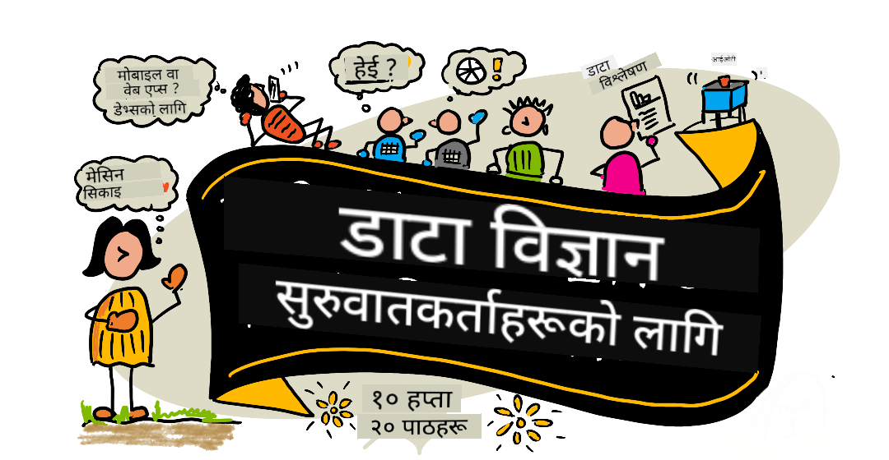

<!--
CO_OP_TRANSLATOR_METADATA:
{
  "original_hash": "210052dafe5b5d956c427824e2c96686",
  "translation_date": "2025-12-19T11:02:37+00:00",
  "source_file": "README.md",
  "language_code": "ne"
}
-->
# शुरुवातीहरूको लागि डाटा विज्ञान - एक पाठ्यक्रम

माइक्रोसफ्टका Azure क्लाउड एड्भोकेटहरूले डाटा विज्ञान सम्बन्धी १० हप्ता, २० पाठहरूको पाठ्यक्रम प्रदान गर्न पाउँदा खुशी छन्। प्रत्येक पाठमा पूर्व-पाठ र पश्चात-पाठ क्विजहरू, पाठ पूरा गर्न लेखिएका निर्देशनहरू, समाधान, र असाइनमेन्ट समावेश छन्। हाम्रो परियोजना-आधारित शिक्षण विधिले तपाईंलाई निर्माण गर्दै सिक्न अनुमति दिन्छ, जुन नयाँ सीपहरू 'टिकाउन' को लागि प्रमाणित तरिका हो।

**हाम्रो लेखकहरूलाई हार्दिक धन्यवाद:** [Jasmine Greenaway](https://www.twitter.com/paladique), [Dmitry Soshnikov](http://soshnikov.com), [Nitya Narasimhan](https://twitter.com/nitya), [Jalen McGee](https://twitter.com/JalenMcG), [Jen Looper](https://twitter.com/jenlooper), [Maud Levy](https://twitter.com/maudstweets), [Tiffany Souterre](https://twitter.com/TiffanySouterre), [Christopher Harrison](https://www.twitter.com/geektrainer).

**🙏 विशेष धन्यवाद 🙏 हाम्रो [Microsoft Student Ambassador](https://studentambassadors.microsoft.com/) लेखकहरू, समीक्षकहरू र सामग्री योगदानकर्ताहरूलाई,** विशेष गरी आर्यन अरोरा, [आदित्य गर्ग](https://github.com/AdityaGarg00), [अलोनद्रा सान्चेज](https://www.linkedin.com/in/alondra-sanchez-molina/), [अंकिता सिंह](https://www.linkedin.com/in/ankitasingh007), [अनुपम मिश्रा](https://www.linkedin.com/in/anupam--mishra/), [अर्पिता दास](https://www.linkedin.com/in/arpitadas01/), छैलबिहारी दुबे, [डिब्री नसोफोर](https://www.linkedin.com/in/dibrinsofor), [डिशिता भासिन](https://www.linkedin.com/in/dishita-bhasin-7065281bb), [मजद सफी](https://www.linkedin.com/in/majd-s/), [म्याक्स ब्लम](https://www.linkedin.com/in/max-blum-6036a1186/), [मिगुएल कोरेआ](https://www.linkedin.com/in/miguelmque/), [मोहम्मा इफ्तेखेर (इफ्टु) एब्ने जलाल](https://twitter.com/iftu119), [नवरीन तबस्सुम](https://www.linkedin.com/in/nawrin-tabassum), [रेमण्ड वाङ्सा पुत्रा](https://www.linkedin.com/in/raymond-wp/), [रोहित यादव](https://www.linkedin.com/in/rty2423), समृद्धि शर्मा, [सान्या सिन्हा](https://www.linkedin.com/mwlite/in/sanya-sinha-13aab1200),
[शीना नरुला](https://www.linkedin.com/in/sheena-narua-n/), [तौकीर अहमद](https://www.linkedin.com/in/tauqeerahmad5201/), योगेन्द्रसिंह पवार , [विदुषी गुप्ता](https://www.linkedin.com/in/vidushi-gupta07/), [जसलीन सोंधी](https://www.linkedin.com/in/jasleen-sondhi/)

||
|:---:|
| शुरुवातीहरूको लागि डाटा विज्ञान - _स्केचनोट द्वारा [@nitya](https://twitter.com/nitya)_ |

### 🌐 बहुभाषिक समर्थन

#### GitHub Action मार्फत समर्थित (स्वचालित र सधैं अद्यावधिक)

<!-- CO-OP TRANSLATOR LANGUAGES TABLE START -->
[Arabic](../ar/README.md) | [Bengali](../bn/README.md) | [Bulgarian](../bg/README.md) | [Burmese (Myanmar)](../my/README.md) | [Chinese (Simplified)](../zh/README.md) | [Chinese (Traditional, Hong Kong)](../hk/README.md) | [Chinese (Traditional, Macau)](../mo/README.md) | [Chinese (Traditional, Taiwan)](../tw/README.md) | [Croatian](../hr/README.md) | [Czech](../cs/README.md) | [Danish](../da/README.md) | [Dutch](../nl/README.md) | [Estonian](../et/README.md) | [Finnish](../fi/README.md) | [French](../fr/README.md) | [German](../de/README.md) | [Greek](../el/README.md) | [Hebrew](../he/README.md) | [Hindi](../hi/README.md) | [Hungarian](../hu/README.md) | [Indonesian](../id/README.md) | [Italian](../it/README.md) | [Japanese](../ja/README.md) | [Kannada](../kn/README.md) | [Korean](../ko/README.md) | [Lithuanian](../lt/README.md) | [Malay](../ms/README.md) | [Malayalam](../ml/README.md) | [Marathi](../mr/README.md) | [Nepali](./README.md) | [Nigerian Pidgin](../pcm/README.md) | [Norwegian](../no/README.md) | [Persian (Farsi)](../fa/README.md) | [Polish](../pl/README.md) | [Portuguese (Brazil)](../br/README.md) | [Portuguese (Portugal)](../pt/README.md) | [Punjabi (Gurmukhi)](../pa/README.md) | [Romanian](../ro/README.md) | [Russian](../ru/README.md) | [Serbian (Cyrillic)](../sr/README.md) | [Slovak](../sk/README.md) | [Slovenian](../sl/README.md) | [Spanish](../es/README.md) | [Swahili](../sw/README.md) | [Swedish](../sv/README.md) | [Tagalog (Filipino)](../tl/README.md) | [Tamil](../ta/README.md) | [Telugu](../te/README.md) | [Thai](../th/README.md) | [Turkish](../tr/README.md) | [Ukrainian](../uk/README.md) | [Urdu](../ur/README.md) | [Vietnamese](../vi/README.md)
<!-- CO-OP TRANSLATOR LANGUAGES TABLE END -->

**यदि तपाईं थप अनुवाद भाषाहरू समर्थन गर्न चाहनुहुन्छ भने, ती यहाँ सूचीबद्ध छन् [यहाँ](https://github.com/Azure/co-op-translator/blob/main/getting_started/supported-languages.md)**

#### हाम्रो समुदायमा सामेल हुनुहोस् 

हामीसँग Discord मा AI सँग सिक्ने श्रृंखला चलिरहेको छ, थप जान्न र हामीसँग सामेल हुन [Learn with AI Series](https://aka.ms/learnwithai/discord) मा १८ - ३० सेप्टेम्बर, २०२५ सम्म। तपाईंले डाटा विज्ञानका लागि GitHub Copilot प्रयोग गर्ने टिप्स र ट्रिक्स पाउनुहुनेछ।

# के तपाईं विद्यार्थी हुनुहुन्छ?

तलका स्रोतहरूबाट सुरु गर्नुहोस्:

- [विद्यार्थी हब पृष्ठ](https://docs.microsoft.com/en-gb/learn/student-hub?WT.mc_id=academic-77958-bethanycheum) यस पृष्ठमा, तपाईंले शुरुवाती स्रोतहरू, विद्यार्थी प्याकहरू र निःशुल्क प्रमाणपत्र भौचर प्राप्त गर्ने तरिकाहरू पाउनुहुनेछ। यो एउटा पृष्ठ हो जुन तपाईंले बुकमार्क गर्न र समय-समयमा जाँच गर्न चाहनुहुन्छ किनभने हामी सामग्री कम्तीमा मासिक रूपमा परिवर्तन गर्छौं।
- [Microsoft Learn Student Ambassadors](https://studentambassadors.microsoft.com?WT.mc_id=academic-77958-bethanycheum) विश्वव्यापी विद्यार्थी राजदूतहरूको समुदायमा सामेल हुनुहोस्, यो तपाईंको माइक्रोसफ्टमा प्रवेश गर्ने तरिका हुन सक्छ।

# सुरु गर्ने तरिका

## 📚 कागजातहरू

- **[स्थापना मार्गदर्शन](INSTALLATION.md)** - शुरुवातीहरूको लागि चरण-द्वारा-चरण सेटअप निर्देशनहरू
- **[प्रयोग मार्गदर्शन](USAGE.md)** - उदाहरणहरू र सामान्य कार्यप्रवाहहरू
- **[समस्या समाधान](TROUBLESHOOTING.md)** - सामान्य समस्याहरूका समाधानहरू
- **[योगदान गर्ने मार्गदर्शन](CONTRIBUTING.md)** - यस परियोजनामा कसरी योगदान गर्ने
- **[शिक्षकहरूको लागि](for-teachers.md)** - शिक्षण निर्देशन र कक्षा स्रोतहरू

## 👨‍🎓 विद्यार्थीहरूको लागि
> **पूर्ण शुरुवातीहरू**: डाटा विज्ञानमा नयाँ हुनुहुन्छ? हाम्रो [शुरुवाती मैत्री उदाहरणहरू](examples/README.md) बाट सुरु गर्नुहोस्! यी सरल, राम्रोसँग टिप्पणी गरिएको उदाहरणहरूले तपाईंलाई आधारभूत कुरा बुझ्न मद्दत गर्नेछन् पूर्ण पाठ्यक्रममा डुब्नु अघि।
> **[विद्यार्थीहरू](https://aka.ms/student-page)**: यो पाठ्यक्रम आफैं प्रयोग गर्न, सम्पूर्ण रिपो फोर्क गर्नुहोस् र आफ्नै अभ्यासहरू पूरा गर्नुहोस्, पूर्व-व्याख्यान क्विजबाट सुरु गर्दै। त्यसपछि व्याख्यान पढ्नुहोस् र बाँकी गतिविधिहरू पूरा गर्नुहोस्। समाधान कोड नक्कल गर्नुभन्दा पाठहरू बुझेर परियोजनाहरू सिर्जना गर्ने प्रयास गर्नुहोस्; तथापि, त्यो कोड प्रत्येक परियोजना-केन्द्रित पाठमा /solutions फोल्डरहरूमा उपलब्ध छ। अर्को विचार भनेको साथीहरूसँग अध्ययन समूह बनाउनु र सामग्री सँगै जानु हो। थप अध्ययनका लागि, हामी [Microsoft Learn](https://docs.microsoft.com/en-us/users/jenlooper-2911/collections/qprpajyoy3x0g7?WT.mc_id=academic-77958-bethanycheum) सिफारिस गर्छौं।

**छिटो सुरु:**
1. आफ्नो वातावरण सेटअप गर्न [स्थापना मार्गदर्शन](INSTALLATION.md) जाँच गर्नुहोस्
2. पाठ्यक्रमसँग कसरी काम गर्ने जान्न [प्रयोग मार्गदर्शन](USAGE.md) समीक्षा गर्नुहोस्
3. पाठ १ बाट सुरु गरी क्रमशः काम गर्नुहोस्
4. समर्थनका लागि हाम्रो [Discord समुदाय](https://aka.ms/ds4beginners/discord) मा सामेल हुनुहोस्

## 👩‍🏫 शिक्षकहरूको लागि

> **शिक्षकहरू**: हामीले यस पाठ्यक्रम कसरी प्रयोग गर्ने भन्ने केही सुझावहरू [समावेश गरेका छौं](for-teachers.md)। हामी तपाईंको प्रतिक्रिया [हाम्रो छलफल फोरममा](https://github.com/microsoft/Data-Science-For-Beginners/discussions) पाउन चाहन्छौं!

## टोलीसँग भेट्नुहोस्

**Gif द्वारा** [Mohit Jaisal](https://www.linkedin.com/in/mohitjaisal)
> 🎥 माथिको छविमा क्लिक गर्नुहोस् परियोजनाको बारेमा भिडियोका लागि जसले यसलाई सिर्जना गरेका छन्!

## शिक्षाशास्त्र

हामीले यस पाठ्यक्रम निर्माण गर्दा दुई शैक्षिक सिद्धान्तहरू छनोट गरेका छौं: यो परियोजना-आधारित हुनुपर्छ र यसमा बारम्बार क्विजहरू समावेश हुनुपर्छ। यस श्रृंखलाको अन्त्यसम्म, विद्यार्थीहरूले डाटा विज्ञानका आधारभूत सिद्धान्तहरू सिक्नेछन्, जसमा नैतिक अवधारणाहरू, डाटा तयारी, डाटासँग काम गर्ने विभिन्न तरिकाहरू, डाटा दृश्यांकन, डाटा विश्लेषण, डाटा विज्ञानका वास्तविक-विश्व प्रयोगहरू, र थप समावेश छन्।

थप रूपमा, कक्षाको अघि एक कम जोखिमको क्विजले विद्यार्थीलाई विषय सिक्नको लागि उद्देश्य निर्धारण गर्छ, जबकि कक्षापछि दोस्रो क्विजले थप सम्झनालाई सुनिश्चित गर्छ। यो पाठ्यक्रम लचिलो र रमाइलो बनाउन डिजाइन गरिएको हो र पूर्ण वा आंशिक रूपमा लिन सकिन्छ। परियोजनाहरू साना बाट सुरु हुन्छन् र १० हप्ताको चक्रको अन्त्यसम्म क्रमशः जटिल बन्दै जान्छन्।

> हाम्रो [आचार संहिता](CODE_OF_CONDUCT.md), [योगदान गर्ने तरिका](CONTRIBUTING.md), [अनुवाद](TRANSLATIONS.md) दिशानिर्देशहरू पत्ता लगाउनुहोस्। हामी तपाईंको रचनात्मक प्रतिक्रिया स्वागत गर्दछौं!

## प्रत्येक पाठमा समावेश छ:

- वैकल्पिक स्केचनोट
- वैकल्पिक पूरक भिडियो
- पाठ अघि तातो-तातो क्विज
- लिखित पाठ
- परियोजना-आधारित पाठहरूको लागि, परियोजना कसरी बनाउने भन्ने चरण-दर-चरण मार्गदर्शन
- ज्ञान जाँचहरू
- एउटा चुनौती
- पूरक पढाइ
- असाइनमेन्ट
- [पाठ पछि क्विज](https://ff-quizzes.netlify.app/en/)

> **क्विजहरूको बारेमा एउटा नोट**: सबै क्विजहरू Quiz-App फोल्डरमा समावेश छन्, जसमा प्रत्येकमा तीन प्रश्नहरू सहित कुल ४० क्विजहरू छन्। तिनीहरू पाठहरूबाट लिंक गरिएका छन्, तर क्विज एप स्थानीय रूपमा चलाउन वा Azure मा तैनाथ गर्न सकिन्छ; `quiz-app` फोल्डरमा निर्देशनहरू पालना गर्नुहोस्। तिनीहरू क्रमशः स्थानीयकरण हुँदैछन्।

## 🎓 शुरुवाती-मैत्री उदाहरणहरू

**डाटा विज्ञानमा नयाँ?** हामीले विशेष [उदाहरण निर्देशिका](examples/README.md) तयार पारेका छौं जसमा सरल, राम्रोसँग टिप्पणी गरिएको कोड छ जसले तपाईंलाई सुरु गर्न मद्दत गर्दछ:

- 🌟 **हेल्लो वर्ल्ड** - तपाईंको पहिलो डाटा विज्ञान कार्यक्रम
- 📂 **डाटा लोड गर्दै** - डेटासेटहरू पढ्न र अन्वेषण गर्न सिक्नुहोस्
- 📊 **सरल विश्लेषण** - तथ्याङ्क गणना गर्नुहोस् र ढाँचाहरू पत्ता लगाउनुहोस्
- 📈 **मूल दृश्यांकन** - चार्ट र ग्राफहरू सिर्जना गर्नुहोस्
- 🔬 **वास्तविक-विश्व परियोजना** - सुरु देखि अन्त्य सम्म पूर्ण कार्यप्रवाह

प्रत्येक उदाहरणमा प्रत्येक चरणको विस्तृत टिप्पणीहरू समावेश छन्, जसले यसलाई पूर्ण शुरुवातीहरूका लागि उपयुक्त बनाउँछ!

👉 **[उदाहरणहरूबाट सुरु गर्नुहोस्](examples/README.md)** 👈

## पाठहरू

||
|:---:|
| डाटा विज्ञानका लागि शुरुवातीहरू: रोडम्याप - _स्केचनोट द्वारा [@nitya](https://twitter.com/nitya)_ |

| पाठ संख्या | विषय | पाठ समूह | सिकाइ उद्देश्यहरू | लिंक गरिएको पाठ | लेखक |
| :-----------: | :----------------------------------------: | :--------------------------------------------------: | :-----------------------------------------------------------------------------------------------------------------------------------------------------------------------: | :---------------------------------------------------------------------: | :----: |
| ०१ | डाटा विज्ञानको परिभाषा | [परिचय](1-Introduction/README.md) | डाटा विज्ञानका आधारभूत अवधारणाहरू र यसले कसरी कृत्रिम बुद्धिमत्ता, मेसिन लर्निङ, र ठूलो डाटासँग सम्बन्ध राख्छ बुझ्नुहोस्। | [पाठ](1-Introduction/01-defining-data-science/README.md) [भिडियो](https://youtu.be/beZ7Mb_oz9I) | [Dmitry](http://soshnikov.com) |
| ०२ | डाटा विज्ञान नैतिकता | [परिचय](1-Introduction/README.md) | डाटा नैतिकता अवधारणाहरू, चुनौतीहरू र फ्रेमवर्कहरू। | [पाठ](1-Introduction/02-ethics/README.md) | [Nitya](https://twitter.com/nitya) |
| ०३ | डाटाको परिभाषा | [परिचय](1-Introduction/README.md) | डाटा कसरी वर्गीकृत हुन्छ र यसको सामान्य स्रोतहरू। | [पाठ](1-Introduction/03-defining-data/README.md) | [Jasmine](https://www.twitter.com/paladique) |
| ०४ | तथ्याङ्क र सम्भावनाको परिचय | [परिचय](1-Introduction/README.md) | डाटा बुझ्नको लागि सम्भावना र तथ्याङ्कका गणितीय प्रविधिहरू। | [पाठ](1-Introduction/04-stats-and-probability/README.md) [भिडियो](https://youtu.be/Z5Zy85g4Yjw) | [Dmitry](http://soshnikov.com) |
| ०५ | सम्बन्धित डाटासँग काम गर्दै | [डाटासँग काम गर्दै](2-Working-With-Data/README.md) | सम्बन्धित डाटाको परिचय र संरचित क्वेरी भाषा (SQL) प्रयोग गरेर सम्बन्धित डाटा अन्वेषण र विश्लेषणका आधारभूत कुरा। | [पाठ](2-Working-With-Data/05-relational-databases/README.md) | [Christopher](https://www.twitter.com/geektrainer) | | |
| ०६ | नोएसक्यूएल डाटासँग काम गर्दै | [डाटासँग काम गर्दै](2-Working-With-Data/README.md) | गैर-सम्बन्धित डाटाको परिचय, यसको विभिन्न प्रकारहरू र कागजात डाटाबेस अन्वेषण र विश्लेषणका आधारभूत कुरा। | [पाठ](2-Working-With-Data/06-non-relational/README.md) | [Jasmine](https://twitter.com/paladique)|
| ०७ | पाइथनसँग काम गर्दै | [डाटासँग काम गर्दै](2-Working-With-Data/README.md) | पाण्डास जस्ता पुस्तकालयहरूसँग डाटा अन्वेषणका लागि पाइथन प्रयोगका आधारभूत कुरा। पाइथन प्रोग्रामिङको आधारभूत बुझाइ सिफारिस गरिन्छ। | [पाठ](2-Working-With-Data/07-python/README.md) [भिडियो](https://youtu.be/dZjWOGbsN4Y) | [Dmitry](http://soshnikov.com) |
| ०८ | डाटा तयारी | [डाटासँग काम गर्दै](2-Working-With-Data/README.md) | हराएको, गलत, वा अपूर्ण डाटाको चुनौतीहरू सामना गर्न डाटा सफा गर्ने र रूपान्तरण गर्ने प्रविधिहरू। | [पाठ](2-Working-With-Data/08-data-preparation/README.md) | [Jasmine](https://www.twitter.com/paladique) |
| ०९ | मात्राहरूको दृश्यांकन | [डाटा दृश्यांकन](3-Data-Visualization/README.md) | म्याटप्लट्लिब प्रयोग गरेर चराको डाटा दृश्यांकन सिक्नुहोस् 🦆 | [पाठ](3-Data-Visualization/09-visualization-quantities/README.md) | [Jen](https://twitter.com/jenlooper) |
| १० | डाटाको वितरणहरूको दृश्यांकन | [डाटा दृश्यांकन](3-Data-Visualization/README.md) | अन्तराल भित्रका अवलोकन र प्रवृत्तिहरूको दृश्यांकन। | [पाठ](3-Data-Visualization/10-visualization-distributions/README.md) | [Jen](https://twitter.com/jenlooper) |
| ११ | अनुपातहरूको दृश्यांकन | [डाटा दृश्यांकन](3-Data-Visualization/README.md) | छुट्टै र समूहबद्ध प्रतिशतहरूको दृश्यांकन। | [पाठ](3-Data-Visualization/11-visualization-proportions/README.md) | [Jen](https://twitter.com/jenlooper) |
| १२ | सम्बन्धहरूको दृश्यांकन | [डाटा दृश्यांकन](3-Data-Visualization/README.md) | डाटाका सेटहरू र तिनीहरूको चरहरू बीचको सम्बन्ध र सहसंबन्धहरूको दृश्यांकन। | [पाठ](3-Data-Visualization/12-visualization-relationships/README.md) | [Jen](https://twitter.com/jenlooper) |
| १३ | अर्थपूर्ण दृश्यांकनहरू | [डाटा दृश्यांकन](3-Data-Visualization/README.md) | प्रभावकारी समस्या समाधान र अन्तर्दृष्टिका लागि तपाईंका दृश्यांकनहरूलाई मूल्यवान बनाउनका लागि प्रविधिहरू र मार्गदर्शन। | [पाठ](3-Data-Visualization/13-meaningful-visualizations/README.md) | [Jen](https://twitter.com/jenlooper) |
| १४ | डाटा विज्ञान जीवनचक्रको परिचय | [जीवनचक्र](4-Data-Science-Lifecycle/README.md) | डाटा विज्ञान जीवनचक्र र यसको पहिलो चरण डाटा प्राप्ति र निकासीको परिचय। | [पाठ](4-Data-Science-Lifecycle/14-Introduction/README.md) | [Jasmine](https://twitter.com/paladique) |
| १५ | विश्लेषण | [जीवनचक्र](4-Data-Science-Lifecycle/README.md) | डाटा विज्ञान जीवनचक्रको यो चरण डाटा विश्लेषणका प्रविधिहरूमा केन्द्रित छ। | [पाठ](4-Data-Science-Lifecycle/15-analyzing/README.md) | [Jasmine](https://twitter.com/paladique) | | |
| १६ | सञ्चार | [जीवनचक्र](4-Data-Science-Lifecycle/README.md) | डाटा विज्ञान जीवनचक्रको यो चरण डाटाबाट प्राप्त अन्तर्दृष्टिहरूलाई निर्णयकर्ताहरूले बुझ्न सजिलो हुने तरिकाले प्रस्तुत गर्नमा केन्द्रित छ। | [पाठ](4-Data-Science-Lifecycle/16-communication/README.md) | [Jalen](https://twitter.com/JalenMcG) | | |
| १७ | क्लाउडमा डाटा विज्ञान | [क्लाउड डाटा](5-Data-Science-In-Cloud/README.md) | क्लाउडमा डाटा विज्ञान र यसको फाइदाहरूको परिचय। | [पाठ](5-Data-Science-In-Cloud/17-Introduction/README.md) | [Tiffany](https://twitter.com/TiffanySouterre) र [Maud](https://twitter.com/maudstweets) |
| १८ | क्लाउडमा डाटा विज्ञान | [क्लाउड डाटा](5-Data-Science-In-Cloud/README.md) | लो कोड उपकरणहरू प्रयोग गरेर मोडेलहरू तालिम। |[पाठ](5-Data-Science-In-Cloud/18-Low-Code/README.md) | [Tiffany](https://twitter.com/TiffanySouterre) र [Maud](https://twitter.com/maudstweets) |
| १९ | क्लाउडमा डाटा विज्ञान | [क्लाउड डाटा](5-Data-Science-In-Cloud/README.md) | Azure Machine Learning Studio सँग मोडेलहरू तैनाथ गर्दै। | [पाठ](5-Data-Science-In-Cloud/19-Azure/README.md)| [Tiffany](https://twitter.com/TiffanySouterre) र [Maud](https://twitter.com/maudstweets) |
| २० | जंगलीमा डाटा विज्ञान | [जंगलीमा](6-Data-Science-In-Wild/README.md) | वास्तविक संसारमा डाटा विज्ञान प्रेरित परियोजनाहरू। | [पाठ](6-Data-Science-In-Wild/20-Real-World-Examples/README.md) | [Nitya](https://twitter.com/nitya) |

## GitHub Codespaces

यस नमूनालाई Codespace मा खोल्न यी चरणहरू पालना गर्नुहोस्:
१. कोड ड्रप-डाउन मेनुमा क्लिक गर्नुहोस् र Open with Codespaces विकल्प चयन गर्नुहोस्।
२. प्यानको तल + New codespace चयन गर्नुहोस्।
थप जानकारीका लागि, [GitHub कागजात](https://docs.github.com/en/codespaces/developing-in-codespaces/creating-a-codespace-for-a-repository#creating-a-codespace) हेर्नुहोस्।

## VSCode Remote - Containers
तपाईंको स्थानीय मेसिन र VSCode प्रयोग गरेर VS Code Remote - Containers एक्सटेन्सनको मद्दतले यो रिपोजिटरी कन्टेनरमा खोल्न यी चरणहरू पालना गर्नुहोस्:

१. यदि यो तपाईंको पहिलो पटक विकास कन्टेनर प्रयोग हो भने, कृपया सुनिश्चित गर्नुहोस् कि तपाईंको प्रणालीले पूर्व-आवश्यकताहरू पूरा गर्दछ (जस्तै Docker इन्स्टल गरिएको छ) [सुरु गर्ने कागजात](https://code.visualstudio.com/docs/devcontainers/containers#_getting-started) मा।

यो रिपोजिटरी प्रयोग गर्न, तपाईंले रिपोजिटरीलाई अलग Docker भोल्युममा खोल्न सक्नुहुन्छ:

**नोट**: भित्री रूपमा, यसले Remote-Containers: **Clone Repository in Container Volume...** कमाण्ड प्रयोग गरेर स्रोत कोडलाई स्थानीय फाइल सिस्टमको सट्टा Docker भोल्युममा क्लोन गर्नेछ। [भोल्युमहरू](https://docs.docker.com/storage/volumes/) कन्टेनर डाटा कायम राख्नको लागि प्राथमिक माध्यम हुन्।

वा स्थानीय रूपमा क्लोन गरिएको वा डाउनलोड गरिएको रिपोजिटरी खोल्नुहोस्:

- यो रिपोजिटरीलाई तपाईंको स्थानीय फाइल सिस्टममा क्लोन गर्नुहोस्।
- F1 थिच्नुहोस् र **Remote-Containers: Open Folder in Container...** कमाण्ड चयन गर्नुहोस्।
- यस फोल्डरको क्लोन गरिएको प्रतिलिपि चयन गर्नुहोस्, कन्टेनर सुरु हुन कुर्नुहोस्, र प्रयास गर्नुहोस्।

## अफलाइन पहुँच

तपाईं [Docsify](https://docsify.js.org/#/) प्रयोग गरेर यो कागजात अफलाइन चलाउन सक्नुहुन्छ। यो रिपो फोर्क गर्नुहोस्, [Docsify इन्स्टल गर्नुहोस्](https://docsify.js.org/#/quickstart) तपाईंको स्थानीय मेसिनमा, त्यसपछि यस रिपोको मूल फोल्डरमा `docsify serve` टाइप गर्नुहोस्। वेबसाइट तपाईंको लोकलहोस्टमा पोर्ट ३००० मा सेवा हुनेछ: `localhost:3000`।

> नोट, नोटबुकहरू Docsify मार्फत रेंडर हुँदैनन्, त्यसैले जब तपाईंलाई नोटबुक चलाउन आवश्यक हुन्छ, त्यसलाई अलग्गै VS Code मा Python कर्नेल चलाएर गर्नुहोस्।

## अन्य पाठ्यक्रमहरू

हाम्रो टोलीले अन्य पाठ्यक्रमहरू उत्पादन गर्दछ! हेर्नुहोस्:

<!-- CO-OP TRANSLATOR OTHER COURSES START -->
### LangChain

---

### Azure / Edge / MCP / Agents

---
 
### जनरेटिभ AI सिरिज

[-9333EA?style=for-the-badge&labelColor=E5E7EB&color=9333EA)](https://github.com/microsoft/Generative-AI-for-beginners-dotnet?WT.mc_id=academic-105485-koreyst)
[-C084FC?style=for-the-badge&labelColor=E5E7EB&color=C084FC)](https://github.com/microsoft/generative-ai-for-beginners-java?WT.mc_id=academic-105485-koreyst)
[-E879F9?style=for-the-badge&labelColor=E5E7EB&color=E879F9)](https://github.com/microsoft/generative-ai-with-javascript?WT.mc_id=academic-105485-koreyst)

---
 
### कोर सिकाइ

---
 
### कोपाइलट सिरिज

<!-- CO-OP TRANSLATOR OTHER COURSES END -->

## सहयोग पाउने

**समस्या आइरहेको छ?** सामान्य समस्याहरूको समाधानका लागि हाम्रो [समस्या समाधान मार्गदर्शिका](TROUBLESHOOTING.md) जाँच गर्नुहोस्।

यदि तपाईं अड्किनुभयो वा AI एपहरू निर्माण गर्ने बारे कुनै प्रश्न छ भने। MCP सम्बन्धी छलफलमा साथी सिक्नेहरू र अनुभवी विकासकर्ताहरूसँग सामेल हुनुहोस्। यो एक सहयोगी समुदाय हो जहाँ प्रश्नहरू स्वागतयोग्य छन् र ज्ञान स्वतन्त्र रूपमा साझा गरिन्छ।

यदि तपाईंलाई उत्पादन प्रतिक्रिया वा निर्माण गर्दा त्रुटिहरू छन् भने भ्रमण गर्नुहोस्:

---

<!-- CO-OP TRANSLATOR DISCLAIMER START -->
**अस्वीकरण**:
यो दस्तावेज AI अनुवाद सेवा [Co-op Translator](https://github.com/Azure/co-op-translator) प्रयोग गरी अनुवाद गरिएको हो। हामी शुद्धताका लागि प्रयासरत छौं, तर कृपया ध्यान दिनुहोस् कि स्वचालित अनुवादमा त्रुटि वा अशुद्धता हुन सक्छ। मूल दस्तावेज यसको मूल भाषामा आधिकारिक स्रोत मानिनुपर्छ। महत्वपूर्ण जानकारीका लागि व्यावसायिक मानव अनुवाद सिफारिस गरिन्छ। यस अनुवादको प्रयोगबाट उत्पन्न कुनै पनि गलतफहमी वा गलत व्याख्याका लागि हामी जिम्मेवार छैनौं।
<!-- CO-OP TRANSLATOR DISCLAIMER END -->