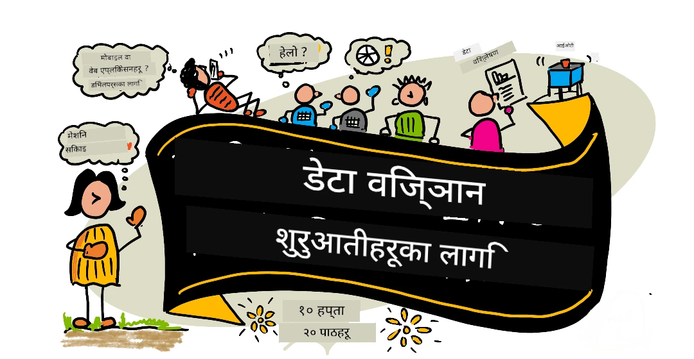
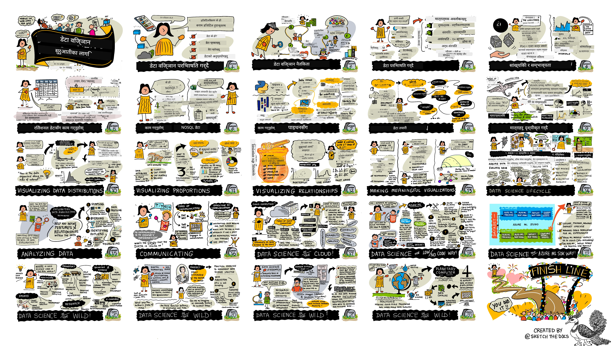

# बिगिनर्सका लागि डाटा साइन्स - एउटा पाठ्यक्रम

[](https://github.com/codespaces/new?hide_repo_select=true&ref=main&repo=344191198)

[](https://github.com/microsoft/Data-Science-For-Beginners/blob/master/LICENSE)
[](https://GitHub.com/microsoft/Data-Science-For-Beginners/graphs/contributors/)
[](https://GitHub.com/microsoft/Data-Science-For-Beginners/issues/)
[](https://GitHub.com/microsoft/Data-Science-For-Beginners/pulls/)
[](http://makeapullrequest.com)

[](https://GitHub.com/microsoft/Data-Science-For-Beginners/watchers/)
[](https://GitHub.com/microsoft/Data-Science-For-Beginners/network/)
[](https://GitHub.com/microsoft/Data-Science-For-Beginners/stargazers/)


[](https://discord.gg/nTYy5BXMWG)

[](https://aka.ms/foundry/forum)

माइक्रोसफ्टका Azure Cloud Advocates ले १० हप्ताको, २० पाठहरूको एक पाठ्यक्रम डाटा साइन्स सम्बन्धी उपलब्ध गराउन पाउँदा खुशी छ। प्रत्येक पाठमा पाठ अघि र पछि क्विजहरू, पाठ पूरा गर्न लेखिएका निर्देशनहरू, समाधान, र एक असाइनमेन्ट समावेश छन्। हाम्रो परियोजना-आधारित शिक्षण विधिले तपाईंलाई सिर्जना गर्दै सिक्न अनुमति दिन्छ, जुन नयाँ सीपहरू 'टिकाउने' एक प्रमाणित तरिका हो।

**हाम्रो लेखकहरूलाई हार्दिक धन्यवाद:** [Jasmine Greenaway](https://www.twitter.com/paladique), [Dmitry Soshnikov](http://soshnikov.com), [Nitya Narasimhan](https://twitter.com/nitya), [Jalen McGee](https://twitter.com/JalenMcG), [Jen Looper](https://twitter.com/jenlooper), [Maud Levy](https://twitter.com/maudstweets), [Tiffany Souterre](https://twitter.com/TiffanySouterre), [Christopher Harrison](https://www.twitter.com/geektrainer)।

**🙏 विशेष धन्यवाद 🙏 हाम्रो [Microsoft Student Ambassador](https://studentambassadors.microsoft.com/) लेखकहरू, समीक्षकहरू र सामग्री योगदानकर्ताहरूलाई,** विशेष गरी आर्यन अरोरा, [आदित्य गर्ग](https://github.com/AdityaGarg00), [एलोन्द्रा सान्चेज़](https://www.linkedin.com/in/alondra-sanchez-molina/), [अंकिता सिँह](https://www.linkedin.com/in/ankitasingh007), [अनुपम मिश्रा](https://www.linkedin.com/in/anupam--mishra/), [अर्पिता दास](https://www.linkedin.com/in/arpitadas01/), छैलबिहारी दुबे, [दिब्री नसोफोर](https://www.linkedin.com/in/dibrinsofor), [डिशिता भासिन](https://www.linkedin.com/in/dishita-bhasin-7065281bb), [मज्द सॉफी](https://www.linkedin.com/in/majd-s/), [म्याक्स ब्लम](https://www.linkedin.com/in/max-blum-6036a1186/), [मिगेल कोरेआ](https://www.linkedin.com/in/miguelmque/), [मोहम्मा इफ्तेहार (इफ्तु) अब्ने जलाल](https://twitter.com/iftu119), [नावरीन ताबस्सुम](https://www.linkedin.com/in/nawrin-tabassum), [रेमन्ड वाङ्सा पुत्रा](https://www.linkedin.com/in/raymond-wp/), [रोहित यादव](https://www.linkedin.com/in/rty2423), समृद्धि शर्मा, [सान्या सिन्हा](https://www.linkedin.com/mwlite/in/sanya-sinha-13aab1200),
[शीना नारुला](https://www.linkedin.com/in/sheena-narua-n/), [तौकीर अहमद](https://www.linkedin.com/in/tauqeerahmad5201/), योगेन्द्रसिंह पवार , [विदुषी गुप्ता](https://www.linkedin.com/in/vidushi-gupta07/), [जस्लिन सोन्धी](https://www.linkedin.com/in/jasleen-sondhi/)

||
|:---:|
| बिगिनर्सका लागि डाटा साइन्स - _स्केच नोट [@nitya](https://twitter.com/nitya) द्वारा_ |

### 🌐 बहुभाषी समर्थन

#### GitHub Action (स्वचालित र सधैं अद्यावधिक) बाट समर्थित

<!-- CO-OP TRANSLATOR LANGUAGES TABLE START -->
[Arabic](../ar/README.md) | [Bengali](../bn/README.md) | [Bulgarian](../bg/README.md) | [Burmese (Myanmar)](../my/README.md) | [Chinese (Simplified)](../zh-CN/README.md) | [Chinese (Traditional, Hong Kong)](../zh-HK/README.md) | [Chinese (Traditional, Macau)](../zh-MO/README.md) | [Chinese (Traditional, Taiwan)](../zh-TW/README.md) | [Croatian](../hr/README.md) | [Czech](../cs/README.md) | [Danish](../da/README.md) | [Dutch](../nl/README.md) | [Estonian](../et/README.md) | [Finnish](../fi/README.md) | [French](../fr/README.md) | [German](../de/README.md) | [Greek](../el/README.md) | [Hebrew](../he/README.md) | [Hindi](../hi/README.md) | [Hungarian](../hu/README.md) | [Indonesian](../id/README.md) | [Italian](../it/README.md) | [Japanese](../ja/README.md) | [Kannada](../kn/README.md) | [Khmer](../km/README.md) | [Korean](../ko/README.md) | [Lithuanian](../lt/README.md) | [Malay](../ms/README.md) | [Malayalam](../ml/README.md) | [Marathi](../mr/README.md) | [Nepali](./README.md) | [Nigerian Pidgin](../pcm/README.md) | [Norwegian](../no/README.md) | [Persian (Farsi)](../fa/README.md) | [Polish](../pl/README.md) | [Portuguese (Brazil)](../pt-BR/README.md) | [Portuguese (Portugal)](../pt-PT/README.md) | [Punjabi (Gurmukhi)](../pa/README.md) | [Romanian](../ro/README.md) | [Russian](../ru/README.md) | [Serbian (Cyrillic)](../sr/README.md) | [Slovak](../sk/README.md) | [Slovenian](../sl/README.md) | [Spanish](../es/README.md) | [Swahili](../sw/README.md) | [Swedish](../sv/README.md) | [Tagalog (Filipino)](../tl/README.md) | [Tamil](../ta/README.md) | [Telugu](../te/README.md) | [Thai](../th/README.md) | [Turkish](../tr/README.md) | [Ukrainian](../uk/README.md) | [Urdu](../ur/README.md) | [Vietnamese](../vi/README.md)

> **स्थानीय क्लोन गर्न मन छ?**
>
> यस रिपोजिटरीमा ५० भन्दा बढी भाषा अनुवादहरू छन् जसले डाउनलोड साइज धेरै बढाउँछ। अनुवादहरू बिना क्लोन गर्न sparse checkout प्रयोग गर्नुहोस्:
>
> **Bash / macOS / Linux:**
> ```bash
> git clone --filter=blob:none --sparse https://github.com/microsoft/Data-Science-For-Beginners.git
> cd Data-Science-For-Beginners
> git sparse-checkout set --no-cone '/*' '!translations' '!translated_images'
> ```
>
> **CMD (Windows):**
> ```cmd
> git clone --filter=blob:none --sparse https://github.com/microsoft/Data-Science-For-Beginners.git
> cd Data-Science-For-Beginners
> git sparse-checkout set --no-cone "/*" "!translations" "!translated_images"
> ```
>
> यसले तपाईंलाई पाठ्यक्रम पूरा गर्नको लागि आवश्यक सबै कुरा छिटो डाउनलोड गर्ने तरिका प्रदान गर्दछ।
<!-- CO-OP TRANSLATOR LANGUAGES TABLE END -->

**यदि तपाईंलाई थप अनुवाद भाषाहरू चाहिन्छ भने ती यहाँ सूचीकृत छन् [यहाँ](https://github.com/Azure/co-op-translator/blob/main/getting_started/supported-languages.md)**

#### हाम्रो समुदायमा सामेल हुनुहोस् 
[](https://discord.gg/nTYy5BXMWG)

हामीसँग डिसकॉर्डमा एक Learn with AI सिरीज चलिरहेको छ, थप जान्न र सामेल हुन यहाँ जानुहोस् [Learn with AI Series](https://aka.ms/learnwithai/discord) सेप्टेम्बर १८ - ३०, २०२५ सम्म। तपाईं GitHub Copilot डाटा साइन्सका लागि कसरी प्रयोग गर्ने टिप्स र ट्रिक्स पाउनु हुनेछ।


# के तपाईं विद्यार्थी हुनुहुन्छ?

तलका स्रोतहरूबाट सुरु गर्नुहोस्:

- [ विद्यार्थी हब पृष्ठ](https://docs.microsoft.com/en-gb/learn/student-hub?WT.mc_id=academic-77958-bethanycheum) यो पृष्ठमा, तपाईले बिगिनरका लागि स्रोतहरू, विद्यार्थी प्याक र नि:शुल्क प्रमाणपत्र भौचर प्राप्त गर्ने तरिकाहरू फेला पार्नुहुनेछ। यो एउटा पृष्ठ हो जुन तपाईंले पुस्तकचिन्ह लगाएर समय-समयमा हेर्नु पर्ने हुन्छ किनकि हामी कम्तिमा मासिक रूपमा सामग्री परिवर्तन गरिरहेका छौं।
- [Microsoft Learn Student Ambassadors](https://studentambassadors.microsoft.com?WT.mc_id=academic-77958-bethanycheum) विद्यार्थी एम्बेसेडरहरूको एक विश्वव्यापी समुदायमा सामेल हुनुहोस्, यो तपाईंलाई Microsoft मा प्रवेश गर्ने माध्यम हुन सक्छ।

# सुरु गर्ने

## 📚 डकुमेन्टेशन

- **[इन्स्टलेसन गाइड](INSTALLATION.md)** - बिगिनरहरूका लागि चरण-दर-चरण सेटअप निर्देशनहरू
- **[प्रयोग गाइड](USAGE.md)** - उदाहरणहरू र साझा कार्यप्रवाहहरू
- **[समस्या समाधान](TROUBLESHOOTING.md)** - सामान्य समस्याहरूका समाधानहरू
- **[योगदान गर्ने गाइड](CONTRIBUTING.md)** - यस प्रोजेक्टमा कसरी योगदान गर्ने
- **[शिक्षकहरूका लागि](for-teachers.md)** - शिक्षण निर्देशन र कक्षाकोठाका स्रोतहरू

## 👨‍🎓 विद्यार्थीहरूका लागि
> **पूर्ण बिगिनरहरू**: डाटा साइन्समा नयाँ हुनुहुन्छ? हाम्रो [बिगिनर मैत्री उदाहरणहरू](examples/README.md) बाट सुरु गर्नुहोस्! यी सरल, राम्ररी टिप्पणी गरिएका उदाहरणहरूले तपाईंलाई आधारभूत कुरा बुझ्न मद्दत गर्नेछन् र पाठ्यक्रममा पूर्ण रूपमा छिर्न अघि।
> **[विद्यार्थीहरू](https://aka.ms/student-page)**: यो पाठ्यक्रम आफैंले प्रयोग गर्न, सम्पूर्ण रिपो फोर्क गर्नुहोस् र अभ्यासहरू आफैं पूरा गर्नुहोस्, प्रारम्भमा प्रि-लेक्चर क्विजबाट सुरु गरेर। त्यसपछि लेक्चर पढ्नुहोस् र बाँकी गतिविधिहरू पूरा गर्नुहोस्। समाधान कोड नकल गरेर होइन, पाठहरू बुझेर परियोजनाहरू सिर्जना गर्ने प्रयास गर्नुहोस्; यो कोड प्रत्येक परियोजना-केन्द्रित पाठमा /solutions फोल्डरहरूमा उपलब्ध छ। अर्को विचारले तपाईं साथीहरूसँग अध्ययन समूह बनाएर सामग्री सँगै जानु पनि हो। थप अध्ययनका लागि हामी [Microsoft Learn](https://docs.microsoft.com/en-us/users/jenlooper-2911/collections/qprpajyoy3x0g7?WT.mc_id=academic-77958-bethanycheum) सिफारिस गर्छौं।

**छिटो सुरु:**
1. आफ्नो वातावरण सेटअप गर्न [इन्स्टलेसन गाइड](INSTALLATION.md) हेर्नुहोस्
2. पाठ्यक्रमसँग काम गर्न [प्रयोग गाइड](USAGE.md) समीक्षा गर्नुहोस्
3. पहिलो पाठ सुरु गर्नुहोस् र अनुक्रमिक रूपमा अघि बढ्नुहोस्
4. समर्थनको लागि हाम्रो [Discord समुदाय](https://aka.ms/ds4beginners/discord) मा सामेल हुनुहोस्

## 👩‍🏫 शिक्षकहरूका लागि
> **शिक्षकहरू**: हामीले [यो क्यूरिकुलम कसरी प्रयोग गर्ने भन्ने केही सुझावहरू समावेश गरेका छौं](for-teachers.md)। हामी तपाईंको प्रतिक्रिया [हाम्रो छलफल फोरममा](https://github.com/microsoft/Data-Science-For-Beginners/discussions) सुन्न चाहन्छौं!

## टोलीसँग परिचय

[](https://youtu.be/8mzavjQSMM4 "प्रमो भिडियो")

**गिफ** [मोहित जयसाल](https://www.linkedin.com/in/mohitjaisal) द्वारा

> 🎥 माथिको छविमा क्लिक गरेर यस परियोजना र यसलाई सिर्जना गर्ने व्यक्तिहरूको बारेमा भिडियो हेर्नुहोस्!

## पेडागोगी

हामीले यो क्यूरिकुलम निर्माण गर्दा दुई शैक्षिक सिद्धान्तहरू चयन गरेका छौं: यसलाई परियोजना-आधारित बनाउने र बारम्बार क्विजहरू समावेश गर्ने। यस श्रृंखला समाप्तिमा, विद्यार्थीहरूले डाटा विज्ञानका आधारभूत सिद्धान्तहरू सिक्नेछन्, जसमा नैतिक अवधारणाहरू, डाटा तयारी, विभिन्न तरिकाहरूले डाटासँग काम गर्ने, डाटा भिजुअलाइजेशन, डाटा विश्लेषण, डाटा विज्ञानका वास्तविक संसारका प्रयोगहरू, र थप समावेश छन्।

त्यसैगरी, कक्षाको अघि कम जोखिम भएका क्विजहरूले विद्यार्थीमा विषय सिक्ने मनसाय सेट गर्छन् भने कक्षा पछि दोस्रो क्विजले थप जानकारीलाई सुनिश्चित गर्छ। यो क्यूरिकुलम लचिलो र रमाइलो हुने गरी डिजाइन गरिएको छ र यसलाई पूर्ण रूपमा वा भागमा लिन सकिन्छ। परियोजनाहरू साना बाट सुरु भएर १० हप्ता को चक्रको अन्त्य सम्म क्रमशः जटिल हुन्छन्।

> हाम्रो [आचार संहिता](CODE_OF_CONDUCT.md), [योगदान गर्ने निर्देशिका](CONTRIBUTING.md), [अनुवाद निर्देशनहरू](TRANSLATIONS.md) फेला पार्नुहोस्। हामी तपाईंको रचनात्मक प्रतिक्रिया स्वागत गर्दछौं!

## प्रत्येक पाठमा समावेश छन्:

- वैकल्पिक स्केचनोट
- वैकल्पिक पूरक भिडियो
- कक्षाको पूर्वमा वार्मअप क्विज
- लेखिएको पाठ
- परियोजना-आधारित पाठहरूको लागि, परियोजना कसरी बनाउने चरण-दर-चरण मार्गदर्शन
- ज्ञान जाँचहरू
- एउटा चुनौती
- पूरक पढाइ
- असाइनमेन्ट
- [पाठपछि क्विज](https://ff-quizzes.netlify.app/en/)

> **क्विजहरू बारे नोट**: सबै क्विजहरू Quiz-App फोल्डरमा छन्, प्रति क्विज  तीन प्रश्न सहित ४० क्विजहरू कुल। ती पाठहरूबाट लिंक गरिएको छ, तर क्विज एप स्थानीय रूपमा चलाउन सकिन्छ वा Azure मा तैनाथ गर्न सकिन्छ; `quiz-app` फोल्डरको निर्देशनहरू पछ्याउनुहोस्। ती क्रमशः स्थानीय भाषामा अनुवाद भइरहेको छ।

## 🎓 शुरुवाती मित्रवत उदाहरणहरू

**डाटा विज्ञानमा नयाँ?** हामीले सजिलो र राम्ररी टिप्पणी गरिएको कोड सहित विशेष [उदाहरणहरू निर्देशिका](examples/README.md) तयार पारेका छौं जसले तपाईंलाई सुरु गर्न मद्दत गर्नेछ:

- 🌟 **हेल्लो वर्ल्ड** - तपाईंको पहिलो डाटा विज्ञान प्रोग्राम
- 📂 **डाटा लोड गर्दै** - डाटासेटहरू पढ्ने र अन्वेषण गर्ने सिक्नुहोस्
- 📊 **सरल विश्लेषण** - तथ्यांक गणना गर्नुहोस् र ढाँचाहरू पत्ता लगाउनुहोस्
- 📈 **मूलभूत भिजुअलाइजेशन** - चार्ट र ग्राफहरू बनाउन
- 🔬 **वास्तविक परियोजना** - सुरु देखि अन्त सम्म पूर्ण कार्यप्रवाह

प्रत्येक उदाहरणमा प्रत्येक चरण स्पष्ट गर्ने विस्तृत टिप्पणीहरू छन्, जसले यसलाई पूर्ण नयाँ विद्यार्थीहरूका लागि उपयुक्त बनाउँछ!

👉 **[उदाहरणहरूबाट सुरु गर्नुहोस्](examples/README.md)** 👈

## पाठहरू


||
|:---:|
| शुरुवातीहरूको लागि डाटा विज्ञान: रोडम्याप - _[@nitya](https://twitter.com/nitya) द्वारा स्केचनोट_ |


| पाठ नम्बर | विषय | पाठ समूह | सिकाइ उद्देश्यहरू | लिंक गरिएको पाठ | लेखक |
| :-----------: | :----------------------------------------: | :--------------------------------------------------: | :-----------------------------------------------------------------------------------------------------------------------------------------------------------------------: | :---------------------------------------------------------------------: | :----: |
| ०१ | डेटा विज्ञानको परिभाषा | [परिचय](1-Introduction/README.md) | डेटा विज्ञानका आधारभूत अवधारणाहरू सिक्नुहोस् र यो कसरी कृत्रिम बुद्धिमत्ता, मेसिन लर्निङ, र ठूला डाटासँग सम्बन्धित छ भन्ने बुझ्नुहोस्। | [पाठ](1-Introduction/01-defining-data-science/README.md) [भिडियो](https://youtu.be/beZ7Mb_oz9I) | [दिमित्रि](http://soshnikov.com) |
| ०२ | डाटा विज्ञान नैतिकता | [परिचय](1-Introduction/README.md) | डाटा नैतिकता अवधारणाहरू, चुनौतीहरू र फ्रेमवर्कहरू। | [पाठ](1-Introduction/02-ethics/README.md) | [नित्य](https://twitter.com/nitya) |
| ०३ | डेटा परिभाषित गर्दै | [परिचय](1-Introduction/README.md) | डेटा कसरी वर्गीकृत हुन्छ र यसको सामान्य स्रोतहरू। | [पाठ](1-Introduction/03-defining-data/README.md) | [जास्मिन](https://www.twitter.com/paladique) |
| ०४ | तथ्यांक र सम्भाव्यताको परिचय | [परिचय](1-Introduction/README.md) | डाटालाई बुझ्नका लागि सम्भाव्यता र तथ्यांकका गणितीय प्रविधिहरू। | [पाठ](1-Introduction/04-stats-and-probability/README.md) [भिडियो](https://youtu.be/Z5Zy85g4Yjw) | [दिमित्रि](http://soshnikov.com) |
| ०५ | रिलेशनल डाटासँग काम गर्दै | [डेटासँग काम गर्दै](2-Working-With-Data/README.md) | रिलेशनल डाटाको परिचय र संरचित क्वेरी भाषा (SQL) प्रयोग गरेर रिलेशनल डाटा अन्वेषण र विश्लेषणका आधारहरू। | [पाठ](2-Working-With-Data/05-relational-databases/README.md) | [क्रिस्टोफर](https://www.twitter.com/geektrainer) | | |
| ०६ | नोएसक्यूएल डेटासँग काम गर्दै | [डेटासँग काम गर्दै](2-Working-With-Data/README.md) | गैर-रिलेशनल डाटाको परिचय, यसको विभिन्न प्रकारहरू र कागजात डाटाबेसहरूको अन्वेषण र विश्लेषणका आधारहरू। | [पाठ](2-Working-With-Data/06-non-relational/README.md) | [जास्मिन](https://twitter.com/paladique)|
| ०७ | पाइथन प्रयोग गर्दै | [डेटासँग काम गर्दै](2-Working-With-Data/README.md) | Pandas जस्ता पुस्तकालयहरूसँग डाटा अन्वेषण गर्न पाइथनको आधारभूत प्रयोग। पाइथन प्रोग्रामिङ्गको आधारभूत बुझाइ सिफारिस गरिन्छ। | [पाठ](2-Working-With-Data/07-python/README.md) [भिडियो](https://youtu.be/dZjWOGbsN4Y) | [दिमित्रि](http://soshnikov.com) |
| ०८ | डाटा तयारी | [डेटासँग काम गर्दै](2-Working-With-Data/README.md) | हराएको, गलत, वा अपूरो डेटा सामना गर्न सफा गर्ने र रूपान्तरण गर्ने डाटा प्रविधिहरू। | [पाठ](2-Working-With-Data/08-data-preparation/README.md) | [जास्मिन](https://www.twitter.com/paladique) |
| ०९ | मात्राहरूको दृश्यलेखन | [डाटा भिजुअलाइजेशन](3-Data-Visualization/README.md) | Matplotlib प्रयोग गरेर चराचुरुङ्गी डेटा भिजुअलाइज गर्ने सिक्नुहोस् 🦆 | [पाठ](3-Data-Visualization/09-visualization-quantities/README.md) | [जेन](https://twitter.com/jenlooper) |
| १० | डाटाको वितरण भिजुअलाइज गर्दै | [डाटा भिजुअलाइजेशन](3-Data-Visualization/README.md) | अन्तराल भित्र अवलोकन र प्रवृत्तिहरूको दृश्यलेखन। | [पाठ](3-Data-Visualization/10-visualization-distributions/README.md) | [जेन](https://twitter.com/jenlooper) |
| ११ | अंशहरू भिजुअलाइज गर्दै | [डाटा भिजुअलाइजेशन](3-Data-Visualization/README.md) | पृथक र समूहीकृत प्रतिशतहरू भिजुअलाइज गर्दै। | [पाठ](3-Data-Visualization/11-visualization-proportions/README.md) | [जेन](https://twitter.com/jenlooper) |
| १२ | सम्बन्धहरू भिजुअलाइज गर्दै | [डाटा भिजुअलाइजेशन](3-Data-Visualization/README.md) | डाटाका सेटहरू र तिनका चलहरूबीचको सम्बन्ध र सहसम्बन्धहरू भिजुअलाइज गर्दै। | [पाठ](3-Data-Visualization/12-visualization-relationships/README.md) | [जेन](https://twitter.com/jenlooper) |
| १३ | महत्वपूर्ण दृश्यलेखनहरू | [डाटा भिजुअलाइजेशन](3-Data-Visualization/README.md) | प्रभावकारी समस्या समाधान र अन्तर्दृष्टिका लागि तपाईंको भिजुअलाइजेशनहरूलाई मूल्यवान बनाउन प्रविधिहरू र मार्गदर्शन। | [पाठ](3-Data-Visualization/13-meaningful-visualizations/README.md) | [जेन](https://twitter.com/jenlooper) |
| १४ | डाटा विज्ञान जीवनचक्र परिचय | [जीवनचक्र](4-Data-Science-Lifecycle/README.md) | डाटा विज्ञान जीवनचक्र र डाटा प्राप्ति तथा निष्कर्षणको पहिलो चरणको परिचय। | [पाठ](4-Data-Science-Lifecycle/14-Introduction/README.md) | [जास्मिन](https://twitter.com/paladique) |
| १५ | विश्लेषण गर्दै | [जीवनचक्र](4-Data-Science-Lifecycle/README.md) | डाटा विज्ञान जीवनचक्रको यस चरणले डाटाको विश्लेषण गर्ने प्रविधिहरूमा केन्द्रित छ। | [पाठ](4-Data-Science-Lifecycle/15-analyzing/README.md) | [जास्मिन](https://twitter.com/paladique) | | |
| १६ | संचार | [जीवनचक्र](4-Data-Science-Lifecycle/README.md) | यस चरणले डाटाबाट निस्किएका अन्तर्दृष्टिहरूलाई निर्णयकर्ता लाई बुझ्न सजिलो गर्ने तरिकाले प्रस्तुत गर्नमा केन्द्रित छ। | [पाठ](4-Data-Science-Lifecycle/16-communication/README.md) | [जालेन](https://twitter.com/JalenMcG) | | |
| १७ | क्लाउडमा डाटा विज्ञान | [क्लाउड डेटा](5-Data-Science-In-Cloud/README.md) | यस श्रृंखलाले क्लाउडमा डाटा विज्ञान र यसको लाभ परिचय गराउँछ। | [पाठ](5-Data-Science-In-Cloud/17-Introduction/README.md) | [टिफ़नी](https://twitter.com/TiffanySouterre) र [मौड](https://twitter.com/maudstweets) |
| १८ | क्लाउडमा डाटा विज्ञान | [क्लाउड डेटा](5-Data-Science-In-Cloud/README.md) | Low Code उपकरणहरू प्रयोग गरेर मोडेल प्रशिक्षण। |[पाठ](5-Data-Science-In-Cloud/18-Low-Code/README.md) | [टिफ़नी](https://twitter.com/TiffanySouterre) र [मौड](https://twitter.com/maudstweets) |
| १९ | क्लाउडमा डाटा विज्ञान | [क्लाउड डेटा](5-Data-Science-In-Cloud/README.md) | Azure Machine Learning Studio प्रयोग गरी मोडेलहरू तैनाथ गर्दै। | [पाठ](5-Data-Science-In-Cloud/19-Azure/README.md)| [टिफ़नी](https://twitter.com/TiffanySouterre) र [मौड](https://twitter.com/maudstweets) |
| २० | डाटा विज्ञान जंगलीमा | [जंगलीमा](6-Data-Science-In-Wild/README.md) | वास्तविक संसारमा डाटा विज्ञान सञ्चालित परियोजनाहरू। | [पाठ](6-Data-Science-In-Wild/20-Real-World-Examples/README.md) | [नित्य](https://twitter.com/nitya) |

## GitHub कोडस्पेसेस

यो नमुना कोडस्पेसमा खोल्न यी कदमहरू पछ्याउनुहोस्:
1. कोड ड्रपडाउन मेनु क्लिक गरी Open with Codespaces विकल्प चयन गर्नुहोस्।
2. तल प्यानमा + नयाँ कोडस्पेस चयन गर्नुहोस्।
थप जानकारीको लागि, [GitHub कागजात](https://docs.github.com/en/codespaces/developing-in-codespaces/creating-a-codespace-for-a-repository#creating-a-codespace) हेर्नुहोस्।

## VSCode रिमोट - कन्टेनरहरू
तपाईंको स्थानीय मेसिन र VSCode प्रयोग गरी यस रिपोजिटोरीलाई कन्टेनरमा खोल्न VS Code Remote - Containers विस्तार प्रयोग गर्ने यी चरणहरू पछ्याउनुहोस्:

1. यदि यो तपाईंको पहिलो पटक विकास कन्टेनर प्रयोग गर्नु हो भने, कृपया सुनिश्चित गर्नुहोस् कि तपाईंको प्रणाली आवश्यकताहरू पूरा गर्छ (जस्तै Docker स्थापना गरिएको छ) [शुरू गर्ने कागजात](https://code.visualstudio.com/docs/devcontainers/containers#_getting-started) मा।

यस रिपोजिटोरी प्रयोग गर्न, तपाईंले वा त रिपोजिटोरीलाई पृथक Docker भोल्युममा खोल्न सक्नुहुन्छ:

**नोट**: पृष्ठभूमिमा, यसले Remote-Containers: **Clone Repository in Container Volume...** आदेश प्रयोग गरेर स्रोत कोडलाई स्थानीय फाइल प्रणालीको सट्टा Docker भोल्युममा क्लोन गर्दछ। [भोल्युमहरू](https://docs.docker.com/storage/volumes/) कन्टेनर डेटा जोगाउन प्राथमिक माध्यम हुन्।

वा स्थानीय क्लोन गरिएको वा डाउनलोड गरिएको संस्करण खोल्नुहोस्:

- यस रिपोजिटोरीलाई स्थानीय फाइल सिस्टममा क्लोन गर्नुहोस्।
- F1 थिचेर **Remote-Containers: Open Folder in Container...** आदेश चयन गर्नुहोस्।
- यस फोल्डरको क्लोन गरिएको प्रतिलिपि चयन गर्नुहोस्, कन्टेनर सुरू हुने कुराको प्रतीक्षा गर्नुहोस्, र प्रयोग गरिरहनुहोस्।

## अफलाइन पहुँच

तपाईँ [Docsify](https://docsify.js.org/#/) प्रयोग गरेर यो कागजात अफलाइन चलाउन सक्नुहुन्छ। यो रिपोजिटोरी फोर्क गर्नुहोस्, [Docsify स्थापना गर्नुहोस्](https://docsify.js.org/#/quickstart) तपाईंको स्थानीय मेसिनमा, त्यसपछि यस रिपोको मूल फोल्डरमा `docsify serve` टाइप गर्नुहोस्। वेबसाइट तपाईंको स्थानीयहोस्टमा पोर्ट ३००० मा सेवा हुनेछ: `localhost:3000`।

> नोट गर्नुहोस्, नोटबुकहरू Docsify मार्फत रन्डर हुँदैनन्, त्यसैले जब नोटबुक चलाउनु पर्छ, त्यो पाइथन कर्नेल चलाइरहेको VS Code मा अलगै गर्नुहोस्।

## अन्य पाठ्यक्रमहरू

हाम्रो टोलीले अन्य पाठ्यक्रमहरू उत्पादन गर्छ! हेर्नुहोस्:

<!-- CO-OP TRANSLATOR OTHER COURSES START -->
### LangChain
[](https://aka.ms/langchain4j-for-beginners)
[](https://aka.ms/langchainjs-for-beginners?WT.mc_id=m365-94501-dwahlin)
[](https://github.com/microsoft/langchain-for-beginners?WT.mc_id=m365-94501-dwahlin)
---

### Azure / Edge / MCP / Agents
[](https://github.com/microsoft/AZD-for-beginners?WT.mc_id=academic-105485-koreyst)
[](https://github.com/microsoft/edgeai-for-beginners?WT.mc_id=academic-105485-koreyst)
[](https://github.com/microsoft/mcp-for-beginners?WT.mc_id=academic-105485-koreyst)
[](https://github.com/microsoft/ai-agents-for-beginners?WT.mc_id=academic-105485-koreyst)

---
 
### Generative AI Series
[](https://github.com/microsoft/generative-ai-for-beginners?WT.mc_id=academic-105485-koreyst)
[-9333EA?style=for-the-badge&labelColor=E5E7EB&color=9333EA)](https://github.com/microsoft/Generative-AI-for-beginners-dotnet?WT.mc_id=academic-105485-koreyst)
[-C084FC?style=for-the-badge&labelColor=E5E7EB&color=C084FC)](https://github.com/microsoft/generative-ai-for-beginners-java?WT.mc_id=academic-105485-koreyst)
[-E879F9?style=for-the-badge&labelColor=E5E7EB&color=E879F9)](https://github.com/microsoft/generative-ai-with-javascript?WT.mc_id=academic-105485-koreyst)

---
 
### Core Learning
[](https://aka.ms/ml-beginners?WT.mc_id=academic-105485-koreyst)
[](https://aka.ms/datascience-beginners?WT.mc_id=academic-105485-koreyst)
[](https://aka.ms/ai-beginners?WT.mc_id=academic-105485-koreyst)
[](https://github.com/microsoft/Security-101?WT.mc_id=academic-96948-sayoung)
[](https://aka.ms/webdev-beginners?WT.mc_id=academic-105485-koreyst)
[](https://aka.ms/iot-beginners?WT.mc_id=academic-105485-koreyst)
[](https://github.com/microsoft/xr-development-for-beginners?WT.mc_id=academic-105485-koreyst)

---
 
### Copilot Series
[](https://aka.ms/GitHubCopilotAI?WT.mc_id=academic-105485-koreyst)
[](https://github.com/microsoft/mastering-github-copilot-for-dotnet-csharp-developers?WT.mc_id=academic-105485-koreyst)
[](https://github.com/microsoft/CopilotAdventures?WT.mc_id=academic-105485-koreyst)
<!-- CO-OP TRANSLATOR OTHER COURSES END -->

## सहायता प्राप्त गर्दै

**समस्या आइरहेको छ?** सामान्य समस्याहरूको समाधानको लागि हाम्रो [त्रुटि समाधान मार्गदर्शन](TROUBLESHOOTING.md) हेर्नुहोस्।

यदि तपाईं अड्किदै हुनुहुन्छ वा एआई अनुप्रयोगहरू निर्माण सम्बन्धी कुनै प्रश्न छ भने। MCP सम्बन्धी छलफलमा अरू सिक्नेहरू र अनुभवी विकासकर्ताहरूलाई सामेल हुनुहोस्। यो एउटा सहयोगात्मक समुदाय हो जहाँ प्रश्नहरू स्वागतयोग्य छन् र ज्ञान स्वतन्त्र रूपमा साझा गरिन्छ।

[](https://discord.gg/nTYy5BXMWG)

यदि तपाईंलाई उत्पादन प्रतिक्रिया वा निर्माण गर्दा त्रुटिहरू छन् भने भ्रमण गर्नुहोस्:

[](https://aka.ms/foundry/forum)

---

<!-- CO-OP TRANSLATOR DISCLAIMER START -->
**अस्वीकरण**:  
यो दस्तावेज AI अनुवाद सेवा [Co-op Translator](https://github.com/Azure/co-op-translator) प्रयोग गरेर अनुवाद गरिएको हो। यद्यपि हामी शुद्धताका लागि प्रयासरत छौं, कृपया जानकार हुनुहोस् कि स्वचालित अनुवादमा त्रुटिहरू वा अनिश्चितताहरू हुन सक्छन्। मूल दस्तावेजलाई यसको आफ्नै भाषा मा प्रामाणिक स्रोत मानिनु पर्छ। महत्वपूर्ण जानकारीका लागि, व्यावसायिक मानव अनुवाद सिफारिश गरिन्छ। यस अनुवादको प्रयोगबाट उत्पन्न हुने कुनै पनि गलतफहमी वा व्याख्याको जिम्मेवारी हामीमा पर्दैन।
<!-- CO-OP TRANSLATOR DISCLAIMER END -->