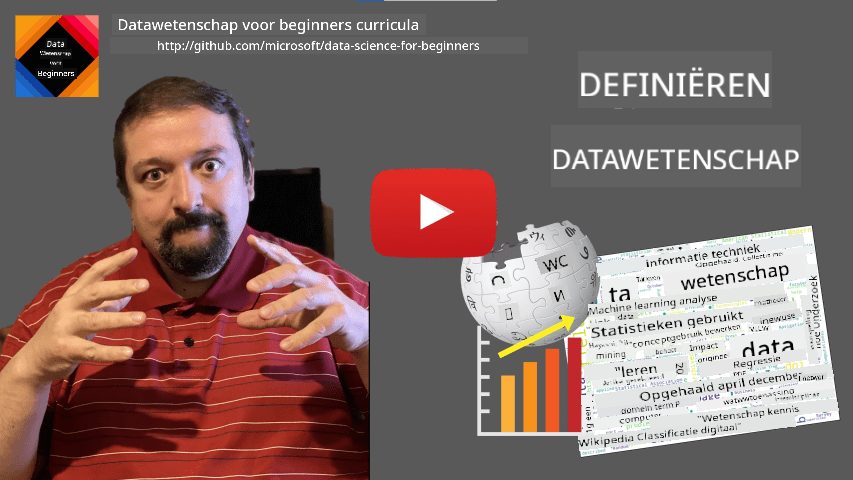
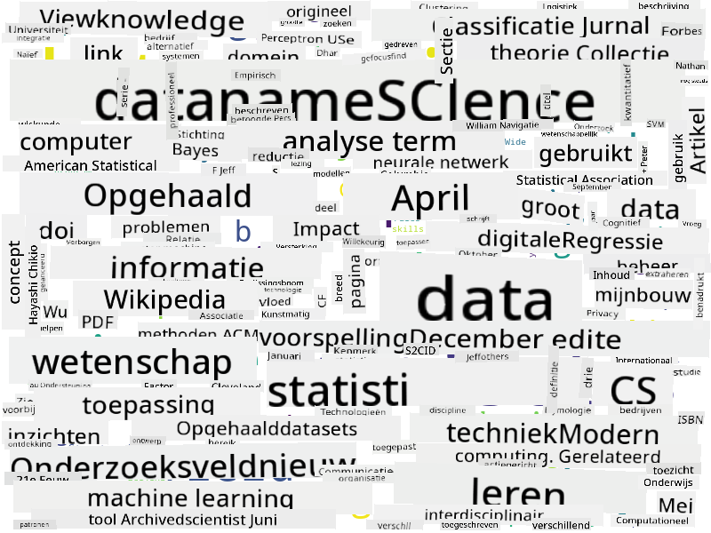

<!--
CO_OP_TRANSLATOR_METADATA:
{
  "original_hash": "2583a9894af7123b2fcae3376b14c035",
  "translation_date": "2025-08-28T15:49:21+00:00",
  "source_file": "1-Introduction/01-defining-data-science/README.md",
  "language_code": "nl"
}
-->
# Definiëren van Data Science

|  ](../../sketchnotes/01-Definitions.png) |
| :----------------------------------------------------------------------------------------------------: |
|              Definiëren van Data Science - _Sketchnote door [@nitya](https://twitter.com/nitya)_       |

---

## [Quiz voorafgaand aan de les](https://purple-hill-04aebfb03.1.azurestaticapps.net/quiz/0)

## Wat is Data?
In ons dagelijks leven worden we voortdurend omringd door data. De tekst die je nu leest is data. De lijst met telefoonnummers van je vrienden in je smartphone is data, net als de huidige tijd die op je horloge wordt weergegeven. Als mensen werken we van nature met data door bijvoorbeeld geld te tellen of brieven te schrijven aan vrienden.

Data werd echter veel belangrijker met de komst van computers. De primaire rol van computers is het uitvoeren van berekeningen, maar ze hebben data nodig om mee te werken. Daarom moeten we begrijpen hoe computers data opslaan en verwerken.

Met de opkomst van het internet is de rol van computers als apparaten voor gegevensverwerking toegenomen. Als je erover nadenkt, gebruiken we computers nu steeds meer voor gegevensverwerking en communicatie, in plaats van voor daadwerkelijke berekeningen. Wanneer we een e-mail schrijven aan een vriend of informatie opzoeken op internet, zijn we in feite bezig met het creëren, opslaan, verzenden en manipuleren van data.
> Kun je je de laatste keer herinneren dat je een computer hebt gebruikt om echt iets te berekenen?

## Wat is Data Science?

Volgens [Wikipedia](https://en.wikipedia.org/wiki/Data_science) wordt **Data Science** gedefinieerd als *een wetenschappelijk vakgebied dat wetenschappelijke methoden gebruikt om kennis en inzichten te halen uit gestructureerde en ongestructureerde data, en deze kennis en toepasbare inzichten uit data toe te passen in een breed scala aan toepassingsdomeinen*.

Deze definitie benadrukt de volgende belangrijke aspecten van data science:

* Het hoofddoel van data science is **kennis halen** uit data, met andere woorden - **data begrijpen**, verborgen relaties vinden en een **model** bouwen.
* Data science maakt gebruik van **wetenschappelijke methoden**, zoals kansberekening en statistiek. Toen de term *data science* voor het eerst werd geïntroduceerd, beweerden sommigen dat het slechts een nieuwe, hippe naam voor statistiek was. Tegenwoordig is het duidelijk dat het vakgebied veel breder is.
* De verkregen kennis moet worden toegepast om **bruikbare inzichten** te produceren, dat wil zeggen praktische inzichten die je kunt toepassen in echte zakelijke situaties.
* We moeten kunnen werken met zowel **gestructureerde** als **ongestructureerde** data. Later in de cursus zullen we terugkomen op de verschillende soorten data.
* Het **toepassingsdomein** is een belangrijk concept, en datawetenschappers hebben vaak enige mate van expertise nodig in het probleemgebied, bijvoorbeeld: financiën, geneeskunde, marketing, enz.

> Een ander belangrijk aspect van Data Science is dat het bestudeert hoe data kan worden verzameld, opgeslagen en verwerkt met behulp van computers. Terwijl statistiek ons de wiskundige basis geeft, past data science wiskundige concepten toe om daadwerkelijk inzichten uit data te halen.

Een van de manieren (toegeschreven aan [Jim Gray](https://en.wikipedia.org/wiki/Jim_Gray_(computer_scientist))) om naar data science te kijken, is door het te beschouwen als een apart wetenschappelijk paradigma:
* **Empirisch**, waarbij we voornamelijk vertrouwen op observaties en resultaten van experimenten
* **Theoretisch**, waar nieuwe concepten voortkomen uit bestaande wetenschappelijke kennis
* **Computationeel**, waar we nieuwe principes ontdekken op basis van computationele experimenten
* **Data-gedreven**, gebaseerd op het ontdekken van relaties en patronen in de data  

## Andere Gerelateerde Vakgebieden

Omdat data overal aanwezig is, is data science zelf ook een breed vakgebied dat veel andere disciplines raakt.

## Soorten Data

Zoals we al hebben genoemd, is data overal. We hoeven het alleen maar op de juiste manier vast te leggen! Het is nuttig om onderscheid te maken tussen **gestructureerde** en **ongestructureerde** data. De eerste wordt meestal weergegeven in een goed gestructureerde vorm, vaak als een tabel of een aantal tabellen, terwijl de laatste gewoon een verzameling bestanden is. Soms spreken we ook over **semi-gestructureerde** data, die een bepaalde structuur hebben die sterk kan variëren.

| Gestructureerd                                                              | Semi-gestructureerd                                                                           | Ongestructureerd                        |
| ---------------------------------------------------------------------------- | --------------------------------------------------------------------------------------------- | --------------------------------------- |
| Lijst van mensen met hun telefoonnummers                                    | Wikipedia-pagina's met links                                                                  | Tekst van de Encyclopaedia Britannica   |
| Temperatuur in alle kamers van een gebouw, elke minuut van de afgelopen 20 jaar | Verzameling wetenschappelijke artikelen in JSON-formaat met auteurs, publicatiedatum en samenvatting | Bestandsdeling met bedrijfsdocumenten   |
| Gegevens over leeftijd en geslacht van alle mensen die het gebouw binnenkomen | Internetpagina's                                                                              | Ruwe videobeelden van een bewakingscamera |

## Waar Data te Vinden

Er zijn veel mogelijke bronnen van data, en het is onmogelijk om ze allemaal op te sommen! Laten we echter enkele typische plaatsen noemen waar je data kunt vinden:

* **Gestructureerd**
  - **Internet of Things** (IoT), inclusief gegevens van verschillende sensoren, zoals temperatuur- of druksensoren, levert veel nuttige data op. Bijvoorbeeld, als een kantoorgebouw is uitgerust met IoT-sensoren, kunnen we automatisch verwarming en verlichting regelen om kosten te minimaliseren.
  - **Enquêtes** die we gebruikers vragen in te vullen na een aankoop of na het bezoeken van een website.
  - **Gedragsanalyse** kan ons bijvoorbeeld helpen begrijpen hoe diep een gebruiker een site verkent en wat de typische reden is om de site te verlaten.
* **Ongestructureerd**
  - **Teksten** kunnen een rijke bron van inzichten zijn, zoals een algemene **sentimentscore**, of het extraheren van sleutelwoorden en semantische betekenis.
  - **Afbeeldingen** of **Video**. Een video van een bewakingscamera kan worden gebruikt om het verkeer op de weg in te schatten en mensen te informeren over mogelijke verkeersopstoppingen.
  - Webserver **Logs** kunnen worden gebruikt om te begrijpen welke pagina's van onze site het vaakst worden bezocht en hoe lang.
* **Semi-gestructureerd**
  - **Sociale Netwerk**-grafieken kunnen geweldige bronnen van data zijn over gebruikerspersoonlijkheden en de potentiële effectiviteit in het verspreiden van informatie.
  - Wanneer we een verzameling foto's van een feestje hebben, kunnen we proberen **Groepsdynamiek**-data te extraheren door een grafiek te bouwen van mensen die samen op de foto staan.

Door verschillende mogelijke databronnen te kennen, kun je nadenken over verschillende scenario's waarin data science-technieken kunnen worden toegepast om de situatie beter te begrijpen en bedrijfsprocessen te verbeteren.

## Wat je met Data kunt Doen

In Data Science richten we ons op de volgende stappen in de datareis:

Natuurlijk kunnen, afhankelijk van de specifieke data, sommige stappen ontbreken (bijvoorbeeld wanneer we de data al in de database hebben, of wanneer we geen modeltraining nodig hebben), of kunnen sommige stappen meerdere keren worden herhaald (zoals gegevensverwerking).

## Digitalisering en Digitale Transformatie

In het afgelopen decennium zijn veel bedrijven het belang van data bij het nemen van zakelijke beslissingen gaan inzien. Om data science-principes toe te passen op het runnen van een bedrijf, moet je eerst data verzamelen, oftewel bedrijfsprocessen vertalen naar digitale vorm. Dit staat bekend als **digitalisering**. Het toepassen van data science-technieken op deze data om beslissingen te sturen, kan leiden tot aanzienlijke productiviteitsverhogingen (of zelfs een bedrijfsomslag), wat **digitale transformatie** wordt genoemd.

Laten we een voorbeeld bekijken. Stel dat we een data science-cursus hebben (zoals deze) die we online aan studenten aanbieden, en we willen data science gebruiken om deze te verbeteren. Hoe kunnen we dat doen?

We kunnen beginnen met de vraag: "Wat kan worden gedigitaliseerd?" De eenvoudigste manier zou zijn om de tijd te meten die elke student nodig heeft om elke module te voltooien, en de opgedane kennis te meten door een meerkeuzetoets aan het einde van elke module te geven. Door de gemiddelde voltooiingstijd over alle studenten te berekenen, kunnen we ontdekken welke modules de meeste moeilijkheden veroorzaken voor studenten en werken aan het vereenvoudigen ervan.
Je zou kunnen beweren dat deze aanpak niet ideaal is, omdat modules verschillende lengtes kunnen hebben. Het is waarschijnlijk eerlijker om de tijd te delen door de lengte van de module (in aantal tekens) en die waarden met elkaar te vergelijken.
Wanneer we beginnen met het analyseren van de resultaten van meerkeuzetests, kunnen we proberen te bepalen welke concepten studenten moeilijk begrijpen en die informatie gebruiken om de inhoud te verbeteren. Om dat te doen, moeten we tests zo ontwerpen dat elke vraag gekoppeld is aan een bepaald concept of kennisblok.

Als we het nog ingewikkelder willen maken, kunnen we de tijd die nodig is voor elk module vergelijken met de leeftijdscategorie van de studenten. We kunnen ontdekken dat het voor sommige leeftijdscategorieën onevenredig lang duurt om de module te voltooien, of dat studenten afhaken voordat ze deze hebben afgerond. Dit kan ons helpen leeftijdsaanbevelingen voor de module te geven en de ontevredenheid van mensen door verkeerde verwachtingen te minimaliseren.

## 🚀 Uitdaging

In deze uitdaging gaan we proberen concepten te vinden die relevant zijn voor het vakgebied Data Science door naar teksten te kijken. We nemen een Wikipedia-artikel over Data Science, downloaden en verwerken de tekst, en bouwen vervolgens een woordwolk zoals deze:

Bezoek [`notebook.ipynb`](../../../../../../../../../1-Introduction/01-defining-data-science/notebook.ipynb ':ignore') om de code door te nemen. Je kunt de code ook uitvoeren en zien hoe het alle datatransformaties in real-time uitvoert.

> Als je niet weet hoe je code moet uitvoeren in een Jupyter Notebook, bekijk dan [dit artikel](https://soshnikov.com/education/how-to-execute-notebooks-from-github/).

## [Quiz na de les](https://purple-hill-04aebfb03.1.azurestaticapps.net/quiz/1)

## Opdrachten

* **Taak 1**: Pas de bovenstaande code aan om gerelateerde concepten te vinden voor de vakgebieden **Big Data** en **Machine Learning**.
* **Taak 2**: [Denk na over Data Science-scenario's](assignment.md)

## Credits

Deze les is met ♥️ geschreven door [Dmitry Soshnikov](http://soshnikov.com)

---

**Disclaimer**:  
Dit document is vertaald met behulp van de AI-vertalingsservice [Co-op Translator](https://github.com/Azure/co-op-translator). Hoewel we streven naar nauwkeurigheid, dient u zich ervan bewust te zijn dat geautomatiseerde vertalingen fouten of onnauwkeurigheden kunnen bevatten. Het originele document in zijn oorspronkelijke taal moet worden beschouwd als de gezaghebbende bron. Voor cruciale informatie wordt professionele menselijke vertaling aanbevolen. Wij zijn niet aansprakelijk voor misverstanden of verkeerde interpretaties die voortvloeien uit het gebruik van deze vertaling.