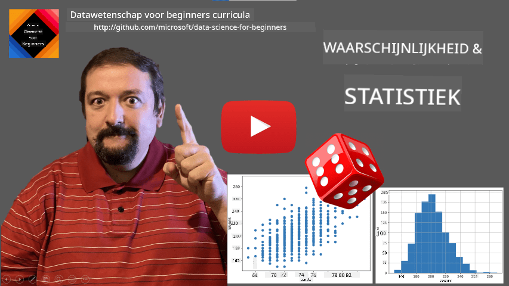
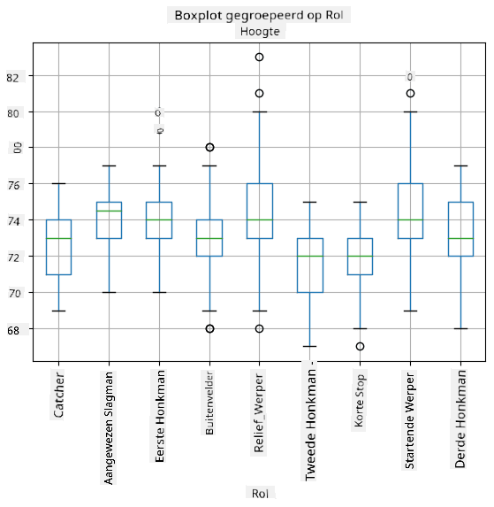
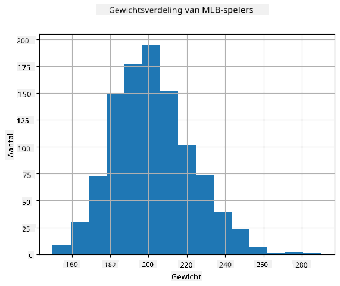
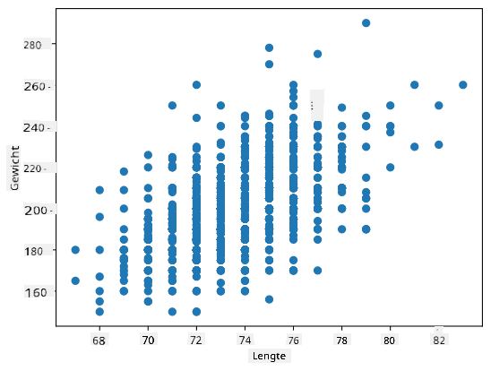

<!--
CO_OP_TRANSLATOR_METADATA:
{
  "original_hash": "8bbb3fa0d4ad61384a3b4b5f7560226f",
  "translation_date": "2025-09-04T19:58:02+00:00",
  "source_file": "1-Introduction/04-stats-and-probability/README.md",
  "language_code": "nl"
}
-->
# Een Korte Introductie tot Statistiek en Kansberekening

| ](../../sketchnotes/04-Statistics-Probability.png)|
|:---:|
| Statistiek en Kansberekening - _Sketchnote door [@nitya](https://twitter.com/nitya)_ |

Statistiek en Kansberekening zijn twee sterk verwante gebieden binnen de wiskunde die zeer relevant zijn voor Data Science. Het is mogelijk om met data te werken zonder diepgaande kennis van wiskunde, maar het is toch beter om ten minste enkele basisconcepten te begrijpen. Hier bieden we een korte introductie die je op weg helpt.

[](https://youtu.be/Z5Zy85g4Yjw)

## [Quiz voorafgaand aan de les](https://purple-hill-04aebfb03.1.azurestaticapps.net/quiz/6)

## Kansberekening en Willekeurige Variabelen

**Kans** is een getal tussen 0 en 1 dat uitdrukt hoe waarschijnlijk een **gebeurtenis** is. Het wordt gedefinieerd als het aantal positieve uitkomsten (die leiden tot de gebeurtenis), gedeeld door het totale aantal uitkomsten, ervan uitgaande dat alle uitkomsten even waarschijnlijk zijn. Bijvoorbeeld, wanneer we een dobbelsteen gooien, is de kans op een even getal 3/6 = 0,5.

Wanneer we over gebeurtenissen praten, gebruiken we **willekeurige variabelen**. Bijvoorbeeld, de willekeurige variabele die het getal vertegenwoordigt dat wordt verkregen bij het gooien van een dobbelsteen, neemt waarden aan van 1 tot 6. De verzameling getallen van 1 tot 6 wordt de **steekproefruimte** genoemd. We kunnen praten over de kans dat een willekeurige variabele een bepaalde waarde aanneemt, bijvoorbeeld P(X=3)=1/6.

De willekeurige variabele in het vorige voorbeeld wordt een **discrete** variabele genoemd, omdat het een telbare steekproefruimte heeft, d.w.z. er zijn afzonderlijke waarden die kunnen worden opgesomd. Er zijn gevallen waarin de steekproefruimte een bereik van reële getallen is, of de volledige verzameling reële getallen. Dergelijke variabelen worden **continue** variabelen genoemd. Een goed voorbeeld is de tijd waarop de bus arriveert.

## Kansverdeling

In het geval van discrete willekeurige variabelen is het eenvoudig om de kans van elke gebeurtenis te beschrijven met een functie P(X). Voor elke waarde *s* uit de steekproefruimte *S* geeft deze een getal tussen 0 en 1, zodanig dat de som van alle waarden van P(X=s) voor alle gebeurtenissen gelijk is aan 1.

De meest bekende discrete verdeling is de **uniforme verdeling**, waarbij er een steekproefruimte is van N elementen, met een gelijke kans van 1/N voor elk van hen.

Het is moeilijker om de kansverdeling van een continue variabele te beschrijven, met waarden die afkomstig zijn uit een interval [a,b], of de volledige verzameling reële getallen ℝ. Neem bijvoorbeeld de aankomsttijd van een bus. In feite is de kans dat een bus precies op een bepaalde tijd *t* arriveert, 0!

> Nu weet je dat gebeurtenissen met een kans van 0 toch gebeuren, en zelfs vaak! Bijvoorbeeld elke keer dat de bus arriveert!

We kunnen alleen praten over de kans dat een variabele binnen een bepaald interval van waarden valt, bijvoorbeeld P(t<sub>1</sub>≤X<t<sub>2</sub>). In dit geval wordt de kansverdeling beschreven door een **kansdichtheidsfunctie** p(x), zodanig dat


Een continue variant van de uniforme verdeling wordt **continue uniforme verdeling** genoemd, die gedefinieerd is op een eindig interval. De kans dat de waarde X binnen een interval van lengte l valt, is evenredig aan l en loopt op tot 1.

Een andere belangrijke verdeling is de **normale verdeling**, waar we hieronder meer in detail op ingaan.

## Gemiddelde, Variantie en Standaarddeviatie

Stel dat we een reeks van n steekproeven van een willekeurige variabele X trekken: x<sub>1</sub>, x<sub>2</sub>, ..., x<sub>n</sub>. We kunnen de **gemiddelde** (of **rekenkundige gemiddelde**) waarde van de reeks op de traditionele manier definiëren als (x<sub>1</sub>+x<sub>2</sub>+x<sub>n</sub>)/n. Naarmate we de grootte van de steekproef vergroten (d.w.z. de limiet nemen met n→∞), verkrijgen we het gemiddelde (ook wel **verwachtingswaarde** genoemd) van de verdeling. We noteren de verwachtingswaarde met **E**(x).

> Het kan worden aangetoond dat voor elke discrete verdeling met waarden {x<sub>1</sub>, x<sub>2</sub>, ..., x<sub>N</sub>} en bijbehorende kansen p<sub>1</sub>, p<sub>2</sub>, ..., p<sub>N</sub>, de verwachtingswaarde gelijk is aan E(X)=x<sub>1</sub>p<sub>1</sub>+x<sub>2</sub>p<sub>2</sub>+...+x<sub>N</sub>p<sub>N</sub>.

Om te bepalen hoe ver de waarden verspreid zijn, kunnen we de variantie berekenen σ<sup>2</sup> = ∑(x<sub>i</sub> - μ)<sup>2</sup>/n, waarbij μ het gemiddelde van de reeks is. De waarde σ wordt **standaarddeviatie** genoemd, en σ<sup>2</sup> wordt **variantie** genoemd.

## Modus, Mediaan en Kwartielen

Soms geeft het gemiddelde geen goed beeld van de "typische" waarde van data. Bijvoorbeeld, wanneer er enkele extreme waarden zijn die volledig buiten het bereik vallen, kunnen ze het gemiddelde beïnvloeden. Een andere goede indicatie is de **mediaan**, een waarde waarbij de helft van de datapunten lager is en de andere helft hoger.

Om ons te helpen de verdeling van data te begrijpen, is het nuttig om te praten over **kwartielen**:

* Het eerste kwartiel, of Q1, is een waarde waarbij 25% van de data eronder valt
* Het derde kwartiel, of Q3, is een waarde waarbij 75% van de data eronder valt

Grafisch kunnen we de relatie tussen mediaan en kwartielen weergeven in een diagram dat de **boxplot** wordt genoemd:


Hier berekenen we ook de **interkwartielafstand** IQR=Q3-Q1, en zogenaamde **uitbijters** - waarden die buiten de grenzen [Q1-1.5*IQR,Q3+1.5*IQR] liggen.

Voor een eindige verdeling die een klein aantal mogelijke waarden bevat, is een goede "typische" waarde degene die het vaakst voorkomt, wat de **modus** wordt genoemd. Dit wordt vaak toegepast op categorische data, zoals kleuren. Stel je een situatie voor waarin we twee groepen mensen hebben - sommigen die sterk de voorkeur geven aan rood, en anderen die blauw verkiezen. Als we kleuren coderen met nummers, zou de gemiddelde waarde voor een favoriete kleur ergens in het oranje-groene spectrum liggen, wat geen echte voorkeur aangeeft voor een van beide groepen. De modus zou echter een van de kleuren zijn, of beide kleuren, als het aantal mensen dat ervoor stemt gelijk is (in dat geval noemen we de steekproef **multimodaal**).

## Data uit de echte wereld

Wanneer we data uit het echte leven analyseren, zijn ze vaak geen willekeurige variabelen in de strikte zin, omdat we geen experimenten uitvoeren met onbekende resultaten. Bijvoorbeeld, neem een team van honkbalspelers en hun lichaamsgegevens, zoals lengte, gewicht en leeftijd. Die cijfers zijn niet echt willekeurig, maar we kunnen toch dezelfde wiskundige concepten toepassen. Bijvoorbeeld, een reeks van gewichten van mensen kan worden beschouwd als een reeks waarden die afkomstig zijn van een willekeurige variabele. Hieronder staat de reeks gewichten van echte honkbalspelers uit [Major League Baseball](http://mlb.mlb.com/index.jsp), afkomstig uit [deze dataset](http://wiki.stat.ucla.edu/socr/index.php/SOCR_Data_MLB_HeightsWeights) (voor jouw gemak worden alleen de eerste 20 waarden weergegeven):

```
[180.0, 215.0, 210.0, 210.0, 188.0, 176.0, 209.0, 200.0, 231.0, 180.0, 188.0, 180.0, 185.0, 160.0, 180.0, 185.0, 197.0, 189.0, 185.0, 219.0]
```

> **Opmerking**: Om een voorbeeld te zien van het werken met deze dataset, bekijk [het bijbehorende notebook](notebook.ipynb). Er zijn ook een aantal uitdagingen in deze les, en je kunt ze voltooien door wat code toe te voegen aan dat notebook. Als je niet zeker weet hoe je met data moet werken, maak je geen zorgen - we komen later terug op het werken met data met Python. Als je niet weet hoe je code moet uitvoeren in Jupyter Notebook, bekijk [dit artikel](https://soshnikov.com/education/how-to-execute-notebooks-from-github/).

Hier is de boxplot die het gemiddelde, de mediaan en de kwartielen voor onze data toont:


Omdat onze data informatie bevat over verschillende speler **rollen**, kunnen we ook een boxplot per rol maken - dit stelt ons in staat om een idee te krijgen van hoe de parameters verschillen tussen rollen. Deze keer bekijken we de lengte:



Dit diagram suggereert dat, gemiddeld genomen, de lengte van eerste honkspelers hoger is dan die van tweede honkspelers. Later in deze les leren we hoe we deze hypothese formeler kunnen testen en hoe we kunnen aantonen dat onze data statistisch significant is om dit te bewijzen.

> Bij het werken met data uit de echte wereld gaan we ervan uit dat alle datapunten steekproeven zijn die afkomstig zijn van een bepaalde kansverdeling. Deze aanname stelt ons in staat om machine learning-technieken toe te passen en werkende voorspellende modellen te bouwen.

Om te zien wat de verdeling van onze data is, kunnen we een grafiek maken die een **histogram** wordt genoemd. De X-as bevat een aantal verschillende gewichtsintervallen (zogenaamde **bins**), en de verticale as toont het aantal keren dat onze willekeurige variabele binnen een bepaald interval viel.



Uit dit histogram kun je zien dat alle waarden gecentreerd zijn rond een bepaald gemiddeld gewicht, en hoe verder we van dat gewicht af gaan, hoe minder gewichten van die waarde worden aangetroffen. Met andere woorden, het is zeer onwaarschijnlijk dat het gewicht van een honkbalspeler sterk afwijkt van het gemiddelde gewicht. De variantie van gewichten toont de mate waarin gewichten waarschijnlijk verschillen van het gemiddelde.

> Als we gewichten van andere mensen nemen, niet uit de honkbalcompetitie, is de verdeling waarschijnlijk anders. De vorm van de verdeling blijft echter hetzelfde, maar het gemiddelde en de variantie zouden veranderen. Dus, als we ons model trainen op honkbalspelers, is het waarschijnlijk dat het verkeerde resultaten geeft wanneer toegepast op studenten van een universiteit, omdat de onderliggende verdeling anders is.

## Normale Verdeling

De verdeling van gewichten die we hierboven hebben gezien is zeer typisch, en veel metingen uit de echte wereld volgen hetzelfde type verdeling, maar met verschillende gemiddelden en varianties. Deze verdeling wordt de **normale verdeling** genoemd, en speelt een zeer belangrijke rol in de statistiek.

Het gebruik van de normale verdeling is een correcte manier om willekeurige gewichten van potentiële honkbalspelers te genereren. Zodra we het gemiddelde gewicht `mean` en de standaarddeviatie `std` kennen, kunnen we 1000 gewichtssteekproeven genereren op de volgende manier:
```python
samples = np.random.normal(mean,std,1000)
``` 

Als we het histogram van de gegenereerde steekproeven plotten, zien we een afbeelding die erg lijkt op die hierboven. En als we het aantal steekproeven en het aantal bins vergroten, kunnen we een afbeelding van een normale verdeling genereren die dichter bij ideaal is:


*Normale verdeling met mean=0 en std.dev=1*

## Betrouwbaarheidsintervallen

Wanneer we praten over gewichten van honkbalspelers, gaan we ervan uit dat er een bepaalde **willekeurige variabele W** is die overeenkomt met de ideale kansverdeling van gewichten van alle honkbalspelers (de zogenaamde **populatie**). Onze reeks gewichten komt overeen met een subset van alle honkbalspelers die we de **steekproef** noemen. Een interessante vraag is: kunnen we de parameters van de verdeling van W kennen, d.w.z. het gemiddelde en de variantie van de populatie?

Het eenvoudigste antwoord zou zijn om het gemiddelde en de variantie van onze steekproef te berekenen. Het kan echter gebeuren dat onze willekeurige steekproef de volledige populatie niet nauwkeurig vertegenwoordigt. Daarom is het logisch om te praten over **betrouwbaarheidsintervallen**.
> **Betrouwbaarheidsinterval** is de schatting van het werkelijke gemiddelde van de populatie op basis van onze steekproef, die met een bepaalde waarschijnlijkheid (of **niveau van vertrouwen**) nauwkeurig is.
Stel dat we een steekproef X<sub>1</sub>, ..., X<sub>n</sub> hebben uit onze verdeling. Elke keer dat we een steekproef trekken uit onze verdeling, krijgen we een andere gemiddelde waarde μ. Daarom kan μ worden beschouwd als een willekeurige variabele. Een **betrouwbaarheidsinterval** met betrouwbaarheid p is een paar waarden (L<sub>p</sub>,R<sub>p</sub>), zodanig dat **P**(L<sub>p</sub>≤μ≤R<sub>p</sub>) = p, oftewel de kans dat de gemeten gemiddelde waarde binnen het interval valt, is gelijk aan p.

Het gaat verder dan onze korte introductie om in detail te bespreken hoe deze betrouwbaarheidsintervallen worden berekend. Meer details zijn te vinden [op Wikipedia](https://en.wikipedia.org/wiki/Confidence_interval). Kort gezegd definiëren we de verdeling van het berekende steekproefgemiddelde ten opzichte van het werkelijke gemiddelde van de populatie, wat wordt genoemd de **student-verdeling**.

> **Interessant feit**: De student-verdeling is genoemd naar wiskundige William Sealy Gosset, die zijn artikel publiceerde onder het pseudoniem "Student". Hij werkte in de Guinness-brouwerij, en volgens een van de versies wilde zijn werkgever niet dat het grote publiek wist dat ze statistische tests gebruikten om de kwaliteit van grondstoffen te bepalen.

Als we het gemiddelde μ van onze populatie willen schatten met betrouwbaarheid p, moeten we de *(1-p)/2-de percentiel* van een student-verdeling A nemen, die kan worden opgezocht in tabellen of berekend met ingebouwde functies van statistische software (bijv. Python, R, enz.). Dan wordt het interval voor μ gegeven door X±A*D/√n, waarbij X het verkregen gemiddelde van de steekproef is en D de standaarddeviatie.

> **Opmerking**: We laten ook de bespreking van een belangrijk concept van [vrijheidsgraden](https://en.wikipedia.org/wiki/Degrees_of_freedom_(statistics)) weg, wat belangrijk is in relatie tot de student-verdeling. Je kunt meer uitgebreide boeken over statistiek raadplegen om dit concept dieper te begrijpen.

Een voorbeeld van het berekenen van betrouwbaarheidsintervallen voor gewichten en lengtes is te vinden in de [bijbehorende notebooks](notebook.ipynb).

| p    | Gemiddelde gewicht |
|------|--------------------|
| 0.85 | 201.73±0.94       |
| 0.90 | 201.73±1.08       |
| 0.95 | 201.73±1.28       |

Merk op dat hoe hoger de betrouwbaarheid, hoe breder het betrouwbaarheidsinterval.

## Hypothesetoetsing

In onze dataset van honkbalspelers zijn er verschillende spelersrollen, die hieronder kunnen worden samengevat (bekijk de [bijbehorende notebook](notebook.ipynb) om te zien hoe deze tabel kan worden berekend):

| Rol               | Lengte     | Gewicht    | Aantal |
|-------------------|------------|------------|--------|
| Catcher           | 72.723684  | 204.328947 | 76     |
| Designated_Hitter | 74.222222  | 220.888889 | 18     |
| First_Baseman     | 74.000000  | 213.109091 | 55     |
| Outfielder        | 73.010309  | 199.113402 | 194    |
| Relief_Pitcher    | 74.374603  | 203.517460 | 315    |
| Second_Baseman    | 71.362069  | 184.344828 | 58     |
| Shortstop         | 71.903846  | 182.923077 | 52     |
| Starting_Pitcher  | 74.719457  | 205.163636 | 221    |
| Third_Baseman     | 73.044444  | 200.955556 | 45     |

We kunnen zien dat de gemiddelde lengte van eerste honkspelers hoger is dan die van tweede honkspelers. Daarom kunnen we geneigd zijn te concluderen dat **eerste honkspelers langer zijn dan tweede honkspelers**.

> Deze uitspraak wordt een **hypothese** genoemd, omdat we niet weten of het feit daadwerkelijk waar is.

Het is echter niet altijd duidelijk of we deze conclusie kunnen trekken. Uit de bovenstaande discussie weten we dat elk gemiddelde een bijbehorend betrouwbaarheidsinterval heeft, en dus kan dit verschil gewoon een statistische fout zijn. We hebben een meer formele manier nodig om onze hypothese te testen.

Laten we betrouwbaarheidsintervallen afzonderlijk berekenen voor de lengtes van eerste en tweede honkspelers:

| Betrouwbaarheid | Eerste honkspelers | Tweede honkspelers |
|-----------------|--------------------|--------------------|
| 0.85            | 73.62..74.38      | 71.04..71.69       |
| 0.90            | 73.56..74.44      | 70.99..71.73       |
| 0.95            | 73.47..74.53      | 70.92..71.81       |

We kunnen zien dat bij geen enkele betrouwbaarheid de intervallen overlappen. Dat bewijst onze hypothese dat eerste honkspelers langer zijn dan tweede honkspelers.

Meer formeel is het probleem dat we oplossen om te zien of **twee kansverdelingen hetzelfde zijn**, of op zijn minst dezelfde parameters hebben. Afhankelijk van de verdeling moeten we verschillende tests gebruiken. Als we weten dat onze verdelingen normaal zijn, kunnen we de **[Student t-test](https://en.wikipedia.org/wiki/Student%27s_t-test)** toepassen.

Bij de Student t-test berekenen we de zogenaamde **t-waarde**, die het verschil tussen gemiddelden aangeeft, rekening houdend met de variantie. Het is aangetoond dat de t-waarde de **student-verdeling** volgt, wat ons in staat stelt de drempelwaarde te verkrijgen voor een gegeven betrouwbaarheidsniveau **p** (dit kan worden berekend of opgezocht in numerieke tabellen). We vergelijken vervolgens de t-waarde met deze drempel om de hypothese goed te keuren of te verwerpen.

In Python kunnen we het **SciPy**-pakket gebruiken, dat de functie `ttest_ind` bevat (naast vele andere nuttige statistische functies!). Het berekent de t-waarde voor ons en doet ook de omgekeerde opzoeking van de betrouwbaarheids-p-waarde, zodat we alleen naar de betrouwbaarheid hoeven te kijken om de conclusie te trekken.

Bijvoorbeeld, onze vergelijking tussen de lengtes van eerste en tweede honkspelers geeft ons de volgende resultaten:
```python
from scipy.stats import ttest_ind

tval, pval = ttest_ind(df.loc[df['Role']=='First_Baseman',['Height']], df.loc[df['Role']=='Designated_Hitter',['Height']],equal_var=False)
print(f"T-value = {tval[0]:.2f}\nP-value: {pval[0]}")
```
```
T-value = 7.65
P-value: 9.137321189738925e-12
```
In ons geval is de p-waarde erg laag, wat betekent dat er sterk bewijs is dat eerste honkspelers langer zijn.

Er zijn ook verschillende andere soorten hypothesen die we mogelijk willen testen, bijvoorbeeld:
* Bewijzen dat een gegeven steekproef een bepaalde verdeling volgt. In ons geval hebben we aangenomen dat lengtes normaal verdeeld zijn, maar dat vereist formele statistische verificatie.
* Bewijzen dat een gemiddelde waarde van een steekproef overeenkomt met een vooraf gedefinieerde waarde.
* Vergelijken van gemiddelden van een aantal steekproeven (bijv. wat is het verschil in geluksniveaus tussen verschillende leeftijdsgroepen).

## Wet van de grote aantallen en centrale limietstelling

Een van de redenen waarom normale verdeling zo belangrijk is, is de zogenaamde **centrale limietstelling**. Stel dat we een grote steekproef van onafhankelijke N waarden X<sub>1</sub>, ..., X<sub>N</sub> hebben, genomen uit een willekeurige verdeling met gemiddelde μ en variantie σ<sup>2</sup>. Dan, voor voldoende grote N (met andere woorden, wanneer N→∞), zou het gemiddelde Σ<sub>i</sub>X<sub>i</sub> normaal verdeeld zijn, met gemiddelde μ en variantie σ<sup>2</sup>/N.

> Een andere manier om de centrale limietstelling te interpreteren is te zeggen dat, ongeacht de verdeling, wanneer je het gemiddelde berekent van een som van willekeurige variabele waarden, je uiteindelijk een normale verdeling krijgt.

Uit de centrale limietstelling volgt ook dat, wanneer N→∞, de kans dat het steekproefgemiddelde gelijk is aan μ 1 wordt. Dit staat bekend als **de wet van de grote aantallen**.

## Covariantie en correlatie

Een van de dingen die Data Science doet, is het vinden van relaties tussen gegevens. We zeggen dat twee reeksen **correleren** wanneer ze hetzelfde gedrag vertonen op hetzelfde moment, d.w.z. ze stijgen/dalen tegelijkertijd, of één reeks stijgt wanneer een andere daalt en vice versa. Met andere woorden, er lijkt een relatie te zijn tussen twee reeksen.

> Correlatie geeft niet noodzakelijk een oorzakelijk verband aan tussen twee reeksen; soms kunnen beide variabelen afhankelijk zijn van een externe oorzaak, of het kan puur toeval zijn dat de twee reeksen correleren. Sterke wiskundige correlatie is echter een goede indicatie dat twee variabelen op de een of andere manier verbonden zijn.

Wiskundig gezien is het belangrijkste concept dat de relatie tussen twee willekeurige variabelen laat zien **covariantie**, die als volgt wordt berekend: Cov(X,Y) = **E**\[(X-**E**(X))(Y-**E**(Y))\]. We berekenen de afwijking van beide variabelen ten opzichte van hun gemiddelde waarden en vervolgens het product van die afwijkingen. Als beide variabelen samen afwijken, is het product altijd een positieve waarde, wat optelt tot positieve covariantie. Als beide variabelen niet synchroon afwijken (d.w.z. één valt onder het gemiddelde wanneer een andere boven het gemiddelde stijgt), krijgen we altijd negatieve getallen, wat optelt tot negatieve covariantie. Als de afwijkingen niet afhankelijk zijn, tellen ze op tot ongeveer nul.

De absolute waarde van covariantie vertelt ons niet veel over hoe groot de correlatie is, omdat het afhangt van de grootte van de werkelijke waarden. Om het te normaliseren, kunnen we de covariantie delen door de standaarddeviatie van beide variabelen, om **correlatie** te krijgen. Het goede is dat correlatie altijd in het bereik [-1,1] ligt, waarbij 1 sterke positieve correlatie tussen waarden aangeeft, -1 sterke negatieve correlatie, en 0 geen correlatie (variabelen zijn onafhankelijk).

**Voorbeeld**: We kunnen de correlatie berekenen tussen gewichten en lengtes van honkbalspelers uit de hierboven genoemde dataset:
```python
print(np.corrcoef(weights,heights))
```
Als resultaat krijgen we een **correlatiematrix** zoals deze:
```
array([[1.        , 0.52959196],
       [0.52959196, 1.        ]])
```

> Een correlatiematrix C kan worden berekend voor een willekeurig aantal invoerreeksen S<sub>1</sub>, ..., S<sub>n</sub>. De waarde van C<sub>ij</sub> is de correlatie tussen S<sub>i</sub> en S<sub>j</sub>, en diagonale elementen zijn altijd 1 (wat ook zelfcorrelatie van S<sub>i</sub> is).

In ons geval geeft de waarde 0.53 aan dat er enige correlatie is tussen het gewicht en de lengte van een persoon. We kunnen ook de spreidingsdiagram van één waarde tegen de andere maken om de relatie visueel te zien:



> Meer voorbeelden van correlatie en covariantie zijn te vinden in de [bijbehorende notebook](notebook.ipynb).

## Conclusie

In deze sectie hebben we geleerd:

* basisstatistische eigenschappen van gegevens, zoals gemiddelde, variantie, modus en kwartielen
* verschillende verdelingen van willekeurige variabelen, waaronder normale verdeling
* hoe correlatie te vinden tussen verschillende eigenschappen
* hoe het solide apparaat van wiskunde en statistiek te gebruiken om enkele hypothesen te bewijzen
* hoe betrouwbaarheidsintervallen te berekenen voor willekeurige variabelen gegeven een gegevenssteekproef

Hoewel dit zeker geen uitputtende lijst is van onderwerpen die bestaan binnen kansberekening en statistiek, zou het voldoende moeten zijn om je een goede start te geven in deze cursus.

## 🚀 Uitdaging

Gebruik de voorbeeldcode in de notebook om andere hypothesen te testen:
1. Eerste honkspelers zijn ouder dan tweede honkspelers
2. Eerste honkspelers zijn langer dan derde honkspelers
3. Shortstops zijn langer dan tweede honkspelers

## [Post-lecture quiz](https://ff-quizzes.netlify.app/en/ds/)

## Review & Zelfstudie

Kansberekening en statistiek is zo'n breed onderwerp dat het een eigen cursus verdient. Als je dieper in de theorie wilt duiken, kun je verder lezen in enkele van de volgende boeken:

1. [Carlos Fernandez-Granda](https://cims.nyu.edu/~cfgranda/) van New York University heeft geweldige collegedictaten [Probability and Statistics for Data Science](https://cims.nyu.edu/~cfgranda/pages/stuff/probability_stats_for_DS.pdf) (online beschikbaar)
1. [Peter en Andrew Bruce. Practical Statistics for Data Scientists.](https://www.oreilly.com/library/view/practical-statistics-for/9781491952955/) [[voorbeeldcode in R](https://github.com/andrewgbruce/statistics-for-data-scientists)].
1. [James D. Miller. Statistics for Data Science](https://www.packtpub.com/product/statistics-for-data-science/9781788290678) [[voorbeeldcode in R](https://github.com/PacktPublishing/Statistics-for-Data-Science)]

## Opdracht

[Kleine Diabetesstudie](assignment.md)

## Credits

Deze les is met ♥️ geschreven door [Dmitry Soshnikov](http://soshnikov.com)

---

**Disclaimer**:  
Dit document is vertaald met behulp van de AI-vertalingsservice [Co-op Translator](https://github.com/Azure/co-op-translator). Hoewel we streven naar nauwkeurigheid, dient u zich ervan bewust te zijn dat geautomatiseerde vertalingen fouten of onnauwkeurigheden kunnen bevatten. Het originele document in zijn oorspronkelijke taal moet worden beschouwd als de gezaghebbende bron. Voor cruciale informatie wordt professionele menselijke vertaling aanbevolen. Wij zijn niet aansprakelijk voor eventuele misverstanden of verkeerde interpretaties die voortvloeien uit het gebruik van deze vertaling.