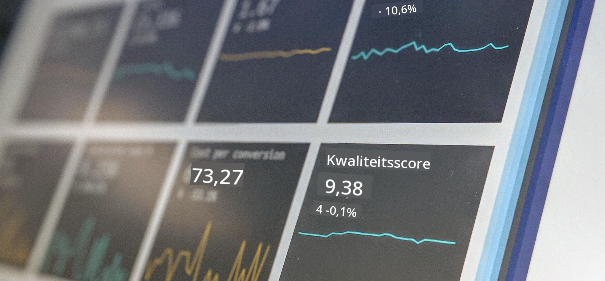

<!--
CO_OP_TRANSLATOR_METADATA:
{
  "original_hash": "696a8474a01054281704cbfb09148949",
  "translation_date": "2025-08-28T15:45:21+00:00",
  "source_file": "1-Introduction/README.md",
  "language_code": "nl"
}
-->
# Introductie tot Data Science

> Foto door <a href="https://unsplash.com/@dawson2406?utm_source=unsplash&utm_medium=referral&utm_content=creditCopyText">Stephen Dawson</a> op <a href="https://unsplash.com/s/photos/data?utm_source=unsplash&utm_medium=referral&utm_content=creditCopyText">Unsplash</a>
  
In deze lessen ontdek je hoe Data Science wordt gedefinieerd en leer je over ethische overwegingen waar een datawetenschapper rekening mee moet houden. Je leert ook hoe data wordt gedefinieerd en krijgt een introductie tot statistiek en kansberekening, de kerngebieden van Data Science.

### Onderwerpen

1. [Data Science definiëren](01-defining-data-science/README.md)
2. [Ethische aspecten van Data Science](02-ethics/README.md)
3. [Data definiëren](03-defining-data/README.md)
4. [Introductie tot Statistiek en Kansberekening](04-stats-and-probability/README.md)

### Credits

Deze lessen zijn met ❤️ geschreven door [Nitya Narasimhan](https://twitter.com/nitya) en [Dmitry Soshnikov](https://twitter.com/shwars).

---

**Disclaimer**:  
Dit document is vertaald met behulp van de AI-vertalingsservice [Co-op Translator](https://github.com/Azure/co-op-translator). Hoewel we streven naar nauwkeurigheid, dient u zich ervan bewust te zijn dat geautomatiseerde vertalingen fouten of onnauwkeurigheden kunnen bevatten. Het originele document in de oorspronkelijke taal moet worden beschouwd als de gezaghebbende bron. Voor kritieke informatie wordt professionele menselijke vertaling aanbevolen. Wij zijn niet aansprakelijk voor misverstanden of verkeerde interpretaties die voortvloeien uit het gebruik van deze vertaling.