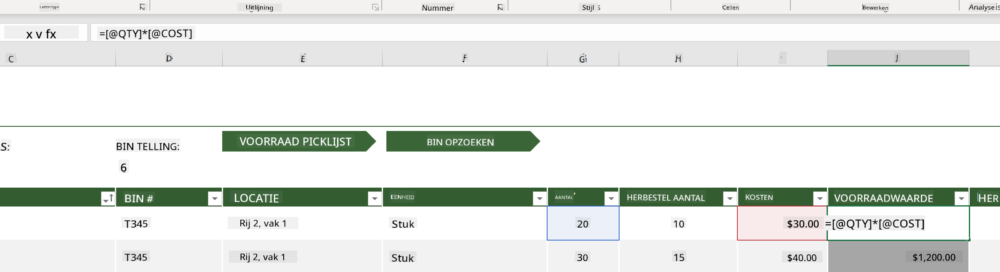
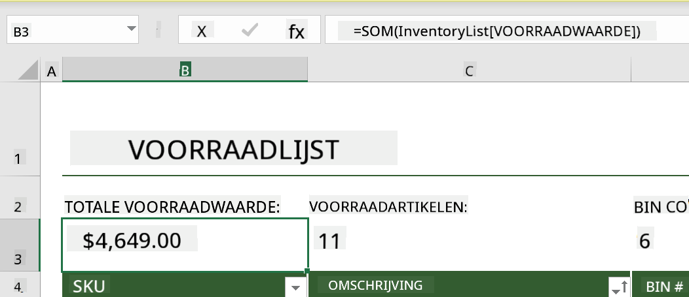
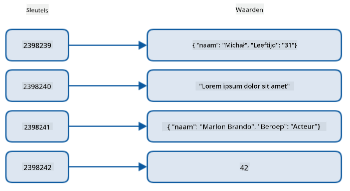
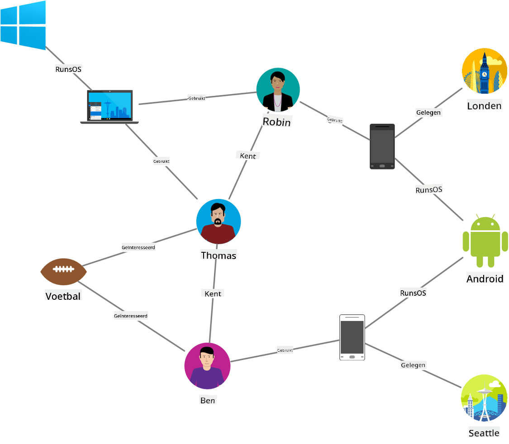
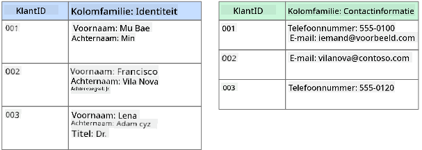
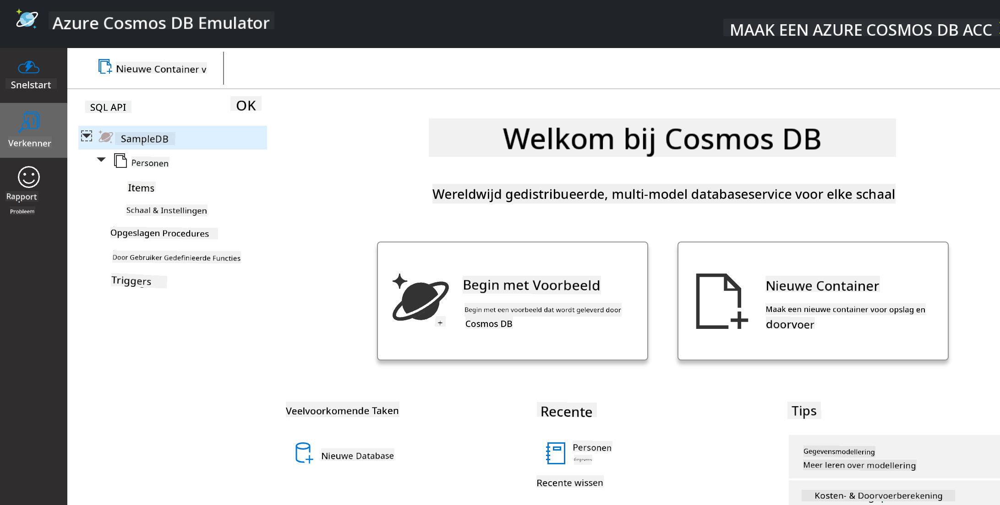
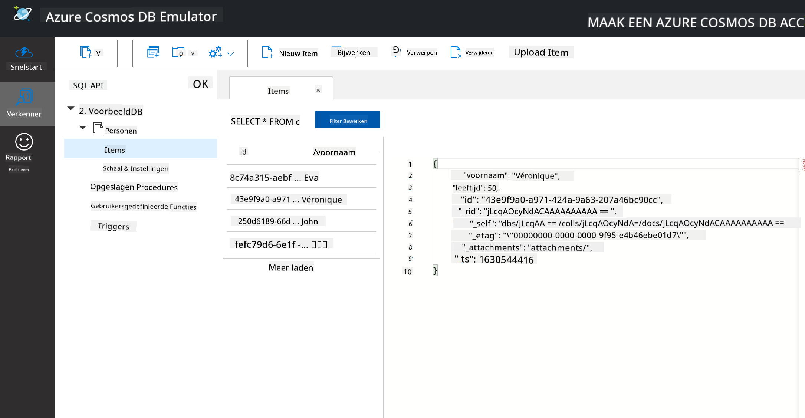
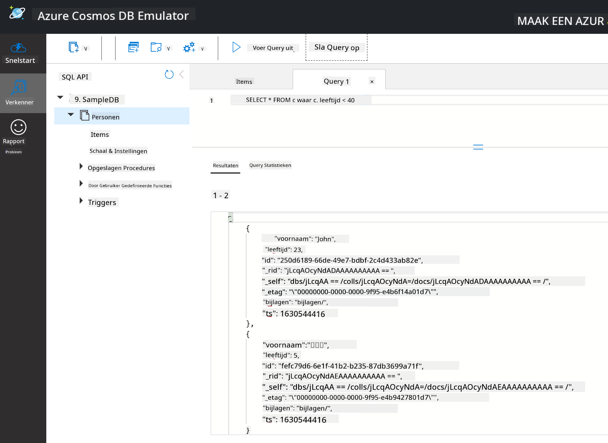

<!--
CO_OP_TRANSLATOR_METADATA:
{
  "original_hash": "54c5a1c74aecb69d2f9099300a4b7eea",
  "translation_date": "2025-09-04T19:50:10+00:00",
  "source_file": "2-Working-With-Data/06-non-relational/README.md",
  "language_code": "nl"
}
-->
# Werken met Data: Niet-Relationele Data

| ](../../sketchnotes/06-NoSQL.png)|
|:---:|
|Werken met NoSQL Data - _Sketchnote door [@nitya](https://twitter.com/nitya)_ |

## [Pre-Les Quiz](https://purple-hill-04aebfb03.1.azurestaticapps.net/quiz/10)

Data is niet beperkt tot relationele databases. Deze les richt zich op niet-relationele data en behandelt de basis van spreadsheets en NoSQL.

## Spreadsheets

Spreadsheets zijn een populaire manier om data op te slaan en te verkennen, omdat het minder werk vereist om op te zetten en te starten. In deze les leer je de basiscomponenten van een spreadsheet, evenals formules en functies. De voorbeelden worden geïllustreerd met Microsoft Excel, maar de meeste onderdelen en onderwerpen hebben vergelijkbare namen en stappen in vergelijking met andere spreadsheetsoftware.


Een spreadsheet is een bestand en zal toegankelijk zijn in het bestandssysteem van een computer, apparaat of cloud-gebaseerd bestandssysteem. De software zelf kan browser-gebaseerd zijn of een applicatie die geïnstalleerd moet worden op een computer of gedownload als een app. In Excel worden deze bestanden ook gedefinieerd als **werkboeken**, en deze terminologie zal de rest van deze les worden gebruikt.

Een werkboek bevat een of meer **werkbladen**, waarbij elk werkblad wordt gelabeld met tabbladen. Binnen een werkblad bevinden zich rechthoeken genaamd **cellen**, die de daadwerkelijke data bevatten. Een cel is het snijpunt van een rij en kolom, waarbij de kolommen worden gelabeld met alfabetische tekens en de rijen numeriek worden gelabeld. Sommige spreadsheets bevatten kopteksten in de eerste paar rijen om de data in een cel te beschrijven.

Met deze basiselementen van een Excel-werkboek gebruiken we een voorbeeld van [Microsoft Templates](https://templates.office.com/) gericht op een inventaris om enkele aanvullende onderdelen van een spreadsheet door te nemen.

### Beheren van een Inventaris

Het spreadsheetbestand genaamd "InventoryExample" is een geformatteerde spreadsheet van items binnen een inventaris die drie werkbladen bevat, waarbij de tabbladen zijn gelabeld "Inventory List", "Inventory Pick List" en "Bin Lookup". Rij 4 van het werkblad Inventory List is de koptekst, die de waarde van elke cel in de koptekstkolom beschrijft.



Er zijn gevallen waarin een cel afhankelijk is van de waarden van andere cellen om zijn waarde te genereren. De spreadsheet Inventory List houdt de kosten bij van elk item in de inventaris, maar wat als we de waarde van alles in de inventaris moeten weten? [**Formules**](https://support.microsoft.com/en-us/office/overview-of-formulas-34519a4e-1e8d-4f4b-84d4-d642c4f63263) voeren acties uit op celdata en worden gebruikt om de kosten van de inventaris in dit voorbeeld te berekenen. Deze spreadsheet gebruikte een formule in de kolom Inventory Value om de waarde van elk item te berekenen door de hoeveelheid onder de koptekst QTY te vermenigvuldigen met de kosten onder de koptekst COST. Door dubbel te klikken of een cel te markeren, wordt de formule weergegeven. Je zult merken dat formules beginnen met een gelijkteken, gevolgd door de berekening of bewerking.



We kunnen een andere formule gebruiken om alle waarden van Inventory Value bij elkaar op te tellen om de totale waarde te krijgen. Dit kan worden berekend door elke cel toe te voegen om de som te genereren, maar dat kan een tijdrovende taak zijn. Excel heeft [**functies**](https://support.microsoft.com/en-us/office/sum-function-043e1c7d-7726-4e80-8f32-07b23e057f89), of vooraf gedefinieerde formules om berekeningen uit te voeren op celwaarden. Functies vereisen argumenten, dit zijn de vereiste waarden die worden gebruikt om deze berekeningen uit te voeren. Wanneer functies meer dan één argument vereisen, moeten ze in een bepaalde volgorde worden vermeld, anders berekent de functie mogelijk niet de juiste waarde. Dit voorbeeld gebruikt de SUM-functie en gebruikt de waarden van Inventory Value als het argument om de totale waarde te genereren die wordt vermeld onder rij 3, kolom B (ook wel B3 genoemd).

## NoSQL

NoSQL is een overkoepelende term voor de verschillende manieren om niet-relationele data op te slaan en kan worden geïnterpreteerd als "non-SQL", "niet-relationeel" of "niet alleen SQL". Deze soorten databasesystemen kunnen worden gecategoriseerd in 4 typen.


> Bron van [Michał Białecki Blog](https://www.michalbialecki.com/2018/03/18/azure-cosmos-db-key-value-database-cloud/)

[Key-value](https://docs.microsoft.com/en-us/azure/architecture/data-guide/big-data/non-relational-data#keyvalue-data-stores) databases koppelen unieke sleutels, die een unieke identificator zijn, aan een waarde. Deze paren worden opgeslagen met behulp van een [hash-tabel](https://www.hackerearth.com/practice/data-structures/hash-tables/basics-of-hash-tables/tutorial/) met een geschikte hashfunctie.


> Bron van [Microsoft](https://docs.microsoft.com/en-us/azure/cosmos-db/graph/graph-introduction#graph-database-by-example)

[Graph](https://docs.microsoft.com/en-us/azure/architecture/data-guide/big-data/non-relational-data#graph-data-stores) databases beschrijven relaties in data en worden weergegeven als een verzameling knooppunten en randen. Een knooppunt vertegenwoordigt een entiteit, iets dat bestaat in de echte wereld, zoals een student of bankafschrift. Randen vertegenwoordigen de relatie tussen twee entiteiten. Elk knooppunt en elke rand heeft eigenschappen die aanvullende informatie bieden over elk knooppunt en elke rand.



[Columnar](https://docs.microsoft.com/en-us/azure/architecture/data-guide/big-data/non-relational-data#columnar-data-stores) data stores organiseren data in kolommen en rijen zoals een relationele datastructuur, maar elke kolom is verdeeld in groepen genaamd een kolomfamilie, waarbij alle data onder één kolom gerelateerd is en in één eenheid kan worden opgehaald en gewijzigd.

### Document Data Stores met Azure Cosmos DB

[Document](https://docs.microsoft.com/en-us/azure/architecture/data-guide/big-data/non-relational-data#document-data-stores) data stores bouwen voort op het concept van een key-value data store en bestaan uit een reeks velden en objecten. Dit gedeelte zal documentdatabases verkennen met de Cosmos DB-emulator.

Een Cosmos DB-database past binnen de definitie van "Niet Alleen SQL", waarbij de documentdatabase van Cosmos DB afhankelijk is van SQL om de data te queryen. De [vorige les](../05-relational-databases/README.md) over SQL behandelt de basis van de taal, en we zullen hier enkele van dezelfde queries kunnen toepassen op een documentdatabase. We gebruiken de Cosmos DB Emulator, waarmee we lokaal op een computer een documentdatabase kunnen maken en verkennen. Lees meer over de Emulator [hier](https://docs.microsoft.com/en-us/azure/cosmos-db/local-emulator?tabs=ssl-netstd21).

Een document is een verzameling velden en objectwaarden, waarbij de velden beschrijven wat de objectwaarde vertegenwoordigt. Hieronder staat een voorbeeld van een document.

```json
{
    "firstname": "Eva",
    "age": 44,
    "id": "8c74a315-aebf-4a16-bb38-2430a9896ce5",
    "_rid": "bHwDAPQz8s0BAAAAAAAAAA==",
    "_self": "dbs/bHwDAA==/colls/bHwDAPQz8s0=/docs/bHwDAPQz8s0BAAAAAAAAAA==/",
    "_etag": "\"00000000-0000-0000-9f95-010a691e01d7\"",
    "_attachments": "attachments/",
    "_ts": 1630544034
}
```

De velden van belang in dit document zijn: `firstname`, `id` en `age`. De rest van de velden met de underscores zijn gegenereerd door Cosmos DB.

#### Data Verkennen met de Cosmos DB Emulator

Je kunt de emulator downloaden en installeren [voor Windows hier](https://aka.ms/cosmosdb-emulator). Raadpleeg deze [documentatie](https://docs.microsoft.com/en-us/azure/cosmos-db/local-emulator?tabs=ssl-netstd21#run-on-linux-macos) voor opties om de Emulator te gebruiken op macOS en Linux.

De Emulator opent een browservenster, waar de Explorer-weergave je in staat stelt documenten te verkennen.



Als je meedoet, klik dan op "Start with Sample" om een voorbeelddatabase genaamd SampleDB te genereren. Als je SampleDB uitbreidt door op de pijl te klikken, vind je een container genaamd `Persons`. Een container bevat een verzameling items, dit zijn de documenten binnen de container. Je kunt de vier individuele documenten onder `Items` verkennen.



#### Documentdata Queryen met de Cosmos DB Emulator

We kunnen ook de voorbeelddata queryen door op de knop nieuwe SQL-query te klikken (tweede knop van links).

`SELECT * FROM c` retourneert alle documenten in de container. Laten we een where-clause toevoegen en iedereen vinden die jonger is dan 40.

`SELECT * FROM c where c.age < 40`



De query retourneert twee documenten. Let op de leeftijdswaarde voor elk document, die kleiner is dan 40.

#### JSON en Documenten

Als je bekend bent met JavaScript Object Notation (JSON), zul je merken dat documenten lijken op JSON. Er is een `PersonsData.json`-bestand in deze map met meer data die je kunt uploaden naar de container `Persons` in de Emulator via de knop `Upload Item`.

In de meeste gevallen kunnen API's die JSON-data retourneren direct worden overgedragen en opgeslagen in documentdatabases. Hieronder staat een ander document, het vertegenwoordigt tweets van het Microsoft Twitter-account die zijn opgehaald met de Twitter API en vervolgens zijn ingevoegd in Cosmos DB.

```json
{
    "created_at": "2021-08-31T19:03:01.000Z",
    "id": "1432780985872142341",
    "text": "Blank slate. Like this tweet if you’ve ever painted in Microsoft Paint before. https://t.co/cFeEs8eOPK",
    "_rid": "dhAmAIUsA4oHAAAAAAAAAA==",
    "_self": "dbs/dhAmAA==/colls/dhAmAIUsA4o=/docs/dhAmAIUsA4oHAAAAAAAAAA==/",
    "_etag": "\"00000000-0000-0000-9f84-a0958ad901d7\"",
    "_attachments": "attachments/",
    "_ts": 1630537000
```

De velden van belang in dit document zijn: `created_at`, `id` en `text`.

## 🚀 Uitdaging

Er is een `TwitterData.json`-bestand dat je kunt uploaden naar de SampleDB-database. Het wordt aanbevolen om dit toe te voegen aan een aparte container. Dit kan worden gedaan door:

1. Klikken op de knop nieuwe container in de rechterbovenhoek
1. Het bestaande database (SampleDB) selecteren en een container-id maken voor de container
1. De partitiesleutel instellen op `/id`
1. Klikken op OK (je kunt de rest van de informatie in deze weergave negeren, aangezien dit een kleine dataset is die lokaal op je machine draait)
1. Open je nieuwe container en upload het Twitter Data-bestand met de knop `Upload Item`

Probeer een paar select-queries uit te voeren om de documenten te vinden die Microsoft bevatten in het tekstveld. Tip: probeer het [LIKE-keyword](https://docs.microsoft.com/en-us/azure/cosmos-db/sql/sql-query-keywords#using-like-with-the--wildcard-character) te gebruiken.

## [Post-Les Quiz](https://ff-quizzes.netlify.app/en/ds/)

## Review & Zelfstudie

- Er zijn enkele aanvullende opmaakopties en functies toegevoegd aan deze spreadsheet die deze les niet behandelt. Microsoft heeft een [grote bibliotheek met documentatie en video's](https://support.microsoft.com/excel) over Excel als je meer wilt leren.

- Deze architecturale documentatie beschrijft de kenmerken van de verschillende typen niet-relationele data: [Niet-relationele Data en NoSQL](https://docs.microsoft.com/en-us/azure/architecture/data-guide/big-data/non-relational-data)

- Cosmos DB is een cloud-gebaseerde niet-relationele database die ook de verschillende NoSQL-typen kan opslaan die in deze les worden genoemd. Leer meer over deze typen in deze [Cosmos DB Microsoft Learn Module](https://docs.microsoft.com/en-us/learn/paths/work-with-nosql-data-in-azure-cosmos-db/)

## Opdracht

[Soda Profits](assignment.md)

---

**Disclaimer**:  
Dit document is vertaald met behulp van de AI-vertalingsservice [Co-op Translator](https://github.com/Azure/co-op-translator). Hoewel we streven naar nauwkeurigheid, dient u zich ervan bewust te zijn dat geautomatiseerde vertalingen fouten of onnauwkeurigheden kunnen bevatten. Het originele document in zijn oorspronkelijke taal moet worden beschouwd als de gezaghebbende bron. Voor cruciale informatie wordt professionele menselijke vertaling aanbevolen. Wij zijn niet aansprakelijk voor eventuele misverstanden of verkeerde interpretaties die voortvloeien uit het gebruik van deze vertaling.