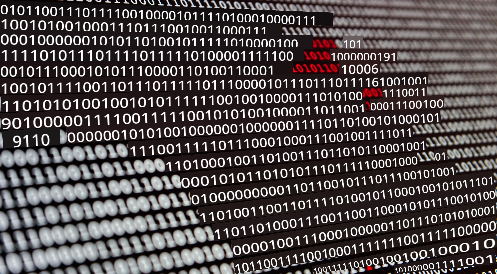

<!--
CO_OP_TRANSLATOR_METADATA:
{
  "original_hash": "abc3309ab41bc5a7846f70ee1a055838",
  "translation_date": "2025-08-28T15:12:25+00:00",
  "source_file": "2-Working-With-Data/README.md",
  "language_code": "nl"
}
-->
# Werken met Data

> Foto door <a href="https://unsplash.com/@swimstaralex?utm_source=unsplash&utm_medium=referral&utm_content=creditCopyText">Alexander Sinn</a> op <a href="https://unsplash.com/s/photos/data?utm_source=unsplash&utm_medium=referral&utm_content=creditCopyText">Unsplash</a>
  
In deze lessen leer je enkele manieren waarop data kan worden beheerd, gemanipuleerd en gebruikt in applicaties. Je leert over relationele en niet-relationele databases en hoe data daarin kan worden opgeslagen. Je leert de basisprincipes van werken met Python om data te beheren, en je ontdekt enkele van de vele manieren waarop je met Python data kunt beheren en analyseren.

### Onderwerpen

1. [Relationele databases](05-relational-databases/README.md)
2. [Niet-relationele databases](06-non-relational/README.md)
3. [Werken met Python](07-python/README.md)
4. [Data voorbereiden](08-data-preparation/README.md)

### Credits

Deze lessen zijn met ❤️ geschreven door [Christopher Harrison](https://twitter.com/geektrainer), [Dmitry Soshnikov](https://twitter.com/shwars) en [Jasmine Greenaway](https://twitter.com/paladique)

---

**Disclaimer**:  
Dit document is vertaald met behulp van de AI-vertalingsservice [Co-op Translator](https://github.com/Azure/co-op-translator). Hoewel we streven naar nauwkeurigheid, dient u zich ervan bewust te zijn dat geautomatiseerde vertalingen fouten of onnauwkeurigheden kunnen bevatten. Het originele document in de oorspronkelijke taal moet worden beschouwd als de gezaghebbende bron. Voor cruciale informatie wordt professionele menselijke vertaling aanbevolen. Wij zijn niet aansprakelijk voor misverstanden of verkeerde interpretaties die voortvloeien uit het gebruik van deze vertaling.