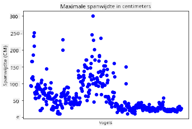
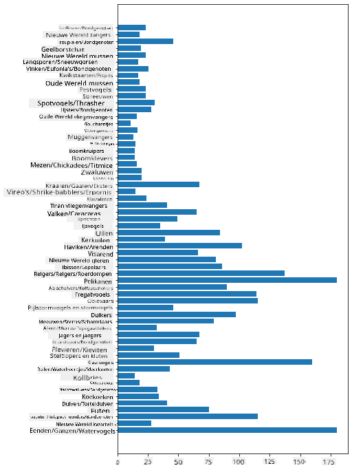

<!--
CO_OP_TRANSLATOR_METADATA:
{
  "original_hash": "43c402d9d90ae6da55d004519ada5033",
  "translation_date": "2025-08-28T15:38:40+00:00",
  "source_file": "3-Data-Visualization/09-visualization-quantities/README.md",
  "language_code": "nl"
}
-->
# Hoe hoeveelheden te visualiseren

| ](../../sketchnotes/09-Visualizing-Quantities.png)|
|:---:|
| Hoe hoeveelheden te visualiseren - _Sketchnote door [@nitya](https://twitter.com/nitya)_ |

In deze les leer je hoe je een van de vele beschikbare Python-bibliotheken kunt gebruiken om interessante visualisaties te maken rondom het concept van hoeveelheden. Met behulp van een opgeschoonde dataset over de vogels van Minnesota kun je veel interessante feiten leren over de lokale fauna.  
## [Pre-lecture quiz](https://purple-hill-04aebfb03.1.azurestaticapps.net/quiz/16)

## Observeer vleugelspanwijdte met Matplotlib

Een uitstekende bibliotheek om zowel eenvoudige als complexe grafieken en diagrammen van verschillende soorten te maken is [Matplotlib](https://matplotlib.org/stable/index.html). Over het algemeen omvat het proces van het plotten van gegevens met deze bibliotheken het identificeren van de delen van je dataframe die je wilt gebruiken, het uitvoeren van eventuele transformaties op die gegevens, het toewijzen van x- en y-aswaarden, het beslissen welk type plot je wilt tonen, en vervolgens het weergeven van de plot. Matplotlib biedt een grote verscheidenheid aan visualisaties, maar voor deze les richten we ons op de meest geschikte voor het visualiseren van hoeveelheden: lijndiagrammen, spreidingsdiagrammen en staafdiagrammen.

> ✅ Gebruik het beste diagram dat past bij de structuur van je gegevens en het verhaal dat je wilt vertellen.  
> - Om trends in de tijd te analyseren: lijn  
> - Om waarden te vergelijken: staaf, kolom, taart, spreidingsdiagram  
> - Om te laten zien hoe delen zich verhouden tot een geheel: taart  
> - Om de verdeling van gegevens te tonen: spreidingsdiagram, staaf  
> - Om trends te tonen: lijn, kolom  
> - Om relaties tussen waarden te tonen: lijn, spreidingsdiagram, bubbel  

Als je een dataset hebt en wilt ontdekken hoeveel van een bepaald item erin zit, is een van de eerste taken die je moet uitvoeren het inspecteren van de waarden.  

✅ Er zijn zeer goede 'cheat sheets' beschikbaar voor Matplotlib [hier](https://matplotlib.org/cheatsheets/cheatsheets.pdf).

## Maak een lijndiagram over vleugelspanwijdte van vogels

Open het bestand `notebook.ipynb` in de hoofdmap van deze les en voeg een cel toe.

> Opmerking: de gegevens zijn opgeslagen in de hoofdmap van deze repo in de map `/data`.

```python
import pandas as pd
import matplotlib.pyplot as plt
birds = pd.read_csv('../../data/birds.csv')
birds.head()
```  
Deze gegevens zijn een mix van tekst en cijfers:

|      | Naam                          | WetenschappelijkeNaam  | Categorie             | Orde         | Familie  | Geslacht    | Beschermingsstatus | MinLengte | MaxLengte | MinLichaamsgewicht | MaxLichaamsgewicht | MinVleugelspan | MaxVleugelspan |
| ---: | :---------------------------- | :--------------------- | :-------------------- | :----------- | :------- | :---------- | :----------------- | --------: | --------: | -----------------: | -----------------: | -------------: | -------------: |
|    0 | Zwartbuikfluiteend            | Dendrocygna autumnalis | Eenden/Ganzen/Watervogels | Anseriformes | Anatidae | Dendrocygna | LC                 |        47 |        56 |               652  |              1020  |             76 |             94 |
|    1 | Bruinfluiteend                | Dendrocygna bicolor    | Eenden/Ganzen/Watervogels | Anseriformes | Anatidae | Dendrocygna | LC                 |        45 |        53 |               712  |              1050  |             85 |             93 |
|    2 | Sneeuwgans                    | Anser caerulescens     | Eenden/Ganzen/Watervogels | Anseriformes | Anatidae | Anser       | LC                 |        64 |        79 |              2050  |              4050  |            135 |            165 |
|    3 | Ross' gans                    | Anser rossii           | Eenden/Ganzen/Watervogels | Anseriformes | Anatidae | Anser       | LC                 |      57.3 |        64 |              1066  |              1567  |            113 |            116 |
|    4 | Grote rietgans                | Anser albifrons        | Eenden/Ganzen/Watervogels | Anseriformes | Anatidae | Anser       | LC                 |        64 |        81 |              1930  |              3310  |            130 |            165 |

Laten we beginnen met het plotten van enkele numerieke gegevens met een eenvoudig lijndiagram. Stel dat je een overzicht wilt van de maximale vleugelspanwijdte van deze interessante vogels.

```python
wingspan = birds['MaxWingspan'] 
wingspan.plot()
```  


Wat valt je meteen op? Er lijkt minstens één uitschieter te zijn - dat is een behoorlijke vleugelspanwijdte! Een vleugelspanwijdte van 2300 centimeter komt overeen met 23 meter - zijn er Pterodactylen in Minnesota? Laten we dit onderzoeken.

Hoewel je snel in Excel kunt sorteren om die uitschieters te vinden, die waarschijnlijk typfouten zijn, kun je het visualisatieproces voortzetten door vanuit de plot te werken.

Voeg labels toe aan de x-as om te laten zien om welke soorten vogels het gaat:

```
plt.title('Max Wingspan in Centimeters')
plt.ylabel('Wingspan (CM)')
plt.xlabel('Birds')
plt.xticks(rotation=45)
x = birds['Name'] 
y = birds['MaxWingspan']

plt.plot(x, y)

plt.show()
```  


Zelfs met de rotatie van de labels ingesteld op 45 graden, zijn er te veel om te lezen. Laten we een andere strategie proberen: label alleen die uitschieters en plaats de labels binnen de grafiek. Je kunt een spreidingsdiagram gebruiken om meer ruimte te maken voor de labeling:

```python
plt.title('Max Wingspan in Centimeters')
plt.ylabel('Wingspan (CM)')
plt.tick_params(axis='both',which='both',labelbottom=False,bottom=False)

for i in range(len(birds)):
    x = birds['Name'][i]
    y = birds['MaxWingspan'][i]
    plt.plot(x, y, 'bo')
    if birds['MaxWingspan'][i] > 500:
        plt.text(x, y * (1 - 0.05), birds['Name'][i], fontsize=12)
    
plt.show()
```  
Wat gebeurt hier? Je hebt `tick_params` gebruikt om de onderste labels te verbergen en vervolgens een lus gemaakt over je vogel-dataset. Door de grafiek te plotten met kleine ronde blauwe stippen met behulp van `bo`, controleerde je op vogels met een maximale vleugelspanwijdte van meer dan 500 en toonde hun label naast de stip indien dat het geval was. Je verschoof de labels een beetje op de y-as (`y * (1 - 0.05)`) en gebruikte de vogelnaam als label.

Wat heb je ontdekt?

  
## Filter je gegevens

Zowel de Amerikaanse zeearend als de Prairievalk, hoewel waarschijnlijk zeer grote vogels, lijken verkeerd gelabeld te zijn, met een extra `0` toegevoegd aan hun maximale vleugelspanwijdte. Het is onwaarschijnlijk dat je een Amerikaanse zeearend tegenkomt met een vleugelspanwijdte van 25 meter, maar als dat zo is, laat het ons dan weten! Laten we een nieuwe dataframe maken zonder die twee uitschieters:

```python
plt.title('Max Wingspan in Centimeters')
plt.ylabel('Wingspan (CM)')
plt.xlabel('Birds')
plt.tick_params(axis='both',which='both',labelbottom=False,bottom=False)
for i in range(len(birds)):
    x = birds['Name'][i]
    y = birds['MaxWingspan'][i]
    if birds['Name'][i] not in ['Bald eagle', 'Prairie falcon']:
        plt.plot(x, y, 'bo')
plt.show()
```  

Door uitschieters te filteren, zijn je gegevens nu meer samenhangend en begrijpelijk.



Nu we een schonere dataset hebben, althans wat betreft vleugelspanwijdte, laten we meer ontdekken over deze vogels.

Hoewel lijn- en spreidingsdiagrammen informatie kunnen tonen over gegevenswaarden en hun verdelingen, willen we nadenken over de waarden die inherent zijn aan deze dataset. Je zou visualisaties kunnen maken om de volgende vragen over hoeveelheden te beantwoorden:

> Hoeveel categorieën vogels zijn er, en wat zijn hun aantallen?  
> Hoeveel vogels zijn uitgestorven, bedreigd, zeldzaam of algemeen?  
> Hoeveel zijn er van de verschillende geslachten en orden in de terminologie van Linnaeus?  
## Verken staafdiagrammen

Staafdiagrammen zijn praktisch wanneer je groeperingen van gegevens wilt tonen. Laten we de categorieën vogels in deze dataset verkennen om te zien welke het meest voorkomt qua aantal.

Maak in het notebook-bestand een eenvoudig staafdiagram.

✅ Opmerking: je kunt de twee uitschietervogels die we in de vorige sectie hebben geïdentificeerd filteren, de typfout in hun vleugelspan corrigeren, of ze laten staan voor deze oefeningen die niet afhankelijk zijn van vleugelspanwaarden.

Als je een staafdiagram wilt maken, kun je de gegevens selecteren waarop je je wilt richten. Staafdiagrammen kunnen worden gemaakt van ruwe gegevens:

```python
birds.plot(x='Category',
        kind='bar',
        stacked=True,
        title='Birds of Minnesota')

```  


Dit staafdiagram is echter onleesbaar omdat er te veel niet-gegroepeerde gegevens zijn. Je moet alleen de gegevens selecteren die je wilt plotten, dus laten we kijken naar de lengte van vogels op basis van hun categorie.

Filter je gegevens om alleen de categorie van de vogel op te nemen.

✅ Merk op dat je Pandas gebruikt om de gegevens te beheren en vervolgens Matplotlib om de grafiek te maken.

Omdat er veel categorieën zijn, kun je deze grafiek verticaal weergeven en de hoogte aanpassen om rekening te houden met alle gegevens:

```python
category_count = birds.value_counts(birds['Category'].values, sort=True)
plt.rcParams['figure.figsize'] = [6, 12]
category_count.plot.barh()
```  


Dit staafdiagram geeft een goed overzicht van het aantal vogels in elke categorie. In een oogopslag zie je dat het grootste aantal vogels in deze regio in de categorie Eenden/Ganzen/Watervogels valt. Minnesota is het 'land van 10.000 meren', dus dit is niet verrassend!

✅ Probeer enkele andere tellingen op deze dataset. Verrast iets je?

## Gegevens vergelijken

Je kunt verschillende vergelijkingen van gegroepeerde gegevens proberen door nieuwe assen te maken. Probeer een vergelijking van de MaxLengte van een vogel, gebaseerd op zijn categorie:

```python
maxlength = birds['MaxLength']
plt.barh(y=birds['Category'], width=maxlength)
plt.rcParams['figure.figsize'] = [6, 12]
plt.show()
```  


Niets is hier verrassend: kolibries hebben de kleinste MaxLengte vergeleken met pelikanen of ganzen. Het is goed wanneer gegevens logisch zijn!

Je kunt interessantere visualisaties van staafdiagrammen maken door gegevens te combineren. Laten we Minimum- en Maximumlengte combineren op een bepaalde vogelcategorie:

```python
minLength = birds['MinLength']
maxLength = birds['MaxLength']
category = birds['Category']

plt.barh(category, maxLength)
plt.barh(category, minLength)

plt.show()
```  
In deze grafiek kun je het bereik per vogelcategorie van de Minimumlengte en Maximumlengte zien. Je kunt veilig zeggen dat, gezien deze gegevens, hoe groter de vogel, hoe groter het lengterebereik. Fascinerend!


## 🚀 Uitdaging

Deze vogeldataset biedt een schat aan informatie over verschillende soorten vogels binnen een bepaald ecosysteem. Zoek op internet en kijk of je andere vogelgerichte datasets kunt vinden. Oefen met het maken van grafieken en diagrammen over deze vogels om feiten te ontdekken die je niet kende.  
## [Post-lecture quiz](https://purple-hill-04aebfb03.1.azurestaticapps.net/quiz/17)

## Review & Zelfstudie

Deze eerste les heeft je wat informatie gegeven over hoe je Matplotlib kunt gebruiken om hoeveelheden te visualiseren. Doe wat onderzoek naar andere manieren om met datasets te werken voor visualisatie. [Plotly](https://github.com/plotly/plotly.py) is een bibliotheek die we niet behandelen in deze lessen, dus kijk wat het te bieden heeft.  
## Opdracht

[Lines, Scatters, and Bars](assignment.md)

---

**Disclaimer**:  
Dit document is vertaald met behulp van de AI-vertalingsservice [Co-op Translator](https://github.com/Azure/co-op-translator). Hoewel we streven naar nauwkeurigheid, dient u zich ervan bewust te zijn dat geautomatiseerde vertalingen fouten of onnauwkeurigheden kunnen bevatten. Het originele document in zijn oorspronkelijke taal moet worden beschouwd als de gezaghebbende bron. Voor cruciale informatie wordt professionele menselijke vertaling aanbevolen. Wij zijn niet aansprakelijk voor eventuele misverstanden of verkeerde interpretaties die voortvloeien uit het gebruik van deze vertaling.