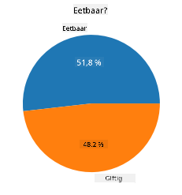
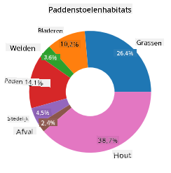
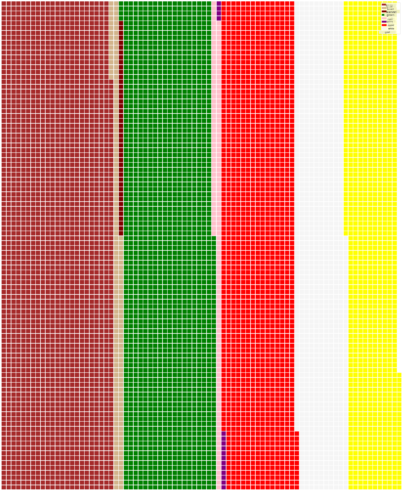

<!--
CO_OP_TRANSLATOR_METADATA:
{
  "original_hash": "af6a12015c6e250e500b570a9fa42593",
  "translation_date": "2025-08-28T15:37:11+00:00",
  "source_file": "3-Data-Visualization/11-visualization-proportions/README.md",
  "language_code": "nl"
}
-->
# Visualiseren van Verhoudingen

| ](../../sketchnotes/11-Visualizing-Proportions.png)|
|:---:|
|Visualiseren van Verhoudingen - _Sketchnote door [@nitya](https://twitter.com/nitya)_ |

In deze les gebruik je een dataset met een focus op de natuur om verhoudingen te visualiseren, zoals hoeveel verschillende soorten paddenstoelen voorkomen in een gegeven dataset over champignons. Laten we deze fascinerende schimmels verkennen met behulp van een dataset van Audubon, die details bevat over 23 soorten plaatjeszwammen in de Agaricus- en Lepiota-families. Je gaat experimenteren met smakelijke visualisaties zoals:

- Taartdiagrammen 🥧  
- Donutdiagrammen 🍩  
- Waffeldiagrammen 🧇  

> 💡 Een heel interessant project genaamd [Charticulator](https://charticulator.com) van Microsoft Research biedt een gratis drag-and-drop-interface voor datavisualisaties. In een van hun tutorials gebruiken ze ook deze champignondataset! Zo kun je de data verkennen en tegelijkertijd de bibliotheek leren kennen: [Charticulator tutorial](https://charticulator.com/tutorials/tutorial4.html).

## [Quiz voorafgaand aan de les](https://purple-hill-04aebfb03.1.azurestaticapps.net/quiz/20)

## Leer je champignons kennen 🍄

Paddenstoelen zijn erg interessant. Laten we een dataset importeren om ze te bestuderen:

```python
import pandas as pd
import matplotlib.pyplot as plt
mushrooms = pd.read_csv('../../data/mushrooms.csv')
mushrooms.head()
```  
Een tabel wordt weergegeven met geweldige gegevens voor analyse:

| class     | cap-shape | cap-surface | cap-color | bruises | odor    | gill-attachment | gill-spacing | gill-size | gill-color | stalk-shape | stalk-root | stalk-surface-above-ring | stalk-surface-below-ring | stalk-color-above-ring | stalk-color-below-ring | veil-type | veil-color | ring-number | ring-type | spore-print-color | population | habitat |
| --------- | --------- | ----------- | --------- | ------- | ------- | --------------- | ------------ | --------- | ---------- | ----------- | ---------- | ------------------------ | ------------------------ | ---------------------- | ---------------------- | --------- | ---------- | ----------- | --------- | ----------------- | ---------- | ------- |
| Giftig    | Convex    | Smooth      | Brown     | Bruises | Pungent | Free            | Close        | Narrow    | Black      | Enlarging   | Equal      | Smooth                   | Smooth                   | White                  | White                  | Partial   | White      | One         | Pendant   | Black             | Scattered  | Urban   |
| Eetbaar   | Convex    | Smooth      | Yellow    | Bruises | Almond  | Free            | Close        | Broad     | Black      | Enlarging   | Club       | Smooth                   | Smooth                   | White                  | White                  | Partial   | White      | One         | Pendant   | Brown             | Numerous   | Grasses |
| Eetbaar   | Bell      | Smooth      | White     | Bruises | Anise   | Free            | Close        | Broad     | Brown      | Enlarging   | Club       | Smooth                   | Smooth                   | White                  | White                  | Partial   | White      | One         | Pendant   | Brown             | Numerous   | Meadows |
| Giftig    | Convex    | Scaly       | White     | Bruises | Pungent | Free            | Close        | Narrow    | Brown      | Enlarging   | Equal      | Smooth                   | Smooth                   | White                  | White                  | Partial   | White      | One         | Pendant   | Black             | Scattered  | Urban   |

Je merkt meteen dat alle gegevens tekstueel zijn. Je zult deze gegevens moeten omzetten om ze in een diagram te kunnen gebruiken. De meeste gegevens worden zelfs weergegeven als een object:

```python
print(mushrooms.select_dtypes(["object"]).columns)
```  

De uitvoer is:

```output
Index(['class', 'cap-shape', 'cap-surface', 'cap-color', 'bruises', 'odor',
       'gill-attachment', 'gill-spacing', 'gill-size', 'gill-color',
       'stalk-shape', 'stalk-root', 'stalk-surface-above-ring',
       'stalk-surface-below-ring', 'stalk-color-above-ring',
       'stalk-color-below-ring', 'veil-type', 'veil-color', 'ring-number',
       'ring-type', 'spore-print-color', 'population', 'habitat'],
      dtype='object')
```  
Neem deze gegevens en converteer de 'class'-kolom naar een categorie:

```python
cols = mushrooms.select_dtypes(["object"]).columns
mushrooms[cols] = mushrooms[cols].astype('category')
```  

```python
edibleclass=mushrooms.groupby(['class']).count()
edibleclass
```  

Als je nu de champignongegevens afdrukt, zie je dat ze zijn gegroepeerd in categorieën op basis van de giftige/eetbare klasse:

|           | cap-shape | cap-surface | cap-color | bruises | odor | gill-attachment | gill-spacing | gill-size | gill-color | stalk-shape | ... | stalk-surface-below-ring | stalk-color-above-ring | stalk-color-below-ring | veil-type | veil-color | ring-number | ring-type | spore-print-color | population | habitat |
| --------- | --------- | ----------- | --------- | ------- | ---- | --------------- | ------------ | --------- | ---------- | ----------- | --- | ------------------------ | ---------------------- | ---------------------- | --------- | ---------- | ----------- | --------- | ----------------- | ---------- | ------- |
| class     |           |             |           |         |      |                 |              |           |            |             |     |                          |                        |                        |           |            |             |           |                   |            |         |
| Eetbaar   | 4208      | 4208        | 4208      | 4208    | 4208 | 4208            | 4208         | 4208      | 4208       | 4208        | ... | 4208                     | 4208                   | 4208                   | 4208      | 4208       | 4208        | 4208      | 4208              | 4208       | 4208    |
| Giftig    | 3916      | 3916        | 3916      | 3916    | 3916 | 3916            | 3916         | 3916      | 3916       | 3916        | ... | 3916                     | 3916                   | 3916                   | 3916      | 3916       | 3916        | 3916      | 3916              | 3916       | 3916    |

Als je de volgorde in deze tabel aanhoudt om je klassenlabels te maken, kun je een taartdiagram maken:

## Taart!

```python
labels=['Edible','Poisonous']
plt.pie(edibleclass['population'],labels=labels,autopct='%.1f %%')
plt.title('Edible?')
plt.show()
```  
Voila, een taartdiagram dat de verhoudingen van deze gegevens laat zien volgens deze twee klassen van champignons. Het is erg belangrijk om de volgorde van de labels correct te krijgen, vooral hier, dus controleer de volgorde waarmee de labelarray is opgebouwd!



## Donuts!

Een iets visueel interessanter taartdiagram is een donutdiagram, wat een taartdiagram is met een gat in het midden. Laten we onze gegevens op deze manier bekijken.

Bekijk de verschillende habitats waar champignons groeien:

```python
habitat=mushrooms.groupby(['habitat']).count()
habitat
```  
Hier groepeer je je gegevens op habitat. Er zijn er 7 vermeld, dus gebruik die als labels voor je donutdiagram:

```python
labels=['Grasses','Leaves','Meadows','Paths','Urban','Waste','Wood']

plt.pie(habitat['class'], labels=labels,
        autopct='%1.1f%%', pctdistance=0.85)
  
center_circle = plt.Circle((0, 0), 0.40, fc='white')
fig = plt.gcf()

fig.gca().add_artist(center_circle)
  
plt.title('Mushroom Habitats')
  
plt.show()
```  



Deze code tekent een diagram en een cirkel in het midden, en voegt die cirkel toe aan het diagram. Pas de breedte van de cirkel aan door `0.40` te wijzigen in een andere waarde.

Donutdiagrammen kunnen op verschillende manieren worden aangepast om de labels te wijzigen. De labels kunnen bijvoorbeeld worden benadrukt voor betere leesbaarheid. Lees meer in de [documentatie](https://matplotlib.org/stable/gallery/pie_and_polar_charts/pie_and_donut_labels.html?highlight=donut).

Nu je weet hoe je je gegevens kunt groeperen en weergeven als een taart- of donutdiagram, kun je andere soorten diagrammen verkennen. Probeer een waffeldiagram, wat gewoon een andere manier is om hoeveelheden te verkennen.

## Wafels!

Een 'waffel'-type diagram is een andere manier om hoeveelheden te visualiseren als een 2D-array van vierkanten. Probeer de verschillende hoeveelheden hoedkleuren van champignons in deze dataset te visualiseren. Hiervoor moet je een hulpbibliotheek genaamd [PyWaffle](https://pypi.org/project/pywaffle/) installeren en Matplotlib gebruiken:

```python
pip install pywaffle
```  

Selecteer een segment van je gegevens om te groeperen:

```python
capcolor=mushrooms.groupby(['cap-color']).count()
capcolor
```  

Maak een waffeldiagram door labels te maken en vervolgens je gegevens te groeperen:

```python
import pandas as pd
import matplotlib.pyplot as plt
from pywaffle import Waffle
  
data ={'color': ['brown', 'buff', 'cinnamon', 'green', 'pink', 'purple', 'red', 'white', 'yellow'],
    'amount': capcolor['class']
     }
  
df = pd.DataFrame(data)
  
fig = plt.figure(
    FigureClass = Waffle,
    rows = 100,
    values = df.amount,
    labels = list(df.color),
    figsize = (30,30),
    colors=["brown", "tan", "maroon", "green", "pink", "purple", "red", "whitesmoke", "yellow"],
)
```  

Met een waffeldiagram kun je duidelijk de verhoudingen van hoedkleuren in deze champignondataset zien. Interessant genoeg zijn er veel champignons met groene hoeden!



✅ PyWaffle ondersteunt iconen binnen de diagrammen die elk pictogram gebruiken dat beschikbaar is in [Font Awesome](https://fontawesome.com/). Experimenteer om een nog interessanter waffeldiagram te maken met iconen in plaats van vierkanten.

In deze les heb je drie manieren geleerd om verhoudingen te visualiseren. Eerst moet je je gegevens groeperen in categorieën en vervolgens beslissen wat de beste manier is om de gegevens weer te geven - taart, donut of wafel. Allemaal zijn ze heerlijk en geven de gebruiker direct een overzicht van een dataset.

## 🚀 Uitdaging

Probeer deze smakelijke diagrammen opnieuw te maken in [Charticulator](https://charticulator.com).  
## [Quiz na de les](https://purple-hill-04aebfb03.1.azurestaticapps.net/quiz/21)

## Herziening & Zelfstudie

Soms is het niet duidelijk wanneer je een taart-, donut- of waffeldiagram moet gebruiken. Hier zijn enkele artikelen om te lezen over dit onderwerp:

https://www.beautiful.ai/blog/battle-of-the-charts-pie-chart-vs-donut-chart  

https://medium.com/@hypsypops/pie-chart-vs-donut-chart-showdown-in-the-ring-5d24fd86a9ce  

https://www.mit.edu/~mbarker/formula1/f1help/11-ch-c6.htm  

https://medium.datadriveninvestor.com/data-visualization-done-the-right-way-with-tableau-waffle-chart-fdf2a19be402  

Doe wat onderzoek om meer informatie te vinden over deze lastige keuze.

## Opdracht

[Probeer het in Excel](assignment.md)  

---

**Disclaimer**:  
Dit document is vertaald met behulp van de AI-vertalingsservice [Co-op Translator](https://github.com/Azure/co-op-translator). Hoewel we streven naar nauwkeurigheid, willen we u erop wijzen dat geautomatiseerde vertalingen fouten of onnauwkeurigheden kunnen bevatten. Het originele document in de oorspronkelijke taal moet worden beschouwd als de gezaghebbende bron. Voor kritieke informatie wordt professionele menselijke vertaling aanbevolen. Wij zijn niet aansprakelijk voor misverstanden of verkeerde interpretaties die voortvloeien uit het gebruik van deze vertaling.