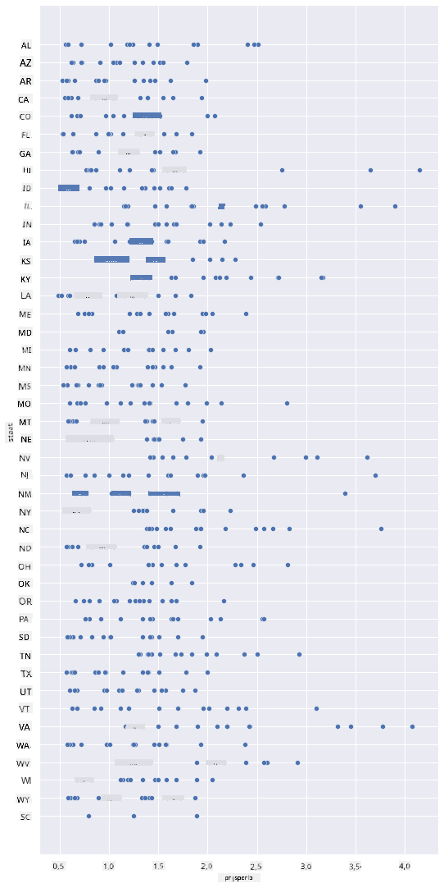
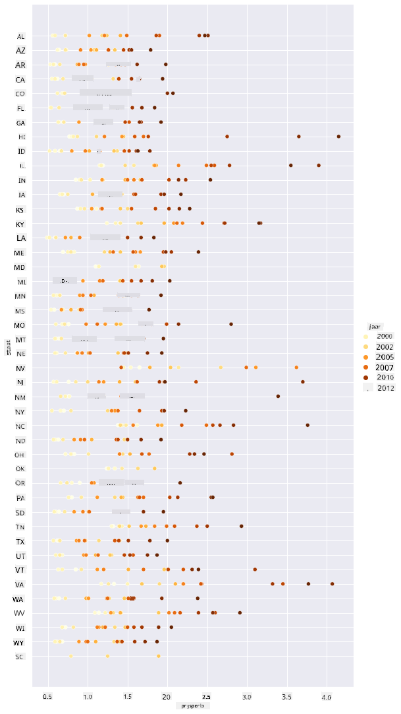
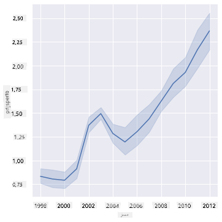
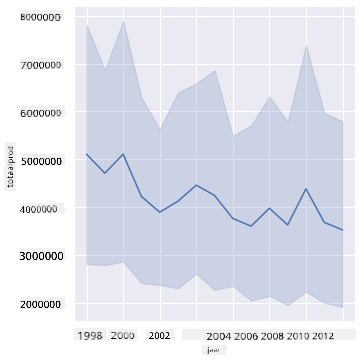
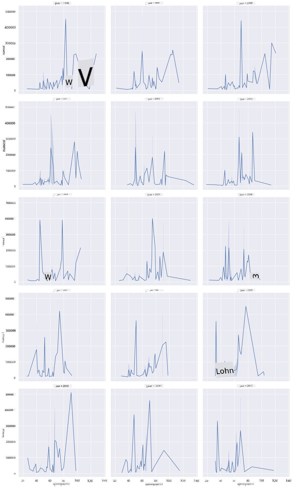
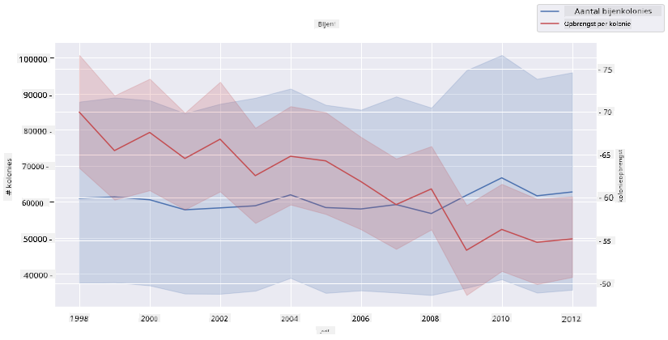

<!--
CO_OP_TRANSLATOR_METADATA:
{
  "original_hash": "cad419b574d5c35eaa417e9abfdcb0c8",
  "translation_date": "2025-08-28T15:42:10+00:00",
  "source_file": "3-Data-Visualization/12-visualization-relationships/README.md",
  "language_code": "nl"
}
-->
# Relaties visualiseren: Alles over honing 🍯

| ](../../sketchnotes/12-Visualizing-Relationships.png)|
|:---:|
|Relaties visualiseren - _Sketchnote door [@nitya](https://twitter.com/nitya)_ |

In lijn met de natuurfocus van ons onderzoek, laten we interessante visualisaties ontdekken om de relaties tussen verschillende soorten honing te tonen, gebaseerd op een dataset afkomstig van het [United States Department of Agriculture](https://www.nass.usda.gov/About_NASS/index.php).

Deze dataset van ongeveer 600 items toont de honingproductie in veel Amerikaanse staten. Je kunt bijvoorbeeld kijken naar het aantal kolonies, opbrengst per kolonie, totale productie, voorraden, prijs per pond en de waarde van de geproduceerde honing in een bepaalde staat van 1998-2012, met één rij per jaar voor elke staat.

Het is interessant om de relatie te visualiseren tussen de productie van een bepaalde staat per jaar en bijvoorbeeld de prijs van honing in die staat. Alternatief kun je de relatie visualiseren tussen de opbrengst per kolonie in verschillende staten. Deze periode omvat de verwoestende 'CCD' of 'Colony Collapse Disorder', die voor het eerst werd waargenomen in 2006 (http://npic.orst.edu/envir/ccd.html), waardoor het een aangrijpende dataset is om te bestuderen. 🐝

## [Quiz voorafgaand aan de les](https://purple-hill-04aebfb03.1.azurestaticapps.net/quiz/22)

In deze les kun je Seaborn gebruiken, een bibliotheek die je al eerder hebt gebruikt, om relaties tussen variabelen te visualiseren. Vooral interessant is het gebruik van de `relplot`-functie van Seaborn, waarmee scatterplots en lijnplots snel '[statistische relaties](https://seaborn.pydata.org/tutorial/relational.html?highlight=relationships)' kunnen visualiseren. Dit stelt de datawetenschapper in staat om beter te begrijpen hoe variabelen zich tot elkaar verhouden.

## Scatterplots

Gebruik een scatterplot om te laten zien hoe de prijs van honing zich jaar na jaar per staat heeft ontwikkeld. Seaborn, met behulp van `relplot`, groepeert handig de gegevens per staat en toont datapunten voor zowel categorische als numerieke gegevens.

Laten we beginnen met het importeren van de gegevens en Seaborn:

```python
import pandas as pd
import matplotlib.pyplot as plt
import seaborn as sns
honey = pd.read_csv('../../data/honey.csv')
honey.head()
```
Je merkt dat de honingdata verschillende interessante kolommen bevat, waaronder jaar en prijs per pond. Laten we deze gegevens verkennen, gegroepeerd per Amerikaanse staat:

| staat | numcol | yieldpercol | totalprod | stocks   | priceperlb | prodvalue | jaar |
| ----- | ------ | ----------- | --------- | -------- | ---------- | --------- | ---- |
| AL    | 16000  | 71          | 1136000   | 159000   | 0.72       | 818000    | 1998 |
| AZ    | 55000  | 60          | 3300000   | 1485000  | 0.64       | 2112000   | 1998 |
| AR    | 53000  | 65          | 3445000   | 1688000  | 0.59       | 2033000   | 1998 |
| CA    | 450000 | 83          | 37350000  | 12326000 | 0.62       | 23157000  | 1998 |
| CO    | 27000  | 72          | 1944000   | 1594000  | 0.7        | 1361000   | 1998 |

Maak een eenvoudige scatterplot om de relatie te tonen tussen de prijs per pond honing en de staat van herkomst. Maak de `y`-as hoog genoeg om alle staten weer te geven:

```python
sns.relplot(x="priceperlb", y="state", data=honey, height=15, aspect=.5);
```


Toon nu dezelfde gegevens met een honingkleurenschema om te laten zien hoe de prijs zich door de jaren heen ontwikkelt. Je kunt dit doen door een 'hue'-parameter toe te voegen om de verandering jaar na jaar te tonen:

> ✅ Lees meer over de [kleurenpaletten die je kunt gebruiken in Seaborn](https://seaborn.pydata.org/tutorial/color_palettes.html) - probeer een prachtig regenboogkleurenschema!

```python
sns.relplot(x="priceperlb", y="state", hue="year", palette="YlOrBr", data=honey, height=15, aspect=.5);
```


Met deze kleurenschemawijziging kun je duidelijk zien dat er een sterke progressie is in de prijs per pond honing door de jaren heen. Als je een steekproef uit de gegevens neemt om dit te verifiëren (kies bijvoorbeeld een bepaalde staat, Arizona), kun je een patroon van prijsstijgingen jaar na jaar zien, met enkele uitzonderingen:

| staat | numcol | yieldpercol | totalprod | stocks  | priceperlb | prodvalue | jaar |
| ----- | ------ | ----------- | --------- | ------- | ---------- | --------- | ---- |
| AZ    | 55000  | 60          | 3300000   | 1485000 | 0.64       | 2112000   | 1998 |
| AZ    | 52000  | 62          | 3224000   | 1548000 | 0.62       | 1999000   | 1999 |
| AZ    | 40000  | 59          | 2360000   | 1322000 | 0.73       | 1723000   | 2000 |
| AZ    | 43000  | 59          | 2537000   | 1142000 | 0.72       | 1827000   | 2001 |
| AZ    | 38000  | 63          | 2394000   | 1197000 | 1.08       | 2586000   | 2002 |
| AZ    | 35000  | 72          | 2520000   | 983000  | 1.34       | 3377000   | 2003 |
| AZ    | 32000  | 55          | 1760000   | 774000  | 1.11       | 1954000   | 2004 |
| AZ    | 36000  | 50          | 1800000   | 720000  | 1.04       | 1872000   | 2005 |
| AZ    | 30000  | 65          | 1950000   | 839000  | 0.91       | 1775000   | 2006 |
| AZ    | 30000  | 64          | 1920000   | 902000  | 1.26       | 2419000   | 2007 |
| AZ    | 25000  | 64          | 1600000   | 336000  | 1.26       | 2016000   | 2008 |
| AZ    | 20000  | 52          | 1040000   | 562000  | 1.45       | 1508000   | 2009 |
| AZ    | 24000  | 77          | 1848000   | 665000  | 1.52       | 2809000   | 2010 |
| AZ    | 23000  | 53          | 1219000   | 427000  | 1.55       | 1889000   | 2011 |
| AZ    | 22000  | 46          | 1012000   | 253000  | 1.79       | 1811000   | 2012 |

Een andere manier om deze progressie te visualiseren is door grootte te gebruiken in plaats van kleur. Voor kleurenblinde gebruikers kan dit een betere optie zijn. Bewerk je visualisatie om een prijsstijging te tonen door een toename in de omtrek van de stippen:

```python
sns.relplot(x="priceperlb", y="state", size="year", data=honey, height=15, aspect=.5);
```
Je kunt zien dat de grootte van de stippen geleidelijk toeneemt.


Is dit een eenvoudig geval van vraag en aanbod? Door factoren zoals klimaatverandering en kolonie-instorting is er misschien minder honing beschikbaar voor aankoop jaar na jaar, en stijgt daardoor de prijs?

Om een correlatie tussen enkele variabelen in deze dataset te ontdekken, laten we enkele lijngrafieken verkennen.

## Lijngrafieken

Vraag: Is er een duidelijke stijging in de prijs van honing per pond jaar na jaar? Je kunt dit het gemakkelijkst ontdekken door een enkele lijngrafiek te maken:

```python
sns.relplot(x="year", y="priceperlb", kind="line", data=honey);
```
Antwoord: Ja, met enkele uitzonderingen rond het jaar 2003:



✅ Omdat Seaborn gegevens rond één lijn aggregeert, toont het "de meerdere metingen bij elke x-waarde door het gemiddelde en het 95% betrouwbaarheidsinterval rond het gemiddelde te plotten". [Bron](https://seaborn.pydata.org/tutorial/relational.html). Dit tijdrovende gedrag kan worden uitgeschakeld door `ci=None` toe te voegen.

Vraag: Kunnen we in 2003 ook een piek zien in de honingvoorraad? Wat als je kijkt naar de totale productie jaar na jaar?

```python
sns.relplot(x="year", y="totalprod", kind="line", data=honey);
```



Antwoord: Niet echt. Als je kijkt naar de totale productie, lijkt deze in dat specifieke jaar zelfs te zijn toegenomen, hoewel de hoeveelheid geproduceerde honing over het algemeen in deze jaren afneemt.

Vraag: Wat zou dan die piek in de honingprijs rond 2003 kunnen hebben veroorzaakt?

Om dit te ontdekken, kun je een facet grid verkennen.

## Facet grids

Facet grids nemen één facet van je dataset (in ons geval kun je 'jaar' kiezen om te voorkomen dat er te veel facetten worden geproduceerd). Seaborn kan vervolgens een plot maken voor elk van die facetten van je gekozen x- en y-coördinaten voor een gemakkelijkere visuele vergelijking. Valt 2003 op in dit soort vergelijking?

Maak een facet grid door `relplot` te blijven gebruiken zoals aanbevolen door [Seaborn's documentatie](https://seaborn.pydata.org/generated/seaborn.FacetGrid.html?highlight=facetgrid#seaborn.FacetGrid).

```python
sns.relplot(
    data=honey, 
    x="yieldpercol", y="numcol",
    col="year", 
    col_wrap=3,
    kind="line"
```
In deze visualisatie kun je de opbrengst per kolonie en het aantal kolonies jaar na jaar vergelijken, naast elkaar met een wrap ingesteld op 3 voor de kolommen:



Voor deze dataset valt er niets bijzonders op met betrekking tot het aantal kolonies en hun opbrengst, jaar na jaar en staat na staat. Is er een andere manier om een correlatie tussen deze twee variabelen te vinden?

## Dubbele-lijnplots

Probeer een meerlijnige plot door twee lijnplots bovenop elkaar te leggen, gebruikmakend van Seaborn's 'despine' om de bovenste en rechter spines te verwijderen, en gebruik `ax.twinx` [afgeleid van Matplotlib](https://matplotlib.org/stable/api/_as_gen/matplotlib.axes.Axes.twinx.html). Twinx maakt het mogelijk om een grafiek de x-as te laten delen en twee y-assen weer te geven. Toon dus de opbrengst per kolonie en het aantal kolonies, bovenop elkaar gelegd:

```python
fig, ax = plt.subplots(figsize=(12,6))
lineplot = sns.lineplot(x=honey['year'], y=honey['numcol'], data=honey, 
                        label = 'Number of bee colonies', legend=False)
sns.despine()
plt.ylabel('# colonies')
plt.title('Honey Production Year over Year');

ax2 = ax.twinx()
lineplot2 = sns.lineplot(x=honey['year'], y=honey['yieldpercol'], ax=ax2, color="r", 
                         label ='Yield per colony', legend=False) 
sns.despine(right=False)
plt.ylabel('colony yield')
ax.figure.legend();
```


Hoewel er rond het jaar 2003 niets opvallends te zien is, eindigen we deze les op een wat vrolijkere noot: hoewel het aantal kolonies over het algemeen afneemt, stabiliseert het aantal kolonies zelfs als hun opbrengst per kolonie afneemt.

Go, bijen, go!

🐝❤️
## 🚀 Uitdaging

In deze les heb je meer geleerd over andere toepassingen van scatterplots en lijnroosters, waaronder facet grids. Daag jezelf uit om een facet grid te maken met een andere dataset, misschien een die je eerder in deze lessen hebt gebruikt. Let op hoe lang het duurt om ze te maken en hoe je voorzichtig moet zijn met hoeveel grids je moet tekenen met deze technieken.
## [Quiz na de les](https://purple-hill-04aebfb03.1.azurestaticapps.net/quiz/23)

## Review & Zelfstudie

Lijnplots kunnen eenvoudig of behoorlijk complex zijn. Lees wat meer in de [Seaborn-documentatie](https://seaborn.pydata.org/generated/seaborn.lineplot.html) over de verschillende manieren waarop je ze kunt bouwen. Probeer de lijnplots die je in deze les hebt gemaakt te verbeteren met andere methoden die in de documentatie worden vermeld.
## Opdracht

[Duik in de bijenkorf](assignment.md)

---

**Disclaimer**:  
Dit document is vertaald met behulp van de AI-vertalingsservice [Co-op Translator](https://github.com/Azure/co-op-translator). Hoewel we streven naar nauwkeurigheid, dient u zich ervan bewust te zijn dat geautomatiseerde vertalingen fouten of onnauwkeurigheden kunnen bevatten. Het originele document in de oorspronkelijke taal moet worden beschouwd als de gezaghebbende bron. Voor kritieke informatie wordt professionele menselijke vertaling aanbevolen. Wij zijn niet aansprakelijk voor misverstanden of verkeerde interpretaties die voortvloeien uit het gebruik van deze vertaling.