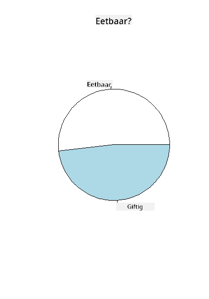
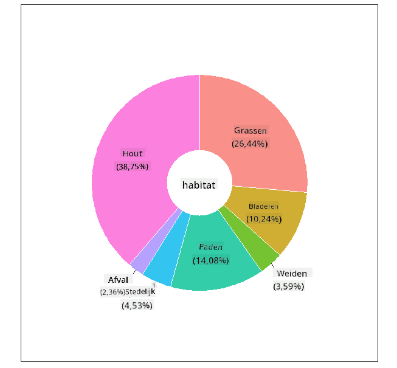
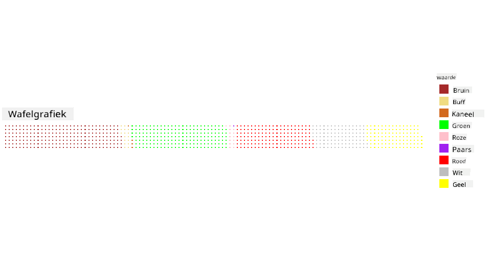

<!--
CO_OP_TRANSLATOR_METADATA:
{
  "original_hash": "47028abaaafa2bcb1079702d20569066",
  "translation_date": "2025-08-28T15:29:11+00:00",
  "source_file": "3-Data-Visualization/R/11-visualization-proportions/README.md",
  "language_code": "nl"
}
-->
# Visualiseren van Verhoudingen

| ](../../../sketchnotes/11-Visualizing-Proportions.png)|
|:---:|
|Visualiseren van Verhoudingen - _Sketchnote door [@nitya](https://twitter.com/nitya)_ |

In deze les gebruik je een dataset met een focus op de natuur om verhoudingen te visualiseren, zoals hoeveel verschillende soorten paddenstoelen voorkomen in een gegeven dataset over champignons. Laten we deze fascinerende schimmels verkennen met een dataset afkomstig van Audubon, waarin details staan over 23 soorten plaatjeszwammen in de Agaricus- en Lepiota-families. Je gaat experimenteren met smakelijke visualisaties zoals:

- Taartdiagrammen 🥧
- Donutdiagrammen 🍩
- Wafeldiagrammen 🧇

> 💡 Een zeer interessant project genaamd [Charticulator](https://charticulator.com) van Microsoft Research biedt een gratis drag-and-drop interface voor datavisualisaties. In een van hun tutorials gebruiken ze ook deze champignon-dataset! Zo kun je de data verkennen en tegelijkertijd de bibliotheek leren kennen: [Charticulator tutorial](https://charticulator.com/tutorials/tutorial4.html).

## [Pre-lecture quiz](https://purple-hill-04aebfb03.1.azurestaticapps.net/quiz/20)

## Leer je champignons kennen 🍄

Champignons zijn erg interessant. Laten we een dataset importeren om ze te bestuderen:

```r
mushrooms = read.csv('../../data/mushrooms.csv')
head(mushrooms)
```
Een tabel wordt weergegeven met geweldige data voor analyse:


| klasse    | hoedvorm  | hoedoppervlak | hoedkleur | kneuzingen | geur     | plaatjesbevestiging | plaatjesafstand | plaatjesgrootte | plaatjeskleur | steelvorm   | steelbasis | steeloppervlak-boven-ring | steeloppervlak-onder-ring | steelkleur-boven-ring | steelkleur-onder-ring | sluier-type | sluierkleur | ring-aantal | ring-type | sporenkleur       | populatie  | habitat |
| --------- | --------- | ------------- | --------- | ---------- | -------- | ------------------- | ---------------- | --------------- | ------------- | ----------- | ---------- | ------------------------ | ------------------------ | --------------------- | --------------------- | ----------- | ----------- | ----------- | --------- | ----------------- | ---------- | ------- |
| Giftig    | Bolvormig | Glad          | Bruin     | Kneuzingen | Scherp   | Vrij               | Dicht            | Smal            | Zwart         | Breder      | Gelijk     | Glad                    | Glad                    | Wit                   | Wit                   | Gedeeltelijk| Wit        | Eén         | Hangend   | Zwart             | Verspreid  | Stedelijk |
| Eetbaar   | Bolvormig | Glad          | Geel      | Kneuzingen | Amandel  | Vrij               | Dicht            | Breed           | Zwart         | Breder      | Knotsvormig| Glad                    | Glad                    | Wit                   | Wit                   | Gedeeltelijk| Wit        | Eén         | Hangend   | Bruin             | Talrijk    | Grasland |
| Eetbaar   | Klokvormig| Glad          | Wit       | Kneuzingen | Anijs    | Vrij               | Dicht            | Breed           | Bruin         | Breder      | Knotsvormig| Glad                    | Glad                    | Wit                   | Wit                   | Gedeeltelijk| Wit        | Eén         | Hangend   | Bruin             | Talrijk    | Weiden |
| Giftig    | Bolvormig | Schilferig    | Wit       | Kneuzingen | Scherp   | Vrij               | Dicht            | Smal            | Bruin         | Breder      | Gelijk     | Glad                    | Glad                    | Wit                   | Wit                   | Gedeeltelijk| Wit        | Eén         | Hangend   | Zwart             | Verspreid  | Stedelijk |
| Eetbaar   | Bolvormig | Glad          | Groen     | Geen kneuzingen | Geen | Vrij               | Dicht            | Breed           | Zwart         | Taps       | Gelijk     | Glad                    | Glad                    | Wit                   | Wit                   | Gedeeltelijk| Wit        | Eén         | Vergankelijk | Bruin             | Overvloedig| Grasland |
| Eetbaar   | Bolvormig | Schilferig    | Geel      | Kneuzingen | Amandel  | Vrij               | Dicht            | Breed           | Bruin         | Breder      | Knotsvormig| Glad                    | Glad                    | Wit                   | Wit                   | Gedeeltelijk| Wit        | Eén         | Hangend   | Zwart             | Talrijk    | Grasland |

Je merkt meteen dat alle data tekstueel is. Je zult deze data moeten converteren om het te kunnen gebruiken in een diagram. De meeste data is feitelijk weergegeven als een object:

```r
names(mushrooms)
```

De output is:

```output
[1] "class"                    "cap.shape"               
 [3] "cap.surface"              "cap.color"               
 [5] "bruises"                  "odor"                    
 [7] "gill.attachment"          "gill.spacing"            
 [9] "gill.size"                "gill.color"              
[11] "stalk.shape"              "stalk.root"              
[13] "stalk.surface.above.ring" "stalk.surface.below.ring"
[15] "stalk.color.above.ring"   "stalk.color.below.ring"  
[17] "veil.type"                "veil.color"              
[19] "ring.number"              "ring.type"               
[21] "spore.print.color"        "population"              
[23] "habitat"            
```
Neem deze data en converteer de 'klasse'-kolom naar een categorie:

```r
library(dplyr)
grouped=mushrooms %>%
  group_by(class) %>%
  summarise(count=n())
```

Nu, als je de champignondata print, kun je zien dat het is gegroepeerd in categorieën volgens de giftige/eetbare klasse:
```r
View(grouped)
```

| klasse    | aantal |
| --------- | ------ |
| Eetbaar   | 4208   |
| Giftig    | 3916   |

Als je de volgorde in deze tabel aanhoudt om je klassecategorie-labels te maken, kun je een taartdiagram bouwen.

## Taart!

```r
pie(grouped$count,grouped$class, main="Edible?")
```
Voila, een taartdiagram dat de verhoudingen van deze data toont volgens deze twee klassen van champignons. Het is erg belangrijk om de volgorde van de labels correct te krijgen, vooral hier, dus zorg ervoor dat je de volgorde controleert waarmee de labelarray is gebouwd!



## Donuts!

Een visueel interessanter taartdiagram is een donutdiagram, wat een taartdiagram is met een gat in het midden. Laten we onze data bekijken met deze methode.

Bekijk de verschillende habitats waar champignons groeien:

```r
library(dplyr)
habitat=mushrooms %>%
  group_by(habitat) %>%
  summarise(count=n())
View(habitat)
```
De output is:
| habitat   | aantal |
| --------- | ------ |
| Grasland  | 2148   |
| Bladeren  | 832    |
| Weiden    | 292    |
| Paden     | 1144   |
| Stedelijk | 368    |
| Afval     | 192    |
| Hout      | 3148   |

Hier groepeer je je data op habitat. Er zijn 7 vermeld, dus gebruik die als labels voor je donutdiagram:

```r
library(ggplot2)
library(webr)
PieDonut(habitat, aes(habitat, count=count))
```



Deze code gebruikt de twee bibliotheken - ggplot2 en webr. Met de PieDonut-functie van de webr-bibliotheek kun je eenvoudig een donutdiagram maken!

Donutdiagrammen in R kunnen ook alleen met de ggplot2-bibliotheek worden gemaakt. Je kunt er meer over leren [hier](https://www.r-graph-gallery.com/128-ring-or-donut-plot.html) en het zelf proberen.

Nu je weet hoe je je data kunt groeperen en weergeven als een taart- of donutdiagram, kun je andere soorten diagrammen verkennen. Probeer een wafeldiagram, wat gewoon een andere manier is om hoeveelheden te verkennen.

## Wafels!

Een 'wafel'-type diagram is een andere manier om hoeveelheden te visualiseren als een 2D-array van vierkanten. Probeer de verschillende hoeveelheden champignonhoedkleuren in deze dataset te visualiseren. Hiervoor moet je een hulpbibliotheek genaamd [waffle](https://cran.r-project.org/web/packages/waffle/waffle.pdf) installeren en gebruiken om je visualisatie te genereren:

```r
install.packages("waffle", repos = "https://cinc.rud.is")
```

Selecteer een segment van je data om te groeperen:

```r
library(dplyr)
cap_color=mushrooms %>%
  group_by(cap.color) %>%
  summarise(count=n())
View(cap_color)
```

Maak een wafeldiagram door labels te maken en vervolgens je data te groeperen:

```r
library(waffle)
names(cap_color$count) = paste0(cap_color$cap.color)
waffle((cap_color$count/10), rows = 7, title = "Waffle Chart")+scale_fill_manual(values=c("brown", "#F0DC82", "#D2691E", "green", 
                                                                                     "pink", "purple", "red", "grey", 
                                                                                     "yellow","white"))
```

Met een wafeldiagram kun je duidelijk de verhoudingen van hoedkleuren in deze champignon-dataset zien. Interessant genoeg zijn er veel champignons met groene hoeden!



In deze les heb je drie manieren geleerd om verhoudingen te visualiseren. Eerst moet je je data groeperen in categorieën en vervolgens beslissen wat de beste manier is om de data weer te geven - taart, donut of wafel. Allemaal zijn ze smakelijk en geven de gebruiker een direct overzicht van een dataset.

## 🚀 Uitdaging

Probeer deze smakelijke diagrammen opnieuw te maken in [Charticulator](https://charticulator.com).

## [Post-lecture quiz](https://purple-hill-04aebfb03.1.azurestaticapps.net/quiz/21)

## Review & Zelfstudie

Soms is het niet duidelijk wanneer je een taart-, donut- of wafeldiagram moet gebruiken. Hier zijn enkele artikelen om hierover te lezen:

https://www.beautiful.ai/blog/battle-of-the-charts-pie-chart-vs-donut-chart

https://medium.com/@hypsypops/pie-chart-vs-donut-chart-showdown-in-the-ring-5d24fd86a9ce

https://www.mit.edu/~mbarker/formula1/f1help/11-ch-c6.htm

https://medium.datadriveninvestor.com/data-visualization-done-the-right-way-with-tableau-waffle-chart-fdf2a19be402

Doe wat onderzoek om meer informatie te vinden over deze lastige beslissing.

## Opdracht

[Probeer het in Excel](assignment.md)

---

**Disclaimer**:  
Dit document is vertaald met behulp van de AI-vertalingsservice [Co-op Translator](https://github.com/Azure/co-op-translator). Hoewel we streven naar nauwkeurigheid, dient u zich ervan bewust te zijn dat geautomatiseerde vertalingen fouten of onnauwkeurigheden kunnen bevatten. Het originele document in de oorspronkelijke taal moet worden beschouwd als de gezaghebbende bron. Voor kritieke informatie wordt professionele menselijke vertaling aanbevolen. Wij zijn niet aansprakelijk voor misverstanden of verkeerde interpretaties die voortvloeien uit het gebruik van deze vertaling.