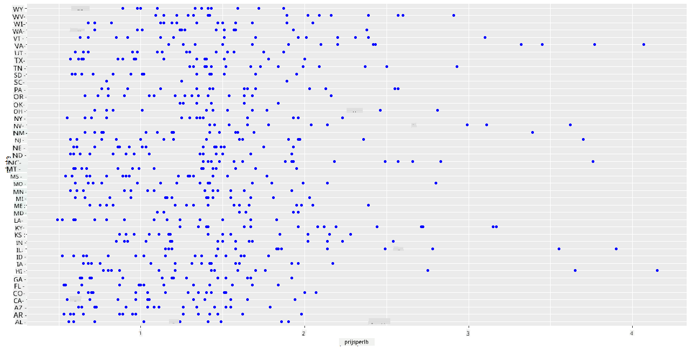

<!--
CO_OP_TRANSLATOR_METADATA:
{
  "original_hash": "a33c5d4b4156a2b41788d8720b6f724c",
  "translation_date": "2025-08-28T15:32:05+00:00",
  "source_file": "3-Data-Visualization/R/12-visualization-relationships/README.md",
  "language_code": "nl"
}
-->
# Relaties Visualiseren: Alles Over Honing 🍯

| ](../../../sketchnotes/12-Visualizing-Relationships.png)|
|:---:|
|Relaties Visualiseren - _Sketchnote door [@nitya](https://twitter.com/nitya)_ |

In navolging van de natuurfocus van ons onderzoek, laten we interessante visualisaties ontdekken om de relaties tussen verschillende soorten honing te laten zien, gebaseerd op een dataset van het [United States Department of Agriculture](https://www.nass.usda.gov/About_NASS/index.php).

Deze dataset, met ongeveer 600 items, toont de honingproductie in veel Amerikaanse staten. Je kunt bijvoorbeeld kijken naar het aantal bijenkolonies, de opbrengst per kolonie, de totale productie, voorraden, prijs per pond en de waarde van de geproduceerde honing in een bepaalde staat van 1998-2012, met één rij per jaar per staat.

Het is interessant om de relatie te visualiseren tussen de productie van een staat per jaar en bijvoorbeeld de honingprijs in die staat. Een andere mogelijkheid is om de opbrengst per kolonie tussen staten te vergelijken. Deze periode omvat ook de verwoestende 'CCD' of 'Colony Collapse Disorder', die voor het eerst werd waargenomen in 2006 (http://npic.orst.edu/envir/ccd.html), wat deze dataset extra betekenisvol maakt. 🐝

## [Quiz vóór de les](https://purple-hill-04aebfb03.1.azurestaticapps.net/quiz/22)

In deze les kun je ggplot2 gebruiken, een bibliotheek die je al eerder hebt gebruikt, om relaties tussen variabelen te visualiseren. Vooral interessant is het gebruik van de `geom_point` en `qplot` functies van ggplot2, waarmee je snel scatterplots en lijndiagrammen kunt maken om '[statistische relaties](https://ggplot2.tidyverse.org/)' te onderzoeken. Dit helpt datawetenschappers om beter te begrijpen hoe variabelen zich tot elkaar verhouden.

## Scatterplots

Gebruik een scatterplot om te laten zien hoe de prijs van honing zich per jaar per staat heeft ontwikkeld. Met ggplot2 kun je, door gebruik te maken van `ggplot` en `geom_point`, de gegevens per staat groeperen en datapunten weergeven voor zowel categorische als numerieke gegevens.

Laten we beginnen met het importeren van de data en Seaborn:

```r
honey=read.csv('../../data/honey.csv')
head(honey)
```
Je merkt dat de honingdata verschillende interessante kolommen bevat, waaronder jaar en prijs per pond. Laten we deze data verkennen, gegroepeerd per Amerikaanse staat:

| staat | numcol | yieldpercol | totalprod | stocks   | priceperlb | prodvalue | jaar |
| ----- | ------ | ----------- | --------- | -------- | ---------- | --------- | ---- |
| AL    | 16000  | 71          | 1136000   | 159000   | 0.72       | 818000    | 1998 |
| AZ    | 55000  | 60          | 3300000   | 1485000  | 0.64       | 2112000   | 1998 |
| AR    | 53000  | 65          | 3445000   | 1688000  | 0.59       | 2033000   | 1998 |
| CA    | 450000 | 83          | 37350000  | 12326000 | 0.62       | 23157000  | 1998 |
| CO    | 27000  | 72          | 1944000   | 1594000  | 0.7        | 1361000   | 1998 |
| FL    | 230000 | 98          |22540000   | 4508000  | 0.64       | 14426000  | 1998 |

Maak een eenvoudige scatterplot om de relatie tussen de prijs per pond honing en de staat van herkomst te laten zien. Zorg ervoor dat de `y`-as hoog genoeg is om alle staten weer te geven:

```r
library(ggplot2)
ggplot(honey, aes(x = priceperlb, y = state)) +
  geom_point(colour = "blue")
```


Laat nu dezelfde data zien met een honingkleurenschema om te laten zien hoe de prijs zich door de jaren heen ontwikkelt. Dit kun je doen door een 'scale_color_gradientn'-parameter toe te voegen om de verandering per jaar weer te geven:

> ✅ Lees meer over de [scale_color_gradientn](https://www.rdocumentation.org/packages/ggplot2/versions/0.9.1/topics/scale_colour_gradientn) - probeer een prachtig regenboogkleurenschema!

```r
ggplot(honey, aes(x = priceperlb, y = state, color=year)) +
  geom_point()+scale_color_gradientn(colours = colorspace::heat_hcl(7))
```


Met deze kleurenschemawijziging kun je duidelijk zien dat er door de jaren heen een sterke stijging is in de prijs per pond honing. Als je een steekproef uit de data neemt om dit te controleren (bijvoorbeeld Arizona), zie je een patroon van prijsstijgingen per jaar, met enkele uitzonderingen:

| staat | numcol | yieldpercol | totalprod | stocks  | priceperlb | prodvalue | jaar |
| ----- | ------ | ----------- | --------- | ------- | ---------- | --------- | ---- |
| AZ    | 55000  | 60          | 3300000   | 1485000 | 0.64       | 2112000   | 1998 |
| AZ    | 52000  | 62          | 3224000   | 1548000 | 0.62       | 1999000   | 1999 |
| AZ    | 40000  | 59          | 2360000   | 1322000 | 0.73       | 1723000   | 2000 |
| AZ    | 43000  | 59          | 2537000   | 1142000 | 0.72       | 1827000   | 2001 |
| AZ    | 38000  | 63          | 2394000   | 1197000 | 1.08       | 2586000   | 2002 |
| AZ    | 35000  | 72          | 2520000   | 983000  | 1.34       | 3377000   | 2003 |
| AZ    | 32000  | 55          | 1760000   | 774000  | 1.11       | 1954000   | 2004 |
| AZ    | 36000  | 50          | 1800000   | 720000  | 1.04       | 1872000   | 2005 |
| AZ    | 30000  | 65          | 1950000   | 839000  | 0.91       | 1775000   | 2006 |
| AZ    | 30000  | 64          | 1920000   | 902000  | 1.26       | 2419000   | 2007 |
| AZ    | 25000  | 64          | 1600000   | 336000  | 1.26       | 2016000   | 2008 |
| AZ    | 20000  | 52          | 1040000   | 562000  | 1.45       | 1508000   | 2009 |
| AZ    | 24000  | 77          | 1848000   | 665000  | 1.52       | 2809000   | 2010 |
| AZ    | 23000  | 53          | 1219000   | 427000  | 1.55       | 1889000   | 2011 |
| AZ    | 22000  | 46          | 1012000   | 253000  | 1.79       | 1811000   | 2012 |

Een andere manier om deze ontwikkeling te visualiseren is door grootte in plaats van kleur te gebruiken. Voor kleurenblinde gebruikers kan dit een betere optie zijn. Pas je visualisatie aan om een prijsstijging te laten zien door een toename in de omtrek van de stippen:

```r
ggplot(honey, aes(x = priceperlb, y = state)) +
  geom_point(aes(size = year),colour = "blue") +
  scale_size_continuous(range = c(0.25, 3))
```
Je ziet dat de grootte van de stippen geleidelijk toeneemt.


Is dit een eenvoudig geval van vraag en aanbod? Door factoren zoals klimaatverandering en het instorten van kolonies is er misschien minder honing beschikbaar, waardoor de prijs jaar na jaar stijgt?

Om een correlatie tussen enkele variabelen in deze dataset te ontdekken, laten we enkele lijndiagrammen verkennen.

## Lijndiagrammen

Vraag: Is er een duidelijke stijging in de prijs van honing per pond door de jaren heen? Dit kun je het gemakkelijkst ontdekken door een enkel lijndiagram te maken:

```r
qplot(honey$year,honey$priceperlb, geom='smooth', span =0.5, xlab = "year",ylab = "priceperlb")
```
Antwoord: Ja, met enkele uitzonderingen rond het jaar 2003:


Vraag: Kunnen we in 2003 ook een piek in de honingvoorraad zien? Wat als je kijkt naar de totale productie door de jaren heen?

```python
qplot(honey$year,honey$totalprod, geom='smooth', span =0.5, xlab = "year",ylab = "totalprod")
```


Antwoord: Niet echt. Als je kijkt naar de totale productie, lijkt deze in dat specifieke jaar zelfs te zijn toegenomen, hoewel de hoeveelheid geproduceerde honing over het algemeen afneemt in deze jaren.

Vraag: Wat zou dan die piek in de honingprijs rond 2003 kunnen hebben veroorzaakt?

Om dit te ontdekken, kun je een facet grid verkennen.

## Facet grids

Facet grids nemen één aspect van je dataset (in ons geval kun je 'jaar' kiezen om te voorkomen dat er te veel facetten worden geproduceerd). Seaborn kan dan een plot maken voor elk van die facetten van je gekozen x- en y-coördinaten voor een eenvoudigere visuele vergelijking. Valt 2003 op in dit soort vergelijking?

Maak een facet grid door gebruik te maken van `facet_wrap`, zoals aanbevolen door de [ggplot2-documentatie](https://ggplot2.tidyverse.org/reference/facet_wrap.html).

```r
ggplot(honey, aes(x=yieldpercol, y = numcol,group = 1)) + 
  geom_line() + facet_wrap(vars(year))
```
In deze visualisatie kun je de opbrengst per kolonie en het aantal kolonies door de jaren heen vergelijken, naast elkaar met een wrap ingesteld op 3 kolommen:


Voor deze dataset valt er niets bijzonders op met betrekking tot het aantal kolonies en hun opbrengst, jaar na jaar en staat na staat. Is er een andere manier om een correlatie tussen deze twee variabelen te vinden?

## Dubbele lijndiagrammen

Probeer een meervoudig lijndiagram door twee lijndiagrammen over elkaar heen te leggen, met behulp van de `par` en `plot` functies van R. We plotten het jaar op de x-as en tonen twee y-assen. Toon de opbrengst per kolonie en het aantal kolonies, over elkaar heen:

```r
par(mar = c(5, 4, 4, 4) + 0.3)              
plot(honey$year, honey$numcol, pch = 16, col = 2,type="l")              
par(new = TRUE)                             
plot(honey$year, honey$yieldpercol, pch = 17, col = 3,              
     axes = FALSE, xlab = "", ylab = "",type="l")
axis(side = 4, at = pretty(range(y2)))      
mtext("colony yield", side = 4, line = 3)   
```


Hoewel er rond 2003 niets opvallends te zien is, eindigen we deze les met een iets positiever noot: hoewel het aantal kolonies over het algemeen afneemt, stabiliseert het aantal kolonies, zelfs als hun opbrengst per kolonie afneemt.

Go, bijen, go!

🐝❤️
## 🚀 Uitdaging

In deze les heb je meer geleerd over andere toepassingen van scatterplots en lijngrafieken, inclusief facet grids. Daag jezelf uit om een facet grid te maken met een andere dataset, misschien een die je eerder in deze lessen hebt gebruikt. Let op hoe lang het duurt om ze te maken en hoe je voorzichtig moet zijn met het aantal grids dat je tekent met deze technieken.
## [Quiz na de les](https://purple-hill-04aebfb03.1.azurestaticapps.net/quiz/23)

## Herhaling & Zelfstudie

Lijndiagrammen kunnen eenvoudig of behoorlijk complex zijn. Lees wat meer in de [ggplot2-documentatie](https://ggplot2.tidyverse.org/reference/geom_path.html#:~:text=geom_line()%20connects%20them%20in,which%20cases%20are%20connected%20together) over de verschillende manieren waarop je ze kunt bouwen. Probeer de lijndiagrammen die je in deze les hebt gemaakt te verbeteren met andere methoden die in de documentatie worden genoemd.
## Opdracht

[Duik in de bijenkorf](assignment.md)

---

**Disclaimer**:  
Dit document is vertaald met behulp van de AI-vertalingsservice [Co-op Translator](https://github.com/Azure/co-op-translator). Hoewel we streven naar nauwkeurigheid, dient u zich ervan bewust te zijn dat geautomatiseerde vertalingen fouten of onnauwkeurigheden kunnen bevatten. Het originele document in zijn oorspronkelijke taal moet worden beschouwd als de gezaghebbende bron. Voor cruciale informatie wordt professionele menselijke vertaling aanbevolen. Wij zijn niet aansprakelijk voor misverstanden of verkeerde interpretaties die voortvloeien uit het gebruik van deze vertaling.