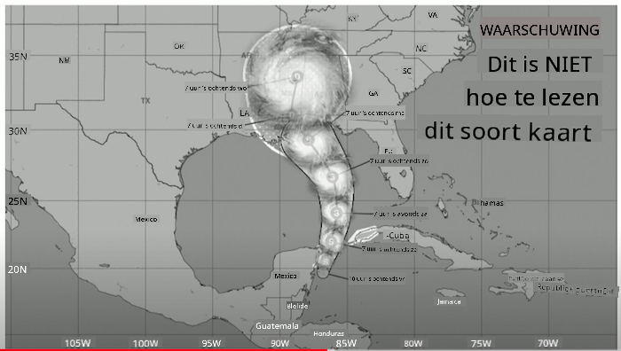
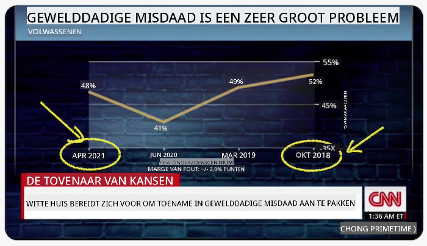
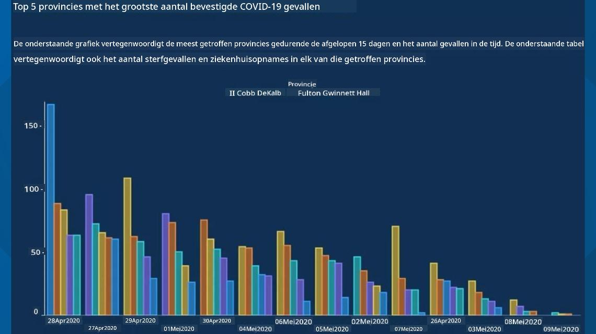
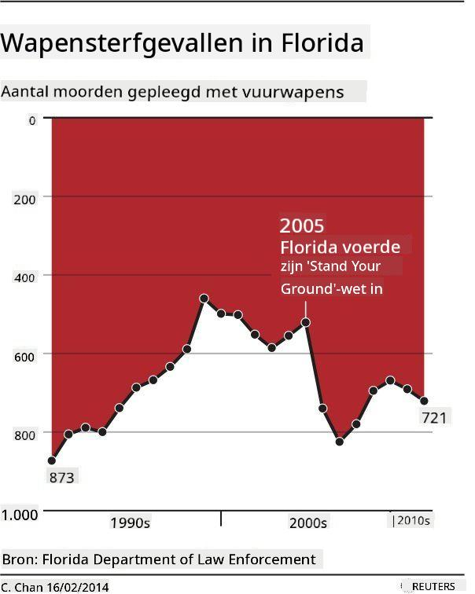
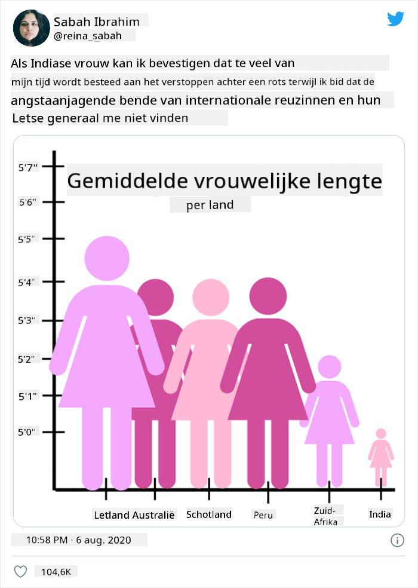
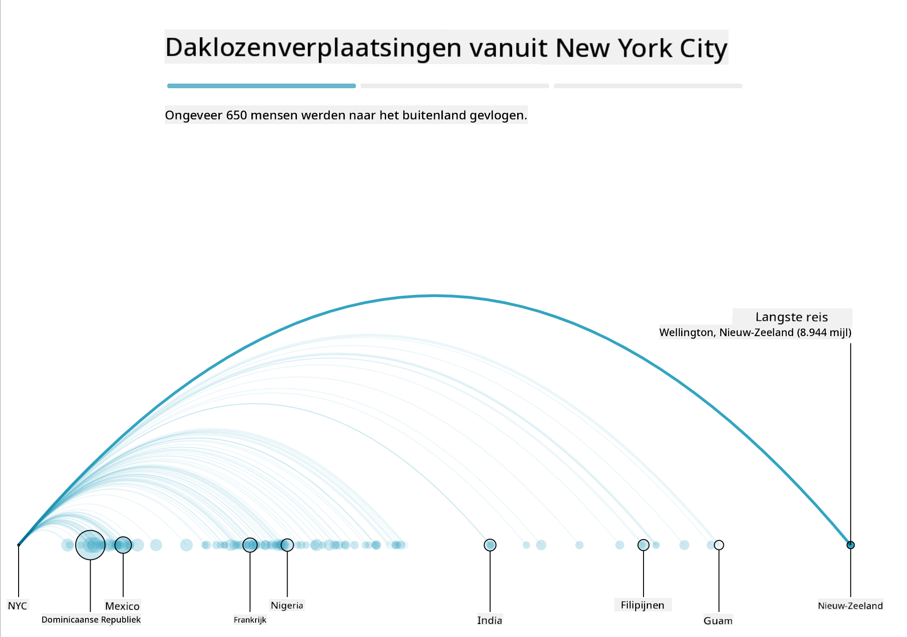
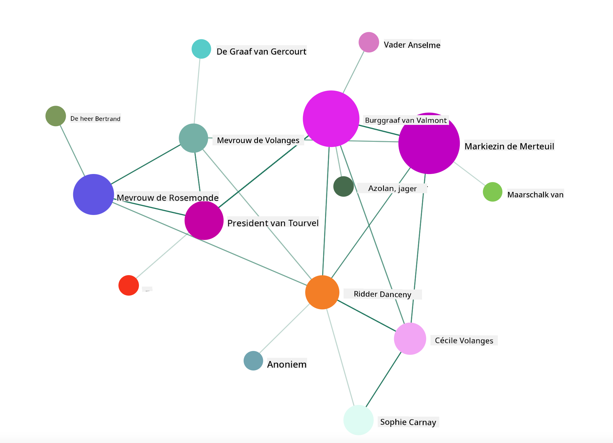

<!--
CO_OP_TRANSLATOR_METADATA:
{
  "original_hash": "b4039f1c76548d144a0aee0bf28304ec",
  "translation_date": "2025-08-28T15:35:47+00:00",
  "source_file": "3-Data-Visualization/R/13-meaningful-vizualizations/README.md",
  "language_code": "nl"
}
-->
# Betekenisvolle Visualisaties Maken

| ](../../../sketchnotes/13-MeaningfulViz.png)|
|:---:|
| Betekenisvolle Visualisaties - _Sketchnote door [@nitya](https://twitter.com/nitya)_ |

> "Als je de data lang genoeg martelt, zal het alles bekennen" -- [Ronald Coase](https://en.wikiquote.org/wiki/Ronald_Coase)

Een van de basisvaardigheden van een datawetenschapper is het vermogen om een betekenisvolle datavisualisatie te maken die helpt vragen te beantwoorden. Voordat je je data visualiseert, moet je ervoor zorgen dat deze is opgeschoond en voorbereid, zoals je in eerdere lessen hebt gedaan. Daarna kun je beginnen met beslissen hoe je de data het beste kunt presenteren.

In deze les leer je:

1. Hoe je het juiste type grafiek kiest
2. Hoe je misleidende grafieken vermijdt
3. Hoe je met kleur werkt
4. Hoe je je grafieken stijlvol en leesbaar maakt
5. Hoe je geanimeerde of 3D-grafieken maakt
6. Hoe je een creatieve visualisatie bouwt

## [Pre-Les Quiz](https://purple-hill-04aebfb03.1.azurestaticapps.net/quiz/24)

## Kies het juiste type grafiek

In eerdere lessen heb je geëxperimenteerd met het maken van allerlei interessante datavisualisaties met behulp van Matplotlib en Seaborn. Over het algemeen kun je het [juiste type grafiek](https://chartio.com/learn/charts/how-to-select-a-data-vizualization/) kiezen voor de vraag die je stelt met behulp van deze tabel:

| Wat je wilt doen:          | Je zou moeten gebruiken:        |
| -------------------------- | ------------------------------- |
| Trends in data over tijd tonen | Lijn                          |
| Categorieën vergelijken    | Staaf, Taart                    |
| Totalen vergelijken        | Taart, Gestapelde Staaf         |
| Relaties tonen             | Spreiding, Lijn, Facet, Dubbele Lijn |
| Verdelingen tonen          | Spreiding, Histogram, Box       |
| Verhoudingen tonen         | Taart, Donut, Wafel             |

> ✅ Afhankelijk van de samenstelling van je data, moet je deze mogelijk omzetten van tekst naar numeriek om een bepaalde grafiek te ondersteunen.

## Vermijd misleiding

Zelfs als een datawetenschapper zorgvuldig het juiste type grafiek kiest, zijn er genoeg manieren waarop data kan worden weergegeven om een punt te bewijzen, vaak ten koste van de integriteit van de data. Er zijn veel voorbeelden van misleidende grafieken en infographics!

[](https://www.youtube.com/watch?v=oX74Nge8Wkw "How charts lie")

> 🎥 Klik op de afbeelding hierboven voor een conferentietoespraak over misleidende grafieken

Deze grafiek keert de X-as om om het tegenovergestelde van de waarheid te tonen, gebaseerd op de datum:



[Deze grafiek](https://media.firstcoastnews.com/assets/WTLV/images/170ae16f-4643-438f-b689-50d66ca6a8d8/170ae16f-4643-438f-b689-50d66ca6a8d8_1140x641.jpg) is nog misleidender, omdat het oog naar rechts wordt getrokken om te concluderen dat COVID-gevallen in de loop van de tijd zijn afgenomen in verschillende provincies. Als je echter goed naar de data kijkt, zie je dat de datums zijn herschikt om die misleidende dalende trend te creëren.



Dit beruchte voorbeeld gebruikt kleur EN een omgekeerde Y-as om te misleiden: in plaats van te concluderen dat het aantal schietincidenten steeg na de invoering van gun-vriendelijke wetgeving, wordt het oog misleid om te denken dat het tegenovergestelde waar is:



Deze vreemde grafiek laat zien hoe verhoudingen kunnen worden gemanipuleerd, met hilarisch effect:



Het vergelijken van onvergelijkbare zaken is nog een schimmige truc. Er is een [geweldige website](https://tylervigen.com/spurious-correlations) over 'spurious correlations' die 'feiten' toont zoals de correlatie tussen het echtscheidingspercentage in Maine en de consumptie van margarine. Een Reddit-groep verzamelt ook de [lelijke toepassingen](https://www.reddit.com/r/dataisugly/top/?t=all) van data.

Het is belangrijk om te begrijpen hoe gemakkelijk het oog kan worden misleid door misleidende grafieken. Zelfs als de intentie van de datawetenschapper goed is, kan de keuze voor een slecht type grafiek, zoals een taartdiagram met te veel categorieën, misleidend zijn.

## Kleur

Je zag in de 'Florida gun violence'-grafiek hierboven hoe kleur een extra laag betekenis kan toevoegen aan grafieken, vooral aan grafieken die niet zijn ontworpen met bibliotheken zoals ggplot2 en RColorBrewer, die verschillende goedgekeurde kleurenbibliotheken en -paletten bevatten. Als je een grafiek met de hand maakt, doe dan wat onderzoek naar [kleurentheorie](https://colormatters.com/color-and-design/basic-color-theory).

> ✅ Houd er rekening mee dat toegankelijkheid een belangrijk aspect is van visualisatie. Sommige gebruikers kunnen kleurenblind zijn - wordt je grafiek goed weergegeven voor gebruikers met visuele beperkingen?

Wees voorzichtig bij het kiezen van kleuren voor je grafiek, omdat kleur een betekenis kan overbrengen die je misschien niet bedoelt. De 'roze dames' in de 'lengte'-grafiek hierboven geven een duidelijk 'vrouwelijke' betekenis die bijdraagt aan de absurditeit van de grafiek zelf.

Hoewel [kleurbetekenis](https://colormatters.com/color-symbolism/the-meanings-of-colors) kan verschillen in verschillende delen van de wereld en de betekenis kan veranderen afhankelijk van de tint, omvatten algemene kleurbetekenissen:

| Kleur   | Betekenis            |
| ------- | -------------------- |
| rood    | kracht               |
| blauw   | vertrouwen, loyaliteit |
| geel    | geluk, voorzichtigheid |
| groen   | ecologie, geluk, jaloezie |
| paars   | geluk                |
| oranje  | levendigheid         |

Als je de taak hebt om een grafiek met aangepaste kleuren te maken, zorg er dan voor dat je grafieken zowel toegankelijk zijn als dat de kleur die je kiest overeenkomt met de betekenis die je wilt overbrengen.

## Stijl je grafieken voor leesbaarheid

Grafieken zijn niet betekenisvol als ze niet leesbaar zijn! Neem even de tijd om de breedte en hoogte van je grafiek te overwegen, zodat deze goed schaalt met je data. Als een variabele (zoals alle 50 staten) moet worden weergegeven, toon ze dan verticaal op de Y-as als dat mogelijk is, om een horizontaal scrollende grafiek te vermijden.

Label je assen, geef een legenda indien nodig, en bied tooltips aan voor een beter begrip van de data.

Als je data tekstueel en uitgebreid is op de X-as, kun je de tekst schuin zetten voor betere leesbaarheid. [plot3D](https://cran.r-project.org/web/packages/plot3D/index.html) biedt 3D-plotmogelijkheden als je data dit ondersteunt. Geavanceerde datavisualisaties kunnen hiermee worden gemaakt.


## Animatie en 3D-grafiekweergave

Sommige van de beste datavisualisaties van vandaag zijn geanimeerd. Shirley Wu heeft geweldige voorbeelden gemaakt met D3, zoals '[film flowers](http://bl.ocks.org/sxywu/raw/d612c6c653fb8b4d7ff3d422be164a5d/)', waarbij elke bloem een visualisatie van een film is. Een ander voorbeeld voor de Guardian is 'bussed out', een interactieve ervaring die visualisaties combineert met Greensock en D3, plus een scrollytelling-artikelformaat om te laten zien hoe NYC omgaat met zijn daklozenprobleem door mensen de stad uit te sturen.



> "Bussed Out: How America Moves its Homeless" van [the Guardian](https://www.theguardian.com/us-news/ng-interactive/2017/dec/20/bussed-out-america-moves-homeless-people-country-study). Visualisaties door Nadieh Bremer & Shirley Wu

Hoewel deze les niet diepgaand genoeg is om deze krachtige visualisatiebibliotheken te leren, kun je experimenteren met D3 in een Vue.js-app door een bibliotheek te gebruiken om een visualisatie van het boek "Dangerous Liaisons" als een geanimeerd sociaal netwerk weer te geven.

> "Les Liaisons Dangereuses" is een briefroman, of een roman gepresenteerd als een reeks brieven. Geschreven in 1782 door Choderlos de Laclos, vertelt het het verhaal van de wrede, moreel failliete sociale manoeuvres van twee rivaliserende protagonisten van de Franse aristocratie in de late 18e eeuw, de Vicomte de Valmont en de Marquise de Merteuil. Beiden komen uiteindelijk aan hun einde, maar niet zonder aanzienlijke sociale schade aan te richten. De roman ontvouwt zich als een reeks brieven geschreven aan verschillende mensen in hun kringen, met plannen voor wraak of simpelweg om problemen te veroorzaken. Maak een visualisatie van deze brieven om de belangrijkste spelers in het verhaal visueel te ontdekken.

Je voltooit een webapp die een geanimeerd overzicht van dit sociale netwerk weergeeft. Het gebruikt een bibliotheek die is gebouwd om een [visualisatie van een netwerk](https://github.com/emiliorizzo/vue-d3-network) te maken met Vue.js en D3. Wanneer de app draait, kun je de knooppunten op het scherm verplaatsen om de data te herschikken.



## Project: Bouw een grafiek om een netwerk te tonen met D3.js

> Deze lesmap bevat een `solution`-map waar je het voltooide project kunt vinden ter referentie.

1. Volg de instructies in het README.md-bestand in de root van de startermap. Zorg ervoor dat je NPM en Node.js op je computer hebt draaien voordat je de afhankelijkheden van je project installeert.

2. Open de map `starter/src`. Je vindt een `assets`-map met daarin een .json-bestand met alle brieven uit de roman, genummerd, met een 'to' en 'from'-annotatie.

3. Voltooi de code in `components/Nodes.vue` om de visualisatie mogelijk te maken. Zoek naar de methode genaamd `createLinks()` en voeg de volgende geneste lus toe.

Loop door het .json-object om de 'to'- en 'from'-data voor de brieven vast te leggen en bouw het `links`-object op zodat de visualisatiebibliotheek het kan gebruiken:

```javascript
//loop through letters
      let f = 0;
      let t = 0;
      for (var i = 0; i < letters.length; i++) {
          for (var j = 0; j < characters.length; j++) {
              
            if (characters[j] == letters[i].from) {
              f = j;
            }
            if (characters[j] == letters[i].to) {
              t = j;
            }
        }
        this.links.push({ sid: f, tid: t });
      }
  ```

Voer je app uit vanuit de terminal (npm run serve) en geniet van de visualisatie!

## 🚀 Uitdaging

Maak een rondje over het internet om misleidende visualisaties te ontdekken. Hoe misleidt de auteur de gebruiker, en is dit opzettelijk? Probeer de visualisaties te corrigeren om te laten zien hoe ze eruit zouden moeten zien.

## [Post-les Quiz](https://purple-hill-04aebfb03.1.azurestaticapps.net/quiz/25)

## Herziening & Zelfstudie

Hier zijn enkele artikelen om te lezen over misleidende datavisualisatie:

https://gizmodo.com/how-to-lie-with-data-visualization-1563576606

http://ixd.prattsi.org/2017/12/visual-lies-usability-in-deceptive-data-visualizations/

Bekijk deze interessante visualisaties van historische objecten en artefacten:

https://handbook.pubpub.org/

Lees dit artikel over hoe animatie je visualisaties kan verbeteren:

https://medium.com/@EvanSinar/use-animation-to-supercharge-data-visualization-cd905a882ad4

## Opdracht

[Bouw je eigen aangepaste visualisatie](assignment.md)

---

**Disclaimer**:  
Dit document is vertaald met behulp van de AI-vertalingsservice [Co-op Translator](https://github.com/Azure/co-op-translator). Hoewel we streven naar nauwkeurigheid, willen we u erop wijzen dat geautomatiseerde vertalingen fouten of onnauwkeurigheden kunnen bevatten. Het originele document in de oorspronkelijke taal moet worden beschouwd als de gezaghebbende bron. Voor kritieke informatie wordt professionele menselijke vertaling aanbevolen. Wij zijn niet aansprakelijk voor misverstanden of verkeerde interpretaties die voortvloeien uit het gebruik van deze vertaling.