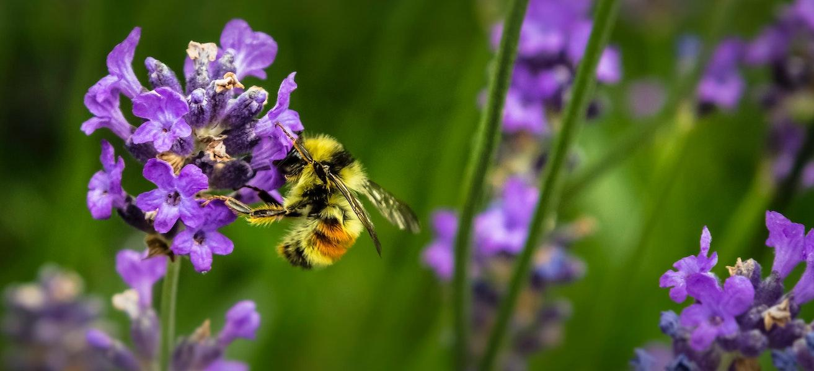

<!--
CO_OP_TRANSLATOR_METADATA:
{
  "original_hash": "1441550a0d789796b2821e04f7f4cc94",
  "translation_date": "2025-08-28T15:28:34+00:00",
  "source_file": "3-Data-Visualization/README.md",
  "language_code": "nl"
}
-->
# Visualisaties

> Foto door <a href="https://unsplash.com/@jenna2980?utm_source=unsplash&utm_medium=referral&utm_content=creditCopyText">Jenna Lee</a> op <a href="https://unsplash.com/s/photos/bees-in-a-meadow?utm_source=unsplash&utm_medium=referral&utm_content=creditCopyText">Unsplash</a>

Het visualiseren van data is een van de belangrijkste taken van een datawetenschapper. Beelden zeggen meer dan duizend woorden, en een visualisatie kan je helpen allerlei interessante aspecten van je data te identificeren, zoals pieken, uitschieters, groeperingen, tendensen en meer, die je kunnen helpen het verhaal van je data te begrijpen.

In deze vijf lessen ga je data uit de natuur verkennen en interessante en mooie visualisaties maken met behulp van verschillende technieken.

| Onderwerp Nummer | Onderwerp | Gelinkte Les | Auteur |
| :--------------: | :-------: | :----------: | :----: |
| 1. | Hoeveelheden visualiseren | <ul> <li> [Python](09-visualization-quantities/README.md)</li>  <li>[R](../../../3-Data-Visualization/R/09-visualization-quantities) </li> </ul>|<ul> <li> [Jen Looper](https://twitter.com/jenlooper)</li><li> [Vidushi Gupta](https://github.com/Vidushi-Gupta)</li> <li>[Jasleen Sondhi](https://github.com/jasleen101010)</li></ul> |
| 2. | Distributie visualiseren | <ul> <li> [Python](10-visualization-distributions/README.md)</li>  <li>[R](../../../3-Data-Visualization/R/10-visualization-distributions) </li> </ul>|<ul> <li> [Jen Looper](https://twitter.com/jenlooper)</li><li> [Vidushi Gupta](https://github.com/Vidushi-Gupta)</li> <li>[Jasleen Sondhi](https://github.com/jasleen101010)</li></ul> |
| 3. | Verhoudingen visualiseren | <ul> <li> [Python](11-visualization-proportions/README.md)</li>  <li>[R](../../../3-Data-Visualization) </li> </ul>|<ul> <li> [Jen Looper](https://twitter.com/jenlooper)</li><li> [Vidushi Gupta](https://github.com/Vidushi-Gupta)</li> <li>[Jasleen Sondhi](https://github.com/jasleen101010)</li></ul> |
| 4. | Relaties visualiseren | <ul> <li> [Python](12-visualization-relationships/README.md)</li>  <li>[R](../../../3-Data-Visualization) </li> </ul>|<ul> <li> [Jen Looper](https://twitter.com/jenlooper)</li><li> [Vidushi Gupta](https://github.com/Vidushi-Gupta)</li> <li>[Jasleen Sondhi](https://github.com/jasleen101010)</li></ul> |
| 5. | Betekenisvolle visualisaties maken | <ul> <li> [Python](13-meaningful-visualizations/README.md)</li>  <li>[R](../../../3-Data-Visualization) </li> </ul>|<ul> <li> [Jen Looper](https://twitter.com/jenlooper)</li><li> [Vidushi Gupta](https://github.com/Vidushi-Gupta)</li> <li>[Jasleen Sondhi](https://github.com/jasleen101010)</li></ul> |

### Credits

Deze visualisatielessen zijn geschreven met 🌸 door [Jen Looper](https://twitter.com/jenlooper), [Jasleen Sondhi](https://github.com/jasleen101010) en [Vidushi Gupta](https://github.com/Vidushi-Gupta).

🍯 Data over de honingproductie in de VS is afkomstig van Jessica Li's project op [Kaggle](https://www.kaggle.com/jessicali9530/honey-production). De [data](https://usda.library.cornell.edu/concern/publications/rn301137d) is afgeleid van het [United States Department of Agriculture](https://www.nass.usda.gov/About_NASS/index.php).

🍄 Data over paddenstoelen is ook afkomstig van [Kaggle](https://www.kaggle.com/hatterasdunton/mushroom-classification-updated-dataset), herzien door Hatteras Dunton. Deze dataset bevat beschrijvingen van hypothetische monsters die overeenkomen met 23 soorten plaatjeszwammen in de Agaricus- en Lepiota-familie. Paddenstoelen getekend uit The Audubon Society Field Guide to North American Mushrooms (1981). Deze dataset werd in 1987 gedoneerd aan UCI ML 27.

🦆 Data over vogels in Minnesota is afkomstig van [Kaggle](https://www.kaggle.com/hannahcollins/minnesota-birds), gescraped van [Wikipedia](https://en.wikipedia.org/wiki/List_of_birds_of_Minnesota) door Hannah Collins.

Al deze datasets zijn gelicenseerd als [CC0: Creative Commons](https://creativecommons.org/publicdomain/zero/1.0/).

---

**Disclaimer**:  
Dit document is vertaald met behulp van de AI-vertalingsservice [Co-op Translator](https://github.com/Azure/co-op-translator). Hoewel we streven naar nauwkeurigheid, willen we u erop wijzen dat geautomatiseerde vertalingen fouten of onnauwkeurigheden kunnen bevatten. Het originele document in de oorspronkelijke taal moet worden beschouwd als de gezaghebbende bron. Voor kritieke informatie wordt professionele menselijke vertaling aanbevolen. Wij zijn niet aansprakelijk voor misverstanden of verkeerde interpretaties die voortvloeien uit het gebruik van deze vertaling.