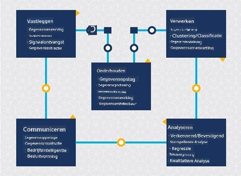
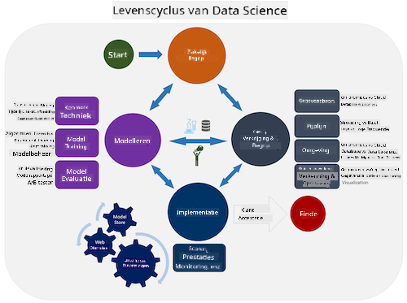
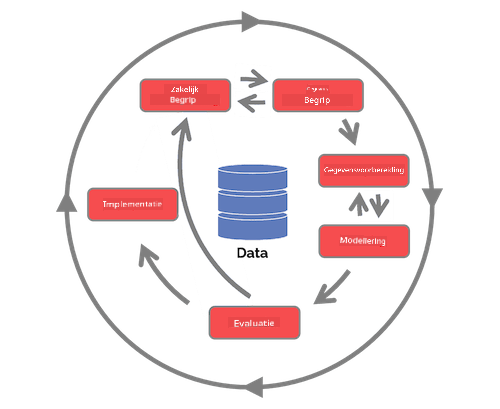

<!--
CO_OP_TRANSLATOR_METADATA:
{
  "original_hash": "07e12a25d20b8f191e3cb651c27fdb2b",
  "translation_date": "2025-09-06T21:15:03+00:00",
  "source_file": "4-Data-Science-Lifecycle/14-Introduction/README.md",
  "language_code": "nl"
}
-->
# Introductie tot de Data Science Lifecycle

| ](../../sketchnotes/14-DataScience-Lifecycle.png)|
|:---:|
| Introductie tot de Data Science Lifecycle - _Sketchnote door [@nitya](https://twitter.com/nitya)_ |

## [Pre-Lecture Quiz](https://ff-quizzes.netlify.app/en/ds/quiz/26)

Op dit punt heb je waarschijnlijk al door dat data science een proces is. Dit proces kan worden onderverdeeld in 5 fasen:

- Vastleggen
- Verwerken
- Analyseren
- Communiceren
- Onderhouden

Deze les richt zich op 3 delen van de lifecycle: vastleggen, verwerken en onderhouden.

  
> Foto door [Berkeley School of Information](https://ischoolonline.berkeley.edu/data-science/what-is-data-science/)

## Vastleggen

De eerste fase van de lifecycle is erg belangrijk, omdat de volgende fasen ervan afhankelijk zijn. Het is eigenlijk twee fasen gecombineerd in één: het verkrijgen van de data en het definiëren van het doel en de problemen die moeten worden aangepakt.  
Het definiëren van de doelen van het project vereist een diepere context van het probleem of de vraag. Eerst moeten we degenen identificeren en betrekken die hun probleem opgelost willen hebben. Dit kunnen belanghebbenden in een bedrijf zijn of sponsors van het project, die kunnen helpen bepalen wie of wat baat heeft bij dit project, evenals wat en waarom ze het nodig hebben. Een goed gedefinieerd doel moet meetbaar en kwantificeerbaar zijn om een acceptabel resultaat te definiëren.

Vragen die een data scientist kan stellen:
- Is dit probleem eerder aangepakt? Wat is er ontdekt?
- Is het doel en de bedoeling duidelijk voor iedereen die betrokken is?
- Is er sprake van ambiguïteit en hoe kan dit worden verminderd?
- Wat zijn de beperkingen?
- Hoe ziet het eindresultaat er mogelijk uit?
- Hoeveel middelen (tijd, mensen, computationele kracht) zijn beschikbaar?

Vervolgens moeten we de benodigde data identificeren, verzamelen en uiteindelijk verkennen om deze gedefinieerde doelen te bereiken. In deze stap van acquisitie moeten data scientists ook de hoeveelheid en kwaliteit van de data evalueren. Dit vereist enige data-exploratie om te bevestigen dat wat is verzameld, zal bijdragen aan het bereiken van het gewenste resultaat.

Vragen die een data scientist kan stellen over de data:
- Welke data is al beschikbaar voor mij?
- Wie is eigenaar van deze data?
- Wat zijn de privacykwesties?
- Heb ik genoeg om dit probleem op te lossen?
- Is de data van acceptabele kwaliteit voor dit probleem?
- Als ik aanvullende informatie ontdek via deze data, moeten we dan overwegen de doelen te wijzigen of opnieuw te definiëren?

## Verwerken

De verwerkingsfase van de lifecycle richt zich op het ontdekken van patronen in de data en het modelleren. Sommige technieken die in deze fase worden gebruikt, vereisen statistische methoden om de patronen te onthullen. Dit zou normaal gesproken een tijdrovende taak zijn voor een mens met een grote dataset en zal daarom afhankelijk zijn van computers om het proces te versnellen. Deze fase is ook waar data science en machine learning elkaar kruisen. Zoals je in de eerste les hebt geleerd, is machine learning het proces van het bouwen van modellen om de data te begrijpen. Modellen zijn een representatie van de relatie tussen variabelen in de data die helpen om uitkomsten te voorspellen.

Veelgebruikte technieken in deze fase worden behandeld in het curriculum ML for Beginners. Volg de links om meer over deze technieken te leren:

- [Classificatie](https://github.com/microsoft/ML-For-Beginners/tree/main/4-Classification): Het organiseren van data in categorieën voor efficiënter gebruik.
- [Clustering](https://github.com/microsoft/ML-For-Beginners/tree/main/5-Clustering): Het groeperen van data in vergelijkbare groepen.
- [Regressie](https://github.com/microsoft/ML-For-Beginners/tree/main/2-Regression): Het bepalen van de relaties tussen variabelen om waarden te voorspellen of te voorspellen.

## Onderhouden

In het diagram van de lifecycle heb je misschien opgemerkt dat onderhoud zich bevindt tussen vastleggen en verwerken. Onderhoud is een doorlopend proces van het beheren, opslaan en beveiligen van de data gedurende het hele project en moet gedurende het hele project in overweging worden genomen.

### Data opslaan

Overwegingen over hoe en waar de data wordt opgeslagen kunnen invloed hebben op de kosten van opslag en de prestaties van hoe snel de data kan worden benaderd. Beslissingen zoals deze worden waarschijnlijk niet alleen door een data scientist genomen, maar ze kunnen wel keuzes maken over hoe ze met de data werken op basis van hoe deze is opgeslagen.

Hier zijn enkele aspecten van moderne dataopslagsystemen die deze keuzes kunnen beïnvloeden:

**On-premise vs off-premise vs publieke of private cloud**

On-premise verwijst naar het hosten en beheren van de data op je eigen apparatuur, zoals het bezitten van een server met harde schijven die de data opslaan, terwijl off-premise afhankelijk is van apparatuur die je niet bezit, zoals een datacenter. De publieke cloud is een populaire keuze voor het opslaan van data die geen kennis vereist van hoe of waar precies de data wordt opgeslagen, waarbij publiek verwijst naar een uniforme onderliggende infrastructuur die wordt gedeeld door iedereen die de cloud gebruikt. Sommige organisaties hebben strikte beveiligingsbeleid die vereisen dat ze volledige toegang hebben tot de apparatuur waar de data wordt gehost en zullen vertrouwen op een private cloud die eigen clouddiensten biedt. Je leert meer over data in de cloud in [latere lessen](https://github.com/microsoft/Data-Science-For-Beginners/tree/main/5-Data-Science-In-Cloud).

**Koude vs warme data**

Bij het trainen van je modellen heb je mogelijk meer trainingsdata nodig. Als je tevreden bent met je model, zal er meer data binnenkomen om een model zijn doel te laten dienen. In elk geval zullen de kosten van het opslaan en benaderen van data toenemen naarmate je meer verzamelt. Het scheiden van zelden gebruikte data, bekend als koude data, van vaak benaderde warme data kan een goedkopere opslagoptie zijn via hardware- of softwarediensten. Als koude data moet worden benaderd, kan het iets langer duren om deze op te halen in vergelijking met warme data.

### Data beheren

Tijdens het werken met data kun je ontdekken dat sommige data moet worden opgeschoond met behulp van technieken die worden behandeld in de les over [data voorbereiding](https://github.com/microsoft/Data-Science-For-Beginners/tree/main/2-Working-With-Data/08-data-preparation) om nauwkeurige modellen te bouwen. Wanneer nieuwe data binnenkomt, zal deze dezelfde toepassingen nodig hebben om consistentie in kwaliteit te behouden. Sommige projecten zullen gebruik maken van een geautomatiseerd hulpmiddel voor het opschonen, aggregeren en comprimeren voordat de data naar de uiteindelijke locatie wordt verplaatst. Azure Data Factory is een voorbeeld van een van deze tools.

### Data beveiligen

Een van de belangrijkste doelen van het beveiligen van data is ervoor zorgen dat degenen die ermee werken controle hebben over wat wordt verzameld en in welke context het wordt gebruikt. Het beveiligen van data houdt in dat toegang wordt beperkt tot alleen degenen die het nodig hebben, dat wordt voldaan aan lokale wetten en regelgeving, en dat ethische normen worden gehandhaafd, zoals behandeld in de [ethiekles](https://github.com/microsoft/Data-Science-For-Beginners/tree/main/1-Introduction/02-ethics).

Hier zijn enkele dingen die een team kan doen met beveiliging in gedachten:
- Bevestigen dat alle data is versleuteld
- Klanten informeren over hoe hun data wordt gebruikt
- Data toegang verwijderen van degenen die het project hebben verlaten
- Alleen bepaalde projectleden toestaan om de data te wijzigen

## 🚀 Uitdaging

Er zijn veel versies van de Data Science Lifecycle, waarbij elke stap verschillende namen en aantallen fasen kan hebben, maar dezelfde processen bevat die in deze les worden genoemd.

Verken de [Team Data Science Process lifecycle](https://docs.microsoft.com/en-us/azure/architecture/data-science-process/lifecycle) en de [Cross-industry standard process for data mining](https://www.datascience-pm.com/crisp-dm-2/). Noem 3 overeenkomsten en verschillen tussen de twee.

|Team Data Science Process (TDSP)|Cross-industry standard process for data mining (CRISP-DM)|
|--|--|
| |  |
| Afbeelding door [Microsoft](https://docs.microsoft.comazure/architecture/data-science-process/lifecycle) | Afbeelding door [Data Science Process Alliance](https://www.datascience-pm.com/crisp-dm-2/) |

## [Post-lecture quiz](https://ff-quizzes.netlify.app/en/ds/quiz/27)

## Review & Zelfstudie

Het toepassen van de Data Science Lifecycle omvat meerdere rollen en taken, waarbij sommige zich richten op specifieke delen van elke fase. Het Team Data Science Process biedt een aantal bronnen die de soorten rollen en taken uitleggen die iemand in een project kan hebben.

* [Team Data Science Process rollen en taken](https://docs.microsoft.com/en-us/azure/architecture/data-science-process/roles-tasks)  
* [Uitvoeren van data science taken: exploratie, modellering en implementatie](https://docs.microsoft.com/en-us/azure/architecture/data-science-process/execute-data-science-tasks)

## Opdracht

[Een dataset beoordelen](assignment.md)

---

**Disclaimer**:  
Dit document is vertaald met behulp van de AI-vertalingsservice [Co-op Translator](https://github.com/Azure/co-op-translator). Hoewel we streven naar nauwkeurigheid, willen we u erop wijzen dat geautomatiseerde vertalingen fouten of onnauwkeurigheden kunnen bevatten. Het originele document in de oorspronkelijke taal moet worden beschouwd als de gezaghebbende bron. Voor kritieke informatie wordt professionele menselijke vertaling aanbevolen. Wij zijn niet aansprakelijk voor misverstanden of verkeerde interpretaties die voortvloeien uit het gebruik van deze vertaling.