<!--
CO_OP_TRANSLATOR_METADATA:
{
  "original_hash": "39f3b3a9d873eaa522c2e792ce0ca503",
  "translation_date": "2025-09-04T19:47:43+00:00",
  "source_file": "5-Data-Science-In-Cloud/18-Low-Code/README.md",
  "language_code": "nl"
}
-->
# Datawetenschap in de Cloud: De "Low code/No code" aanpak

| ](../../sketchnotes/18-DataScience-Cloud.png)|
|:---:|
| Datawetenschap in de Cloud: Low Code - _Sketchnote door [@nitya](https://twitter.com/nitya)_ |

Inhoudsopgave:

- [Datawetenschap in de Cloud: De "Low code/No code" aanpak](../../../../5-Data-Science-In-Cloud/18-Low-Code)
  - [Pre-Lecture quiz](../../../../5-Data-Science-In-Cloud/18-Low-Code)
  - [1. Introductie](../../../../5-Data-Science-In-Cloud/18-Low-Code)
    - [1.1 Wat is Azure Machine Learning?](../../../../5-Data-Science-In-Cloud/18-Low-Code)
    - [1.2 Het Hartfalen Voorspellingsproject:](../../../../5-Data-Science-In-Cloud/18-Low-Code)
    - [1.3 De Hartfalen Dataset:](../../../../5-Data-Science-In-Cloud/18-Low-Code)
  - [2. Low code/No code training van een model in Azure ML Studio](../../../../5-Data-Science-In-Cloud/18-Low-Code)
    - [2.1 Een Azure ML-werkruimte maken](../../../../5-Data-Science-In-Cloud/18-Low-Code)
    - [2.2 Compute Resources](../../../../5-Data-Science-In-Cloud/18-Low-Code)
      - [2.2.1 De juiste opties kiezen voor je compute resources](../../../../5-Data-Science-In-Cloud/18-Low-Code)
      - [2.2.2 Een compute cluster maken](../../../../5-Data-Science-In-Cloud/18-Low-Code)
    - [2.3 De dataset laden](../../../../5-Data-Science-In-Cloud/18-Low-Code)
    - [2.4 Low code/No Code training met AutoML](../../../../5-Data-Science-In-Cloud/18-Low-Code)
  - [3. Low code/No Code modelimplementatie en endpointgebruik](../../../../5-Data-Science-In-Cloud/18-Low-Code)
    - [3.1 Modelimplementatie](../../../../5-Data-Science-In-Cloud/18-Low-Code)
    - [3.2 Endpointgebruik](../../../../5-Data-Science-In-Cloud/18-Low-Code)
  - [🚀 Uitdaging](../../../../5-Data-Science-In-Cloud/18-Low-Code)
  - [Post-Lecture Quiz](../../../../5-Data-Science-In-Cloud/18-Low-Code)
  - [Review & Zelfstudie](../../../../5-Data-Science-In-Cloud/18-Low-Code)
  - [Opdracht](../../../../5-Data-Science-In-Cloud/18-Low-Code)
  
## [Pre-Lecture quiz](https://ff-quizzes.netlify.app/en/ds/)

## 1. Introductie
### 1.1 Wat is Azure Machine Learning?

Het Azure-cloudplatform bestaat uit meer dan 200 producten en clouddiensten die zijn ontworpen om je te helpen nieuwe oplossingen tot leven te brengen. Datawetenschappers besteden veel tijd aan het verkennen en voorbewerken van data, en het testen van verschillende soorten modeltrainingsalgoritmes om nauwkeurige modellen te produceren. Deze taken kosten veel tijd en maken vaak inefficiënt gebruik van dure computerhardware.

[Azure ML](https://docs.microsoft.com/azure/machine-learning/overview-what-is-azure-machine-learning?WT.mc_id=academic-77958-bethanycheum&ocid=AID3041109) is een cloudgebaseerd platform voor het bouwen en beheren van machine learning-oplossingen in Azure. Het biedt een breed scala aan functies en mogelijkheden die datawetenschappers helpen bij het voorbereiden van data, trainen van modellen, publiceren van voorspellende diensten en het monitoren van gebruik. Het belangrijkste is dat het hun efficiëntie verhoogt door veel van de tijdrovende taken die gepaard gaan met het trainen van modellen te automatiseren. Bovendien stelt het hen in staat om gebruik te maken van schaalbare cloudgebaseerde compute resources, die grote hoeveelheden data aankunnen en alleen kosten maken wanneer ze daadwerkelijk worden gebruikt.

Azure ML biedt alle tools die ontwikkelaars en datawetenschappers nodig hebben voor hun machine learning-workflows. Deze omvatten:

- **Azure Machine Learning Studio**: een webportaal in Azure Machine Learning voor low-code en no-code opties voor modeltraining, implementatie, automatisering, tracking en assetbeheer. De studio integreert met de Azure Machine Learning SDK voor een naadloze ervaring.
- **Jupyter Notebooks**: snel prototypen en testen van ML-modellen.
- **Azure Machine Learning Designer**: modules slepen en neerzetten om experimenten te bouwen en vervolgens pipelines te implementeren in een low-code omgeving.
- **Automated machine learning UI (AutoML)**: automatiseert iteratieve taken van machine learning-modelontwikkeling, waardoor ML-modellen met hoge schaal, efficiëntie en productiviteit kunnen worden gebouwd, terwijl de modelkwaliteit behouden blijft.
- **Data Labelling**: een ondersteunde ML-tool om data automatisch te labelen.
- **Machine learning-extensie voor Visual Studio Code**: biedt een volledige ontwikkelomgeving voor het bouwen en beheren van ML-projecten.
- **Machine learning CLI**: biedt opdrachten voor het beheren van Azure ML-resources via de commandoregel.
- **Integratie met open-source frameworks** zoals PyTorch, TensorFlow, Scikit-learn en vele anderen voor het trainen, implementeren en beheren van het end-to-end machine learning-proces.
- **MLflow**: een open-source bibliotheek voor het beheren van de levenscyclus van je machine learning-experimenten. **MLFlow Tracking** is een component van MLflow dat je trainingsrun-metrics en modelartefacten logt en bijhoudt, ongeacht de omgeving van je experiment.

### 1.2 Het Hartfalen Voorspellingsproject:

Er is geen twijfel dat het maken en bouwen van projecten de beste manier is om je vaardigheden en kennis te testen. In deze les gaan we twee verschillende manieren verkennen om een datawetenschapsproject te bouwen voor het voorspellen van hartfalenaanvallen in Azure ML Studio, via Low code/No code en via de Azure ML SDK zoals weergegeven in het volgende schema:

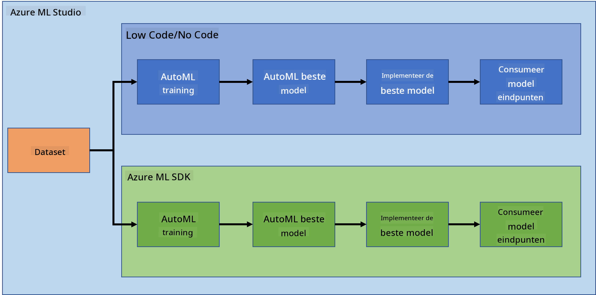

Elke methode heeft zijn eigen voor- en nadelen. De Low code/No code aanpak is eenvoudiger om mee te beginnen, omdat het gebruik maakt van een GUI (Graphical User Interface) en geen voorkennis van code vereist. Deze methode maakt snelle tests van de haalbaarheid van het project mogelijk en het creëren van een POC (Proof Of Concept). Echter, naarmate het project groeit en productie klaar moet zijn, is het niet haalbaar om resources via een GUI te creëren. We moeten alles programmatisch automatiseren, van het creëren van resources tot het implementeren van een model. Dit is waar kennis van de Azure ML SDK cruciaal wordt.

|                   | Low code/No code | Azure ML SDK              |
|-------------------|------------------|---------------------------|
| Expertise in code | Niet vereist     | Vereist                   |
| Ontwikkeltijd     | Snel en eenvoudig| Afhankelijk van codekennis|
| Productieklaar    | Nee              | Ja                        |

### 1.3 De Hartfalen Dataset: 

Hart- en vaatziekten (CVD's) zijn wereldwijd de belangrijkste doodsoorzaak, goed voor 31% van alle sterfgevallen. Omgevings- en gedragsrisicofactoren zoals tabaksgebruik, ongezonde voeding en obesitas, lichamelijke inactiviteit en schadelijk alcoholgebruik kunnen worden gebruikt als kenmerken voor schattingsmodellen. Het kunnen inschatten van de kans op het ontwikkelen van een CVD kan van groot nut zijn om aanvallen bij mensen met een hoog risico te voorkomen.

Kaggle heeft een [Hartfalen dataset](https://www.kaggle.com/andrewmvd/heart-failure-clinical-data) openbaar beschikbaar gesteld, die we gaan gebruiken voor dit project. Je kunt de dataset nu downloaden. Dit is een tabelvormige dataset met 13 kolommen (12 kenmerken en 1 doelvariabele) en 299 rijen. 

|    | Variabelenaam             | Type            | Beschrijving                                               | Voorbeeld         |
|----|---------------------------|-----------------|-----------------------------------------------------------|-------------------|
| 1  | age                       | numeriek        | Leeftijd van de patiënt                                    | 25                |
| 2  | anaemia                   | boolean         | Vermindering van rode bloedcellen of hemoglobine          | 0 of 1            |
| 3  | creatinine_phosphokinase  | numeriek        | Niveau van CPK-enzym in het bloed                         | 542               |
| 4  | diabetes                  | boolean         | Of de patiënt diabetes heeft                              | 0 of 1            |
| 5  | ejection_fraction         | numeriek        | Percentage bloed dat het hart verlaat bij elke contractie | 45                |
| 6  | high_blood_pressure       | boolean         | Of de patiënt hypertensie heeft                           | 0 of 1            |
| 7  | platelets                 | numeriek        | Bloedplaatjes in het bloed                                | 149000            |
| 8  | serum_creatinine          | numeriek        | Niveau van serumcreatinine in het bloed                   | 0.5               |
| 9  | serum_sodium              | numeriek        | Niveau van serumnatrium in het bloed                      | jun               |
| 10 | sex                       | boolean         | Vrouw of man                                              | 0 of 1            |
| 11 | smoking                   | boolean         | Of de patiënt rookt                                       | 0 of 1            |
| 12 | time                      | numeriek        | Follow-up periode (dagen)                                 | 4                 |
|----|---------------------------|-----------------|-----------------------------------------------------------|-------------------|
| 21 | DEATH_EVENT [Doel]        | boolean         | Of de patiënt overlijdt tijdens de follow-up periode      | 0 of 1            |

Zodra je de dataset hebt, kunnen we beginnen met het project in Azure.

## 2. Low code/No code training van een model in Azure ML Studio
### 2.1 Een Azure ML-werkruimte maken
Om een model te trainen in Azure ML moet je eerst een Azure ML-werkruimte maken. De werkruimte is de top-level resource voor Azure Machine Learning en biedt een gecentraliseerde plek om te werken met alle artefacten die je maakt wanneer je Azure Machine Learning gebruikt. De werkruimte houdt een geschiedenis bij van alle trainingsruns, inclusief logs, metrics, output en een snapshot van je scripts. Je gebruikt deze informatie om te bepalen welke trainingsrun het beste model produceert. [Meer informatie](https://docs.microsoft.com/azure/machine-learning/concept-workspace?WT.mc_id=academic-77958-bethanycheum&ocid=AID3041109)

Het wordt aanbevolen om de meest up-to-date browser te gebruiken die compatibel is met je besturingssysteem. De volgende browsers worden ondersteund:

- Microsoft Edge (De nieuwe Microsoft Edge, nieuwste versie. Niet Microsoft Edge legacy)
- Safari (nieuwste versie, alleen Mac)
- Chrome (nieuwste versie)
- Firefox (nieuwste versie)

Om Azure Machine Learning te gebruiken, maak je een werkruimte in je Azure-abonnement. Je kunt deze werkruimte vervolgens gebruiken om data, compute resources, code, modellen en andere artefacten met betrekking tot je machine learning-workloads te beheren.

> **_LET OP:_** Je Azure-abonnement wordt een klein bedrag in rekening gebracht voor dat opslag zolang de Azure Machine Learning-werkruimte bestaat in je abonnement. We raden je daarom aan om de Azure Machine Learning-werkruimte te verwijderen wanneer je deze niet meer gebruikt.

1. Log in op het [Azure-portaal](https://ms.portal.azure.com/) met de Microsoft-gegevens die zijn gekoppeld aan je Azure-abonnement.
2. Selecteer **＋Een resource maken**
   
   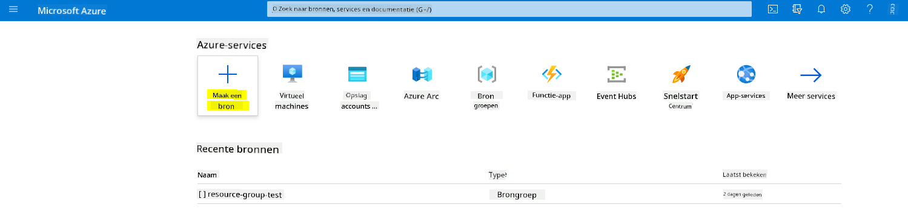

   Zoek naar Machine Learning en selecteer de tegel Machine Learning

   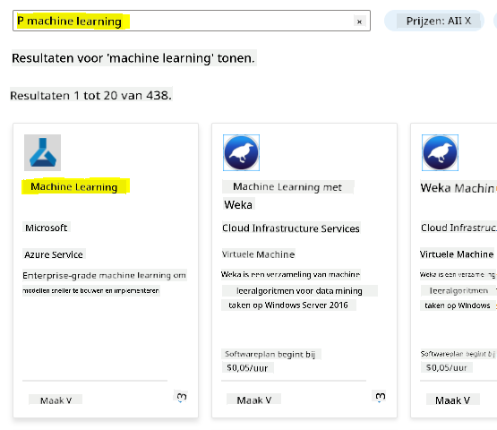

   Klik op de knop "maken"

   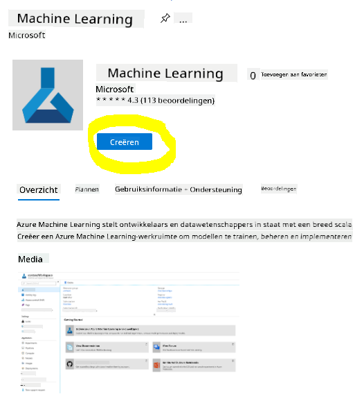

   Vul de instellingen in zoals volgt:
   - Abonnement: Je Azure-abonnement
   - Resourcegroep: Maak of selecteer een resourcegroep
   - Werkruimte naam: Voer een unieke naam in voor je werkruimte
   - Regio: Selecteer de geografische regio die het dichtst bij je ligt
   - Opslagaccount: Let op het standaard nieuwe opslagaccount dat wordt gemaakt voor je werkruimte
   - Key vault: Let op de standaard nieuwe key vault die wordt gemaakt voor je werkruimte
   - Application insights: Let op de standaard nieuwe application insights resource die wordt gemaakt voor je werkruimte
   - Container registry: Geen (er wordt automatisch een gemaakt de eerste keer dat je een model implementeert in een container)

    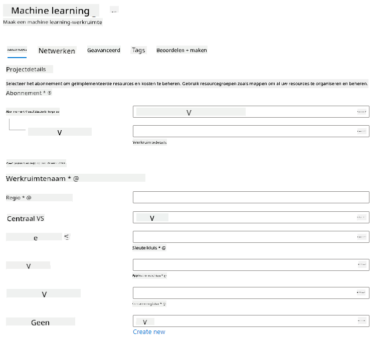

   - Klik op "creëren + beoordelen" en vervolgens op de knop "creëren"
3. Wacht tot je werkruimte is gemaakt (dit kan enkele minuten duren). Ga vervolgens naar de werkruimte in het portaal. Je kunt deze vinden via de Azure Machine Learning-service.
4. Op de overzichtspagina van je werkruimte, start je Azure Machine Learning Studio (of open een nieuwe browser tab en navigeer naar https://ml.azure.com), en log in op Azure Machine Learning Studio met je Microsoft-account. Selecteer indien nodig je Azure-directory en abonnement, en je Azure Machine Learning-werkruimte.
   
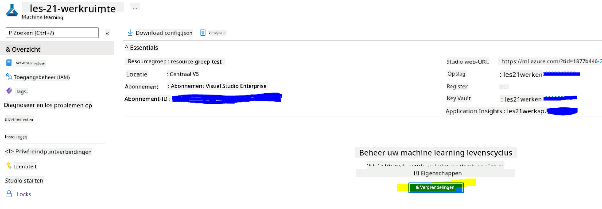

5. In Azure Machine Learning Studio, schakel je het ☰-icoon linksboven in om de verschillende pagina's in de interface te bekijken. Je kunt deze pagina's gebruiken om de resources in je werkruimte te beheren.

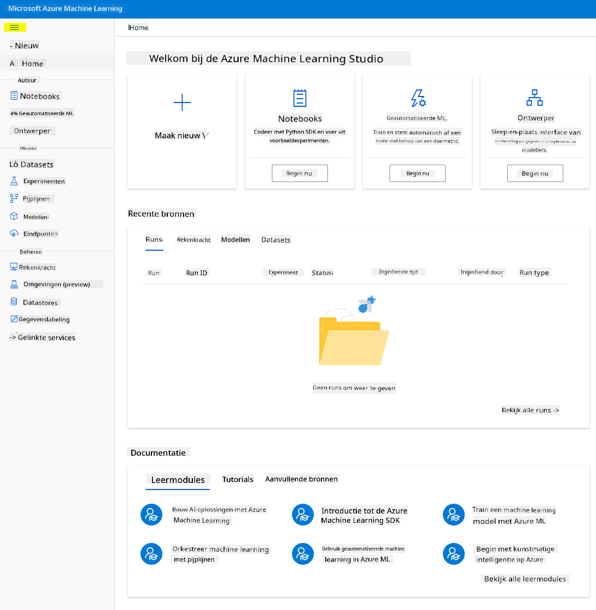

Je kunt je werkruimte beheren via het Azure-portaal, maar voor datawetenschappers en Machine Learning operations engineers biedt Azure Machine Learning Studio een meer gerichte gebruikersinterface voor het beheren van werkruimteresources.

### 2.2 Compute Resources

Compute Resources zijn cloudgebaseerde resources waarop je modeltraining en data-exploratieprocessen kunt uitvoeren. Er zijn vier soorten compute resources die je kunt maken:

- **Compute Instances**: Ontwikkelwerkstations die datawetenschappers kunnen gebruiken om met data en modellen te werken. Dit omvat het maken van een Virtual Machine (VM) en het starten van een notebook-instantie. Je kunt vervolgens een model trainen door een compute cluster aan te roepen vanuit de notebook.
- **Compute Clusters**: Schaalbare clusters van VM's voor on-demand verwerking van experimentcode. Je hebt dit nodig bij het trainen van een model. Compute clusters kunnen ook gespecialiseerde GPU- of CPU-resources gebruiken.
- **Inference Clusters**: Implementatiedoelen voor voorspellende diensten die je getrainde modellen gebruiken.
- **Aangesloten Compute**: Verwijzingen naar bestaande Azure compute-resources, zoals Virtual Machines of Azure Databricks-clusters.

#### 2.2.1 De juiste opties kiezen voor je compute-resources

Er zijn enkele belangrijke factoren om te overwegen bij het creëren van een compute-resource, en deze keuzes kunnen cruciale beslissingen zijn.

**Heb je een CPU of GPU nodig?**

Een CPU (Central Processing Unit) is de elektronische schakeling die instructies uitvoert die een computerprogramma vormen. Een GPU (Graphics Processing Unit) is een gespecialiseerde elektronische schakeling die grafisch gerelateerde code op een zeer hoge snelheid kan uitvoeren.

Het belangrijkste verschil tussen CPU- en GPU-architectuur is dat een CPU is ontworpen om een breed scala aan taken snel uit te voeren (gemeten aan de kloksnelheid van de CPU), maar beperkt is in de gelijktijdigheid van taken die kunnen worden uitgevoerd. GPU's zijn ontworpen voor parallelle verwerking en zijn daarom veel beter geschikt voor deep learning-taken.

| CPU                                     | GPU                         |
|-----------------------------------------|-----------------------------|
| Minder duur                             | Duurder                    |
| Lager niveau van gelijktijdigheid       | Hoger niveau van gelijktijdigheid |
| Langzamer bij het trainen van deep learning-modellen | Optimaal voor deep learning   |

**Cluster Grootte**

Grotere clusters zijn duurder, maar zorgen voor betere responsiviteit. Dus, als je tijd hebt maar niet genoeg geld, kun je beginnen met een klein cluster. Omgekeerd, als je geld hebt maar niet veel tijd, kun je beginnen met een groter cluster.

**VM Grootte**

Afhankelijk van je tijd en budgettaire beperkingen kun je de grootte van je RAM, schijf, aantal cores en kloksnelheid variëren. Het verhogen van al deze parameters zal duurder zijn, maar zal resulteren in betere prestaties.

**Dedicated of Low-Priority Instances?**

Een low-priority instance betekent dat deze onderbreekbaar is: Microsoft Azure kan deze resources nemen en toewijzen aan een andere taak, waardoor een job wordt onderbroken. Een dedicated instance, of niet-onderbreekbaar, betekent dat de job nooit zonder jouw toestemming wordt beëindigd. Dit is een andere afweging tussen tijd en geld, aangezien onderbreekbare instances goedkoper zijn dan dedicated instances.

#### 2.2.2 Een compute-cluster maken

In de [Azure ML-werkruimte](https://ml.azure.com/) die we eerder hebben gemaakt, ga naar compute en je zult de verschillende compute-resources zien die we zojuist hebben besproken (zoals compute-instances, compute-clusters, inference-clusters en aangesloten compute). Voor dit project hebben we een compute-cluster nodig voor modeltraining. Klik in de Studio op het menu "Compute", vervolgens op het tabblad "Compute cluster" en klik op de knop "+ Nieuw" om een compute-cluster te maken.

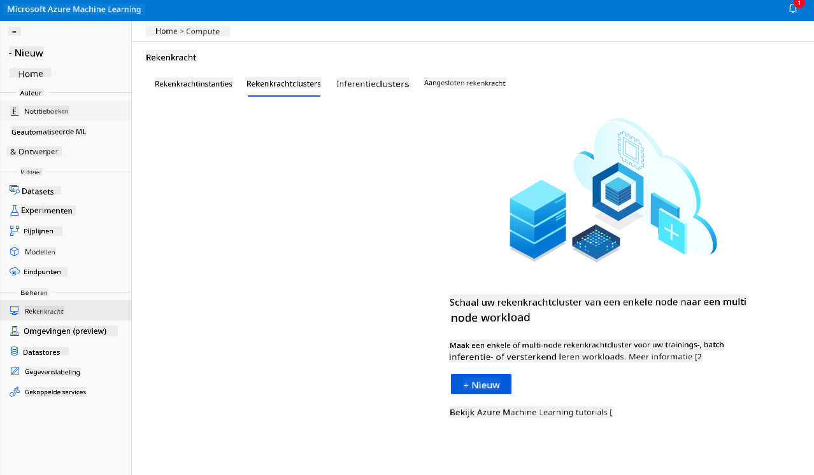

1. Kies je opties: Dedicated vs Low priority, CPU of GPU, VM-grootte en aantal cores (je kunt de standaardinstellingen behouden voor dit project).
2. Klik op de knop Volgende.

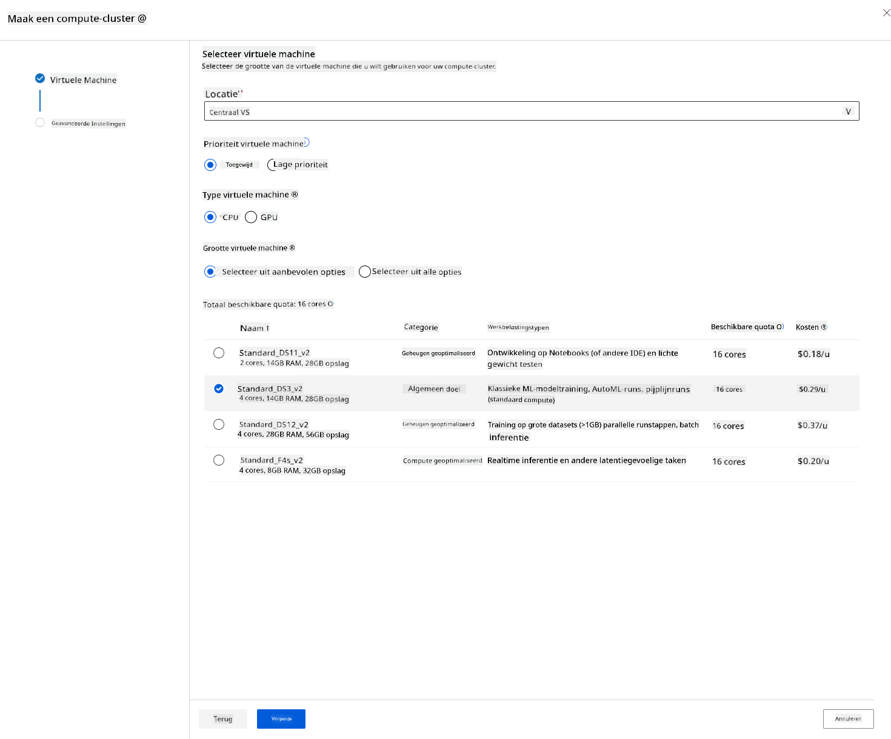

3. Geef het cluster een compute-naam.
4. Kies je opties: Minimum/Maximum aantal nodes, Idle seconden voordat het cluster afschaalt, SSH-toegang. Let op dat als het minimum aantal nodes 0 is, je geld bespaart wanneer het cluster inactief is. Let op dat hoe hoger het maximum aantal nodes, hoe korter de training zal zijn. Het aanbevolen maximum aantal nodes is 3.  
5. Klik op de knop "Creëren". Deze stap kan enkele minuten duren.

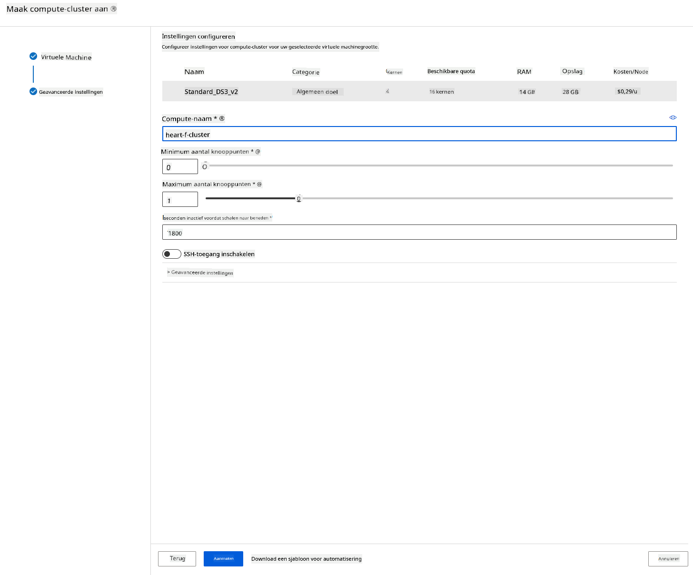

Geweldig! Nu we een compute-cluster hebben, moeten we de data laden naar Azure ML Studio.

### 2.3 Dataset laden

1. In de [Azure ML-werkruimte](https://ml.azure.com/) die we eerder hebben gemaakt, klik op "Datasets" in het linkermenu en klik op de knop "+ Dataset maken" om een dataset te maken. Kies de optie "Van lokale bestanden" en selecteer de Kaggle-dataset die we eerder hebben gedownload.
   
   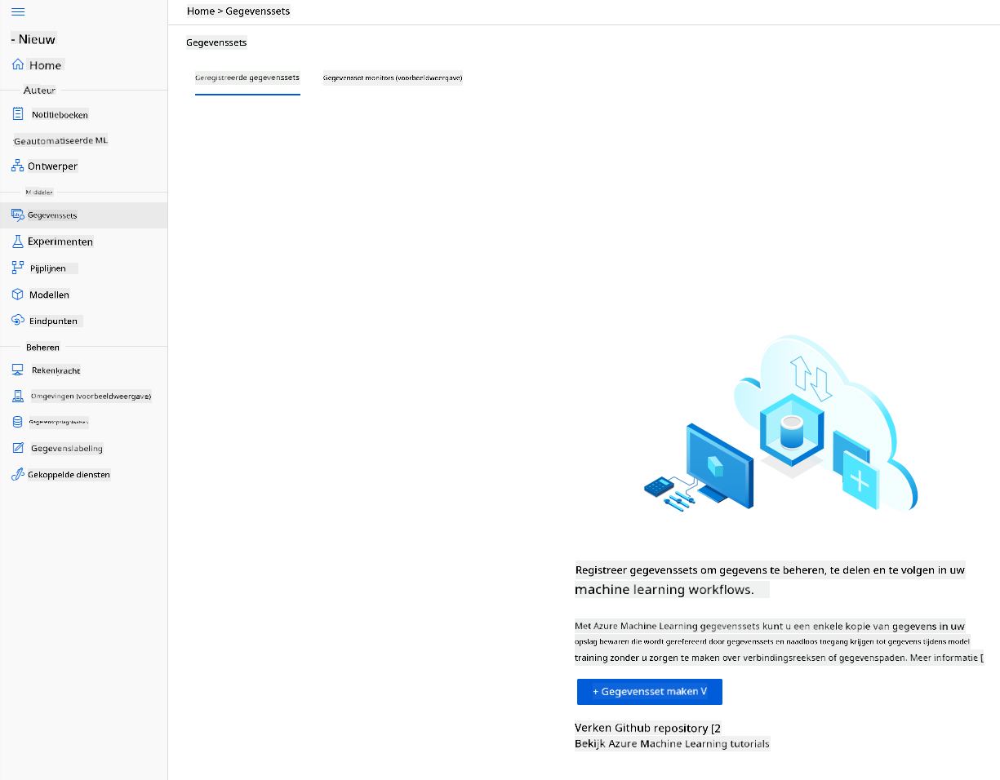

2. Geef je dataset een naam, een type en een beschrijving. Klik op Volgende. Upload de data vanuit bestanden. Klik op Volgende.
   
   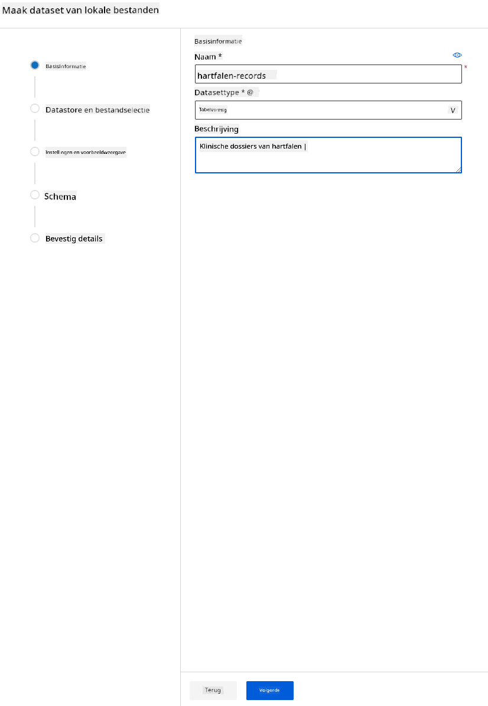

3. In het Schema, wijzig het datatype naar Boolean voor de volgende kenmerken: anaemia, diabetes, hoge bloeddruk, geslacht, roken en DEATH_EVENT. Klik op Volgende en klik op Creëren.
   
   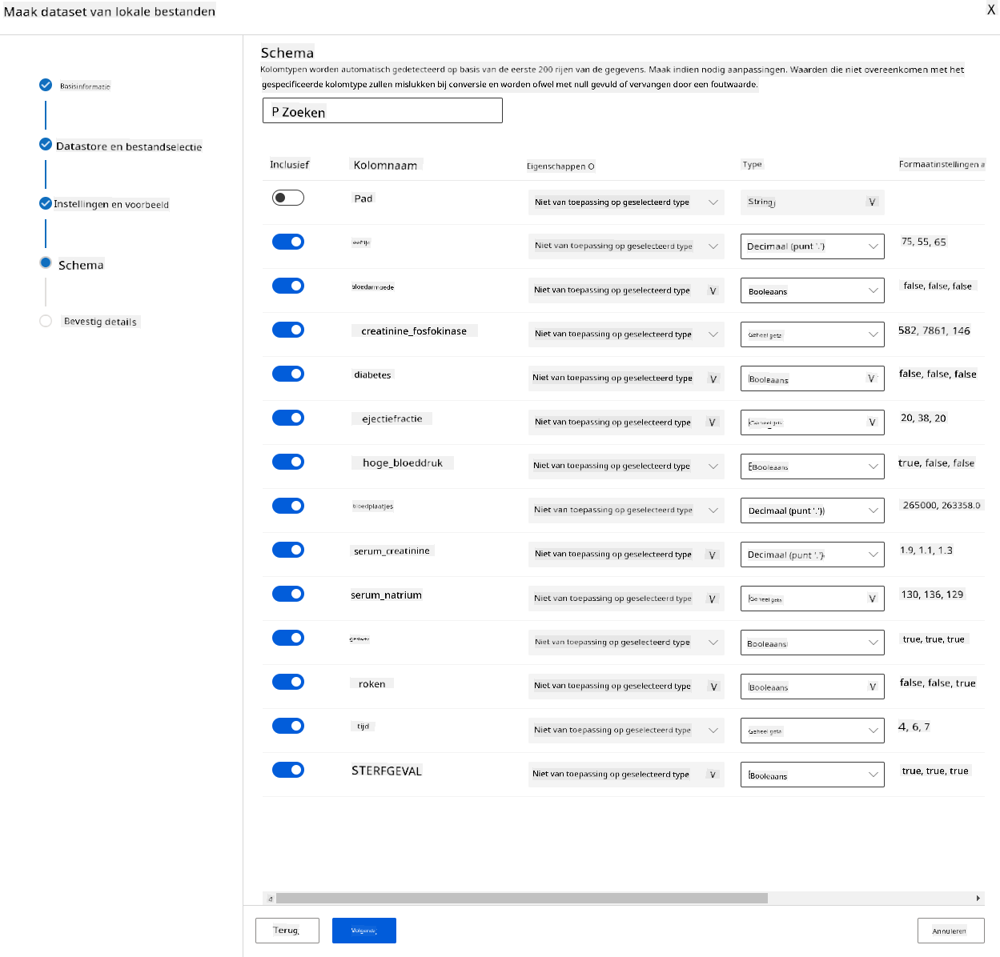

Geweldig! Nu de dataset is geladen en het compute-cluster is gemaakt, kunnen we beginnen met het trainen van het model!

### 2.4 Low code/No code training met AutoML

Traditionele machine learning-modelontwikkeling is arbeidsintensief, vereist aanzienlijke domeinkennis en tijd om tientallen modellen te produceren en te vergelijken. 
Automated machine learning (AutoML) is het proces van het automatiseren van de tijdrovende, iteratieve taken van machine learning-modelontwikkeling. Het stelt datawetenschappers, analisten en ontwikkelaars in staat om ML-modellen te bouwen met hoge schaal, efficiëntie en productiviteit, terwijl de modelkwaliteit behouden blijft. Het verkort de tijd die nodig is om productieklare ML-modellen te krijgen, met groot gemak en efficiëntie. [Meer informatie](https://docs.microsoft.com/azure/machine-learning/concept-automated-ml?WT.mc_id=academic-77958-bethanycheum&ocid=AID3041109)

1. In de [Azure ML-werkruimte](https://ml.azure.com/) die we eerder hebben gemaakt, klik op "Automated ML" in het linkermenu en selecteer de dataset die je zojuist hebt geüpload. Klik op Volgende.

   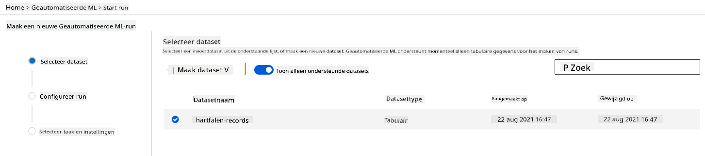

2. Voer een nieuwe experimentnaam in, de doelkolom (DEATH_EVENT) en het compute-cluster dat we hebben gemaakt. Klik op Volgende.
   
   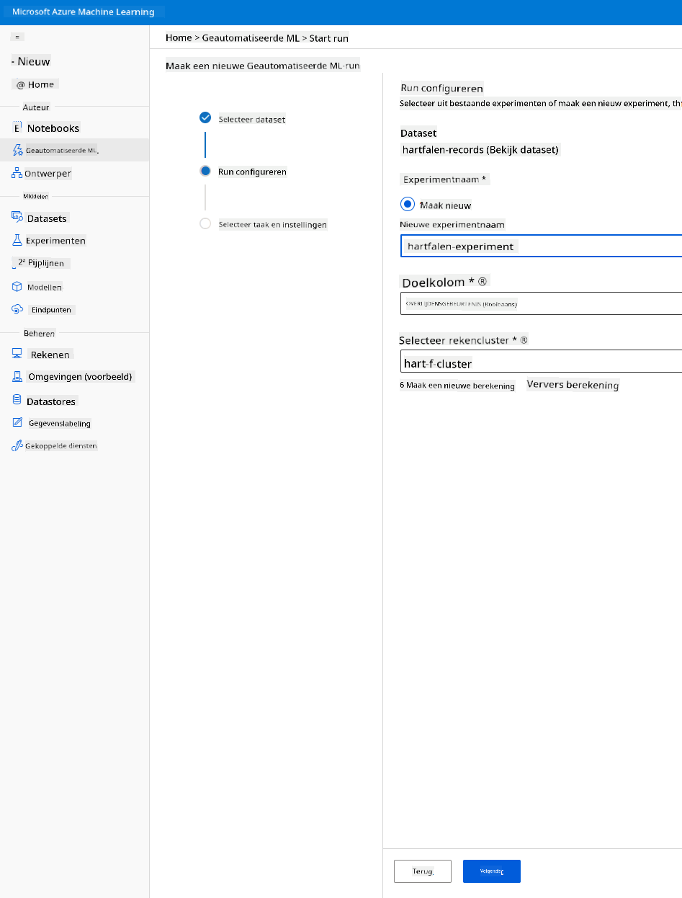

3. Kies "Classificatie" en klik op Voltooien. Deze stap kan tussen de 30 minuten en 1 uur duren, afhankelijk van de grootte van je compute-cluster.
    
    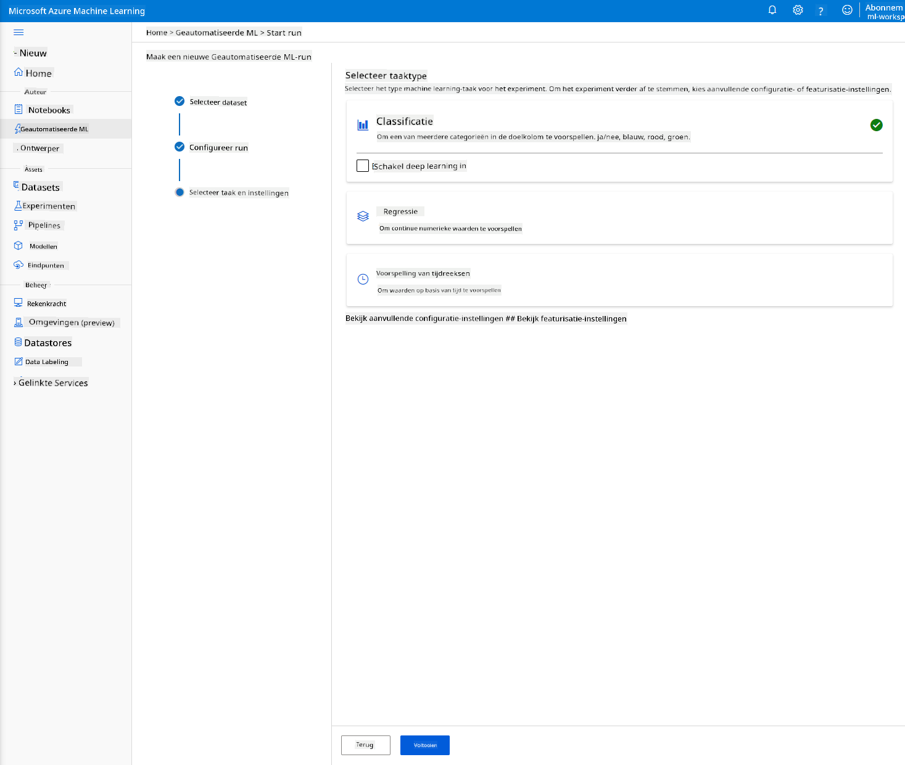

4. Zodra de run is voltooid, klik op het tabblad "Automated ML", klik op je run en klik op het algoritme in de kaart "Best model summary".
    
    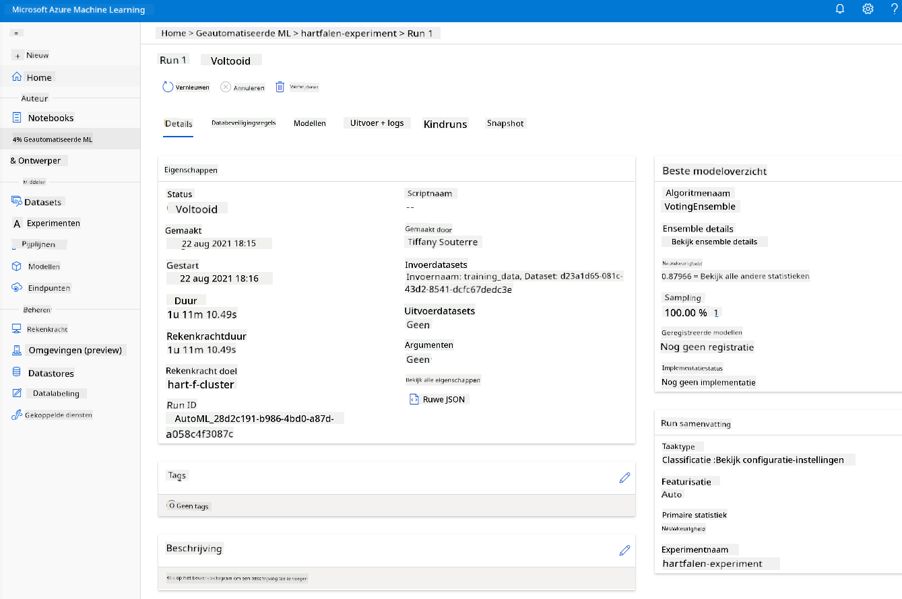

Hier kun je een gedetailleerde beschrijving zien van het beste model dat AutoML heeft gegenereerd. Je kunt ook andere modellen verkennen in het tabblad Modellen. Neem een paar minuten de tijd om de modellen te verkennen in de knop Uitleg (preview). Zodra je het model hebt gekozen dat je wilt gebruiken (hier kiezen we het beste model dat door AutoML is geselecteerd), zullen we zien hoe we het kunnen implementeren.

## 3. Low code/No code modelimplementatie en endpoint-consumptie
### 3.1 Modelimplementatie

De interface voor geautomatiseerde machine learning stelt je in staat om het beste model als een webservice te implementeren in een paar stappen. Implementatie is de integratie van het model zodat het voorspellingen kan doen op basis van nieuwe data en potentiële kansen kan identificeren. Voor dit project betekent implementatie naar een webservice dat medische applicaties het model kunnen gebruiken om live voorspellingen te doen over het risico van hun patiënten op een hartaanval.

Klik in de beschrijving van het beste model op de knop "Implementeren".
    
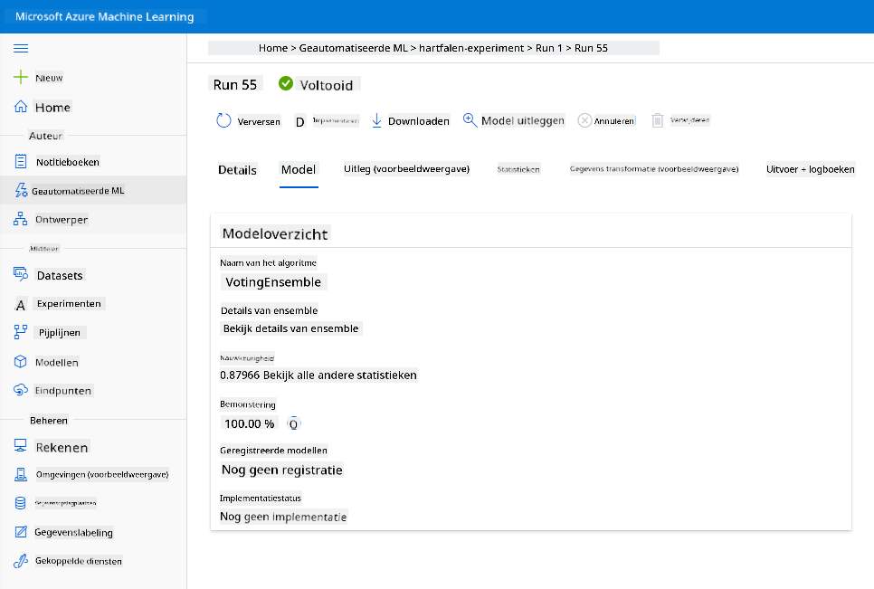

15. Geef het een naam, een beschrijving, computertype (Azure Container Instance), schakel authenticatie in en klik op Implementeren. Deze stap kan ongeveer 20 minuten duren. Het implementatieproces omvat verschillende stappen, waaronder het registreren van het model, het genereren van resources en het configureren ervan voor de webservice. Een statusbericht verschijnt onder Implementatiestatus. Selecteer Periodiek vernieuwen om de implementatiestatus te controleren. Het is geïmplementeerd en actief wanneer de status "Gezond" is.

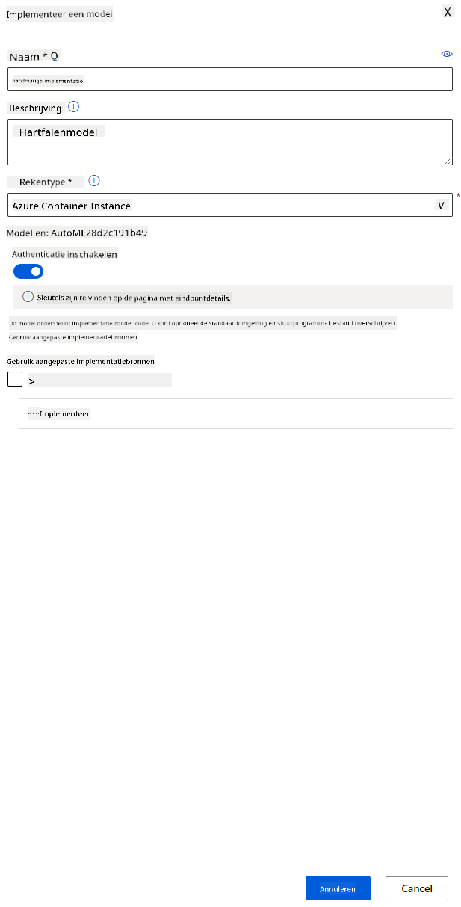

16. Zodra het is geïmplementeerd, klik op het tabblad Endpoint en klik op het endpoint dat je zojuist hebt geïmplementeerd. Hier kun je alle details vinden die je moet weten over het endpoint. 

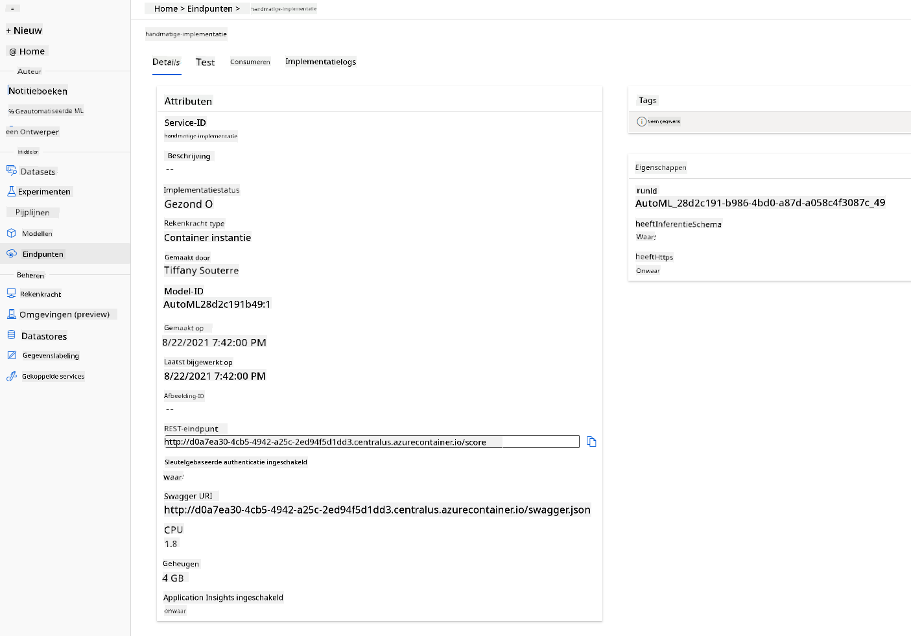

Geweldig! Nu we een model hebben geïmplementeerd, kunnen we beginnen met het consumeren van het endpoint.

### 3.2 Endpoint-consumptie

Klik op het tabblad "Consumeren". Hier kun je de REST-endpoint en een Python-script vinden in de consumptieoptie. Neem de tijd om de Python-code te lezen.

Dit script kan rechtstreeks vanaf je lokale machine worden uitgevoerd en zal je endpoint consumeren.

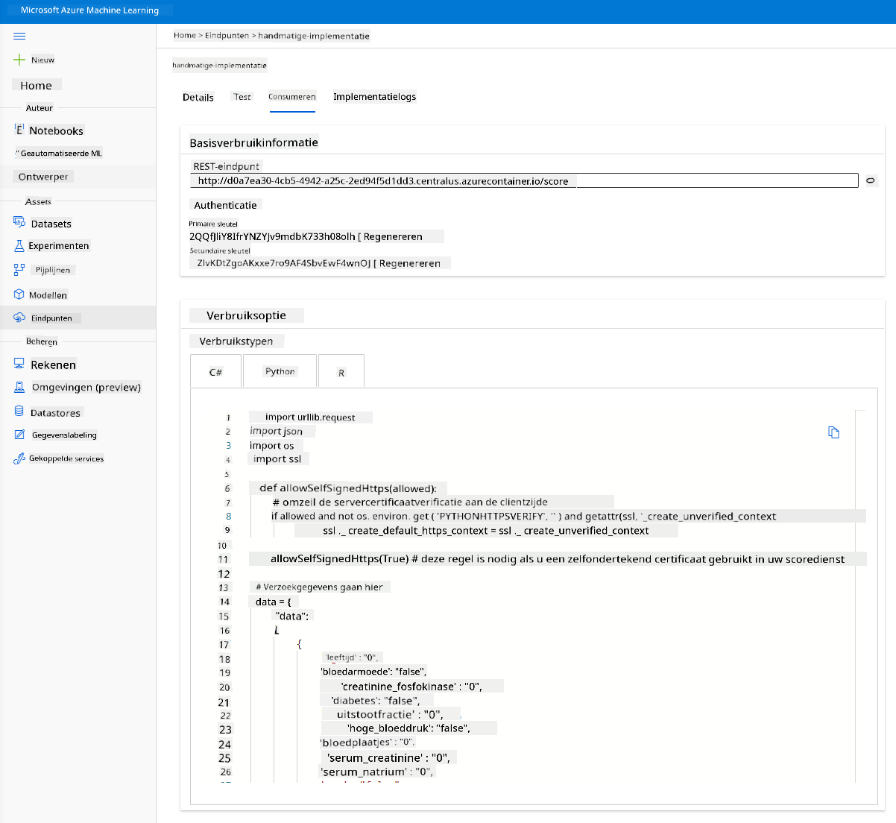

Neem een moment om deze 2 regels code te bekijken:

```python
url = 'http://98e3715f-xxxx-xxxx-xxxx-9ec22d57b796.centralus.azurecontainer.io/score'
api_key = '' # Replace this with the API key for the web service
```
De variabele `url` is de REST-endpoint die je vindt in het tabblad consumeren en de variabele `api_key` is de primaire sleutel die je ook vindt in het tabblad consumeren (alleen als je authenticatie hebt ingeschakeld). Dit is hoe het script het endpoint kan consumeren.

18. Bij het uitvoeren van het script zou je de volgende output moeten zien:
    ```python
    b'"{\\"result\\": [true]}"'
    ```
Dit betekent dat de voorspelling van hartfalen voor de gegeven data waar is. Dit is logisch omdat als je beter kijkt naar de data die automatisch in het script is gegenereerd, alles standaard op 0 en onwaar staat. Je kunt de data wijzigen met het volgende invoervoorbeeld:

```python
data = {
    "data":
    [
        {
            'age': "0",
            'anaemia': "false",
            'creatinine_phosphokinase': "0",
            'diabetes': "false",
            'ejection_fraction': "0",
            'high_blood_pressure': "false",
            'platelets': "0",
            'serum_creatinine': "0",
            'serum_sodium': "0",
            'sex': "false",
            'smoking': "false",
            'time': "0",
        },
        {
            'age': "60",
            'anaemia': "false",
            'creatinine_phosphokinase': "500",
            'diabetes': "false",
            'ejection_fraction': "38",
            'high_blood_pressure': "false",
            'platelets': "260000",
            'serum_creatinine': "1.40",
            'serum_sodium': "137",
            'sex': "false",
            'smoking': "false",
            'time': "130",
        },
    ],
}
```
Het script zou moeten retourneren:
    ```python
    b'"{\\"result\\": [true, false]}"'
    ```

Gefeliciteerd! Je hebt zojuist het geïmplementeerde model geconsumeerd en getraind op Azure ML!

> **_LET OP:_** Vergeet niet om alle resources te verwijderen zodra je klaar bent met het project.
## 🚀 Uitdaging

Bekijk de modeluitleg en details die AutoML heeft gegenereerd voor de beste modellen. Probeer te begrijpen waarom het beste model beter is dan de andere. Welke algoritmes zijn vergeleken? Wat zijn de verschillen tussen hen? Waarom presteert het beste model beter in dit geval?

## [Post-lecture quiz](https://ff-quizzes.netlify.app/en/ds/)

## Review & Zelfstudie

In deze les heb je geleerd hoe je een model kunt trainen, implementeren en consumeren om het risico op hartfalen te voorspellen op een Low code/No code manier in de cloud. Als je het nog niet hebt gedaan, duik dan dieper in de modeluitleg die AutoML heeft gegenereerd voor de beste modellen en probeer te begrijpen waarom het beste model beter is dan de andere.

Je kunt verder gaan met Low code/No code AutoML door deze [documentatie](https://docs.microsoft.com/azure/machine-learning/tutorial-first-experiment-automated-ml?WT.mc_id=academic-77958-bethanycheum&ocid=AID3041109) te lezen.

## Opdracht

[Low code/No code Data Science project op Azure ML](assignment.md)

---

**Disclaimer**:  
Dit document is vertaald met behulp van de AI-vertalingsservice [Co-op Translator](https://github.com/Azure/co-op-translator). Hoewel we ons best doen voor nauwkeurigheid, dient u zich ervan bewust te zijn dat geautomatiseerde vertalingen fouten of onnauwkeurigheden kunnen bevatten. Het originele document in zijn oorspronkelijke taal moet worden beschouwd als de gezaghebbende bron. Voor cruciale informatie wordt professionele menselijke vertaling aanbevolen. Wij zijn niet aansprakelijk voor eventuele misverstanden of verkeerde interpretaties die voortvloeien uit het gebruik van deze vertaling.